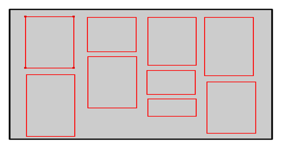

# 前端页面--瀑布流布局的实现

转眼间3个月没有更新了…..最近莫名的迷恋上了前端各种效果的实现了…..最近就记录一下我这几天做毕设时使用的一些效果吧~

今天记录的是我毕设中着重体现的布局风格--瀑布流布局。

说到瀑布流布局，先上张图片来说明一下什么是瀑布流好了。


这个是我毕设中的一个截图（内容是我暂时从其他网站上爬下来测试的….），那么我们从这张图片中就能看到大致来说瀑布流就是一些等宽不等高的图片来排列展示的，因为每张图片都不一样大，以及我在图片下面展示了各种信息都不一样，所以导致这些展示的框它们的高度都不统一，那么为什么却要要求它们之间的宽度相同呢？这就是瀑布流实现的关键了。

那么我们就来一步步的说明它是如何实现的，这个过程中也就理解了为什么是这样设计的了，首先，我们要在页面中排列出所要展示的框的个数，下面是这个瀑布流的结构图：



这张图片中白色的部分我们就当作是浏览器的可视区域了，那么中间这个灰色的部分我给他取名叫做‘main’，用来存放中间展示的图片，并且与页面中的其他元素分开，那么第一个问题就来了，我们如何知道在这个main中到底改放几张图片呢？而且这个main的宽度又该怎么定呢？上代码！

```css
#main{
    position: relative; text-align: center; margin: 0 auto;
}
```

我们先给它设置一下相对定位，并将这个div设置成居中，这里有个地方要注意的是，之前看了很多例子使用 text-align:  center  将div居中后发现并不起效，那是因为在设置text-align的同时并没有指定它的margin值，我们要将margin值也同时设置了之后居中的效果才会生效，因为要和页面顶部的导航栏配合，所以我在这里将margin的第一个值设置为0，第二个设置为自动（auto），为什么这么设置呢？

margin  简写属性在一个声明中设置所有外边距属性。该属性可以有 1 到 4  个值。这个简写属性设置一个元素所有外边距的宽度，或者设置各边上外边距的宽度。在这里要注意一下的是在css中，margin和padding这样的属性设置值的时候都是顺时针设置的，也就是上，右，下，左，这个顺序来的。

那么当margin的值为四个的时候这4个的值依次为：上外边距，右外边距，下外边距，左外边距。

当为三个值的时候顺序依次为：上外边距，左右外边距，下外边距。

当为两个值的时候顺序依次为：上下外边距，左右外边距。

当为一个值的时候就是全部的外边距了。

现在我们就要开始放图片了，这也就是为什么我们要使用等宽的图片了，因为宽度固定我们才能动态的算出不同大小的浏览器能放几张图片来展示了。

这里我并没有先设置main的宽度，而是在计算出放置几张图片之后才设置它的宽度，因为我们不仅仅是展示图片，还有图片下面的内容，所以在计算每张图片的宽度的时候要将包裹图片的容器也算进来，也就是上面图片中红色框的宽度，而且由于每个展示框之间还有margin值，所以我们在计算的时候也是要考虑的，因为我使用的是jquery，所以在这里我通过  outerWidth() 方法来取得宽度值。

```js
//动态添加瀑布图片的功能函数
function waterfall() {
    //取得展示框对象
    var $boxs = $("#main>div");
    // 一个块框的宽
    var w = $boxs.eq(0).outerWidth();
    //每行中能容纳的展示框个数【窗口宽度除以一个块框宽度】
    var cols = Math.floor(($(window).width() - 30) / w);
    //给最外围的main元素设置宽度和外边距
    $('#main').width(w * cols).css('margin', 'o auto');
    //用于存储 每列中的所有块框相加的高度。
    var hArr = [];
    $boxs.each(function(index, value) {
        var h = $boxs.eq(index).outerHeight();
        if (index < cols) {
            hArr[index] = h; //第一行中的num个块框 先添加进数组HArr
        } else {
            var minH = Math.min.apply(null, hArr); //数组HArr中的最小值minH
            var minHIndex = $.inArray(minH, hArr);
            $(value).css({
                'position': 'absolute',
                'top': minH + 'px',
                'left': minHIndex * w + 'px'
            });
            //数组 最小高元素的高 + 添加上的展示框[i]块框高
            hArr[minHIndex] += $boxs.eq(index).outerHeight(); //更新添加了块框后的列高
        }
    });
}
```

这里的思路就是先取得浏览器的可视宽度，然后通过除以每个展示框的宽度来计算出一排可以展示多少个展示框的，然后通过一个数组  hArr来保持每一列的高度，我在这里使用jquery中的each方法来循环保存每一列的高度，这里传入的两个参数，index是展示框的索引号，value为这个展示框的jquery对象。

首先根据索引号来取到对应展示框的高度，这个高度是包含了margin的全部宽度，然后将这个值保存在数组中，由于之前求出了每一行最多的块数，所以在这里进行一个判断，将第一行首先填满，然后开始填充第二排的展示框，我使用Math.min.apply()方法来取得数组中的最小值，然后通过jquery提供的  inArray()  方法来取得最小值所在的是哪一列，第一个参数是最小值，第二个参数是需要判断的数组，然后我们将对应的展示框填充进去，最后将新加入的展示框的完整高度加上之前最小的高度重新保存到数组中，继续循环判断，从而不断的新增展示框。

那么现在我们就要通过后台传来的json数据动态的生成新的展示框来提供添加了，因为每个项目所要展示的内容都不一样，我在这里就不展示具体的代码 了，接下来就是要通过监听滚动条的滑动来判断什么时候开始动态添加新展示框了。

接下来我就讲一下我判断的思路，首先是在第一组展示框添加完成后取得最后一个展示框的填充高度，然后加上这个展示框自身高度的一边，因为我觉得用户一般会浏览到最后一个的附近的时候就该开始动态填充了，所以我在这里就判断当前滚动条滚动的距离是不是大于页面默认的高度加上最后一个展示框到屏幕顶端的高度，如果大于了说明就该继续填充展示框了：

```js
//监听滚动条
window.onscroll = function() {
    if (checkscrollside()) {
        AddWaterfall(dataInt); //这个是动态填充新展示框的函数
        waterfall();
    };
}
//判断是否需要继续加载瀑布流
function checkscrollside() {
    var $lastBox = $('#main>div').last();
    var lastBoxDis = $lastBox.offset().top + Math.floor($lastBox.outerHeight() / 2);
    var scrollTop = $(window).scrollTop();
    var documentH = $(window).height();
    return (lastBoxDis < scrollTop + documentH) ? true : false;
}
```

现在整个瀑布流的展示就完成了，今天在这里记录下来，留已备用。