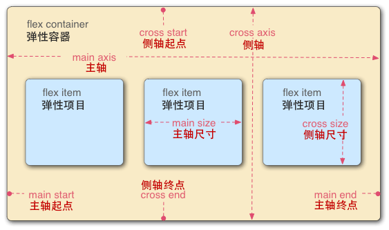
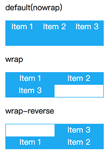

# Flex语法指南

弹性布局`flex`是一个几年前的CSS属性了，说它解放了一部分生产力不为过。至少解放了不少CSS布局相关的面试题 :），之前网上流行的各种*XX布局*，什么`postion: absolute`+`margin`，`float`+`padding`，各种都可以使用`flex`来取代之。
早两年在使用的时候，还是会担心有兼容性问题的，某些手机在使用了`auto-prefixer`以后依然会出现不兼容的问题。好在现在已经是2018年了，不必再担心那些老旧的设备，希望这篇文章能帮你加深对`flex`的认识。

## 准备工作

首先，`flex`被称为一个弹性盒模型，也有称弹性布局的。
总之，盒子也好、布局也罢，我们总是需要有一个容器`Container`的：

```html
<div class="container"></div>
```

以及如果单纯的只是一个容器的话，是没有任何意义的。
所以我们还需要有一些内容：

```html
<div class="contianer">
  <div class="item"></div>
  <div class="item"></div>
</div>
```

下边的所有例子基本都是基于以上DOM结构来做的。

## 基本语法

现在我们已经有一个可以用来写`flex`布局的`html`结构。
接下来就是一个最基础的`flex`布局的实现：

```css
.container {
    display: flex;
    height: 50px;
    color: #fff;
    border: 1px solid #03a9f4;
  }

  .item {
    flex: 1;
    text-align: center;
    background: #03a9f4;
  }
```

```html
<div class="contianer">
  <div class="item">item</div>
  <div class="item">item</div>
</div>
```

我们在容器上使用`display: flex`来告诉浏览器，这是一个`flex`布局的开始。
然后给所有的`item`添加一个`flex: 1`的属性，来表明，我们这里边的元素都是`flex`布局中的内容，
我们会沿着**主轴**来**平分**所有的区域，就这样，我们已经实现了一个多列等宽布局。

关于`flex`，最重要的就是要记住他有两条轴线（主轴、交叉轴），绝大部分属性都是依赖于轴线的方向。



> 图片来自[MDN](https://link.juejin.im/?target=https%3A%2F%2Fdeveloper.mozilla.org%2Fzh-CN%2Fdocs%2FWeb%2FCSS%2FCSS_Flexible_Box_Layout%2FUsing_CSS_flexible_boxes)

因为`flex`布局分为了容器和内容两块，各自有各自的属性，所以就先从容器类的说起。

## 容器相关的flex属性

实现上边的需求，是依赖于很多默认属性值。
比如，为什么我们的子元素会横向的进行分割空间，而不是竖向的，这里就用到了一个属性的默认值：

### flex-direction

`flex-direction`用于定义`flex`布局中的主轴方向。
默认取值为`row`，是横向的，表示从左到右，也就是说我们的所有子元素会按照从左到右的顺序进行排列。
我们可以通过设置值为`column`来改变主轴的方向，将其修改为从上到下。（改变`flex-direction`的值会影响到一些相关的属性，会在下边说到）

`flex-direction`共有四个有效值可选：

1. `row` 默认值，从左到右
2. `row-reverse` 从右到左
3. `column` 从上到下
4. `column-reverse` 从下到上

*P.S. 在React-Native中默认的主轴方向为column*

所以说`flex-direction`的作用就是：**定义容器中元素的排列方向**

### flex-wrap

该属性用于定义当子元素沿着主轴超出容器范围后，应该按照怎样的规则进行排列。
该属性只有简单的三个取值：

1. `wrap` 超出主轴范围后换行显示，换行方向按照交叉轴的方向来（*默认情况下就是折行到下一行*）
2. `wrap-reverse` 超出主轴范围后换行显示，但是方向是交叉轴的反向（*也就是默认情况下第一行会出现在最下边*）
3. `nowrap` 即使超出容器也不会进行换行，而是尝试压缩内部flex元素的宽度（*在下边的子元素相关的属性会讲到*）

三种取值的示例：




## 总结

`flex`相关的属性如何拆分以后，并不算太多。
脑海中有主轴和交叉轴的概念之后，应该会变得清晰一些。
关于上述所有属性的一个简单总结：

### 容器相关

| 属性名            | 作用                                                         |
| :---------------- | ------------------------------------------------------------ |
| `flex-direction`  | 用来设置主轴的方向，最基础的属性，默认从左到右，此属性一改，下列所有的属性都要跟着改，真可谓牵一发而动全身 |
| `flex-wrap`       | 设置元素超出容器后的换行规则，默认不换行                     |
| `justify-content` | 设置沿主轴的排列规则                                         |
| `align-content`   | 设置沿交叉轴的排列规则                                       |
| `align-items`     | 以行（默认`direction`情况下）为单位，设置沿交叉轴的排列规则  |

### 元素相关

| 属性名        | 作用                                                 |
| ------------- | ---------------------------------------------------- |
| `flex-grow`   | 当容器大于所有元素时，按什么比例将剩余空间分配给元素 |
| `flex-shrink` | 当容器小于所有元素时，元素按照什么比例来缩小自己     |
| `flex-basis`  | 很少用的属性，设置在容器中的宽(高)                   |
| `align-self`  | 针对某些元素单独设置`align-items`相关的效果          |
| `order`       | 设置元素在显示上的顺序                               |

### 简写

| 属性名          | 作用                                           |
| --------------- | ---------------------------------------------- |
| `flex-flow`     | `flex-direction`与`flex-wrap`的简写            |
| `place-content` | `justify-content`与`align-content`的简写       |
| `flex`          | `flex-grow`、`flex-shrink`与`flex-basis`的简写 |

以及文中所有的示例代码都在这里 [code here](https://link.juejin.im/?target=https%3A%2F%2Fgithub.com%2Fjiasm%2Fnotebook%2Ftree%2Fmaster%2Fhtml%2Fflex)。