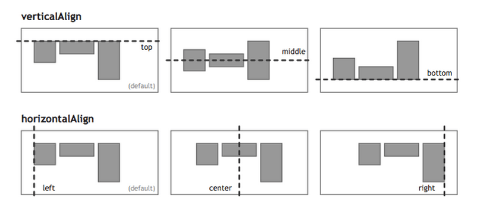
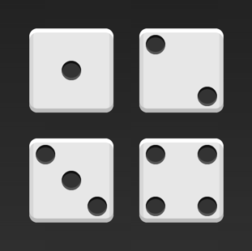
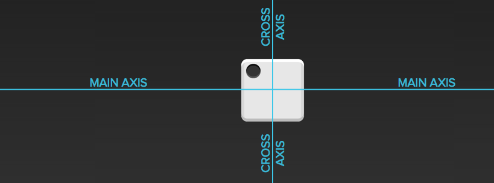
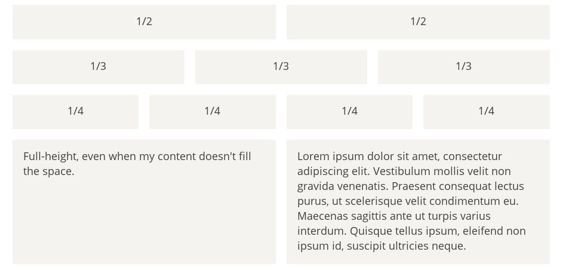
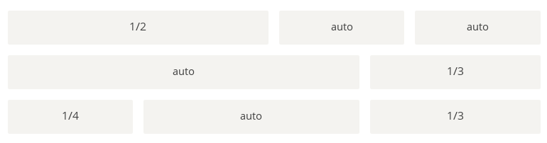
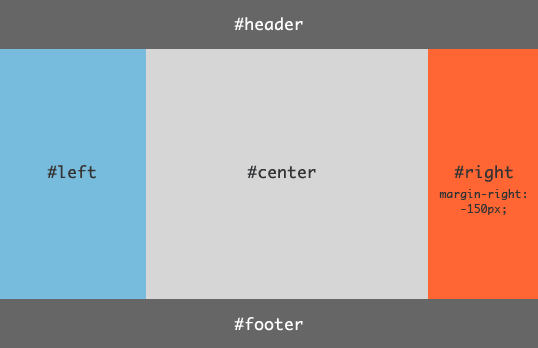

# Flex 布局教程：实例篇

[上一篇文章](http://www.ruanyifeng.com/blog/2015/07/flex-grammar.html)介绍了Flex布局的语法，今天介绍常见布局的Flex写法。

你会看到，不管是什么布局，Flex往往都可以几行命令搞定。



我只列出代码，详细的语法解释请查阅[《Flex布局教程：语法篇》](http://www.ruanyifeng.com/blog/2015/07/flex-grammar.html)。我的主要参考资料是[Landon Schropp](http://davidwalsh.name/flexbox-dice)的文章和[Solved by Flexbox](http://philipwalton.github.io/solved-by-flexbox/)。

## 一、骰子的布局

骰子的一面，最多可以放置9个点。



下面，就来看看Flex如何实现，从1个点到9个点的布局。你可以到[codepen](http://codepen.io/LandonSchropp/pen/KpzzGo)查看Demo。



如果不加说明，本节的HTML模板一律如下。

```html
<div class="box">
  <span class="item"></span>
</div>
```

上面代码中，div元素（代表骰子的一个面）是Flex容器，span元素（代表一个点）是Flex项目。如果有多个项目，就要添加多个span元素，以此类推。

## 二、网格布局

### 2.1 基本网格布局

最简单的网格布局，就是平均分布。在容器里面平均分配空间，跟上面的骰子布局很像，但是需要设置项目的自动缩放。



HTML代码如下。

```html
<div class="Grid">
  <div class="Grid-cell">...</div>
  <div class="Grid-cell">...</div>
  <div class="Grid-cell">...</div>
</div>
```

CSS代码如下。

```css
.Grid {
  display: flex;
}

.Grid-cell {
  flex: 1;
}
```

### 2.2 百分比布局

某个网格的宽度为固定的百分比，其余网格平均分配剩余的空间。



HTML代码如下。

```html
<div class="Grid">
  <div class="Grid-cell u-1of4">...</div>
  <div class="Grid-cell">...</div>
  <div class="Grid-cell u-1of3">...</div>
</div>
```

CSS代码如下。

```css
.Grid {
  display: flex;
}

.Grid-cell {
  flex: 1;
}

.Grid-cell.u-full {
  flex: 0 0 100%;
}

.Grid-cell.u-1of2 {
  flex: 0 0 50%;
}

.Grid-cell.u-1of3 {
  flex: 0 0 33.3333%;
}

.Grid-cell.u-1of4 {
  flex: 0 0 25%;
}
```

## 三、圣杯布局

[圣杯布局](https://en.wikipedia.org/wiki/Holy_Grail_(web_design))（Holy Grail Layout）指的是一种最常见的网站布局。页面从上到下，分成三个部分：头部（header），躯干（body），尾部（footer）。其中躯干又水平分成三栏，从左到右为：导航、主栏、副栏。



HTML代码如下。

```html
<body class="HolyGrail">
  <header>...</header>
  <div class="HolyGrail-body">
    <main class="HolyGrail-content">...</main>
    <nav class="HolyGrail-nav">...</nav>
    <aside class="HolyGrail-ads">...</aside>
  </div>
  <footer>...</footer>
</body>
```

CSS代码如下。

```css
.HolyGrail {
  display: flex;
  min-height: 100vh;
  flex-direction: column;
}

header,
footer {
  flex: 1;
}

.HolyGrail-body {
  display: flex;
  flex: 1;
}

.HolyGrail-content {
  flex: 1;
}

.HolyGrail-nav, .HolyGrail-ads {
  /* 两个边栏的宽度设为12em */
  flex: 0 0 12em;
}

.HolyGrail-nav {
  /* 导航放到最左边 */
  order: -1;
}
```

如果是小屏幕，躯干的三栏自动变为垂直叠加。

```css
@media (max-width: 768px) {
  .HolyGrail-body {
    flex-direction: column;
    flex: 1;
  }
  .HolyGrail-nav,
  .HolyGrail-ads,
  .HolyGrail-content {
    flex: auto;
  }
}
```