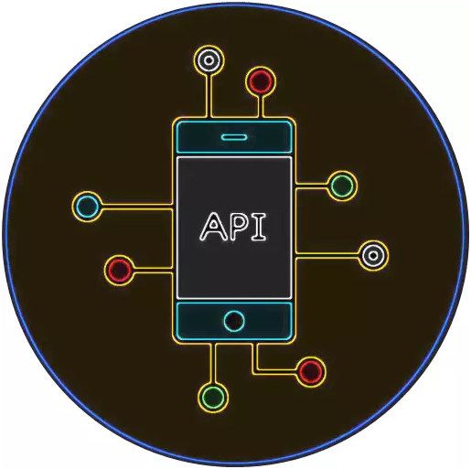
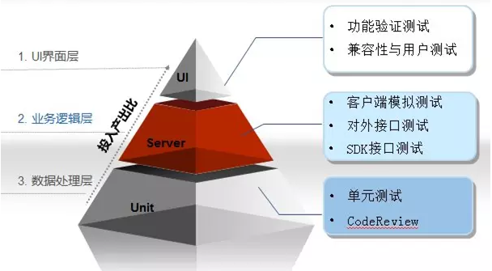
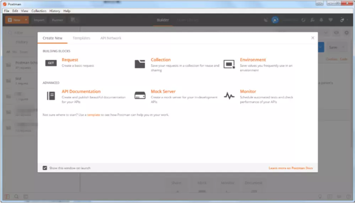
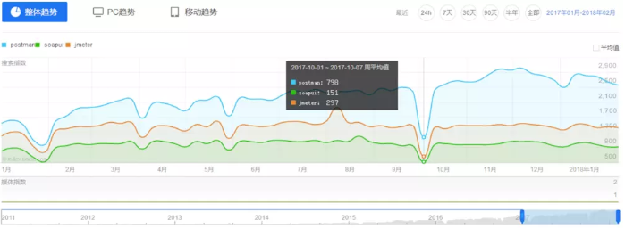
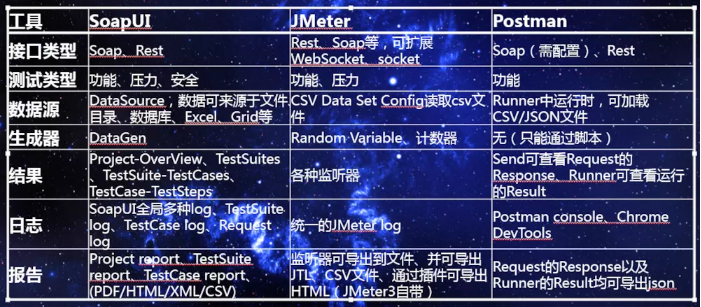
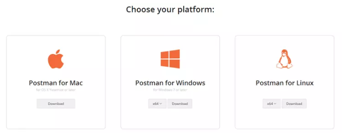
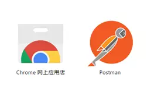
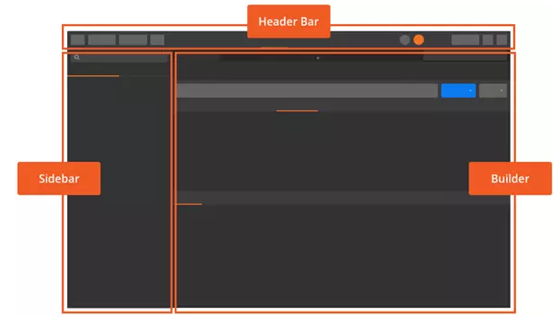
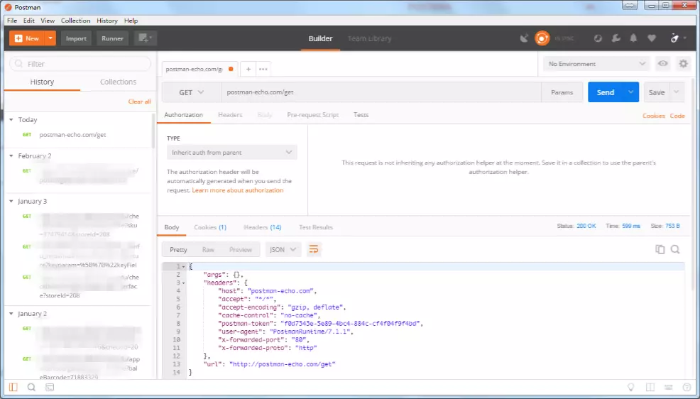

# Postman使用入门及实践思考

## 起因

由于很早就接触过 Postman，感觉确实挺好用的，因此在测试内部培训时，我准备了 Postman 工具的使用入门培训 PPT，经人提醒特此整理成文字形式。为了更好的说明，我适当补充了些文字。

## 概述

### 接口定义

**接口**：这里特指软件接口，是指对协定进行定义的引用类型。通俗讲是就是软件系统不同组成部分衔接的约定。

通常就是所谓的API （`Application Programming Interface`） 应用程序编程接口，其表现的形式是源代码。

### 接口测试定义

接口测试是测试系统组件间接口的一种测试。

>接口测试主要用于检测外部系统与系统之间以及内部各个子系统之间的交互点。测试的重点是要检查数据的交换，传递和控制管理过程，以及系统间的相互逻辑依赖关系等。
>——《百度百科》

### Postman简介

Postman是由Postdot Technologies公司打造的一款功能强大的调试HTTP接口的工具，它最早是Chrome中最受欢迎的插件之一，现已扩展到Mac，Windows和Linux客户端。

软件功能非常强大，界面简洁明晰、操作方便快捷，设计得很人性化。

### Postman主要特征

1. 简单易用的图形用户界面；
2. 保存API请求的历史记录；
3. 无限制的使用集合、环境变量、运行测试和共享集合；
4. 可用集合Runner来自动化测试；
5. 灵活的API监控，运行时间、性能和准确；
6. 模拟服务器，支持split-stack开发。

## 接口工具对比

### 指数对比

可以看到近1年里，大家对于Postman的关注度一直很高，最近几个月的涨幅更高了。

题外话：十一放假，都出去玩儿了，没人用百度了。

### 竞品对比

Postman在同类竞品中，并不是那么全面的，但为什么还有辣么多人用呢？我们往下看。

### Postman具体优势

总结的几点参考优势。

1. 简洁性：软件界面设计简洁有设计感；
2. 易用性：容易上手，查看官方文档或搜搜博客，可以很快地掌握其用法；
3. 实用性：可以快速进行开发调试，并展示响应结果， URL 创建简单，且方便查看与管理；
4. 同步性：同步并备份账号数据（集合、文件夹、要求、回应、标题预设、环境、环境变量、全局变量、收集运行结果）。

## Postman入门

### 安装

**Postman：**

可用作Mac，Windows和Linux操作系统的本地应用程序。

要安装Postman，请转至官网，然后单击下载适用于Mac / Windows / Linux的客户端。

安装过程没有特别需要说明的，具体安装步骤不赘述，详情查看官网。

**Postman Chrome插件：**

目前推荐客户端，由于Chrome插件已被弃用，但插件还可以继续运行，且只能在Chrome浏览器上运行。

### 界面设计

Header toolbar 标题栏即顶部工具栏，包含主要功能。

Sidebar 侧边栏可以查找、管理请求和集合。侧边栏分两个主要选项卡：  History（历史记录）和 Collections（集合）。

Builder 构建器，在构建器中发送和管理API请求。上半部分是请求构建器，下半部分是响应查看器。

Status bar 状态栏在底部，提供了部分功能的快捷方式。

想了解更多可以查看Postman[官方文档](https://link.jianshu.com/?t=https%3A%2F%2Fwww.getpostman.com%2Fdocs%2F)。

参考资料：

1. Postman | API Development Environment：[https://www.getpostman.com/](https://link.jianshu.com/?t=https%3A%2F%2Fwww.getpostman.com%2F)
2. Newman：[https://www.npmjs.com/package/newman](https://link.jianshu.com/?t=https%3A%2F%2Fwww.npmjs.com%2Fpackage%2Fnewman)

