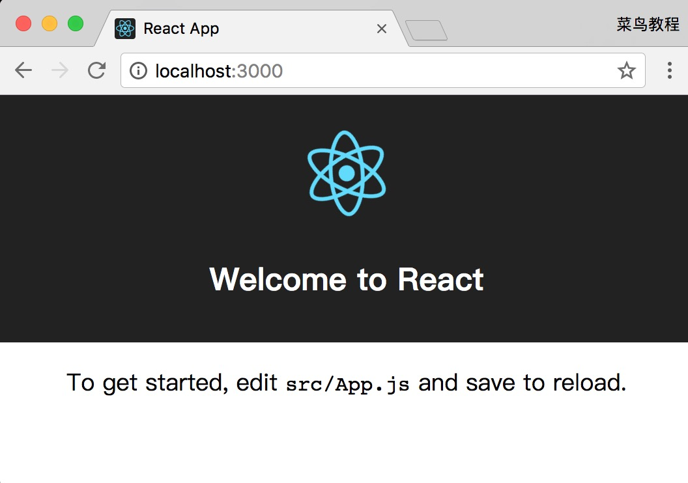
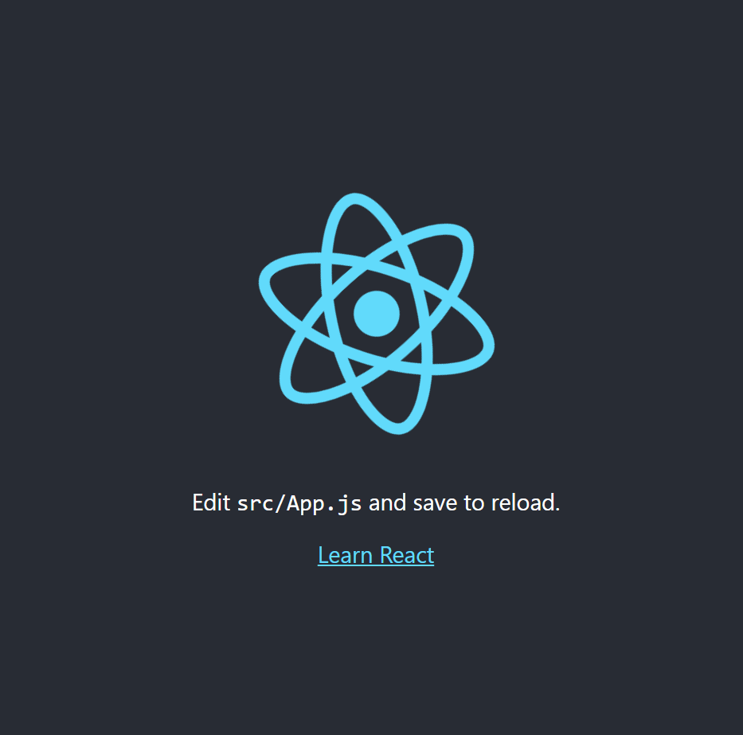

# React 教程


* React 是一个用于构建用户界面的 JAVASCRIPT 库。
* React主要用于构建UI，很多人认为 React 是 MVC 中的 V（视图）。
* React 起源于 Facebook 的内部项目，用来架设 Instagram 的网站，并于 2013 年 5 月开源。
* React 拥有较高的性能，代码逻辑非常简单，越来越多的人已开始关注和使用它。

## React 特点

- **1. 声明式设计** −React采用声明范式，可以轻松描述应用。
- **2. 高效** −React通过对DOM的模拟，最大限度地减少与DOM的交互。
- **3. 灵活** −React可以与已知的库或框架很好地配合。
- **4. JSX** − JSX 是 JavaScript 语法的扩展。React 开发不一定使用 JSX ，但我们建议使用它。
- **5. 组件** − 通过 React 构建组件，使得代码更加容易得到复用，能够很好的应用在大项目的开发中。
- **6. 单向响应的数据流** − React 实现了单向响应的数据流，从而减少了重复代码，这也是它为什么比传统数据绑定更简单。

## 阅读本教程前，您需要了解的知识：

在开始学习 React 之前，您需要具备以下基础知识：

- HTML5
- CSS
- JavaScript

## React 第一个实例

在每个章节中，您可以在线编辑实例，然后点击按钮查看结果。

本教程使用了 React 的版本为 16.4.0，你可以在官网 <https://reactjs.org/> 下载最新版。

```html
<!DOCTYPE html>
<html>
  <head>
    <meta charset="UTF-8"/>
    <title>Hello React!</title>
    <script src="https://cdn.staticfile.org/react/16.4.0/umd/react.development.js"></script>
    <script src="https://cdn.staticfile.org/react-dom/16.4.0/umd/react-dom.development.js"></script>
    <script src="https://cdn.staticfile.org/babel-standalone/6.26.0/babel.min.js"></script>
  </head>
  <body>

    <div id="example"></div>
    <script type="text/babel">
      ReactDOM.render(
	<h1>Hello, world!</h1>,
	document.getElementById('example')
);
</script>

</body>
</html>
```

# React 安装

React 可以直接下载使用，下载包中也提供了很多学习的实例。

本教程使用了 React 的版本为 16.4.0，你可以在官网 <https://reactjs.org/> 下载最新版。

你也可以直接使用 Staticfile CDN 的 React CDN 库，地址如下：

```html
<script src="https://cdn.staticfile.org/react/16.4.0/umd/react.development.js"></script>
<script src="https://cdn.staticfile.org/react-dom/16.4.0/umd/react-dom.development.js"></script>
<!-- 生产环境中不建议使用 -->
<script src="https://cdn.staticfile.org/babel-standalone/6.26.0/babel.min.js"></script>
```

官方提供的 CDN 地址：

```html
<script src="https://unpkg.com/react@16/umd/react.development.js"></script>
<script src="https://unpkg.com/react-dom@16/umd/react-dom.development.js"></script>
<!-- 生产环境中不建议使用 -->
<script src="https://unpkg.com/babel-standalone@6.15.0/babel.min.js"></script>
```

**注意:** 在浏览器中使用 Babel 来编译 JSX 效率是非常低的。

## 使用实例

以下实例输出了 Hello, world!

```html
<!DOCTYPE html>
<html>
  <head>
    <meta charset="UTF-8"/>
    <title>Hello React!</title>
    <script src="https://cdn.staticfile.org/react/16.4.0/umd/react.development.js"></script>
    <script src="https://cdn.staticfile.org/react-dom/16.4.0/umd/react-dom.development.js"></script>
    <script src="https://cdn.staticfile.org/babel-standalone/6.26.0/babel.min.js"></script>
  </head>
  <body>

    <div id="example"></div>
    <script type="text/babel">
      ReactDOM.render(
    <h1>Hello, world!</h1>,
    document.getElementById('example')
);
</script>

</body>
</html>
```

**实例解析：**

实例中我们引入了三个库： react.min.js 、react-dom.min.js 和 babel.min.js：

- **react.min.js** - React 的核心库
- **react-dom.min.js** - 提供与 DOM 相关的功能
- **babel.min.js** - Babel 可以将 ES6 代码转为 ES5 代码，这样我们就能在目前不支持 ES6 浏览器上执行 React 代码。Babel 内嵌了对 JSX 的支持。通过将 Babel 和 babel-sublime 包（package）一同使用可以让源码的语法渲染上升到一个全新的水平。

```html
ReactDOM.render(
    <h1>Hello, world!</h1>,
    document.getElementById('example')
);
```

以上代码将一个 h1 标题，插入 id="example" 节点中。

> **注意：**
>
> 如果我们需要使用 JSX，则 `<script>` 标签的 type 属性需要设置为 text/babel。

## 通过 npm 使用 React

如果你的系统还不支持 Node.js 及 NPM 可以参考我们的 [Node.js 教程](http://www.runoob.com/nodejs/nodejs-tutorial.html)。

我们建议在 React 中使用 CommonJS 模块系统，比如 browserify 或 webpack，本教程使用 webpack。

国内使用 npm 速度很慢，你可以使用淘宝定制的 cnpm (gzip 压缩支持) 命令行工具代替默认的 npm：

```bash
$ npm install -g cnpm --registry=https://registry.npm.taobao.org
$ npm config set registry https://registry.npm.taobao.org
```

这样就可以使用 cnpm 命令来安装模块了：

```bash
$ cnpm install [name]
```

更多信息可以查阅：<http://npm.taobao.org/>。

## 使用 create-react-app 快速构建 React 开发环境

create-react-app 是来自于 Facebook，通过该命令我们无需配置就能快速构建 React 开发环境。

create-react-app 自动创建的项目是基于 Webpack + ES6 。

执行以下命令创建项目：

```bash
$ cnpm install -g create-react-app
$ create-react-app my-app
$ cd my-app/
$ npm start
```

在浏览器中打开 **http://localhost:3000/** ，结果如下图所示：



项目的目录结构如下：

```
my-app/
  README.md
  node_modules/
  package.json
  .gitignore
  public/
    favicon.ico
    index.html
    manifest.json
  src/
    App.css
    App.js
    App.test.js
    index.css
    index.js
    logo.svg
```

manifest.json 指定了开始页面 index.html，一切的开始都从这里开始，所以这个是代码执行的源头。

尝试修改 src/App.js 文件代码：

```js
import React, { Component } from 'react'
import logo from './logo.svg'
import './App.css'

class App extends Component {
  render() {
    return (
      <div className="App">
        <header className="App-header">
          
          <p>
            Edit <code>src/App.js</code> and save to reload.
          </p>
          <a
            className="App-link"
            href="https://reactjs.org"
            target="_blank"
            rel="noopener noreferrer"
          >
            Learn React
          </a>
        </header>
      </div>
    )
  }
}

export default App

```

修改后，打开 http://localhost:3000/ （一般自动刷新），输出结果如下：



