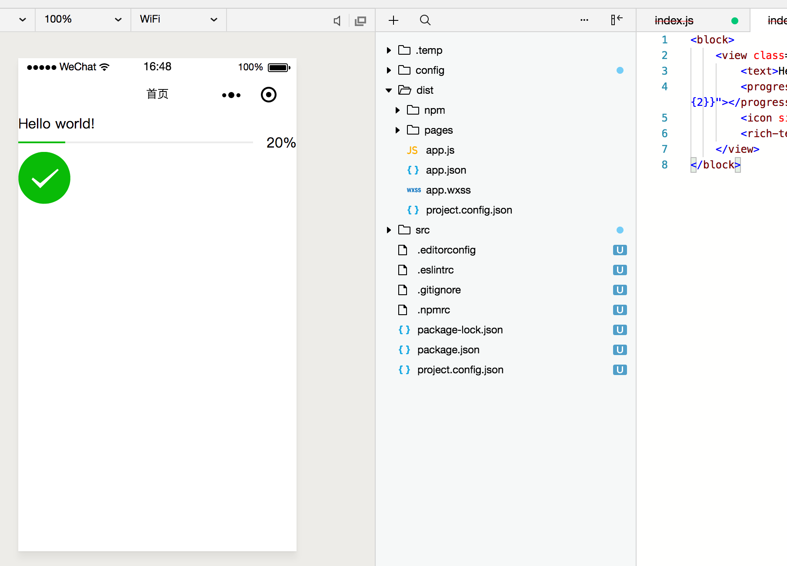
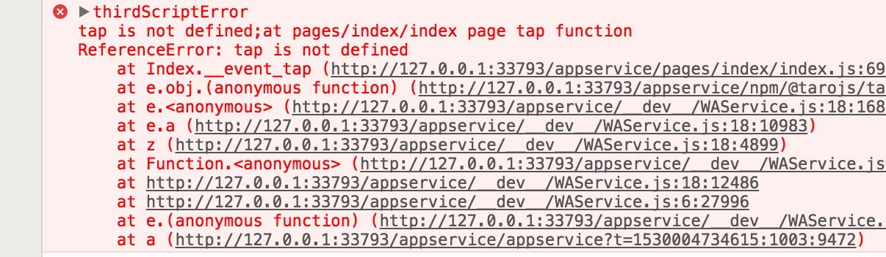
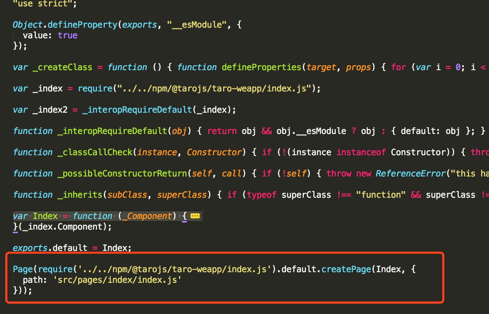

## 了解Taro

听说Taro是从几个星期前开始的，在一次饭桌上，一个小伙伴说：“Hey， 你听说了Taro么，听说只需要写一套程序就可以生成H5，小程序以及RN的代码模板，并且类似于React的语法。”“哦？还有这么好的事，赶紧研究一下。”

## Taro初体验

去[官网](https://taro.aotu.io/)，[Github](https://github.com/NervJS/taro)了解了一下，Taro是由京东·凹凸实验室团队开发的，在掘金上看到他们的发稿，大致归(tu)纳(cao)如下：

- 代码组织与语法：微信小程序需要在js/wxss/wxml/json文件中来回切换
- 命名规范：微信文档中的各种命名规范(驼峰、小写中划线、小写连写)，惨不忍睹
- 开发方式：不能加载npm包，不能使用Sass/less等预处理器以及手动的文件处理

原文在这里：[为何我们要用 React 来写小程序 - Taro 诞生记](https://juejin.im/post/5b30b476518825749e4a1d91)

## 使用Taro

跑去官网，按照步骤，copy了demo运行了一下，大致如下：

```bash
npm install -g @tarojs/cli
taro init myApp

# H5端运行
$ npm run dev:h5
$ taro build --type h5 --watch

# 微信小程序端运行
$ npm run dev:weapp
$ taro build --type weapp --watch
```

起步在这里：[Get Started](https://nervjs.github.io/taro/GETTING-STARTED.html#%E5%AE%89%E8%A3%85)，大致这样就可以跑起来了，分别在浏览器和微信开发工具中运行了一下，都可以看到界面输出，感觉还是不错。

## Taro语法

Taro的开发语法遵循React，基本上写过React的都是很好上手。大致是这个样子的：

```js
import Taro, { Component } from '@tarojs/taro'
import Index from './pages/index'

import './app.scss'

class App extends Component {
  // 项目配置
  config = {
    pages: [
      'pages/index/index'
    ],
    window: {
      backgroundTextStyle: 'light',
      navigationBarBackgroundColor: '#fff',
      navigationBarTitleText: 'WeChat',
      navigationBarTextStyle: 'black'
    }
  }

  componentWillMount () {}

  componentDidMount () {}

  componentDidShow () {}

  componentDidHide () {}

  render () {
    return (
      <Index />
    )
  }
}
```



## Taro感受

以下是我自己个人的感受，因为还没有在项目中应用，可能有些地方说得不太妥当，还望指出。

### 一端开发，多端生成

正如Taro自己所说的，只需要写一个版本的代码，就可以编译生成H5、微信小程序以及RN的代码，在效率上确实会有所提升。

### Non-Reacter的学习成本

如果作为一个'Reacter'，那么用Taro来开发项目的话肯定是没什么上手难度的，但是如果是没有写过react项目的，那么可能最开始还是有学习成本。

### 文档开发还有欠缺

对比了微信小程序官网和Taro的Gitbook文档，大致上很多东西都是一一对应的，基本的许多场景都可以满足，但是也有欠缺。比如：组件中的`RichText`在Taro中就介绍不足，在Taro中(可能^_^)和微信小程序中分别是这样调用的：

```
// Taro
<RichText nodes={nodes} onTap={this.tap} />

// 微信小程序
<rich-text nodes="{{nodes}}" bindtap="tap"></rich-text>
```

文档中缺乏了nodes以及onTap方法的说明，这可能需要开发者自己调试。但实际上我按照微信小程序的方法加上`onTap`之后，控制台是报方法未定义的错误，而实际上我是有写的。【**这点要是在实际开发中可能欲哭无泪，要么就是引入其他的库或者自己手写，无疑会增加开发成本以及风险**】。



有人或许想说，我直接在生成的微信小程序代码文件夹(dist)中加上不就可以了，但是你可能不是太好改，因为代码是这样的：



## 建议与总结

如果你的项目足够下，并且没有运用到特别复杂的组件，并且有开发多端代码的需要，你可以尝试使用`Taro`，因为即使你需要的组件没有，也可以在有限的时间内方便地写出来，而且京东商城小程序貌似也是用Taro写的，以后应该会有更多的支持。