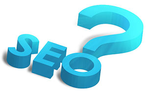

# SEO是什么？

发表于 2009年05月15日 作者 Zac

做SEO也不长不短的做了四五年了。其他行业，做四五年只能算是新手。但是想想SEO行业什么时候才出现，再看看同行的不少更新手，发现自己竟然还算资深了。

但做几年SEO之后，仔细回想每天进行的工作也会经常迷惑，到底SEO是什么？先从定义上看看，SEO是什么意思？

## SEO是什么意思？

SEO是英文Search Engine Optimization的缩写，中文译为“搜索引擎优化”。简单地说，SEO是指从自然搜索结果获得网站流量的技术和过程。更严谨些的定义可以表述为：SEO是指在了解搜索引擎自然排名机制的基础上，对网站进行内部及外部的调整优化，改进网站在搜索引擎中的关键词自然排名，获得更多流量，从而达成网站销售及品牌建设的目标。

定义很容易理解，实践中却有些迷惑。SEO博客、论坛上都有大量SEO技巧、经验分享，但其实仔细想来这些技巧都不是SEO独特的东西，或者说就没有一种真正叫SEO的东西。

我们从SEO的步骤来看就更清楚了。

## 关键词分析

其实也就是市场调查和行业竞争对手调查。做任何一个生意，不都得做用户需求调查，竞争对手调查吗？只不过工具不同，做SEO的关键词分析是看关键词搜索次数和返回竞争页面多少。

除非你是天才，或者有VC投资，花别人的钱办自己的事，不然甭管干什么，都得先做一下调查。

## 网站架构优化

合理清晰的内部结构，利于搜索引擎抓取，利于用户浏览的内部链接，说到底其实就是个技术问题。告诉技术人员搜索引擎必须抓取网站页面，哪些东西不利于抓取，技术人员自然就会按规范去做，他甚至不必知道SEO这个词。

## 页面优化

这也是个最基本的写作文的要求。你不可能把初一到初六所写的作文都叫“我的作文”，总得分成“我的爸爸”，“游香山”，“读红岩有感”等不同的题目吧。优化页面Title标签讲的也就是这个。

页面上其他该做的关键词优化，完全和写作文的基本要求没区别，上好中学语文就可以了。

## 外部链接建设

这根本就应该是公司公关部门和市场部门的副产品。不知道大家是否注意访谈小鹏时他说的话，大公司的链接都是用户自己给的，人家根本不去做什么外部链接建设，很少的交换链接人家叫商业扩展，估计这事也不归SEO部门管。

你什么时候见微软、可口可乐会去建设外部链接呢？连纯粹的线上品牌Wiki也不做这事。真正牛的公司是不做外链的，只有我们这些小人物才吭哧吭哧干这个事。

## 流量分析

出现SEO之前若干年，流量分析就是运营网站必做的事情。

所以看一圈下来，你会发现不知道到底什么是SEO。我们所做的SEO大部分是常识。

当然，可喜的是，常识往往是常人们做不到的，所以就会出现了所谓的SEO和SEO行业，而且至少还会红火个十年二十年。