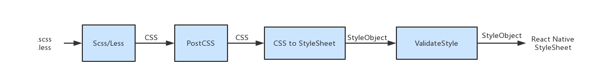

# 关于Taro

## Taro介绍

### 简介

**Taro** 是一套遵循 [React](https://reactjs.org/) 语法规范的 **多端开发** 解决方案。现如今市面上端的形态多种多样，Web、React-Native、微信小程序等各种端大行其道，当业务要求同时在不同的端都要求有所表现的时候，针对不同的端去编写多套代码的成本显然非常高，这时候只编写一套代码就能够适配到多端的能力就显得极为需要。

使用 **Taro**，我们可以只书写一套代码，再通过 **Taro** 的编译工具，将源代码分别编译出可以在不同端（微信/百度/支付宝/字节跳动小程序、H5、React-Native 等）运行的代码。

### 特性

**React语法风格**

**Taro** 遵循 [React](https://reactjs.org/) 语法规范，它采用与 React 一致的组件化思想，组件生命周期与 React 保持一致，同时支持使用 JSX 语法，让代码具有更丰富的表现力，使用 **Taro** 进行开发可以获得和 React 一致的开发体验。

代码示例

```js
import Taro, { Component } from '@tarojs/taro'
import { View, Button } from '@tarojs/components'

export default class Index extends Component {
  constructor () {
    super(...arguments)
    this.state = {
      title: '首页',
      list: [1, 2, 3]
    }
  }

  componentWillMount () {}

  componentDidMount () {}

  componentWillUpdate (nextProps, nextState) {}

  componentDidUpdate (prevProps, prevState) {}

  shouldComponentUpdate (nextProps, nextState) {
    return true
  }

  add = (e) => {
    // dosth
  }

  render () {
    return (
      <View className='index'>
        <View className='title'>{this.state.title}</View>
        <View className='content'>
          {this.state.list.map(item => {
            return (
              <View className='item'>{item}</View>
            )
          })}
          <Button className='add' onClick={this.add}>添加</Button>
        </View>
      </View>
    )
  }
}
```

**快速开发微信小程序**

Taro 立足于微信小程序开发，众所周知小程序的开发体验并不是非常友好，比如小程序中无法使用 npm 来进行第三方库的管理，无法使用一些比较新的 ES 规范等等，针对小程序端的开发弊端，Taro 具有以下的优秀特性：

✅ 支持使用 npm/yarn 安装管理第三方依赖

✅ 支持使用 ES7/ES8 甚至更新的 ES 规范，一切都可自行配置

✅ 支持使用 CSS 预编译器，例如 Sass 等

✅ 支持使用 Redux 进行状态管理

✅ 支持使用 Mobx 进行状态管理

✅ 小程序 API 优化，异步 API Promise 化等等

**支持多端开发转化**

Taro 方案的初心就是为了打造一个多端开发的解决方案。目前 Taro 代码可以支持转换到 **微信/百度/支付宝/字节跳动小程序** 、 **H5 端** 以及 **移动端（React-Native）**。


## Taro团队

### 核心开发者

Taro 各个模块的核心开发者。设计并实现 Taro 的核心功能，把控模块的功能规划、特性引入和实现进度，当社区无法达成共识时做出最终决定。

- **督导小组** 负责核心功能的监督把控，整体功能的规划设计，督导新功能的引入，制定开发计划，以及提交代码 Review
- **编译小组** 负责代码文件编译到不同端的实现，微信小程序端 JSX 编译，快应用端 JSX 编译等，ESLint 插件维护
- **开发工具小组** 负责 cli 工具的开发与优化工作
- **组件库小组** 负责标准组件库的规范制定、文档编写，标准组件库在不同端的实现，以及标准组件库官网建设
- **运行框架小组** 负责不同端运行框架的实现
- **端能力 API 小组** 负责端能力 API 的规范制定、文档编写，端能力 API 在不同端的实现
- **UI 库小组** 负责 Taro UI 库的实现
- **社区维护小组** 负责社区内答疑解惑，GitHub ISSUE 维护，问题搜集，社区项目发起与引导，第三方库适配与生态管理等

### 战略合作伙伴（联合团队）

共同参与 Taro 的研发和推广，监督 Taro 的发展流程，推动 Taro 在各领域真实业务场景中的落地和实践，促进 Taro 在业界的广泛应用。

[](https://cdc.tencent.com/)

### 个人贡献者

为 Taro 贡献过代码的个人。

[](https://github.com/NervJS/taro/graphs/contributors)

### 特别鸣谢

[](https://github.com/nanjingboy/)

:---: [nanjingboy](https://github.com/nanjingboy/)

# 快速开始

## 安装及使用

### 安装

安装 Taro 开发工具 `@tarojs/cli`

使用 npm 或者 yarn 全局安装，或者直接使用[npx](https://medium.com/@maybekatz/introducing-npx-an-npm-package-runner-55f7d4bd282b)

```bash
$ npm install -g @tarojs/cli
$ yarn global add @tarojs/cli
```

### 使用

使用命令创建模板项目

```bash
$ taro init myApp
```

npm 5.2+ 也可在不全局安装的情况下使用 npx 创建模板项目

```bash
$ npx @tarojs/cli init myApp
```

进入项目目录开始开发，目前已经支持 微信/百度/支付宝/字节跳动小程序、H5 以及 ReactNative 等端的代码转换，针对不同端的启动以及预览、打包方式并不一致

#### 微信小程序

选择微信小程序模式，需要自行下载并打开[微信开发者工具](https://developers.weixin.qq.com/miniprogram/dev/devtools/download.html)，然后选择项目根目录进行预览。

微信小程序编译预览及打包（去掉 --watch 将不会监听文件修改，并会对代码进行压缩打包）

```bash
# npm script
$ npm run dev:weapp
$ npm run build:weapp
# 仅限全局安装
$ taro build --type weapp --watch
$ taro build --type weapp
# npx 用户也可以使用
$ npx taro build --type weapp --watch
$ npx taro build --type weapp
```

#### 百度小程序

选择百度小程序模式，需要自行下载并打开[百度开发者工具](https://smartprogram.baidu.com/docs/develop/devtools/show_sur/)，然后在项目编译完后选择项目根目录下 `dist` 目录进行预览。

百度小程序编译预览及打包（去掉 --watch 将不会监听文件修改，并会对代码进行压缩打包）

```bash
# npm script
$ npm run dev:swan
$ npm run build:swan
# 仅限全局安装
$ taro build --type swan --watch
$ taro build --type swan
# npx 用户也可以使用
$ npx taro build --type swan --watch
$ npx taro build --type swan
```

#### 支付宝小程序

选择支付宝小程序模式，需要自行下载并打开[支付宝小程序开发者工具](https://docs.alipay.com/mini/developer/getting-started/)，然后在项目编译完后选择项目根目录下 `dist` 目录进行预览。

支付宝小程序编译预览及打包（去掉 --watch 将不会监听文件修改，并会对代码进行压缩打包）

```bash
# npm script
$ npm run dev:alipay
$ npm run build:alipay
# 仅限全局安装
$ taro build --type alipay --watch
$ taro build --type alipay
# npx 用户也可以使用
$ npx taro build --type alipay --watch
$ npx taro build --type alipay
```

#### 字节跳动小程序

选择字节跳动小程序模式，需要自行下载并打开[字节跳动小程序开发者工具](https://microapp.bytedance.com/docs/devtool/versionUpdate.html)，然后在项目编译完后选择项目根目录下 `dist` 目录进行预览。

字节跳动小程序编译预览及打包（去掉 --watch 将不会监听文件修改，并会对代码进行压缩打包）

```bash
# npm script
$ npm run dev:tt
$ npm run build:tt
# 仅限全局安装
$ taro build --type tt --watch
$ taro build --type tt
# npx 用户也可以使用
$ npx taro build --type tt --watch
$ npx taro build --type tt
```

#### H5

H5 模式，无需特定的开发者工具，在执行完下述命令之后即可通过浏览器进行预览

H5 预览项目

```bash
# npm script
$ npm run dev:h5
# 仅限全局安装
$ taro build --type h5 --watch
# npx 用户也可以使用
$ npx taro build --type h5 --watch
```

H5 打包项目

```bash
# npm script
$ npm run build:h5
# 仅限全局安装
$ taro build --type h5
# npx 用户也可以使用
$ npx taro build --type h5
```

#### React Native

React Native 端运行需执行如下命令，React Native 端相关的运行说明请参见 [React Native 教程](https://nervjs.github.io/taro/docs/react-native.html)

```bash
# npm script
$ npm run dev:rn
# 仅限全局安装
$ taro build --type rn --watch
# npx 用户也可以使用
$ npx taro build --type rn --watch
```

### 更新

Taro 提供了更新命令来更新 CLI 工具自身和项目中 Taro 相关的依赖

更新 Taro CLI 工具

```bash
# taro
$ taro update self
# npm
npm i -g @tarojs/cli@latest
# yarn
yarn global add @tarojs/cli@latest
```

更新项目中 Taro 相关的依赖

```bash
$ taro update project
```

### 环境及依赖检测

Taro 提供了命令来一键检测 Taro 环境及依赖的版本等信息，方便大家查看项目的环境及依赖，排查环境问题。在提 issue 的时候，请附上 `taro info` 打印的信息，帮助开发人员快速定位问题。

```bash
$ taro info
👽 Taro v1.2.0-beta.15


  Taro CLI 1.2.0-beta.15 environment info:
    System:
      OS: macOS High Sierra 10.13.5
      Shell: 5.3 - /bin/zsh
    Binaries:
      Node: 8.11.2 - /usr/local/bin/node
      Yarn: 1.8.0 - /usr/local/bin/yarn
      npm: 5.6.0 - /usr/local/bin/npm
    npmPackages:
      @tarojs/components: ^1.2.0-beta.3 => 1.2.0-beta.3
      @tarojs/plugin-babel: ^1.2.0-beta.3 => 1.2.0-beta.3
      @tarojs/plugin-csso: ^1.2.0-beta.3 => 1.2.0-beta.3
      @tarojs/plugin-sass: ^1.2.0-beta.4 => 1.2.0-beta.4
      @tarojs/plugin-uglifyjs: ^1.2.0-beta.3 => 1.2.0-beta.3
      @tarojs/rn-runner: ^1.2.0-beta.4 => 1.2.0-beta.4
      @tarojs/router: ^1.2.0-beta.3 => 1.2.0-beta.3
      @tarojs/taro: ^1.2.0-beta.3 => 1.2.0-beta.3
      @tarojs/taro-alipay: ^1.2.0-beta.3 => 1.2.0-beta.3
      @tarojs/taro-h5: ^1.2.0-beta.3 => 1.2.0-beta.3
      @tarojs/taro-swan: ^1.2.0-beta.3 => 1.2.0-beta.3
      @tarojs/taro-weapp: ^1.2.0-beta.3 => 1.2.0-beta.3
      @tarojs/webpack-runner: ^1.2.0-beta.3 => 1.2.0-beta.3
      eslint-config-taro: ^1.2.0-beta.3 => 1.2.0-beta.3
      eslint-plugin-taro: ^1.2.0-beta.3 => 1.2.0-beta.3
```

## Taro组成

| NPM 包                                                       | 描述                             |
| ------------------------------------------------------------ | -------------------------------- |
| [`@tarojs/taro`](https://www.npmjs.com/package/@tarojs/taro) | taro 运行时框架                  |
| [`@tarojs/taro-h5`](https://www.npmjs.com/package/@tarojs/taro-h5) | taro h5 运行时框架               |
| [`@tarojs/taro-rn`](https://www.npmjs.com/package/@tarojs/taro-rn) | taro React Native 运行时框架     |
| [`@tarojs/taro-weapp`](https://www.npmjs.com/package/@tarojs/taro-weapp) | taro 微信小程序运行时框架        |
| [`@tarojs/taro-swan`](https://www.npmjs.com/package/@tarojs/taro-swan) | taro 百度智能小程序运行时框架    |
| [`@tarojs/taro-tt`](https://www.npmjs.com/package/@tarojs/taro-tt) | taro 字节跳动小程序运行时框架    |
| [`@tarojs/taro-alipay`](https://www.npmjs.com/package/@tarojs/taro-alipay) | taro 支付宝小程序运行时框架      |
| [`@tarojs/redux`](https://www.npmjs.com/package/@tarojs/redux) | taro 小程序 Redux 支持           |
| [`@tarojs/redux-h5`](https://www.npmjs.com/package/@tarojs/redux-h5) | taro H5 Redux 支持               |
| [`@tarojs/redux-rn`](https://www.npmjs.com/package/@tarojs/redux-rn) | taro React Native Redux 支持     |
| [`@tarojs/mobx-common`](https://www.npmjs.com/package/@tarojs/mobx-common) | taro mobx 公共模块               |
| [`@tarojs/mobx`](https://www.npmjs.com/package/@tarojs/mobx) | taro 小程序 mobx 支持            |
| [`@tarojs/mobx-h5`](https://www.npmjs.com/package/@tarojs/mobx-h5) | taro h5 mobx 支持                |
| [`@tarojs/mobx-rn`](https://www.npmjs.com/package/@tarojs/mobx-rn) | taro React Native mobx 支持      |
| [`@tarojs/router`](https://www.npmjs.com/package/@tarojs/router) | taro h5 路由                     |
| [`@tarojs/async-await`](https://www.npmjs.com/package/@tarojs/async-await) | 支持使用 async/await 语法        |
| [`@tarojs/cli`](https://www.npmjs.com/package/@tarojs/cli)   | taro 开发工具                    |
| [`@tarojs/transformer-wx`](https://www.npmjs.com/package/@tarojs/transformer-wx) | taro 小程序转换器                |
| [`@tarojs/taroize`](https://www.npmjs.com/package/@tarojs/taroize) | taro 小程序编译器                |
| [`@tarojs/taro-rn-runner`](https://www.npmjs.com/package/@tarojs/rn-runner) | taro ReactNative 打包编译工具    |
| [`@tarojs/webpack-runner`](https://www.npmjs.com/package/@tarojs/webpack-runner) | taro h5 端 webpack 打包编译工具  |
| [`@tarojs/components`](https://www.npmjs.com/package/@tarojs/components) | taro 标准组件库，h5 版           |
| [`@tarojs/components-rn`](https://www.npmjs.com/package/@tarojs/components-rn) | taro 标准组件库，React Native 版 |
| [`@tarojs/plugin-babel`](https://www.npmjs.com/package/@tarojs/plugin-babel) | taro babel 编译插件              |
| [`@tarojs/plugin-sass`](https://www.npmjs.com/package/@tarojs/plugin-sass) | taro sass 编译插件               |
| [`@tarojs/plugin-less`](https://www.npmjs.com/package/@tarojs/plugin-less) | taro less 编译插件               |
| [`@tarojs/plugin-stylus`](https://www.npmjs.com/package/@tarojs/plugin-stylus) | taro stylus 编译插件             |
| [`@tarojs/plugin-csso`](https://www.npmjs.com/package/@tarojs/plugin-csso) | taro css 压缩插件                |
| [`@tarojs/plugin-uglifyjs`](https://www.npmjs.com/package/@tarojs/plugin-uglifyjs) | taro js 压缩插件                 |
| [`eslint-config-taro`](https://www.npmjs.com/package/eslint-config-taro) | taro eslint 规则                 |
| [`eslint-plugin-taro`](https://www.npmjs.com/package/eslint-plugin-taro) | taro eslint 插件                 |

## 开发前注意

### 小程序

* 若使用 **微信小程序预览模式** ，则需下载并使用[微信开发者工具](https://developers.weixin.qq.com/miniprogram/dev/devtools/download.html)添加项目进行预览，此时需要注意微信开发者工具的项目设置
  * 需要设置关闭 ES6 转 ES5 功能，开启可能报错
  * 需要设置关闭上传代码时样式自动补全，开启可能报错
  * 需要设置关闭代码压缩上传，开启可能报错

### React Native

> **Note：** 如果要支持 React Native 端，必须采用 Flex 布局，并且样式选择器仅支持类选择器，且不支持 **组合器**[Combinators and groups of selectors](https://developer.mozilla.org/en-US/docs/Learn/CSS/Introduction_to_CSS/Combinators_and_multiple_selectors)。

以下选择器的写法都是不支持的，在样式转换时会自动忽略。

```css
.button.button_theme_islands{
  font-style: bold;
}

img + p {
  font-style: bold;
}

p ~ span {
  color: red;
}

div > span {
  background-color: DodgerBlue;
}

div span { background-color: DodgerBlue; }
```

#### 常见问题

**样式和 CSS 一致吗？**

React Native 的样式基于开源的跨平台布局引擎 [Yoga](https://github.com/facebook/yoga) ，样式基本上是实现了 CSS 的一个子集，并且属性名不完全一致，所以当你开始在考虑兼容 React Native 端之前，可以先简要了解一下 React Native 的样式：[React Native Layout Props](https://facebook.github.io/react-native/docs/layout-props)

我们在 React Native 中使用 Flexbox 规则来指定某个组件的子元素的布局。Flexbox 可以在不同屏幕尺寸上提供一致的布局结构。因此，如果你要考虑 React Native 端，那你的样式布局就得采用 Flex 布局。

Flex 布局入门，可以查看阮一峰的 [Flex 布局教程：语法篇](http://www.ruanyifeng.com/blog/2015/07/flex-grammar.html)

**是否支持全局样式？**

入口文件 app.js 里面引入的样式就是全局样式，本地样式会覆盖全局样式。

**是否支持引入 React Native 的第三方库？**

由于 Taro RN 端是基于 Expo，因此不支持 **需要自定义原生组件** 的第三方库。

**某些样式代码仅供 H5 端使用，如样式重置类的代码，怎么处理？**

`/*postcss-pxtransform rn eject enable*/` 与 `/*postcss-pxtransform rn eject disable*/` 中间的代码， 在编译成 RN 端的样式的时候，会被删除。建议将 RN 不支持的但 H5 端又必不可少的样式放到这里面。如：样式重制相关的代码。

```css
/*postcss-pxtransform rn eject enable*/

.test {
  color: black;
}

/*postcss-pxtransform rn eject disable*/
```

**box-shadow 能实现吗？**

很遗憾，React Native 这方面支持得并不好（仅 ios 支持且支持程度有限），建议你不要报太大希望。

**CSS 属性简写（Shorthands）支持吗？**

仅接受 React Native 支持的值。例如 background 只接受一种颜色 `backgroundColor`，因为 React Native 的 Background 仅支持 `backgroundColor` 属性。React Native 支持的属性可见下面的 React Native 样式表。

**border{Top,Right,Bottom,Left} 不支持？**

border{Top,Right,Bottom,Left} 的简写（shorthands）不支持，因为 `borderStyle` 不能应用于单个边框。

**React Native 不支持 background-image ，有什么解决办法吗？**

使用 `Image 组件`，配合 Flex 布局，基本可以实现你的大部分需求。阅读一下这篇文章：[Background Images in React Native](https://thekevinscott.com/background-images-in-react-native/)，有助于你理解。

#### 页面怎样设置高度 100%

RN 端页面默认 `disableScroll` 为 `true`，和微信小程序保持一致。要想设置高度 100% ，得先在页面配置：`disableScroll :false`，然后配合 `height: 100%;` 即可。

#### 可以使用微信/支付宝支付吗？

由于 Expo 不支持原生的 SDK，所以无法通过集成原生的 SDK 的方式使用微信/支付宝支付。不过 RN 端提供了 `Taro.openUrl({url:''})`的 API 打开手机浏览器，然后走 [手机网站支付](https://docs.open.alipay.com/203/105288/) 的流程。

#### 其他注意事项

1. **运行时** 报缺少包，需要要在 `.rn_temp` 目录里面安装。
2. 文字要包在 `Text` 组件里面，否则不显示。
3. `display:fixed` React Native 不支持
4. Animation 和 transform React Native 动画不支持
5. React Native 与 H5/小程序 的Flex 布局相关属性的默认值有差异

### 样式

React Native 的样式基于开源的跨平台布局引擎 [Yoga](https://github.com/facebook/yoga) ，样式基本上是实现了 CSS 的一个子集，但是属性名不完全一致，具体的内容及相关差异可以查看文档 [React Native Layout Props](https://facebook.github.io/react-native/docs/layout-props)。Taro React Native 端样式文件的处理，主要可以分为以下几步：



我们首先使用于处理器将 Scss/Less 样式文件转换为 CSS，这里我们借助 [css-to-react-native](https://github.com/styled-components/css-to-react-native)将 CSS 样式转换为 React Native Stylesheet objects。

下面的样式代码

```css
.myClass {
  font-size: 18px;
  line-height: 24px;
  color: red;
}

.other {
  padding: 1rem;
}
```

将被转换为

```css
{
  myClass: {
    fontSize: 18,
    lineHeight: 24,
    color: "red"
  },
  other: {
    paddingBottom: 16,
    paddingLeft: 16,
    paddingRight: 16,
    paddingTop: 16
  }
}
```

同时，为了保证样式开发的友好度，我们还实现了 StyleSheet 的错误校验，如果你写的样式 RN 不支持，会在编译时在终端报错。

下面是 React Native 样式表供大家参考，列出了 React Native 支持的所有样式属性，不熟悉 React Native样式的同学，在开发前，可以快速过一下：

#### Properties 属性

**Text 文本（18）**

| 属性名                       | 取值                                                         | 描述                                                         |
| ---------------------------- | ------------------------------------------------------------ | ------------------------------------------------------------ |
| color                        | `<color>`                                                    | 对应 `CSS` [color](http://css.doyoe.com/properties/color/color.htm) 属性 |
| fontFamily                   | string                                                       | 对应 `CSS` [font-family](http://css.doyoe.com/properties/font/font-family.htm) 属性 |
| fontSize                     | `<number>`                                                   | 对应 `CSS` [font-size](http://css.doyoe.com/properties/font/font-size.htm) 属性 |
| fontStyle                    | `normal`, `italic`                                           | 对应 `CSS` [font-style](http://css.doyoe.com/properties/font/font-style.htm) 属性，但阉割了 `oblique` 取值 |
| fontWeight                   | `normal`, `bold``100~900`                                    | 对应 `CSS` [font-weight](http://css.doyoe.com/properties/font/font-weight.htm) 属性，但阉割了 `bolder, lighter` 取值 |
| lineHeight                   | `<number>`                                                   | 对应 `CSS` [line-height](http://css.doyoe.com/properties/text/line-height.htm) 属性 |
| textAlign                    | `auto`, `left`, `right`, `center`, `justify``iOS`            | 对应 `CSS` [text-align](http://css.doyoe.com/properties/text/text-align.htm) 属性，但增加了 `auto` 取值。当取值为 `justify` 时，在 `Android` 上会变为 `left` |
| textDecorationLine           | `none`, `underline`, `line-through`, `underline line-through` | 对应 `CSS` [text-decoration-line](http://css.doyoe.com/properties/text-decoration/text-decoration-line.htm) 属性，但阉割了 `overline`, `blink` 取值 |
| textShadowColor              | `<color>`                                                    | 对应 `CSS` [text-shadow](http://css.doyoe.com/properties/text-decoration/text-shadow.htm) 属性中的颜色定义 |
| textShadowOffset             | { width:`<number>`, height:`<number>`}                       | 对应 `CSS` [text-shadow](http://css.doyoe.com/properties/text-decoration/text-shadow.htm) 属性中的阴影偏移定义 |
| textShadowRadius             | `<number>`                                                   | 在 `CSS` 中，阴影的圆角大小取决于元素的圆角定义，不需要额外定义 |
| includeFontPadding `Android` | `<bool>`                                                     | Android在默认情况下会为文字额外保留一些padding，以便留出空间摆放上标或是下标的文字。对于某些字体来说，这些额外的padding可能会导致文字难以垂直居中。如果你把textAlignVertical设置为center之后，文字看起来依然不在正中间，那么可以尝试将本属性设置为false |
| textAlignVertical `Android`  | `auto`, `top`, `bottom`, `center`                            | 对应 `CSS` [vertical-align](http://css.doyoe.com/properties/text/vertical-align.htm) 属性，增加了 `auto` 取值，`center` 取代了 `middle`，并阉割了 `baseline, sub` 等值 |
| fontVariant `iOS`            | `small-caps`, `oldstyle-nums`, `lining-nums`, `tabular-nums`, `proportional-nums` | 对应 `CSS` [font-variant](http://css.doyoe.com/properties/font/font-variant.htm) 属性，但取值更丰富 |
| letterspacing `iOS`          | `<number>`                                                   | 对应 `CSS` [letter-spacing](http://css.doyoe.com/properties/text/letter-spacing.htm) 属性 |
| textDecorationColor `iOS`    | `<color>`                                                    | 对应 `CSS` [text-decoration-color](http://css.doyoe.com/properties/text-decoration/text-decoration-color.htm) 属性 |
| textDecorationStyle `iOS`    | `solid`, `double`, `dotted`, `dashed`                        | 对应 `CSS` [text-decoration-style](http://css.doyoe.com/properties/text-decoration/text-decoration-style.htm) 属性，但阉割了 `wavy` 取值 |
| writingDirection `iOS`       | `auto`, `ltr`, `rtl`                                         | 对应 `CSS` [direction](http://css.doyoe.com/properties/writing-modes/direction.htm) 属性，增加了 `auto` 取值 |

**Dimension 尺寸（6）**

| 属性名   | 取值                   | 描述                                                         |
| -------- | ---------------------- | ------------------------------------------------------------ |
| position | `absolute`, `relative` | 对应 `CSS` [position](http://css.doyoe.com/properties/positioning/position.htm) 属性，但阉割了 `static, fixed` 取值 |
| top      | `<number>`             | 对应 `CSS` [top](http://css.doyoe.com/properties/positioning/top.htm) 属性 |
| right    | `<number>`             | 对应 `CSS` [right](http://css.doyoe.com/properties/positioning/right.htm) 属性 |
| bottom   | `<number>`             | 对应 `CSS` [bottom](http://css.doyoe.com/properties/positioning/bottom.htm) 属性 |
| left     | `<number>`             | 对应 `CSS` [left](http://css.doyoe.com/properties/positioning/left.htm) 属性 |
| zIndex   | `<number>`             | 对应 `CSS` [z-index](http://css.doyoe.com/properties/positioning/z-index.htm) 属性 |

**Margin 外部白（7）**

| 属性名           | 取值       | 描述                                                         |
| ---------------- | ---------- | ------------------------------------------------------------ |
| margin           | `<number>` | 对应 `CSS` [margin](http://css.doyoe.com/properties/margin/margin.htm) 属性，不同的是，它只能定义一个参数，如需分别定义`上、右、下、左`4个方位的外补白，可以通过下面的单向外部白属性 |
| marginHorizontal | `<number>` | 无对应的 `CSS` 属性。其效果相当于同时设置 `marginRight` 和 `marginLeft` |
| marginVertical   | `<number>` | 无对应的 `CSS` 属性。其效果相当于同时设置 `marginTop` 和 `marginBottom` |
| marginTop        | `<number>` | 对应 `CSS` [margin-top](http://css.doyoe.com/properties/margin/margin-top.htm) 属性 |
| marginRight      | `<number>` | 对应 `CSS` [margin-right](http://css.doyoe.com/properties/margin/margin-right.htm) 属性 |
| marginBottom     | `<number>` | 对应 `CSS` [margin-bottom](http://css.doyoe.com/properties/margin/margin-bottom.htm) 属性 |
| marginLeft       | `<number>` | 对应 `CSS` [margin-left](http://css.doyoe.com/properties/margin/margin-left.htm) 属性 |

**Padding 内部白（7）**

| 属性名            | 取值       | 描述                                                         |
| ----------------- | ---------- | ------------------------------------------------------------ |
| padding           | `<number>` | 对应 `CSS` [padding](http://css.doyoe.com/properties/padding/padding.htm) 属性，不同的是，它只能定义一个参数，如需分别定义`上、右、下、左`4个方位的内补白，可以通过下面的单向内部白属性 |
| paddingHorizontal | `<number>` | 无对应的 `CSS` 属性。其效果相当于同时设置 `paddingRight` 和 `paddingLeft` |
| paddingVertical   | `<number>` | 无对应的 `CSS` 属性。其效果相当于同时设置 `paddingTop` 和 `paddingBottom` |
| paddingTop        | `<number>` | 对应 `CSS` [padding-top](http://css.doyoe.com/properties/padding/padding-top.htm) 属性 |
| paddingRight      | `<number>` | 对应 `CSS` [padding-right](http://css.doyoe.com/properties/padding/padding-right.htm) 属性 |
| paddingBottom     | `<number>` | 对应 `CSS` [padding-bottom](http://css.doyoe.com/properties/padding/padding-bottom.htm) 属性 |
| paddingLeft       | `<number>` | 对应 `CSS` [padding-left](http://css.doyoe.com/properties/padding/padding-left.htm) 属性 |

**Border 边框（20）**

| 属性名                  | 取值                                       | 描述                                                         |
| ----------------------- | ------------------------------------------ | ------------------------------------------------------------ |
| borderStyle             | `solid`, `dotted`, `dashed`                | 对应 `CSS` `border-style` 属性，但阉割了 `none, hidden, double, groove, ridge, inset, outset` 取值，且无方向分拆属性 |
| borderWidth             | `<number>`                                 | 对应 `CSS` `border-width` 属性                               |
| borderTopWidth          | `<number>`                                 | 对应 `CSS` `border-top-width` 属性                           |
| borderRightWidth        | `<number>`                                 | 对应 `CSS` `border-right-width` 属性                         |
| borderBottomWidth       | `<number>`                                 | 对应 `CSS` `border-bottom-width` 属性                        |
| borderLeftWidth         | `<number>`                                 | 对应 `CSS` `border-left-width` 属性                          |
| borderColor             | `<color>`                                  | 对应 `CSS` `border-color` 属性                               |
| borderTopColor          | `<color>`                                  | 对应 `CSS` `border-top-color` 属性                           |
| borderRightColor        | `<color>`                                  | 对应 `CSS` `border-right-color` 属性                         |
| borderBottomColor       | `<color>`                                  | 对应 `CSS` `border-bottom-color` 属性                        |
| borderLeftColor         | `<color>`                                  | 对应 `CSS` `border-left-color` 属性                          |
| borderRadius            | `<number>`                                 | 对应 `CSS` `border-radius` 属性                              |
| borderTopLeftRadius     | `<number>`                                 | 对应 `CSS` `border-top-left-radius` 属性                     |
| borderTopRightRadius    | `<number>`                                 | 对应 `CSS` `border-top-right-radius` 属性                    |
| borderBottomLeftRadius  | `<number>`                                 | 对应 `CSS` `border-bottom-left-radius` 属性                  |
| borderBottomRightRadius | `<number>`                                 | 对应 `CSS` `border-bottom-right-radius` 属性                 |
| shadowColor             | `<color>`                                  | 对应 `CSS` [box-shadow](http://css.doyoe.com/properties/border/box-shadow.htm) 属性中的颜色定义 |
| shadowOffset            | { width: `<number>`,  height: `<number>` } | 对应 `CSS` [box-shadow](http://css.doyoe.com/properties/border/box-shadow.htm) 属性中的阴影偏移定义 |
| shadowRadius            | `<number>`                                 | 在 `CSS` 中，阴影的圆角大小取决于元素的圆角定义，不需要额外定义 |
| shadowOpacity           | `<number>`                                 | 对应 `CSS` [box-shadow](http://css.doyoe.com/properties/border/box-shadow.htm) 属性中的阴影透明度定义 |


**Background 背景（1）**

| 属性名          | 取值      | 描述                               |
| --------------- | --------- | ---------------------------------- |
| backgroundColor | `<color>` | 对应 `CSS` `background-color` 属性 |

**Transform 转换（3）**

| 属性名             | 取值                                                         | 描述                                                         |
| ------------------ | ------------------------------------------------------------ | ------------------------------------------------------------ |
| transform          | `[{perspective: number}, {rotate: string}, {rotateX: string}, {rotateY: string}, {rotateZ: string}, {scale: number}, {scaleX: number}, {scaleY: number}, {translateX: number}, {translateY: number}, {skewX: string}, {skewY: string}]` | 对应 `CSS``transform` 属性                                   |
| transformMatrix    | `TransformMatrixPropType`                                    | 类似于 `CSS` 中 `transform` 属性的 `matrix()` 和 `matrix3d()` 函数 |
| backfaceVisibility | `visible`, `hidden`                                          | 对应 `CSS``backface-visibility` 属性                         |

**Flexbox 弹性盒（9）**

我们在 React Native 中使用 Flexbox 规则来指定某个组件的子元素的布局。Flexbox 可以在不同屏幕尺寸上提供一致的布局结构。

一般来说，使用 `flexDirection`、`alignItems` 和 `justifyContent` 三个样式属性就已经能满足大多数布局需求。

**Flex number**

在 React Native 中 flex 的表现和 CSS 有些区别。 flex 在 RN 中只能为整数值，其具体表现请参考 [yoga 引擎](https://github.com/facebook/yoga) 的文档，

当 flex 为正整数时，组件是弹性的，尺寸和 flex 的值成正比。

当 flex 为 0 时，组件没有弹性，且尺寸和 width ，height 一致。

当 flex 为 -1 时，在空间足够的情况下，组件的尺寸和 width ，height 一致；但是在空间不足时，组件会被压缩至 minWidth 和 minHeight

**Flex Direction**

在组件的 style 中指定 flexDirection 可以决定布局的主轴。子元素是应该沿着 `水平轴(row)`方向排列，还是沿着 `竖直轴(column)` 方向排列呢？**默认值是 竖直轴(column) 方向**，这点和 CSS 不一样，想要注意。

**Justify Content**

在组件的 style 中指定 justifyContent 可以决定其子元素沿着主轴的排列方式。子元素是应该靠近主轴的起始端还是末尾段分布呢？亦或应该均匀分布？对应的这些可选项有：`flex-start`、`center`、`flex-end`、`space-around` 以及 `space-between`。

**Align Items**

在组件的 style 中指定 alignItems 可以决定其子元素沿着次轴（与主轴垂直的轴，比如若主轴方向为 row，则次轴方向为 column ）的排列方式。子元素是应该靠近次轴的起始端还是末尾段分布呢？亦或应该均匀分布？对应的这些可选项有：`flex-start`、`center`、`flex-end` 以及 `stretch`。

| 属性名         | 取值                                                         | 描述                                                         |
| -------------- | ------------------------------------------------------------ | ------------------------------------------------------------ |
| flex           | `<number>`                                                   | 对应 `CSS` `flex` 属性，但只能为整数值                       |
| flexGrow       | `<number>`                                                   | 对应 `CSS` `flex-grow` 属性                                  |
| flexShrink     | `<number>`                                                   | 对应 `CSS` `flex-shrink` 属性                                |
| flexBasis      | `<number>`                                                   | 对应 `CSS` `flex-basis` 属性                                 |
| flexDirection  | `row`, `row-reverse`, `column`, `column-reverse`             | 对应 `CSS` `flex-direction` 属性                             |
| flexWrap       | `wrap`, `nowrap`                                             | 对应 `CSS` `flex-wrap` 属性，但阉割了 `wrap-reverse` 取值    |
| justifyContent | `flex-start`, `flex-end`, `center`, `space-between`, `space-around` | 对应 `CSS` `justify-content` 属性，但阉割了 `stretch` 取值。 |
| alignItems     | `flex-start`, `flex-end`, `center`, `stretch`                | 对应 `CSS` `align-items` 属性，但阉割了 `baseline` 取值。    |
| alignSelf      | `auto`, `flex-start`, `flex-end`, `center`, `stretch`        | 对应 `CSS` `align-self` 属性，但阉割了 `baseline` 取值       |

**Other其他**

| 属性名                 | 取值                          | 描述                                                         |
| ---------------------- | ----------------------------- | ------------------------------------------------------------ |
| opacity                | `<number>`                    | 对应 `CSS` `opacity` 属性                                    |
| overflow               | `visible`, `hidden`, `scroll` | 对应 `CSS` `overflow` 属性，但阉割了 `auto` 取值             |
| elevation `Android`    | `<number>`                    | `CSS`中没有对应的属性，只在 `Android5.0+` 上有效             |
| resizeMode             | `cover`, `contain`, `stretch` | `CSS`中没有对应的属性，可以参考 `background-size` 属性       |
| overlayColor `Android` | string                        | `CSS`中没有对应的属性，当图像有圆角时，将角落都充满一种颜色  |
| tintColor `iOS`        | `<color>`                     | `CSS`中没有对应的属性，`iOS` 图像上特殊的色彩，改变不透明像素的颜色 |

**Color 颜色**

`React Native` 支持了 `CSS` 中大部分的颜色类型：

- `#f00` (#rgb)
- `#f00c` (#rgba)：`CSS` 中无对应的值
- `#ff0000` (#rrggbb)
- `#ff0000cc` (#rrggbbaa)：`CSS` 中无对应的值
- `rgb(255, 0, 0)`
- `rgba(255, 0, 0, 0.9)`
- `hsl(360, 100%, 100%)`
- `hsla(360, 100%, 100%, 0.9)`
- `transparent`
- `0xff00ff00` (0xrrggbbaa)：`CSS` 中无对应的值
- `Color Name`：支持了 [基本颜色关键字](http://css.doyoe.com/appendix/color-keywords.htm#basic) 和 [拓展颜色关键字](http://css.doyoe.com/appendix/color-keywords.htm#extended)，但不支持 [28个系统颜色](http://css.doyoe.com/appendix/color-keywords.htm#system)；

**优先级与继承（Specificity and inheritance）**

组件的引入样式的优先级高于全局样式的优先级。

**选择器**

1. 基本选择器只支持类选择器
2. 不支持组合选择器的写法
3. 不支持伪类及伪元素

**CSS 的简写属性（Shorthand properties）**

**单位**

Taro 使用 [PostCSS](https://github.com/ai/postcss) 单位转换插件 [postcss-pxtransform](https://github.com/NervJS/taro/blob/master/packages/postcss-pxtransform/README.md) 会将 px 转换为 React Native 的 `pt`，具体配置方法可以查看文档。

#### 参考

- [CSS Flexible Box Layout Module Level 1](https://www.w3.org/TR/css-flexbox-1/)
- [Flex 布局教程：语法篇](http://www.ruanyifeng.com/blog/2015/07/flex-grammar.html)

## 特殊问题的处理

- [Issue #46](https://github.com/NervJS/taro/issues/46)，`redux-saga` 的引入问题处理
- 在 H5 模式下，tabBar 可能会挡住页面 fixed 元素问题：这是因为与小程序的 tabBar 不同，在 H5 下 tabBar 是一个普通的组件，当页面中存在`fixed(bottom)`定位的元素时，其表现会与小程序中不一致。Taro 提供了一个适配的方法：

例如：

```css
.fixed {
  bottom: 0;
  /* 在 H5 模式下将会编译成 margin-bottom: 50px，在小程序模式下则会忽略*/
  margin-bottom: taro-tabbar-height;
}[](https://nervjs.github.io/taro/docs/before-dev-remind.html)
  
```

# 教程

## Taro 规范

### 项目组织

#### 文件组织形式

> 以下文件组织规范为最佳实践的建议

所有项目源代码请放在项目根目录 `src` 目录下，项目所需最基本的文件包括 **入口文件** 以及 **页面文件**

- 入口文件为 `app.js`
- 页面文件建议放置在 `src/pages` 目录下

一个可靠的 Taro 项目可以按照如下方式进行组织

```bash
├── config                 配置目录
|   ├── dev.js             开发时配置
|   ├── index.js           默认配置
|   └── prod.js            打包时配置
├── src                    源码目录
|   ├── components         公共组件目录
|   ├── pages              页面文件目录
|   |   ├── index          index 页面目录
|   |   |   ├── banner     页面 index 私有组件
|   |   |   ├── index.js   index 页面逻辑
|   |   |   └── index.css  index 页面样式
|   ├── utils              公共方法库
|   ├── app.css            项目总通用样式
|   └── app.js             项目入口文件
└── package.json
```

#### 文件命名

Taro 中普通 JS/TS 文件以小写字母命名，多个单词以下划线连接，例如 `util.js`、`util_helper.js`

Taro 组件文件命名遵循 Pascal 命名法，例如 `ReservationCard.jsx`

#### 文件后缀

Taro 中普通 JS/TS 文件以 `.js` 或者 `.ts` 作为文件后缀

Taro 组件则以 `.jsx` 或者 `.tsx` 作为文件后缀，当然这不是强制约束，只是作为一个实践的建议，组件文件依然可以以 `.js`或者 `.ts` 作为文件后缀

### JavaScript 书写规范

在 Taro 中书写 JavaScript 请遵循以下规则

#### 基本书写

使用两个空格进行缩进

> 不要混合使用空格与制表符作为缩进

```javascript
function hello (name) {
  console.log('hi', name)   // ✓ 正确
    console.log('hello', name)   // ✗ 错误
}
```

**除了缩进，不要使用多个空格**

```javascript
const id =    1234    // ✗ 错误
const id = 1234       // ✓ 正确
```

**不要在句末使用分号**

```javascript
const a = 'a'   // ✓ 正确
const a = 'a';  // ✗ 错误
```

**字符串统一使用单引号**

```javascript
console.log('hello there')
// 如果遇到需要转义的情况，请按如下三种写法书写
const x = 'hello "world"'
const y = 'hello \'world\''
const z = `hello 'world'`
```

**代码块中避免多余留白**

```javascript
if (user) {
                            // ✗ 错误
  const name = getName()
 
}
 
if (user) {
  const name = getName()    // ✓ 正确
}
```

**关键字后面加空格**

```javascript
if (condition) { ... }   // ✓ 正确
if(condition) { ... }    // ✗ 错误
```

**函数声明时括号与函数名间加空格**

```javascript
function name (arg) { ... }   // ✓ 正确
function name(arg) { ... }    // ✗ 错误

run(function () { ... })      // ✓ 正确
run(function() { ... })       // ✗ 错误
```

**展开运算符与它的表达式间不要留空白**

```javascript
fn(... args)    // ✗ 错误
fn(...args)     // ✓ 正确
```

**遇到分号时空格要后留前不留**

```javascript
for (let i = 0 ;i < items.length ;i++) {...}    // ✗ 错误
for (let i = 0; i < items.length; i++) {...}    // ✓ 正确
```

**代码块首尾留空格**

```javascript
if (admin){...}     // ✗ 错误
if (admin) {...}    // ✓ 正确
```

**圆括号间不留空格**

```javascript
getName( name )     // ✗ 错误
getName(name)       // ✓ 正确
```

**属性前面不要加空格**

```javascript
user .name      // ✗ 错误
user.name       // ✓ 正确
```

**一元运算符前面跟一个空格**

```javascript
typeof!admin        // ✗ 错误
typeof !admin        // ✓ 正确
```

**注释首尾留空格**

```javascript
//comment           // ✗ 错误
// comment          // ✓ 正确
 
/*comment*/         // ✗ 错误
/* comment */       // ✓ 正确
```

**模板字符串中变量前后不加空格**

```javascript
const message = `Hello, ${ name }`    // ✗ 错误
const message = `Hello, ${name}`      // ✓ 正确
```

**逗号后面加空格**

```javascript
// ✓ 正确
const list = [1, 2, 3, 4]
function greet (name, options) { ... }
// ✗ 错误
const list = [1,2,3,4]
function greet (name,options) { ... }
```

**不允许有连续多行空行**

```javascript
// ✓ 正确
const value = 'hello world'
console.log(value)
// ✗ 错误
const value = 'hello world'


console.log(value)
```

**单行代码块两边加空格**

```javascript
function foo () {return true}    // ✗ 错误
function foo () { return true }  // ✓ 正确
if (condition) { return true }  // ✓ 正确
```

**不要使用非法的空白符**

```javascript
function myFunc () /*<NBSP>*/{}   // ✗ 错误
```

**始终将逗号置于行末**

```javascript
const obj = {
  foo: 'foo'
  ,bar: 'bar'   // ✗ 错误
}

const obj = {
  foo: 'foo',
  bar: 'bar'   // ✓ 正确
}
```

**点号操作符须与属性需在同一行**

```javascript
console.log('hello')  // ✓ 正确

console.
  log('hello')  // ✗ 错误

console
  .log('hello') // ✓ 正确
```

**文件末尾留一空行**

**函数调用时标识符与括号间不留间隔**

```javascript
console.log ('hello') // ✗ 错误
console.log('hello')  // ✓ 正确
```

**键值对当中冒号与值之间要留空白**

```javascript
const obj = { 'key' : 'value' }    // ✗ 错误
const obj = { 'key' :'value' }     // ✗ 错误
const obj = { 'key':'value' }      // ✗ 错误
const obj = { 'key': 'value' }     // ✓ 正确
```

#### 变量定义

使用 const/let 定义变量

> 当前作用域不需要改变的变量使用 `const`，反之则使用 `let

```javascript
const a = 'a'
a = 'b'   // ✗ 错误，请使用 let 定义

let test = 'test'

var noVar = 'hello, world'   // ✗ 错误，请使用 const/let 定义变量
```

**每个 const/let 关键字单独声明一个变量**

```javascript
// ✓ 正确
const silent = true
let verbose = true
 
// ✗ 错误
const silent = true, verbose = true
 
// ✗ 错误
let silent = true,
    verbose = true
```

**不要重复声明变量**

```javascript
let name = 'John'
let name = 'Jane'     // ✗ 错误
 
let name = 'John'
name = 'Jane'         // ✓ 正确
```

**不要使用 undefined 来初始化变量**

```javascript
let name = undefined    // ✗ 错误
 
let name
name = 'value'          // ✓ 正确
```

**对于变量和函数名统一使用驼峰命名法**

```javascript
function my_function () { }    // ✗ 错误
function myFunction () { }     // ✓ 正确

const my_var = 'hello'           // ✗ 错误
const myVar = 'hello'            // ✓ 正确
```

**不要定义未使用的变量**

```javascript
function myFunction () {
  const result = something()   // ✗ 错误
}
```

**避免将变量赋值给自己**

```javascript
name = name   // ✗ 错误
```

#### 基本类型

**不要省去小数点前面的 0**

```javascript
const discount = .5      // ✗ 错误
const discount = 0.5     // ✓ 正确
```

**字符串拼接操作符 (Infix operators) 之间要留空格**

```javascript
// ✓ 正确
const x = 2
const message = 'hello, ' + name + '!'
// ✗ 错误
const x=2
const message = 'hello, '+name+'!'
```

**不要使用多行字符串**

```javascript
const message = 'Hello \
                 world'     // ✗ 错误
```

**检查 NaN 的正确姿势是使用 isNaN()**

```javascript
if (price === NaN) { }      // ✗ 错误
if (isNaN(price)) { }       // ✓ 正确
```

**用合法的字符串跟 typeof 进行比较操作**

```javascript
typeof name === undefined       // ✗ 错误
typeof name === 'undefined'     // ✓ 正确
```

#### 对象与数组

**对象中定义了存值器**，一定要对应的定义取值器

```javascript
const person = {
  set name (value) {    // ✗ 错误
    this._name = value
  }
}
 
const person = {
  set name (value) {
    this._name = value
  },
  get name () {         // ✓ 正确
    return this._name
  }
}
```

**使用数组字面量而不是构造器**

```javascript
const nums = new Array(1, 2, 3)   // ✗ 错误
const nums = [1, 2, 3]            // ✓ 正确
```

**不要解构空值**

```javascript
const { a: {} } = foo         // ✗ 错误
const { a: { b } } = foo      // ✓ 正确
```

对象字面量中不要定义重复的属性

```javascript
const user = {
  name: 'Jane Doe',
  name: 'John Doe'    // ✗ 错误
}
```

**不要扩展原生对象**

```javascript
Object.prototype.age = 21     // ✗ 错误
```

**外部变量不要与对象属性重名**

```javascript
let score = 100
function game () {
  score: while (true) {      // ✗ 错误
    score -= 10
    if (score > 0) continue score
    break
  }
}
```

**对象属性换行时注意统一代码风格**

```javascript
const user = {
  name: 'Jane Doe', age: 30,
  username: 'jdoe86'            // ✗ 错误
}
 
const user = { name: 'Jane Doe', age: 30, username: 'jdoe86' }    // ✓ 正确
 
const user = {
  name: 'Jane Doe',
  age: 30,
  username: 'jdoe86'
}
```

**避免使用不必要的计算值作对象属性**

```javascript
const user = { ['name']: 'John Doe' }   // ✗ 错误
const user = { name: 'John Doe' }       // ✓ 正确
```

#### 函数

**避免使用 arguments.callee 和 arguments.caller**

```javascript
function foo (n) {
  if (n <= 0) return
 
  arguments.callee(n - 1)   // ✗ 错误
}
 
function foo (n) {
  if (n <= 0) return
 
  foo(n - 1)
}
```

**不要定义冗余的函数参数**

```javascript
function sum (a, b, a) {  // ✗ 错误
  // ...
}
 
function sum (a, b, c) {  // ✓ 正确
  // ...
}
```

**避免多余的函数上下文绑定**

```javascript
const name = function () {
  getName()
}.bind(user)    // ✗ 错误
 
const name = function () {
  this.getName()
}.bind(user)    // ✓ 正确
```

**不要使用 eval()**

```javascript
eval( "var result = user." + propName ) // ✗ 错误
const result = user[propName]             // ✓ 正确
```

**不要使用多余的括号包裹函数**

```javascript
const myFunc = (function () { })   // ✗ 错误
const myFunc = function () { }     // ✓ 正确
```

**避免对声明过的函数重新赋值**

```javascript
function myFunc () { }
myFunc = myOtherFunc    // ✗ 错误
```

**注意隐式的 eval()**

```javascript
setTimeout("alert('Hello world')")                   // ✗ 错误
setTimeout(function () { alert('Hello world') })     // ✓ 正确
```

**嵌套的代码块中禁止再定义函数**

```javascript
if (authenticated) {
  function setAuthUser () {}    // ✗ 错误
}
```

**禁止使用 Function 构造器**

```javascript
const sum = new Function('a', 'b', 'return a + b')    // ✗ 错误
```

禁止使用 Object **构造器**

```javascript
let config = new Object()   // ✗ 错误
```

自调用匿名函数 (IIFEs) 使用括号包裹

```javascript
const getName = function () { }()     // ✗ 错误
 
const getName = (function () { }())   // ✓ 正确
const getName = (function () { })()   // ✓ 正确
```

**不使用 Generator 函数语法**

> 使用 `Promise` 或者 `async functions` 来实现异步编程

```javascript
function* helloWorldGenerator() {     // ✗ 错误
  yield 'hello';
  yield 'world';
  return 'ending';
}
```

正则

**正则中不要使用控制符**

```javascript
const pattern = /\x1f/    // ✗ 错误
const pattern = /\x20/    // ✓ 正确
```

**正则中避免使用多个空格**

```javascript
const regexp = /test   value/   // ✗ 错误
 
const regexp = /test {3}value/  // ✓ 正确
const regexp = /test value/     // ✓ 正确
```

#### 类定义

**类名要以大写字母开头**

```javascript
class animal {}
const dog = new animal()    // ✗ 错误
 
class Animal {}
const dog = new Animal()    // ✓ 正确
```

**避免对类名重新赋值**

```javascript
class Dog {}
Dog = 'Fido'    // ✗ 错误
```

**子类的构造器中一定要调用 super**

```javascript
class Dog {
  constructor () {
    super()   // ✗ 错误
  }
}
 
class Dog extends Mammal {
  constructor () {
    super()   // ✓ 正确
  }
}
```

**使用 this 前请确保 super() 已调用**

```javascript
class Dog extends Animal {
  constructor () {
    this.legs = 4     // ✗ 错误
    super()
  }
}
```

**禁止多余的构造器**

```javascript
class Car {
  constructor () {      // ✗ 错误
  }
}

class Car {
  constructor () {      // ✗ 错误
    super()
  }
}
```

**类中不要定义冗余的属性**

```javascript
class Dog {
  bark () {}
  bark () {}    // ✗ 错误
}
```

**无参的构造函数调用时要带上括号**

```javascript
function Animal () {}
const dog = new Animal    // ✗ 错误
const dog = new Animal()  // ✓ 正确
```

**new 创建对象实例后需要赋值给变量**

```javascript
new Character()                     // ✗ 错误
const character = new Character()   // ✓ 正确
```

#### 模块

**同一模块有多个导入时一次性写完**

```javascript
import { myFunc1 } from 'module'
import { myFunc2 } from 'module'          // ✗ 错误
 
import { myFunc1, myFunc2 } from 'module' // ✓ 正确
```

**import, export 和解构操作中，禁止赋值到同名变量**

```javascript
import { config as config } from './config'     // ✗ 错误
import { config } from './config'               // ✓ 正确
```

#### 语句

**避免在 return 语句中出现赋值语句**

```javascript
function sum (a, b) {
  return result = a + b     // ✗ 错误
}
```

**禁止使用 with**

```javascript
with (val) {...}    // ✗ 错误
```

**不要使用标签语句**

```javascript
label:
  while (true) {
    break label     // ✗ 错误
  }
```

**不要随意更改关键字的值**

```javascript
let undefined = 'value'     // ✗ 错误
```

**return，throw，continue 和 break 后不要再跟代码**

```javascript
function doSomething () {
  return true
  console.log('never called')     // ✗ 错误
}
```

#### 逻辑与循环

**始终使用 === 替代 ==**

> 例外： obj == null 可以用来检查 null || undefined

```javascript
if (name === 'John')   // ✓ 正确
if (name == 'John')    // ✗ 错误
if (name !== 'John')   // ✓ 正确
if (name != 'John')    // ✗ 错误
```

**避免将变量与自己进行比较操作**

```javascript
if (score === score) {}   // ✗ 错误
```

**if/else 关键字要与花括号保持在同一行**

```javascript
// ✓ 正确
if (condition) {
  // ...
} else {
  // ...
}
// ✗ 错误
if (condition)
{
  // ...
}
else
{
  // ...
}
```

**多行 if 语句的的括号不能省略**

```javascript
// ✓ 正确
if (options.quiet !== true) console.log('done')
// ✓ 正确
if (options.quiet !== true) {
  console.log('done')
}
// ✗ 错误
if (options.quiet !== true)
  console.log('done')
```

**对于三元运算符 ? 和 : 与他们所负责的代码处于同一行**

```javascript
// ✓ 正确
const location = env.development ? 'localhost' : 'www.api.com'
 
// ✓ 正确
const location = env.development
  ? 'localhost'
  : 'www.api.com'
 
// ✗ 错误
const location = env.development ?
  'localhost' :
  'www.api.com'
```

**请书写优雅的条件语句（avoid Yoda conditions）**

```javascript
if (42 === age) { }    // ✗ 错误
if (age === 42) { }    // ✓ 正确
```

**避免使用常量作为条件表达式的条件（循环语句除外）**

```javascript
if (false) {    // ✗ 错误
  // ...
}
 
if (x === 0) {  // ✓ 正确
  // ...
}
 
while (true) {  // ✓ 正确
  // ...
}
```

**循环语句中注意更新循环变量**

```javascript
for (let i = 0; i < items.length; j++) {...}    // ✗ 错误
for (let i = 0; i < items.length; i++) {...}    // ✓ 正确
```

**如果有更好的实现，尽量不要使用三元表达式**

```javascript
let score = val ? val : 0     // ✗ 错误
let score = val || 0          // ✓ 正确
```

**switch 语句中不要定义重复的 case 分支**

```javascript
switch (id) {
  case 1:
    // ...
  case 1:     // ✗ 错误
}
```

**switch 一定要使用 break 来将条件分支正常中断**

```javascript
switch (filter) {
  case 1:
    doSomething()    // ✗ 错误
  case 2:
    doSomethingElse()
}
 
switch (filter) {
  case 1:
    doSomething()
    break           // ✓ 正确
  case 2:
    doSomethingElse()
}
 
switch (filter) {
  case 1:
    doSomething()
    // fallthrough  // ✓ 正确
  case 2:
    doSomethingElse()
}
```

**避免不必要的布尔转换**

```javascript
const result = true
if (!!result) {   // ✗ 错误
  // ...
}
 
const result = true
if (result) {     // ✓ 正确
  // ...
}
```

**避免使用逗号操作符**

```javascript
if (doSomething(), !!test) {}   // ✗ 错误
```

#### 错误处理

**不要丢掉异常处理中 err 参数**

```javascript
// ✓ 正确
run(function (err) {
  if (err) throw err
  window.alert('done')
})
// ✗ 错误
run(function (err) {
  window.alert('done')
})
```

**catch 中不要对错误重新赋值**

```javascript
try {
  // ...
} catch (e) {
  e = 'new value'             // ✗ 错误
}
 
try {
  // ...
} catch (e) {
  const newVal = 'new value'  // ✓ 正确
}
```

**用 throw 抛错时，抛出 Error 对象而不是字符串**

```javascript
throw 'error'               // ✗ 错误
throw new Error('error')    // ✓ 正确
```

**finally 代码块中不要再改变程序执行流程**

```javascript
try {
  // ...
} catch (e) {
  // ...
} finally {
  return 42     // ✗ 错误
}
```

**使用 Promise 一定要捕捉错误**

```javascript
asyncTask('google.com').catch(err => console.log(err))   // ✓ 正确
```

### 组件及 JSX 书写规范

#### 基本书写

**组件创建**

Taro 中组件以类的形式进行创建，并且单个文件中只能存在单个组件

**代码缩进**

> 使用两个空格进行缩进，不要混合使用空格与制表符作为缩进

```javascript
import Taro, { Component } from '@tarojs/taro'
import { View, Text } from '@tarojs/components'

class MyComponent extends Component {
  render () {
    return (
      <View className='test'>     // ✓ 正确
        <Text>12</Text>     // ✗ 错误
      </View>
    )
  }
}
```

**单引号**

JSX 属性均使用单引号

```javascript
import Taro, { Component } from '@tarojs/taro'
import { View, Input } from '@tarojs/components'

class MyComponent extends Component {
  render () {
    return (
      <View className='test'>     // ✓ 正确
        <Text className="test_text">12</Text>     // ✗ 错误
      </View>
    )
  }
}
```

**对齐方式**

> 多个属性，多行书写，每个属性占用一行，标签结束另起一行

```javascript
// bad
<Foo superLongParam='bar'
     anotherSuperLongParam='baz' />

// good
<Foo
  superLongParam='bar'
  anotherSuperLongParam='baz'
/>

// 如果组件的属性可以放在一行就保持在当前一行中
<Foo bar='bar' />

// 多行属性采用缩进
<Foo
  superLongParam='bar'
  anotherSuperLongParam='baz'
>
  <Quux />
</Foo>
```

**空格使用**

> 终始在自闭合标签前面添加一个空格

```javascript
// bad
<Foo/>

// very bad
<Foo                 />

// bad
<Foo
 />

// good
<Foo />
```

**属性书写**

> 属性名称始终使用驼峰命名法

```javascript
// bad
<Foo
  UserName='hello'
  phone_number={12345678}
/>

// good
<Foo
  userName='hello'
  phoneNumber={12345678}
/>
```

**JSX 与括号**

> 用括号包裹多行 JSX 标签

```javascript
// bad
render () {
  return <MyComponent className='long body' foo='bar'>
           <MyChild />
         </MyComponent>
}

// good
render () {
  return (
    <MyComponent className='long body' foo='bar'>
      <MyChild />
    </MyComponent>
  );
}

// good
render () {
  const body = <div>hello</div>
  return <MyComponent>{body}</MyComponent>
}
```

**标签**

> 当标签没有子元素时，始终时候自闭合标签

```javascript
// bad
<Foo className='stuff'></Foo>

// good
<Foo className='stuff' />
```

> 如果控件有多行属性，关闭标签要另起一行

```javascript
// bad
<Foo
  bar='bar'
  baz='baz' />

// good
<Foo
  bar='bar'
  baz='baz'
/>
```

**书写顺序**

在 Taro 组件中会包含类静态属性、类属性、生命周期等的类成员，其书写顺序最好遵循以下约定（顺序从上至下）

1. static 静态方法
2. constructor
3. componentWillMount
4. componentDidMount
5. componentWillReceiveProps
6. shouldComponentUpdate
7. componentWillUpdate
8. componentDidUpdate
9. componentWillUnmount
10. 点击回调或者事件回调 比如 `onClickSubmit()` 或者 `onChangeDescription()`
11. render

#### 通用约束与建议

**所有内置组件均需要引入后再使用**

```javascript
import Taro, { Component } from '@tarojs/taro'
import { View } from '@tarojs/components'

class MyComponent extends Component {
  render () {
    return (
      <View className='test'>     // ✓ 正确
        <Text>12</Text>     // ✗ 错误
      </View>
    )
  }
}
```

**推荐使用对象解构的方式来使用 state、props**

```javascript
import Taro, { Component } from '@tarojs/taro'
import { View, Input } from '@tarojs/components'

class MyComponent extends Component {
  state = {
    myTime: 12
  }
  render () {
    const { isEnable } = this.props     // ✓ 正确
    const { myTime } = this.state     // ✓ 正确
    return (
      <View className='test'>
        {isEnable && <Text className='test_text'>{myTime}</Text>}
      </View>
    )
  }
}
```

**不要以 class/id/style 作为自定义组件的属性名**

```javascript
<Hello class='foo' />     // ✗ 错误
<Hello id='foo' />     // ✗ 错误
<Hello style='foo' />     // ✗ 错误
```

**不要使用 HTML 标签**

```javascript
<div className='foo'></div>     // ✗ 错误
<span id='foo' /></span>    // ✗ 错误
```

**不要在调用 this.setState 时使用 this.state**

> 由于 this.setState 异步的缘故，这样的做法会导致一些错误，可以通过给 this.setState 传入函数来避免

```javascript
this.setState({
  value: this.state.value + 1
})   // ✗ 错误


this.setState(prevState => ({ value: prevState.value + 1 }))    // ✓ 正确
```

**map 循环时请给元素加上 key 属性**

```javascript
list.map(item => {
  return (
    <View className='list_item' key={item.id}>{item.name}</View>
  )
})
```

**尽量避免在 componentDidMount 中调用 this.setState**

> 因为在 `componentDidMount` 中调用 `this.setState` 会导致触发更新

```javascript
import Taro, { Component } from '@tarojs/taro'
import { View, Input } from '@tarojs/components'

class MyComponent extends Component {
  state = {
    myTime: 12
  }
  
  componentDidMount () {
    this.setState({     // ✗ 尽量避免，可以在 componentWillMount 中处理
      name: 1
    })
  }
  
  render () {
    const { isEnable } = this.props
    const { myTime } = this.state
    return (
      <View className='test'>
        {isEnable && <Text className='test_text'>{myTime}</Text>}
      </View>
    )
  }
}
```

**不要在 componentWillUpdate/componentDidUpdate/render 中调用 this.setState**

```javascript
import Taro, { Component } from '@tarojs/taro'
import { View, Input } from '@tarojs/components'

class MyComponent extends Component {
  state = {
    myTime: 12
  }
  
  componentWillUpdate () {
    this.setState({     // ✗ 错误
      name: 1
    })
  }
  
  componentDidUpdate () {
    this.setState({     // ✗ 错误
      name: 1
    })
  }
  
  render () {
    const { isEnable } = this.props
    const { myTime } = this.state
    this.setState({     // ✗ 错误
      name: 11
    })
    return (
      <View className='test'>
        {isEnable && <Text className='test_text'>{myTime}</Text>}
      </View>
    )
  }
}
```

**不要定义没有用到的 state**

```javascript
import Taro, { Component } from '@tarojs/taro'
import { View, Input } from '@tarojs/components'

class MyComponent extends Component {
  state = {
    myTime: 12,
    noUsed: true   // ✗ 没有用到
  }
  
  render () {
    const { myTime } = this.state
    return (
      <View className='test'>
        <Text className='test_text'>{myTime}</Text>
      </View>
    )
  }
}
```

**组件最好定义 defaultProps**

```javascript
import Taro, { Component } from '@tarojs/taro'
import { View, Input } from '@tarojs/components'

class MyComponent extends Component {

  static defaultProps = {
    isEnable: true
  }
  
  state = {
    myTime: 12
  }
  
  render () {
    const { isEnable } = this.props
    const { myTime } = this.state

    return (
      <View className='test'>
        {isEnable && <Text className='test_text'>{myTime}</Text>}
      </View>
    )
  }
}
```

**render 方法必须有返回值**

```javascript
import Taro, { Component } from '@tarojs/taro'
import { View, Input } from '@tarojs/components'

class MyComponent extends Component {
  state = {
    myTime: 12
  }
  
  render () {   // ✗ 没有返回值
    const { isEnable } = this.props
    const { myTime } = this.state

    <View className='test'>
      {isEnable && <Text className="test_text">{myTime}</Text>}
    </View>
  }
}
```

**值为 true 的属性可以省略书写值**

```javascript
<Hello personal />
<Hello personal={false} />
```

**JSX 属性或者表达式书写时需要注意空格**

属性书写不带空格，如果属性是一个对象，则对象括号旁边需要带上空格

```javascript
<Hello name={ firstname } />   // ✗ 错误
<Hello name={ firstname} />   // ✗ 错误
<Hello name={firstname } />   // ✗ 错误
<Hello name={{ firstname: 'John', lastname: 'Doe' }} />      // ✓ 正确
```

**事件绑定均以 on 开头**

> 在 Taro 中所有默认事件如 `onClick`、`onTouchStart` 等等，均以 `on` 开头

```javascript
import Taro, { Component } from '@tarojs/taro'
import { View, Input } from '@tarojs/components'

class MyComponent extends Component {
  state = {
    myTime: 12
  }

  clickHandler (e) {
    console.log(e)
  }
  
  render () {
    const { myTime } = this.state

    return (
      <View className='test' onClick={this.clickHandler}>    // ✓ 正确
        <Text className='test_text'>{myTime}</Text>
      </View>
    )
  }
}
```

**子组件传入函数时属性名需要以 on 开头**

```javascript
import Taro, { Component } from '@tarojs/taro'
import { View, Input } from '@tarojs/components'

import Tab from '../../components/Tab/Tab'

class MyComponent extends Component {
  state = {
    myTime: 12
  }

  clickHandler (e) {
    console.log(e)
  }
  
  render () {
    const { myTime } = this.state

    return (
      <View className='test'>
        <Tab onChange={this.clickHandler} />    // ✓ 正确
        <Text className='test_text'>{myTime}</Text>
      </View>
    )
  }
}
```

#### Taro 自身限制规范

**不能在包含 JSX 元素的 map 循环中使用 if 表达式**

以下代码会被 ESLint 提示警告，同时在 Taro（小程序端）也不会有效：

```javascript
numbers.map((number) => {
  let element = null
  const isOdd = number % 2
  if (isOdd) {
    element = <Custom />
  }
  return element
})
```

以下代码不会被警告，也应当在 Taro 任意端中能够运行：

```javascript
numbers.map((number) => {
  let isOdd = false
  if (number % 2) {
    isOdd = true
  }
  return isOdd && <Custom />
})
```

**解决方案**

尽量在 map 循环中使用条件表达式或逻辑表达式

```javascript
numbers.map((number) => {
  const isOdd = number % 2
  return isOdd ? <Custom /> : null
})

numbers.map((number) => {
  const isOdd = number % 2
  return isOdd && <Custom />
})
```

**不能使用 Array#map 之外的方法操作 JSX 数组**

> Taro 在小程序端实际上把 JSX 转换成了字符串模板，而一个原生 JSX 表达式实际上是一个 React/Nerv 元素(react-element)的构造器，因此在原生 JSX 中你可以随意地对一组 React 元素进行操作。但在 Taro 中你只能使用 `map` 方法，Taro 转换成小程序中 `wx:for`

以下代码会被 ESLint 提示警告，同时在 Taro（小程序端）也不会有效：

```javascript
test.push(<View />)

numbers.forEach(number => {
  if (someCase) {
    a = <View />
  }
})

test.shift(<View />)

components.find(component => {
  return component === <View />
})

components.some(component => component.constructor.__proto__ === <View />.constructor)
```

以下代码不会被警告，也应当在 Taro 任意端中能够运行：

```javascript
numbers.filter(Boolean).map((number) => {
  const element = <View />
  return <View />
})
```

**解决方案**

先处理好需要遍历的数组，然后再用处理好的数组调用 `map` 方法。

```javascript
numbers.filter(isOdd).map((number) => <View />)

for (let index = 0; index < array.length; index++) {
  // do you thing with array
}

const element = array.map(item => {
  return <View />
})
```

**不能在 JSX 参数中使用匿名函数**

以下代码会被 ESLint 提示警告，同时在 Taro（小程序端）也不会有效：

```javascript
<View onClick={() => this.handleClick()} />

<View onClick={(e) => this.handleClick(e)} />

<View onClick={() => ({})} />

<View onClick={function () {}} />

<View onClick={function (e) {this.handleClick(e)}} />
```

以下代码不会被警告，也应当在 Taro 任意端中能够运行：

```javascript
<View onClick={this.hanldeClick} />

<View onClick={this.props.hanldeClick} />

<View onClick={this.hanldeClick.bind(this)} />

<View onClick={this.props.hanldeClick.bind(this)} />
```

**解决方案**

使用 [`bind`](https://developer.mozilla.org/en-US/docs/Web/JavaScript/Reference/Global_Objects/Function/bind) 或 [类参数](https://babeljs.io/docs/plugins/transform-class-properties/)绑定函数

```javascript
<View onClick={this.props.hanldeClick.bind(this)} />
```

**不允许在 JSX 参数(props)中传入 JSX 元素**

以下代码会被 ESLint 提示警告，同时在 Taro（小程序端）也不会有效：

```javascript
<Custom child={<View />} />

<Custom child={() => <View />} />

<Custom child={function () { <View /> }} />

<Custom child={ary.map(a => <View />)} />
```

**解决方案**

通过 props 传值在 JSX 模板中预先判定显示内容

**不能在 JSX 参数中使用对象展开符**

以下代码会被 ESLint 提示警告，同时在 Taro（小程序端）也不会有效：

```javascript
<View {...this.props} />

<View {...props} />

<Custom {...props} />
```

以下代码不会被警告，也应当在 Taro 任意端中能够运行：

```javascript
const { id, ...rest } = obj

const [ head, ...tail]  = array

const obj = { id, ...rest }
```

**解决方案**

除非微信小程序开放更多能力，目前看不到能支持该特性的可能性

**不支持无状态组件**

以下代码会被 ESLint 提示警告，同时在 Taro（小程序端）也不会有效：

```javascript
function Test () {
  return <View />
}

function Test (ary) {
  return ary.map(() => <View />)
}

const Test = () => {
  return <View />
}

const Test = function () {
  return <View />
}
```

以下代码不会被警告，也应当在 Taro 任意端中能够运行：

```javascript
class App extends Component {
  render () {
    return (
      <View />
    )
  }
}
```

**解决方案**

使用 `class` 定义组件