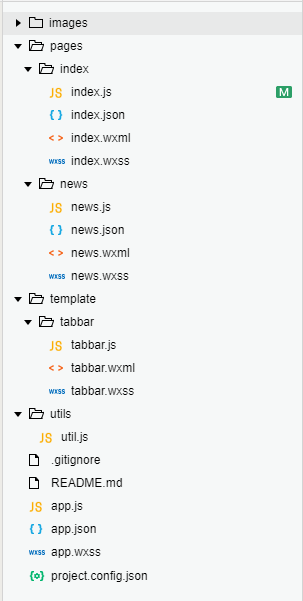
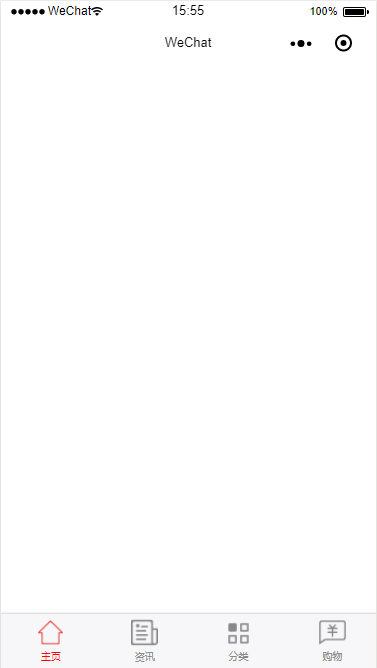

# 微信小程序自定义tabBar组件开发

以下代码保存到github地址：

## 实现代码

**项目目录**



template文件夹里存放tabbar模板。

**template/tabbar/tabbar.wxml**

```html
<!--template/tabbar/tabbar.wxml-->
<template name="tabBar">
<view class="tabBar">
  <block wx:for="{{tabBar}}" wx:for-item="item" wx:key="tabBar">
    <view class="tabBar-item">
      <navigator open-type="redirect" url="{{item.pagePath}}">
        <view><image class="icon" src='{{item.iconPath}}'></image></view>
        <view class="{{item.current== 1 ? 'tabBartext' :''}}">{{item.text}}</view>
      </navigator>  
    </view>
  </block>
</view>
</template>
```

**template/tabbar/tabbar.wxss**

```css
/* template/tabbar/tabbar.wxss */

.icon {
	width: 54rpx;
	height: 54rpx;
}

.tabBar {
	width: 100%;
	position: fixed;
	bottom: 0;
	padding: 10rpx;
	margin-left: -4rpx;
	background: #f7f7fa;
	font-size: 20rpx;
	color: #8a8a8a;
	box-shadow: 6rpx 6rpx 6rpx 6rpx #aaa;
}

.tabBar-item {
	float: left;
	width: 25%;
	text-align: center;
	overflow: hidden;
}

.tabBartext {
	color: red;
}

```

**template/tabbar/tabbar.js**

```javascript
//初始化数据
function tabbarinit() {
	return [{
			"current": 0,
			"pagePath": "/pages/index/index",
			"iconPath": "/images/home.png",
			"selectedIconPath": "/images/home_on.png",
			"text": "主页"
		},
		{
			"current": 0,
			"pagePath": "/pages/news/news",
			"iconPath": "/images/message.png",
			"selectedIconPath": "/images/message_on.png",
			"text": "资讯"

		},
		{
			"current": 0,
			"pagePath": "/pages/category/category",
			"iconPath": "/images/category.png",
			"selectedIconPath": "/images/category_on.png",
			"text": "分类"
		},
		{
			"current": 0,
			"pagePath": "/pages/buy/buy",
			"iconPath": "/images/buy.png",
			"selectedIconPath": "/images/buy_on.png",
			"text": "购物"
		}
	]

}
//tabbar 主入口
function tabbarmain(bindName = "tabdata", id, target) {
	var that = target;
	var bindData = {};
	var otabbar = tabbarinit();
	otabbar[id]['iconPath'] = otabbar[id]['selectedIconPath'] //换当前的icon
	otabbar[id]['current'] = 1;
	bindData[bindName] = otabbar
	that.setData({
		bindData
	});
}

module.exports = {
	tabbar: tabbarmain
}
```

到此改组件完成，然后讲解一下使用方法。 
我们先把样式载入到app.wxss

**app.wxss**

```css
@import "/template/tabbar/tabbar.wxss";
```

在index文件夹 

**pages/index/index.wxml**

```html
<!--pages/index/index.wxml-->
<import src="../../template/tabbar/tabbar.wxml" />
<template is="tabBar" data="{{tabBar:bindData.tabBar}}" />
```

**pages/index/index.js**

```javascript
// pages/index/index.js
const app = getApp();
var tabBar = require('../../template/tabbar/tabbar.js');
Page({

  /**
   * 页面的初始数据
   */
  data: {

  },

  /**
   * 生命周期函数--监听页面加载
   */
  onLoad: function(options) {
    tabBar.tabbar('tabBar', 0, this); //0表示第一个tabbar
  }
})
```

news.wxml与index.wxml一样 

**pages/news/news.wxml**

```html
<!--pages/news/news.wxml-->
<import src="../../template/tabbar/tabbar.wxml" />
<template is="tabBar" data="{{tabBar:bindData.tabBar}}" />
```

**pages/index/index.js**

```javascript
// pages/news/news.js
const app = getApp();
var tabBar = require('../../template/tabbar/tabbar.js');
Page({

  /**
   * 页面的初始数据
   */
  data: {

  },

  /**
   * 生命周期函数--监听页面加载
   */
  onLoad: function(options) {
    tabBar.tabbar('tabBar', 1, this); //1表示第一个tabbar
  }
})
```

## 效果如图



---

**原文地址：** [微信小程序自定义tabBar组件开发](https://blog.csdn.net/qq_29729735/article/details/78933721)