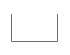
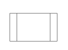
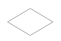
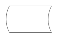
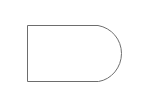
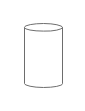
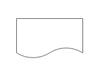

# 流程图flow-chart 教程

流程图是对过程、算法、流程的一种图像表示，在技术设计、交流及商业简报等领域有广泛的应用。通常用一些图框来表示各种类型的操作，在框内写出各个步骤，然后用带箭头的线把它们连接起来，以表示执行的先后顺序。用图形表示算法，直观形象，易于理解。有时候也被称之为输入-输出图。顾名思义，就是用来直观地描述一个工作过程的具体步骤。这种过程既可以是生产线上的工艺流程，也可以是完成一项任务所必需的管理过程。

如上表所示，流程图有一套标准的符号，每个符号代表特定的含义。举个例子，一个公司的产品检验流程可以用如下的流程图来表示：

### **流程图的基本元素：**

### **为什么要画流程图?**

一张简明的流程图，不仅能促进产品经理与设计师、开发者的交流，还能帮助我们查漏补缺，避免功能流程、逻辑上出现遗漏，确保流程的完整性。流程图能让思路更清晰、逻辑更清楚，有助于程序的逻辑实现和有效解决实际问题。

通常，对于任何希望创建流程的人来说，无论创建的是什么用的流程，流程图都是很有用的。它可以帮你：

1. 设计你产品的交互流程
2. 确保的你的产品在任何时候都是友好的（甚至包括你原来根本未曾考虑过的故障发生时）
3. 帮助你整合零散的线框图
4. 帮助你与不同背景的同事进行沟通：比如引导工程师开发

### **画流程图时需要注意哪些问题?**

1. 绘制流程图时，为了提高流程图的逻辑性，应遵循从左到右、从上到下的顺序排列，而且可以在每个元素上用阿拉伯数字进行标注。
2. 从开始符开始，以结束符结束。开始符号只能出现一次，而结束符号可出现多次。若流程足够清晰，可省略开始、结束符号。
3. 当各项步骤有选择或决策结果时，需要认真检查，避免出现漏洞，导致流程无法形成闭环。
4. 处理符号应为单一入口、单一出口。
5. 连接线不要交叉。
6. 如果两个同一路径的下的指示箭头应只有一个。
7. 相同流程图符号大小需要保持一致。
8. 处理为并行关系，可以放在同一高度。
9. 必要时应采用标注，以此来清晰地说明流程。
10. 流程图中，如果有参考其他已经定义的流程，不需重复绘制，直接用已定义流程符号即可。

### 流程图符号的用法

**处理** 代表流程图中的一个处理或者步骤。

**预处理** 表示决定下一个步骤的一个子进程。可以有多种结果，但往往只有两个 – yes和no。

**判断** 对一个条件进行判断抉择。可以有多种结果，但往往只有两个 – 是的，没有。

**起点 和 ** **终点** 代表一个流程开始和结束。

**数据形状** 指示信息进程外，或离开的过程。

**延迟形状** 代表没有活动，做一个等待期。在流程图中，延误往往是重要的，因为它们可能会导致增加产品的成本，或简单地推迟其生产。

**数据库** **形状** 使用这种形状的结果被储存在信息的步骤。

**离页引用** 表示下一个或上一个步骤是别的地方上的流程图。它在大型流程图特别有用。

**流程图形状** 亿图特有的流程图符号，可以在设计中使用上下文菜单更改其外观。

**文档** 代表一个文件和资料集。

