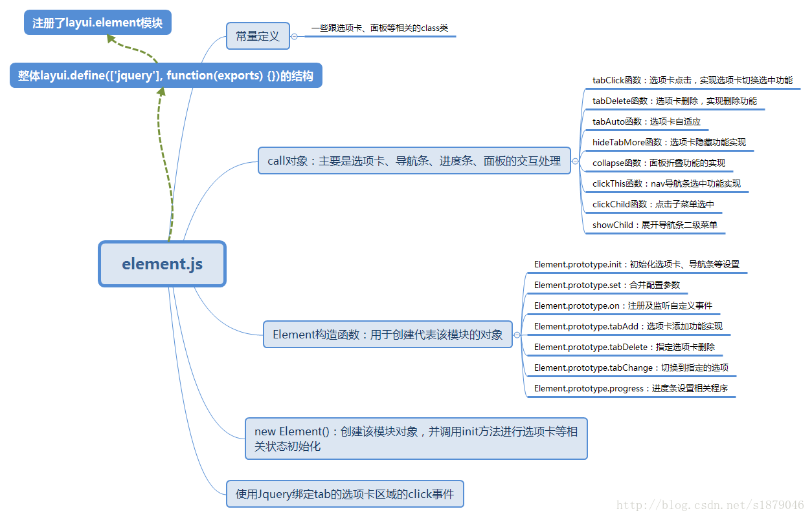
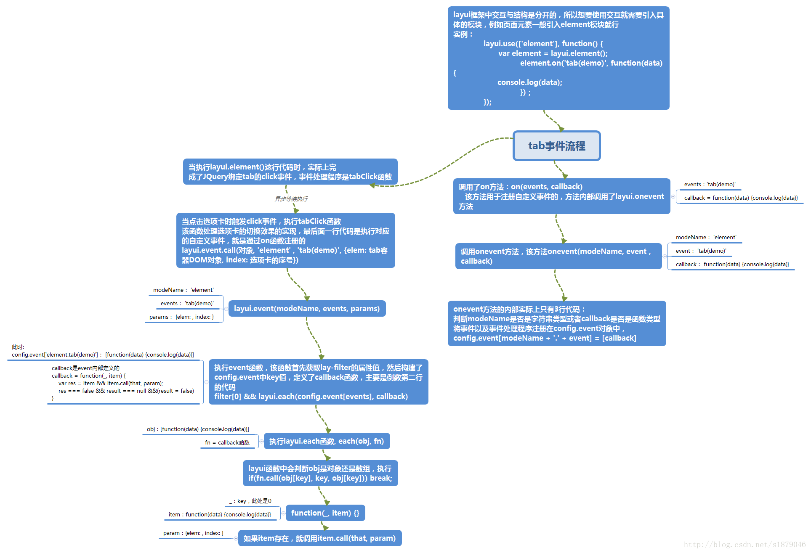

# element模块以及自定义事件机制

element内置模块时layui框架中页面元素的交互功能的实现，主要是选项卡、面板、导航等的交互的实现。

下面先分析element模块的组织结构，具体如下图所示： 



从上图中可以看出，element模块使用该框架自己的模块加载机制来加载该模块。

该框架内置的模块都是采用面向对象的编程，该模块也是，定义了Element构造函数，对外的API接口都定义在Element的原型对象上，使用JQuery来绑定一些原生的事件。call对象中定义真正处理选项卡等交互以及初始状态的处理程序。

element模块中使用框架自己定义的事件处理机制，具体实际上使用layui主体文件中的onevent和event来进行事件的注册以及事件的执行。

因为该模块最后输出的是函数类型，所以在使用该模块时要求如下：

```js
layui.use(['element'], function() {
    var element = layui.element();
});
```

上面实际会自动执行一些初始化的工作，具体就会选项卡、面板等的初始状态的设置。

下面讲解layui自定义的事件机制，该框架定义事件名的形式如下：

```js
功能名(lay-filter属性名)
```

在该框架中有lay-filter属性，该属性就是用于事件标识的。

什么时候使用该框架内置的事件机制？当你想要执行其他的操作，例如获取相关数据等，就可以使用自定义的事件机制。

下面使用实例来讲解框架事件机制的具体的逻辑处理，假设选项卡有属性lay-filter=’demo’, 那么就可以使用该框架自定义的事件机制，具体如下：

```js
// 使用该机制的代码：
layui.use(['element'], function() {
    var ele = layui.element();

    // tab(demo)就是事件名
    ele.on('tab(demo)', function(data) {
        cosnole.log(data);
    });
});
```

具体的逻辑流程如下图： 



具体如上图所示，实际上内部维持了config.event对象来保存事件，onevent实现事件注册以及监听，实际上就是存储在config.event对象中，具体存储形式如下：

```js
config.event[modeName + '.' + event] = [callback]
```

在本例中modeName为element，event为tab(demo), callback就是就是事件处理程序，本例中callback如下：

```js
callback = functio(data) {
    console.log(data);
};
```

