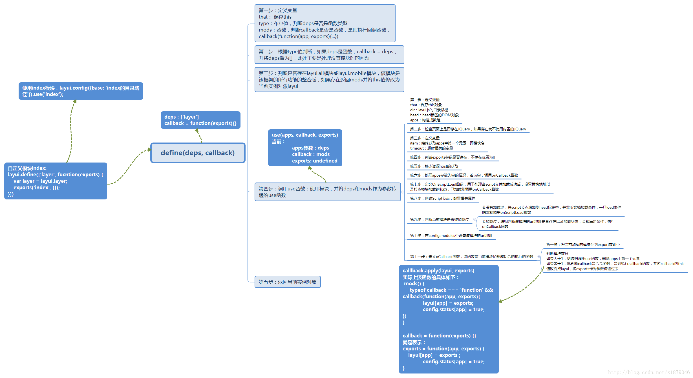
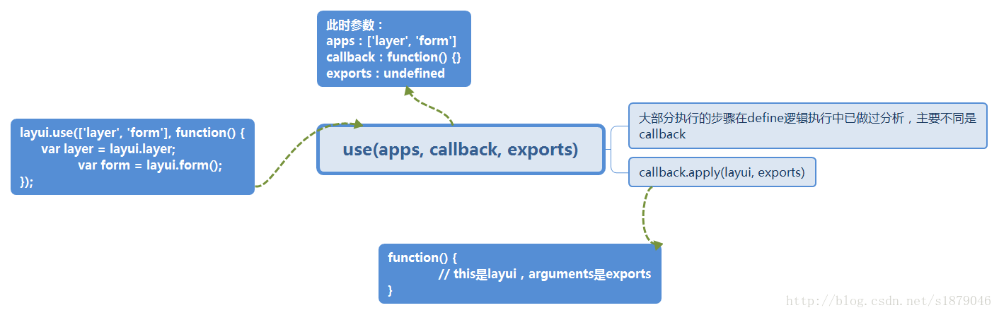

# layui模块加载机制

本章主要分析layui框架自己的模块加载机制的实现。

该框架的模块加载机制主要是使用define和use这两个方法来实现的，define方法适用于定义模块，use方法是用于使用模块，它们都定义在Lay构造函数的原型对象上，而window.layui = new Lay()；，所以可以通过layui.define、layui.use来直接调用。

define以及use方法的定义如下：

```js
Lay.fn.define = function(deps, callback) {
    // 相关处理代码
};
```

```js
Lay.fn.use = function(apps, callback, exports) {
    // 相关处理代码
};
```

在该官网上介绍了该框架的几种使用，常用有两种方式： 

1、自定义模块，在自己定义的模块中使用相关的模块，如下面所示：

```js
// index.js文件代码如下：
layui.define(['layer'], function(exports) {
    var layer = layui.layer;
    exports('index', {});
})
```

```js
// 在html文件中使用index模块:
layui.config({
    base: 'index所在目录路径'
}).use('index');
```

2、直接使用use方法

```js
layui.use(['layer'], function() {
    var layer = layui.layer;
});
```

本章就使用第一种方式来讲解layui框架的模块加载机制，例子就使用上面1中的例子，具体分析步骤如下： 

1、先分析index.js中define方法的逻辑处理 

2、再分析use方法的逻辑处理

我详细分析了define方法执行的每一步并绘制了逻辑图，具体如下：



#### define(deps,callback)

第一步：定义变量

* that：保存this
* type：布尔值，判断deps是否是函数类型
* mods：函数，判断callback是否是函数，是则执行回调函数
* calllback(function(app, exports){...})

第二步：根据type值判断，如果deps是函数，callback=deps，并将deps置为[]，此处主要是处理没有模块的问题

第三步：判断是否存在layui.all模块或layui.mobile模块，该模块是该框架的所有功能的整合版，如果存在返回mods并将this值修改为当前实例对象layui

**第四步：调用use函数：使用模块，并将deps和mods作为参数传递给use函数**

第五步：返回当前实例对象

#### use(apps, callback, exports)

第一步：定义变量

* that：保存this对象
* dir：layui.js的目录路径
* head：head标签的DOM对象
* apps：构建成数组

第二步：检查页面上是否存在JQuery，如果存在就不使用内置的JQuery

第三步：定义变量

* item：始终获取apps中的第一个元素，即模块名
* timeout：超时相关的变量

第四步：判断exports参数是否存在，不存在就置为[]

第五步：静态资源host的获取

第六步：处理apps参数为空的情况，若为空，调用onCallback函数

第七步：定义onScriptLoad函数，用于处理当script文件加载成功后，设置模块及检查模块加载的状态，已加载则调用onCallback函数

第八步：创建Script节点，配置相关属性

第九步：判断当前模块是否被加载过

* 若没有加载过，将script节点追加到head标签中，并监听文档加载事件，一旦load事件触发就调用onScriptLoad函数
* 若加载过，递归判断该模块的url地址是否存在以及加载状态，若都满足条件，执行onCallback函数

第十步：在config.modules中设置该模块的url地址

第十一步：定义onCallback函数，该函数是当前模块加载成功后的执行函数

#### callback.apply(layui, exports)

第一步：将当前加载的模块传到exports数组中

* 判断模块数目	
  * 如果大于1，则递归调用use函数，删除apps中的第一个元素
  * 如果等于1，就判断callback是否是函数，是则执行callback函数，并将callback的this值改变成layui，将exports作为参数传递过去

具体的步骤如上图所示，实际上define还会调用use方法，虽然define方法是定义模块的实际上还调用了use方法。

use方法的逻辑处理的每一步分析，实际上在define中就具体分析了，在单独使用use的过程中，大部分地处理是相同的，但还是有所区别，具体如下图所示： 



因为相关的逻辑分析细节比较多，通过图的方式会更加直观，文字描述会比较繁琐。 

该框架的模块加载机制主要就是通过define以及use来实现，内部实际上维护了config.status来记录模块的加载状态，维护config.modules来存储模块的URL，内部通过script标签来加载模块。 

通过今天的学习，对于简单模块加载机制有了一定的认知，对于面向对象以及相关代码的组织也有了一定的理解。