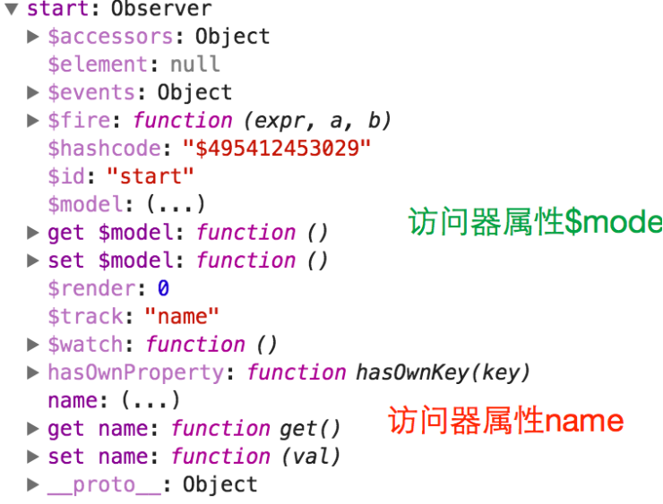

# vm

avalon的所有操作都是围绕vm进行。 vm，亦即view model，视图模型。只要我将一个JS对象添加一个$id属性， 再放到avalon.define方法里面，就能得到一个vm。

```javascript
 var vm = avalon.define({
    $id: "start",
    name: "test"
})
```

vm是一种利用`Proxy`或 `Object.defineProperties`或`VBScript`创建的特殊对象。

里面以`$`带头的属性或放到`$skipArray`，都转换为访问器属性，也就是其他语言的setter, getter。因此如果这个属性最初没有定义，那么它就不会转换为访问器属性，修改该属性，就不会刷新视图。

avalon定义了的vm，都可以在avalon.vmodels中查看到。我们可以在chrome控制台下看一下刚才的start vm的构造。



平时而言，vm是一种比较重型的对象。从占用内存角度来划分，浏览器中的四种对象排行如下：

1. 超轻量 Object.create(null)
2. 轻量 一般的对象 {}
3. 重量 带有访问器属性的对象, avalon VM对象
4. 超重量 各种节点或window对象

我们构建VM时只允许存在普通对象(不能是某个函数的实例),函数,数组,数字,字符串,布尔,其他一切不支持(undefined与null不能出现在定义VM时,只能用它们来赋值)

## 内部属性

VM中以$开头的属性都是框架保留使用的特殊属性,大家为数据起名字时要小心避开

这些以`$`开头的属性,目前除了`$id`, `$events`, `$watch`, `$fire`, `$model`比较稳定外, 其他系统属性在不同版本存在增删的情况.

1. `$id`, vm的名字
2. `$watch`, 用于添加监听函数
3. `$fire`, 用于触发监听函数
4. `$events`, 用于储存监听函数
5. `$model`, 返回一个纯净的JS对象
6. `$element`, 2.0新增, 当我们用ms-controller, ms-important指定一个VM的作用域,对应元素节点会放到这个属性上.
7. `$computed`, 2.2.1新增,用来集中定义计算属性

另外，avalon在VBScript或Object.defineProperty模式下不支持追加新属性与方法

```javascript
var vm = avalon.define({
    $id: "test",
    test1: "点击测试按钮没反应 绑定失败"
})
vm.aaa  = 'newProp'
vm.newMethod = function () { //不能再追加此方法
    vm.test1 = "绑定成功"
}
```

但我们可以通过以下方式，实现添加子属性。

```javascript
var vm = avalon.define({
    $id: "test",
    placehoder: {}
});
setTimeout(function () {
    vm.placehoder = {//我们必须要通过 = ，直接添加一个对象来添加子属性， 不能
        aaa: 1, //vm.placehoder.aaa =1; vm.placehoder.bbb = 2这样分散地添加子属性
        bbb: 2
    }
}, 1000)
```

但在firefox4与chrome50后,浏览器支持Proxy对象,可以完美监听对象的增删改查,因此可以动态添加属性或方法

大家可以在浏览器控制台下敲入`window.Proxy`来知晓支持情况,也可以 通过`avalon.config.inProxyMode`来开闭此特性. 这个模式暂时只用于avalon.modern.js文件

VM中的数据更新，只能通过 = 赋值方式实现。但要注意在IE6-8，由于VM是一个VBScript对象，为VM添加新属性会抛错， 因此我们想批量更新属性要时格外小心了，需要用hasOwnProperty进行过滤。

注意在IE6-8 下，err是VBscript的关键字，VM中存在这个字段，就会将VM中的其他数组变成字符串，详见[这里](https://github.com/RubyLouvre/avalon/issues/627)

> 为了性能起见，请确保你的对象结构足够扁平，套嵌层次不能太深，里面的数组不能太长。

## 监控属性

在VM中，改变它们会引起视图改变的属性。如果一个属性是`$`开头, 或在定义时放在`$skipArray`数组中,或是函数或节点元素, 它们都不会转换成监控属性.

此外, 改变监控属性的值还会触发对应的$watch监听回调.

## 计算属性

计算属性是监控属性的强化版，它**必须**依赖于1个或多个监控属性。通过普通的监控属性实现对视图的监听，它自身的变化也由监控属性进行驱动。

计算属性集中定义在$computed对象中。有多种形式。

```javascript
//函数形式的只读计算属性
avalon.define({
    $id: 'test',
    firstName: '333',
    lastName: 'xxx',
    $computed: {
        //fullName依赖于firstName与lastName
        fullName: function(){
            return this.firstName+' '+this.lastName
        },
        //xxx只依赖于firstName
        xxx: function(){
            return this.firstName+'!!'
        }
    }
})
```

```javascript
//对象形式的可读写计算属性
avalon.define({
    $id: 'test',
    firstName: '333',
    lastName: 'xxx',
    $computed: {
        //fullName依赖于firstName与lastName
        fullName: {
            get: function(){
                return this.firstName+' '+this.lastName
            },
            set: function(val){
                var arr = val.split(' ')
                this.firstName = arr[0]
                this.lastName = arr[1]
            }
        }
    }
})
```

例子（请学完组件再看）

```html
<div ms-controller="avalon">
        {{@test1}}
        <table>
            <tr>
                <td>
                    <ul>
                        <li ms-for="el in @communities">{{el.community_name}}</li>
                    </ul>
                </td>
                 <td>
                   <wbr ms-widget="{is:'ms-autocomplete', $id: 'aaa', name: 'community_id', communities :@communities}" />

                </td>
            </tr>
        </div>
    </div>
    <script>

        avalon.component('ms-autocomplete', {
            template: '<div><input type="text" ms-duplex-string="@search" />' +
                '<ul><li ms-for="($idx,opt) in @aaa">' +
                '{{opt.community_name}}</li></ul></div>',
            defaults: {
                search: '',
                communities: [],
                onReady:function(e){
                    e.vmodel.$watch('search', function(v){
                        avalon.log('current search word is '+ v)
                    })
                },
                $computed: {
                    aaa: {
                        get: function() {
                            var ret = [];
                            for (var i = 0; i < this.communities.length; i++) {
                                if ((this.communities[i].community_name.indexOf(this.search) > -1)) {
                                    ret[ret.length] = this.communities[i];
                                    if(ret.length === 5){
                                        break
                                    }
                                }
                            }
                            return ret;
                        }
                    }
                }

            }
        });
        communities = [{
            community_id: 3,
            community_name: 'This',
        }, {
            community_id: 5,
            community_name: 'isnot',
        }, {
            community_id: 8,
            community_name: 'agood',
        }, {
            community_id: 10,
            community_name: 'example',
        }, {
            community_id: 22,
            community_name: 'for',
        }, {
            community_id: 23,
            community_name: 'such',
        }, {
            community_id: 43,
            community_name: 'test',
        }, {
            community_id: 45,
            community_name: 'thank',
        }, {
            community_id: 47,
            community_name: 'you',
        }, {
            community_id: 50,
            community_name: 'verymuch',
        }, {
            community_id: 51,
            community_name: 'youre',
        }, {
            community_id: 53,
            community_name: 'welcome',
        }, {
            community_id: 54,
            community_name: 'too',
        }, {
            community_id: 55,
            community_name: 'notsogood',
        }, {
            community_id: 56,
            community_name: 'cheerful',
        }];
        var vm = avalon.define({
            $id: 'avalon',
            test1: 'test1',
            communities: communities,
        });
    </script>
```

## 监控数组

操作此数组的方法会同步视图的特殊数组，它是由VM中的数组自动转换而来。方便与ms-repeat, ms-each配合使用， 能批量同步一大堆DOM节点。

监控数组的方法与普通数组没什么不同，它只是被重写了某一部分方法，如 pop, shift, unshift, push, splice，sort, revert。其次添加了四个移除方法，remove, removeAt, removeAll, clear， 及ensure，pushArray，set方法。

1. pushArray(el), 要求传入一数组，然后将它里面的元素全部添加到当前数组的末端。
2. remove(el), 要求传入一元素，通过全等于比较进行移除。
3. removeAt(index), 要求传入一数字，会移除对应位置的元素。
4. removeAll(arrayOrFunction), 有三种用法，如果是一个函数，则过滤比较后得到真值的元素， 如果是一数组，则将此数组中与原数组相等于的元素全部移除；如果没有任何参数，则全部清空。
5. clear()，相当于removeAll()的第三种方法，清空数组的所有元素。由于需要同步视图的缘故，不能通过vm.array.length = 0的方法来清空元素。
6. ensure(el)，只有当数组不存在此元素时，才添加此元素。
7. set(index, el)，用于更新某一索引位置中的元素，因为简单数组元素的数组，是不会转换它的元素。
8. toJSON()， 用于取得数组的`$model`, 2.2.2新添加的方法

```
var vm = avalon.define({
   $id:'xxx',
   array: [1,2,3]
})
vm.array.push(4,5,6)
vm.array.pushArray([4,5,6])//这个比push方法好用
vm.array.clear()
vm.array.ensure(3) //[3]
vm.array.ensure(3) //[3]
vm.array.ensure(4) //[3,4]
```

> 注意,修改某个数组元素必须使用set方法. 如果是修改`对象数组`的某个元素的属性可以用`vm.array[1].prop = 'newValue'`

## 非监控属性

这包括框架添加的`$id`, ​`$events`, ​`$model`属性, ​`$fire`, ​`$watch`, ​`$render`方法， 及用户自己设置的以​`$`开头的属性，放在`$skipArray`数组中的属性，值为函数、各种DOM节点的属性， 总之，改变它们的值不会产生同步视图的效果。

## `$watch`方法

在avalon早期是, 存在一个对象能mixin进每个VM,让VM具有`$watch`, `$unwatch`, ​`$fire`, `$events`等方法或属性. 这有点像jQuery的on, off, trigger方法,只是为了更造近angular等MVVM框架,名字起成这样.

>此方法是用于监听vm中的对象的属性变化.
>
>换言之,它不能监听函数,不能监听简单数组的元素变化(如[1,2,3]变成[4,2,3])

它能监听子级对象的属性变化,能监听对象数组的属性变化(如[{a:1,b:2}]变成[{a:'change',b:2}]), 还有数组的长度属性变化

```javascript
var unwatch = vm.$watch("aaa", function observe(a, b) {
    expect(a).to.be(6)
    expect(b).to.be(2)
})
unwatch() //移除当前$watch回调
```

当解除监听后,以后aaa属性的值再发生变化,那么observe方法就不会再执行. 注意unwatch不等于observe

监听函数有三个参数， 第一个是新值， 第二个是旧值， 第三个是发生变动的属性的名字。

`$watch`方法供与其他操作DOM的库一起使用的,如富文本编辑器什么。在`$watch`回调里更新VM自身的属性是非常危险的事,很容易引发死循环

## `$fire`方法

`$fire`可以传多个参数， 第一个参数为事件名，或者说是VM上已存在的属性名， 当VM中对应的属性发生变化时，框架内部就调用​`$fire`方法， 依次传入属性名，当前属性值，过去属性值。

## 数据模型

是指VM中的`$model`属性，它是一个纯净的javascript对象，去掉​`$id`, `$watch`等方法或属性，可以直接通过​`$.ajax`提交给后端，当然我们 还可以通过`JSON.parse(JSON.stringify(vm.$model))`干掉里面的所有函数。

> 注意,不要修改`$model`,你只能通过VM来改动`$model`,否则在1.5中`,$model`是只读的,每次都是返回一个全新的对象给你 你改了也没有用!

## vm是如何作用视图

我们需要在页面上，使用ms-controller或ms-important来圈定每个vm的作用范围。当页面domReady时，vm就将自动将其里面的数据替换到各种指令中去，实现视图刷新效果。

> 注意一个vm只能在页面上使用一次。即页面上不能重复出现相同的值的ms-controller。

```html
<div ms-controller="test">{{@aaa}}</div>
<div ms-controller="test">{{@aaa}}</div>
<div ms-controller="test">{{@aaa}}</div>
```

由于test这个vm拥有一个叫`$element`的属性，它是保存其关联的元素节点，如果定义了多少个，那么它会保留最后的那个DIV。以后它的属性变化，只会作用最后的那个DIV。

## vm的运作原理

avalon之所以使用Proxy, Object.defineProperty或VBScript来构造vm，那是因为它们创建出来的对象有一种自省机制，能让我们得知vm正在操作或访问了我们的对象。

对于Object.defineProperty或VBScript，主要是靠将普通属性变成访问器属性。访问器属性内部是拥有两个方法，setter与getter。当用户读取对象的属性时，就将调用其getter方法，当用户为此属性赋值时，就会调用setter方法。因此，我们就不需要像angular那样，使用脏检测，就得知对象被修改了某些属性了。 并且能准确得知那些属性，及时地同步视图的相应区域，实现最小化刷新视图。

> 插值表达式里的内容与 `ms-*` 的属性值都会转换求值函数, 比如说 `` 变成`function(){return **vmodel**.aaa}``ms-attr="{title: @name}"` 变成 `function(){ return {title: __vmodel__.name} }` 此外,请不要出现`@aaa[@bbb].ddd`, `@eee[ddd]`, 可能导致依赖收集失败, 无法更新对应区域

对于`Proxy(智能代理)`，这最早发迹于firefox4，现在许多新浏览器都支持，它能监听外部用户对它的14种，比如说读写属性，调用方法，删除旧属性，添加新属性，被for in循环， 被in关键字进行存在性检测， 被new……因此之前所说的，不能监听没预先定义的属性， 这个难题被Proxy搞定了。

当我们得知vm的属性发生变化了，如何更新视图呢？在avalon2中，这个是由[虚拟DOM](http://avalonjs.coding.me/virtualdom.html)来处理。

虚拟DOM比较复杂，大家看不懂可以略过。

2.2.2对VM的生成机制进行了大重构,[此文](https://segmentfault.com/a/1190000007727103)对此有详细描述,大家感兴趣可以看看