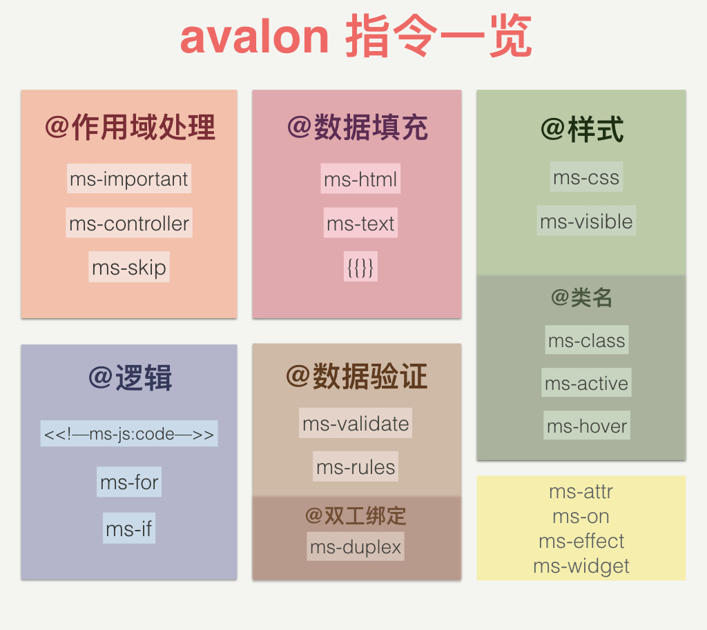
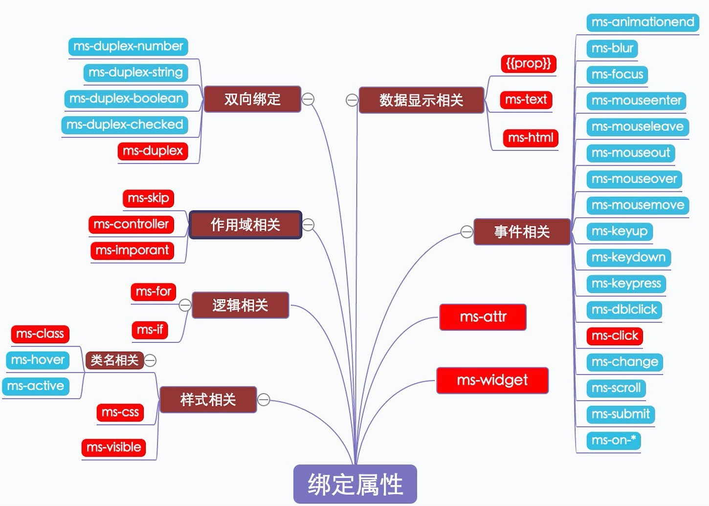

avalon的指令是一个非常重要的东西,它用来引入一些新的HTML语法, 使元素拥有特定的行为。 举例来说，静态的HTML不知道如何来创建和展现一个日期选择器控件。 让HTML能识别这个语法，我们需要使用指令。 指令通过某种方法来创建一个能够支持日期选择的元素。

指令一共拥有3种形式:

# 指令

avalon的指令是一个非常重要的东西,它用来引入一些新的HTML语法, 使元素拥有特定的行为。 举例来说，静态的HTML不知道如何来创建和展现一个日期选择器控件。 让HTML能识别这个语法，我们需要使用指令。 指令通过某种方法来创建一个能够支持日期选择的元素。

指令一共拥有3种形式

1. 插值表达式
2. 自定义标签
3. 绑定属性

其中`绑定属性`的种类是最多的，它们都位置于元素节点中，以ms-开头或以:开头(avalon2.1.7新增)

绑定属性的属性名是以-分成几段 其中第二个就是指令的名字, 如ms-css, ms-attr, ms-html, ms-text, ms-on都是来源于jQuery同名方法名, 简单好记.

```html
<p ms-on-click="@clickFn" ms-if="@toggle">{{@name}}</p>
```





> 与1.4,1.5相比, 2.0是移除了ms-repeat, ms-each, ms-with, ms-include, ms-include-src,ms-data, ms-scan, ms-if-loop指令.