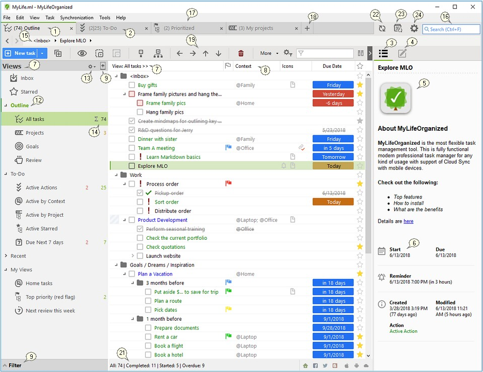
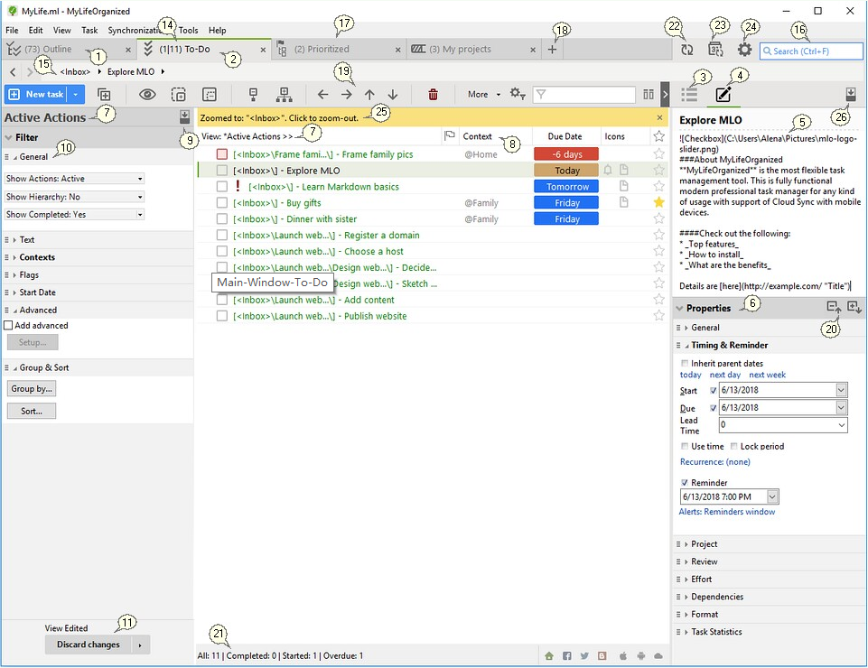

# 主窗口

以下是主窗口中每个元素的简要概述。

**1. 任务大纲**

任务大纲在层次结构中包含文件夹、目标、项目、任务和其他内容。

**2. 待办事项**

在将所有目标、项目和任务输入大纲后，MLO能显示那些需要立即关注的任务。这些任务被放在待办事项列表中.待办事项列表是一个简单的操作列表，可以根据上下文或其他任务属性对其进行分组。请参阅更多有关大纲、待办事项、视图和视图的信息.

**3. 任务预览模式**

有两种模式的任务说明和属性：预览(3)和编辑(4)。

在辅助模式下，您可以看到为其启用的任务的属性和新的注释。

**4. 任务编辑模式**

切换到辅助模式以编辑任务属性和注释。若要在模式之间切换：

* 只需单击右边相应的图标即可。
* 在预览模式下，单击创建的便笺-编辑模式将被自动激活。单击预览图标以停止编辑。因此，即使在预览中，注释也可以快速编辑。

**5. 任务说明**