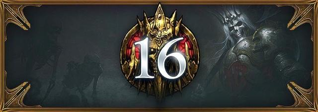
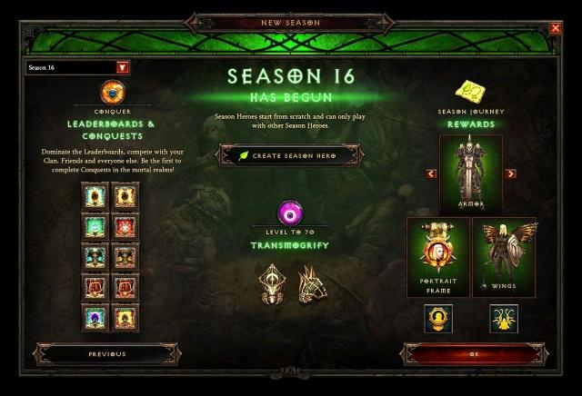
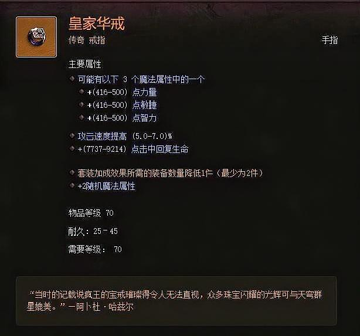
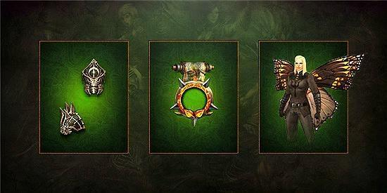
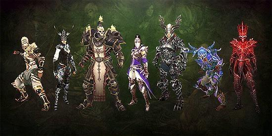

# 暗黑3第十六赛季前瞻：华戒赛季于1月18日开启

S16赛季将伴随新补丁于1月18日正式开启，与早前公布的11日又延了一周，并于3月17日结束。官方正式发布推文展示新赛季的内容以及最终2.6.4补丁的修订内容，以下是具体内容：

## 新赛季主题

第十六赛季引入了一种全新的BUFF，它可以改变你的游戏方式。在新赛季中所有玩家都可以拥有额外的“皇家华戒”的特效，当然这个特效无法和你身上（萃取）的华戒效果叠加。这对于许多玩家来说，他们可以额外的将一件传奇装备融入到自己的玩法中，从而增加玩法的极限。

## 新赛季奖励

新赛季中除了固定的征服者套装头盔和肩膀幻化外，玩家还可获得召唤冒险者系列头像框，以及一对蝴蝶翅膀，这对翅膀非常适合摆拍，除了宇宙之翼很少有这么好看的翅膀了。

## 赛季之旅

新赛季里你依然可以通过完成赛季之旅的征服者来获得额外的箱子，最多可以通过赛季获得4个，而S16赛季征服者需要完成以下的目标：

* 在5分钟内完成T13小秘境
* 将3颗传奇宝石升55级
* 完成两个赛季征服者
* 在T13难度下30秒内击杀阿兹莫丹
* 在T13难度中完成宝藏秘境
* 单人达到大秘境60层
* 打一颗50+的卡德山
* 用卡奈魔盒重铸一件装备

## 海德格的赠礼

新赛季海德格依旧会在你完成赛季之旅后赠予你奖励，你需要分别完成赛季之旅的第2章、第3章和第4章，获得三个包裹集齐套装。每个赛季你只能获得一次海德格的赠礼，所以需要做好你的选择！

## 职业套装

* 野蛮人——不朽之王的呼唤
* 圣教军——圣光追寻者
* 猎魔人——娜塔亚的复仇
* 武僧——乌莲娜的谋略
* 死灵法师——塔格奥的化身
* 巫医——亚拉基尔的灵魂
* 魔法师——维尔的神装

## 新补丁改动

### 游戏体验

* 每个角色的军械库增加5页配装标签，总数提升至10页
* 传奇药水不再存放于玩家装备栏，可以通过右键动作栏的药水标签来访问改变
* 大秘境钥石现在存储于材料页，现存于装备栏和储存箱的钥石将被自动转移
* 太古传奇现在会在掉落时以红色光柱标识
* 太古传奇现在会在迷你地图上红色五芒星图标标明
* 太古传奇的图标现在拥有红色边框和更新的背景

### 大秘境

* 大秘境开启时不再允许改变巅峰点数配置
* 玩家现在可以匹配进开启了大秘境的公开游戏，以这种方式加入游戏的玩家将无法进入已开启的大秘境，而大秘境内的玩家将继续完成此秘境，且不会有额外的难度缩放

### 赛季

* S16赛季主题：皇家华戒赛季，此增益给予所有赛季玩家皇家华戒的传奇效果，不会和其他皇家华戒叠加，无论已装备还是卡奈魔盒萃取的
* 和先前赛季增益不同，此增益不应用于非赛季玩家
* 当首次完成赛季单人70层大秘境时，秘境守卫将保证掉落一件太古装备

### 套装

**梦魇者的遗礼**

* 2件套装加成效果由100%提升至750%（译注：由PTR的500%上调）

### 野蛮人

**蕾蔻的传世铠**

* 6件套装加成效果由2800%提升至5500%（译注：由PTR的7000%下调）不朽之王的呼唤
* 6件套装加成效果由1500%提升至4000%大地之力
* 6件套装加成效果由5600%提升至20000%废土之怒
* 6件套装加成效果由3000%提升至10000%

### 圣教军

**唤魔师的荆棘**

* 2件套装加成效果由140%提升至350%6件套装加成效果由5400%提升至15000%罗兰的传世甲
* 4件套装加成效果由3300%提升至13000%6件套装加成效果由50%提升至75%圣光追寻者
* 6件套装加成效果由2000%提升至12000%

### 猎魔人

**掠夺者的化身**

* 6件套装加成效果由3000%提升至12000%邪秽之精
* 6件套装加成效果由100%提升至350%娜塔亚的复仇
* 6件套装加成效果由3500%提升至14000%暗影装束
* 2件套装加成效果由1200%提升至6000%6件套装加成效果由50000%提升至75000%

### 武僧

**乌莲娜的谋略**

* 6件套装加成效果由2100%提升至9000%尹娜的真言
* 6件套装加成效果由150%提升至750%（译注：由PTR的1500%下调）猴王战甲
* 6件套装加成效果由1000%提升至1500%千风飓
* 2件套装加成效果由100%提升至400%6件套装加成效果由1300%提升至6000%死灵法师

**塔格奥的化身**

* 6件套装效果加成由3300%提升至3800%巫医

**亚拉基尔的灵魂**

* 6件套装加成效果由4500%提升至9000%魔牙战装

* 2件套装加成效果由1500%提升至3000%6件套装加成效果由4400%提升至9000%玉魂师的战甲
* 2件套装加成效果由560秒提升至3500秒6件套装加成效果由1650秒提升至10000秒祖尼玛萨之魂
* 6件套装加成效果由5500%提升至15000%

### 魔法师

**塔·拉夏的法理**

* 6件套装加成效果由750%提升至2000%（译注：由PTR的3000%下调）

**德尔西尼的杰作**

* 6件套装加成效果由3800%提升至8500%维尔的神装

* 6件套装加成效果由50%提升至100%

> 你准备好迎接新赛季了吗？如果有你对新赛季有什么想法欢迎评论交流，关注我。等新赛季大家一起开车