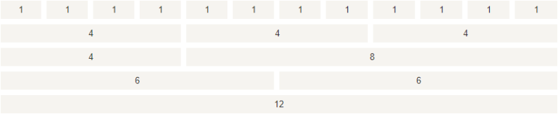

Bootstrap 提供了一套响应式、移动设备优先的流式网格系统，随着屏幕或视口（viewport）尺寸的增加，系统会自动分为最多 12 列。

我们也可以根据自己的需要，定义列数：

 

Bootstrap 4 的网格系统是响应式的，列会根据屏幕大小自动重新排列。
<!--more-->
## 网格类

Bootstrap 4 网格系统有以下 5 个类:

- .col- 针对所有设备
- .col-sm- 平板 - 屏幕宽度等于或大于 576px
- .col-md- 桌面显示器 - 屏幕宽度等于或大于 768px)
- .col-lg- 大桌面显示器 - 屏幕宽度等于或大于 992px)
- .col-xl- 超大桌面显示器 - 屏幕宽度等于或大于 1200px)

### 网格系统规则

Bootstrap4 网格系统规则:

- 网格每一行需要放在设置了 `.container` (固定宽度) 或 `.container-fluid` (全屏宽度) 类的容器中，这样就可以自动设置一些外边距与内边距。
- 使用行来创建水平的列组。
- 内容需要放置在列中，并且只有列可以是行的直接子节点。
- 预定义的类如 .row 和 .col-sm-4 可用于快速制作网格布局。
- 列通过填充创建列内容之间的间隙。 这个间隙是通过 .rows 类上的负边距设置第一行和最后一列的偏移。
- **网格列是通过跨越指定的 12 个列来创建**。 例如，设置三个相等的列，需要使用用三个.col-sm-4 来设置。
- Bootstrap 3 和 Bootstrap 4 最大的区别在于 Bootstrap 4 现在使用 flexbox（弹性盒子） 而不是浮动。 Flexbox 的一大优势是，没有指定宽度的网格列将自动设置为**等宽与等高列** 。 如果您想了解有关Flexbox的更多信息，可以阅读我们的CSS Flexbox教程。

下表总结了 Bootstrap 网格系统如何在不同设备上工作的：

 

以下各个类可以一起使用，从而创建更灵活的页面布局。

------

## Bootstrap 4 网格的基本结构

以下代码为 Bootstrap 4 网格的基本结构:

```html
<!-- 第一个例子：控制列的宽度及在不同的设备上如何显示 -->
<div class="row">
  <div class="col-*-*"></div>
</div>
<div class="row">
  <div class="col-*-*"></div>
  <div class="col-*-*"></div>
  <div class="col-*-*"></div>
</div>
 
<!-- 第二个例子：或让 Bootstrap 者自动处理布局 -->
<div class="row">
  <div class="col"></div>
  <div class="col"></div>
  <div class="col"></div>
</div>
```

第一个例子：创建一行(**`<div class="row">`**)。然后， 添加是需要的列( **`.col-*-*`** 类中设置)。 第一个星号 (`*`) 表示响应的设备: sm, md, lg 或 xl, 第二个星号 (`*`) 表示一个数字, 同一行的数字相加为 12。

第二个例子: 不在每个 **col** 上添加数字，让 bootstrap 自动处理布局，同一行的每个列宽度相等： 两个 **"col"** ，每个就为 50% 的宽度。三个 **"col"每个就为 33.33% 的宽度，四个 **"col"**每个就为 25% 的宽度，以此类推。同样，你可以使用 **.col-sm|md|lg|xl** 来设置列的响应规则。

接下来我们可以看看实例。

### 创建相等宽度的列，Bootstrap 自动布局

```html
<!DOCTYPE html>
<html>

	<head>
		<title>Bootstrap 实例</title>
		<meta charset="utf-8">
		<meta name="viewport" content="width=device-width, initial-scale=1">
		<link rel="stylesheet" href="https://cdn.staticfile.org/twitter-bootstrap/4.1.0/css/bootstrap.min.css">
		<script src="https://cdn.staticfile.org/jquery/3.2.1/jquery.min.js"></script>
		<script src="https://cdn.staticfile.org/popper.js/1.12.5/umd/popper.min.js"></script>
		<script src="https://cdn.staticfile.org/twitter-bootstrap/4.1.0/js/bootstrap.min.js"></script>
	</head>

	<body>

		<div class="container-fluid">
			<h1>Hello World!</h1>
			<p>创建三个相等宽度的列! 尝试在 class="row" 的 div 中添加新的 class="col" div，会显示四个等宽的列。</p>
			<div class="row">
				<div class="col" style="background-color:lavender;">.col</div>
				<div class="col" style="background-color:orange;">.col</div>
				<div class="col" style="background-color:lavender;">.col</div>
			</div>
		</div>

	</body>

</html>
```

### 等宽响应式列

以下实例演示了如何在平板及更大屏幕上创建等宽度的响应式列。 **在移动设备上，即屏幕宽度小于 576px 时，四个列将会上下堆叠排版**:

```html
<!DOCTYPE html>
<html>

	<head>
		<title>Bootstrap 实例</title>
		<meta charset="utf-8">
		<meta name="viewport" content="width=device-width, initial-scale=1">
		<link rel="stylesheet" href="https://cdn.staticfile.org/twitter-bootstrap/4.1.0/css/bootstrap.min.css">
		<script src="https://cdn.staticfile.org/jquery/3.2.1/jquery.min.js"></script>
		<script src="https://cdn.staticfile.org/popper.js/1.12.5/umd/popper.min.js"></script>
		<script src="https://cdn.staticfile.org/twitter-bootstrap/4.1.0/js/bootstrap.min.js"></script>
	</head>

	<body>

		<div class="container-fluid">
			<h1>Hello World!</h1>
			<p>重置浏览器大小查效果。</p>
			<p> 在移动设备上，即屏幕宽度小于 576px 时，四个列将会上下堆叠排版。</p>
			<div class="row">
				<div class="col-sm-3" style="background-color:lavender;">.col-sm-3</div>
				<div class="col-sm-3" style="background-color:lavenderblush;">.col-sm-3</div>
				<div class="col-sm-3" style="background-color:lavender;">.col-sm-3</div>
				<div class="col-sm-3" style="background-color:lavenderblush;">.col-sm-3</div>
			</div>
		</div>

	</body>

</html>
```

### 不等宽响应式列

以下实例演示了在平板及更大屏幕上创建不等宽度的响应式列。 **在移动设备上，即屏幕宽度小于 576px 时，四个列将会上下堆叠排版**:

```html
<!DOCTYPE html>
<html>

	<head>
		<title>Bootstrap 实例</title>
		<meta charset="utf-8">
		<meta name="viewport" content="width=device-width, initial-scale=1">
		<link rel="stylesheet" href="https://cdn.staticfile.org/twitter-bootstrap/4.1.0/css/bootstrap.min.css">
		<script src="https://cdn.staticfile.org/jquery/3.2.1/jquery.min.js"></script>
		<script src="https://cdn.staticfile.org/popper.js/1.12.5/umd/popper.min.js"></script>
		<script src="https://cdn.staticfile.org/twitter-bootstrap/4.1.0/js/bootstrap.min.js"></script>
	</head>

	<body>

		<div class="container-fluid">
			<h1>Hello World!</h1>
			<p>重置浏览器大小查效果。</p>
			<p>在移动设备上，即屏幕宽度小于 576px 时，四个列将会上下堆叠排版。</p>
			<div class="row">
				<div class="col-sm-4" style="background-color:lavender;">.col-sm-4</div>
				<div class="col-sm-8" style="background-color:lavenderblush;">.col-sm-8</div>
			</div>
		</div>

	</body>

</html>
```

## 平板和桌面端

以下实例演示了在桌面设备的显示器上两个列的宽度各占 50%，如果在平板端则左边的宽度为 25%，右边的宽度为 75%, 在移动手机等小型设备上会堆叠显示。

```html
<!DOCTYPE html>
<html>

	<head>
		<title>Bootstrap 实例</title>
		<meta charset="utf-8">
		<meta name="viewport" content="width=device-width, initial-scale=1">
		<link rel="stylesheet" href="https://cdn.staticfile.org/twitter-bootstrap/4.1.0/css/bootstrap.min.css">
		<script src="https://cdn.staticfile.org/jquery/3.2.1/jquery.min.js"></script>
		<script src="https://cdn.staticfile.org/popper.js/1.12.5/umd/popper.min.js"></script>
		<script src="https://cdn.staticfile.org/twitter-bootstrap/4.1.0/js/bootstrap.min.js"></script>
	</head>

	<body>

		<div class="container-fluid">
			<h1>平板与桌面的网格布局</h1>
			<p>以下实例演示了在桌面设备的显示器上两个列的宽度各占 50%，如果在平板端则左边的宽度为 25%，右边的宽度为 75%, 在移动手机等小型设备上会堆叠显示。
			</p>
			<p>重置浏览器窗口大小，查看效果。</p>
			<div class="container-fluid">
				<div class="row">
					<div class="col-sm-3 col-md-6 bg-success">
						RUNOOB
					</div>
					<div class="col-sm-9 col-md-6 bg-warning">
						菜鸟教程
					</div>
				</div>
			</div>
		</div>

	</body>

</html>
```

## 平板、桌面、大桌面显示器、超大桌面显示器

以下实例在平板、桌面、大桌面显示器、超大桌面显示器的宽度比例为分别为：25%/75%、50%/50%、33.33%/66.67%、16.67/83.33%, 在移动手机等小型设备上会堆叠显示。

```html
<!DOCTYPE html>
<html>

	<head>
		<title>Bootstrap 实例</title>
		<meta charset="utf-8">
		<meta name="viewport" content="width=device-width, initial-scale=1">
		<link rel="stylesheet" href="https://cdn.staticfile.org/twitter-bootstrap/4.1.0/css/bootstrap.min.css">
		<script src="https://cdn.staticfile.org/jquery/3.2.1/jquery.min.js"></script>
		<script src="https://cdn.staticfile.org/popper.js/1.12.5/umd/popper.min.js"></script>
		<script src="https://cdn.staticfile.org/twitter-bootstrap/4.1.0/js/bootstrap.min.js"></script>
	</head>

	<body>

		<div class="container-fluid">
			<h1>平板、桌面、大桌面显示器、超大桌面显示器</h1>
			<p>以下实例在平板、桌面、大桌面显示器、超大桌面显示器的宽度比例为分别为：25%/75%、50%/50%、33.33%/66.67%、16.67/83.33%, 在移动手机等小型设备上会堆叠显示。</p>
			<p>重置浏览器窗口大小，查看效果。</p>
			<div class="container-fluid">
				<div class="row">
					<div class="col-sm-3 col-md-6 col-lg-4 col-xl-2 bg-success">
						RUNOOB
					</div>
					<div class="col-sm-9 col-md-6 col-lg-8 col-xl-10 bg-warning">
						菜鸟教程
					</div>
				</div>
			</div>
		</div>

	</body>

</html>
```

## 偏移列

偏移列通过 offset-*-* 类来设置。第一个星号( * )可以是 **sm、md、lg、xl**，表示屏幕设备类型，第二个星号( * )可以是 **1** 到 **11** 的数字。

为了在大屏幕显示器上使用偏移，请使用 **.offset-md-\*** 类。这些类会把一个列的左外边距（margin）增加 ***** 列，其中 ***** 范围是从 **1** 到 **11**。

例如：.offset-md-4 是把.col-md-4 往右移了四列格。

```html
<!DOCTYPE html>
<html>

	<head>
		<title>Bootstrap 实例</title>
		<meta charset="utf-8">
		<meta name="viewport" content="width=device-width, initial-scale=1">
		<link rel="stylesheet" href="https://cdn.staticfile.org/twitter-bootstrap/4.1.0/css/bootstrap.min.css">
		<script src="https://cdn.staticfile.org/jquery/3.2.1/jquery.min.js"></script>
		<script src="https://cdn.staticfile.org/popper.js/1.12.5/umd/popper.min.js"></script>
		<script src="https://cdn.staticfile.org/twitter-bootstrap/4.1.0/js/bootstrap.min.js"></script>
	</head>

	<body>

		<div class="container-fluid">
			<h1>偏移列</h1>
			<p>.offset-md-4 是把.col-md-4 往右移了四列格。</p>
			<div class="container-fluid">
				<div class="row">
					<div class="col-md-4 bg-success">.col-md-4</div>
					<div class="col-md-4 offset-md-4 bg-warning">.col-md-4 .offset-md-4</div>
				</div>
				<div class="row">
					<div class="col-md-3 offset-md-3 bg-success">.col-md-3 .offset-md-3</div>
					<div class="col-md-3 offset-md-3 bg-warning">.col-md-3 .offset-md-3</div>
				</div>
				<div class="row">
					<div class="col-md-6 offset-md-3 bg-success">.col-md-6 .offset-md-3</div>
				</div>
			</div>
		</div>

	</body>

</html>
```