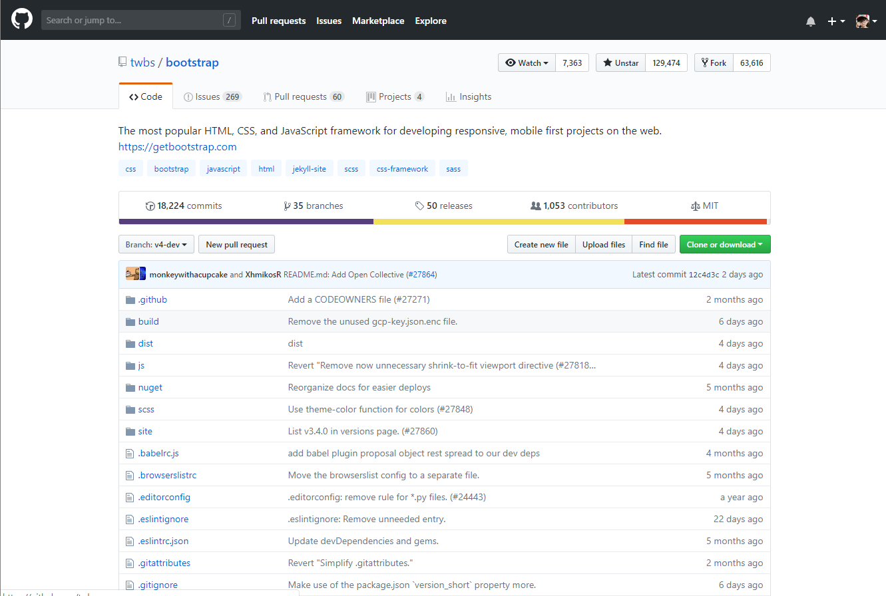
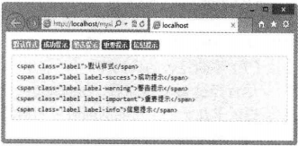
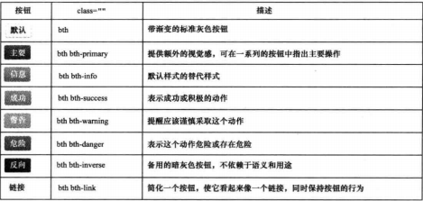

# 第1章 为什么要学习Bootstrap

**本章内容**

* Bootstrap概述
* Bootstrap功能介绍
* Bootstrap应用项目赏析
* Bootstrap版本变化
* Bootstrap开发工具和参考资源

Bootstrap是Twitter公司（www.twitter.com）开发的一个基于HTML、CSS、JavaScript的技术框架，符合HTML、CSS规范，且代码讲解、视觉优美。该框架设计时尚、直观、强大，可用于快速、简单地构建网页或网站。

Bootstrap集合CSS、HTML和JavaScript，使用了最新的浏览器技术，为实现快速开发提供了一套前端工具包，包括布局、栅格、表格、按钮、表单、导航和提示等。使用Bootstrap不仅可以构建出非常优雅的前端界面，而且占用资源非常少，使用gzip压缩后大小仅有10KB。由于Firefox、Chrome和Safari等主流浏览器对W3C标准有着较好的支持，因此Bootstrap在网页浏览器兼容方面也有相当不错的表现。

## 1.1 Bootstrap概述

Web开发人员每天都需要与HTML、CSS、JavaScript打交道，然而不少人在大部分时间里都在周而复始地写模板、样式和交互效果，并没有想过如何将这些重复的工作整合在一起。Twitter公司推出的Bootstrap能够帮助开发人员摆脱这种重复性的工作。下面来了解一下Bootstrap是一项什么技术，它的来龙去脉，以及它能够帮助用户做些什么。

### 1.1.1 Bootstrap的历史

早期Twitter提供的内部开发工具缺乏一些精致和平易近人的设计，为了应对复杂的设计需求，Twitter前端工程师在开发网站时喜欢采用所有自己熟悉的技术，这就造成了网站维护困难、可扩展性不强、开发成本高等问题。

2010年6月，为了提高内部的协调性和工作效率，Twitter公司的几个前端开发人员自发成立了一个兴趣小组，小组早期主要围绕一些具体产品展开讨论。在不断的讨论和实践中，小组逐渐确立了一个清晰的目标，期望设计一个伟大的产品，即创建一个统一的工具包，允许任何人在Twitter内部使用它，并不断对其进行完善和超越。后来，这个工具包逐步演化为一个有助于建立新项目的应用系统。在它的基础上，Bootstrap的构想产生了。

整个项目由Mark Otto和Jacob Thornton主导建立，定位为一个开放源码的前端工具包，旨在帮助设计师和开发人员快速、高效地构建通用的、最棒的东西。

他们希望通过这个工具包提供一种精致的、经典的、得到充分认可的，且使用HTML、CSS和JavaScript构建的组件，为用户建立和创建灵活的设计和丰富的插件库。

最终，Bootstrap成为应对这些挑战的解决方案，并开始在Twitter内部迅速成长，被twitter.com广泛采用，形成了稳定版本。随着工程师对其不断的开发和完善，Bootstrap进步显著，不仅包含基本样式，而且有了更为优雅和持久的前端设计模式。2011年8月，Twitter将其开源，开源页面地址为：http://twitter.github.com/bootstrap。

今天，Bootstrap已发展到包括几十个组件，并已成为最流行的项目，截止2013年5月1日，在GitHub（https://github.com/twbs/bootstrap/）上有超过49554个加星（Star）和15213个分支（Fork），如图1-1所示。当然，这个数字还在不断变化。

Bootstrap的设计者、著名前端工程师Mark Otto这样写道：“Bootstrap是我和Jacob Thornton编写的一个前端工具包，目的是帮助设计师和Web前端开发人员快速有效地创建结构简单、性能优良、页面精致的Web应用程序。它使用了最新的浏览器技术，可以提供精致的网页排版方式以及表单、按钮、表格、网格栅格化、导航等诸多元素。”

Bootstrap的内置样式继承了Mark Otto简洁亮丽的设计风格，任何开发团队都能使用它提供的HTML模板、CSS样式和jQuery组件来部署，或者重建外观漂亮的Web应用程序。

Bootstrap虽然发布时间不长，但是已经非常成熟，并得到广泛推广，目前最新版本是3.0，包括完整的CSS编译和非编译版本、样例模板和JavaScript插件。

### 1.1.2 选择Bootstrap的理由

Bootstrap所涉及的应用范围到底有多广？Bootstrap是否真的很实用？关于这两方面的问题，网络上曾展开过激烈的争论。Bootstrap对于设计能力不强，也没有太多的时间去设计前端界面的用户来说，价值是巨大的。Bootstrap的目的是帮助开发人员快速开发原型，避免用户经常从零开始绘制白底黑边的裸图。

Bootstrap包括几十个组件，每个组件都自然地结合了设计与开发，具有完整的实例文档，定义了真正的组件和模板。无论处在何种技术水平，也无论在哪个工作流程中的开发者，都可以使用Bootstrap快速、方便地构建自己喜欢的应用程序。

Bootstrap引入了12栅格结构的布局理念，使设计质量高、风格统一的网页变得十分容易。它包含了HTML、CSS和JavaScript三大主要部分，各部分简单说明如下。

* Bootstrap的HTML是基于HTML5的最新前沿技术，它不同于古老陈旧的其他网页标准，灵活高效，简洁流畅。它摒弃了那些复杂而毫无意义的标签，引入了全新的`<header>`、`<section>`、`<footer>`、`<article>`、`<video>`和`<canvas>`等标签，使网页的语义性大大增加，从此网页不再是供机器阅读的枯燥文字，而是可供人类欣赏的优美作品。在网页中插入多媒体，也因有了`<video>`和`<canvas>`而再也不需借助腐朽的Flash控件。
* Bootstrap的CSS是使用LESS创建的CSS，是新一代的动态CSS。对设计师来说，能写得更少；对浏览器来说，解析更容易；对用户来说，阅读更轻松。直接用自然书写的四则算术和英文单词来表示宽度、高度、颜色，使得写CSS不再是高手才会的神秘技能。
* Bootstrap的JavaScript是使用jQuery的CSS，是优秀的JavaScript，它不会使每个用户都为了相似的功能，在每个网站都下载一份相同的代码，而是用一个代码库，将常用的函数放进去，按需取用，用户的浏览器只需下载一份代码，便可在各个网站上使用。正如jQuery的口号：The Write Less，Do More， JavaScript Library。

难能可贵的是，Bootstrap依旧本着这样的设计原则：并行开发、作为产品的风格指南、迎合所有的技能水平，帮助开发者解决实际问题，不断完善自己，吸收更多人选择在自己的项目中应用Bootstrap。

Bootstrap框架提供非常棒的视觉效果，且使用Bootstrap可以确保整个Web应用程序的风格完全一致，用户体验一致，操作习惯一致，这其实是很难的。如果希望整个网站的链接、按钮、提醒都有统一的视觉效果，那就应该毫不犹豫地选择Bootstrap。它还可以对不同级别的提醒使用不同的颜色。

通过测试可知，市面上的主流浏览器都支持Bootstrap这一完整的框架解决方案，开发人员只需使用它而无需重新制作。而且这个框架专为Web应用程序而设计，所有元素都可以非常完美地在一起工作，很适合快速开发。

快速应用、简单而优雅，Bootstrap会让Web应用程序看起来与Windows或GNOME（GNU网络对象模型环境）下的程序一样，具有一样的按钮，一样的对话框，且运行快速。随着越来越多的Web应用程序被直接放在桌面上运行，应用程序的一致性是一个趋势，开发人员可以把精力放在业务上，而不是UI设计上。

Bootstrap始于2011年8月，至今才刚刚三年，但是在这三年里，Bootstrap旋风已经刮遍了整个互联网。各种较小的网站就不提了，国内外很多较有名的网站也采用了Bootstrap。例如，[Name.com](https://www.name.com/)已采用Bootstrap，无论是从按钮的风格，还是从源代码中的bootstrap_*.css均可清晰地看出这一点；[IP.cn](https://ip.cn/)也采用了Bootstrap，这个可以从源代码中看出；新版的[WHMCS](https://www.whmcs.com/)已采用Bootstrap，等等。

### 1.1.3 一位程序员的话

像我这样的程序员经常对设计望而却步，因为我是一名程序员，而不是设计师。拥有计算机专业学位证书的我对Comic Sans字体从不介意，但设计行业却极为排斥它，设计师或那些拥有美学情节的人往往对之不屑一顾。

虽然只是一名程序员，但我还是想让自己的网站看起来更加吸引人。这一方面是出于虚荣，因为这样可以让网站显得更加专业；而另一方面是出于现实的考虑，因为调查发现用户会更加信任那些大气、设计讲究的网站。

可现实是，我一直从事编程工作，写代码就是工作的全部，我对设计并不熟悉，甚至有些畏惧。对于我这样的外行来说，设计是由很多只可意会不可言传的规则以及所谓的设计灵感混合作用而成的，知识壁垒很高。

然而，当我接触Bootstrap之后，我发现通过努力，我可以让网站看上去更加专业，虽然比不上设计师设计出来的效果，但对于像我这种没有设计基础的人来说已经足够了。

### 1.1.4 Bootstrap构成模块

Bootstrap构成模块从大的方面可以分为布局框架、页面排版、基本组件、jQuery插件以及变量编译的LESS等部分。与前一版本相比，Bootstrap 2 增加了多个新模块。例如，布局框架中的响应式布局，页面排版中的Icon，基本组件中的进度条，jQuery插件也从以前的5中效果增加到12种，完全可以满足项目常用的交互效果。下面简单介绍一下Bootstrap中各模块的功能。

**（1）页面布局**

布局对于每个项目都必不可少。Bootstrap在960栅格系统的基础上扩展出一套优秀的栅格布局，而在响应式布局中有更强大的功能，能让栅格布局适应各种设备。这种栅格布局使用也相当简单，只需要按照HTML模板应用，即可轻松构建所需的布局效果。

此外，改变模板中的类名；就能实现不同的布局风格。例如，要实现常见的固定布局，只需在HTML中添加container类名；而要实现流体布局，只需在HTML中添加container-fluid类名。

Bootstrap还为开发者设计了Responsive，让布局框架更为出色。开发者可以在此基础上覆盖任何样式，从而实现理想中的响应式设计。

**（2）页面排版**

页面排版的好坏直接影响产品风格，也就是说页面设计是不是好看。在Bootstrap中，页面的排版都是从全局的概念上出发，定制了主体文本、段落文本、强调文本、标题、Code风格、按钮、表单、表格等格式。

Bootstrap 2 中添加了几个新亮点：

* 使用了Google Prettify插件，增强了代码的阅读体验；
* 在按钮中增加了组合、下拉、图标等效果；
* Bootstrap在Icon部分采用了Sprites技术，为用户准备了上百种常用的Icon应用。

这里有必要向读者推荐Font Awesome项目。它是Dave Gandy在Bootstrap的基础上扩展而来的一个Icon主题，最大的特点在于，整套图标中没有运用任何图片。Font Awesome项目中主要运用了CSS3的@font-face和伪元素一起实现。

**（3）基本组件**

基本组件是Bootstrap的精华之一，其中都是开发者平时需要用到的交互组件。例如，网站导航、标签页、工具条、面包屑、分页栏、提示标签、产品展示、提示信息块和进度条等。这些组件都配有jQuery插件，运用它们可以大幅度提高用户的交互体验，使产品不再那么呆板、无吸引力。

**（4）jQuery插件**

Bootstrap中的jQuery插件主要用来帮助开发者实现与用户交互的功能，Bootstrap 1 提供了6中常见插件。

* 模态对话框（Model）：在JavaScript模板基础上自定义的一款流线型、灵活性极强的弹出蒙版效果的插件。
* 下拉项（Dropdown）：Bootstrap中一款轻巧实用的插件，可以帮助实现下拉功能，如下拉菜单、下拉按钮、下拉工具条等。
* 滚动监听（Scrollspy）：实现滚动条位置的效果，如在导航中有多个标签，用户单击其中一个标签，滚动条会自动定位到导航中标签对应的文本位置。
* 标签页（Tab）：这个插件能够快速实现本地内容的切换，动态切换标签页对应的本地内容。
* 工具提示（Tooltip）：一款优秀的jQuery插件，无需加载任何图片，采用CSS3新技术，动态显示data-attributes存储的标题信息。
* 弹出提示（Popover）：在Tooltips的插件上扩展，用来显示一些叠加内容的提示效果，此插件需要配合Tooltips使用。

Bootstrap 2 在前面6种插件的基础上有新增加了6种jQuery插件。

* 警告框（Alert）：用来关闭警告信息块。
* 按钮（Button）：用来控制按钮的状态或更多组件功能，如复选框、单选按钮，以及载入状态条等。
* 折叠（Collapse）：一款轻巧实用的手风琴插件，可以用来制作折叠面板或菜单等效果。
* 轮播（Carousel）：实现突破播放功能的插件。
* 输入提示（Typeahead）：可以记住文本框输入的文本，下次输入时可以自动补全。
* 过渡效果（Transition）：Bootstrap使用这个插件为一些动画效果增加了过渡，使动画效果更细腻、生动。

上面简单介绍了Booststrap 2 中的jQuery插件，至于如何使用，还需要根据Bootstrap所提供的文档，以及各种插件的参数，具体问题具体分析。只有充分了解，才能灵活运用。

**（5）动态样式语言LESS**

LESS是动态CSS语言，它基于JavaScript引擎或者服务器端对传统的CSS进行动态扩展，具有更强大的功能和更好的灵活性。基于LESS，编写CSS就可以像使用编程语言一样，定义变量、嵌入声明、混合模式、运算等。

Bootstrap中有一套编辑好的LESS框架，开发者可以将其应用到自己的项目中，也可以通过less.js、Less.app或Node.js等方法来编辑LESS文件。LESS文件一旦编译，Bootstrap框架就仅包含CSS样式，这意味着没有多余的图片、Flash之类的元素。

**（6）jQuery UI Bootstrap**

jQuery UI Bootstrap其实是从框架中衍生出来的一个jQuery UI主题。受到Twitter项目的启发，Addy Osmani也在Bootstrap的基础上整理出一个jQuery UI Bootstrap主题。

jQuery UI Bootstrap除了包含Bootstrap各个方面的功能之外，还在其基础上补充了以下特性：

* 动态添加标签页
* 日期范围选择组件
* 自定义文件载入框
* 滑动块
* 日期控件

## 1.2 Bootstrap功能介绍

Bootstrap为什么能这么流行？其易用性是很重要的一个原因。Twitter在GitHub上提供了方便的自定义Bootstrap的工具，用户可以自由地选择想要的元素和组件，并且自定义每个颜色的具体数值，然后再让它自动生成一份属于自己的、定制版的Bootstrap。所有不需要的代码已经被去掉，以节省网络下载时间。虽然整个Bootstrap并不大，但是毕竟能省下一点是一点。对于大流量网站来说，为每个用户节省1KB流量，总量也是很客观的。下面简单介绍一下Bootstrap功能和特色，以便更详细了解它。

### 1.2.1 Bootstrap主要特色

Bootstrap是非常棒的前端开发工具包，它拥有以下特色。

**（1）由匠人造，为匠人用**

与所有前端开发人员一样，Bootstrap团队是国际上最优秀的前端开发组织，他们乐于创造出色的Web应用，同时希望帮助更多同行从业者，为同行提供更高效、更简洁的产品。

**（2）适应各种技术水平**

Bootstrap适应不同技术水平的从业者，无论是设计师，还是程序开发人员，不管是骨灰级别的大牛，还是刚入门槛的菜鸟。使用Bootstrap既能开发简单的小东西，也能构造更为复杂的应用。

**（3）跨设备、跨浏览器**

最初设想的Bootstrap只支持现代浏览器，不过新版本已经能支持所有主流浏览器，甚至包括IE7。从Bootstrap 2 开始，提供对平板和智能手机的支持。

**（4）提供12列栅格布局**

栅格系统不是万能的，不过在应用的核心层有一个稳定和灵活的栅格系统确实可以让开发变得更简单。可以选用内置的栅格，或是自己手写。

**（5）支持响应式设计**

从Bootstrap 2 开始，提供完整的响应式特性。所有的组件都能根据分辨率和设备灵活缩放，从而提供一致性的用户体验。

**（6）样式化的文档**

与其他前端开发工具包不同，Bootstrap优先设计了一个样式化的使用指南，不仅用来介绍特性，更用以展示最佳实践、应用以及代码示例。

**（7）不断完善的代码库**

尽管经过gzip压缩后，Bootstrap只有10KB大小，但是它却仍是最完备的前端工具包之一，提供了几十个全功能的随时可用的组件。

**（8）可定制的jQuery插件**

任何出色的组件设计，都应该提供易用、易扩展的人机界面。Bootstrap为此提供了定制的jQuery内置插件。

**（9）选用LESS构建动态样式**

当传统的枯燥CSS写法止步不前时，LESS技术横空出世。LESS使用变量、嵌套、操作、混合编码，帮助用户花费很小的时间成本，编写更快、更灵活的CSS。

**（10）支持HTML5**

Bootstrap支持HTML5标签和语法，要求建立在HTML5文档类型基础上进行设计和开发。

**（11）支持CSS3**

Bootstrap支持CSS3所有属性和标准，逐步改进组件以达到最终效果。

**（12）提供开源代码**

Bootstrap全部托管于GitHub（https://github.com/），完全开发源代码，并借助GitHub平台实现社区化开发和共建。

**（13）由Twitter制造**

Twitter是互联网的技术先驱，引领时代技术潮流，Twitter前端开发团队是公认的最棒的团队之一，整个Bootstrap项目由经验丰富的工程师和设计师奉献。

### 1.2.2 Bootstrap主要功能

Bootstrap的目的是提供一个便捷工具，方便快速开发项目，样式部分使用LESS写就，也提供了一些jQuery插件形式的扩展。

在样式方面，Bootstrap提供了如下解决方案：

**栅格系统**

栅格系统与著名的960Grid大同小异，不过960 Grid默认是16栏、940像素宽，由于LESS带来的动态语言特性（变量、函数等），可以通过配置几个参数，自定义栅格。因为抛弃了对老旧浏览器的支持，可以直接用：last-child将最后一栏的margin-right去掉，这也是它与960 Grid的区别之一。

**布局**

布局主要包括一个固定宽度的居中，一个可变宽度的浮动布局。

**字体样式**

字体风格比较明显，标题、`<em>`、`<strong>`、`<b>`、`<i>`以及`<address>`和`<blockquote>`等语义标签都配了一些默认样式。然后是列表，通过.unstyled类样式获得样式充值效果，这个方式比较实用，特别是网站是以内容为主的时候。代码块也比较朴素，借鉴了Google Code Prettify风格。

标签样式设计得比较贴心，风格趋于内敛，效果如图1-2所示。

**多媒体展现**

多媒体列表其实也比较简单，定义了3缩略图尺寸：330像素x230像素、210像素x150像素和90像素x90像素。表格的样式也是简约风格。

**表格**

Bootstrap对表单进行了比较充分的定制，风格比较鲜明，label左浮动，圆角输入框，正确、错误的状态，表单legend的字号，前缀字符，输入、复选框等。文件选择比较朴素，没有提供更个性的解决方案，要想实现更个性的解决方案，需要与JavaScript配合设计。表单的按钮也十分细致，效果如图1-3所示。

**导航条**

网站的全局导航栏保持一致，使用样式实现背景色渐变，固定在头部，因此不需要考虑浏览器兼容问题。此外，还实现了提示、警告、弹出对话框设计风格的统一。

以上样式的部分是Bootstrap框架的核心。在代码上，基本把样式重置与定制都做了，上述内容，除了比较明显的组件（如面包屑、翻页等），基本都直接用标签作选择器。

有许多风格是利用CSS3样式属性设计出来的，最明显的莫过于背景色渐变与圆角。因此，对于图省事、不介意早期浏览器的效果，不需要考虑IE6的开发者，Bootstrap是个好选择，因为它省时省力，而且美观大方。

在样式之外，Bootstrap还提供了十几个常用的JavaScript插件，如模态对话框、下拉菜单、滚动监听、标签页、工具提示等jQuery插件。

## 1.3 Bootstrap应用项目赏析

Bootstrap自从在GitHub上开源之后，迅速成为其上备受关注的项目。大量工程师踊跃为该项目贡献代码，社区惊人地活跃，代码版本进化非常快速，官方文档质量较高，可以说是非常优雅，同时涌现出了许多基于Bootstrap建设的网站，这些网站界面清新、简洁、要素排版利落大方。

