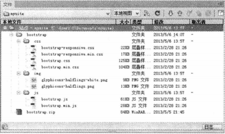

# 第2章 使用Bootstrap的准备

**本章内容**

* 下载和定制Bootstrap
* Bootstrap的文件结构
* Bootstrap应用解析
* 开发第一个Bootstrap示例

在上一章中，我们简单介绍了Bootstrap框架的来龙去脉，以及相关技术知识和话题，为了帮助读者快速入门，引导用户正确使用Bootstrap，本章将遵循官方文档结构进一步介绍初步使用Bootstrap的方法和步骤，为后面系统、深入学习Bootstrap奠定扎实的基础。

## 2.1 下载和定制Bootstrap

在下载Bootstrap之前，先确保系统中准备好了一个网页代码编辑器。另外，读者应该对自己的网页制作水平进行初步评估，评估自己是否基本掌握HTML和CSS技术，以确保能够在网页设计和开发中轻松学习和使用Bootstrap。

### 2.1.1下载Bootstrap

Bootstrap压缩包包含两个版本，一个是供学习使用的完全版，另一个是供应用的编译版。

**1. 下载源码版Bootstrap**

访问http://github.com/twbs/bootstrap/ 页面，下载最新版本的Bootstrap压缩包。在访问GitHub时，找到Twitter公司的Bootstrap项目页面，单击ZIP选项卡，即可下载保存Bootstrap压缩包，如图2-1所示。从GitHub直接下载到的最新版源码包括CSS、JavaScript的源文件，以及一份文档。


通过这种方式下载的Bootstrap压缩包，名称为bootstrap-master.zip，包含Bootstrap库中所有的源文件以及参考文档，适合读者学习和交流使用。

**下载编译版Bootstrap**

如果希望快速开始，可以直接下载经过编译、压缩后的发布版。访问下面页面之一，根据下载按钮提示直接下载即可，如图2-2所示。

* https://github.com/twitter/bootstrap
* http://kxh.github.io/Bootstrap_doc_in_chinese/
* http://www.bootcss.com/


通过这种方式下载的压缩文件名为bootstrap.zip，仅包含编译好的Bootstrap应用文件，如CSS、JavaScript和图片文件。而且所有文件已经过了压缩处理，不过文档和源码文件不包含在这个压缩包中。

直接复制压缩包中的文件到网站目录，导入相应的CSS文件和JavaScript文件，就可以在网站和页面中应用Bootstrap效果和插件了。

### 2.1.2 定制Bootstrap

Bootstrap库文件很大，如果仅希望应用其中几个效果或者特定插件，则建议通过定制方式使用Bootstrap。把所有效果和插件都导入页面，一方面会增加带宽负荷，影响页面的响应速度；另一方面，众多的CSS类样式和JavaScript源代码，会与制作页面的样式和脚本发生冲突，影响解析时的执行效率和页面显示效果。

定制Bootstrap可以有效降低页面加载的负担和执行效率，降低潜在的源码冲突。定制的具体方法如下。

第1步：访问http://twitter.github.io.bootstrap/ 页面，在顶部导航栏中单击Customize（定制）选项卡，切换到定制页面，如图2-3所示。


第2步：选择组件。在页面左侧页内导航栏单击“1.Choose components”（1.选择组件）选项，切换到组件选择区，如图2-4所示。单击右上角的Toggle all（切换全部）按钮，取消勾选所有选项，然后根据需要勾选组件。


组件包括如下几个部分，每部分又包含多个项目，这些部分将在后面几章中进行详细讲解。其中脚手架是用来设置页面基本样式和布局的，根据需要必须选择。

Scaffolding（脚手架）

* Base CSS（基本CSS样式）
* Components（组件）
* JS Components（JS组件）
* Miscellaneous（杂项）
* Responsive（响应式交互）

第3步：选择jQuery插件。在页面左侧页内导航栏中单击“2.Select jQuery plugins”（选择jQuery插件）选项，切换到jQuery插件选择区，如图2-5所示。单击右上角的Toggle all按钮，取消勾选所有选项，然后根据需要勾选jQuery插件。


所有被勾选的插件将被编译成一个文件bootstrap.js。所有的插件都需要导入最新版本的jQuery库文件作为底层技术支撑。

第4步：定制变量。在页面左侧页内到导航栏中单击“3.Customize variables”（定制变量）选项，切换到LESS变量配置区，如图2-6所示。如果在设置过程中需要恢复默认值，则单击右上角的Reset to defaults（重置为默认）按钮，取消对所有CSS变量的设置，然后根据需要重设变量的名称。有关动态CSS技术的详细讲解可参阅后面章节内容。


第5步：打包下载。在页面左侧页内导航栏中单击“4.Download”（下载）选项，切换到下载按钮位置，如图2-7所示。单击“Customize and Download”（定制并下载）按钮，下载定制后的Bootstrap压缩包。


下载的文件包括编译的动态CSS、整理和压缩的CSS样式表，以及编译的jQuery插件，它们都很好地包装在一个zip文件中。

例如，如果仅需要表格样式效果，则可以在第2步中仅勾选两项：“Scaffolding”（脚手架）子项中“Normalize and reset“和”Base CSS“（基础CSS样式表）子项中的”Tables“，如图2-8所示。


在第3步中，取消勾选所有选项，既不下载任何jQuery插件。在第4步中，保持所有动态CSS变量的默认值。然后，单击“Customize and Download”按钮，下载定制后的Bootstrap压缩包（bootstrap.zip），该文件大小仅有38KB，文件结构如图2-9所示。


如果直接下载默认编译好的压缩包，大小为375KB，当页面不需要全部效果和交互行为时，这种做法显然就不妥了。

## 2.2 Bootstrap的文件结构

下载Bootstrap压缩包之后，在本地进行解压，就可以看到包中包含的Bootstrap的文件结构，Bootstrap提供了编译和压缩两个版本的文件，下面针对不同的下载方式进行简单说明。

### 2.2.1 源码版Bootstrap文件结构

在2.1.1节中，如果按照第一种方法，下载源码版Bootstrap，则解压bootstrap-master.zip文件，可以看到该包中包含的所有文件，如图2-10所示。


在下载的压缩包中，可以看到所有文件按逻辑进行存储，简单说明如下。

* docs文件夹：存储Bootstrap参考文档，在该文件夹中单击index.html文件，可以查阅相关参考资料，在examples子目录中可以浏览Bootstrap应用示例。
* img文件夹：存储两张图片——glyphicons-halflings.png和glyphicons-halflings-white.png，它们通过CSS Sprites技术，把所有的图标整合到一个图片文件中，再利用CSS的background-image、background-replace、background-position的组合进行背景定位，background-position可以用数字精确地定位出背景图片的位置。利用CSS Sprites能很好地减少网页的HTTP请求，从而大大提高页面性能，这也是CSS Sprites最大的优点，也是其被广泛应用的主要原因。图2-11为glyphicons-halflings.png图片的效果，glyphicons-halflings-white.png图片的效果与它是一致的，不过使用白色前景色进行设计。


* js文件夹：存储各种jQuery插件和交互行为所需要的JavaScript脚本文件，每一个插件都是一个独立的JavaScript脚本文件，可以根据需要独立引入。
* less文件夹：存储所有CSS动态脚本文件，所有文件都以.less作为扩展名，但可以通过任何文本编辑软件打开。LESS是动态样式表语言，需要编译才能在页面中应用，即只有.less文件被转换为普通的CSS样式表文件后才可以被浏览器正确解析。

其中最为重要的是docs目录下的CSS样式文件.less目录中的编译文件和js目录中的jQuery插件。bootstrap-master目录下的10个文件可以不用管，它们是一些数据和服务性文件。

### 2.2.2 编译版Bootstrap文件结构

在2.1.1节中，如果按照第二种方法，下载编译版Bootstrap，则解压bootstrap.zip，可以看到该包中包含的所有文件，如图2-12所示。



图2-12是Bootstrap的基本结构，编译后的文件可以快速应用于任何Web项目。压缩包中提供了编译版的CSS和JS文件（`bootstrap.*`），也同时提供了编译并压缩之后的CSS和JS文件（`bootstrap.min.*`）。图片文件是使用ImageOptim工具进行压缩的。注意，所有的JavaScript插件都依赖于jQuery库。

* bootstrap.css：完整的Bootstrap样式表，未经压缩过的，可供开发的时候进行调试使用。
* bootstrap.min.css：经过压缩后的Bootstrap样式表，内容和bootstrap.css完全一样，但是把中间不需要的东西都删掉了，如空格和注释，所以文件大小会比bootstrap.css小，可以在部署网站的时候引用，如果引用了这个文件，就没必要引用bootstrap.css了。
* bootstrap-responsive.css：在对Bootstrap框架应用了响应式布局之后所需的CSS样式表，如果网站项目不需要进行响应式设计，就不需要引用这个CSS。
* bootstrap.js：Bootstrap所有JavaScript指令的集合，也是Bootstrap的灵魂，用户看到Bootstrap中所有的JavaScript效果，都是由这个文件控制的。这个文件也是一个未经压缩的版本，供开发的时候进行调试使用。
* bootstarap.min.js：bootstrap.js的压缩版，内容和bootstrap.js一样，但是文件会小很多，在部署网站的时候就可以不引用bootstrap.js，转而引用这个文件。

## 2.3 Bootstrap应用解析

把Bootstrap压缩包下载到本地之后，就可以安装使用了。本节不仅介绍如何正确安装Bootstrap工具集，同时介绍Bootstrap架构组成，这个架构有什么功能，能够为网页设计和开发带来哪些用处。最后，引导读者创建一个符合Bootstrap技术要求的标准模板，这样读者就可以利用这个模板页面上机练习了。

### 2.3.1 安装Bootstrap

Bootstrap安装大致需要以下两步。

第1步：安装Bootstrap的基本样式。样式的安装有多种方法，下面代码使用`<link>`标签调用CSS样式，这是一种常用的调用样式方法。

```html
<!DOCTYPE html>
<html>

	<head>
		<meta charset="utf-8" />
		<title>test</title>
		<link rel="stylesheet" type="text/css" href="bootstrap/css/bootstrap.css" />
		<link rel="stylesheet" type="text/css" href="bootstrap/css/self.css" />
	</head>

	<body>

	</body>

</html>
```

其中bootstrap.css是Bootstrap的基本样式，bootstrap-responsive.css是响应式布局样式，self.css是本文档自定义样式。

> **注意：** 这里有两个关键点，其中bootstrap.css是Bootstrap框架集中的基本样式文件，只要应用Bootstrap，就必须调用这个文件。而bootstrap-responsive.css则可以根据需要选择性安置，如果想让项目具有响应式布局的效果，就必须调用这个样式文件。调用必须遵循向后顺序，bootstrap-responsive.css必须置于bootstrap.css之后，否则就不具有响应式布局功能。最后，self.css是项目中的自定义样式，用来覆盖Bootstrap中的一些默认设置，便于开发者定制本地样式。

第2步：CSS样式安装完后，就可以进入JavaScript调用操作。方法很简单，仅需把需要的jQuery插件源代码文件按照与上一步相似的方式加入到页面代码中。

调用Bootstrap的jQuery插件，代码如下。

```html
<!DOCTYPE html>
<html>

	<head>
		<meta charset="utf-8" />
		<title>test</title>
		<link rel="stylesheet" type="text/css" href="bootstrap/css/bootstrap.css" />
		<link rel="stylesheet" type="text/css" href="bootstrap/css/self.css" />
	</head>

	<body>
		<!--文档内容-->
		<script src="http://libs.baidu.com/jquery/2.0.0/jquery.min.js"></script>
		<script src="bootstrap/js/bootstrap.js" type="text/javascript" charset="utf-8"></script>
	</body>

</html>
```

其中jquery.js是jQuery库基础文件，bootstrap.js是Bootstrap的jQuery插件源文件。建议将JavaScript脚本文件置于文档尾部，即相邻`</body>`标签的前面，不要置于`<head>`标签内。

### 2.3.2 Bootstrap架构解析

Bootstrap中的HTML、CSS和JavaScript适用于各类设备，如移动设备、平板电脑、PC等，不过它们的功能可以概括成如下几个类别。

* 脚手架：全局性的样式文件，用于重置背景、链接样式、栅格系统，并包含两个简单的布局结构。
* 基本CSS样式：常用HTML元素样式，如排版、代码、表格、表单、按钮样式，还包括一个非常棒的图标集——Glyhicons。
* Bootstrap组件：常与界面组件，如标签、导致、警告、页面标题的基本样式。
* JavaScript插件：与Bootstrap组件类似，这些JavaScript插件用来实现工具提示（Tooltip）、弹出提示（Popover）、模态对话框（Modal）等具有交互性的组件。

Bootstrap组件库和JavaScript插件集共同提供了一下网页应用元素：按钮组、按钮下拉菜单、用于导航的标签、列表、导航条、标签、图标、页眉和单位、缩略图、警告对话框、进度条、模态对话框、下拉项、工具提示、弹出提示、折叠、轮播、输入提示。

后面的章节将会详细介绍这些组件的细节。

### 2.3.3 设计Bootstrap网页模板

为了把读者的注意力完全放在使用Bootstrap上，本节先做一下准备工作。

```html
<!DOCTYPE html>
<html>

	<head>
		<meta charset="utf-8" />
		<title>test</title>
		<link rel="stylesheet" type="text/css" href="bootstrap/css/bootstrap.css" />
		<link rel="stylesheet" type="text/css" href="bootstrap/css/self.css" />
	</head>

	<body>
		<h1 class="btn btn-success btn-large"><i class="icon-user icon-white"></i>Hello, world!</h1>
		<!--文档内容-->
		<script src="http://libs.baidu.com/jquery/2.0.0/jquery.min.js"></script>
		<script src="bootstrap/js/bootstrap.js" type="text/javascript" charset="utf-8"></script>
	</body>

</html>
```

在