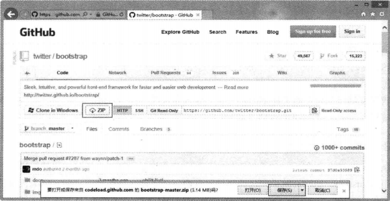
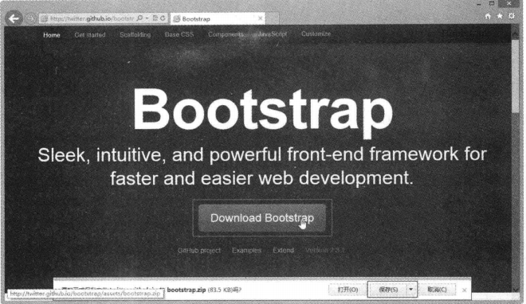
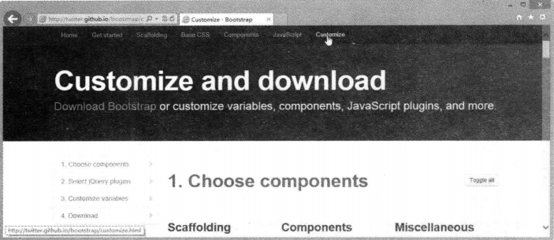
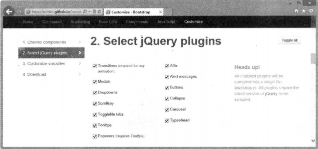
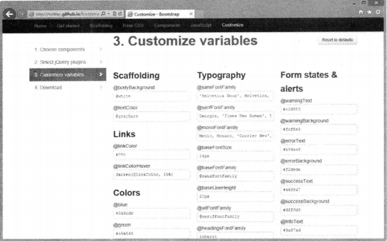
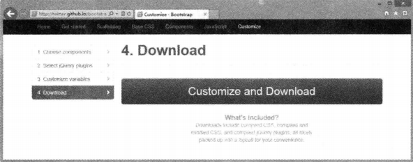
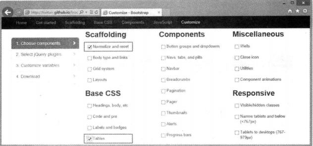
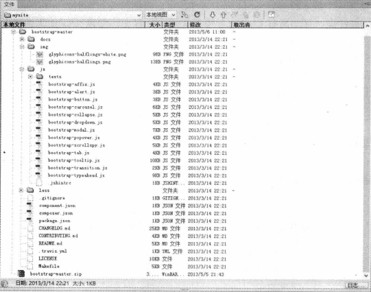

# 第2章 使用Bootstrap的准备

**本章内容**

* 下载和定制Bootstrap
* Bootstrap的文件结构
* Bootstrap应用解析
* 开发第一个Bootstrap示例

在上一章中，我们简单介绍了Bootstrap框架的来龙去脉，以及相关技术知识和话题，为了帮助读者快速入门，引导用户正确使用Bootstrap，本章将遵循官方文档结构进一步介绍初步使用Bootstrap的方法和步骤，为后面系统、深入学习Bootstrap奠定扎实的基础。

## 2.1 下载和定制Bootstrap

在下载Bootstrap之前，先确保系统中准备好了一个网页代码编辑器。另外，读者应该对自己的网页制作水平进行初步评估，评估自己是否基本掌握HTML和CSS技术，以确保能够在网页设计和开发中轻松学习和使用Bootstrap。

### 2.1.1下载Bootstrap

Bootstrap压缩包包含两个版本，一个是供学习使用的完全版，另一个是供应用的编译版。

**1. 下载源码版Bootstrap**

访问http://github.com/twbs/bootstrap/ 页面，下载最新版本的Bootstrap压缩包。在访问GitHub时，找到Twitter公司的Bootstrap项目页面，单击ZIP选项卡，即可下载保存Bootstrap压缩包，如图2-1所示。从GitHub直接下载到的最新版源码包括CSS、JavaScript的源文件，以及一份文档。

通过这种方式下载的Bootstrap压缩包，名称为bootstrap-master.zip，包含Bootstrap库中所有的源文件以及参考文档，适合读者学习和交流使用。

**下载编译版Bootstrap**

如果希望快速开始，可以直接下载经过编译、压缩后的发布版。访问下面页面之一，根据下载按钮提示直接下载即可，如图2-2所示。

* https://github.com/twitter/bootstrap
* http://kxh.github.io/Bootstrap_doc_in_chinese/
* http://www.bootcss.com/

通过这种方式下载的压缩文件名为bootstrap.zip，仅包含编译好的Bootstrap应用文件，如CSS、JavaScript和图片文件。而且所有文件已经过了压缩处理，不过文档和源码文件不包含在这个压缩包中。

直接复制压缩包中的文件到网站目录，导入相应的CSS文件和JavaScript文件，就可以在网站和页面中应用Bootstrap效果和插件了。

### 2.1.2 定制Bootstrap

Bootstrap库文件很大，如果仅希望应用其中几个效果或者特定插件，则建议通过定制方式使用Bootstrap。把所有效果和插件都导入页面，一方面会增加带宽负荷，影响页面的响应速度；另一方面，众多的CSS类样式和JavaScript源代码，会与制作页面的样式和脚本发生冲突，影响解析时的执行效率和页面显示效果。

定制Bootstrap可以有效降低页面加载的负担和执行效率，降低潜在的源码冲突。定制的具体方法如下。

第1步：访问http://twitter.github.io.bootstrap/ 页面，在顶部导航栏中单击Customize（定制）选项卡，切换到定制页面，如图2-3所示。

第2步：选择组件。在页面左侧页内导航栏单击“1.Choose components”（1.选择组件）选项，切换到组件选择区，如图2-4所示。单击右上角的Toggle all（切换全部）按钮，取消勾选所有选项，然后根据需要勾选组件。

组件包括如下几个部分，每部分又包含多个项目，这些部分将在后面几章中进行详细讲解。其中脚手架是用来设置页面基本样式和布局的，根据需要必须选择。

Scaffolding（脚手架）

* Base CSS（基本CSS样式）
* Components（组件）
* JS Components（JS组件）
* Miscellaneous（杂项）
* Responsive（响应式交互）

第3步：选择jQuery插件。在页面左侧页内导航栏中单击“2.Select jQuery plugins”（选择jQuery插件）选项，切换到jQuery插件选择区，如图2-5所示。单击右上角的Toggle all按钮，取消勾选所有选项，然后根据需要勾选jQuery插件。

所有被勾选的插件将被编译成一个文件bootstrap.js。所有的插件都需要导入最新版本的jQuery库文件作为底层技术支撑。

第4步：定制变量。在页面左侧页内到导航栏中单击“3.Customize variables”（定制变量）选项，切换到LESS变量配置区，如图2-6所示。如果在设置过程中需要恢复默认值，则单击右上角的Reset to defaults（重置为默认）按钮，取消对所有CSS变量的设置，然后根据需要重设变量的名称。有关动态CSS技术的详细讲解可参阅后面章节内容。

第5步：打包下载。在页面左侧页内导航栏中单击“4.Download”（下载）选项，切换到下载按钮位置，如图2-7所示。单击“Customize and Download”（定制并下载）按钮，下载定制后的Bootstrap压缩包。

下载的文件包括编译的动态CSS、整理和压缩的CSS样式表，以及编译的jQuery插件，它们都很好地包装在一个zip文件中。

例如，如果仅需要表格样式效果，则可以在第2步中仅勾选两项：“Scaffolding”（脚手架）子项中“Normalize and reset“和”Base CSS“（基础CSS样式表）子项中的”Tables“，如图2-8所示。

在第3步中，取消勾选所有选项，既不下载任何jQuery插件。在第4步中，保持所有动态CSS变量的默认值。然后，单击“Customize and Download”按钮，下载定制后的Bootstrap压缩包（bootstrap.zip），该文件大小仅有38KB，文件结构如图2-9所示。

如果直接下载默认编译好的压缩包，大小为375KB，当页面不需要全部效果和交互行为时，这种做法显然就不妥了。

## 2.2 Bootstrap的文件结构

下载Bootstrap压缩包之后，在本地进行解压，就可以看到包中包含的Bootstrap的文件结构，Bootstrap提供了编译和压缩两个版本的文件，下面针对不同的下载方式进行简单说明。

### 2.2.1 源码版Bootstrap文件结构

在2.1.1节中，如果按照第一种方法，下载源码版Bootstrap，则解压bootstrap-master.zip文件，可以看到该包中包含的所有文件，如图2-10所示。

在下载的压缩包中，可以看到所有文件按逻辑进行存储，简单说明如下。

* docs文件夹：存储Bootstrap参考文档，在该文件夹中单击index.html文件，可以查阅相关参考资料，在examples子目录中可以浏览Bootstrap应用示例。
* img文件夹：存储两张图片——glyphicons-halflings.png和glyphicons-halflings-white.png，它们通过CSS Sprites技术，把所有的图标整合到一个图片文件中，再利用CSS的background-image、background-replace、background-position的组合进行背景定位，background-position可以用数字精确地定位出背景图片的位置。利用CSS Sprites能很好地减少网页的HTTP请求，从而大大提高页面性能，这也是CSS Sprites最大的优点，也是其被广泛应用的主要原因。图2-11为glyphicons-halflings.png图片的效果，glyphicons-halflings-white.png图片的效果与它是一致的，不过使用白色前景色进行设计。

* js文件夹：存储各种jQuery插件和交互行为所需要的JavaScript脚本文件，每一个插件都是一个独立的JavaScript脚本文件，可以根据需要独立引入。
* less文件夹：存储所有CSS动态脚本文件，所有文件都以.less作为扩展名，但可以通过任何文本编辑软件打开。LESS是动态样式表语言，需要编译才能在页面中应用，即只有.less文件被转换为普通的CSS样式表文件后才可以被浏览器正确解析。

其中最为重要的是docs目录下的CSS样式文件.less目录中的编译文件和js目录中的jQuery插件。bootstrap-master目录下的10个文件可以不用管，它们是一些数据和服务性文件。

### 2.2.2 编译版Bootstrap文件结构