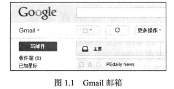
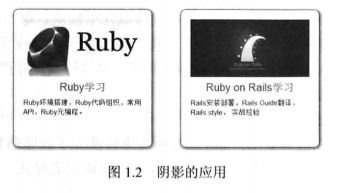
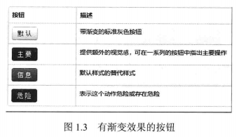
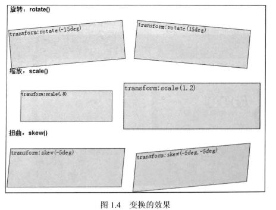
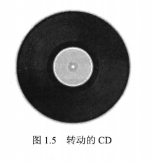
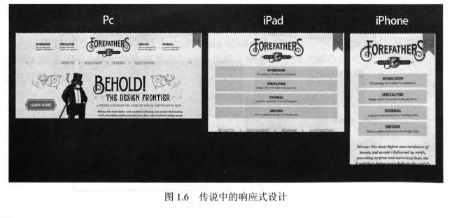
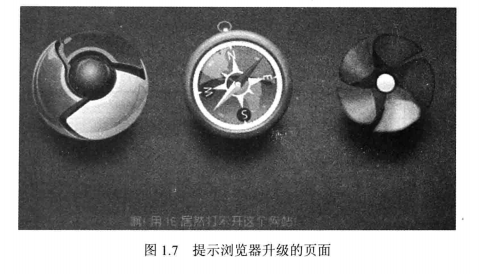
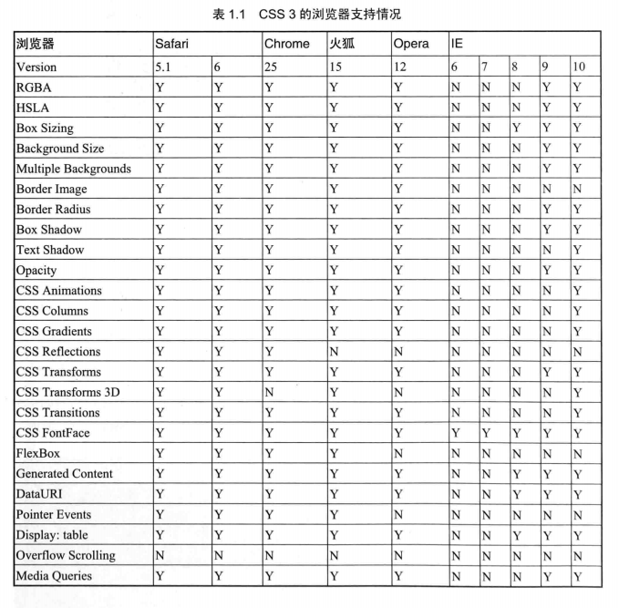
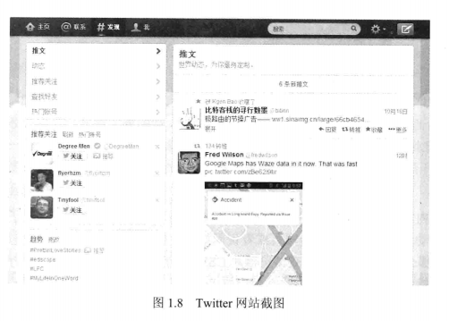
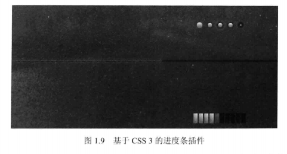

# 第1章 CSS3与现代Web标准

本章主要对Web技术的发展和新的CSS3标准做一个大体上的介绍，让读者对CSS3能有一个轮廓上的认识。它能做什么，解决了哪些问题？而具体的用法会在本书后面的章节里进行详细介绍。

本章主要知识点包括：

* Web标准的发展
* CSS3的特性
* 各浏览器对新特性的支持

## 1.1 未来Web标准的发展

本章笔者主要根据自己的开发经验来谈一谈未来Web标准的发展。在相当长的一段时间内，Web前端开发的三大技术HTML、CSS、JavaScript，仍然会是主要的技术基础。虽然整体基础保持稳定并向上兼容，但Web技术仍然在不断发展以适应人们的需求。个人认为Web标准的发展有4个趋势：“去Adobe”化、基础功能集成、客户端执行更多的逻辑和渲染任务、适应移动设备的发展。

### 1.1.1 “去Adobe”化

从过去到现在，Web前端开发除了三大基础技术以外，图片和Flash是构造精美页面和内嵌视频所必需的，Adobe公司开发了一系列强大的图片和Flash制作工具，来帮助我们完成这些工作。但是在页面中大量嵌入图片和Flash，又有很多不足：

* 一方面增大了带宽压力，降低了访问速度。
* 一方面像Flash的运行必须依赖浏览器插件，这会消耗大量系统资源。

这两方面大大影响了用户的体验，正因为此，苹果的乔布斯决定不在产品中支持Flash。而对于开发者来讲，要学习使用更多的工具也会有不小的学习成本。

综上原因，让Web技术本身取代过去使用Adobe软件才能完成的工作就成了Web发展的趋势之一。比如，现在我们可以使用CSS3来制作背景的渐变、按钮的圆角，以及一些简单的动画，而这些原本必须依赖图片和Flash。

### 1.1.2 基础功能集成

更多的基础功能被集成进HTML5/CSS3系统，开发者无须再去不断地重复实现一些基础功能。比如HTML5对视频、音频的内嵌，对邮件、日期选择表单的支持，无须再像过去一样编写上百行的JavaScript代码来实现它们。

这些功能在本书的第3~9章都会有详细介绍。

### 1.1.3 客户端执行更多的逻辑和渲染任务

相对于浏览器来说，服务器有更强大的计算能力，因此我们往往将所有的逻辑都放在服务端执行，每次执行都需要网络I/O并重新刷新页面。但是随着个人电脑性能的不断提升和浏览器引擎的不断发展，由客户端执行更多的逻辑计算和画面渲染成为了可能，这有两大好处：

* 一方面降低服务器和带宽的压力。
* 一方面大大提高了用户的体验。

### 1.1.4 适应移动设备的发展

过去PC机作为几乎唯一的Web浏览终端而存在，随着智能移动设备（手机、平板、Kindle等）的发展，Web开发也必须顺应这一潮流。目前新的HTML/CSS系统在以下主要设备的浏览器上都能支持：

* 以iOS操作系统为主的iPhone、iPad智能设备。
* 以Android操作系统为主的三星、HTC等智能设备。

## 1.2 什么是CSS3

CSS，全称是Cascading Style Sheet，一般译作层叠样式表。它是一种用于展示网页样式和布局的标记语言。目前主流浏览器支持的CSS版本到了CSS3，而W3C组织已经开始着手制订CSS4的一些标志。

CSS3是CSS2.1的扩展，它在CSS2.1的基础上增加了很多强大的新功能，但是它已不再像CSS2.1那样是单一的规范。CSS3被划分成几个模块，每个模块都是CSS的某个子集的独立规范，比如选择器、文本或背景。每个模块都有各自独立的创作者和时间表。这样做的好处是整个CSS3规范的发布不再需要停下来等待某个难产的小条目，其他模块的流程可以继续向前推进。

CSS3的扩展主要有两方面：

* 一方面将很多以前需要图片和Flash的效果转换为了浏览器自身的图形渲染；
* 一方面支持更多的选择器，让我们可以更轻松地定义样式。

## 1.3 CSS3的特性

应用CSS3，我们可以设置很多之前只能使用图片来实现的效果，而使用图片，一方面缺乏灵活性，一旦需要修改，就必须使用又大又慢的图片处理软件重新作图，再重新保存图片；另一方面使用图片增加了传输的数据量和HTTP请求数，拖慢了页面加载的速度。

CSS3还支持简单的动画，虽然复杂的动画还是必须通过Flash、JavaScript来实现，但实际开发中，大多数的动画并不复杂，这大大提高了我们的开发效率。本节就来简要介绍CSS3支持的一些特性。

### 1.3.1 圆角

在交互设计中，相对于直角，圆角显得更为柔和，尤其应用在拟物图标上更容易被用户接受。苹果公司甚至专门为手机的圆角矩形的设计申请了专利。在Web开发中，使用CSS3的border-radius属性，可以为一个HTML元素设置圆角。

图1.1是大名鼎鼎的Gmail邮箱，它的按钮和菜单都采用了圆角的设计。



如果采用传统的方法制作，我们或许会用PS画一个圆角背景作为按钮的背景，或者用一个圆形小图片放在按钮的4个角上，而这带来的性能影响，对于像Google、百度这样为海量用户提供基础服务的企业来说是难以接受的。

### 1.3.2 阴影

应用CSS3，可以为元素的边界（box-shadow）和文字（text-shadow）设置阴影。图1.2展示了网站的选择菜单，由于应用了阴影，显得页面凸出并有一定的立体感，这在交互上给人们一个可以向下点击的暗示。



### 1.3.3 渐变

原本CSS的background-image属性只能指定图像文件作为背景，现在，渐变（gradients）是CSS3为background-image属性新增的参数。渐变参数如下。

* linear-gradient：纵向渐变。
* radial-gradient：横向渐变。
* repeating-linear-gradient：重复的纵向渐变。
* repeating-linear-gradient：重复的横向渐变。

图1.3 展示的是Bootstrap2的按钮，可以发现，它是带有凸起效果的，让人一看就知道这里是可以被点击的，而这就需要用到纵向的背景颜色渐变。



### 1.3.4 变换

在CSS3中，可以使用变换（transform）属性来对元素进行位移、偏转、拉伸、旋转等操作。这让设计师有了更大的想象空间，能设计出更吸引人的页面。同时transform属性还可以配合JavaScript使用，制作出炫目的动画效果。变换的基本效果如图1.4所示。



### 1.3.5 动画

使用CSS3可以实现简单的动画，相比Flash和JavaScript制作的动画，CSS3显然不够强大，但是在构造简单的动画时，使用CSS3大大减轻了开发者的负担，并且性能更佳。

由于纸介质无法让读者直观地感受动画效果，读者可以根据图1.5，想象一下控制这个CD转动起来的效果。

**提示：**制作动画，需要使用CSS3的@keyframes规则，详细内容可见本书第7章“变换和动画”。



### 1.3.6 媒介查询

随着移动互联网的发展，传统的适应PC端的固定式网页已经无法满足人们的要求。针对各种不同尺寸的移动设备，CSS3推出了媒介查询（media query）功能，使我们可以根据浏览器窗口或设备尺寸来应用不同的CSS样式，从而实现对不同设备的适配。这样对我们就不必自己来检测设备的尺寸，大大减少了开发的工作量。

随着开发者和设计者适配不同设备的经验积累和各种技术的增进，一套方法论被逐渐总结出来，我们称之为响应式设计。图1.6展示了一个典型的响应式设计案例。



## 1.4 检查浏览器是否支持CSS3

虽然在理想情况下，CSS3对开发者和用户都更为友好，但最让人纠结的事情是，还有很多用户使用老版本的浏览器，或者使用系统自带的IE，这种情况在中国尤为严重。很可能我们做了一个很华丽的页面，但是一些使用IE6的用户看到的却是一片混乱的布局。

没有关系，在这种情况下可以先检测用户的浏览器对新特性的支持程度，根据支持程度再来执行不同的代码。比如，开发者可以为使用IE6的用户呈现一个提示浏览器升级的画面，如图1.7所示。



### 1.4.1 使用Modernizr检测支持CSS3

Modernizr是一个检测浏览器对HTML5和CSS3特性是否支持的JavaScript库，它是一个开源项目，托管在GitHub，访问地址是http://github.com/Modernizr/Modernizr。

Modernizr的功能其实很简单，就是用JavaScript检测浏览器对HTML5/CSS3的特性支持情况。支持某个属性，就在页面的`<html>`标签上添加一个相应的class，不支持某个属性就添加一个带no-前缀的class。比如，如果被检测的浏览器支持video标签，Modernizr就会在`<html>`标签上添加video类，否则，添加no-video类。

Modernizr除了添加相应的class到HTML元素以外，还提供一个全局的Modernizr JavaScript对象，该对象提供了不同的属性来表示当前浏览器是否支持某种特性。例如，下面的代码可以用来判断浏览器是否支持canvas和local storage:

```javascript
$(document).ready(function(){
    if(Modernizr.canvas){
        //这里添加canvas代码
    }
    if(Modernizr.localstorage){
        //这里添加本地存储代码
    }
})
```

Modernizr官方站点：http://modernizr.com。该网站提供了一个自定义工具来选择需要的探测功能，这样可以将下载的脚本最小化。

Modernizr的用法很简单，仅仅需要在页面中引入库的.js文件即可，如：

```html
<script type="text/javascript" src="modernizr-1.5.js"></script>
```

### 1.4.2 支持CSS3的浏览器

在页面的开发过程中，我们还需要根据目标人群有的放矢。比如，要做一个讨论MAC使用的论坛，目标人群就是MAC用户，那么只需要注意Safari和Chrome有哪些CSS3效果不支持就可以了，无须再搞复杂的适配工作。

表1.1是主流浏览器对CSS3特性的支持情况。



## 1.5 用CSS3实现的优秀页面

目前我们经常上的网站都有CSS3的应用，不过相对来说，国内各大门户网站由于IE6份额巨大，应用的相对较少，而像Google、Twitter等国际互联网巨头则已经在其主要应用上大量采用了CSS3效果。图1.8是Twitter的一张截图，应用了大量圆角、渐变等CSS3特性。



在开发中，基于CSS3的各种开发框架、插件也是层出不穷，比如本书之后将要介绍的Bootstrap、Foundation等框架，以及各种针对单独功能的插件。图1.9是一个基于CSS3的进度条插件。



在国内，虽然限于IE6和IE7用户基数庞大，像新浪、网易等大型门户并不会在其主站上大量应用CSS3效果，但是在后台管理系统上，Bootstrap已经成为了一种“标准配置”。而对于一些追求显示效果的宣传网站、个性化商品展示页面，CSS3也得到了广泛的应用，如图1.10所示是一个设计公司的宣传网站，使用了CSS3中的变换（transform）特效，构建出了鼠标悬停后画面折叠的效果。


## 1.6 小结

本章的内容是全书的基础，读者首先要了解Web标准发展的趋势，然后了解CSS3都做了什么改动，以及这些改动给网页或者网站设计带来的变化，最后如果想学习最新的CSS技术，那么必须了解如何检查浏览器对CSS新特性的支持，了解各大流行的浏览器对新特性的支持情况。

本章的介绍非常简单，主要是期望读者能够对后面的内容有一个整体上的认识，方便读者制定全书的学习计划。