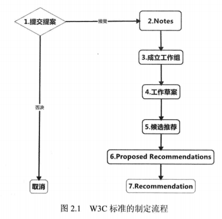
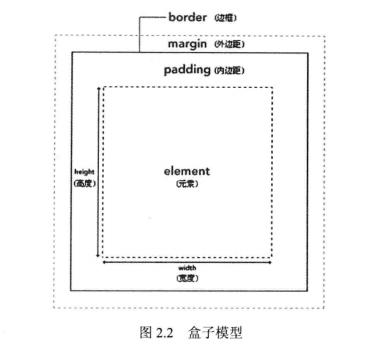
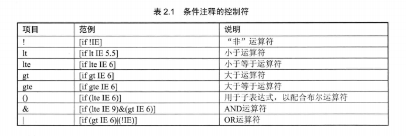
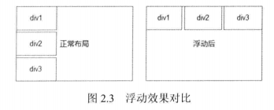
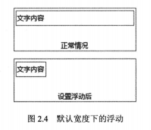
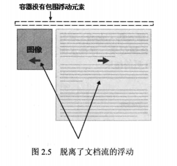
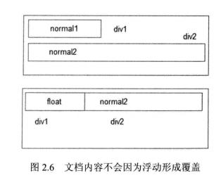
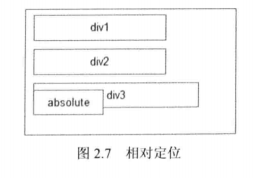
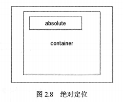

# 第2章 温故知新——HTML、CSS基础

新的网站制作技术虽然层出不穷，但是技术的发展讲究循序渐进和向上兼容，网站前端的基本技术框架与互联网大潮刚刚兴起时的框架并无不同。因此，在学习新的标准和特性时，对于一些基本的概念仍需要有清晰的理解，这才能帮助我们更好地消化新知识。

本章主要是对HTML和CSS基础中的一些重点和难点进行分析，包括以下几个要点：

* 盒子模型。
* CSS的属性前缀。
* 通过HTML的条件注释编写IE兼容性代码。
* 元素的浮动，以及如何清除浮动。
* 元素的定位，包括绝对定位于相对定位，以及如何解决fixed的兼容问题。

## 2.1 W3C标准、HTML语言和CSS

本节了解什么是W3C、W3C的工作流程，以及HTML和CSS在网页中的作用。

### 2.1.1 W3C组织与W3C标准

W3C是万维网联盟（World Wide Web Consortium）的英文简写，万维网联盟创建与1994年，是国际上著名的标准化组织之一，主要致力于实现对Web技术的标准化。

为解决Web应用中不同平台、技术和开发者带来的不兼容问题，保障Web信息的顺利和完整流通，W3C制定了一系列标准，并负责督促Web应用开发者和内容提供者遵循这些标准。标准的内容包括了使用语言的规范、开发中使用的导则和解释引擎的行为等。W3C也制定了包括XML和CSS等众多影响深远的标准规范，有效促进了Web技术的互相兼容，对互联网技术的发展和应用起到了基础性和根本性的支撑作用。

W3C组织对Web标准的制定和审核是非常严格的，一般会经过如图2.1所示的7个流程。

**1. 提交提案**

W3C成员向W3C组织投递自己的一个提案，但W3C有可能决定不接受这个提案。

**2. Notes**

如果某个W3C成员向W3C组织提交了一个提案，而且W3C没有拒绝这个提案，那么它就进入了Note阶段。Note的内容由提出进行编辑修改，W3C是不管的。Note发表的时候，表示W3C还没有开始进行和这个提案有关的任何工作。

**3. 成立工作组**

Notes被W3C认可后，W3C会成立一个工作组。工作组包括W3C的成员和有兴趣的外界团队和个人。

**4. 工作草案**

草案会在W3C的站点上公布，并邀请公共的评论和意见。工作草案一般不会作为参考资料，因为它还会经过大量的修改、更新，而且可能随时被废弃。

**5. 候选推荐**

这个阶段是可选的，依据论题的复杂程度而定。

**6. Proposed Recommendations**

Proposed Recommendations是工作组工作的最后一个阶段。它有被继续修改的可能，但在一般情况下，它会马上不做改动地成为新的W3C标准。

**7. Recommendation**

Proposed Recommendations经过了W3C组织成员的检查和W3C主席的盖章后，成为W3C Recommendation。它一般是一个稳定的规范，可以作为参考资料进行学习。



### 2.1.2 什么是HTML

HTML是Hyper Text Markup Language的缩写，汉语一般译作超文本标记语言。HTML是为显示网页浏览器中的信息而设计的一种标记语言。

HTML在1982年由蒂姆.伯纳斯-李创建，由IETF用简化的SGML（标准通用标记语言）语法进行了扩展，后来成为国际标准，由万维网联盟（W3C）维护。

HTML文档最常用扩展名为.html，但是有些旧操作系统（如DOS）限制扩展名最多为3个文字符号，所以.html扩展名也允许使用。

HTML语言本质上和Office Word是一致的，都用于编辑文档，它采用不同的标签来表达不同的意义，如下面的例子：

```html
<html>
    <body>
        <h1>
            CSS高性能实战
        </h1>
        <h2>
            前言
        </h2>
        <p>
            Cascading Style Sheets，译作层叠样式表，简称为CSS，是一种用于为HTML等结构化文档添加样式的标记语言。为了……
        </p>
    </body>
</html>
```

`<h1>`标签表示大标题，`<h2>`标签标示二级标题，`<p>`标签表示段落。多数完整的HTML标签由开头的声明和结尾的闭合组合，闭合标签需要在内部加上`/`符号，例如上例中的`<h1>……</h1>`。

**注意：**有一些HTML标签是空标签，只包含属性，没有闭合标签，如``标签，`<input>`标签等。

### 2.1.3 什么是CSS

Cascading Style Sheets，译作层叠样式表，简称为CSS，是一种为HTML等结构化文档添加样式的标记语言。目前流行的CSS3标准从1999年就开始制定，知道2011年才最终发布为W3C推荐规范。当前主流浏览器都可以支持绝大部分CSS3标准。最新的CSS4标准从2011年开始设计，不过距离完善还有很长的距离，目前只有部分浏览器支持其中极少数的功能。

通俗一点解释，CSS完成的工作和在Office Word里为文档修改样式是一样的，比如在Word中可以指定大标题的字号、字体、上下间隔、对齐方式，对应到CSS中就是修改HTML中`<h1>`标签的样式，例如：

```css
h1{
    font-size:40px;		/*字体大小为40像素*/
    color:black;		/*颜色为黑色*/
    line-height:100px;	/*行高为100像素*/
    text-align:center;	/*居中对齐*/
}
```

### 2.1.4 HTML+CSS之最佳拍档

HTML用来显示网页的内容，CSS用来设计网页的样式。那么怎样将CSS应用到HTML文档中呢？常见的有3种方法：使用style属性、使用`<style>`标签、使用`<link>`标签。下面详细介绍这3种方法并举例。

（1）在HTML标签内使用style属性为该标签指定样式。例如：

```html
<html>
    ……
    <h1 style="color:red">
        CSS高性能实战
    </h1>
    ……
</html>
```

这段代码将大标题的颜色改为了红色。这种定义方式在样式代码较多时阅读和编写都比较困难，而且只能对当前标签生效。一般来说不推荐在生产代码中使用这种方法的，平时只用于测试，以及用JavaScript为元素追加CSS属性时使用。

（2）在HTML文档内部用`<style>……</style>`标签包裹CSS代码。例如：

```html
<html>
    <style>
        h1{
            color:red;
        }
    </style>
    <h1>
        CSS高性能实战
    </h1>
    ……
</html>
```

这段代码仍然将大标题的颜色改为红色，只不过将CSS定义的位置放在了`<style>`标签内集中管理，这样降低了HTML和CSS代码之间的耦合，方便管理。但是有一些CSS定义是可以同时应用于多个HTML文档的，如果采用这种方式，就必须在不同的HTML文档中定义相同的CSS，因此一般来说，实际生产中也不推荐这种方式。

（3）使用`<link>`标签引用外部CSS样式表。例如：

```html
<html>
    <head>
        <link href="http://libs.baidu.com/bootstrap/2.3.2/css/bootstrap.css" rel="stylesheet">
    </head>
    <body>
        <h1>
            CSS高性能实战
        </h1>
        ……
    </body>
</html>
```

使用`<link>`标签既可以引用本地的CSS文件，也可以引用远程的CSS文件。这样的话，CSS样式文档只要编写一份，其他HTML文档需要它时就可以将它引入进来，这样既方便管理，又避免了重复劳动。一般在生产环境下，都采用这种方式将CSS和HTML进行结合。

## 2.2 不可不知的CSS盒子模型

大多数情况下，我们需要对商品进行包装才能出售，商品既需要精美的表层包装来吸引顾客，也需要牢固的外壳来避免运输途中的碰撞和变质。

一个块级元素，包括内容、外边距、边框、内边距4个组成部分，当然，在不设定的情况下，内外边距和边框都是没有的。对于一个块级元素来说，设置内外边距和边框就像为商品套上包装盒一样，这就是“盒子模型”这一说法的由来。CSS的盒子模型如图2.2所示。



**1. 内容**

元素框的最内部分是实际的内容，直接包围内容的是内边距（padding），它呈现了元素的背景。内边距的边缘是边框，边框以外是外边框（margin），外边距默认是透明的，因此不会遮挡其后的任何元素。

**注意：**背景应用于由内容和内边距、边框组成的区域。

**2. 内边距和边框**

内边距和边框主要的作用是装饰。在内边距和内容区域，我们可以显示漂亮的背景，还可以控制边框的样式来装点内容。

**3. 外边距**

外边距主要用于布局，目的是控制元素之间的距离。

## 2.3 跨浏览器的CSS

由于W3C标准的发展，以及浏览器厂商出于利益的考量，老版本的浏览器（尤其是IE系列）存着大量的和W3C标准不一致的情况。一个在Chrome浏览器下十分美观的网站，在IE6下很可能惨不忍睹，对此我们不得不进行大量的兼容性设计。

根据开发需求，跨浏览器设计有多种解决方案，如果仅仅是要求在老版本IE下能够正常显示布局，可以采用渐进增强的设计，仅仅使用一套代码，在布局方面采用一些兼容性的措施，保证不出现布局错乱即可。

而如果要保证所有的浏览器显示效果一致的话，一方面不得不放弃一些很酷的选项，比如HTML5中的canvas、CSS3的transform；另一方面不得不使用更多的图片，降低页面加载的性能；甚至我们可能必须根据用户浏览器的不同编写多套代码。

兼容性问题五花八门，本书只介绍通用的方法，那就是通过条件注释（conditional comment）让不同的浏览器来加载不同的CSS，实例代码如下：

```html
<!--[if!IE]><!-->除IE外都可识别<!--<![endif]-->
<!--[if IE]><!-->所有的IE可识别<!--<![endif]-->
<!--[if IE 6]><!-->仅IE6可识别<!--<![endif]-->
<!--[if It IE 6]><!-->IE6以及IE6以下版本可识别<!--<![endif]-->
<!--[if gte IE 6]><!-->IE6以及IE6以上版本可识别<!--<![endif]-->
```

条件注释的控制符见表2.1



## 2.4 理解浏览器的属性前缀

当一个新的CSS属性被开发出来后，由于W3C标准的申请和审核流程十分严格和漫长，浏览器厂商往往会暂时绕开这一流程，通过添加前缀的方式让自己的浏览器率先支持新的属性。本节就来介绍这些前缀。

### 2.4.1 常用的属性前缀

以下是开发中经常会用到的前缀。

* -webkit：webkit核心浏览器，包括Chrome、Safari等。
* -moz：火狐（Firefox）浏览器。
* -ms：IE浏览器。
* -o：Opera浏览器。

在实际开发过程中，对于大多数CSS3效果来说，考虑到兼容性，往往需要把所有的前缀属性都写上，譬如这样：

```css
.transform{
    -webkit-transform:rotate(-3deg);	/*带有Chrome、Safari浏览器的属性前缀*/
    -moz-transform:rotate(-3deg);		/*带有Firefox浏览器的属性前缀*/
    -ms-transform:romtate(-3deg);		/*带有IE浏览器的属性前缀*/
    -o-transform:rotate(-3deg);			/*带有Opera浏览器的属性前缀*/
    transform:totate(-3deg);			/*W3C标准语法，无属性前缀*/
}
```

### 2.4.2 属性前缀的排序

即使W3C标准得到了一致通过和广泛推广，但浏览器厂商为了兼容老的内容，还是不得不继续支持带有前缀的属性；而开发者面对一些使用老版本浏览器的用户时，也不得不继续给代码写上所有的属性前缀。

但是问题随之产生：

**W3C标准属性在某些情况下与带有前缀的属性具有不同的表现形式，那有什么解决方案呢？**

这一方面需要依赖开发者的知识和经验，一方面也可以采取通用的办法，就是把标准属性放在最后书写。例如：

```css
.border_button{
    -webkit-border-radius:5px;
    -moz-border-radius:5px;
    border-radius:5px;					/*标准属性*/
}
```

这样即使出现不一致的情况，后书写的符合W3C标准的属性，会覆盖前面带有属性前缀的定义，更好地保证显示效果在所有浏览器下的一致性。

## 2.5 揭开浮动布局的秘密

正常情况下，页面中的块级元素（block）就好像一个个沉在水中的题块，如果我们将铁块换成木块呢？显然它们会飘起来，浮在水面上，如图2.3所示，右边的部分是给div1~div3元素设置了float:left后的结果。



### 2.5.1 浮动导致的布局变动

这里使用浮动（float）这个词语实在是非常形象。当然，这里的浮动和现实中的浮动并非完全吻合，下面来学习一下CSS中的float属性。

float属性有4个可选项：none、left、right、inherit。其中none为默认值，即不浮动，inherit表示继承父元素的float值。而left、right则很好理解，一个是向页面的左侧浮动，一个是向页面的右侧浮动。我们重点需要说明的是设置了浮动后元素的变化情况。

**注意：**一般不建议使用inherit，因为IE不支持这个选项。

（1）对于块级元素来说，在不设置宽度的情况下，默认的宽度是100%，一旦设置了浮动，它的宽度就会根据内容进行自动跳转，如图2.4所示。



图2.4的代码如下：

```html
<div>						<!--未设置浮动-->
    文字内容
</div>
<div style="float:left;">	<!--设置左浮动-->
    文字内容
</div>
```

（2）设置了浮动的元素会脱离正常的文档流，我们可以这样理解：设置浮动后，元素不仅在y轴上浮了起来，在z轴上，也浮了起来。譬如：默认情况下，父元素的高度会根据子元素的内容自动进行调整，而如果我们将子元素设置为浮动，父元素的高度就会变为0，如图2.5所示。



图2.5的代码如下：

```html
<style>
    .left,.right{
        float:left;
    }
    .left{
        width:30%;
    }
    .right{
        width:70%
    }
</style>

<div class="container">
    <div class="left">
        
    </div>
    <div class="right">
        <p>
            ……//此处省略文字
        </p>
    </div>
</div>
//通过浏览器工具可以发现container的高度为0
```

（3）虽然浮动的元素脱离了文档流，但是里面的内容仍然占据空间，会根据相对位置进行布局，如图2.6所示。



如果将div1设置为float:left，由于float元素脱离了文档流，div2自动向上补一位，但是不同于我们的下意识反应：文字normal2并没有被div1中的文字覆盖（虽然div1是覆盖在div2上方的），而是排列在了正常的相对位置上。

图2.6的代码如下：

```html
//没有设置浮动时的代码
<style>
    .div1.div2{
        height:20px;
    }
    .div1{
        width:300px;
        float:left;
    }
</style>
<div class="div1">
    float
</div>
<div class="div2">
    normal2
</div>
```

### 2.5.2 清除浮动

2.5.1讲述了应用浮动后布局出现的种种改变，有时我们需要用到浮动，但又不想由于浮动的某些特性影响布局，这时就需要清除浮动。

清除浮动主要应用的是CSS中的clear属性，clear属性定义了元素的哪一侧不允许出现浮动元素。可选项有left、right、both。例如：

```css
img{
    float:left;
    clear:both;		/*左右两侧都不允许出现浮动元素*/
}
```

下面介绍两种应用比较广泛的清除浮动的方法。

（1）在需要的地方添加定义了clear:both的空标签。

```css
html body div.clear,
html body span.clear{
    background:none;
    border:0;
    clear:both;			/*这句是重点，其他都是兼容性代码*/
    display:block;
    float:none;
    font-size:0;
    margin:0;
    padding:0;
    overflow:hidden;
    visibillity:hidden;
    width:0;
    height:0;
}
/*在需要清除浮动的元素后面添加<div class="clear"></div>即可*/
```

这是一个“万能”的清除浮动代码，可以在不同浏览器下兼容。

（2）对父元素使用：after伪类。

```css
.clearfix:after{
    content:"020";
    display:block;
    height:0;
    clear:both;
}
.clearfix{
    zoom:1;
}
.left{
    float:left;
}
.right{
    float:right;
}

<div class="div1 clearfix">
	<div class="left">Left</div>
	<div class="right">Right</div>
</div>
/*使用调试工具可以看到，父元素的高度不再为0了*/
```

**注意：**由于IE6和IE7不支持:after伪类，因此需要添加zoom:1兼容代码。

## 2.6 看穿CSS的定位技术

定位是CSS基础学习中的一个重点，也是一个难点。CSS使用top、left、right、bottom设置元素的而二维（x轴和y轴）偏移量，使用z-index设置元素垂直于屏幕的方向，也就是“z轴”的偏移量。

CSS使用position选项来定义元素的定位属性，该选项有5个可选值：static、relative、absolute、fixed、inherit，默认值为static。inherit属性表示继承父类的定位属性，因此，实际上我们只需要掌握static、relative、absolute、fixed这4种定位属性的特性即可。

### 2.6.1 相对定位技术与实战

相对定位就是指相对于文档流中的其他已定义的元素位置进行定位，如图2.7所示。



`<div2>`的位置是根据已存在的`<div1>`的位置向下顺延的，而`<div3>`的位置则根据`<div2>`的位置决定，和绝对定位的、已经脱离文档流的absolute元素的位置无关。

**注意：**那些脱离文档流的元素，比如设置了浮动或者绝对定位的元素不会对相对定位产生影响。

relative和static都是相对于文档其他元素进行定位，都属于相对定位的范畴，区别只在于一个可以控制位移，一个不能。

**1. static（默认值）**

如果使用默认值，在CSS中为元素定义top、left、right、bottom、z-index都不会生效。换句话说，如果想设置元素的偏移量和z-index，必须为元素定义position属性（static除外）。

**2. relative**

relative的表现和默认值一样，只不过可以通过设置偏移量和z-index来控制相对其正常位置进行的偏移。

**说明：**所有元素的定位（position）都默认为static，什么都不写就是相对定位，而使用position:relative在不设置top/left/z-index等值的情况下和默认值表现是一样的。

### 2.6.2 绝对定位技术与实战

绝对定位的元素有以下几个特点：

* 块级元素的宽度在未定义时不再为100%，而是根据内容自动调整。
* 在不定义z-index的情况下，absolute元素会覆盖在其他元素之上。
* 它会脱离正常的文档流，不再占据空间，类似于浮动后的效果。

absolute和fixed都属于绝对定位的范畴，都遵循以上3个特点。

**1. absolute**

absolute是相对上一个不为static的父元素进行绝对定位。换句话说，如果不指定父元素的position，absolute将相对于整个html文档进行绝对定位，如图2.8所示。



图2.8的代码如下：

```html
<style>
    .container{
        margin:auto;
        width:960px;
        height:300px;
        position:relative;		/*指定父元素的position*/
    }
    .absolute{
        position:absolute;
        top:0;
        left:0;
    }
</style>
<body>
    <div class="container">
        <div class="absolute">
            绝对定位
        </div>
    </div>
</body>
```

只有指定了container的position（非static），子元素才能相对父元素进行绝对定位，否则将相对html进行绝对定位，这段代码中，.absolute元素将出现在.container容器部分的左上角，如果不指定container的position，.absolute元素将出现在浏览器页面的左上角。

如果想让absolute元素相对container进行绝对定位，我们可以为container定义position:relative。

**2. fixed**

生成绝对定义的元素，相对于浏览器窗口进行定位。也就是说，不论页面如何滚动，该元素始终停留在屏幕的某个位置上。比如我们希望侧边控制栏始终对用户可见，就可以使用position:fixed来进行定位。

IE6和IE7不支持fixed属性，不过可以通过兼容性方案，用absolute来模拟fixed效果，代码如下：

```css
/*相当于正常的position:fixed;top:0;*/
.sl-fixed-top{
    bottom:0;
    top:auto;
    _bottom:auto;
    _top:expression(eval(document.documentElement.scrollTop+document.documentElement.clientHeight-this.offsetHeight-(parseInt(this.currentStyle.marginTop,10)||0)-(parseInt(this.currentStyle.marginBottom,10)||0)));
}

/*相当于正常的position:fixed;left:0px;*/
.sl-fixed-left{
    left:0;
    _position:absolute;
    right:auto;
    _left:expression(eval(document.documentElement.scrollLeft));
}
/*相当于正常的position:fixed;right:0;*/
.sl-fixed-right{
    right:0;
    left:auto;
    _right:auto;
    _left:expression(eval(document.documentElement.scrollLeft+document.documentElement.clientWidth-this.offsetWidth)-(parseInt(this.currentStyle.marginLeft,10)||0)-(parseInt(this.currentStyle.marginRight,10)||0));
}
/*Hack for IE6*/
.sl-fixed-top,.sl-fixed-right,.sl-fixed-bottom,.sl-fixed-left{
    _position:absolute;
}
```

## 2.7 小结

本章主要对HTML和CSS基础中的一些重点和难点进行了分析。在学习网页设计与网站搭建之前，必须先对这些基础知识有所了解，这就类似于给房屋打地基，地基没打好，则后面学习的难度会越来越大。本章基本涵盖了HTML/CSS基础中最容易碰到问题的技术点，如盒子模型、属性前缀、浮动、绝对定位和相对定位等，一些对基础概念有些模糊的读者，务必在学习新特性和框架实战前阅读本章，打好坚实的基础。尤其是浮动和定位，它们是CSS布局当中很重要的两种方法，不管是CSS2还是CSS3，只要有CSS的地方，它们的地位就无法撼动。