# 第3章 使用CSS选择器让样式表更健壮

本章主要介绍CSS选择器的知识，选择器可以帮助我们选择特定的某个HTML元素，或有共同规律的某组HTML元素，从而可以为选中的元素添加样式。合理地使用选择器可以使项目拥有更好的可维护性。

本章主要知识点：

* CSS的基础选择器。
* CSS的伪类选择器。
* 选择器的应用案例。

## 3.1 基础选择器

本节主要介绍最常用的一些选择器，这些选择器在任何浏览器下都支持，是CSS学习中必须掌握的基础内容。

### 3.1.1 标签选择器

标签选择器是最简单的选择器，它的命名只要和对应的HTML标签相同即可，例如：

```css
h1{
    font-size:30px;
    color:#333;
}
```

这里的h1就是标签选择器，在实际项目中，标签选择器一般用于定义全局样式。和Office中的Word类似，在全局定义中预定义好正文和标签的样式、段落之间的间距、图片的最大宽度和对齐方式等。全局定义只需要定义一次，就可以在本文档的任何地方使用，如果修改，也只需要修改一次。合理地使用标签选择器定义全局样式，可以大大减轻开发和维护的工作量。

下面的示例是节选Bootstrap框架汇中关于标题的全局定义，读者可以研习一下标签选择器在实际项目中的应用。

```css
h1,h2,h3,h4,h5,h6{
    margin:10px 0;
    font-famliy:inherit;
    font-weight:bold;
    line-heiht:20px;
    color:inherit;
    text-rendering:optimizeleglbility;
}

h1,h2,h3{
    line-height:40px
}

h1{font-size:38.5px;}
h2{font-size:31.5px;}
h3{font-size:24.5px;}
h4{font-size:17.5px;}
h5{font-size:14px;}
h6{font-size:11.9px;}
```

### 3.1.2 类选择器

类选择器也称为class选择器，它的语法非常简单，在class名称前面加上一个“.“符号。例如：

```html
<div class="red content">
    
</div>
```

```css
.red{
    background:red;
}
.content{
    height:100px;
    width:100%;
}
```

由于一个HTML标签可以定义多个class属性，因此在实际应用中，类选择器称为了最灵活、应用最广泛的选择器。基本上任何样式定义都可以通过为元素追加class属性，然后定义该class的样式来完成，可谓是“万金油”方法。

> **注意：**从代码的可读性、可维护性角度来讲，不要滥用类选择器，尽量不要为一个标签添加多于两个的class属性。尽量为class指定有意义的命名，避免x1、x2、y1、y2这样的无意义命名。

下面仍然节选一段Bootstrap中的代码供读者参考：

```css
.icon-heart{
    background-position:-96px 0;
}
.icon-star{
    background-position:-120px 0;
}
.icon-star-empty{
    background-position:-144px 0;
}
.icon-user{
    background-position:-168px 0;
}
.icon-film{
    background-position:-192px 0;
}
```

注意看这里的命名规则，icon开头表示这个class是在描述一个icon（小图标），而后缀则表示这个icon的意义，比如icon-heart一看就知道是一个心型图标的意思，这样即使不看实际效果，也能知道这段CSS的作用，大大提高了代码的可读性。

### 3.1.3 id选择器

id选择器的语法是一个“#”号加上id的名称，例如：

```html
<div id="user_123">
    
</div>
```

```css
#user_123{
    width:120px;
    line-height:30px;
    height:30px;
}
```

一个HTML元素只能对应一个id，所以id选择器在灵活性上不如class选择器，因此在实战中很少会直接在CSS文件中为id定义样式。

id选择器在实战中一般有两个用途：

* id选择器拥有最高的权重，因此可以用于覆盖之前的一些定义。
* 和后台数据对应，从而配合JavaScript进行一些逻辑操作。

### 3.1.4 通配符选择器

通配符的意思就是用一个符号来代替某些字符，例如在Word中要搜索以com开头的所有单词，可以用“`com*`”来做搜索关键字，这个*表示任意字符，这个时候可能就会搜到computer、compact、combo等以com开头的单词。

CSS从CSS2时代开始就引入了一种简单选择器——通配符选择器（universal selector），它以星号（*）开始，该选择器可以与任意元素匹配。例如，下面的规则可以使文档中的每个元素都显示为红色：

```css
*{
    color:red;
}
```

这个声明等价于列出了文档中所有元素的一个分组选择器。

通配符选择器在实际开发中可用于定义全局样式，不过使用标签选择器也能获得类似效果，例如：

```css
body{
    color:red;
}
html{
    color:red;
}
```

> **注意：**通配符选择器的权重是最低的，因此只要有其他的定义，使用通配符选择器进行的定义就会被覆盖。

### 3.1.5 子元素选择器

子元素选择器用于表示某些特定HTML嵌套关系时的样式展现，其语法关键词是一个“>“符号。例如：

```html
<li>
    <a href='#'>www.baidu.com</a>
</li>
<li>
    <div>
    	<a href='#'>www.baidu.com</a>
    </div>
</li>
```

```css
li>a{
    color:red;
}
```

“>“左边是父元素，右边是子元素。上面的代码就表示第一个列表项（`<li>`）中的链接（`<a>`）为蓝色，而其他地方的链接则不受影响。

> **注意：**如果两个元素不是严格的“父子关系”，则使用子元素选择器的定义不会生效。例如上面HTML代码中的第2个列表项的文字就不会设置为蓝色。

### 3.1.6 后代元素选择器

后代元素选择器类似于子元素选择器，只不过它的要求不那么严格。它的语法关键词是一个空格，例如：

```html
<li><a href="#">www.baidu.com</a></li>
<li><div>
    	<a href="#">www.baidu.com</a>
    </div>
</li>
```

```css
li a{
    color:blue;
}
```

只要链接（`<a>`）标签是列表项（`<li>`）的后代元素即可，如上面的HTML代码，两个链接的文字都会被设置为蓝色。

> **注意：**读者一定要分清楚后代元素选择器和子元素选择器的区别，后代包括子辈、孙子辈、曾孙子辈等，而子元素只包括子辈。

### 3.1.7 相邻元素选择器

相邻元素选择器用于选取和某个元素相邻的同级元素，其语法关键词是一个“+”符号，例如：

```html
<div class="content">
    <h1>
        测试
    </h1>
    <p>
        测试内容
    </p>
</div>
```

```css
h1+p{
    font-size:15px;
}
```

上面的CSS代码定义了和h1标题（`<h1>`）相邻的段落（`<p>`）的样式。

相邻元素选择器的使用有两个条件：

* 二者必须拥有同一个父元素。
* 二者相邻。

相邻元素选择器在实际应用中往往会和其他选择器配合使用，例如：

```css
body > .content h1+p{
    font-size:15px;
    font-weight:bold;
}
```

这段代码表示body的子元素.content中如果存在后代元素h1，则最终定义的是和h1元素相邻的p元素的样式。

一个实际的例子就是标题后第一段的文章导语经常会加粗显示，这里使用相邻元素选择器就非常合适，如图3.1所示。

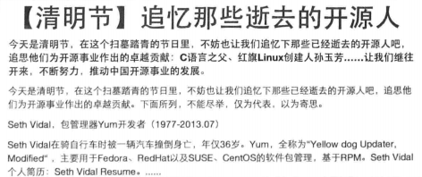

### 3.1.8 属性选择器

HTML元素除了id、class等通用的属性以外，有些标签还可以添加其他的属性，比如title、href、name等。在CSS选择器中，开发者也可以通过判断某些属性是否存在或者通过属性的值来选取HTML元素，这时就需要用到属性选择器。属性选择器的语法关键词是一对中括号“`[]`”，例如：

```css
[title]{
    color:red;/*所有拥有title属性的元素的文字颜色设为红色*/
}
a[href][title]{
    color:red;/*同时拥有href和title属性的a标签的文字颜色设为红色*/
}
```

由第2段代码可以发现，属性选择器可以进行链式调用，从而缩小选择范围。

上面这个例子是根据属性是否存在来进行选择，只需要在`[]`中填入属性名即可。我们还可以通过为属性赋值来选取拥有特定属性值的元素，例如：

```css
a[href="http://www.baidu.com"][title="百度"]{
    color:red;
```

这样自由href=http://www.baidu.com且title=“百度”的链接（`<a>`）文字才会被设置为红色。

在应用属性选择器时还可以使用通配符来进行模糊匹配，例如：

```css
a[src^="https"] /*选择其src属性值以“https"开头的每个<a>元素。*/
a[src$=".pdf"] /*选择其src属性以“.pdf"结尾的所有<a>元素。*/
a[src*="abc"] /*选择其src属性中包含"abc"子串的每个<a>元素。*/
```

> **注意：**使用通配符的属性选择器时CSS3新加入的特性，IE9以前的浏览器无法兼容。 

### 3.1.9 组选择器

如果要对多个元素定义同样的样式，则可以用组选择器来缩减重复代码。组选择器的语法关键字是一个“,“（英文的逗号），例如：

```css
h1,h2,h3,h4,h5,h6{
    font-wight:bold
}
```

这段代码表示从h1~h6都采用加粗字体。使用组选择器就可以避免一个一个地定义相同或局部相同的属性，从而使得CSS样式表更为简洁易读。

下面节选一段Bootstrap中应用组选择器的实例：

```css
botton,
input,
select,
textarea{
    margin:0;
    font-size:100%;
    vertical-align:middle;
}

button,
input{
    *overflow:visible;
    line-height:normal;
}

button::-mox-focus-inner,
input::-moz-focus-inner{
    padding:0;
    border:0;
}

button,
html input[type="button"],
input[type="reset"],
input[type="submit"]{
    cursor:pointer;
    -webkit-appearance:button;
}
```

通过阅读以上代码读者可以发现，组选择器可以跟其他选择器（如这个例子中出现的属性选择器）共同使用。

### 3.1.10 复合选择器

如果说组选择器相当于一种并集，或者常说的“或”（||）关系的话，那么复合选择器就表示”与“（&）的关系。它的用法很简单，将两个有可能发生”与“关系的选择器连在一起就行，例如：

```css
p.test{	/*注意中间不要有空格，否则就会被识别成后代选择器了*/
    color:red;
}
```

```html
<p class="test">hehe</p>
<div>hehe</div>
<div class="test">hehe</div>
<p>hehe</p>
```

只有第1个段落（`<p>`）中的文字会被设置为红色，因为它同时满足了p元素和class=“test”两个条件。

> **注意：**应用复合选择器时，标签选择器一定要写在前面，否则无法识别。

## 3.2 伪类选择器

本节主要介绍CSS中的伪类选择器，谈到伪类选择器就必须明白什么是伪类？伪类表示元素的状态：排序、鼠标是否悬停、是否已被访问过、光标是否指向等。

使用伪类选择器，就可以得到诸如有鼠标悬停的元素、父元素下的第n个子元素、已被访问过的链接等使用基本选择器无法进行区分的元素。

CSS2中只有:hover、:active、:visited、:link、:first-child、:lang、:link等有限的几种伪类选择器，CSS3增添了大量新的伪类选择器，帮助开发者更为灵活地选取元素。

### 3.2.1 结构化伪类

结构化伪类这个词乍一看不知道是什么意思，其实就是可以根据文档的结构来选取元素。在CSS3出现前，只有一个:first-child可以使用，CSS3对结构化伪类进行了极大的丰富，让开发者可以根据元素在文档中的结构索引来进行多样的选择。

笔者首先给出一个基本的样例，本节后面的所有介绍都基于此样例。样例代码如下：

```html
<!DOCTYPE html>
<html lang="en">

	<head>
		<meta charset="UTF-8">
		<meta name="viewport" content="width=device-width, initial-scale=1.0">
		<meta http-equiv="X-UA-Compatible" content="ie=edge">
		<title>Document</title>
		<style type="text/css">
			ul>li {
				display: inline-block;
				height: 24px;
				line-height: 24px;
				width: 24px;
				font-size: 15px;
				text-align: center;
				background-color: rgb(226, 129, 129);
				border-radius: 4px;
				margin: 5px;
			}
		</style>
	</head>

	<body>
		<ul class="test">
			<li>1</li>
			<li>2</li>
			<li>3</li>
			<li>4</li>
			<li>5</li>
			<li>6</li>
			<li>7</li>
			<li>8</li>
			<li>9</li>
			<li>10</li>
		</ul>
		<div>
			<ul class="test_one">
				<li>1</li>
				<li>2</li>
				<li>3</li>
				<li>4</li>
				<li>5</li>
				<li>6</li>
				<li>7</li>
				<li>8</li>
				<li>9</li>
				<li>10</li>
			</ul>
		</div>
	</body>

</html>
```


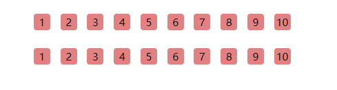

**1.  :nth-child(n)**

“:nth-child(n)”选择器中的n表示一个简单的表达式，它可以是大于等于0的整数，比如在基础样例中应用：

```css
li:nth-child(2){
    background-color:#333;
    color:white;
}
```

n取2，就是取某个父元素内第2个`<li>`元素，即需要同时满足两个条件：

* 是不是第2个。
* 是不是`<li>`元素。

如果两个都满足则生效，应用上述代码后的效果如图3.3所示。

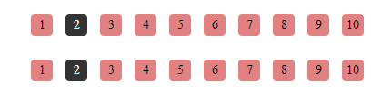

这里可以看到，尽管图案中第1行和第2行的代码结构不同，但是都符合“某个父元素中第2个`<li>`元素”的条件，于是样式都发生了相应地改变。

这里的n不仅仅能指定某个特定，还可以进行相应的计算，譬如:nth-child(n)，这种用法相当于全选，例如：

```css
li:nth-child(n){
    background-color: #333;
    color: white;
}
```

**注意：**这里的变量只能用字母n来表示，其他诸如x、m这些是不行的。

代码的效果如图3.4所示。

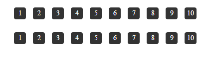

:nth-child(2n)则表示所有的偶数项，例如：

```css
li:nth-child(2n){
    background-color: #333;
    color: white;
}
```

代码效果如图3.5所示。


如果这里取3n的话则会选取3、6、9项，如果取2n+1则会选取所有的奇数项，依次类推即可。

:nth-child(n+5)这个选择器是选择从第5个元素开始进行全选（这个数字5可以自己定义），如：

```css
li:nth-child(n+5){
    background-color: #333;
    color: white;
}
```

代码效果如图3.6所示。

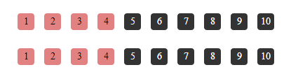

> **说明：**IE6-8和FF 3-浏览器不支持“:nth-child”选择器。

**2. :nth-lash-child(n)**

“:nth-last-child(n)“选择器和前面的”:nth-child(n)“很相似，只是这里多了一个last，所以它起的作用就和“:nth-child”选择器获取元素的顺序正好相反，是从最后一个元素开始计算。这里不再举例，读者可以把前面的几个:nth-child(n)代码换成:nth-last-child(n)。

**3. :nth-of-type(n)**

“:nth-of-type(n)”选择器和前面介绍的“:nth-child(n)”类似，区别在于，如果使用p:nth-child(3)这样的条件时，一旦第3个元素不为`<p>`元素，这个选择器就不起作用，而p:nth-of-type(n)则查询的是第3个`<p>`元素

如果把两个列表中的第3个元素的`<li>`都换成`<div>`，对第1个列表使用li:nto-of-type(3)，第2个列表使用li:nth-child(3):

```css
li:nth-of-type(3) {
    background: #333;
    color: white;
}

li:nth-child(3) {
    background-color: #333;
    color: white;
}
```

最终显示效果如图3.7所示。

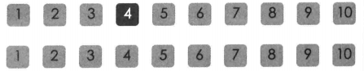

如果不加标签类型，在使用:nth-of-type(n)时就会自动选择所有并列元素的第n个，如下例：

```css
:nth-of-type(1){
    background: red;
}
```

```html
<body>							/*第一层的第一个元素*/
    <div>						/*第二层的第一个元素*/
        <ul class="test_one">	/*第三层的第一个元素*/
            <li>1</li>			/*第四层的第一个元素*/
            <li>2</li>
        </ul>
    </div>
</body>
```

每一层的第1个元素的背景都被设为红色，看到的效果就是整个背景变成红色了。如果将1改为2，那么只有`<li>2</li>`的背景变成红色。

**4. :nth-last-of-type(n)**

“:nth-last-of-type(n)”选择器和前面的“:nth-of-type(n)“的区别只是获取元素的顺序相反，是从最后一个元素开始计算，例如：

```css
li:nth-last-of-type(3){
    background: #333;
    color: white;
}
```

最终显示效果如图3.8所示。

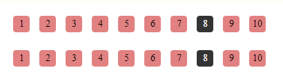

**5. :last-child**

“:last-child”选择的是元素的最后一个子元素。比如说，我们需要单独给列表最后一项设置不同的样式，就可以使用这个选择器。

>  **注意：**last-child是CSS3新增的伪类选择器，而与之对应的:first-child则是在CSS2就已经加入了。IE6不支持:first-child选择器，IE6-8不支持:last-child选择器。

**6. :first-of-type和:last-of-type**

:first-of-type相当于:nth-of-type(1)，:last-of-type相当于:nth-last-type(1)，例如：

```html
<!DOCTYPE html>
<html>

	<head>
		<meta charset="UTF-8">
		<title></title>
		<style type="text/css">
			p:last-of-type {
				color: blue;
			}
			
			p:first-of-type {
				color: red;
			}
		</style>
	</head>

	<body>
		<p>今天早上吃稀饭</p>
		<p>今天中午吃面条</p>
		<p>今天晚上吃晚饭</p>
	</body>

</html>
```

代码执行结果如图3.9所示。

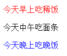

**7. :only-child**

如果一个父元素只有一个子元素，那么选取这个子元素。如果加了限定条件，例如p:only-child则取交集，即如果一个父元素只有一个子元素，且这个子元素`<p>`，这个选择器才会生效，如下面这个例子：

```html
<!DOCTYPE html>
<html>

	<head>
		<meta charset="UTF-8">
		<title></title>
		<style type="text/css">
			p:only-child {
				color: red;
			}
		</style>
	</head>

	<body>
		<div>
			<p>only-child</p>
		</div>
		<div>
			<div>only-child</div>
		</div>
		<div>
			<p>not-only-child</p>
			<p>not-only-child</p>
		</div>
	</body>

</html>
```

代码执行结果如图3.10所示，只有第一段被p:only-child选择器选中，文字颜色为红色。

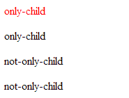

**8. :only-of-type**

基本同:only-child，区别在于如果不指定type而直接使用:only-of-type的话会造成body被选择，而 :only-child不会出现这种情况：

```html
<!DOCTYPE html>
<html>
	<head>
		<meta charset="UTF-8">
		<title></title>
		<style type="text/css">
			:only-child{
				color: red;
			}
			/*:only-of-type{
				color: red;
			}*/
		</style>
	</head>
	<body>
		<div>
			<p>only-child</p>
		</div>
		<div>
			<p>not-only-child</p>
			<p>not-only-child</p>
		</div>
	</body>
</html>

```

这段代码测试分别使用:only-child和:only-type-of时的情况，结果如图3.11所示。使用:only-of-type会对HTML文档里所有body中的元素生效。当然，如果添加了其他条件限制，使用:only-child和:only-type-of是没有区别的。

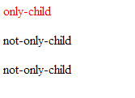

**9. :root**

选择文档的根元素，对于HTML文档来说，根元素永远是`<html>`标签，由于:root是一个CSS3选择器，不兼容IE6~8，因此建议在实际开发中使用标签选择器来代替:root。:root示例如下：

```css
:root{
    background: white;
}
html{
    background: white;
}
/*这两段代码是等效的*/
```

**10. :empty**

:empty是用来选择没有任何内容的元素，这里所说的没有内容指的是一点内容都没有，哪怕是一个空格。比如，有3个段落，其中一个段落完全是空的，但是段落标签还是会根据CSS的设置占据空间，想让这个p不显示，那么可以这样来写：

```css
p:empty{
    display:none;
}
```

> **注意：**IE6~8浏览器不支持:empty浏览器；

### 3.2.2 目标伪类:target

URL前面有锚名称#，指向文档内某个具体的元素，例如`<a href="#id_name"></a>`。那么`<div id="id_name"></div>`这个被链接的元素就是目标元素（target element）。

“:target”选择器可用于选取当前活动的目标元素，例如：

```html
<!DOCTYPE html>
<html>

	<head>
		<meta charset="UTF-8">
		<title></title>
		<style type="text/css">
			:target {
				border: 2px solid #d4d4d4;
				background-color: #e5eecc;
			}
		</style>
	</head>

	<body>
		<a href="#a1">跳转至内容1</a>
		<!--点击a1链接，则内容1的背景变为:target中的设置-->
		<a href="#a2">跳转至内容2</a>
		<!--点击a2链接，则内容1的背景变为:target中的设置，a1恢复原状-->
		
		<p id="a1"><b>内容1……</b></p>
		<p id="a2"><b>内容2……</b></p>
	</body>

</html>
```

> **注意：**IE6~8浏览器不支持:target浏览器；

### 3.2.3 状态伪类

CSS3中新增了状态伪类选择器，用于表示表单元素的状态，虽然使用属性选择器可以达到相同的效果，但是使用状态伪类的语义性更强，更容易理解。不过遗憾的是IE6~8等不支持CSS3的浏览器仍然占用大量的市场份额，因此实战中不推荐使用状态伪类选择器，如果想实现相同的效果可以用属性选择器来代替。

**1. :enabled和:disabled**

表单元素可以设置disabled属性表示禁用，:enabled选择器用于选择所有可用的元素，而:disabled则用于选择所有已被禁用的元素，例如：

```css
/*将被禁用的input元素设置为透明*/
input:disabled{
    opacity:0;
}
```

**2. :checked**

input表单中的checkbox和radio都是用checked属性表示是否被选中，只要checked属性存在，使用checked=false或checked=0都会表示单选/复选框被选中。

:checked选择器用于选择所有被选中的checkbox或radio标签，例如：

```css
/*将被选中的输入框设置为透明*/
input:checked{
    opacity:0;
}
```

目前不建议使用:checked选择器，因为完全可以使用基础选择器中的属性选择器进行替代，而且兼容性上，使用属性选择器可以兼容所有的浏览器：

```css
/*使用属性选择器达到和使用:checked一样的效果*/
input[checked]{
    opacity:0;
}
```

**3. :indeterminate和:default**

:default状态伪类选择器用来指定当前元素处于非选取状态的单选框或复选框的样式；:indeterminate状态伪类选择器用来指定当页面打开时，某组中的单选框或复选框元素还没有选取状态时的样式。

> **注意：这两个选择器只有Opera浏览器才支持，因此强烈不建议使用。

### 3.2.4 否定伪类:not(S)

CSS 3新加入的否定伪类可以使我们在针对某些特例进行排除时变得更为方便。:not(selector)选择器匹配非指定元素/选择器的每个元素，例如：

```css
:not(p){
    background-color:red;
}
```

上面这段代码表示将除了段落（`<p>`）标签以外的所有HTML元素的背景颜色都设置为红色。

:not(S)选择器还可以配合其他选择器一起使用，例如：

```css
div:not(.test){
    background:red;
}
```

这段代码选择的是`<div>`标签的子元素中，class不为test的所有其他元素。

> **说明：**和其他CSS 3选择器一样，:not(S)选择器不支持IE6~8。

## 3.3 实战演练——选择器

前两节主要介绍了一些理论知识，本节将结合实际开发中的一些实例，讲解CSS选择器中除了最基本的类选择器、id选择器以外的一些应用。

### 3.3.1 伪类选择器的实战——新闻聚合类页面

笔者曾经参与过一个新闻聚合类应用的开发，从多个新闻源捉取内容聚合后推荐给用户（类似于手机上流行的“今日头条”应用）。对于标准的新闻网站来说，文字的内容应该包裹在段落（`<p>`）标签内部，但是由于内容源自不同的网站，格式也各不相同，难免遇到各种不同的样式，比如文章开头或结尾是图片、导语、文章信息等其他内容。

这就造成了一个问题：文章内容与页头、页脚的间距可能是各不相同的。假设如图3.12所示是一篇标准的文章样式，其代码如下：

```html
<header>雷吉-杰克逊32分，雷霆加时险胜灰熊</header>
<div class="content">
	<p>
        北京时间4月27日，……
    </p>    
</div>
<footer>……</footer>
```

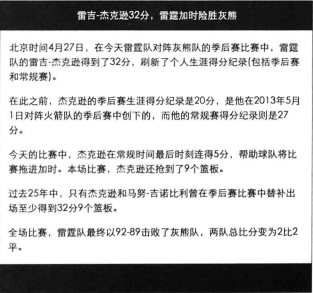

而有些文章则可能有时间、来源等内容，如图3.13所示，其代码是这样：

```html
<header>雷霆加时险胜灰熊 雷吉·杰克逊单骑救主</header>
<div class="content">
    <span>2014-04-28</span> <span>来自：虎扑体育</span>
    <p>北京时间4月27日，……</p>
</div>
<footer>……</footer>
```

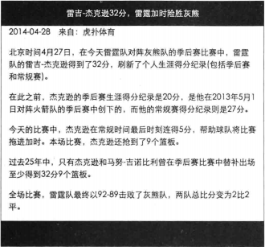

通过比较图3.12和图3.13可以发现，文字和页头的间距发生了不一致的情况，通过标签选择器或类选择器等基础选择器很难处理这种情况，这里通过伪类选择器中的first-child和list-child则可以轻松地解决，代码如下：

```css
.content>:first-child{
    padding-top: 0;
    margin-top: 1em;
}

.content>:last-child{
    padding-bottom: 0;
    margin-bottom: 1em;
}

header{
    margin-bottom: 1em;
}

footer{
    margin-top: 1em;
}
```

首先要设置`<div class="content">……</div>`的第一个子元素上方的内外边距为0，同理设置最后一个子元素下方的内外边距为0，然后为header和footer设置统一外边距，这样即使`<div class="content">……</div>`内部的内容再不规范，内容和页头、页脚也可以保持一个固定的间距。修改后的示例如图3.14所示。

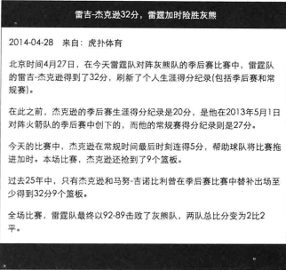

### 3.3.2 基础选择器的组合实战——新闻聚合类网页

本节选用和3.3.1小节同样的应用场景，由于`<div class="content">……</div>`内部可能采用正常的`<p>`标签来包裹文字段落，但是也有一些新闻源采用`<div>`或者`<section>`等其他标签来包裹文字，一般来说`<p>`和`<div>`、`<section>`具有不同的样式，比如行距、缩进、间距等，这样就可能造成样式的不一致，如图3.15是使用`<div>`代替`<p>`包裹文字后的效果。读者可以发现此时段落之间没有了段间隔。

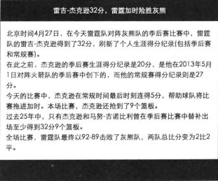

这种情况如果单独去设置`<div>`标签的样式使其和`<p>`标签一致显然是不可取的，一方面可能有问题的不止`<div>`标签一种，另一方面可能会对其他地方的样式产生影响。这里使用子元素选择器搭配通配符选择器则可以很好地解决这个问题，CSS代码如下：

```css
.content>*{
    margin:1em 0;
}
```

通过通配符选择器和子元素选择器的组合，选择所有`<div class="content">……</div>`的子元素，为它们添加和`<p>`标签一致的段间距，这样就可以尽可能地让不同文章之间的样式保持一致了。

## 3.4 小结

本章主要介绍了CSS选择器方面的知识，总结本章的要点如下：

* 标签选择器主要用于定义全局样式。
* 单一的类选择器不要滥用，因为比较容易出现命名冲突，或者语义不明的命名。对于复杂页面一般要结合子元素选择器或后代元素选择器一起使用。
* 可以使用通配符选择器进行一些全局样式定义。通配符选择器的权重最低，如果有冲突则一定会被覆盖。
* 注意子元素选择器和后代选择器之间的区别，子元素选择器必须符合严格的父子关系。
* 组选择器可以很好的缩减冗余代码。
* CSS3之前的伪类选择器只有:hover、:active、:visited、:link、:first-child、:lang 这6种，而在CSS3中对伪类选择器进行了大量的扩展和强化。需要注意这些新增的选择器都无法在IE6~8环境下使用。
* 状态伪类中的:indeterminate和:default只支持Opera浏览器，因此强烈不建议使用。

合理地使用CSS选择器可以更清晰地组织CSS代码，增强语义性、可读性，提高代码的复用程度，避免重复劳动。