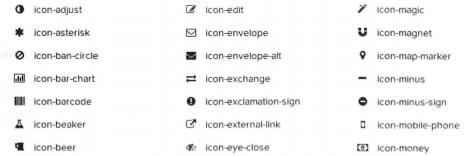

# 第4章 设计更炫目的字体

对于网页设计来说，应用合适的字体绝对是必不可少的，但是一直以来，艺术字、图标等功能都只能依赖图片来完成。现在利用CSS 3的新特性，我们就可以通过设置字体本书来设计炫目且易于修改的艺术字体了。

* 添加和使用自定义字体，应用字体图标。
* 制作字体倒影效果。
* 制作字体阴影。
* 对字体描边。
* 实现排版分栏效果。

### 4.1.1 传统的字体定义

一般情况下，开发者会使用CSS中的font-family属性来定义字体，通常会根据优先级定义多个，如果用户的计算机上安装了font-family中定义的字体，就会使用指定的字体（优先使用定义时顺序靠前的）。如果没有定义字体或者定义的字体客户端上没有安装，就会显示默认的字体，如：

```css
body{
    font:12px '微软雅黑','Microsoft JhengHei','WenQuanYi Micro Hei','Helvetica Neue',Verdana,Arial,Helvetica,sans-serif;
}
```

上面这段代码在Windows 7 的机器上时，页面将采用微软雅黑字体来展示中文，而在笔者的Ubuntu 12.04 机器上则会应用“WebQuanYi Micro Hei”字体，因为那台机器没有安装微软雅黑，但是安装了文泉驿字体。

### 4.1.2 个性化的字体定义

如果想使用一些个性化的字体，怎么办呢？@font-face属性可以帮助我们，它可以加载服务器端的字体文件，让客户端显示客户端所没有安装的字体。@font-face的基本语法如下：

```css
@font-face {
    font-family: myFirstFont;
    src: url("Sansation_Light.ttf"), url('Sansation_Light.eot');
    /*IE 9+*/
}
div{
    font-family: myFirstFont;
}
```

在@font-face内通过font-family指定该字体的名称以便引用，通过src选项指定字体文件的url来获取服务器上的字体。图4.1展示的是造字工坊推出的“情书”字体。


> **说明：**一般来说，个性化的字体需要给字体的版权方付费后才能使用。

### 4.1.3 个性化的字体图标

使用@font-face属性，还可以添加“字体图标”。什么是字体图标呢？其实就是一种特殊的字体，过去都是使用Photoshop等作图工具来制作图标，考虑性能还要把多个图标合并成一张图片，如果想修改图标的大小和颜色就非常麻烦。而使用字体图标，我们就可以像定义字体一样随意地改变图标大小、颜色等特性，非常方便而且性能更佳。

图4.2展示的是目前比较流行的字体图标插件Font Awesome的部分图标。



Font Awesome的使用非常简单，根据官方文档的说明引入相应的CSS和字体文件，然后只要在需要的地方使用“`<i class="图标类"></i>`“这样的形式即可，例如：

```html
<p><i class="fa fa-camera-retro"></i>我是一个照相机</p>
```

其效果如图4.3所示。


不过在作图方面，Photoshop的功能毕竟比CSS要强大得多，一些复杂的图标，还是需要使用图片的方式。

## 4.2 使用反射让文字倒映

