# 第1章 Windows编程基础

**本章内容**

* 课程简介与课程定位
* Windows和窗体的基本概念
* WinForm中的常用控件
* 多文档界面处理（MDI）
* 窗口界面的美化
* 本章小结

## 1.1 课程简介与课程定位

目前，.NET 2.0环境下的软件系统开发越来越受到软件行业和应用企业的青睐。Visual Studio.NET 为不同的应用程序提供了丰富的环境，一个项目本身可以由多种语言开发，如C++、C#、Visual Basic等。系统的应用程序既可以包括控制台应用程序，也可以包括Windows Forms开发，还可以应用与各种的Web平台应用开发设计和手持移动设备等。

本书着重介绍在C#环境下如何构建Windows应用程序开发，扬弃了C#的编程基础和抽象的软件设计思想。如果读者期望尽快进入C# Windows程序设计领域，本书是比较合适的入门级教材。

1.1.1 课程简介

本课程定位于Visual Studio.NET 2005环境下，通过C#语言开发的Windows Forms开发程序设计。本课程的先修课程包括C#程序设计基础、数据库基础理论与应用、数据结构与算法、面向对象的程序设计等，以使学生迅速进入Windows Forms开发环节，并可以设计出符合标准的Windows应用软件。

学习本课程后，学生将掌握以下基本知识点：

* Windows窗体设计界面介绍
* WinForm窗口的基本操作
* 窗体容器以及MDI和SDI应用程序设计
* 消息框窗口对话框机制
* 基本窗体控件的设计开发
* 高级窗体控件的设计开发
* WinForm文件操作的开发设计
* GDI+图形图像编程技术
* 多线程编程技术
* ADO.NET数据库访问技术
* WinForm网络编程技术
* 水晶报表技术
* WinForm中的打包和部署

### 1.1.2 课程体系定位

本门课程绝非孤立穿在的，其课程的开设必须建立在一套课程体系的基础上，具体课程体系如图1-1所示。

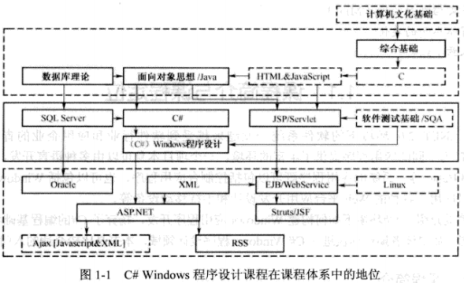

如图1-1所示，C# Windows程序设计在整体课程体系中处于承上启下的重要地位。C# Windows程序设计一方面是C#及面向对象程序设计思想的延伸和具体应用，另一方面是熟悉.NET Framework的非常好的手段，同时也为下一阶段的ASP.NET的开发奠定了应用实践基础。因此本课程对于软件技术专业的学生意义重大。

## 1.2 Windows和窗体的基本概念

**学习目标**

* 理解Windows窗体的概念及设计原则
* WinForm应用程序的入口点
* 设置InitalizeComponent()方法
* 灵活运用C# WinForm开发基本环境

### 1.2.1 Windows Forms程序的基本结构

在使用Windows操作系统时，经常会遇到如图1-2所示的窗体操作程序。一般而言，这种操作多是用户在PC机上的独立操作。

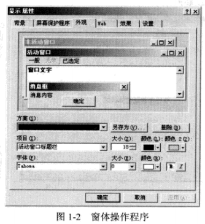

下面来建立本书第一个C#环境下的Windows应用程序。启动Visual Studio 2005，默认语言为C#语言，建立如图1-3所示的Windows应用程序。一般而言，用Visual C#开发应用程序包括建立项目、界面设计、属性设计和代码设计几个阶段。

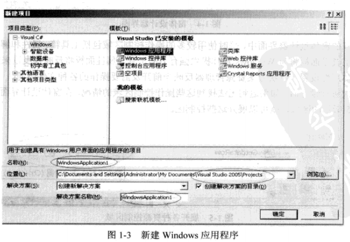

在建立新的应用程序时需定义项目的名称及具体的物理路径位置，单击“确定”按钮后Visual C#将自动创建一个新的默认窗体FORM1，窗体设计器界面如图1-4所示。

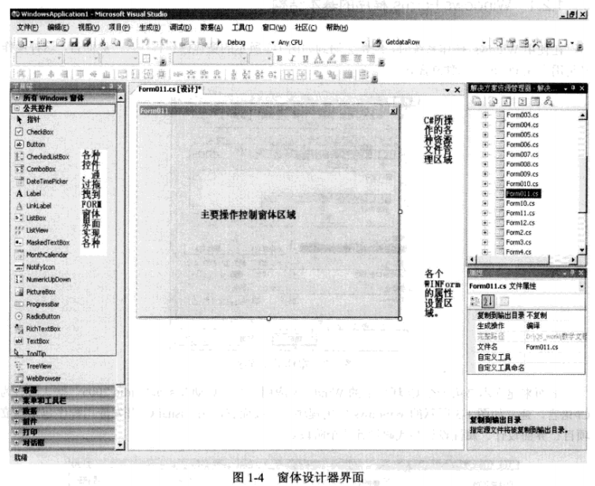

在展开的窗体设计器界面中，平时使用较多的操作控制区域包括工具箱、属性和解决方案资源管理器。工具箱面板将为Windows窗体提供强有力的工具，属性面板将反映拖拽过来的Windows控件的具体属性设置，解决方案资源管理器反映当前开发需要操作的各种文件资源。

在首次进行设计时，如果遇到无法找到这些操作控制区域的情况，在窗体设计界面的右上角选择如图1-5所示的区域，就可以展开这些控制区。

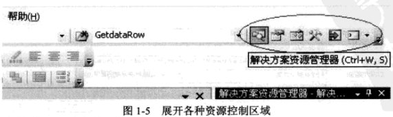

### 1.2.2 了解WinForm程序的代码结构

**1. 初始WinForm代码**

在图1-4所示的主要窗体控制区域中右击，在弹出的快捷菜单中选择“查看代码”命令，如图1-6所示，显示后台的C#代码。

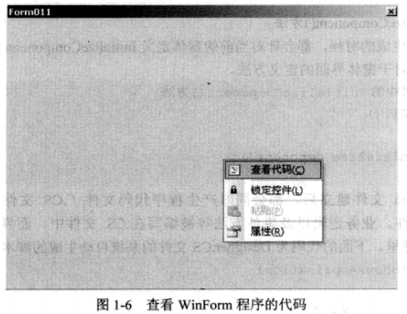

展开的代码如下，具体意义可参考每行的注释信息。

```C#
using System;//基础核心命名空间 
using System.Collections.Generic;//包含了ArrayList、BitArray、Hashtable、Stack、StringCollection和StringTable类
using System.ComponentModel;
using System.Data;//数据库访问控制
using System.Drawing;//绘图类
using System.Linq;
using System.Text;//文本类
using System.Threading.Tasks;
using System.Windows.Forms;//大量窗体和控件

namespace WindowsFormsApp1//当前操作的命名空间是WindowsApplication1
{
    public partial class Form1 : Form//从System.Windows.Forms.Form中派生
    {
        public Form1()
        {
            InitializeComponent();//注意该方法在下面的介绍
        }
    }
}

```


> **小知识：理解Using语句**
>
> Using语句通常出现在一个.cs文件的头部，用于定义引用系统命名空间，具体的操作方法和属性等被定义在该系统的命名控件中，比如如果不写using System.Drawing，则无法在后期开发中进行图形图像方面的设计开发。
>
> 另一方面，用户可以在一个用户自定义的命名空间下定义用户自定义类，这样在头部通过Using语句声明该用户自定义的命名空间，从而获取该命名空间下的具体类以及该类的属性和方法，达到对于系统软件分层开发的目的。

**2. 理解InitializeComponent()方法**

在每一个窗体生成的时候，都会针对当前的窗体定义InitializeComponent()方法，该方法实际上是由系统生成的对于窗体界面的定义方法。

```c#
//位于.cs文件中的InitializeComponent()方法
public Form1()
{
    InitializeComponent();//注意该方法在下面的介绍
}
```

在每一个Form文件建立后，都会同时产生程序代码文件（.CS文件）以及与之相匹配的.Designer.CS文件。业务逻辑以及事件方法等被编写在.CS文件中，而界面设计规则被封装在.Designer.CS文件里。下面的代码为.Designer.CS文件的系统自动生成的脚步代码。

```c#
namespace WindowsFormsApp1
{
    partial class Form1
    {
        /// <summary>
        /// 必需的设计器变量。
        /// </summary>
        private System.ComponentModel.IContainer components = null;

        /// <summary>
        /// 清理所有正在使用的资源。
        /// </summary>
        /// <param name="disposing">如果应释放托管资源，为 true；否则为 false。</param>
        protected override void Dispose(bool disposing)
        {
            if (disposing && (components != null))
            {
                components.Dispose();
            }
            base.Dispose(disposing);
        }

        #region Windows 窗体设计器生成的代码

        /// <summary>
        /// 设计器支持所需的方法 - 不要修改
        /// 使用代码编辑器修改此方法的内容。
        /// </summary>
        private void InitializeComponent()
        {
            this.components = new System.ComponentModel.Container();
            this.AutoScaleMode = System.Windows.Forms.AutoScaleMode.Font;
            this.ClientSize = new System.Drawing.Size(800, 450);
            this.Text = "Form1";
        }

        #endregion
    }
}


```

在代码中，可以很容易发现InitializeComponent()方法和Dispose()方法，前者为界面设计的编写内容，后者为表单释放系统资源时的执行编码。

**3. 创建WinForm应用程序的入口点**

在WinForm应用程序的开发设计中，一般会通过多窗体协调一致的处理具体业务流程。这种应用必须由程序员决定哪个WinForm的窗体第一个被触发执行：在Windows Forms开发程序设计中则由位于根目录下的Program.cs文件决定。展开Program.cs文件，按照下面代码即可决定哪个WinForm的表单第一个被触发执行。

## 1.3 WinForm中的常用控件

**学习目标**

* System.Windows.Forms.Control的基本结构
* 基本控件（如标签、文本、按钮、列表框和组合框）的使用
* 掌握窗体的常用属性和方法
* 进行基本控件的开发设计
* 深入掌握系统对话框的属性及代码开发
* 掌握模式对话与非模式对话的概念及差异
* 了解模式对话的开发机理

### 1.3.1 简介

WinForm中的常用控件来自于系统System.Windows.Forms.Control，该内裤来自System.Windows.Forms命名空间，该命名空间提供各种控件类，使用这些控件类可以创建丰富的用户界面，具体实现功能由位于该命名空间下的Control系统类派生。Control类将为Form中显示的所有控件提供基本功能，Form类表示应用程序内的窗口，包括对话框、无模式窗口和多文档界面（MDI）客户端窗口及父窗口，同时也可以通过从UserControl类派生而创建自己的控件。

上述所有的这些可视化界面组件统一称之为控件，这些控件都源于System.Windows.Forms命名空间，该命名空间的结构如图1-7所示。

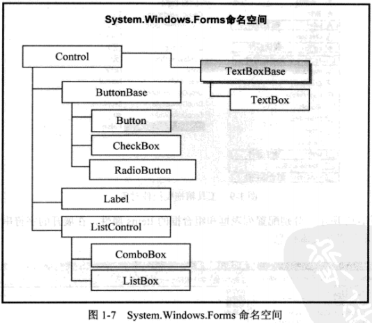

**案例学习：建立第一个WinForm应用——员工信息录入功能**

本次实验的目标是快速建立如图1-8所示的员工信息录入窗体，使读者快速掌握WinForm中的常用控件，包括标签控件、文本框控件、按钮控件和组合框、列表框控件。

实验步骤如下：

（1）如图1-9所示，从工具箱中拖拽具体的控件到Form窗体上，并更改标签对象和男的text属性为图1-8所示内容。将文本框、列表框和组合框的Enabled属性设置为False，即设置这些控件为不可用状态。

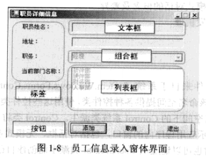

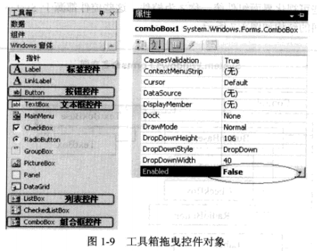

（2）如图1-10所示，分别配置列表框和组合框的Items属性，在展开的字符串集合编辑器内输入图1-10所示的具体文本信息。

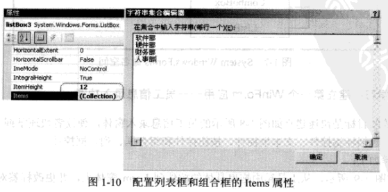

（3）双击“添加”按钮，进入.cs文件编辑状态，准备进行开发。下面是”添加“、”取消“和”关闭“按钮的鼠标单击事件的详细代码。

```c#
/// <summary>
/// "添加"功能源代码
/// </summary>
/// <param name="sender"></param>
/// <param name="e"></param>
private void Button1_Click(object sender, EventArgs e)
{
    textBox1.Enabled = true;
    textBox2.Enabled = true;
    listBox1.Enabled = true;
    comboBox1.Enabled = true;//设置所有代码为可用状态
    comboBox1.SelectedIndex = 0;//设置组合框控件默认为第一个
    textBox1.Focus();//设置第一个文本框后的焦点
}

/// <summary>
/// "取消"功能源代码
/// </summary>
/// <param name="sender"></param>
/// <param name="e"></param>
private void Button2_Click(object sender, EventArgs e)
{
    textBox1.Enabled = false;
    textBox2.Enabled = false;
    listBox1.Enabled = false;
    comboBox1.Enabled = false;//设置所有代码为不可用状态
}

/// <summary>
/// "关闭"功能源代码
/// </summary>
/// <param name="sender"></param>
/// <param name="e"></param>
private void Button3_Click(object sender, EventArgs e)
{
    Application.Exit();
    //通知所有消息泵必须终止，并且在处理消息后关闭所有应用程序窗口
}
```

> **问题讨论：使用Application.Exit()还是Form.Close()呢？**
>
> 不论是Application.Exit()，还是Form.Close()，都可以起到关闭当前窗体的作用，但是初学者需要了解这两种方法的差异。
>
> 一个完整的WinForm程序从Application.Run(new Form1)开始，到Application.Exit()结束，最终将执行销毁窗体和回收系统所有的资源任务，软件系统停止；而Form.close()只是关闭当前窗口和对话任务，整体程序不退出。如果只打开了一个窗体，那么这两种方案是一致的。
>
> 一般而言，如果只有一个窗口或者是MDI（多文档窗体）里面的主窗口，则执行操作为退出操作，此时Form.close()是一种安全的方式。但如果是打开多个文档窗口的情况，退出系统必须使用Application.Exit()方法。

### 1.3.2 基本控件的使用

**1. Label标签控件**

Label标签控件是使用频率最高的控件，主要用于显示窗体文本信息。其基本的属性和方法定义如表1-1所示。


**案例学习：标签控件的隐藏，窗口的打开与关闭**

本次实验的目的是建立两个窗体，当单击图1-11所示的登录系统时，可以打开另一个窗体，在单击“文字打开”后显示学校名称，单击“文字隐藏”后隐藏学校名称。通过本案例，读者能快速掌握窗体的打开和关闭技巧，以及标签的隐藏方法。

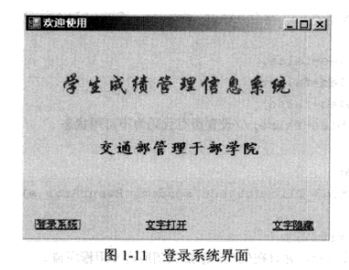

实验步骤如下：

（1）从工具箱中拖拽标签控件和linkLabel超链接文本控件到Form窗体上，更改标签文本的颜色、字体和大小属性，填写每个控件的Text属性（文字内容），达到图1-11所示效果。再建立Form2窗体，以便在单击“登录系统”后可以将其打开。

（2）双击“登录系统”超链接文本，进入.cs文件编辑状态，准备进行开发。

```c#
/// <summary>
/// 打开新窗口
/// </summary>
/// <param name="sender"></param>
/// <param name="e"></param>
private void LinkLabel1_LinkClicked(object sender, LinkLabelLinkClickedEventArgs e)
{
    linkLabel1.LinkVisited = true;//确认超文本文件链接是按照链接后的样式呈现
    Form2 newForm = new Form2();//实例化Form2窗体，命名为newForm
    newForm.Show();//将实例化后的窗体打开
    this.Hide();//当前的窗体隐藏
}
/// <summary>
/// 文字打开
/// </summary>
/// <param name="sender"></param>
/// <param name="e"></param>
private void LinkLabel2_LinkClicked(object sender, LinkLabelLinkClickedEventArgs e)
{
    label2.Show();
}
/// <summary>
/// 文字隐藏
/// </summary>
/// <param name="sender"></param>
/// <param name="e"></param>
private void LinkLabel3_LinkClicked(object sender, LinkLabelLinkClickedEventArgs e)
{
    label2.Hide();
}
```

**2. TextBox文本框控件和Button按钮控件**

TextBox文本框控件是使用频度较高的控件，主要用于接收或显示用户文本信息。其基本的属性和方法定义如表1-2所示。

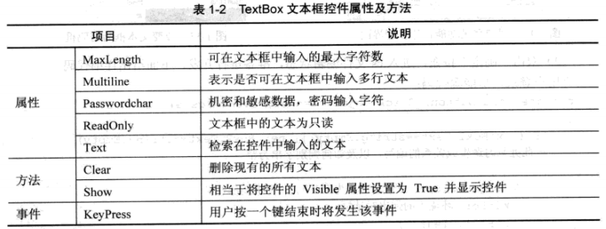

Button按钮控件主要接收用户功能确认操作，以期执行具体的触发事件。其基本的属性和方法定义如表1-3所示。

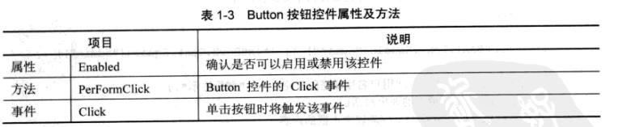

**案例学习：用户登录功能设计**

本次实验的目标是通过用户键入名称和密码，判别为非空之后，再判断是否符合系统规定的内容，无论成功或失败都提示用户操作结果。图1-12所示为目标界面。

实验步骤如下：

（1）从工具箱中拖拽标签控件、Button按钮控件以及在工具栏内容的容器中的groupBox控件到From窗体中，调整各个控件的基本属性以达到图1-12所示的效果。特别值得注意的是用户密码文本框的设置工作，其更改属性的办法如图1-13所示。


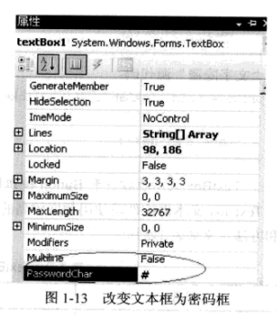

（2）双击“确定”按钮，进入.cs文件编辑状态，准备进行开发，下面给出详细代码。

```c#
/// <summary>
/// 用户登录
/// </summary>
/// <param name="sender"></param>
/// <param name="e"></param>
private void Button1_Click(object sender, EventArgs e)
{
    if (textBox1.Text == string.Empty || textBox2.Text == string.Empty)
    //此处复习逻辑或关系的编写，以及如何判别字符为空
    {
        MessageBox.Show("信息禁止为空！", "登录提示");
        //WinForm环境下的弹出对话框
        textBox1.Clear();
        textBox2.Clear();
        textBox2.Focus();
        //清空名称和密码文本框，并使名称文本框获得焦点
        return;
    }
    if (!textBox1.Text.Equals("admin") || !textBox2.Text.Equals("admin"))
    {
        MessageBox.Show("用户名称或密码为空！", "登录提示");
        //WinForm环境下的弹出对话框
        textBox1.Clear();//清理文本框的内容
        textBox2.Clear();
        textBox2.Focus();//清空名称和密码文本框，并使得名称文本框获得焦点
        return;
    }
    else
    {
        MessageBox.Show("欢迎您登录本系统！", "消息提示");
        //WinForm环境下的弹出对话框
        textBox1.Clear();
        textBox2.Clear();
        textBox2.Focus();
    }
}

/// <summary>
/// 取消
/// </summary>
/// <param name="sender"></param>
/// <param name="e"></param>
private void Button2_Click(object sender, EventArgs e)
{
    textBox1.Clear();
    textBox2.Clear();
    textBox2.Focus();//清空名称和密码文本框，并使名称文本框获得焦点
}
```

**问题讨论：代码是正确的，但是否是有效率的代码呢？**

具有相同功能的业务逻辑必须集中处理，只有这样才可以做到代码的高可维护性和高可用性。将上述功能为“清空名称和密码文本框，并使名称文本框获得焦点”的代码改为公用方法clear()，下面给出详细代码。

```c#
/// <summary>
/// 用户登录
/// </summary>
/// <param name="sender"></param>
/// <param name="e"></param>
private void Button1_Click(object sender, EventArgs e)
{
    if (textBox1.Text == string.Empty || textBox2.Text == string.Empty)
    //此处复习逻辑或关系的编写，以及如何判别字符为空
    {
        MessageBox.Show("信息禁止为空！", "登录提示");
        clear();
        return;
    }
    if (!textBox1.Text.Equals("admin") || !textBox2.Text.Equals("admin"))
    {
        MessageBox.Show("用户名称或密码为空！", "登录提示");
        clear();
        return;
    }
    else
    {
        MessageBox.Show("欢迎您登录本系统！", "消息提示");
        clear();
    }
}

private void clear()
//将具有共性的代码通过方法进行封装以提高执行效率
{
    textBox1.Clear();
    textBox2.Clear();
    textBox2.Focus();

}
```

**3. ListBox列表框控件**

ListBox列表框控件主要用于显示多行文本信息，以提供用户选择。其基本的属性和方法定义如表1-4所示。

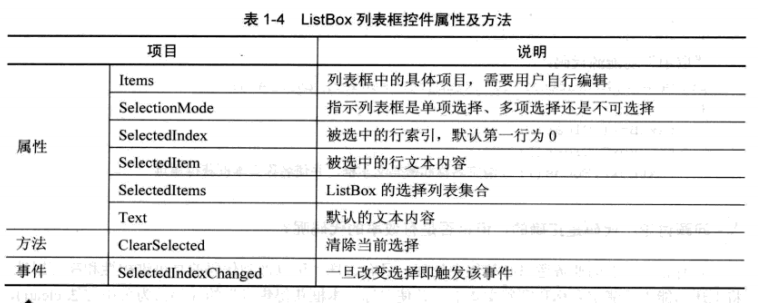

**案例学习：使用列表框控件**

本次实验的目标是在Form窗体上建立一个列表框控件，窗体初始化时加载信息到列表框中，当用户单击某一行列表框内的信息时，弹出对话框，显示该行具体的文本信息内容。图1-14所示为目标界面。

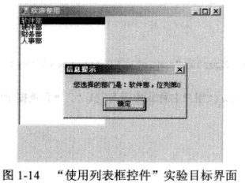

实验步骤如下：

（1）从工具箱中拖拽列表框ListBox控件到Form窗体上，调整控件的基本属性，以达到图1-14所示的效果。

（2）双击窗体界面，进入.cs文件编辑状态，准备进行开发。下面给出详细代码。

```c#
/// <summary>
/// 窗体初始化加载
/// </summary>
/// <param name="sender"></param>
/// <param name="e"></param>
private void Form1_Load(object sender, EventArgs e)
{
    this.listBox1.Items.Add("软件部");
    this.listBox1.Items.Add("硬件部");
    this.listBox1.Items.Add("财务部");
    this.listBox1.Items.Add("人事部");//通过Add方法实现对下拉列表控件的信息填充
}

/// <summary>
/// 单击ListBox的某行，获取该行信息
/// </summary>
/// <param name="sender"></param>
/// <param name="e"></param>
private void ListBox1_SelectedIndexChanged(object sender, EventArgs e)
{
    MessageBox.Show("您选择的部门是：" + listBox1.SelectedItem.ToString() + "，" +
        "位列第" + listBox1.SelectedIndex.ToString(), "信息提示");
    //注意学习：listBox的SelectedIndex属性代表选中的行数
    //注意学习：listBox的SelectedItem属性代表选中的行信息内容
}
```

**4. ComboBox组合框控件**

ComboBox组合框控件为典型的多选一控件，主要用于限制用户在多个固定信息情况下选择一一行的文本信息，以确认用户选择逻辑。其基本的属性和方法定义如表1-5所示。

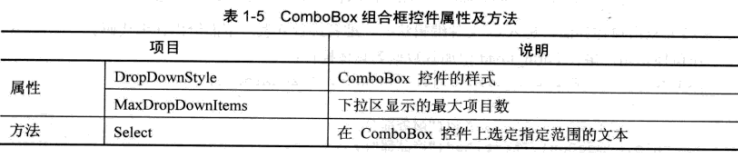

