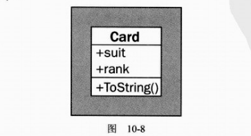
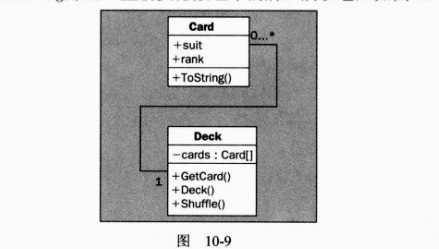
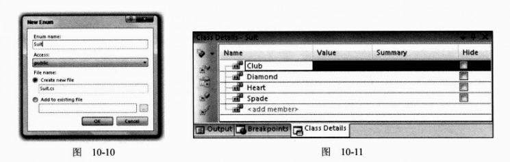
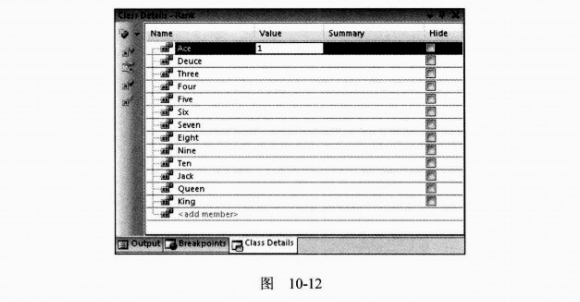
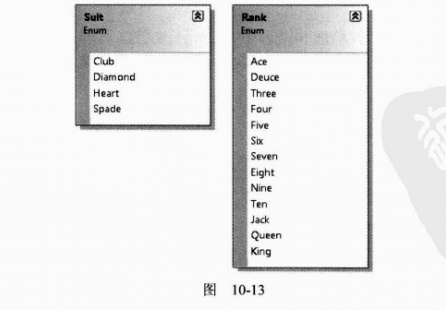
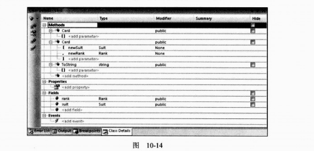
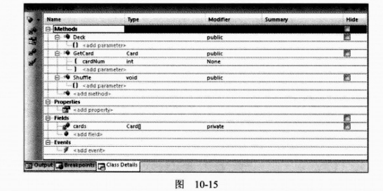
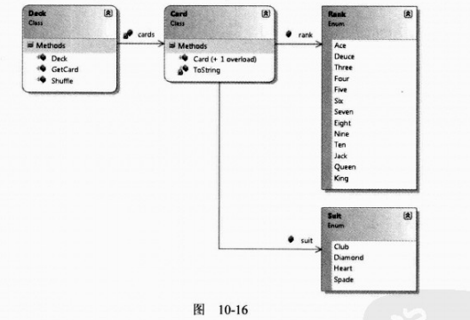
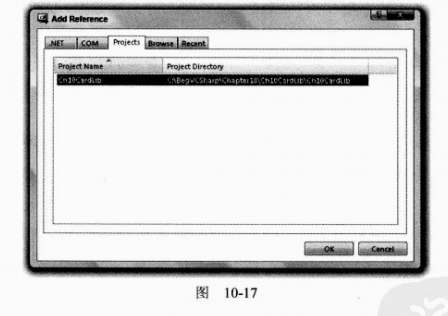
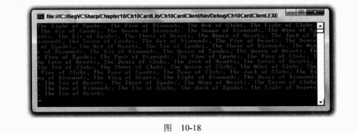

# 第10章 定义类成员

本章继续讨论在C#中如何定义类，主要介绍的是如何定义字段、属性和方法等类成员。首先介绍每组类型需要的代码，以及如何使用向导生成这段代码的结构。我们还将讨论如何通过编辑成员的属性，来快速修改这些成员。

在介绍完成员定义的基础知识后，将讨论一些比较高级的成员技术：隐藏基类成员、调用重写的基类成员、嵌套的类型定义和部分类定义。

最后，我们将理论付诸实践，创建一个类库，以便在后面的章节中使用它。

**本章的主要内容：**

* 了解字段、属性和方法等成员
* 创建一个类库

## 10.6 示例应用程序

为了解释前面使用的一些技术，下面开发一个类模块，以便在在后面的章节中使用。这个类模块包含两个类：

* Card——表示一张标准的扑克牌，包含梅花、方块、红心和黑桃，其顺序是从A到K。
* Deck——表示一副完整的52张扑克牌，在扑克牌中可以按照位置访问各张牌，并可以洗牌。

再开发一个简单的客户程序，确保程序正常工作，但在整个扑克牌应用程序中不使用扑克牌。

### 10.6.1 规划应用程序

**1. Card类**

Card类基本上是两个只读字段suit和rank的容。把字段指定为只读的原因是“空白”的牌是没有意义的，牌在创建好后也不能修改。为此，要把默认的构造函数指定为私有，并提供另一个构造函数，从给定的suit和rank中建立一副扑克牌。

此外，Card类要重写System.Object的ToString()方法，这样才能获得人们可以理解的字符串，以表示扑克牌。为使编码简单一些，为两个字段suit和rank提供枚举。

Card类如图10-8所示。



**2. Deck类**

Deck类包含52个Card对象。我们为这些对象使用一个简单的数组类型。这个数组不能直接访问，因为对Card对象的访问要通过GetCard()方法来实现，该方法返回指定下标的Card对象。这个类也有一个Shuffle()方法，重新安排数组中的牌，所以它应如图10-9所示。



### 10.6.2 编写类库

对于本例，假定读者对IDE比较熟悉，所以不再使用标准的“试试看”方式，不再显式地列出步骤。重要的是讨论代码，而不是介绍如何把代码输入到VS中，这可以使用前面许多示例中的步骤来实现。前面说过，这里要包含一些指针以确保不出问题。

类和枚举都包含在一个类库项目Ch10CardLib中。这个项目将包含4个.cs文件，Card.cs包含Card类的定义，Deck.cs包含Dock类的定义，Suit.cs和Rank.cs文件包含美剧。

可以使用VS的类图工具把许多代码组合在一起。

> **提示：**
>
> 如果使用的是VCE，没有类图工具，不必担心。下面各节都包含了类图生成的代码，所以读者可以完成本例。这个项目的代码在不同的IDE中并没有区别。

首先需要完成如下操作：

（1）在目录C:\BegVCSharp\Chapter10下创建一个新类库项目Ch10CardLib。

（2）从项目中删除Class.cs。

（3）在VS中，使用Solution Explorer窗口中打开项目的类图（必须选择项目，而不是选择解决方案，才能显示出类图图标）。类图开始时应为空白，因为项目不包含类。

> **注意：**
>
> 如果在这个视图中看到Resources和Settings类，可以右击它们，选择Remove from Diagram选项，隐藏它们。

**1. 添加Suit和Rank枚举**

把一个Enum从工具箱拖动到类图中，再在显示的对话框中填充，就可以添加一个枚举。例如，对于Suit枚举u，应在对话框中添加如图10-10所示的信息。

接着，使用Class Details窗口添加枚举的成员。需要添加的值如图10-11所示。



以相同的方式利用工具箱添加Rank枚举。Rank枚举需要的值如图10-12所示。



> **注意：**
>
> 第一个成员Ace的输入值为1，它会使枚举的底层存储匹配扑克的Rank，这样Six就存储为6。

完成了Suit和Rank的操作后，类图就如图10-13所示。



为这两个枚举生成的代码位于Suit.cs和Rank.cs文件中，如下所示：

```c#
using System;
using System.Collections.Generic;
using System.Linq;
using System.Text;
using System.Threading.Tasks;

namespace Ch10CardLib
{
    public enum Suit
    {
        Club,
        Diamond,
        Heart,
        Spade,
    }
}

```

```c#
using System;
using System.Collections.Generic;
using System.Linq;
using System.Text;
using System.Threading.Tasks;

namespace Ch10CardLib
{
    public enum Rank
    {
        Ace = -1,
        Deuce,
        Three,
        Four,
        Five,
        Six,
        Seven,
        Eight,
        Nine,
        Ten,
        Jack,
        Queen,
        King,
    }
}

```

如果使用的是VCE，就可以添加Suit.cs和Rank.cs文件，再手工输入这些代码。注意，代码生成器在最后一个枚举成员后添加的逗号不会妨碍编译，不会创建一个额外的空成员，但它们可能会带来混乱。 

**2. 添加Card类**

本节将使用类设计器和VS的代码编译器添加Card类，也可以仅使用VCE中的代码编辑器。使用类设计器添加类类似于添加枚举，也是把相应的项从工具箱拖动到类图中。这里要把Class拖动到类图中，并把新类命名为Card。

为了添加字段rank和suit，可以使用Class Details窗口添加字段，再使用Properties窗口把字段的Constant Kind设置为readonly。还需要添加两个构造函数，一个默认构造函数（私有），另一个构造函数带有两个参数：newSuit和newRank，其类型分别是Suit和Rank（公共）。最后，重写ToString()，这需要在Properties窗口中修改Inheritance Modifier，将它设置为override。

图10-14显示了Class Details窗口和已输入所有信息的Card类。



然后，需要修改Card.cs中类的代码（如果使用的是VCE，就应把这些代码添加到Ch10CardLib名称空间的新类Card中），如下所示：

```c#
using System;
using System.Collections.Generic;
using System.Linq;
using System.Text;
using System.Threading.Tasks;

namespace Ch10CardLib
{
    public class Card
    {
        public readonly Suit suit;
        public readonly Rank rank;

        public Card(Suit newSuit, Rank newRank)
        {
            suit = newSuit;
            rank = newRank;
        }

        public Card()
        {
        }

        public override string ToString()
        {
            return "The " + rank + " of " + suit + "s";
        }
    }
}

```

重写的ToString()方法把枚举值的字符串表示存储在返回的字符串中，非默认的构造函数初始化suit和rank字段的值。

**3. 添加Deck类**

Deck类需要使用类图定义的如下成员：

* Card[]类型的私有字段cards。
* 公共的默认构造函数。
* 公共方法GetCard()，它带有一个int参数cardNum，并返回一个Card类型的对象。
* 公共方法Shuffle()，它不带有参数，没有返回值。

添加了这些成员后，Deck类的Class Details窗口就如图10-15所示。



为了使类图更清晰，可以显示所添加的成员和类型之间的关系。在类图中依次右击下面的项，从菜单中选择Show as Association选项：

* Deck中的cards
* Card中的suit
* Card中的rank

完成后，类图如图10-16所示。



接着，修改Deck.cs中的代码（如果使用的是VCE，就必须先使用下面的代码添加这个类）。首先实现构造函数，它在cards字段中创建52张牌，并给它们赋值。对两个枚举的所有组合进行迭代，每次迭代都创建一张牌。这将使cards最初包含一个有序的扑克牌列表：

```c#
using System;
using System.Collections.Generic;
using System.Linq;
using System.Text;
using System.Threading.Tasks;

namespace Ch10CardLib
{
    public class Deck
    {
        private Card[] cards;

        public Deck()
        {
            cards = new Card[52];
            for (int suitVal = 0; suitVal < 4; suitVal++)
            {
                for (int rankVal = 1; rankVal < 14; rankVal++)
                {
                    cards[suitVal * 13 + rankVal - 1] =
                        new Card((Suit)suitVal, (Rank)rankVal);
                }
            }
        }
    }
}

```

然后，实现GetCard()方法，为指定的下标返回Card对象，或者以与前面相同的方式抛出一个异常：

```c#
public Card GetCard(int cardNum)
{
    if (cardNum >= 0 && cardNum <= 51)
    {
        return cards[cardNum];
    }
    else
    {
        throw (new System.ArgumentOutOfRangeException(
            "cardNum", cardNum, "Value must be between 0 and 51."
            ));
    }
}
```

最后，实现Shuffle()方法。这个方法创建一个临时的扑克牌数组，并把扑克牌从现有的cards数组随机复制到这个数组助攻你。这个函数的主体是一个从0~51的循坏，在每次循环时，都会使用.NET Framework中System.Random类的实例生成一个0~51之间的随机数。进行了实例化后，这个类的对象使用方法Next(X)生成0-X之间的一个随机数。有了一个随机数后，就可以使用它作为临时数组中Card对象的下标，以便复制cards数组中的扑克牌。

为了记录已赋值的扑克牌，我们还有一个bool变量的数组，在复制每张牌时，把该数组中的值指定为true。在生成随机数时，检查这个数组，看看是否已经把一张牌复制到临时数组中由随机数指定的位置上了，如果已经复制好了，就将生成另一个随机数。

这不是完成该任务的最高效的方式，因为生成的许多随机数都可能找不到空位置以复制扑克牌。但是，它仍能完成任务，而且很简单，因为C#代码执行得很快，我们几乎察觉不到延迟。

代码如下：

```c#
public void Shuffle()
{
    Card[] newDeck = new Card[52];
    bool[] assigned = new bool[52];
    Random sourceGen = new Random();
    for (int i = 0; i < 52; i++)
    {
        int destCard = 0;
        bool foundCard = false;
        while (foundCard == false)
        {
            destCard = sourceGen.Next(52);
            if (assigned[destCard] == false)
            {
                foundCard = true;
            }
        }
        assigned[destCard] = true;
        newDeck[destCard] = cards[i];
    }
}
```

这个方法的最后一行使用System.Array类（在创建数组时使用）的CopyTo()方法，把newDeck中的每张扑克牌复制到cards中。也就是说，我们使用同一个cards对象中的同一组Card对象，而不是创建新的实例。如果使用cards==newDeck，就会用另一个对象替代cards引用的对象实例。如果其他地方的代码仍保留对原cards实例的引用，就会出问题——不会洗牌。

至此，就完成了类库代码。

### 10.6.3 类库的客户应用程序

为了简单起见，可以在包含类库的解决方案中添加一个客户控制台应用程序。为此，只需在Solution Explorer窗口中右击解决方案，选择Add | New Project，新项目命名为Ch10CardClient。

为了在这个新的控制台应用程序项目中使用前面创建的类库，只需添加一个对类库项目Ch10CardLib的引用。一旦创建了控制台项目，就可以通过Add Reference对话框的Projects选项卡来添加引用，如图10-17所示。



选择项目，单击OK按钮，就添加了引用。

因为这个新项目是第二个创建的，所以还需要指定项目为解决方案的启动项目，即在单击运行按钮后，将执行这个项目。为此，在Solution Explorer窗口中右击该项目名，选择Set as StartUp Project菜单项。

然后需要添加使用新类的代码，这些代码不需要做什么特别的任务，所以添加下面的代码就可以：

```c#
using System;
using System.Collections.Generic;
using System.Linq;
using System.Text;
using System.Threading.Tasks;
using Ch10CardLib;

namespace Ch10CardClient
{
    class Program
    {
        static void Main(string[] args)
        {
            Deck myDeck = new Deck();
            myDeck.Shuffle();
            for (int i = 0; i < 52; i++)
            {
                Card tempCard = myDeck.GetCard(i);
                Console.Write(tempCard.ToString());
                if (i != 51)
                {
                    Console.Write(", ");
                }
                else
                {
                    Console.WriteLine();
                }
            }
            Console.ReadKey();
        }
    }
}

```

其结果如图10-18所示。



52张扑克牌是随机放置的。后面的章节将继续开发和使用这个类库。

## 10.7 小结

本章完成了定义基类的讨论。仍有许多内容没有包含进来，但前面涉及到的技术已经足够创建相当复杂的应用程序了。

本章介绍了如何定义字段、方法和属性，接着讨论了各种访问级别和修饰关键字。我们还介绍了把类组合在一起的快捷工具。

介绍过这些基本主题后，我们详细讨论了继承行为，主要内容是如何用new关键字隐藏不想要的继承成员，扩展基类成员，而不是用base关键字替代它们的执行代码。我们还讨论了嵌套的类定义。之后，详细研究了接口的定义和执行，包括显式和隐式执行的概念。学习了如何使用部分类和部分方法定义把定义放在多个代码文件中。

最后，我们开发和使用了一个表示扑克牌的简单类库，使用方便的类图工具使工作更容易完成。后面的章节还将进一步使用这个库。

本章学习了：

* 如何定义字段、方法和属性
* 讨论用于给类分组的工具
* 学习了继承行为的更多知识
* 了解了接口定义和实现的更多内容
* 部分类和部分方法的定义
* 创建和部署了一个简单的类库

第11章将介绍集合，这是类的一种类型，在开发过程中经常使用。

