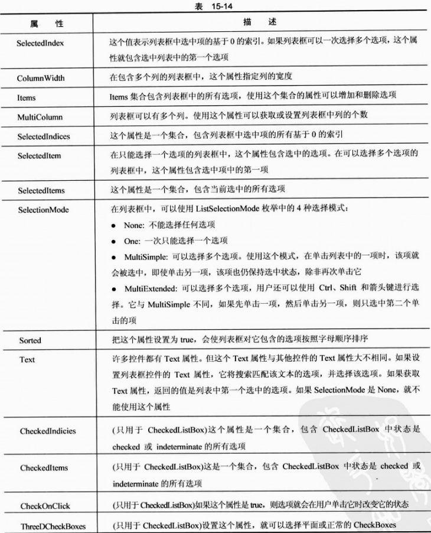
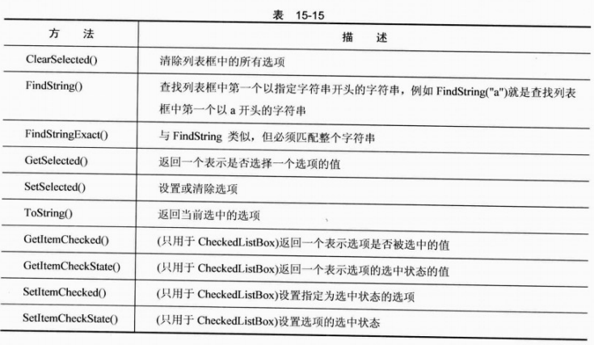
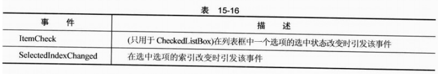

# 第15章 Windows编程基础

近10年来，Visual Basic允许程序员使用工具，通过直观的窗体设计器创建高质量的用户界面，其编程语言的易学易用，为快速开发应用程序提供了尽可能好的环境，所以赢得了广泛的好评。Visual Basic等快速应用程序开发（RAD）工具的一个优点是提供了许多预制控件，开发人员可以使用它们快速建立应用程序的用户界面。

开发大多数Visual Basic Windows应用程序的核心是窗体设计器。创建用户界面时，把控件从工具箱拖放到窗体上，把它们放在应用程序运行时需要的地方，再双击该控件，添加控件的处理程序。Microsoft提供的控件和花钱买来的定制控件，为程序员提供了空前巨大的重用代码池，以及仅通过鼠标单击就可以完成测试的代码。通过Visual Studio，这种应用程序开发模式现在也可以用于C#开发人员。

本章将使用Windows窗体，利用Visual Studio附带的许多控件。这些控件拥有各种功能，通过Visual Studio的设计功能，开发用户界面、处理用户的交互将非常简单、有趣。在本书全面介绍Visual Studio中的控件是不可能的，所以这里介绍最常用的控件，包括标签、文本框、列表视图、选项卡控件等。

**本章的主要内容：**

* Windows窗体设计器
* 向用户显示信息的控件，如Label和LinkLabel控件
* 触发事件的控件，如Button控件
* 允许应用程序的用户输入文本的控件，如TextBox控件
* 允许告诉用户应用程序当前状态、让用户修改状态的控件，如RadioButton和Check Button控件
* 允许显示信息列表的控件，如ListBox和ListView控件
* 允许把其他控件组合在一起的控件，如TabControl和GroupBox控件

## 15.7 ListBox和CheckedListBox控件

列表框用于显示一组字符串，可以一次从中选择一个或多个选项。与复选框和单选按钮一样，列表框也提供了要求用户选择一个或多个选项的方式。在设计期间，如果不知道用户要选择的数值个数，就应使用列表。（例如一起工作的工人列表框）。即使在设计期间知道所有可能的值，但列表中的值非常多，也应考虑使用列表框。

ListBox类派生于ListControl类。后者提供了.NET Framework内置列表类型控件的基本功能。

另一种类型的列表框成为CheckedListBox，派生于ListBox类。它提供的列表类似于ListBox，但除了文本字符串以外，每个列表选项还附带一个复选标记。

### 15.7.1 ListBox控件的属性

除非显式声明，表15-14中列出的所有属性都可用于ListBox类和CheckedListBox类。

### 15.7.2 ListBox控件的方法

为了高效地操作列表框，读者应了解它可以调用的一些方法。表15-15列出了最常用的方法。除非特别声明，否则这些方法均属于ListBox和CheckedListBox类。

### 15.7.3 ListBox控件的事件

正常情况下，在处理ListBox和CheckedListBox时，使用的事件都与用户选中的选项有关，如表15-16所示。

## 15.8 ListView控件

图15-19显示了Windows中最常用的ListView控件。

## 15.10 小结

本章介绍了创建Windows应用程序时最常用的一些控件，并讨论了如何使用它们创建简单而强大的用户界面。还论述了这些控件的属性和事件，给出了使用它们的示例，解释了如何为控件的特定事件添加处理程序。

本章讨论的控件包括：

* 使用Label和LinkedLabel用户显示信息
* 使用Button和相应的Click事件，让用户告诉应用程序他们要进行什么操作
* 使用TextBox和RichTextBox控件，让用户输入纯文本或格式化文本
* 区分CheckBox和RadioButton及其用法。还学习了如何把这两个控件组合到GroupBox控件中，以及这么做对控件有什么影响
* 使用CheckedListView提供列表，用户可以单击复选框，从该列表中选择选项。还学习了如何使用更常见的ListView控件，提供与CheckedListView控件类似的列表，但没有复选框。
* 使用ListBox和ImageList控件提供一个列表，让用户以不同的方式查看。
* 最后学习了如何使用TabControl把控件组合到同一个窗体的不同页面上，用户可以随意从这些页面上选择控件。

第16章将讨论更复杂的控件，以及创建Windows窗体应用程序的方式。

