# 第2章 编写C#程序

第1章用一定的篇幅讨论了C#是什么，它是如何适应.NET Framework的，现在就该编写一些代码了。本书主要使用Visual Studio 2008（VS）和Visual C# 2008 Express Edition（VCE），所以首先介绍这个开发环境的一些基础知识。

VS是一个非常复杂庞大的产品，可能会使初学者感到畏惧，但使用它创建简单的应用程序是非常容易的。在本章开始使用VS时，不需要了解许多知识，就可以编写C#代码。本书的后面将介绍VS能执行的更复杂的操作，现在仅介绍基础知识。

从VCE入手要简单得多。在本书的前面部分，所有的示例都是在这个IDE中编写。但是如果选择使用VS，所有的工作都或多或少地以相同的方式完成。因此，本章介绍这个两个IDE，先介绍VS。

介绍完了IDE后，将把两个简单的应用程序组合在一起。现在不要过多地考虑代码，只要应用程序可以运行即可。在这些早期的示例中熟悉了应用程序的创建过程，不久之后就会适应这个过程了。

下面要创建的第一个应用程序是一个简单的控制台应用程序。控制台应用程序没有使用图形化的Windows环境，所以不需要担心按钮、菜单、用鼠标指针进行的交互等，而是在一个命令行窗口中运行应用程序，用更简单的方式与它交互。

第二个应用程序是一个Windows Forms应用程序，其外观和操作方式对Windows用户来说会非常熟悉，而且该应该程序创建起来并不费力。但所需代码的语法比较复杂，尽管在许多情况下，并不需要考虑细节。

本书后面的两个部分也使用这两种应用程序类型，但开始时略微强调一下控制台应用程序。在学习C#语言时，不需要了解Windows应用程序的其他灵活性能。控制台应用程序的简单性可以让我们集中精力学习语法，而无需考虑应用程序的外观和操作方式。

**本章的主要内容：**

* Visual Studio 2008 和Visual C# 2008 Express Edition的基础知识
* 如何编写简单的控制台应用程序
* 如何编写Windows Form应用程序

## 2.1 开发环境

本节讨论VS和VCE开发环境，先介绍VS。这些环境是类似的，无论使用哪个IDE，都应了解这两个环境。

### 2.1.1 Visual Studio 2008 

VS在第一次加载时，会立即显示一系列窗口以及一组菜单和工具栏图标，其中的大多数窗口是空的。本书将使用大多数窗口，读者很快就会熟悉它们。

如果是第一次运行VS，则屏幕上会为用户显示一个参数列表，列出了这个开发环境的以前的版本，这里进行的选择会影响许多方面，例如，窗口的布局、控制台窗口运行的方式等。所以应选择Visual C# Development Settings，否则步骤就不像下面描述的这样呢。注意，可用选项会随着安装VS时选择的选项而变化，但只要选择安装C#，这个选项就是可用的。

如果不是第一次运行VS，但选择了另一个选项，不必惊慌。为了把设置重置为Visual C# Development Settings，只需导入它们即可。为此，单击Tools菜单上的Import and Export Settings选项，然后再选中Reset all settings单选按钮，如图2-1所示。

单击Next按钮，选择是否要在继续之前保存已有的设置。如果对设置进行了定制，就保存设置，否则就选择No按钮，再次单击Next按钮。在下一个对话框中，选择Visual C# Development settings选项，如图2-2所示。可用的选项可能会变化。

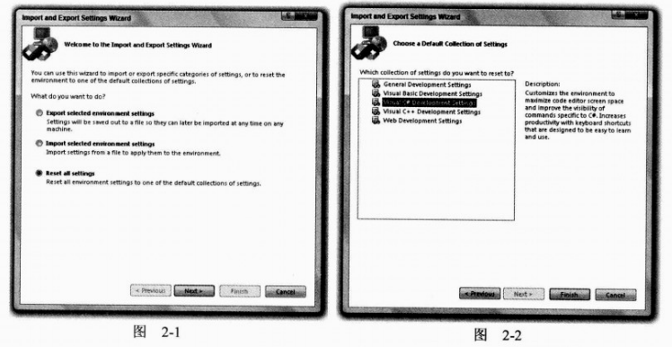

最后单击Finish按钮，应用设置。

VS环境布局是完全可定制的，但默认设置很适合我们。在C# Development Settings设置下，其布局如图2-3所示。

在VS启动时，主窗口会默认显示一个介绍性的Start Page，该主窗口还会显示所有的代码。这个窗口可以包含许多文档，每个文档都有一个标签，单击文件名，就可以在文件之间切换。这个窗口也具有其他功能呢：它可以显示图形用户界面，该界面可用于设计项目、纯文本文件、HTML以及各种内置于VS的工具。本书将陆续介绍它们。

在主窗口的上面，有工具栏和VS菜单。这里有几个不同的工具栏，其功能包括保存和加载文件，编译和运行项目，以及调试控件等。在需要使用这些工具栏时将会讨论它们。

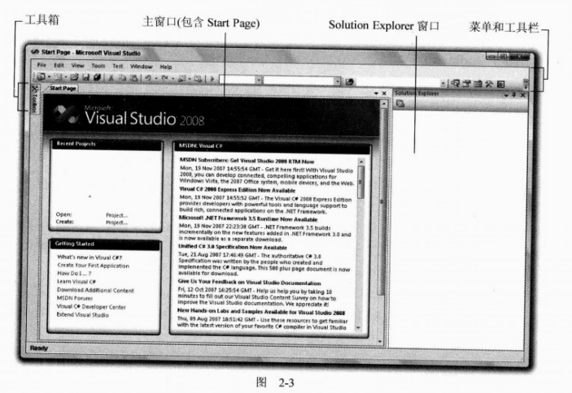

下面简要描述VS最常用的功能：

* 把鼠标指针放在Toolbox上，就会显示Toolbox工具栏，它们提供了Windows应用程序的用户界面构件。另一个标签Server Explorer也在这里显示（通过View | Server | Explorer 菜单项也可以选择它），它包含许多其他的功能，例如，访问数据源、服务器设置和服务等。
* Solution Explorer窗口显示当前加载的解决方案的信息。解决方案是包含一个或多个项目及其配置的Visual Studio术语。Solution Explorer窗口显示了解决方案中项目的各种视图，例如，项目中包含了什么文件，这些文件中又包含了什么内容。
* Solution Explorer窗口的下面可以显示Properties窗口，该窗口没有显示在图2-3中。稍后会看到这个窗口，因为它只在处理项目时才出现（也可以使用View | Properties Window菜单项切换它）。这个窗口提供了项目内容的更详细视图，可以进行单个元素的其他配置。例如，使用这个窗口可以改变Windows窗体中按钮的外观。
* 另一个非常重要的窗口也没有出现在图2-3中：Error List窗口。这个窗口可以使用View | Error List 菜单项打开，它显示了错误、警告和其他与项目有关的信息。这个窗口会持续不断地更新，但其中一些信息只有在编译项目时才出现。

这似乎要理解很多东西，但不必担心，并不需要太多的时间来习惯这些。下面首先建立第一个示例项目，它将使用上面介绍的许多VS元素。

> **注释：**
>
> VS还可以显示许多其他窗口，它们都包含许多信息，有许多功能。其中的一些窗口与上面提及的窗口在相同的位置上，使用标签可以切换它们。本书的后面会介绍其中的许多窗口，在详细介绍VS环境时，还会发现更多的窗口。

### 2.1.2 Visual C# 2008 Express Edition

使用VCE不必考虑设置的改变。显然，这个产品并不使用于VB编程，所以无需考虑相应的设置。第一次启动VCE时，会显示一个非常类似于VS的屏幕，如图2-4所示。

## 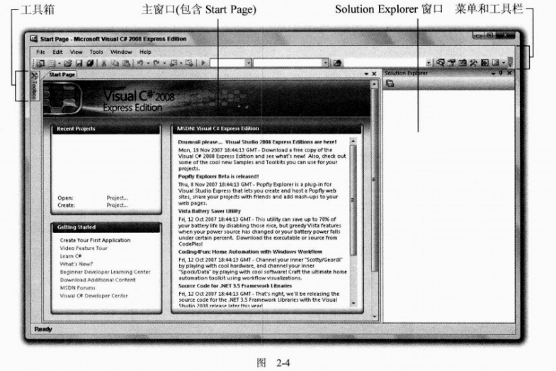2.2 控制台应用程序

本书将频繁使用控制台应用程序，特别是开始时要使用这类应用程序，所以下面创建一个简单的控制台应用程序。这个示例包含了用于VS和VCE的指令。

**试试看：创建一个简单的控制台应用程序**

（1）在VS中选择File | New | Project…菜单项，或者在VCE中选择File | New Project…，创建一个新的控制台应用程序项目，如图2-5所示。

（2）在VS显示窗口的Project Types窗格中选择Visual C#节点，在Templates窗格中选择Console Application项目类型，如图2-6所示。在VCE中，只需在Templates窗格中选择Console Application项目类型，如图2-7所示。在VS中把Location文本框改为C:\BegVCSharp\Chapter02（如果该目录不存在，会自动创建）。在VS和VCE中，Name文本框中的默认文本（Console Application）和其他设置不变，如图2-6所示。

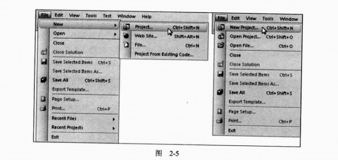

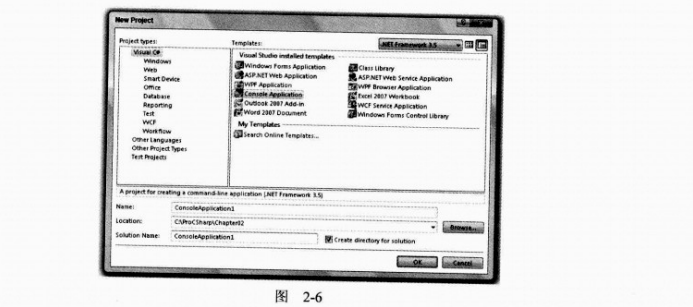

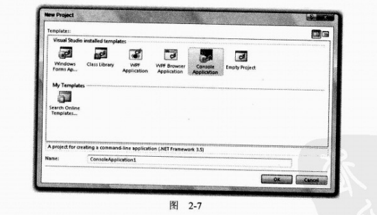

（3）单击OK按钮。

（4）如果使用的是VCE，在初始化项目后，单击工具栏上的Save All按钮或选择File菜单中的Save All 选项，将Location字段设置为C:\BegVCSharp\Chapter02，单击OK按钮。

（5）初始化项目后，在主窗口显示的文件里添加如下代码行：

```C#
using System;
using System.Collections.Generic;
using System.Linq;
using System.Text;
using System.Threading.Tasks;

namespace ConsoleApp1
{
    class Program
    {
        static void Main(string[] args)
        {
            // Output text to the screen.
            Console.WriteLine("The first app in Beginning C# Programming!");
            Console.ReadKey();
        }
    }
}

```

（6）选择Debug | Start Debugging菜单项。稍后就应得如图2-8所示的结果。

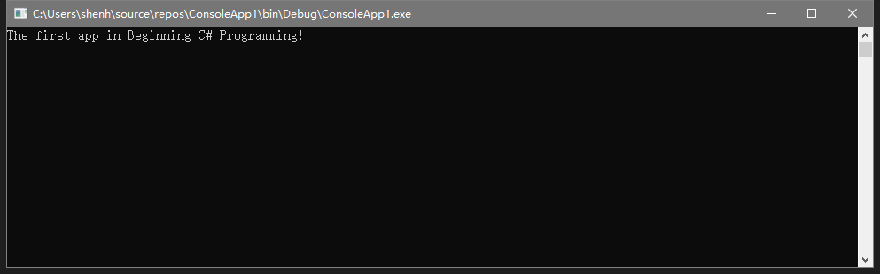

（7）按下任意按键，退出应用程序（首先需要单击控制台窗口，以激活它）。

只有像本章前面描述的那样应用了Visual C# Development Settings，才会出现上述显示。例如，若应用了Visual Basic Development Settings，就会显示一个空的控制台窗口，应用程序的结果显示在Immediate窗口中。在这种情况下，Console.ReadKey()代码也会失败，显示一个错误。如果遇到了这个问题，本书中所有实例的最佳解决方案是应用Visual C# Development Settings，这样读者看到的结果才会与书中显示的相同。如果问题没有解决，可以打开Tools | Options对话框，取消对Debuggin | Redirect all output to the Quick Console选项的选择，如图2-9所示。

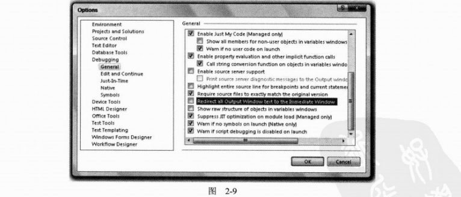

**示例的说明**

现在不仔细研究这个项目中使用的代码，而关心如何使用开发工具来启动和运行代码。可以看出，VS和VCE做了许多工作，大大简化了编译和执行代码的过程。执行这些简单的步骤还有多种方式。例如，创建一个新项目可以像前面那样使用File | New | Project…菜单项，也可以按下Ctrl+Shift+N组合键，还可以单击工具栏上相应的图标。

同样，代码也可以用多种方式编译和执行。上面使用的方法是选择Debug | Start Debugging菜单项，也可以按下一个快捷键（F5），或者使用工具栏中的图标。使用Debug | Start Without Debugging菜单项（也可以按下Ctrl+F5组合键）还可以以非调试模式运行代码，使用Build | Build Solution或F6可以编译项目但不允许它（打开或关闭调试功能）。注意，执行项目但不调试，或者编译项目可以使用工具栏中的图标进行，只是这些图标在默认情况下没有显示出来。编译好代码后，在Windows Explorer中运行生成的.exe文件，就可以执行代码。也可以在命令行提示窗口中执行，为此，应打开一个命令行提示窗口，把目录该为C:\BegVCSharp\Chapter02\ConsoleApplication\ConsoleApplication\bin\Debug\，输入ConsoleApplication，并按下回车键。

> **注释：**
>
> 在以后的示例中，我们仅说明“创建一个新的控制台项目”或“执行代码”，用户可以选择自己喜欢的方式执行这些步骤，除非特别声明，否则所有的代码都应在允许调试的情况下允许。另外，本书中的“启动”、“执行”和“运行“等术语都可以互换使用，示例后面的讨论总是假定已经退出了示例中的应用程序。

控制台应用程序会在执行完毕后立即中断，如果直接通过IDE运行它们，就无法看到运行的结果。为了解决上例中的这个问题，使用

```C#
Console.ReadKey();
```

告诉代码在结束前等待按键。后面的示例将多次使用这种技术。前面创建了一个项目，现在详细讨论开发环境中的各个组成部分。

### 2.2.1 Solution Explorer

首先要讨论的窗口是屏幕右上角的Solution Explorer，它在VS和VCE中是相同的（除非特别说明，否则本章列出的所有Solution Explorer窗口在VS和VCE中都是相同的）。这个窗口默认设置为自动隐藏，在该窗口可见时，单击其图钉图标可以把它停靠在屏幕的一条边上。Solution Explorer窗口与另一个有用的窗口Class View在相同的位置上，使用View | Class View菜单项就可以显示Class View窗口。图2-10显示了展开所有节点的这两个窗口（在窗口可见时，单击窗口底部的标签，就可以切换它们）。

Solution Explorer视图显示了组成ConsoleApplication项目的文件，包括我们在其中添加代码的文件Program.cs、另一个代码文件AssemblyInfo.cs和几个资源文件。

> **注意**
>
> *所有的C#文件都使用.cs扩展名*

AssemblyInfo.cs文件此时不需要考虑，它们包含项目中目前我们不需要关系的其他信息。

使用这个窗口可以改变主窗口中显示的代码，方法是双击.cs文件，或右击这些文件并选择View Code，或选中他们，单击窗口顶部的工具栏按钮。还可以对这些文件执行其他操作，例如，重新命名它们，或从项目中删除它们等。在该窗口中还可以显示其他类型的文件，例如，项目资源（资源是项目使用的文件，这些文件可能不是C#文件，如位图图像和声音文件等）。可以通过同一界面处理它们。

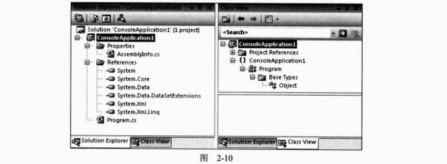

References项包含项目中使用的一个.NET库列表，这个列表在后面介绍，因为标准引用很适合于初学者。视图Class View显示了项目的另一种视图，可以用于查看刚才创建的代码结构。本书的后面将介绍代码结构，现在选择显示Solution Explorer视图。单击这些窗口中的文件或其他图标，Properties窗口的内容就会发生变化，如图2-11所示。

### 2.2.2 Properties窗口

使用View | Properties Windows菜单项就可以打开Properties窗口。这个窗口显示了在上述窗口中所选项目的其他信息。例如，选择项目中的Program.cs文件，就会显示如图2-11所示的视图。这个窗口还显示了其他选中项目的信息，例如，用户界面组件（常见本章的”Windows Forms应用程序“一节）。

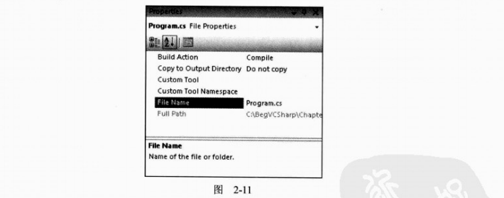

通常在Properties窗口中对项目的改变会直接影响代码，添加代码行，或改变文件中的内容。对于一些项目来说，通过这个窗口来操作与手动修改代码所花的时间时相同的。

### 2.2.3 Error List 窗口

当前Error List 窗口（View | Error List）没有显示什么有趣的信息，这是因为应用程序没有错误。但是这的确是一个非常有用的窗口。下面进行测试，从上一节添加的一行代码中删除分号。过一会儿，就会看到如图2-12所示的结果。

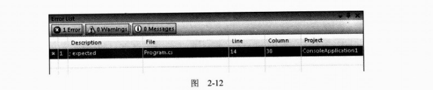

这次项目不会编译。

> **注意：**
>
> 第3章介绍C#语法后，你就会明白分号在大多数代码行的末尾，它是必不可少的。

这个窗口有助于根除代码中的错误，因为它会跟踪我们的工作，编译项目。如果双击该窗口中显示的错误，光标就会跳到源代码中出现错误的地方（如果包含错误的源文件没有打开，将被打开），这样就可以快速更正错误。代码中有错误的一行会出现红色的波浪线，便于我们快速扫描源代码，找出错误。

注意错误的位置用一个行号来指定。在默认情况下，行号不会显示在VS文本编辑器中，但有时需要显示它。为此，需要单击 Tools | Options菜单项，选中Options对话框中的Line numbers复选框。该复选框位于Text Editor | C# | General类别中，如图2-13所示。

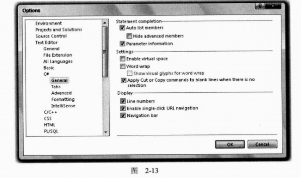

> **注意：**
>
> 在VCE中，必须选择Show All Settings才能使这个选项可用，选项列表与图2-13略有不同。

这个对话框中包含许多有用的选项，本书将使用其中的几个。

## 2.3 Windows Forms 应用程序

通常，把代码当作Windows应用程序的一部分来说明，要比通过控制台窗口或命令行提示简单一些。下面用用户界面构件来组合一个用户界面。

下面的示例介绍建立用户界面的基础知识，说明如何启动和运行Windows应用程序，但并不详细讨论应用程序实际完成的工作。本书的后面会详细研究Windows应用程序。

**试试看：创建一个简单的Windows应用程序**

（1）在以前的位置（C:\BegVCSharp\Chapter02，如果使用的是VCE，就在创建该项目后把它保存在这个位置）创建一个类型为Windows Forms Application（VS或VCE）的新项目，其默认名称是WindowsFormsApplication。如果使用的是VS，而第一个项目仍处于打开状态，则应选择Create new Solution选项，开始一个新解决方案，这些设置如图214和图2-15所示。

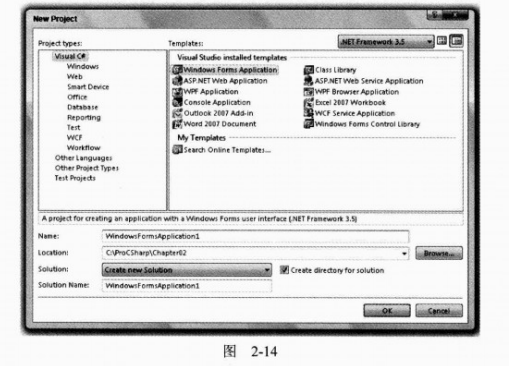

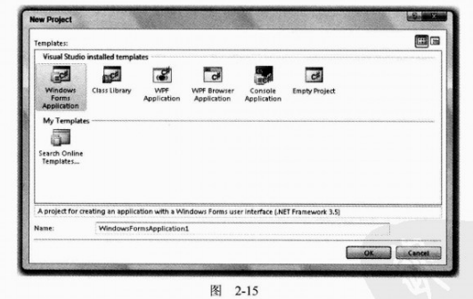

（2）单击OK按钮，创建项目后，应该会看到一个空白的Windows窗体。把鼠标指针移到屏幕左边的Toolbox栏上，然后移到All Windows Forms选项卡上的Buttion选项，在该选项上双击，就会在应用程序的主窗体（Form）上添加一个按钮。

（3）双击刚才添加到窗体中的按钮。

（4）现在应显示Form.cs中的C#代码。进行如下修改（为了简短起见，这里只显示了文件中的部分代码）：

```C#
private void Button1_Click(object sender, EventArgs e)
{
    MessageBox.Show("The first Windows app in the book!");
}
```

（5）运行应用程序。

（6）单击显示出来的按钮，打开一个消息对话框，如图2-16所示。

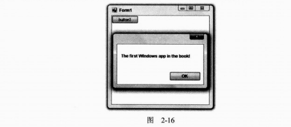

（7）像每个标准Windows应用程序那样，单击右上角的x图标，退出应用程序。

**示例的说明**

IDE又一次完成了许多工作，使我们能不费吹灰之力就可以完成一个实用的Windows应用程序的创建。刚才创建的应用程序与其他窗口的行为方式相同——可以移动、重新设置其大小、最小化等。我们不必编写任何代码，它就可以工作。我们添加的按钮也是这样。双击按钮，IDE就知道我们想添加一些代码，当运行应用程序时，用户单击该按钮，就执行我们编写好的代码。只要提供了这段代码，就可以得到按钮单击的所有功能。

当然，Windows应用程序不仅限于带有按钮的普通窗体。如果看看从中选择Button选项的工具栏，就会看到一整套用户界面构件，其中一些用户可能很熟悉。本书在其他地方将使用其中的大多数用户界面构件，它们使用起来都非常简单，可以节省许多时间和精力。

应用程序的代码在Form.cs中，看起来不必上一节提供的代码复杂多少，Solution Explorer窗口中其他文件的代码也不太复杂。开发环境生成的代码在默认情况下是隐藏的，它们都与窗体上控件的布局有关。这就是为什么可以在主窗口的设计视图中查看代码的原因，而设计视图正是这些布局代码的可视化转换。按钮就是可以使用的一种空间，同样，也可以使用Toolbox上Windows Forms部分中的其他UI构建。

下面把按钮作为一个空件示例，详细解释一下。使用主窗口中的标签，切换回窗体的Design View，单击按钮，选择它。此时，屏幕右下角的Properties窗口就会显示按钮控件的属性（控件的属性非常类似于上例中文件的属性），确保应用程序当前没有在运行，向下滚动到Text属性，它目前设置为button，把其值改为Click Me，如图2-17所示。

在Form中，按钮上的文本应反映这个变化。

这个按钮有许多属性，从按钮颜色和大小的简单格式化，到某些模糊设置（如数据绑定设置，它可以建立与数据库的链接），应有尽有。如上所述，改变属性通常会直接改变代码，这也不例外。但如果切换回Form.cs的代码视图，就会发现代码没有变化。

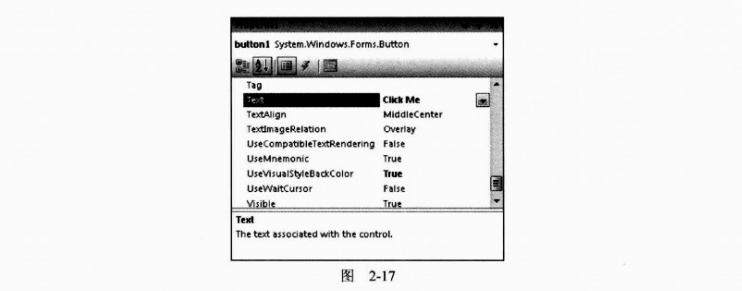

要查看修改过的代码，需要查看上面提及的隐藏文件。为了查看这个文件，需要在Solution Explorer窗口中扩展Form.cs节点。打开Form.Designer.cs节点，双击这个文件，就可以查看其中的内容。

匆匆一憋可能注意不到代码中哪些地方反映了按钮属性的改变，这是因为C#代码中处理窗体上控件的布局和格式化的部分被隐藏了（毕竟，如果有了结果的图形显示，就不需要查看代码了）。

VS和VCE使用代码突出显示系统来显示这部分C#代码，如图-18所示。

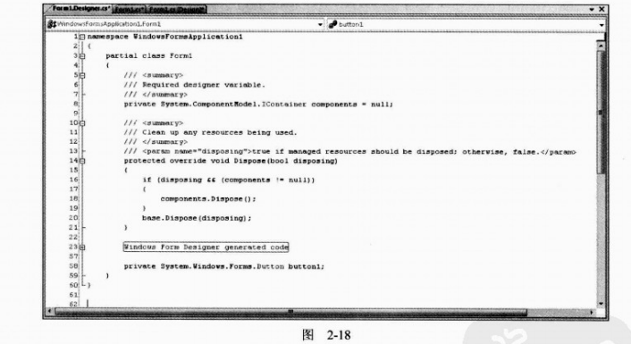

在代码的左边（如果已显示行号，就在行号的旁边），注意有一些灰色的线条，其上有+和-号的方框。这些方框可用于展开和折叠代码区域。在文件的底部，有一个带+号的方框，它对应代码主体中的“Windows Form Designer generated code”。这个标签的基本含义是“这里有一些VS生成的代码，用户不需知道”。如果愿意，可以查看改变按钮属性的代码。只要单击带有+号的方框，代码就会显示出来，在某处应该会看到如下代码：

```C#
this.button1.Text="Click Me";
```

不必过多地考虑这里使用的语法，我们可以看到在Properties窗口中输入的文本直接显示在代码中。

在编写代码时，这种突出显示代码的方式非常方便。我们可以扩展和折叠其他许多区域，而不仅仅是正常情况下隐藏的代码段。查看一本书的目录，有助于快速了解该书的内容：查看一组折叠的代码段，则非常便于浏览大量的C#代码。

## 2.4 小结

本章介绍了本书后面所使用的一些工具，快速浏览了Visual Studio 2008和Visual C# 2008 Express Edition开发环境，并使用它们建立了两种类型的应用程序。其中比较简单的是控制台应用程序，它足以满足我们的大多数需要，便于我们集中精力学习C#编程的基础知识。Windows应用程序比较复杂，但其可视化程度比较高，对于习惯了Windows环境的人来说，使用起来也比较直观。

知道如何创建简单的应用程序，就可以学习C#了。本书后面的章节将介绍C#的基本语法和程序结构，之后讨论更高级的面向对象方法。学习了这些内容后，就可以开始了解如何使用C#访问.NET Framework的功能了。

本章学习了：

* Visual Studio 2008 和 Visual C# 2008 Express Edition开发环境的工作原理
* 如何创建简单的控制台应用程序
* 如何启动和运行Windows应用程序

在后面的章节中，除非特别说明，否则指令都是针对VCE的，但如本章所述，这些指令很容易修改，以用于VS，读者可以使用自己喜欢的任何IDE。

