# 第3章 变量和表达式

要想高效地学习C#的用法，重要的是理解创建计算机程序时需要做什么。计算机程序最基本的描述也许是一系列处理数据的操作，即使是最复杂的示例，这个论述也正确，例如Microsoft Office套装软件子类的大型多功能的Windows应用程序。应用程序的用户虽然看不到它们，但这些操作总是在后台进行。

为了进一步解释它，考虑一下计算机的显示单元。我们常常比较熟悉屏幕上的内容，很难不把它想像为“移动的图片”。但实际上，我们看到的仅是一些数据的显示结果，其最初的形式是存储在计算机内存中的0和1数据流。因此我们在屏幕上进行的任何操作，无论是移动鼠标指针，单击图标，或在字处理器上输入文本，都会改变内存中的数据。

当然，还可以利用一些较简单的情形来说明这一点。如果使用计算器应用程序，就要提供数字，对这些数字执行操作，就像用纸和笔计算数字一样，但使用程序会快得多。

如果计算机程序是在对数据执行操作，则说明我们需要以某种方式来存储数据，需要某些方法来处理它们。这两种功能是由变量和表达式提供的，本章将探究它们的含义。

**本章的主要内容：**

* C#的基本语法
* 变量及其用法
* 表达式及其用法

在开始之前，应先了解一下C#编程的基本语法，因为我们需要一个环境来学习使用C#语言中的变量和表达式。

## 3.1 C#的基本语法

C#代码的外观和操作方式与C++和Java非常类似。初看起来，其语法可能比较混乱，不像书面英语和其他语言。但是，在C#编程中，使用的样式是比较清晰的，不用花太多的力气就可以编写出可读性很强的代码。

与其他语言的编译器不同，无论代码中是否有空格、回车符或tab支付（这些字符统称为空白字符），C#编译器都不考虑这些字符。这样格式化代码时就有很大的自由度，但遵循某些规则将有助于阅读代码。

C#代码由一系列语句组成，每个语句都用一个分号来结束。因为空格被忽略，所以一行可以有多个语句，但从可读性的角度来看，通常在分号的后面加上回车符，这样就不能在一行上放置多个语句了。但一句代码放在多个行上是可以的（也比较常见）。

C#是一种块结构的语言，所有的语句都是代码块的一部分。这些块用花括号来界定（“{”和“}”），代码块可以包含任意多行语句，或者根本不包含语句。注意花括号字符不需要附带分号。

所以，简单的C#代码块如下所示：

```c#
{
    <code line 1, statement 1>;
    <code line 2, statement 2>;
    <code line 3, statement 2>;
}
```

其中<code line x, statement y>部分并不是真正的C#代码，而是用这个文本作为C#语句的占位符。在这段代码中，第2、3行代码是同一个语句的一部分，因为在第2行的末尾没有分号。

在这个简单的代码块中，还使用了缩进格式，使C#代码的可读性更高。这是一个标准规则，实际上在默认情况下VS会自动缩进代码。一般情况下，每个代码块都有自己的缩进级别，即它向右缩进了多少个。代码块可以互相嵌套（即块中可以包含其他块），而被嵌套的块要缩进得多一些。

```c#
{
    <code line 1>;
    {
        <code line 2>;
        <code line 3>;
    }
    <code line 4>;
}
```

前面代码的续行通常也要缩进得多一些，如上面第一个示例中的第3行代码所示。

> **注释：**
>
> 在能通过Tools | Options访问的VCE Options对话框中，显示了VCE用于格式化代码的规则。在Text Editior | C# | Formatting 节点的子目录下，包含了完整的格式化规则。此处的大多数设置都反映了还没有讲述的C#部分，但如果以后要修改设置，以更适合自己的个性化样式，就可以回过头来看看这些设置。在本书中，为了简洁起见，所有的代码段都使用默认设置来格式化。

当然，这种样式并不是强制的。但如果不使用它，读者在阅读本书时会很快陷入迷茫之中。

在C#代码中，另一个常见的语句是注释。注释并不是严格意义上的C#代码，但代码最好有注释。注释就是解释，即给代码添加描述性文本（用英语、法语、德语、外蒙古语等），编译器会忽略这些内容。在开始处理比较长的代码段时，注释可用于给正在进行的工作添加提示，例如“这行代码要求用户输入一个数字”，或“这段代码由Bob编写”。C#添加注释的方式有两种。可以在注释的开头和结尾放置标记，也可以使用一个标记，其含义是“这行代码的其余部分是注释”。在C#编译器忽略回车符的规则中，后者是一个例外，但这是一种特殊情况。

要使用第一种方式标记注释，可以在注释的开头加上“`/*`”，在末尾加上“`*/`"。这些注释符号可以在单独一行上，也可以在不同的行上，注释符号之间的所有内容都是注释。注释中唯一不能输入的是”`*/`“，因为它会被看作注释结束标记。所以下面的语句是正确的。

```c#
/* This is a commont */

/* And so...
				...is this! */
```

但下面的语句会产生错误：

```c#
/* Comments often end with "*/" characters */
```

注释结束符号后的内容（“`*/`”后面的字符）会被当作C#代码，因此产生错误。

另一个添加注释的方法是用“//”开始一个注释，在其后可以编写任何内容，只要这些内容在一行上即可。下面的语句是正确的：

```c#
// This is a different sort of comment.
```

但下面的语句会失败，因为第二行代码会解释为C#代码：

```c#
// So is this,
	but this bit isn't.
```

这类注释可用于语句的说明，因为它们都放在一行上：

```c#
<A statement>;			// Explanation of statement
```

前面说过有两种给C#代码添加注释的方法。但在C#中，还有第三类注释，严格地说，这是//语法的扩展。它们都是单行注释，用三个“/"符号来开头，而不是两个。

```C#
/// A special comment
```

在正常情况下，编译器会忽略它们，就像其他注释一样，但可以配置VS，在编译项目时，提取这些注释后面的文本，创建一个特殊格式的文本文件，该文件可用于创建文档说明书。具体内容见第31章。

特别要注意的一点是，C#代码是区分大小写的。与其他语言不同，必须使用正确的大小写形式输入代码，因为简单地用大写字母代替小写字母会中断项目的编译。看看下面这行代码，它在第2章的第一个示例中使用：

```c#
Console.WriteLine("The first app in Beginning C# Programing.");
```

C#编译器能理解这行代码，因为Console.WriteLine()命令的大小写形式是正确的。但是，下面的语句都不能工作：

```C#
console.WriteLine("The first app in Beginning C# Programming!");
CONSOLE.WRITELINE("The first app in Beginning C# Programming!");
COnsole.Writeline("The first app in Beginning C# Programming!");
```

这里使用的大小写形式是错误的，所以C#编译器不知道我们要做什么。幸好，VCE在代码的输入方面提供了许多帮助，在大多数情况下，它都知道（程序也知道）我们要做什么。在输入代码的过程中，VS会推荐用户可能要使用命名，并尽可能纠正大小写问题。

## 3.2 C#控制台应用程序的基本结构

下面看看第2章的控制台应用程序示例（ConsoleApplication），并研究一下它的结构。其代码如下所示：

```c#
using System;
using System.Collections.Generic;
using System.Linq;
using System.Text;
using System.Threading.Tasks;

namespace ConsoleApp2
{
    class Program
    {
        static void Main(string[] args)
        {
            // Output text to the screen.
            Console.WriteLine("The first app in Beginning C# Programming!");
            Console.ReadKey();
        }
    }
}

```

可以立即看出，上一节讨论的所有语法元素这里都有。其中有分号、花括号、注释和适当的缩进。

目前看来，这段代码中最重要的部分如下所示：

```c#
static void Main(string[] args)
{
    // Output text to the screen.
    Console.WriteLine("The first app in Beginning C# Programming!");
    Console.ReadKey();
}
```

在运行控制台应用程序时，就会运行这段代码，更准确地说，是运行花括号中的代码块。如前所述，注释行不做任何事情，包含它们只为了简洁而已。其他两行代码在控制台窗口中输出了一些文本，并等待一个响应。但目前我们还不需要关心它的具体机制。

这里要注意以下如何实现第2章介绍的代码突出显示功能，这对于Windows应用程序来说比较重要，因为它是一个非常有用的特性。要实现该功能，需要使用#region和#endregion关键字，来定义可以展开和折叠的代码区域的开头和结尾。例如，可以修改为ConsoleApplication生成的代码，如下所示：

```c#
#region Using directives
using System;
using System.Collections.Generic;
using System.Linq;
using System.Text;
using System.Threading.Tasks;
#endregion
```

这样就可以把这些代码行折叠为一行，以后要查看其细节时，可以再次展开它。这里包含的using语句和其下的namespace语句将在本章的后面解释。

> **注释：**
>
> 以#开头的任意关键字实际上都是一个预处理指令，严格地说并不是C#关键字。除了这里描述的#region和#endregion关键字之外，其他关键字都相当复杂，用法也比较专业。所以，这是一个读者通读全书后才能探究的主题。

现在不必考虑示例中的其他代码，因为本书前几章仅解释C#的基本语法，至于应用程序进行Console.WriteLine()调用的具体方式，则不在我们的考虑之列。以后会阐述这些代码的重要性。

## 3.3 变量

如前所述，变量关系到数据的存储。实际上，可以把计算机内存中的变量看作架子上的盒子。在这些盒子中，可以放入一些东西，再把它们取出，或者只是看看盒子里是否有东西。变量也是这样，数据可放在变量中，可以从变量中取出数据或查看它们。

尽管计算机中的所有数据都是相同的东西（一组0和1），但变量有不同的内涵，称为类型。下面再使用盒子来类比，盒子有不同的形状和尺寸，某些东西只能放在特定的盒子中。建立这个类型系统的原因是，不同类型的数据需要用不同的方法来处理。变量限定为不同的类型，可以避免混淆它们。例如，组成数字图片的0和1序列与组成声音文件的0和1序列，其处理方式是不同的。

要使用变量，需要声明它们。即给变量指定名称和类型。声明了变量后，就可以把它们用作存储单元，存储声明的数据类型的数据。

声明变量的C#语法是，指定类型和变量名，如下所示：

```c#
<type> <name>;
```

如果使用未声明的变量，代码就不会编译，但此时编译器会告诉我们出现了什么问题，所以这不是一个灾难性错误。另外，使用未赋值的变量也会产生一个错误，编译器会检测出这个错误。

可以使用的变量类型是无限多的。其原因是可以自己定义类型，存储各种复杂的数据。尽管如何，总有一些数据类型是每个人都要使用的，例如，存储数值的变量。因此，我们应了解一些简单的预定义类型。

### 3.3.1 简单类型

简单类型就是组成应用程序中基本组成部件的类型，例如，数值和布尔值（true或false）。简单类型与复杂类型不同，不能有子类型或熟悉。大多数简单类型都是存储数值的，初看起来有点奇怪，肯定只需要一种类型来存储数值吗？

数值类型过多的原因是在计算机内存中，把数字作为一系列的0和1来存储的机制。对于整数值，用一定的位（单个数字，可以是0或1）来存储，用二进制格式表示。以N位来存储的变量可以表示任何介于0到（2^N-1)之间的数。大于这个值的数因为太大，所以不能存储在这个变量中。

例如，有一个变量存储了2位，在整数和表示该整数的位之间的映射应如下所示：

```C#
0 = 00
1 = 01
2 = 10
3 = 11
```

如果要存储更大的数，就需要更多的位（例如，3位可以存储0~7的数）。

这个论点的结论是要存储每个可以想像得到的数，就需要非常多的为，这并不适合PC。即使可以用足够多的位来表示每一个数，变量使用这些位来存储它，其效率也非常低下，例如，只需要存储从0~·10之间的数（因为存储器被浪费了）。其实4位就足够了。可以用相同的内存空间存储这个范围内的更多数值。

相反，许多不同的整数类型可以用于存储不同范围的数值，占用不同的内存空间（至多64位），这些类型如表3-1所示。

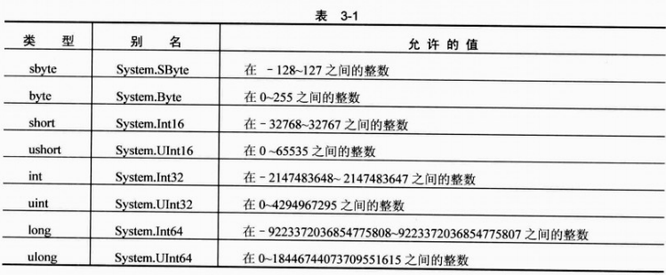

> **注意：**
>
> 这些类型中的每一种都利用了.NET Framework中定义的标准类型。如第1章所述，使用标准类型可以在语言之间交互操作。在C#中这些类型的名称是Framework中定义的别名，表3-1列出了这些类型在.NET Framework库中的名称。

一些变量名称前面的“u”是unsigned的缩写，表示不能在这些类型的变量中存储负号，参见该表中的“允许的值”一列。

当然，还需要存储浮点数，它们不是整数。可以使用的浮点数变量类型有3中：float、double和decimal。前两种可以用+/- mx2的形式存储浮点数，m和e的值随着类型的不同而不同。Decimal使用另一种形式：+/- mx10^e。这3种类型、其m和e的值，以及它们在实数中的上下限如表3-2所示。

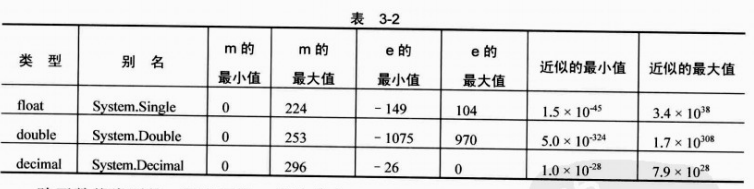

除了数值类型外，还有另外3种简单类型，如表3-3所示。

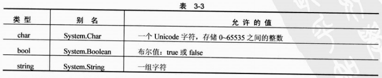

注意组成string的字符数没有上限，因为它可以使用可变大小的内存。

布尔类型bool是C#最常见的一种变量类型，类似的类型在其他语言的代码中非常丰富。当编写应用程序的逻辑流程时，一个可以是true或false的变量有非常重要的分支作用。例如，考虑一下有多少问题可以用true或false（或yes和no）来回答。执行变量值之间的比较或检查输入的有效性就是后面使用布尔变量的两个编程示例。

介绍了这些类型后，下面用一个小示例来声明和使用它们。在下面的示例中，要使用一些简单的代码来声明两个变量，给它们赋值，再输出这些值。

**试试看：使用简单类型的变量**

（1）在目录C:\BegVCSharp\Chapter03下创建一个新的控制台应用程序Ch03Ex01。

（2）给Program.cs添加如下代码：

```c#
static void Main(string[] args)
{
    int myInteger;
    string myString;
    myInteger = 17;
    myString = "\"myInteger\" is";
    Console.WriteLine("{0} {1}.", myString, myInteger);
    Console.ReadKey();
}
```

（3）运行代码，结果如图3-1所示。

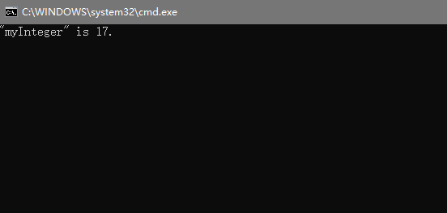

**示例的说明**

我们添加的代码完成了以下3项任务：

* 声明两个变量
* 给这两个变量赋值
* 将两个变量的值输出到控制台上

变量声明使用下述代码：

```c#
int myInteger;
string myString;
```

第一行声明一个类型为int的变量myInteger，第二行声明一个类型为string的变量myString。

> **提示：**
>
> 变量的命名是有限制的，不能使用任意的字符序列。本节的后面将介绍变量的命名规则。

接下来的两行代码给变量赋值：

```c#
myInteger = 17;
myString = "\"myInteger\" is";
```

使用=赋值运算符（在本章的“表达式”一节中将详细介绍）给变量分配两个固定的值（在代码中称为字面值）。把整数值17赋给myInteger，把字符串“myInteger”（包括引号）赋给myString。以这种方式给字符串赋予字面值时，必须用双引号把字符串括起来。因此，如果字符串本身包含双引号，就会出现错误，必须用一些表示这些引号字符的其他字符（即转义序列）来替代它们。在本例中，使用序列\”来转义双引号：

```c#
myString = "\"myInteger\" is";
```

如果不使用这些转义序列，而输入如下代码：

```c#
myString = ""myInteger" is";
```

就会出现编译错误。

注意给字符串赋予字面值时，必须小心换行——C#编译器会拒绝分布在多行上的字符串字面值。如果要添加一个换行符，可以在字符串中使用回车换行符的转义序列，即\n。例如，赋值语句：

```c#
myString = "This string has a\nline break.";
```

会在控制台视图中显示两行代码，如下所示：

```c#
This string has a 
line break.
```

所有的转义序列都包含一个反斜杠符号，后跟一个字符组合（详见后面的内容），因为反斜杠符号的这种用途，它本身也有一个转义序列，即两个连续的反斜杠`\\` 。

下面继续解释代码，还有一行没有说明：

```c#
Console.WriteLine("{0} {1}.", myString, myInteger);
```

它看起来类似于第一个示例中把文本写到控制台上的简单方法，但本例指定了变量。这里不打算详细讨论这行代码。这是本书第1部分用于给控制台窗口输出文本的一种技巧，知道这一点就足够了。在括号中，有如下两类参数：

* 一个字符串
* 一个用逗号分隔的变量列表，这些变量的值将插入到输出字符串中

输出的字符串是“{0} {1}."，它们并没有包含有用的文本。可以看出，这并不是我们运行代码时希望看到的结果，其原因是：字符串实际上是插入变量内容的一个模版，字符串中的每队花括号都是一个占位符，包含列表中每个变量的内容。

每个占位符（或格式字符串）用包含在花括号中的一个整数来表示。整整以0开始，每次递增1，占位符的总数应等于列表中指定的变量数，该列表用逗号分隔开，跟在字符串后。把文本输出到控制台时，每个占位符就会用每个变量的值来替代。在上面的示例中，{0}用第一个变量的值myString替换，{1}用myInteger的内容来替换。

在后面的示例中，就使用这种给控制台输出文本的方式显示代码的输出结果。最后一行代码在前面的示例中也出现过，用于在程序结束前等待用户输入：

```c#
Console.ReadKey();
```

这里不详细探讨这行代码，但后面的示例会常常用到它。现在只需要知道，它暂停代码的执行，等待用户按下一个键。

### 3.3.2 变量的命名

如上一节所述，不能把任意序列的字符作为变量名。这并不像第一次听起来那样需要担心什么，因为这种命名系统仍是非常灵活的。

基本的常量命名规则如下：

* 变量名的第一个字符必须是字母、下划线（_)或@。
* 其后的字符可以是字母、下划线或数字。

另外，有一些关键字对于C#编译器而言有特定的含义，例如前面出现的using和namespace关键字。如果错误地使用其中一个关键字，编译器会产生一个错误，我们马上就会知道出错了，所以不必担心。

例如，下面的变量名是正确的：

```
myBlgVar
VAR1
_test
```

下列变量名不正确：

```
99BottlesOfBeer
namespace
It's-All-Over
```

记住，C#是区分大小写的，所以必须小心，不要忘了在声明变量时使用正确的大小写。在程序中引用它们时，即使只有一个字母的大小写形式出错，都不能编译成功。其进一步的结果是得到多个变量，其名称仅有大小写的区别，例如，下面的变量都是不同的：

```
myVariable
MyVariable
MYVARIABLE
```

**命名约定**

变量名是比较常用的，所以有必要用一定的篇幅讨论几种要用到的变量名称。在开始前，要记住这是有争议的。多年以来，出现了不同的系统，一些开发人员拼命维护他们的个人系统。

最近，最流行的系统是所谓的Hungarian记号法。这个系统在所有的变量名上加上一个小写形式的前缀，表示其类型。例如，如果变量的类型是int，就在其名称前加上i（或n），如iAge。使用这个系统，很容易看出各个变量是什么类型的。

更现代的语言如C#则很难实现这个系统。与前面介绍的所有类型一样，可以用一两个字母前缀表示变量的类型。但由于可以创建自己的类型，而且在.NET Framework中有上百种更复杂的类型，所以这种系统很快就失效了。在多人完成的项目中，不同的人很容易遇到易混淆的不同前缀，它们可能导致灾难性的后果。

开发人员现在认识到，最好根据变量的作用来命名它们。如果出现问题，就很容易确定变量的类型。在VS和VCE中，只需把鼠标指针在变量名上停留足够长的时间，就会弹出一个方框，说明该变量的类型。

目前，在.NET Framework名称空间中有两种命名约定，称为PascalCase和camelCase。在名称中使用的大小写表示它们的用途。它们都应用到由多个单词组成的名称中，并指定名称中的每个单词除了第一个字母大写外，其余字母都是小写。在camelCasing中，还有一个规则，即第一个单词以小写字母开头。

下面是camelCase变量名：

```
age
firstName
timeOfDeath
```

下面是PascalCase变量名：

```
Age
LastName
WinterOfDiscontent
```

Microsoft建议：对于简单的变量，使用camelCase规则，而对于比较高级的命名则使用PascalCase。最后，注意许多以前的命名系统常常使用下划线字符作为变量名中各个单词之间的分隔符，如yet_another_variable。但这种用法现在已经淘汰了。

### 3.3.3 字面值

在前面的示例中，有两个字面值的示例：整数和字符串。其他变量类型也有相关的字面值，如表3-4所示。其中有许多涉及到后缀，即在字面值的后面添加一些字符，指定想要的类型。一些字面值有多种类型，在编译时由编译器根据它们的上下文确定其类型。

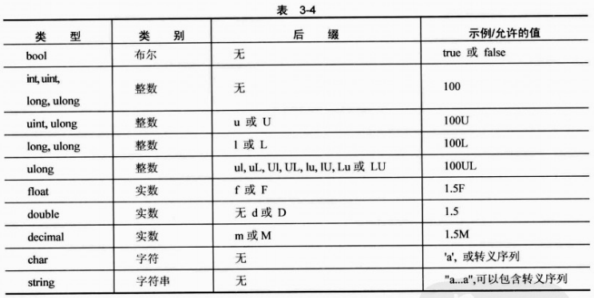

**字符串的字面值**

在本章的前面，介绍了几个可以在字符串的字面值中使用的转义序列，表3-5是这些转义序列的完整列表，以便以后引用。

表3-5中的“Unicode值”列是字符在Unicode字符集中的16进制值。与上面一样，使用Unicode转义序列可以指定Unicode字符，该转义序列包括标准的\字符，后跟一个u和一个4位十六进制值（例如，表3-5中x后面的4位数字）。

下面的字符串是等价的：

```
"Karli\'s string"
"Karli\u0027s string."
```

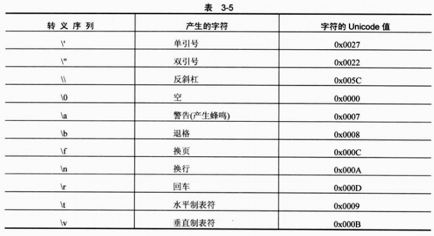

显然，Unicode转义序列还有更多的用途

也可以逐字地指定字符串， 即两个双引号之间的所有字符都包含在字符串中，包含行末字符和需要转义的字符串。唯一的例外是双引号字符的转义，它们必须指定，以避免结束字符串。为此，可以在该字符串的前面加一个@字符：

```
@"Verbatim string literal."
```

这个字符串可以用一般的方式制定，但需要使用下面这种方式：

```
@"A short list:
item 1
item 2"
```

逐字指定的字符串在文件名中非常有用，因为文件名中大量使用了反斜杠字符。如果使用一般的字符串，就必须在字符串中使用两个反斜杠，例如：

```
"C:\\Temp\\MyDir\\MyFile.doc"
```

而有了逐字指定的字符串字面值，这段代码的可读性就比较高。下面的字符串与上面的等价：

```
@"C:\Temp\MyDir\MyFile.doc"
```

> **注意**
>
> 从本书的后面可以看出，字符串是引用类型，而本章中的其他类型都是值类型。所以，字符串也可以被赋予null值，即字符串变量不引用字符串。

### 3.3.4 变量的声明和赋值

快速回忆一下，前面使用变量的类型和名称来声明它们，例如：

```
int age;
```

然后用=赋值运算符给变量赋值：

```
age = 25;
```

> **注意：**
>
> 变量在使用前，必须初始化。上面的赋值语句可以用作初始化语句。

这里还可以做两件事，用户可以在C#代码中看到。第一是同时声明多个类型相同的变量，方法是在类型的后面用逗号分隔变量名，如下所示：

```
int xSize, ySize;
```

其中xSize和ySize都声明为整数类型。

第二个技巧是在声明变量的同时为它们赋值，即把两行代码合并在一起：

```
int age = 25;
```

可以同时使用这两个技巧：

```
int xSize = 4, ySize = 5;
```

xSize 和 ySize被赋予不同的值：

注意下面的代码：

```
int xSize, ySize = 5;
```

其结果是ySize被初始化，而xSize仅进行了声明，在使用前仍需要初始化。

## 3.4 表达式

前面介绍了如何声明和初始化变量，下面该处理它们了。C#包含许多进行这类处理的运算符，包括前面已经使用过的=赋值运算符。把变量和字面值（在使用运算符时，它们都称为操作数）与运算符组合起来，就可以创建表达式，它是计算的基本建立块。

运算符的范围非常广泛，有简单的，也有非常复杂的，其中一些可能只在数学应用程序中使用。简单的操作包括所有的基本数学操作，例如+运算符是把两个操作数加在一起，而复杂的操作则包括通过变量内容的二进制表示来处理它们。还有专门用于处理布尔值的逻辑运算符，以及赋值运算符，如=运算符。

本章主要介绍数学和赋值运算符，而逻辑运算符将在第4章中介绍，主要论述控制程序流程的布尔逻辑。

运算符大致分为如下3类。

* 一元运算符，处理一个操作数
* 二元运算符，处理两个操作数
* 三元运算符，处理三个操作数

大多数运算符都是二元运算符，只有几个一元运算符和一个三元运算符，即条件运算符（条件运算符是一个逻辑运算符，详见第4章）。下面先介绍数学运算符，它包括一元运算符和二元运算符。

### 3.4.1 数学运算符

有5个简单的数学运算符，其中2个有二元和一元两种形式。表3-6列出了这些运算符，并用一个小示例来说明它们的用法，以及使用简单的数值类型（整数和浮点数）时它们的结果。

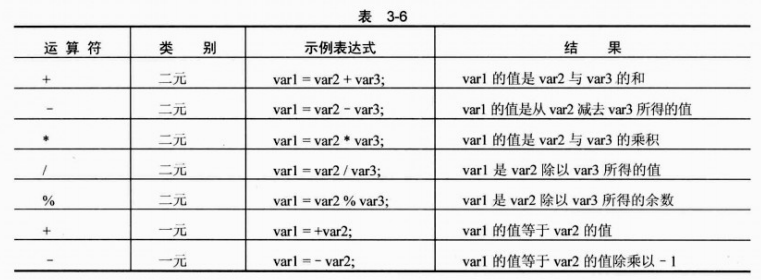

> **注释：**
>
> +(一元)运算符有点古怪，因为它对结果没有影响。它不会把值变成正的：如果var2是-1，则+var2仍是-1。但是，这是一个普遍认可的运算符，所以也把它包含进来。这个运算符最有用的方面是，可以定制它的操作，本书在后面探讨运算符的重载时会介绍它。

上面的示例都使用简单的数值类型，因为使用其他简单类型，结果可能不太清晰。如果把两个布尔值加在一起，会得到什么结果？此时，如果对bool变量使用+(或其他数学运算符)，编译器会报告出错。char变量的相加也会有点让人摸不着头脑。记住，char变量实际上存储的是数字，所以把两个char变量加在一起也会得到一个数字（其类型为int）。这是一个隐式转换的示例，稍后将详细介绍这个主题和显式转换，因为它也可以应用到var1、var2和var3都是混合类型的情况。

二元运算符+在用于字符串类型变量时也是有意义的。此时，表3-7的表项应如下所示。

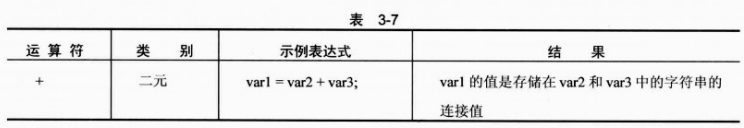

但其他数学运算符不能用于字符串的处理。

这里应介绍的另外两个运算符是递增和递减运算符，它们都是一元运算符，可以以两种方式使用：放在操作数的前面或后面。简单表达式的结果如表3-8所示。


这些运算符改变存储在操作数中的值。

* ++总是使操作数加1
* --总是使操作数减1

var1中存储的结果有区别，其原因是运算符的位置决定了它什么时候发挥作用。把运算符放在操作数的前面，则操作数是在进行任何其他计算前受到运算符的影响，而把运算符放在操作数的后面，则操作数是在完成表达式的计算后受到运算符的影响。

这有益于另一个示例，考虑下面的代码：

```
int var1, var2 =5, var3 = 6;
var1 =var2++ * --var3;
```

要把什么值赋予var1？在表达式计算前，var3前面的运算符--会起作用，把它的值从6改为5。可以忽略var2后面的++运算符，因为它是在计算完成后才发挥作用，所以var1的结果是5与5的乘积，即25。

在许多情况下，这些简单的一元运算符使用起来非常方便，它们实际上是下述表达式的简写形式：

```
var1 = var1 + 1;
```

这类表达式有许多用途，特别适合于在循环中使用，这将在第4章讲述。下面的示例说明如何使用数学运算符，并介绍另外两个有用的概念。代码提示用户输入一个字符串和两个数字，然后显示计算结果。

**试试看：用数学运算符处理变量**

（1）在目录C:\BegVCSharp\Chapter03下创建一个新控制台应用程序Ch03Ex02。

（2）在Program.cs中添加如下代码：

```c#
using System;
using System.Collections.Generic;
using System.Linq;
using System.Text;
using System.Threading.Tasks;

namespace ConsoleApp8
{
    class Program
    {
        static void Main(string[] args)
        {
            double firstNumber, secondNumber;
            string userName;
            Console.WriteLine("Enter your name: ");
            userName = Console.ReadLine();
            Console.WriteLine("Welcome {0}!", userName);
            Console.WriteLine("Now give me a number:");
            firstNumber = Convert.ToDouble(Console.ReadLine());
            Console.WriteLine("Now give me another number: ");
            secondNumber = Convert.ToDouble(Console.ReadLine());
            Console.WriteLine("The sum of {0} and {1} is {2}. ",
                firstNumber, secondNumber, firstNumber + secondNumber);
            Console.WriteLine("The result of subtracting {0} from {1} is {2}. ",
                secondNumber, firstNumber, firstNumber - secondNumber);
            Console.WriteLine("The produce of {0} and {1} is {2}. ",
                firstNumber, secondNumber, firstNumber * secondNumber);
            Console.WriteLine("The result of dividing {0} by {1} is {2}. ",
                firstNumber, secondNumber, firstNumber / secondNumber);
            Console.WriteLine("The remainder after dividing {0} by {1} is {2}. ",
                firstNumber, secondNumber, firstNumber % secondNumber);
            Console.ReadKey();
        }
    }
}

```

（3）执行代码，结果如图3-2所示。

（4）输入名称，按下回车键，如图3-3所示。

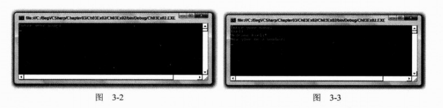

（5）输入一个数字，按下回车键，再输入另一数字，按下回车键，如图3-4所示。

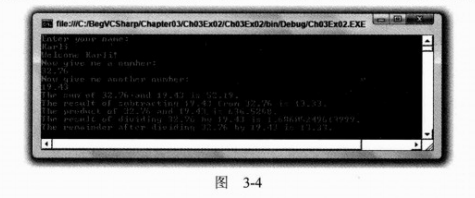

**示例的说明**

除了演示数学运算符外，这段代码还引入了两个重要的概念，在以后的示例中将多次用到这些概念。

* 用户输入
* 类型转换

用户输入使用与前面Console.WriteLine()命令类似的语法。但这里使用Console.ReadLine()。这个命令提示用户输入信息，并把它们存储在string变量中。

```C#
string userName;
Console.WriteLine("Enter your name: ");
userName = Console.ReadLine();
Console.WriteLine("Welcome {0}!", userName);
```

这段代码把已赋值变量userName的内容写到屏幕上。

这个示例还读取了两个数字，下面略微展开讨论一下。因为Console.ReadLine()命令生成一个字符串，而我们希望得到一个数字，所以这就引入了类型转换的问题。第5章将详细讨论类型转换，下面先看看本例使用的代码。

首先，声明要存储数字的变量：

```C#
double firstNumber, secondNumber;
```

接着，给出提示，对Console.ReadLine()得到的字符串使用命令Convert.ToDouble()，把字符串转换为double类型，把这个数值赋给前面声明的变量firstNumber：

```c#
Console.WriteLine("Now give me a number:");
firstNumber = Convert.ToDouble(Console.ReadLine());
```

这个语法是相当简单的，其他的许多转换也用这种方式进行。

其余的代码以相同的方式获取第二个数：

```c#
Console.WriteLine("Now give me another number: ");
secondNumber = Convert.ToDouble(Console.ReadLine());
```

然后输出两个数字的加、减、乘、除的结果，并使用余数运算符（%）显示除操作的余数。

```c#
Console.WriteLine("The sum of {0} and {1} is {2}. ",
    firstNumber, secondNumber, firstNumber + secondNumber);
Console.WriteLine("The result of subtracting {0} from {1} is {2}. ",
    secondNumber, firstNumber, firstNumber - secondNumber);
Console.WriteLine("The produce of {0} and {1} is {2}. ",
    firstNumber, secondNumber, firstNumber * secondNumber);
Console.WriteLine("The result of dividing {0} by {1} is {2}. ",
    firstNumber, secondNumber, firstNumber / secondNumber);
Console.WriteLine("The remainder after dividing {0} by {1} is {2}. ",
    firstNumber, secondNumber, firstNumber % secondNumber);
```

注意，我们提供了表达式firstNumber + secondNumber等，作为Console.WriteLine()语句的一个参数，而没有使用中间变量：

```c#
Console.WriteLine("The sum of {0} and {1} is {2}. ",
    firstNumber, secondNumber, firstNumber + secondNumber);
```

这种语法可以使代码的可读性比较强，可以减少需要编写的代码量。

### 3.4.2 赋值运算符

直到现在，我们一直在使用简单的=赋值运算符，其实还有其他赋值运算符，而且它们都非常有用。除了=运算符外，其他赋值运算符都以类似的方式工作。与=一样，它们都是根据运算符和右边的操作数，把一个值赋给左边的变量。

表3-9列出了这些运算符及其说明。

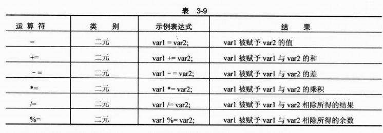

可以看出，这些运算符把var1也包括在计算过程中，下面的代码：

```c#
var1 += var2;
```

与下面的代码结果相同。

```c#
var1 = var1 + var2;
```

> **注意：**
>
> +=运算符也可以用于字符串，与+运算符一样。

使用这些运算符，特别是在使用参变量名时，可以使代码更容易阅读。

### 3.4.3 运算符的优先级

在计算表达式时，每个运算符都会按顺序处理。但这并不意味着从左至右地运用这些运算符。例如，有下面的代码：

```c#
var1 = var2 + var3;
```

其中+运算符就是在=运算符之前进行计算的。在其他一些情况下，运算符的优先级并没有这么明显，例如：

```c#
var1 = var2 + var3 * var4;
```

其中*运算符先计算，其后是+运算符，最后是=运算符，这是标准的数学运算顺序，其结果与我们在纸上进行算术运算的结果相同。

像这样的计算，可以使用括号控制运算符的优先级，例如：

```c#
var1 = (var2 + var3) * var4;
```

括号中的内容先计算，即+运算符在*运算符之前计算。

对于前面介绍的运算符，其优先级如表3-10所示，优先级相同的运算符（如*和/）按照从左至右的顺序计算。

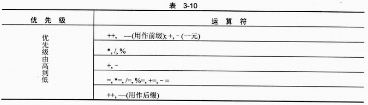

> **注意：**
>
> 括号可用于重写优先级顺序，如上所述。另外，++和- - 用作后缀运算符时，在概念上其优先级最低，如上表所示。它们不对赋值表达式的结果产生影响。所以可以认为它们的优先级比所有其他运算符都高。但是，它们会在计算表达式后改变操作数的值，所以很容易认可它们在上表中的优先级。

### 3.4.4 名称空间

在继续学习前，应花一定的时间了解一个比较重要的主题——名称空间。它们是.NET中提供应用程序代码容器的方式。这样就可以唯一地标识代码及其内容。名称空间也用作.NET Framework中给项分类的一种方式。大多数项都是类型定义，例如，本章描述的简单类型（System.Int32等）。

在默认情况下，C#代码包含在全局名称空间中。这意味着对于包含在这段代码中的项，只要按照名称进行引用，就可以由全局名称空间中的其他代码访问它们。可以使用namespace关键字为花括号中的代码块显式定义名称空间。如果在该名称空间代码的外部使用名称空间中的名称，就必须写出该名称空间中的限定名称。

限定名称包括它所有的继承信息。基本上，这意味着，如果一个名称空间中的代码需要使用在另一个名称空间中定义的名称，就必须包括对该名称空间的引用。限定名称在不同的名称空间级别之间使用句点字符（.）。

例如：

```c#
namespace LevelOne
{
    // code in LevelOne namespace
    
    // name "NameOne" defined
}

// code in global namespace
```

这段代码定义了一个名称空间LevelOne，以及该名称空间中的一个名称NameOne（注意这里没有列出其他代码，是为了使我们的讨论更具普遍性，并在定义名称空间的地方添加了一个注释）。在名称空间LevelOne中编写的代码可以使用NameOne来引用该名称，不需要任何分类信息。但全局名称空间中的代码必须使用分类名称LevelOne.NameOne来引用这个名称。

在名称空间中，使用关键值namespace还可以定义嵌套的名称空间。嵌套的名称空间通过其层次结构来引用，并使用句点区分层次结构的层次。这最好用一个示例来说明。考虑下面的名称空间：

```c#
namespace LevelOne
{
    // code in LevelOne namespace
    
    namespace LevelTwo
    {
        // code in LevelOne.LevelTwo namespace
        
        // name "NameTwo" defined
    }
}

// code in global namespace
```

在全局名称空间中，NameTwo必须被引用为LevelOne.LevelTwo.NameTwo，在LevelOne名称空间中，则可以被引用为LevelTwo.NameTwo，在LevelOne.LevelTwo名称空间中，则可以被引用为NameTwo。

要注意的是，名称是由名称空间唯一定义的。可以在LevelOne和LevelTwo名称空间中定义名称NameThree：

```c#
namespace LevelOne
{
    // name "NameThree" defined
    
    namespace LevelTwo
    {
        // name "NameThree" defined
    }
}
```

这定义了两个不同的名称LevelOne.NameThree和LevelOne.LevelTwo.NameThree，可以独立使用它们，互不干扰。

创建了名称空间后，就可以使用using语句简化对它们包含的名称的访问。实际上，using语句的意思是“我们需要这个名称空间中的名称。所以不要每次总是要求对它们分类”。例如，在下面的代码中，LevelOne名称空间中的代码可以访问LevelOne.LevelTwo名称空间中的名称，而无需分类：

```c#
namespace LevelOne
{
    using LevelTwo;
    
    namespace LevelTwo
    {
        // name "NameTwo" defined
    }
}
```

LevelOne名称空间中的代码现在可以直接使用NameTwo引用LevelTwo.NameTwo。

有时，与上面的NameThree示例一样，不同名称空间中的相同名称会产生冲突，使系统崩溃（此时，代码是不能编译的，编译器会告诉我们名称有冲突）。此时，可以使用using语句为名称空间提供一个别名。

```c#
namespace LevelOne
{
    using LT = LevelTwo;
    
    // name "NameThree" defined
    
    namespace LevelTwo
    {
        // name "NameThree" defined
    }
}
```

LevelOne名称空间中的代码可以把LevelOne.NameThree引用为NameThree，把LevelOne.LevelTwo.NameThree引用为LT.NameThree。

using语句可以应用到包含它们的名称空间，以及该名称空间中包含的嵌套名称空间中。在上面的代码中，全局名称空间不能使用LT.NameThree。但如果using语句声明如下：

```c#
using LT = LevelOne.LevelTwo;

namespace LevelOne
{
    // name "NameThree" defined
    
    namespace LevelTwo
    {
        // name "NameThree" defined
    }
}
```

这样全局名称空间中的代码和LevelOne名称空间中的代码就可以使用LT.NameThree。

这里有一点要注意：using语句本身不能访问另一个名称空间中的名称。除非名称空间中的代码以某种方式链接到项目上，或者代码是在该项目的源文件中定义的，或在链接到该项目的其他代码中定义的，否则就不能访问其中包含的名称。另外，如果包含名称空间的代码链接到项目上，无论是否使用using，都可以访问其中包含的名称。using语句便于我们访问这些名称，减少代码量，使之更合理。

回过头来看看本章开头的ConsoleApplication中的代码，下面的代码被应用到名称空间上：

```c#
using System;
using System.Collections.Generic;
using System.Text;

namespace ConsoleApplication
{
    ...
}
```

以using关键字开头的3行代码声明在这段C#代码中使用System、System.Collections.Generic和System.Text名称空间，它们可以在该文件的所有名称空间中访问，无需分类。System名称空间是.NET Framework应用程序的根名称空间，包含控制台应用程序所需要的所有基本功能。其他两个名称空间常常用于控制台应用程序，所以该程序包含了这3行代码。

最后，为应用程序代码本身声明一个名称空间ConsoleApplication。

## 3.5 小结

本章介绍了创建有效C#应用程序的许多基础知识，讲述了C#的基本语法，分析了在创建控制台应用程序项目时VS和VCE生成的基本控制台应用程序代码。

本章的主要内容是变量的使用。我们描述了变量，阐述了如何创建变量，如何给它们赋值，如何处理它们以及它们包含的值。同时，介绍了一些基本的用户交互，描述了如何把文本输出到控制台应用程序上，如何读取用户的输入。这涉及到一些非常基本的类型转换。类型转换时一个复杂的主题，将在第5章详细论述。

本章还介绍了如何把运算符合操作数组合为表达式，并说明了这些运算符的执行方式，以及执行它们的顺序。

最后介绍了名称空间。随着本书内容的深入，名称空间会显的越来越重要。这里仅以比较抽象的方式介绍了这个主题，完整的论述见后面的内容。

本章学习了：

* C#的基本语法
* 在创建控制台应用程序项目时VS所做的工作
* 变量的理解和使用
* 表达式的理解和使用
* 名称空间的含义

到目前为止，所有的编程工作都是逐行完成的。第4章将学习如何使用循环技术和条件分支控制程序执行的流程，使代码的效率更高。

