# 第4章 流程控制

到目前为止，我们看到的C#代码有一个共同点：程序的执行都是一行接一行、自上而下地进行，不遗漏任何代码。如果所有的应用程序都这样执行，则我们能做的工作就很有限了。

本章介绍控制程序流程的两种方法。程序流程就是C#代码的执行顺序。这两种方法是：

* 分支——有条件地执行代码。条件取决于计算的结果，例如，“如果myVal小于0，就只执行这行代码“。
* 循环——重复执行相同的语句（重复执行一定的次数，或者在满足测试条件后停止执行）。

这两种方法都要用到布尔逻辑。第3章介绍了bool类型，但没有讨好它。本章将在很多地方使用它，所以先讨论布尔逻辑，以便在流程控制环境下使用它。

**本章的主要内容：**

* 布尔逻辑的含义及其用法
* 如何控制代码的执行

## 4.1 布尔逻辑

第3章介绍的bool类型可以有两个值：true或false。这种类型常常用于记录某些操作的结果，以便操作这些结果。bool类型可用于存储比较的结果。

> **注意：**
>
> 英国数学家乔治·布尔在19世纪中叶为布尔逻辑奠定了基础。

考虑下述情形（如本章引用所述）：要根据变量myVal是否小于10，来确定是否执行代码。为此，需要确定语句“myVal小于10”的真假，即需要知道比较的布尔结果。

布尔比较需要使用布尔比较运算符（也称为关系运算符），如表4-1所示。这里var1都是bool累的变量，var2和var3则可以是各种类型。

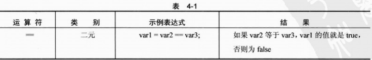

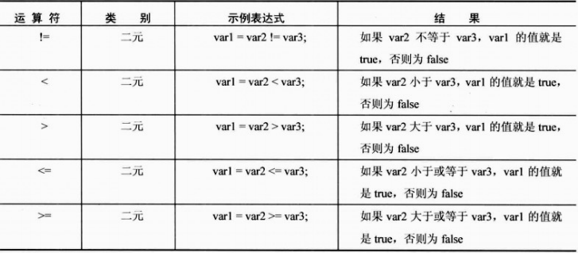

在代码中，可以对数值使用这些运算符，如下所示：

```c#
bool isLessThan10;
isLessThan10 = myVal <10;
```

如果myVal存储的值小于10，这段代码就给isLessThan10赋予true值，否则赋予false值。

也可以对其他类型使用这些比较运算符，例如字符串：

```C#
bool isKarli;
isKarli = myString == "Karli";
```

如果myString存储的字符串时Karli，isKarli的值就为true。

也可以对布尔值使用这些运算符：

```C#
bool isTrue;
isTrue = myBool == true;
```

但只能使用==和!!=运算符。

> **注意：**
>
> 假定val1<val2是false，则val1>val2为true，此时会产生一个错误，如果val1==val2，则这两个语句都是ifalse。

在处理布尔值时，还有其他一些布尔运算符，如表4-2所示。 

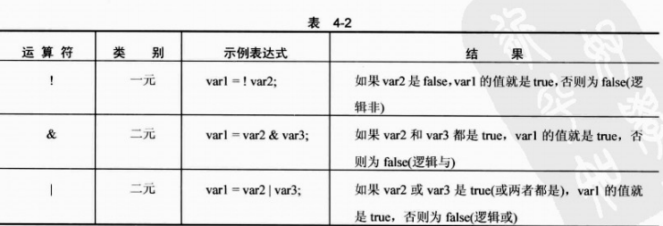

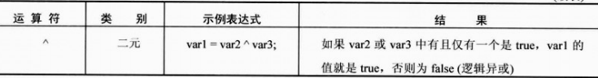

上面的代码也可以表述为：

```C#
bool isTrue;
isTrue = myBool & true;
```

&和|运算符也有两个类似的运算符，称为条件布尔运算符（见表4-3）。

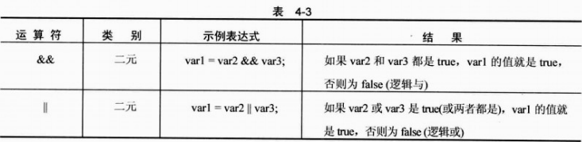

这些运算符的结果与&和 | 完全相同，但得到结果的方式有一个重要区别：其性能比较好。两者都是检查第一个操作数的值（表4-3中的var2），再根据该操作数的值进行操作，可能根本就不需要第二个操作数的值（表4-3中的var3）。

如果&&运算符的第一个操作数是false，就不需要考虑第二个操作数的值了，因为无论第二个操作数的值是什么，其结果都是false。同样，如果第一个操作数是true，|| 运算符就返回true，无需考虑第二个操作数的值。但上面的& 和 | 运算符却不是这样。它们的操作数总是要计算的。

因为操作数的计算是有条件的，如果使用&&和 || 运算符来代替& 和 | ，性能会有一定的提高。在大量使用这些运算符的应用程序中是比较明显的。作为一个规则，尽可能使用&& 和 || 运算符。这些运算符有时用于比较复杂的情形，例如，只有第一个操作数包含某个值时，才计算第二个操作数：

```c#
var1 = (var2 != 0) && (var3 / var2 >2);
```

如果var2是0，则var3除以var2就会导致“除0错误”，或者把var1定义为无穷大（对于某些类型如float来说，后者是可能的，也是可以检测到的）。

### 4.1.1 位运算符

在上一节的讨论中，读者可能会问，为什么会有& 和 | 运算符。原因是这两个运算符可以用于对数字执行操作。实际上，它们处理的是存储在变量中的一系列位，而不是变量的值。

下面先讨论&。第一个操作数中的每个位都与第二个操作数中相同位置上的位进行比较，在得到的结果中，各个位置上的位如表4-4所示。

| 运算符与此类似i，但得到的结果是不同的，如表4-5所示。

例如，考虑下面代码中的操作：

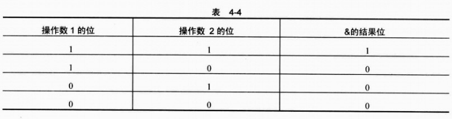

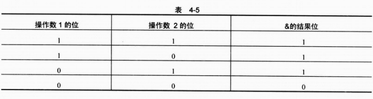

```c#
int result, op1, op2;
op1 = 4;
op2 = 5;
result = op1 & op2;
```

这里必须考虑op1和op2的二进制表示方法，它们分别是100和101。比较这两个表达式中相同位置上的二进制数字，得出结果，如下所示：

* 如果op1和op2最左边的位都是1，result最左边的位就是1，否则为0。
* 如果op1和op2次左边的位都是1，result次左边的位就是1，否则为0。
* 继续比较其他的位。

在这个示例中，op1和op2最左边的位都是1，所以result最左边的位就是1。下一个位都是0，第3个位置上的位分别是1和0，则result是第2~3个位都是0。最后，结果的二进制值是100，即结果是4。以下是这个过程：


如果使用 | 运算符，将进行相同的过程，但如果操作数中相同位置上的位有一个是1，其结果位就是1，如下所示：


^ 运算符的用法与此相同。如果操作数中相同位置上的位有且仅有一个是1，其结果位就是1，如表4-6所示。

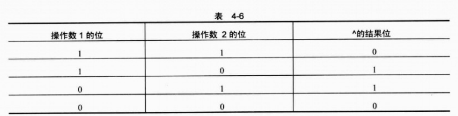

C#中还可以使用一元位运算符~，它将操作数中的位取反，其结果应是操作数中位为1的，在结果中就是0，反之亦然，如表4-7所示。

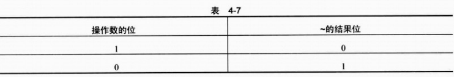

整数存储在.NET中的方式称为2的补位，即使用一元运算符~会使结果看起来有点古怪。假定int类型是一个32位的数字，则运算符对所有32位进行操作，将有助于看出这种方式。例如，数字5的完整二进制表示为：

```c#
000000000000000000000000000000101
```

数字- 5的完整二进制表示为：

```c#
11111111111111111111111111111011
```

实际上，按照2的补位系统，（-x）定义为（~x+1）。这个系统在把数字加在一起时非常有用。例如，把10和 - 5加起来（即从10 中减去5）的二进制表示为：

```c#
000000000000000000000000000000001010
+ 1111111111111111111111111111111011
= 1000000000000000000000000000000101
```

> **提示：**
>
> 忽略最左端的1，就得到5的二进制表示。像~1=-2这样的式子比较古怪，其原因是底层的结构强制生成了这个结果。

本节介绍的这些位运算符在某些情况下是非常有用的，因为它们可以用变量中的各个位存储信息。例如，颜色可以使用3个位来指定红、绿、蓝。可以分别设置这些位，改变这3个位，进行如下配置，如表4-8所示。

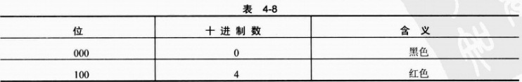

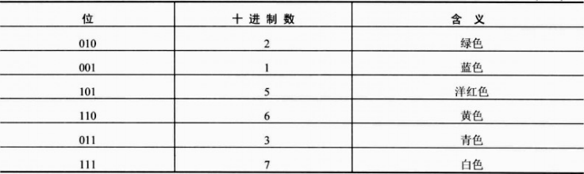

假定把这些值存储在一个类型为int的变量中。首先从黑色开始，即值为0的int变量，可以执行如下操作：

```c#
int myColor = 0;
bool containsRed;
myColor = myColor | 2;				// Add green bit, myColor now stores 010
myColor = myColor | 4;				// Add red bit, myColor now stores 110
containsRed = (myColor & 4) ==4;	// Check value of red bit
```

最后一行代码把值true赋予containsRed，因为myColor的“红色位”是1,。这种技术在高效使用信息时非常有效，特别适合于同时检查多个位的值（对于int值，是32位）。但是，在一个变量变量中存储额外信息有更好的方式，即利用第5章讨论的高级变量类型。

除了这4个位运算符外，本节还要介绍另外两个运算符，如表4-9所示。

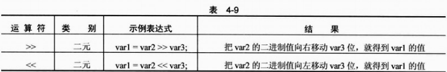

这些运算符通常称为位移运算符，最好用一个示例来说明：

```c#
int var1, var2 = 10, var3 = 2;
var1 = var2 << var3;
```

结果，var1的值是40。具体过程如下：10的二进制值是1010，把该数值向左移动两位，得到101000，即十进制中的40。实际上，是执行了乘法操作。每向左移动一位，该数都要乘以2，所以向左移动两位，就是给原来的操作数乘以4。而每向右移动一位，则是给操作数除以2，并丢弃余数：

```c#
int var1，var2 = 10；
var1 = var2 >> 1;
```

在这个示例中，var1的值是5，而下面的代码得到的值是2；

```c#
int var1, var2 = 10;
var1 = var2 >>2;
```

在大多数代码中，都不使用这些运算符，但应知道有这样的运算符存在。它们主要用于高度优化的代码，在这些代码中，不能使用其他数学操作。因此它们通常用于设备驱动程序或系统代码。

### 4.1.2 布尔赋值运算符

本节要介绍的最后一类运算符是把前面的赋值运算符组合起来，非常类似于第3章中的数学赋值运算符（+=，*=等）。如表4-10所示。

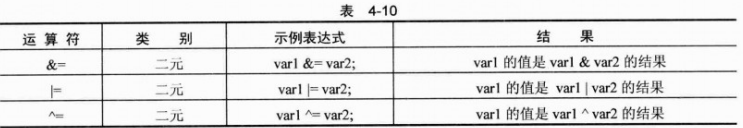

这些运算符处理布尔值和数值的方式与&、| 和 ^ 相同。

> **注意：**
>
> &=和 |= 使用 & 和 |，而不是 &&和 ||，使用这些较简单的运算符会产生额外的开销。

位移运算符也有赋值运算符，如表4-11所示。

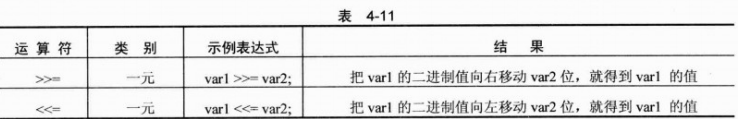

下面看一个示例。这个示例让用户输入一个整数，然后代码使用该整数执行各种布尔运算。

**试试看：使用布尔和位运算符**

（1）在目录C:\BegVCSharp\Chapter04下创建一个新控制台应用程序Ch04Ex01。

（2）把下述代码添加到Program.cs中：

```c#
using System;
using System.Collections.Generic;
using System.Linq;
using System.Text;
using System.Threading.Tasks;

namespace ConsoleApp9
{
    class Program
    {
        static void Main(string[] args)
        {
            Console.WriteLine("Enter an integer: ");
            int myInt = Convert.ToInt32(Console.ReadLine());
            Console.WriteLine("Integer less than 10? {0}", myInt < 10);
            Console.WriteLine("Integer between 0 and 5? {0}",
                (0 <= myInt) && (myInt <= 5));
            Console.WriteLine("Bitwise AND of Integer and 10 = {0} ", 
                myInt & 10);
            Console.ReadKey();
        }
    }
}

```

（3）运行应用程序，出现提示时，输入一个整数，结果如图4-1所示。

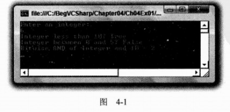

**示例的说明**

前两行代码使用前面介绍的技术，提示并接受一个整数值：

```c#
Console.WriteLine("Enter an integer: ");
int myInt = Convert.ToInt32(Console.ReadLine());
```

使用Conver.ToInt32()从字符串输入中得到一个整数。Convert.ToInt32()是另一个类型转换命令，与前面使用的Conver.ToDouble()命令位于同一个系列中。

剩下的3行代码对得到的数字进行各种操作，并显示结果。在执行这段代码时，假定用户输入了6，如图4-1所示。

第一个输出是操作myInt<10的结果。如果myInt是6，则它小于10，因此结果为true。如果MyInt的值是10或更大，就会得到false。

第二个输出涉及的计算比较多：（0<=myInt)&&(myInt<=5)，其中包含两个比较操作，用于确定myInt是否大于或等于0，且小于或等于5。接着对结果进行布尔AND操作。输入数字6，则（0<=myInt）返回true，而（myInt<=5）返回false，最终的结果就是（true）&&（false），即false，如图4-1所示。

最后，对myInt的值进行按位AND操作。另一个操作数是10，它的二进制值是1010。如果myInt是6，其二进制值是110，则这个操作的结果是10，即十进制中的2，如下所示：

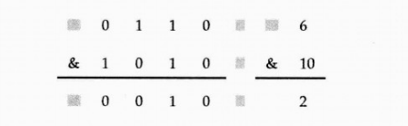

### 4.1.3 运算符的优先级更新

现在要考虑更多的运算符，所以应更新第3章中的运算符优先级表，把它们包括在内，如表4-12所示。

这样表中增加了好几个级别，但它明确定义了下述表达式该如何计算：

```c#
var1 = var2 <= 4 && var2 >= 2;
```

其中&&运算符在 <= 和 >= 运算符之后执行。

这里要注意的是，添加括号可以使这样的表达式看起来更清晰。编译器知道用什么顺序执行运算符，但人们常常会忘记这个顺序（有时可能想改变这个顺序）。上面的表达式也可以写为：

```c#
var1 = (var2 <= 4) && (var2 >= 2);
```

要解决这个问题，可以明确指定计算的顺序。


## 4.2 goto语句

C#允许给代码行加上标签，这样就可以使用goto语句直接跳转到这些代码行上。该语句有其优缺点。主要的优点是：这是控制什么时候执行哪些代码的一种非常简单的方式。主要的缺点是：过多地使用这个技巧将很难读懂代码。

goto语句的用法如下：

```c#
goto <labelName>;
```

标签用下述方式定义：

```c#
<labelName>;
```

例如，下面的代码：

```c#
int myInteger = 5;
goto myLablel;
myInteger += 10;
myLabel:
Console.WriteLine("myInteger = {0}", myInteger);
```

其执行过程如下：

* myInteger声明为int类型，并赋予值5。
* goto语句中断正常的执行过程，把控制转到标为myLabel:的代码行上。
* myInteger的值写到控制台上。

下面的第3行代码没有执行。

```c#
int myInteger = 5;
goto myLabel;
myInteger += 10;
myLabel:
Console.WriteLine("myInteger = {0}", myInteger);
```

实际上，如果在应用程序中加入这段代码，就会发现编译代码时，Error List窗口会显示一个警告，即Unreachable code delected和一个行号。在无法执行的代码中，myInteger下面还有绿色的波浪线。

goto语句有它们的用途，但也可能使代码陷入混乱之中。例如，因使用goto语句而非常难懂的代码如下所示：

```c#
start:
    int myInteger = 5;
    goto addVal;
writeResult:
    Console.WriteLine("myInteger = {0} ", myInteger);
    goto start;
addVal:
    myInteger += 10;
    goto writeResult;
```

这是有效的代码，但非常难读懂，读者可以自己试试，看看会发生什么情况。在此之前，应尝试理解这些代码会完成什么任务。后面再讨论这个语句，因为本章的其他一些结构将使用该语句（但最好不要使用它）。

## 4.3 分支

分支是控制下一步要执行哪些代码的过程。要跳转到代码行由由某个条件语句来控制。这个条件语句使用布尔逻辑，对测试值和一个或多个可能的值进行比较。本节介绍C#中的3种分支技术：

* 三元运算符
* if语句
* switch语句

### 4.3.1 三元运算符

进行比较最简单的方式是使用第3章介绍的三元（或条件）运算符。一元运算符有一个操作数，二元运算符有两个操作数，所以三元运算符有3个操作数。其语法如下：

```
<test> ? <resultIfTrue> : <resultIfFalse>
```

其中，计算<test>可得到一个布尔值，运算符的结果根据这个值来确定是<resultIfTrue>，还是<resultIfFalse> 。

三元运算符的示例如下所示：

```c#
string resultString = (myInteger < 10) ? "Less than 10" : "Greater than or equal to 10";
```

三元运算符的结果是两个字符串中的一个，这两个字符串都可能赋给resultString。把哪个字符串赋给resultString，取决于myInteger的值与10的比较。如果myInteger的值小于10，就把第一个字符串赋给resultString；如果myInteger的值大于或等于10，就把第二个字符串赋给resultString。例如，如果myInteger的值是4，则resultString的值就是字符串“Less than 10”。

这个运算符比较适合于这样的简单赋值语句，但不适合于根据比较结果执行大量代码的情况。此时应使用if语句。

### 4.3.2 if语句

if语句的功能比较多，是进行决策的有效方式。与？：语句不同的是，if语句没有结果（所以不在赋值语句中使用它），使用该语句是为了有条件地执行其他语句。

if语句最简单的语法如下：

```c#
if(<test>)
    <code executed if <test> is true>;
```

## 4.5 小结

本章介绍了可以在代码中使用的各种结构，扩展了编程知识。在开始编写更复杂的应用程序时，这些结构的正确使用是非常重要的。

首先用一定的篇幅介绍了布尔逻辑，以及一些按位逻辑的知识。在学习了本章的其他内容后，再回过头来看看这些逻辑，可以确信，在谈到执行程序中的分支和循环代码时，这个问题是非常重要的。熟悉本节讨论的运算符合技术是很有必要的。

分支结构可以有条件地执行代码，当分支与循环一起使用时，可以在C#代码中创建出比较复杂的结构。把循环嵌套起来，再放在if结构中，就会发现代码的缩进是非常有用的。如果把所有的代码都放在屏幕的左端，就很难分析它们了，甚至难以调试。此时应确保点的缩进——用户在以后使用时即可体会到它的种种优势。VS为此做了大量的工作，但最好在输入代码时进行缩进。

第5章将深入探讨变量。