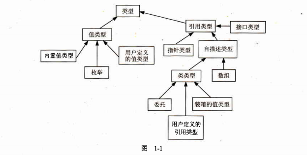
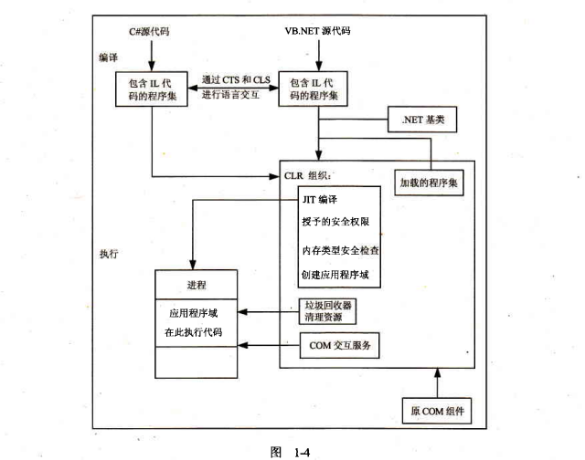

# 第1章 .NET体系结构

**本章内容：**

* 编译和运行面向.NET的代码
* Microsoft中间语言（Microsoft Intermediate Language，MSIL或简称为IL）的优点
* 值类型和引用类型
* 数据类型化
* 理解错误处理和特性
* 程序集、.NET基类和名称空间

整本书都将强调，C#语言不能孤立地使用，而必须和.NET Framework一起考虑。C#编译器专门用于.NET，这表示用C#编写的所有代码总是在.NET Framework中运行。对C#语言来说，可以得出两个重要的结论：

（1）C#的结构和方法论反映了.NET基础方法论。

（2）在许多情况下，C#的特定语言功能取决于.NET的功能，或依赖于.NET基类。

由于这种依赖性，在开始编写C#程序前，了解.NET的体系结构和方法论就非常重要，这就是本章的目的所在。

## 1.1 C#与.NET的关系

C#是一种相当新的编程语言，C#的重要性体现在以下两个方面：

* 它是专门为与Microsoft的.NET Framework一起使用而设计的（.NET Framework是一个功能非常丰富的平台，可开发、部署和执行分布式应用程序）。
* 它是一种基于相当现代面向对象设计方法的语言，在设计它时，Microsoft还吸取了其他所有类似语言的经验，这些语言是近20年来面向对象规则得到广泛应用后才开发出来的。

有一个很重要的问题要弄明白：C#就其本身而言只是一种语言，尽管它是用于生成面向.NET环境的代码，但它本身不是.NET的一部分。.NET支持的一些特性，C#并不支持。而C#语言支持的另一些特性，.NET却不支持（如运算符重载）！

但是，因为C#语言和.NET一起使用，所以如果要使用C#高效地开发应用程序，理解Framework就非常重要，所以本章将介绍.NET的内涵。

## 1.2 公共语言运行库

.NET Framework的核心是其运行库执行环境，称为公共语言运行库（CLR）或.NET运行库。通常将在CLR控制下运行的代码成为托管代码（managed code）。

但是，在CLR执行编写好的源代码（在C#中或其他语言中编写的代码）之前，需要编译它们。在.NET中，编译分为两个阶段：

（1）把源代码编译为Microsoft中将语言（IL）。

（2）CLR把IL编译为平台专用的代码。

这两个阶段的编译过程非常重要，因为Microsoft中间语言是提供.NET的许多优点的关键。

Microsoft中间语言与Java字节码共享一种理念：它们都是低级语言，语法很简单（使用数字代码，而不是文本代码），可以非常快速地转换为本地机器码。对于代码，这种精心设计的通用语法有很重要的优点：平台无关性、提高性能和语言互操作性。

### 1.2.1 平台无关性

首先，这意味着包含字节码指令的同一文件可以放在任一平台中，运行时编译过程的最后阶段可以很轻松地完成，这样代码就可以运行在特定的平台上。换言之，编译为中间语言就可以获得.NET平台无关性，这与编译为Java字节码就会得到Java平台无关性是一样的。

注意.NET的平台无关性目前只是停留在理论范畴，因为在编写本书时，.NET的完整实现只能用于Windows平台，但是人们正在积极准备，使它可以用于其他平台（参见Mono项目，它用于实现.NET的开放源代码，参见http://www.go-mono.com/）。

### 1.2.2 提高性能

前面把IL和Java做了比较，实际上，IL比Java字节码的作用还要大。IL总是即时编译的（称为JIT编译），而Java字节码常常是解释性的。Java的一个缺点是，在运行应用程序时，把Java字节码转换为内部可执行代码的过程会导致性能的损失（但在最近，Java在某些平台上能进行JIT编译）。

JIT编译器并不是把整个应用程序一次编译完（这样会有很长的启动时间），而是只编译它调用的那部分代码（这是其名称的由来）。代码编译过一次后，就不需要重新编译了。Microsoft认为这个过程比一开始就编译整个应用程序代码的效率高很多，因为任何应用程序的大部分代码实际上并不是在每次运行期间都执行。使用JIT编译器，从来都不会编译这种代码。

这解释了为什么托管IL代码几乎和本地机器代码的执行速度一样快，但是并没有说明为什么Microsoft认为这会提高性能。其原因是编译过程的最后一部分是在运行时进行的，JIT编译器确切地知道程序运行在什么类型的处理器上，可以利用该处理器提供的任何特性或特定的机器代码指令来优化最后的可执行代码。

传统的编译器会优化代码，但它们的优化过程是独立于运行代码的特定处理器的。这是因为传统的编译器是在发布软件之前编译为本地机器可执行的代码。即编译器不知道运行代码的处理器的类型，例如该处理器是兼容x86的处理器还是Alpha处理器，这超出了基本操作的范围。

### 1.2.3 语言的互操作性

使用IL不仅支持平台无关性，还支持语言的互操作性。 简而言之，就是能将任何一种语言编译为中间语言，编译为中间语言的代码可以与从其他语言编译过来的代码进行交互操作。

那么除了C#之外，还有什么语言可以通过.NET进行交互操作呢？下面就简要讨论其他常见语言如何与.NET交互操作。

**1. Visual Basic 2010**

Visual Basic 6 在升级到Visual Basic .NET 2002时，经历了一番脱胎换骨的变化，才集成到.NET Framework的第1版中。Visual Basic语言对Visual Basic 6进行了很大的演化，也就是说，Visual Basic 6并不适合运行.NET程序。例如，它与COM（Component Object Model，组件对象模型）的高度集成，并且只把事件处理程序作为源代码显示给开发人员，大多数代码隐藏不能用作源代码。另外，它不支持继承的实现，Visual Basic 6使用的标准数据类型也与.NET不兼容。

Visual Basic 6 在2002年升级为Visual Basic .NET，对Visual Basic进行的改变非常大，完全可以把Visual Basic当作是一种新语言。已有的Visual Basic 6 代码不能编译为当前的Visual Basic 2010 代码（或Visual Basic .NET 2002、2003、2005和2008代码），把Visual Basic 6 程序转换为Visual Basic 2019时，需要对代码进行大量的改动。但大多数修改工作都可以由Visual Studio 2010（Visual Studio的升级版本，用于与.NET一起使用）自动完成。如果把Visual Basic 6 项目读到Visual Studio 2010中，Visual Studio 2010就会自动升级该项目，也就是说把Visual Basic 6 源代码重写为Visual Basic 2010源代码。虽然这意味着其中的工作大大减轻，但用户仍需要检查新的Visual Basic 2010代码，以确保项目仍可按预期方式正确工作，因为这种转换并不能达到完美无缺的程度。

这种语言升级的一个副作用是不能再把Visual Basic 2010编译为本地可执行代码了。Visual Basic 2010只编译为中间语言，就像C#一样。如果需要继续使用Visual Basic 6 编写程序，就可以这样做，但生成的可执行代码会完全忽略.NET Framework，如果继续把Visual Studio作为开发环境，就需要安装Visual Studio 6。

**2. Visual C++2010**

Visual C++ 6有许多Microsoft对Windows的特定扩展。Visual C++ .NET又新增了更多的扩展内容，来支持.NET Framework。现有的C++源代码会继续编译为本地可执行代码，而不会有修改，但它会独立于.NET运行库运行。如果让C++代码在.NET Framework中运行，就可以在代码的开头添加下述命令：

```c++
#using <mscorlib.dll>
```

还可以把标记/clr传递给编译器，这样编译器假定要编译托管代码，因此会生成中间语言，而不是本地机器码。C++的一个有趣的问题是在编译成托管代码时，编译器可以生成包含内嵌本地可执行程序的IL。这表示在C++代码中可以把托管类型和非托管类型合并起来，因此托管C++代码：

```c#
class MyClass
{
```

定义了一个普通的C++类，而代码：

```c#
ref class MyClass
{
```

生成了一个托管类，就好像使用C#或Visual Basic 2010编写类一样。实际上，托管C++代码比C#代码更优越的一点是可以在托管C++代码中调用非托管C++类，而不必采用COM互操作功能。

如果在托管类型上试图使用.NET不支持的特性（例如，模版或类的多继承），编译器就会出现一个错误。另外，在使用托管类时，还需要使用非标准C++功能。

因为C++允许低级指针操作，C++编译器不能生成可以通过CLR内存类型安全测试的代码。如果CLR把代码标识为内存类型安全是非常重要的，就需要使用其他一些语言编写源代码（如C#或 Visual Basic 2010）。

**3. COM和COM+**

从技术上讲，COM和COM+并不是面向.NET的技术，因为基于它们的组件不能编译为IL（但如果原来的COM组件是C++编写的，那么使用托管C++在某种程度上是可以这么做）。但是，COM+仍然是一个重要工具，因为其特性没有在.NET中完全实现。另外，COM组件仍可以使用——.NET集成了COM的互操作性，从而使托管代码可以调用COM组件，COM组件也可以调用托管代码（见第26章）。一般情况下，把新组件编写为.NET组件，大多是为了方便，因为这样可以利用.NET基类和托管代码的其他优点。

## 1.3 中间语言

如前所述，Microsoft中间语言显然在.NET Framework中起着非常重要的作用。现在应详细讨论一下IL的主要特征，因为面向.NET的所有语言在逻辑上都需要支持IL的主要特征。

下面就是中间语言的主要特征：

* 面向对象和使用接口
* 值类型和引用类型之间的显著差异
* 强数据类型化
* 使用异常来处理错误
* 使用特征（attribute）

### 1.3.1 面向对象和接口的支持

.NET的语言无关性还有一些实际的限制。中间语言在设计时就打算实现某些特殊的编程方法，这表示面向它的语言必须与编程方法兼容，Microsoft为IL选择的特定道路是传统的面向对象的编程，带有类的单一继承性。

> 不熟悉面向对象概念的读者应参考第53章（见随书附赠光盘中对应的章节），获得更多的信息。

除了传统的面向对象编程外，中间语言还引入了接口的概念，在带有COM的Windows下第一次实现了接口。用.NET建立的接口与COM接口不同，它们不需要支持任何COM基础结构，例如，它们不是派生自IUnknown，也没有对应的GUID。但它们与COM接口共享下述理念：提供一个契约，实现给定接口的类必须提供该接口指定的方法和属性的实现方式。

前面介绍了使用.NET意味着要编译为中间语言，即需要使用传统的面向对象的方法来编程。但这并不能提供语言的互操作性。毕竟，C++和Java都使用相同的面向对象的范例，但它们仍不是可交互操作的语言。下面需要详细探讨一下语言互操作性的概念。

首先，需要了解一下语言互操作性的准确含义。

毕竟，COM允许以下不同语言编写的组件一起工作，即可以调用彼此的方法。这就足够了吗？COM是一个二进制标准，允许组件实例化其他组件，调用它们的方法或属性，而无须考虑编写相关组件的语言。但为了实现这个功能，每个对象都必须通过COM运行库来实例化，通过接口来访问。根据相关组件的线程模型，需要在不同线程的内存空间和运行组件之间编组数据，这可能造成很大的性能损失。在极端个情况下，组件保存为可执行文件，而不是DLL文件，还必须创建单独的进程来运行它们。重要的组件仅能通过COM运行库与其他组件通信。使用不同语言的组件无法通过COM直接彼此通信，或者创建彼此的实例——系统总将COM作为中间件。不仅如此，COM体系结构还不允许利用继承实现，即它丧失了面向对象编程的许多优势。

一个相关的问题是，在调试时，仍必须单独调试使用不同语言编写的组件。不可能在调试器上交替调试不同语言的代码。语言互操作性的真正意义是用一种语言编写的类应该直接与另一种语言编写的类通信。特别是：

* 用一种语言编写的类应能继承用另一种语言编写的类。
* 一个类应能包含另一个类的实例，而不管两个类是使用什么语言编写的。
* 一个对象应能直接调用用其他语言编写的另一个对象的方法。
* 对象（或对象的引用）应能在方法之间传递。
* 在不同的语言之间调用方法时，应能在调试器中交替调试这些方法调用，即调试不同语言编写的源代码。

这是一个雄心勃勃的目标，但令人惊讶的是，.NET和中间语言已经实现了这个目标。在调试器上交替调试方法时，Visual Studio IDE（Intergrated Development Environment，集成开发环境）提供了这样的工具（不是CLR提供的）。

### 1.3.2 不同的值类型和引用类型

与其他编程语言一样，中间语言提供了许多预定义的基本数据类型。它的一个特性是值类型和引用类型之间有明显的区别。对于值类型（value type），变量直接存储其数据，而对于引用类型（reference type），变量仅存储地址，对应的数据可以在该地址中找到。

在C++中，使用引用类型类似于通过指针来访问变量，而在Visual Basic中，与引用类型最相似的是对象，Visual Basic 6 总是通过引用来访问对象。中间语言也有数据存储的规范：引用类型的实例总是存储在一个名为“托管堆”的内存区域中，值类型一般存储在堆栈中（但如果值类型在引用类型中声明为字段，它们就内联存储在堆中）。第2章讨论堆栈和堆，及其工作原理。

### 1.3.3 强数据类型化

中间语言的一个重要方面是它基于强数据类型化。所有的变量都清晰地标记为属于某个特定数据类型（在中间语言中没有Visual Basic和脚本语言中的Variant数据类型）。特别是中间语言一般不允许对模糊的数据类型执行任何操作。

例如，Visual Basic 6开发人员习惯于传递变量，而无需考虑它们的类型，因为Visual Basic 6 会自动进行所需的类型转换。C++开发人员习惯于在不同类型之间转换指针类型。执行这类操作将极大地提高性能，但破坏了类型的安全性。因此，这类操作只能在某些编译为托管代码的语言中的特殊情况下进行。确实，指针（相对于引用）只能在标记了的C#代码块中使用，但在Visual Basic 中不能使用（但一般在托管C++中允许使用）。在代码中使用指针会立即导致CLR提供的内存类型安全性检查失败。注意，一些与.NET兼容的语言，例如Visual Basic 2010，在类型化方面的要求仍比较宽松，但这是可以的，因为编译器在后台确保在生成IL上强制类型安全。

尽管强迫实现类型的安全性似乎会降低性能，但在许多情况下，我们从.NET提供的、依赖于类型安全的服务中获得的好处更多。这些服务包括：

* 语言的互操作性
* 垃圾收集
* 安全性
* 应用程序域

下面讨论强数据类型化对.NET的这些功能非常重要的原因。

**1. 语言互操作性中强数据类型化的重要性**

如果类派生自其他类，或包含其他类的实例，它就需要知道其他类使用的所有数据类型，这就是强数据类型化非常重要的原因。实际上，过去由于缺少用于指定这类信息的一致的系统，从而成为语言继承和交互操作的真正障碍。这类信息并未在标准的可执行文件或DLL中出现。

假定将Visual Basic 2010类中的一个方法定义返回一个Integer——Visual Basic 2010可以使用的标准数据类型之一。但C#没有该名称的数据类型。显然，只有编译器知道如何把Visual Basic 2010的Integer类型映射为C#定义的某种已知类型，才可以从该类派生，使用这个方法，并在C#代码中使用返回的类型。这个问题在.NET中是如何解决的？

**通用类型系统（CTS）**

此类数据类型问题在.NET中使用通用类型系统（CTS）得到了解决。CTS定义了可以在中间语言中使用的预定义数据类型，所有面向.NET Farmework的语言都可以生成最终基于这些类型的编译代码。

对于上面的例子，Visual Basic 2010的Integet实际上是一个32为有符号的整数，它实际映射为中间语言类型Int32。因此在中间语言代码中就指定这种数据类型。C#编译器可以使用这种类型，所以就不会有问题了。在源代码中，C#用关键字int来表示Int32，所以编译器就认为Visual Basic 2010方法返回一个int类型的值。

CTS不仅指定了基本数据类型，还定义了一个内存丰富的类型层次结构，其中包含设计合理的位置，在这些位置上，代码允许定义它自己的类型。CTS的层次结构反映了中间语言的单一继承的面向对象方法，如图1-1所示。



这里没有列出内置的所有值类型，因为第3章将详细介绍它们。在C#中，编译器识别的每个预定义类型都映射为一个IL内置类型。这与Visual Basic 2010 一样。

**公共语言规范（CLS）**

公共语言规范（Common Language Specification，CLS）和通用类型系统一起确保语言的互操作性。CLS是一个最低标准集，所有面向.NET的编译器都必须支持它。因为IL是一种内涵非常丰富的语言，大多数编译器的编写人员有可能把给定编译器的功能限制为只支持IL和CTS提供的一部分功能。只要编译器支持已在CLS中定义的内容，这就很不错。

下面的一个例子是有关区分大小写字母的。IL是区分大小写的语言。使用这些语言的开发人员常常利用区分大小写所提供的灵活性来选择变量名。但Visual Basic 2010是不区分大小写的语言。CLS通过指定CLS兼容代码不使用任何只根据大小写来区分的名称，解决了这个问题。因此，Visual Basic 2010代码可以与CLS兼容代码一起使用。

这个例子说明了CLS的两种工作方式。

（1）各个编译器的功能不必强大到支持.NET的所有功能，这将鼓励人们为其他面向.NET的编程语言开发编译器。

（2）如果限制类只能使用CLS兼容的特性，就要保证用其他兼容语言编写的代码可以使用这个类。

这种方法的优点是使用CLS兼容性的限制只适用于公共和受保护的类成员和公共类。在类的私有实现方式中，可以编写非CLS代码，因为其他程序集（托管代码的单元，常见本章后面的内容）中的代码不能访问这部分代码。

这里不深入讨论CLS规范。一般情况下，CLS对C#代码的影响不会太大，因为C#中的非CLS兼容性特性非常少。

> 编写非CLS兼容代码是完全可以接受的。在编写了这种代码后，就不能保证编译好的IL代码完全支持语言的互操作性。

**2. 垃圾回收**

垃圾回收器（garbage collector）用来在.NET中进行内存管理，特别是它可以恢复正在运行的应用程序需要的内存。到目前为止，Windows平台已经使用了两种技术来释放进程向系统动态请求的内存：

* 完全以手工方式使应用程序代码完成这些工作。
* 让对象维护引用计数。

## 1.9 小结

本章介绍了许多基础知识，简要回顾了.NET Framework的重要方面以及它与C#的关系。首先讨论了所有面向.NET的语言如何编译为中间语言（之后由公共语言运行库进行编译和执行），接着讨论了.NET的下述特性在编译和执行过程中的作用：

* 程序集和.NET基类
* COM组件
* JIT编译
* 应用程序域
* 垃圾收集

图1-4简要说明了这些特性在编译和执行过程中如何发挥作用。



本章还讨论了IL的特征，特别是其强数据类型化和面向对象的特征。探讨了这些特征如何影响面向.NET（包括C#）的语言，并阐述了IL的强类型本质如何支持语言