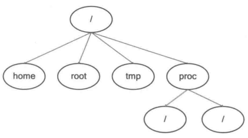

# 第2章 跟我学CentOS的安装

学习Linux首先要了解Linux的安装。安装Linux有多种方法，可以直接将Linux安装到某台机器上，也可以采用虚拟机安装。本章首先介绍虚拟机的相关知识，演示如何在虚拟机上安装Linux，然后介绍Linux的其他安装方式。通过本章，读者可以掌握Linux的系统安装过程。

本章主要涉及的知识点有：

* 认识虚拟机
* 如何安装Linux
* 安装后如何进行配置
* 旧版本如何升级

## 2.1 安装CentOS必须知道的基础知识

作为一个企业使用的专业操作系统，直接使用CentOS对初学者有较大难度。这是因为CentOS中有许多非常专业的概念和软件结构，在正式开始之前，本节将介绍安装CentOS必须知道的一些基础知识。

### 2.1.1 磁盘分区

安装一个全新的CentOS如同安装全新的Windows一样，都需要先对磁盘进行分区。对于个人学习用户而言，推荐读者使用一个比较合理的静态分区方案。一方面静态分区方案不太负责，另一方面手动进行分区方案（而不是由安装程序自行分区）可以认识Linux系统中各目录的作用。

在Windows系统中，分区类型是一个已经被淡化的概念，但在Linux系统分区时，这些概念依然存在。因此首先介绍一下分区类型：

（1）主分区：主分区可以直接用来存放数据，但在一个硬盘上主分区最多只能有4个，因此如果想在一个硬盘上创建4个以上分区，光主分区是不够的。

（2）扩展分区：扩展分区也是一种主分区，但扩展分区不能用来存放数据，但可以在扩展分区之上再划分逻辑分区。

（3）逻辑分区：逻辑分区时在扩展分区的基础上建立的，可以用来存放数据。

从上面的介绍中可以看出，如果需要划分4个以上分区，就必须使用扩展分区，然后在扩展分区的基础上划分多个逻辑分区。

明白了分区类型的概念之后，安装CentOS时还需要制订一个分区方案。在制订分区方案之前首先需要明确一个概念，在Windows系统中，不同的分区被使用C、D、E等盘符替代，只要进入这些盘符就进入了相应的分区。但在Linux系统中没有盘符的概念，不同的分区被挂在不同的目录下面，这个过程称为挂载，目录称为挂载点。只要进入挂载点目录就进入了相应的分区，这样做的好处是用户可以按自己的需要为某个目录单独扩展空间。

制定分区方案首先需要了解自己的需求，生产环境中的系统与以学习为目的的分区方案肯定不同。对于以学习为目的初学者而言，一个最简单的分区方案应该包括以下内容：

（1）/boot：创建一个约300MB~500MB的分区挂载到/boot下面，这个分区主要用来存放系统引导时使用的文件，通常我们称为引导分区。

（2）swap分区：这个分区没有挂载点，大小通常为内存的2倍。系统运行时，当物理内存不足时，系统会将内存中不常用的数据放到swap中，即swap此时被当作了虚拟内存。

（3）根分区“/“：根分区的挂载点是”/“，这个目录是系统的起点，可以将剩余的空间都分到这个分区中。此时该分区中包含了用户家目录、配置文件、数据文件等内容，初学者系统中的这些数据都不会太多，因此推荐将他们都放在一起。

以上就是一个最简单的分区方案，初学者也可以尝试将再多几个分区，将其他目录也挂载到分页中，例如分一个500MB的分区挂载到用户家目录/home下面。如果是生产环境就需要根据具体业务来决定分区方案，生产环境分区方案一般奉行系统、软件与数据分开的原则。即操作系统和应用软件放在本地硬盘上，数据单独存放于存储或单独的分区中，这种方案一方面分类清晰，读写速度相对更快；另一方面即使存放系统和软件的硬盘损坏，数据也不会有所损失。

> **提示：**分区类型在安装操作系统时不会有具体体现，但在操作系统安装完成后使用fdisk等工具添加新硬盘分区时会用到。

### 2.1.2 静态分区的缺点及逻辑卷管理简介

对于普通用户而言，直接对硬盘分区然后挂载这种使用静态分区的方法几乎没有什么不同问题。但对于某些特定的生产环境而言，这种方法弊大于利。例如要求不间断运行的数据库中心， 这类服务会随时间增加逐渐占用大量硬盘空间。如果使用静态分区方案，这类服务会在硬盘空间耗尽后自动停止，即使运维工程师及早发现，也会在更换硬盘时停止服务。因此这类要求不间断运行的服务，最好不要使用静态分区方案。

为了防止需要不间断运行服务因硬盘空间耗尽而停止，此时应该采用更加先进的逻辑卷管理（Logical Volume Manager，逻辑卷管理常简写为LVM）方案。LVM先将硬盘分区转化为物理卷（PV），然后将物理卷组成卷组（VG），然后在卷组的基础上再划分逻辑卷（LV），最后就可以使用逻辑卷存放数据了。使用逻辑卷有以下优点：

（1）可以解决硬盘空间不足，需要停止服务迁移数据的问题。虽然在划分逻辑卷时指定了大小，但只要卷组中还有剩余空间，就可为逻辑卷扩容，扩容过程是在线进行的，这意味着无须停止服务就可以进行。即使卷组中没有剩余空间，也可以向卷组添加新物理卷为卷组扩容。

（2）当硬盘空间不足时，可以添加更大的硬盘，从而将卷组中那些容量较小的硬盘移出卷组，这个过程也可以在线进行，无须关闭服务。

（3）可以为逻辑卷添加快照卷，利用这一功能可以实现数据备份等操作，而无须担心数据的一致性受到影响。

## 2.6 Linux的目录结构

Linux与Windows最大的不同之处在于Linux目录结构的设计，在开始后面的内容前，我们先来介绍Linux典型的目录结构。

登录Windows以后，打开C盘，会发现一些常见的文件夹，而登录Linux后，执行ls-l/会发现在“/”下包含很多的目录，比如etc、usr、var、bin等目录，进入其中一个目录后，看到的还是很多文件和目录。Linux的目录类似树形结构，如图2.43所示。

认识Linux的目录结构首先必须认识Linux目录结构的最顶端“/”，任何目录、文件和设备等在“/”之下。Linux的文件路径与Windows不同，Linux的文件路径类似“/data/myfile.txt”，没有Windows中盘符的概念。初学者开始对Linux的目录结构可能不是很习惯，可以把“/”当作Windows的盘符（如C盘）。表2.2对Linux中主要的目录进行说明。

| 参数        | 说明                                                         |
| ----------- | ------------------------------------------------------------ |
| /           | 根目录。文件的最顶端，/etc、/bin、/dev、/lib、/sbin应该和根目录放置在一个分区中，而类似/usr/local可以单独位于另一个分区 |
| /bin        | 存放系统所需要的重要命令，比如文件或目录操作的命令ls、cp、mkdir等。另外/usr/bin也存放了一些系统命令，这些命令对应的文件都是可执行的，普通用户可以使用大部分的命令 |
| /boot       | 这是存放Linux启动时内核及引导系统程序所需的核心文件，内核文件和grub系统引导管理器都位于此目录 |
| /dev        | 存放Linux系统下的设备文件，如光驱、磁盘等。访问该目录下某个文件相当于访问某个硬件设备，常用的是挂载光驱 |
| /etc        | 一般存放系统的配置文件，作为一些软件启动时默认配置文件读取的目录，如/etc/fstab存放系统分区信息 |
| /home       | 系统默认的用户主目录。如果添加用户时不指定用户的主目录，默认在/home下创建与用户名同名的文件夹。代码中可以用HOME环境变量表示当前用户的主目录。 |
| /lib        | 64位系统有/lib64文件夹，主要存放动态链接库。类似的目录有/usr/lib、/usr/local/lib等 |
| /lost+found | 存放一些当系统意外崩溃或机器意外关机时产生的文件碎片         |
| /mnt        | 用于存放挂载储存设备的挂载目录，如光驱等                     |
| /proc       | 存放操作系统运行时的运行信息，如进程信息、内核信息、网络信息等。此目录的内容存在于内存中，实际不占用磁盘空间。如/etc/cpuinfo存放CPU的相关信息 |
| /root       | Linux超级权限用户root的主目录                                |
| /sbin       | 存放一些系统管理的命令，一般只能由超级权限用户root执行。大多数命令普通用户一般无权限执行，类似/sbin/ifconfig，普通用户使用绝对路径也可执行，用于查看当前系统的网络配置。类似的目录有/usr/sbin;/usr/local/sbin |
| /tmp        | 临时文件目录，任何人都可以访问。系统软件或用户运行程序（如MySQL）时产生的临时文件存放在这里。此目录数据需要定期清除。重要数据不可放置在此目录下，此目录空间不宜过小 |
| /usr:       | 应用程序存放目录，如命令、帮助文件等。安装Linux软件包时默认安装到/usr/local目录下。比如/usr/share/fonts存放系统字体，/usr/share/man存放帮助文档，/usr/include存放软件的头文件等。/usr/local目录建议单独分区并设置较大的磁盘空间 |
| /var        | 这个目录的内容是经常变动的，/var/log用于存放系统日志，/var/lib存放系统库文件等 |
| /sys        | 目录与/proc类似，是一个虚拟的文件系统，主要记录与系统核心相关的信息，如系统当前已经载入的模块信息等。这个目录实际不占硬盘容量 |

> **提示：**各个发行版是由不同的公司开发，所以各个发行版之间的目录可能会有所不同。Linux各发行版本之间目录的差距比较小，不同的地方主要是提供的图形界面及操作习惯等。

## 2.7 小结

与之前的版本相比，CentOS 7 的系统结构和安装过程有较大改变。本章主要介绍了与CentOS安装相关的知识，如分区、LVM、虚拟机的使用等。还介绍了几种常见的安装方法，如光盘安装、U盘安装、升级CentOS等内容。

