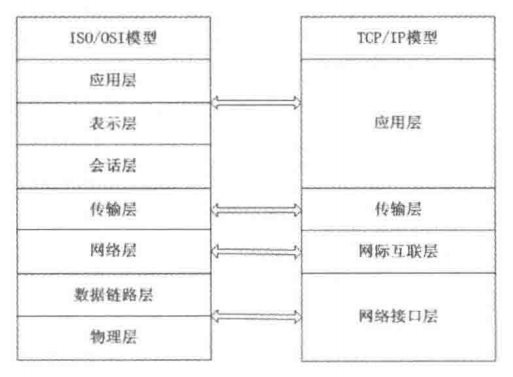
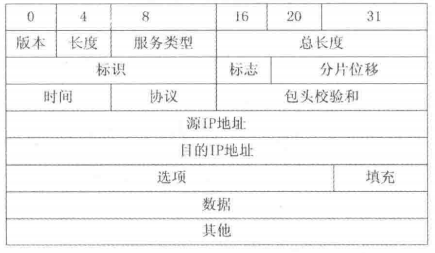

# 第3章 运维必备的网络管理技能

Linux系统在服务器市场占有很大的份额，尤其在互联网时代，要使用计算机就离不开网络。本章将讲解Linux系统的网络配置。在开始配置网络之前，需要了解一些基本的网络原理。

对于提供互联网应用的服务器，网络防火墙是其抵御攻击破坏的安全屏障，如何在攻击时及时做出有效的措施是网络应用时时刻刻面对的问题。高昂的硬件防火墙是一般开发者难以接受的。Linux系统的出现，为开发者低成本解决安全问题提供了一种可行的方案。要熟练应用Linux防火墙，首先需要了解TCP/IP网络的基本原理，理解Linux防火墙的工作原理，并熟练掌握Linux系统下提供的各种工具。

如果管理的计算机有几十台，初始化服务器配置IP地址、网关和子网掩码等参数是个烦琐耗时的过程。如果网络结构要更改，需要重新初始化网络参数，使用动态主机配置协议（Dynamic Host Configuration Protocol，DHCP）则可以避免此问题，客户端可以从DHCP服务端检索相关信息并完成相关网络配置，在系统重启后依然可以工作。尤其在移动办公领域，只要区域内有一台DHCP服务器，用户就可以在办公室之间自由活动而不必担心网络参数配置的问题。DHCP提供一种动态指定IP地址和相关网络配置参数的机制。

如今互联网应用越来越丰富，如仅仅用IP地址标识网络上的计算机是不可能完成任务的，也没有必要，于是产生了域名系统。域名系统通过一系列有意义的名称标识网络上的计算机，用户按域名请求某个网络服务时，域名系统负责将其解析为对应的IP地址，这便是DNS。

本章主要涉及的知识点有：

*网络管理协议
*常用的网络管理命令
*Linux的网络配置方法

## 3.1 网络管理协议介绍

要了解Linux的配置，首先需要了解相关的网络管理，本节主要介绍和网络配置密切相关的TCP/IP协议、UDP协议和ICMP协议

### 3.1.1 TCP/IP概述

计算机网络是由地理上分散的、具有独立功能的多台计算机，通过通信设备和线路互相连接起来，在配有相应的网络软件的情况下，实现计算机之间通信和资源共享的系统。计算机网络按其所跨越的地理范围可分为局域网（Local Area Network，LAN）和广域网（Wide Area Network，WAN）。在整个计算机网络通信中，使用最为广泛的通信协议便是TCP/IP协议，为网络互联事实上的标准协议，每个接入互联网的计算机如果进行信息传输必然使用该协议。TCP/IP协议主要包含传输控制协议（Transmission Control Protocol，简称TCP）和网际协议（Internet Protocol，简称IP）。

**1. OSI参考模型**

计算机网络是为了实现计算机之间的通信，任何双方要成功地进行通信，必须遵守一定的信息交换规则和约定，在所有的网络中，每一层的目的都是向上一层提供一定的服务，同时利用下一层所提供的功能。TCP/IP协议体系在和OSI协议体系的竞争中取得了决定性的胜利，得到了广泛的认可，成为事实上的网络协议体系标准。Linux系统也是采用TCP/IP体系结构进行网络通信。TCP/IP协议体系和OSI参考模型一样，也是一种分层结构。由基于硬件层次上的4个概念性层次构成，即网络接口层、网际互联层、传输层和应用层。OSI参考模型与TCP/IP对比如图3.1所示。

网络接口层主要为上层提供服务，完成链路控制等功能，网际互联层主要解决主机到主机之间的通信问题。其主要协议有：网际协议（IP）、地址解析协议（ARP）、反向地址解析协议（RARP）和互联网控制报文协议（ICMP）。传输层为应用层提供端到端的通信功能，同时提供流量控制，确保数据完整和正确。TCP协议位于该层，提供一种可靠的、面向连接的数据传输服务；与此对应的UDP协议，提供不可靠的、无连接的数据报传输服务。应用层对应于OSI参考模型中的上面3层，为用户提供所需要的各种应用服务，如FTP、Telnet、DNS、SMTP等。

TCP/IP协议体系及其实现中有很多概念和术语，为方便理解，本节集中介绍一些最常用的概念与术语。

**2. 包（packet）**

包（packet）是网络上传输的数据片段，也称分组，同时称作IP数据报。用户数据按照规定划分为大小适中的若干组，每个组加上包头构成一个包，这个过程称为封装。网络上使用包为单位传输。包是一种统称，在不同的层次，包有不同的名字，如TCP/IP称作帧，而IP层称为IP数据报，TCP层称为TCP报文等。图3.2为IP数据报格式。

**3. 网络字节顺序**

由于不同体系结构的计算机存储数据的格式和顺序都不一样，要使用互联网互联必须定义一个数据的表示标准。如一台计算机发送1个32位的整数至另外一台计算机，由于机器上存储整数的字节顺序可能不一样，按照源计算机的格式发送到目的主机可能会改变数字的值。TCP/IP协议定义了一种所有机器在互联网分组的二进制字段中必须使用的网络标准字节顺序（network standard byte order），与此对应的是主机字节顺序，主机字节顺序是和各个主机密切相关的。传输时需要遵循以下转换规则：“主机字节顺序→网络字节顺序→主机字节顺序”，即发送方将主机字节顺序的整数转换为网络字节顺序然后发送出去，接收方收到数据后将网络字节顺序的整数转换为自己的主机字节顺序然后处理。

**4. 地址解析协议（ARP）**

TCP/IP网络使用IP地址寻址，IP包在IP层实现路由选择。但是IP包在数据链路层的传输却需要知道设备的物理地址，因此需要一种IP地址到物理地址的转换协议。TCP/IP协议栈使用一种动态绑定技术，来实现一种维护起来既高效又容易的机制，这就是地址解析协议（ARP）。

ARP协议是在以太网这种有广播能力的网络中解决地址转换问题的方法。这种办法允许在不重新编译代码、不需维护一个集中式数据库的情况下，在网络专供动态增加新机器。其原理简单描述为：当主机A想转换某一IP地址时，通过向网络中广播一个专门的报文分组，要求具有该IP地址机以其物理地址做出应答。当所有主机都收到这个请求，但是只有符合条件 的主机才辨认该IP地址，同时发回一个应答，应答中包含其物理地址。主机A收到应答时便知道了该IP地址对应的物理硬件地址，并使用这个地址直接把数据分组发送出去。

### 3.1.2 UDP与ICMP协议简介

UDP（User Datagram Protocol）是一种无连接的传输层协议，主要用于不要求分组顺序到达的传输中，分组传输顺序的检查与排序由应用层完成，提供面向事务的简单不可靠信息传送服务。由于其不提供数据包分组、组装和不能对数据包进行排序的缺点，当报文发送之后，是无法得知其是否完全完整到达的，同时流量不易控制，如网络质量较差，则UDP协议数据包丢失会比较严重。但UDP协议具有资源消耗小，处理速度快的优点。

ICMP是Internet Control Message Protocol（Internet控制报文协议）的缩写，属于TCP/IP协议族的一个子协议，用于在IP主机、路由器之间传递控制消息。控制消息是指网络通不通、主机是否可达、路由是否可用等网络本身的消息。如经常使用的用于检查网络通不通的ping命令，ping的过程实际上就是ICMP协议工作的过程。ICMP唯一的功能是报告问题而不是纠正错误，纠正错误的任务由发送方完成。

## 3.2 网络管理命令

在进行网络配置之前首先需要了解网络管理命令的使用，本节主要介绍网络管理中常用的命令。

### 3.2.1 检查网络是否通畅或网络连接速度ping

ping常常用来测试与目标主机或域名是否可达，通过发送ICMP数据包到网络主机，并显示响应情况，并根据输出信息来确定目标主机或域名是否可达。ping的结果通常情况下是可信的，由于有些服务器可以设置禁止ping，从而使ping的结果并不是完全可信的。ping命令常用的参数说明如表3.1所示。

Linux下ping不会自动终止，需要按“Ctrl+c”终止或用参数“-c”指定要求完成的回应次数。

| 参数 | 说明                                                     |
| ---- | -------------------------------------------------------- |
| -d   | 使用Socket的SO_DEBUG功能                                 |
| -f   | 极限检查。大量且快速地送网络封包给一台机器，看其回应     |
| -n   | 只输出数值                                               |
| -q   | 不显示任何传送封包的信息，只显示最后的结果               |
| -r   | 忽略普通的Routing Table，直接将数据包送到远端主机上      |
| -R   | 记录路由过程                                             |
| -v   | 详细显示指令的执行过程                                   |
| -c   | 在发送指定数目的包后停止                                 |
| -i   | 设定间隔几秒送一个网络封包给一个机器，预设值是一秒送一次 |
| -I   | 使用指定的网络界面送出数据包                             |
| -l   | 设置在送出要求信息之前，先行发出的数据包                 |
| -p   | 设置填满数据包的范本样式                                 |
| -s   | 指定发送的数据字节数                                     |
| -t   | 设置存活数值TTL的大小                                    |

## 3.8 小结

目前Linux系统主要用作服务器，在互联网时代，要使用计算机就离不开网络。本章主要讲解的是Linux系统的网络配置。在开始配置网络之前，介绍了一些网络协议和概念。之后介绍Linux系统中的网络配置、Linux内核防火墙的工作原理和使用方法，并通过一些实例的介绍使读者可以掌握iptables的使用方法。网络数据采集与分析工具tcpdump在网络程序的调试过程中具有非常重要的作用，需上机多加练习。

