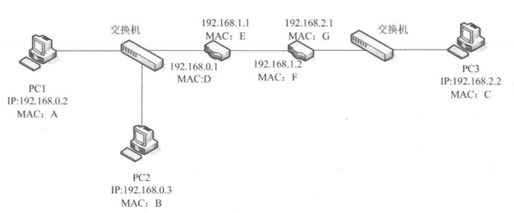
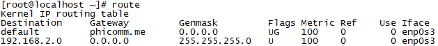

# 第4章 路由管理

对于Linux系统而言网络至关重要，这是因为大多数Linux服务器都依赖于网络。而数据包在网络中从主机出发，经过传输、转发最终到达目标主机所依赖的是网络中的路由器。路由器是根据路由条目转发数据包，因此路由管理的实质是路由条目管理。路由管理是运维人员的重要工作之一，本章将介绍Linux系统中的路由管理。

本章涉及的主要知识点有：

* 路由的基本知识
* 路由的分类
* 配置Linux路由
* 策略路由

## 4.1 认识路由

路由不仅存在于路由器中，也存在于操作系统中，不仅Linux系统有，Windows中也存在。本节将简单介绍 路由的概念。

### 4.1.1 路由的基本概念

路由器传递数据包的方法与现代邮政系统工作机制相似，先按行政区域划分设立邮局。如果信件传递仅发生在邮局内部，则直接分拣投递即可，例如北京市东城区某小区发往东城区另一小区的信件，只需在东城区邮局分拣投递即可。如果信件发生往外埠则需要借助邮政局间的运输网络，例如由北京市东城区发往四川省成都市成华区的邮件，则需要东城区邮政局将邮件交由北京市邮政局，再由北京市邮政局通过运输网络发往四川省，然后层层下发直到邮件到达收件人手中。

数据包的传递过程与邮政系统类似，也是先将计算机分组划分成不同子网，然后通过子网间的路由器传递数据包，如图4.1所示。

### 4.1.2 路由的原理

在4.1.1节中介绍了路由的基本作用，但路由运作的机制比较复杂，本小节将简要介绍路由的基本原理。

一个路由条目至少包含3个要素：子网，子网掩码和下一跳地址（在有些设备助攻使用的是下一跳设备），其主要含义如下：

* 子网：目标子网的网络号，默认路由的子网号为0.0.0.0。
* 子网掩码：目标子网的子网掩码，默认路由的子网掩码为0.0.0.0。
* 下一跳地址：目标子网数据包的转发地址。在有些路由器助攻可以使用下一跳设备，设备通常是本地接口。

通常计算机中会有多条路由条目，计算机发出数据包时会进行计算，将目标IP地址与路由条目中的子网掩码按位与，即二进制按位做乘法。如果按位与的结果与路由条目的子网相同，则采用此路由条目的下一跳地址作为转发目的地。例如在图4.1中，路由器发往PC3的数据包地址为192.168.2.2，与192.168.2.0/24网络的子网掩码按位与的结果为192.168.2.0，与子网相同，因此就会将数据包转发给192.168.1.2。

无论是计算机还是路由器，在计算路由时都遵循精确匹配原则，即如果多条路由条目都匹配目标地址，则使用最精确的条目作为转发路径。例如IP地址192.168.2.2能同事匹配192.168.0.0/16和192.168.2.0/24，但基于精确匹配原则，最终使用192.168.2.0/24这条路由条目。

### 4.1.3 Linux系统中的路由表

在计算机中通常不止一个路由条目，能正常通信的计算机至少有两个路由条目，而路由器中的路由条目可能会更多。这些路由条目存储与路由表中，如果要在Linux系统中查看路由表，可以使用route命令，如【示例4-1】所示。

在示例4-1中，命令输出了两个路由条目，第一条是指向默认网关的默认路由，第二条是与计算机直接相连的子网路由。命令输出中Flags字段中的U表示路由条目可用，G表示正在使用的网关。

### 4.1.4 静态路由和动态路由

在4.1.1小节中介绍了数据包如何从PC1发送到PC3的整个过程，当数据包到达192.168.0.1后，路由器将会计算下一步的路径，其依据就是路由器中保存的路由条目。本小节将介绍这些路由条目的来源及分类。

路由的来源有三种，第一种是路由器和计算机根据自身的网络连接自动生成的直联路由，即与自身所在同一子网的路由，只要网络持续连接直联路由就会一直存在并生效；第二种是由管理员手动添加的静态路由，静态路由仅适合于网络运作简单的环境，Linux系统中添加的路由多为静态路由；最后一种是由动态路由协议生成的动态路由。

静态路由的缺点很明显，当路由器数量增加时，子网数量也增加，这时就需要在每个路由器上为每个子网添加路由，否则就会出现无法访问的问题。如果其中一台路由器出现问题，路由条目就会失效，也会造成无法访问的问题。

为了解决静态路由的这些问题，动态路由协议应运而生，动态路由协议会根据网络状况调整各路由器的路由条目，最大程度上保持网络通畅。常见的动态路由协议有RIP、OSPF、BGP、IGRP等。

（1）RIP（Routing Information Protocol，路由信息协议）是最简单的路由协议，RIP协议要求路由器以30秒为周期，向相邻的路由器交换信息，从而让每个路由器都建立路由表。RIP建立的路由表以距离为单位，通过一个路由器称为一跳，RIP总是希望数据包通过最少的跳数到达目的地。RIP最大的优点是配置简单，但仅适用于小型网络，如果跳数超过15，数据包将不可达。由于路由器每30秒向相邻路由器交换信息，因此RIP协议的收敛时间相对较长（收敛时间是指路由协议让每个路由器建立精确并稳定的路由表的时间长度，时间越长，网络发生变化后，路由表生成得越慢，网络稳定需要的时间也越长）。

（2）OSPF（Open Shortest Path First，开放最短路径优先）是一个相对比较复杂的