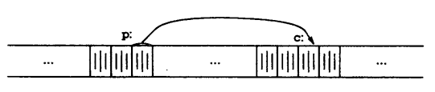

# 第5章 指针和数组

指针是一种保存变量地址的变量。在C语言中，指针的使用非常广泛，原因之一是，指针常常是表达某个计算的唯一途径，另一个原因是，同其他方法比起来，使用指针通常可以生成更高效、更紧凑的代码。指针与数组之间的关系十分密切，我们将在本章中讨论它们之间的关系，并探讨如何利用这种关系。

指针和goto语句一样，会导致程序难以理解。如果使用者粗心，指针很容易就指向了错误的地方。但是，如果谨慎地使用指针，便可以利用它写出简单、清晰的程序。在本章中我们将尽力说明这一点。

ANSI C的一个最重要的变化是，它明确地制定了操纵指针的规则。事实上，这些规则已经被很多优秀的程序设计人员和编译器所采纳。此外，ANSI C使用类型void* （指向void的指针）代替char *作为通用指针的类型。

## 5.1 指针与地址

首先，我们通过一个简单的示意图来说明内存是如何组织的。通常的机器都有一系列连续编号或编址的存储单元，这些存储单元可以单个进行操纵，也可以以连续成组的方式操纵。通常情况下，机器的一个字节可以存放一个char类型的数据，两个相邻的字节存储单元可存储一个short（短整型）类型的数据，而4个相邻的字节存储单元可以存储一个long（长整型）类型的数据。指针是能够存放一个地址的一组存储单元（通常是两个或4个字节）。因此，如果c的类型是char，并且p是指向c的指针，则可用图5-1表示它们之间的关系。



一元运算符&可用于取一个对象的地址，因此，下列语句：

```c
p = &c;
```

将把c的地址赋值给变量p，我们称p为“指向” c的指针。地址运算符`&`只能应用于内存中的对象，即变量与数组元素。它不能作用于表达式、常量或register类型的变量。

一元运算符`*`是间接寻址或间接引用运算符。当它作用于指针时，将访问指针所指向的对象。我们在这里假定x与y是整数，而`ip`是指向int的类型的指针。下面的代码段说明了如何在程序中声明指针以及如何使用运算符`&`和`*`：

```c
int x = 1, y=2, z[10];
int *ip; /* ip是指向int类型的指针 */

ip = &x; /* ip现在指向x */
y = *ip; /* y的值现在为1 */
*ip = 0; /* x的值现在为0 */
ip = &z[0]; /* ip现在指向z[0] */
```

变量x、y与z的声明方式我们已经在前面的章节中见到过。我们来看指针ip的声明，如下所示：

```c
int *ip;
```

这样声明为了便于记忆。该声明语句表明表达式*ip的结果是int类型。这种声明变量的语法与声明该变量所在表达式的语法类似。同样的原因，对函数的声明也可以采用这种方式。例如，声明

```c
dobule *dp, atof(char *);
```

表明，在表达式中，*dp和atof (s) 的值都是double类型，且atof的参数是一个指向char类型的指针。

我们应该注意，指针只能指向某种特定类型的对象，也就是说，每个指针都必须指向某种特定的数据类型。（一个例外情况是指向void类型的指针可以存放指向任何类型的指针，但它不能降解引用其自身。我们将在5.11节中详细讨论该问题）。

如果指针ip指向整形变量x，那么在x可以出现的任何上下文中都可以使用*ip，因此，语句

```c
*ip = *ip + 10;
```

将把*ip的值增加10。

一元运算符`*`和`&`的优先级比算术运算符的优先级高，因此，赋值语句

```c
y = *ip +1
```

将把*ip指向的对象的值取出并加1，然后再将结果赋值给y，而下列赋值语句：

```c
*ip += 1
```

则将ip指向的对象的值加1，它等同于

```c
++*ip
```

或

```c
(*ip)++
```

