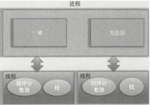

# 第1章 并发编程线程基础

## 1.1 什么是线程

在讨论什么是线程前有必要先说下什么是进程，因为线程是进程的一个实体，线程本身是不会独立存在的。进程是代码在数据集合上的一次运行活动，是系统进行资源分配和调度的基本单位，线程则是进程的一个执行路径，一个进程中至少有一个线程，进程中的多个线程共享进程的资源。

操作系统在分配资源时是把资源分配给进程的，但是CPU资源比较特殊，它是被分配到线程的，因为真正要占用CPU运行的是线程，所以也说线程是CPU分配的基本单位。

在Java中，当我们启动main函数时其实就启动了一个JVM的进程，而main函数所在的线程就是这个进程中的一个线程，也称主线程。

进程和线程的关系如图1-1所示。



由图1-1可以看到，一个进程中有多个线程，多个线程共享进程的堆和方法区资源，但是每个线程有自己的程序计数器和栈区域。

程序计数器是一块内存区域，用来记录线程当前要执行的指令地址。那么为何要将程序计数器设计为线程私有的呢？前面说了线程是占用CPU执行的基本单位，而CPU一般是使用时间片轮转方式让线程轮询占用的，所以当前线程CPU时间片用完后，要让出CPU，等下次轮到自己的时候再执行。那么如何知道之前程序执行到哪里了呢？其实程序计数器就是为了记录该线程让出CPU的执行地址的，带再次分配到时间片时线程就可以从自己私有的计数器指定地址继续执行。另外需要注意的是，如果执行的是native方法，那么pc计数器记录的是undefined地址，只有执行的是Java代码时pc计数器记录的才是下一条指令的地址。

另外每个线程都有自己的栈资源，用于存储该线程的局部变量，这些局部变量是该线程私有的，其他线程是访问不了的，除此之外栈还用来存放线程的调用栈帧。

堆是一个进程中最大的一块内存，堆是被进程中的所有线程共享的，是进程创建时分配的，堆里面主要存放使用new操作创建的对象实例。方法区则用来存放JVM加载的类、常量及静态变量等信息，也是线程共享的。

## 1.2 线程创建与运行

Java中有三种线程创建方式，分别为实现Runnable接口的run方法，继承Thread类并重写run的方法，使用FutureTask方式。

首先看继承Thread类方式的实现。

```java
package com.shenhuanjie.thread;

/**
 * ThreadTest
 *
 * @author shenhuanjie
 * @date 2019/7/19 15:59
 */
public class ThreadTest {
    public static void main(String[] args) {
        // 创建线程
        MyThread thread = new MyThread();
        // 启动线程
        thread.run();
    }

    // 继承Thread类并重写run方法
    public static class MyThread extends Thread {
        @Override
        public void run() {
            System.out.println("I'am a child thread");
        }
    }
}

```

如上代码中的MyThread类继承了Thread类，并重写了run()方法。在main函数里创建了一个MyThread的实例，然后调用该实例的start方法启动了线程。需要注意的是，当创建完thread对象后该线程并没有被启动执行，直到调用了start方法后才真正启动了线程。

其实调用start方法后线程并没有马上执行而是处于就绪状态，这个就绪状态是指线程已经获取了除CPU资源外的其他资源，等待获取CPU资源后才会真正处于运行状态。一旦run方法执行完毕，该线程就处于终止状态。

使用继承方式的好处是，在run()方法内获取当前线程直接调用this就可以了，无须使用Thread.currentthread()方法；不好的地方是Java不支持多继承，如果继承了Thread类，那么就不能再继承其他类。另外任务与代码没有分离，当多个线程执行一样的任务时需要多份任务代码，而Runable则没有这个限制。下面看实现Runnable接口的run方法方式。

```java
package com.shenhuanjie.thread;

/**
 * RunableTest
 *
 * @author shenhuanjie
 * @date 2019/7/19 16:09
 */
public class RunableTest {
    public static void main(String[] args) {
        RunableTask task = new RunableTask();
        new Thread(task).start();
        new Thread(task).start();
    }

    public static class RunableTask implements Runnable {
        @Override
        public void run() {
            System.out.println("I am a child thread");
        }
    }
}

```

如上面代码所示，两个线程共用一个task代码逻辑，如果需要，可以给RunableTask添加参数进行任务区分。另外，RunableTask可以继承其他类。但是上面介绍的两种方式都有一个缺点，就是任务没有返回值。下面看最后一种，即使用FutureTask方式。

```java
package com.shenhuanjie.thread;

import java.util.concurrent.Callable;
import java.util.concurrent.ExecutionException;
import java.util.concurrent.FutureTask;

/**
 * CallerTaskTest
 *
 * @author shenhuanjie
 * @date 2019/7/19 16:14
 */
public class CallerTaskTest {
    public static void main(String[] args) throws InterruptedException {
        // 创建异步任务
        FutureTask<String> futureTask = new FutureTask<>(new CallerTask());
        // 启动线程
        new Thread(futureTask).start();
        try {
            // 等待任务执行完毕，并返回结果
            String result = futureTask.get();
            System.out.println(result);
        } catch (ExecutionException e) {
            e.printStackTrace();
        }
    }

    /**
     * 创建任务类，类似Runable
     */
    public static class CallerTask implements Callable<String> {

        @Override
        public String call() {
            return "hello";
        }
    }
}

```

如上代码中的CallTask类实现了Callble接口的call()方法。在main函数类首先创建了一个FutrueTask对象（构造函数为CallerTask的实例），然后使用创建的FutrueTask对象作为任务创建了一个线程并启动它，最后通过futureTask.get()等待任务执行完毕并返回结果。

小结：使用继承方式的好处是方便传参，你可以在子类里面添加成员变量，通过set方法设置参数或者通过构造函数进行传递，而如果使用Runnable方式，则只能使用主线程里面被声明为final的变量。不好的地方是Java不支持多继承，如果继承了Thread类，那么子类不能再继承其他类，而Runable则没有这个限制。前两种方式都没办法拿到任务的返回结果，但是Futuretask方式可以。

## 1.3 线程通知与等待

