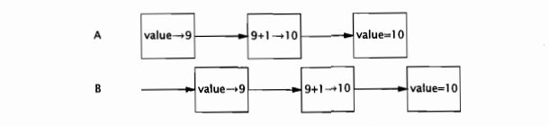

# 第1章 简介

编写正确的程序很难，而编写正确的并发程序则难上加难。与串行程序相比，在并发程序中存在更多容易出错的地方。那么，为什么还要编写并发程序？线程是Java语言中不可或缺的重要功能，它们能使复杂的异步代码变得更简单，从而极大地简化了复杂系统的开发。此外，要想充分发挥多处理器系统的强大计算能力，最简单的方式就是使用线程。随着处理器数量的持续增长，如何高效地使用并发正变得越来越重要。

## 1.1 并发简史

在早期的计算机中不包含操作系统，它们从头到尾只执行一个程序，并且这个程序能访问计算机中的所有资源。在这种裸机环境中，不仅很难编写和运行程序，而且每次只能运行一个程序，这对于昂贵并且稀有的计算机资源来说也是一种浪费。

操作系统的出现使得计算机每次能运行多个程序，并且不同的程序都在单独的进程中运行：操作系统为各个独立执行的进程分配各种资源，包括内存，文件句柄以及安全证书等。如果需要的话，在不同的进程之间可以通过一些粗粒度的通信机制来交换数据，包括：套接字、信号处理器、共享内存、信号量以及文件等。

之所以在计算机中加入操作系统来实现多个程序的同时执行，主要是基于以下原因：

**资源利用率。**  在某些情况下，程序必须等待某个外部操作执行完成，例如输入操作或输出操作等，而在等待时程序无法执行其他任何工作。因此，如果在等待的同时可以运行另一个程序，那么无疑将提高资源的利用率。

**公平性。** 不同的用户和程序对于计算机上的资源有着同等的使用权。一种高效的运行方式是通过粗粒度的时间分片（Time Slicing）使这些用户和程序能共享计算机资源，而不是由一个程序从头运行到尾，然后再启动下一个程序。

**便利性。** 通常来说，在计算多个任务时，应该编写多个程序，每个程序执行一个任务并在必要时相互通信，这比只编写一个程序来计算所有任务更容易实现。

在早期的分时系统中，每个进程相当于一台虚拟的冯·诺依曼计算机，它拥有存储指令和数据的内存空间，根据机器语言的语义以串行方式执行指令，并通过一组I/O指令与外部设备通信。对每条被执行的指令，都有相应的“下一条指令”，程序助攻的控制流是按照指令集的规则来确定的。当前，几乎所有的主流编程语言都遵循这种串行编程模型，并且在这些语言的规范中也都清晰地定义了在某个动作完成之后需要执行的“下一个动作”。

串行编程模型的优势在于其直观性和简单性，因为它模仿了人类的工作方式：每次只做一件事情，做完之后再做另一件。例如，首先起床，穿上睡衣，然后下楼，喝早茶。在编程语言中，这些现实世界中的动作可以被进一步抽象为一组粒度更细的动作。例如，喝早茶的动作可以被进一步细化：打开橱柜，挑选喜欢的茶叶，将一些茶叶倒入杯中，看看茶壶中是否有足够的水，如果没有的话加些水，将茶壶放到火炉上，点燃火炉，然后等水烧开等等。在最后一步等水烧开的过程中包含了一定程度的异步性。当正在烧水时，你可以干等着，也可以做些其他事情，例如开始烤面包（这是另一个异步任务）或者看报纸，同时留意茶壶水是否烧开。茶壶和面包机的生产商都很清楚：用户通常会采用异步方式来使用他们的产品，因此当这些机器完成任务时都会发出声音提示。但凡做事高效的人，总能在串行性与异步性之间找到合理的平衡，对于程序来说同样如此。

这些促使进程出现的因素（资源利用率、公平性以及便利性等）同样也促使着线程的出现。线程允许在同一个进程中同时存在多个程序控制流。线程会共享进程范围内的资源，例如内存句柄和文件句柄，但每个线程都有各自的程序计数器（Program Counter）、栈以及局部变量等。线程还提供了一种直观的分解模式来充分利用多处理器系统中的硬件并行性，而在同一个程序中的多个线程也可以被同时调度到多个CPU上运行。

线程也被成为轻量级进程。在大多数现代操作系统中，都是以线程为基本的调度单位，而不是进程。如果没有明确的协同机制，那么线程将彼此独立执行。由于同一个进程中的所有线程都将共享进程的内存地址空间，因此这些线程都能访问相同的变量并在同一个堆上分配对象，这就需要实现一种比在进程间共享数据粒度更细的数据共享机制。如果没有明确的同步机制来协同对共享数据的访问，那么当一个线程正在使用某个变量时，另一个线程可能同时访问这个变量，这将造成不可预测的结果。

## 1.2 线程的优势

如果使用得当，线程可以有效地降低程序的开发和维护等成本，同时提升复杂应用程序的性能。线程能够将大部分的异步工作流转换成串行工作流，因此能更好地模拟人类的工作方式和交互方式。此外，线程还可以降低代码的复杂度，使代码更容易编写、阅读和维护。

在GUI（Graphic User Interface，图形用户界面）应用程序中，线程可以提高用户界面的响应灵敏度，而在服务器应用程序中，可以提升资源利用率以及系统吞吐率。线程还可以简化JVM的实现，垃圾收集器通常在一个或多个专门的线程中运行。在许多重要的Java应用程序中，都在一定程度上用到了线程。

### 1.2.1 发挥多处理器的强大能力

过去，多处理器系统是非常昂贵和稀少的，通常只有在大型数据中心和科学计算设备中才会使用多处理器系统。但现在，多处理系统正日益普及，并且价格也在不断地降低，即使在低端服务器和中端桌面系统中，通常也会采用多个处理器。这种趋势还将进一步加快，因为通过提高时钟频率来提升性能已变得越来越困难，处理器生产厂商都开始转而在单个芯片上放置多个处理器核。所有的主流芯片制造商都开始了这种转变，而我们也已经看到了在一些机器上出现了更多的处理器。

由于基本的调度单位是线程，因此如果在程序中只有一个线程，那么最多同时只能在一个处理器上运行。在双处理器系统上，单线程的程序只能使用一半的CPU资源，而在拥有100个处理器的系统上，将有99%的资源无法使用。另一方面，多线程程序可以同时在多个处理器上执行。如果设计正确，多线程程序可以同时在多个处理器上执行。如果设计正确，多线程程序可以通过提高处理器资源的利用率来提升系统吞吐率。

使用多个线程还有助于在单处理器系统上获得更高的吞吐率。如果程序是单线程的，那么当程序等待某个同步I/O操作完成时，处理器将处于空闲状态。而在多线程程序中，如果一个线程在等待I/O操作完成，另一个线程可以继续运行，使程序能够在I/O阻塞期间继续运行。（这就好比在等待水烧开的同时看报纸，而不是等到水烧开之后再开始看报纸）。

### 1.2.2 建模的简单性

通常，当只需要执行一种类型的任务（例如修改12个错误）时，在时间管理方面比执行多种类型的任务（例如，修复错误、面试系统管理员的接任者、完成团队的知晓考核，以及为下个星期的报告做幻灯片）要简单。当只有一种类型的任务需要完成时，只需埋头工作，知道完成所有的任务（或者你已经筋疲力尽），你不需要花任何精力来琢磨下一步该做什么。而另一方面，如果需要完成多种类型的任务，那么需要管理不同任务之间的优先级和执行时间，并在任务之间进行切换，这将带来额外的开销。

对于软件来说同样如此：如果在程序中只包含一种类型的任务，那么比包含多种不同类型任务的程序要更易于编写，错误更少，也更容易测试。如果为模型中每种类型的任务都分配一个专门的线程，那么可以形成一种串行执行的假象，并将程序的执行逻辑与调试机制的细节，交替执行的操作，异步I/O以及资源等待等问题分离开来。通过使用线程，可以将复杂并且异步的工作流进一步分解为一组简单并且同步的工作流，每个工作流在一个单独的线程中运行，并在特定的同步位置进行交互。

我们可以通过一些现有的框架来实现上述目标，例如Servlet和RMI（Remote Method Invocation，远程方法调用）。框架负责解决一些细节问题，例如请求管理、线程创建、负载平衡，并在正确的时刻将请求分发给正确的应用程序组件。编写Servlet的开发人员不需要了解有多少请求在同一时刻要被处理，也不需要了解套接字的输入流或输出流是否被阻塞。当调用Servlet的service方法来响应Web请求时，可以以同步方式来处理这个请求，就好像它是一个单线程程序。这种方式可以简化组件的开发，并缩短掌握这种框架的学习时间。

### 1.2.3 异步事件的简化处理

服务器应用程序在接受来自多个远程客户端的套接字连接请求时，如果为每个连接都分配其各自的线程并且使用同步I/O，那么就会降低的开发难度。

如果某个应用程序对套接字执行读操作而此时还没有数据到来，那么这个读操作将一直阻塞，直到有数据到达。在单线程应用程序中，这不仅意味着在处理请求的过程中将停顿，而且还意味着在这个线程被阻塞期间，对所有请求的处理都将停顿。为了避免这个问题，单线程服务器应用程序必须使用非阻塞I/O，这种I/O的复杂性要远远高于同步I/O，并且很容易出错。然而，如果每个请求都拥有自己的处理线程，那么在处理某个请求时发生的阻塞将不会影响其他请求的处理。

早期的操作系统通常会将进程中可创建的线程数量限制在一个较低的阈值内，大约在数百个（甚至更少）左右。因此，操作系统提供了一些高校的方法来实现多路I/O，例如Unix的select和poll等系统调用，要调用这些方法，Java类库需要获得一组实现非阻塞I/O的包（java.nio）。然而，在现代操作系统中，线程数量已得到极大的提升，这使得在某些平台上，即使有更多的客户端，为每个客户端分配一个线程也是可行的。

### 1.2.4 响应更灵敏的用户界面

传统的GUI应用程序通常都是单线程的，从而在代码的各个位置都需要调用poll方法来获得输入事件（这种方式将给代码带来极大的混淆），或者通过一个“主事件循环（Main Event Loop）”来间接地执行应用程序的所有代码。如果在主事件循环中调用的代码需要很长时间才能执行完成，那么用户界面就会“冻结”，直到代码执行完成。这是因为只有当执行控制权返回到主事件循环后，才能处理后续的用户界面事件。

在现代的GUI框架中，例如AWT和Swing等工具，都采用一个事件分发线程（Event Dispatch Thread，EDT）来替代主事件循环。当某个用户界面事件发生时（例如按下一个按钮），在事件线程中将调用应用程序的事件处理器。由于大多数GUI框架都是单线程子系统，因此到目前为止仍然存在在主事件循环，但它现在处于GUI工具的控制下并在其自己的线程中运行，而不是在应用程序的控制下。

如果在事件线程中执行的任务都是短暂的，那么界面的响应灵敏度就较高，因为事件线程能够很快地处理用户的动作。然而，如果事件线程中的任务需要很长的执行时间，例如对一个大型文档进行拼写检查，或者从网络上获取一个资源，那界面的响应灵敏度就会降低。如果用户在执行这类任务时触发了某个动作，那么必须等待很长时间才能获得响应，因为事件线程要先执行完成该任务。更糟糕的是，不仅界面失去响应，而且即使在界面上包含了“取消”按钮，也无法取消这个长时间执行的任务，因为事件线程只有在执行完该任务后才能响应“取消”按钮的点击事件。然而，如果将这个长时间运行的任务放在一个单独的线程中运行，那么事件线程就能及时地处理界面事件，从而使用用户界面具有更高的灵敏度。

## 1.3 线程带来的风险

Java对线程的支持其实是一把双刃剑。虽然Java提供了相应的语言和库，以及一种明确的跨平台内存模型（该内存模型实现了在Java中开发“编写一次，随处运行”的并发应用程序），这些工具简化了并发应用程序的开发，但同时也提高了对开发人员的技术要求，因为在更多的程序中会使用线程。当线程还有一项鲜为人知的技术时，并发性是一个“高深的”主题，但现在，主流开发人员都必须了解线程方面的内容。

### 1.3.1 安全性问题

线程安全性可能是非常复杂的，在没有充足同步的情况下，多个线程中的操作执行顺序是不可预测的，甚至会产生奇怪的结果。在程序清单1-1的UnsafeSquence类中将产生一个整数值序列，该序列中的每个值都是唯一的。在这个类中简要说明了多个线程之间的交替操作将如何导致不可预料的结果。在单线程环境中，这个类能正确地工作，但在多线程环境中则不能。

```java
package com.shenhuanjie.thread;

import javax.annotation.concurrent.NotThreadSafe;

/**
 * UnsafeSequence
 *
 * @author shenhuanjie
 * @date 2019/7/19 9:51
 */
@NotThreadSafe
public class UnsafeSequence {
    private int value;

    /**
     * 返回一个唯一的数值
     *
     * @return
     */
    public int getNext() {
        return value++;
    }
}

```

UnsafeSequence的问题在于，如果执行时机不对，那么两个线程在调用getNext时会得到相同的值。在图1-1中给出了这种错误情况。虽然递增运算someVariable++看上去是单个操作，但事实上它包含三个独立的操作：读取value，将value加1，并将计算结果写入value。由于运行时可能将多个线程之间的操作交替执行，因此这两个线程可能同时执行读操作，从而使它们得到相同的值，并都将这个值加1.结果就是，在不同线程的调用中返回了相同的数值。



在UnsafeSequence中使用了一个非标准的标注：@NotThreadSafe。这是在本书中使用的几个自定义标注之一，用于说明类和类成员的并发属性。（其他标注包括@ThreadSafe和@Immutable，请参见附录A的详细信息）。线程安全性标注在许多方面都是有用的。如果用@ThreadSafe来标注某个类，那么开发人员可以放心地在多线程环境下使用这个类，维护人员也会发现它能保证线程安全性，而软件分析工具还可以识别出潜在的编码错误。

在UnsafeSequence类中说明的是一种常见的并发安全问题，成为竞态条件（Race Condition）。在多线程环境下，getValue是否会返回唯一的值，要取决于运行时对线程中操作的交替执行方式，这并不是我们希望看到的情况。

由于多个线程要共享相同的内存地址空间，并且是并发运行，因此它们可能会访问或修改其他线程正在使用的变量。当然，这是一种极大的便利，因为这种方式让其他线程间通信机制更容易实现数据共享。但它同样也带来了巨大的风险：线程会由于无法预料的数据变化而发生错误。当多个线程同时访问和修改相同的变量时，将会在串行编程模型中引入非串行因素，而这种非串行性是很难分析的。要使多线程程序的行为可以预测，必须对共享变量的访问操作进行协同，这样才不会在线程之间发生彼此干扰。幸运的是，Java提供了各种同步机制来协同这种访问。

通过将getNext修改为一个同步方法，可以修复UnsafeSequence中的错误，如程序清单1-2中的Sequence，这个类可以防止图1-1中错误的交替执行清空。（第2章和第3章将进一步分析这个类的工作原理。）

```java
package com.shenhuanjie.thread;

import javax.annotation.concurrent.GuardedBy;
import javax.annotation.concurrent.ThreadSafe;

/**
 * Sequence
 *
 * @author shenhuanjie
 * @date 2019/7/19 10:08
 */
@ThreadSafe
public class Sequence {
    @GuardedBy("this")
    private int Value;

    public synchronized int getNext() {
        return Value++;
    }
}

```

如果没有同步，那么无论是编译器、硬件还是运行时，都可以随意安排操作的执行时间和顺序，例如对寄存器或者处理器中的变量进行缓存，而这些被缓存的变量对于其他线程来说是暂时（甚至永久）不可见的。虽然这些技术有助于实现更优的性能，并且通常也是值得采用的方法，但它们也为开发人员带来了负担，因为开发人员必须找出这些数据在哪些位置被多个线程共享，只有这样才能使这些优化措施不破坏线程安全性。（第16章将详细介绍JVM实现了哪些顺序保证，以及同步将如何影响这些保证，但如果遵循第2章和第3章给出的指导原则，那么就可以绕开这些底层细节问题。）

### 1.3.2 活跃性问题

在开发并发代码时，一定要注意线程安全性是不可破坏的。安全性不仅对于多线程很重要，对于单线程程序同样重要。此外，线程还会导致一些在单线程程序中不会出现的问题，例如活跃性问题。

安全性的含义是“永远不发生糟糕的事情”，而活跃性则关注于另一个目标，及“某件正确的事情最终会发生”。当某个操作无法继续执行下去时，就会发生活跃性问题。在串行程序中，活跃性问题的形式之一就是无意中造成的无限循环，从而使循环之后的代码无法得到执行。线程将带来其他一些活跃性问题。例如，如果线程A在等待线程B释放其持有的资源，而线程B永远都不释放该资源，那么A就会永久地等待下去。第10章将介绍各种形式的活跃性问题，以及如何避免这些问题，包括死锁（10.1节），饥饿（10.3.1节），以及活锁（10.3.3节）。与大多数并发性错误一样，导致活跃性问题的错误同样是难以分析的，因为它们依赖于不同线程的事件发生时序，因此在开发或者测试中并不总是能够重现。

### 1.3.3 性能问题

与活跃性问题密切相关的是性能问题。活跃性意味着某件正确的事情最终会发生，但却不够好，因为我们通常希望正确的事情尽快发生。性能问题包括多个方面，例如服务时间过长，响应不灵敏，吞吐率过低，资源消耗过高，或者可伸缩性较低等。与安全性和活跃性一样，在多线程程序中不仅存在与单线程程序相同的性能问题，而且还存在由于使用线程而引入的其他性能问题。

在设计良好的并发应用程序中，线程能提升程序的性能，但无论如何，线程总会带来某种程度的运行时开销。在多线程程序中，当线程调度器临时挂起活跃线程并转而运行另一个线程时，就会频繁地出现上下文切换操作（Context Switch），这种操作将带来极大的开销：保存和恢复执行上下文，丢失局部性，并且CPU时间将更多地花在线程调度而不是线程运行上。当线程共享数据时，必须使用同步机制，而这些机制往往会抑制某些编译器优化，使内存缓冲区中的数据无效，以及增加共享内存总线的同步流量。所有这些因素都将带来额外的性能开销，第11章将详细介绍如何分析和减少这些开销。

## 1.4 线程无处不在

即使在程序中没有显式地创建线程，但在框架中仍可能会创建线程，因此在这些线程中调用的代码同样必须是线程安全的。这将给开发人员在设计和实现上带来沉重负担，因为开发线程安全的类比开发非线程安全的类要更加谨慎和细致。

每个Java应用程序都会使用线程。当JVM启动时，它将为JVM的内部任务（例如，垃圾收集、终结操作等）创建后台线程，并创建一个主线程来运行main方法。AWT（Abstract Window Toolkit，抽象窗口工具库）和Swing的用户界面框架来创建线程来管理用户界面事件。Timer将创建线程来执行延迟任务。一些组件框架，例如Servlet和RMI，都会创建线程池并调用这些线程中的方法。

如果要使用这些功能，那么就必须熟悉并发性和线程安全性，因为这些框架将创建线程并且在这些线程中调用程序中的代码。虽然将并发性认为是一种“可选的”或者“高级的“语言功能固然理想，但现实情况是，几乎所有的Java应用程序都是多线程的，因此在使用这些框架时仍旧需要对应用程序状态的访问进行协同。

当某个框架在应用程序中引入并发性时，通常不可能将并发性仅局限于框架代码，因为框架本身会回调（Callback）应用程序的代码，而这些代码将访问应用程序的状态。同样，对线程安全性的需求也不能局限于被调用的代码，而是要延伸到需要访问这些代码所访问的程序状态的所有代码路径。因此，对线程安全性的需求将在程序中蔓延开来。

> 框架通过在框架线程中调用应用程序代码将并发性引入到程序中。在代码中将不可避免地访问应用程序状态，因此所有访问这些状态的代码路径都必须是线程安全的。

下面给出的模块都将在应用程序之外的线程中调用程序的代码。尽管线程安全性需求可能源自这些模块，但却不会止步于它们，而是会延伸到整个应用程序。

**Timer** 。Timer类的作用是使任务在稍后的时刻运行，或者运行一次，或者周期性地运行。引入Timer可以会使串行程序变得复杂，因为TimerTask将在Timer管理的线程中执行，而不是由应用程序来管理。如果某个TimerTask访问了应用程序中其他线程访问的数据，那么不仅TimerTask需要以线程安全的方式来访问数据，其他类也必须采用线程安全的方式访问该数据。通常，要实现这个目标，最简单的方式是确保TimerTask访问的对象本身是线程安全的，从而就能把线程安全性封装在共享对象内部。

**Servlet和JavaServer Page（JSP）** 。Servlet框架用于部署网页应用程序以及分布来自HTTP客户端的请求。到达服务器的请求可能会通过一个过滤器链被分发到正确的Servlet或JSP。每个Servlet都表示一个程序的逻辑组件，在高吞吐率的网站中，多个客户端可能同时请求一个Servlet的服务。在Servlet规范中，Servlet同样需要满足被多个线程同时调用，换句话说，Servlet需要是线程安全的。

即使你可以确保每次只有一个线程调用某个Servlet，但在构建网页应用程序时仍然必须注意线程安全性。Servlet通常会访问与其他Servlet共享的信息，例如应用程序中的对象（这些对象保存在ServletContext中）或者会话中的对象（这些对象保存在每个客户端的HttpSession中）。当一个Servlet访问在多个Servlet或者请求中共享的对象时，必须正确地协同对这些对象的访问，因为多个请求可能在不同的线程中同时访问这些对象。Servlet和JSP，以及在ServletContext和HttpSession等容器中保存的Servlet过滤器和对象等，都必须是线程安全的。

**远程方法调用（Remote Method Invocation，RMI）** 。RMI使代码能够调用在其他JVM中运行的对象。当通过RMI调用某个远程方法时，传递给方法的参数必须被打包（也称为列集[Marshaled]）到一个字节流中，通过网络传输给远程JVM，然后由远程JVM拆包（或者称为散集[Unmarshaled]）并传递给远程方法。

当RMI代码调用远程对象时，这个调用将在哪个线程中执行？你并不知道，但肯定不会在你创建的线程中，而是将在一个由RMI管理的线程中调用对象。RMI会创建多少个线程？同一个远程对象上的同一个远程方法会不会在多个RMI线程中被同时调用？

远程对象必须注意两个线程安全性问题：正确地协同在多个对象中共享的状态，以及对远程对象本身状态的访问（由于同一个对象可能会在多个线程中被同时访问）。与Servlet相同，RMI对象应该做好被多个线程同时调用的准备，并且必须确保他们自身的线程安全性。

Swing和AWT。GUI应用程序的一个固有属性是异步性。用户可以在任意时刻选择一个菜单项或者按下一个按钮，应用程序就会及时响应，即使应用程序当时正在执行其他的任务。Swing和AWT很好的地解决了这个问题，它们创建了单独的线程来处理用户触发的事件，并对呈现给用户的图形界面进行更新。

Swing的一些组件并不是线程安全的，例如JTable。相反，Swing程序通过将所有对GUI组件的访问局限性在事件线程中以实现线程安全性。如果某个应用程序希望在事件线程之外控制GUI，那么必须将控制GUI的代码放在事件线程中运行。

当用户触发某个UI动作时，在事件线程中就会有