# 第18章 Java I/O系统

> 对程序语言的设计者来说，创建一个好的输入/输出（I/O)系统是一项艰难的任务。

现有的大量不同方案已经说明了这一点。挑战似乎来自于要涵盖所有的可能性。不仅存在各种I/O源端和想要与之通信的接收端（文件、控制台、网络链接等），而且还需要以多种不同的方式与它们进行通信（顺序、随机存取、缓冲、二进制、按字符、按行、按字等）。

Java类库的设计者通过创建大量的类来解决这个难题。一开始，可能会对Java I/O系统提供了如此多的类而感到不知所措（具有讽刺意味的是，Java I/O设计的初衷是为了避免过多的类）。自从Java 1.0版本以来，Java的I/O类发生了明显改变，在原来面向字节的类中添加了面向字符和基于Unicode的类。在JDK 1.4中，添加了nio类（对于“新I/O”来说，这是一个从现在起我们将要使用若干年的名称，即使它们在JDK1.4中就已经被引入了，因此它们已经“旧‘了）添加进来是为了改进性能及功能。因此，在充分理解Java I/O系统以便正确地运用之前，我们需要学习相当数量的类。另外，很有必要理解I/O类库的演化过程，即使我们的第一反应是“不要用历史打扰我，只需告诉我怎么用。”问题是，如果缺乏历史的眼光，很快我们就会对什么时候该使用哪些类，以及什么时候不该使用它们而感到迷惑。

本章就介绍Java标准类库中各种各样的类以及它们的用法。

## 18.1 File类

在学习那些真正用于在流中读写数据的类之前，让我们先看一个实用类库工具，它可以帮助我们处理文件目录问题。

**File**（文件）类这个名字有一定的误导性；我们可能会认为它指代的是文件，实际上却并非如此。它既能代表一个特定文件的名称，又能代表一个目录下的一组文件的名称。如果它指的是一个文件集，我们就可以理解返回的是一个数组而不是某个更具灵活性的内容器，因为元素的个数是固定的，所以如果我们想取得不同的目录列表，只需要再创建一个不同的File对象就可以了。实际上，FilePath（文件路径）对这个类来说是个更好的名字。本节举例示范了这个类的用法，包括了与它相关的**FilenameFilter**接口。

### 18.1.1 目录列表器

假设我们想查看一个目录列表，可以用两种方法来使用File对象。如果我们调用不带参数的list()方法，便可以获得此File对象包含的全部列表。然而，如果我们想获得一个受限列表，例如，想要得到所有扩展名为.java的文件，那么我们就要用到“目录过滤器”，这个类会告诉我们该怎样显示符合条件的File对象。

下面是一个示例，注意，通过使用java.utils.Array.sort()和String.CASE_INSENEITVE.ORDERComponent，可以很容易地对结果进行排序（按字母顺序）。

```java
package com.shenhuanjie.io;

import java.io.File;
import java.util.Arrays;

/**
 * DirList
 * <p>
 * Display a directory listing using regular expressions.
 *
 * @author shenhuanjie
 * @date 2019/6/27 17:34
 */
public class DirList {
    public static void main(String[] args) {
        File path = new File(".");
        String[] list;
        if (args.length == 0) {
            list = path.list();
        } else {
            list = path.list(new DirFilter(args[0]));
        }
        Arrays.sort(list, String.CASE_INSENSITIVE_ORDER);
        for (String dirItem : list) {
            System.out.println(dirItem);
        }
    }
}

```

```java
package com.shenhuanjie.io;

import java.io.File;
import java.io.FilenameFilter;
import java.util.regex.Pattern;

/**
 * DirFilter
 * <p>
 * Display a dirctory listing using regular expression.
 * <p>
 * {Args:C.*\.java}
 *
 * @author shenhuanjie
 * @date 2019/6/27 17:07
 */
public class DirFilter implements FilenameFilter {
    private Pattern pattern;

    /**
     * DirFilter
     */
    public DirFilter(String regex) {
        pattern = Pattern.compile(regex);
    }

    /**
     * Tests if a specified file should be included in a file list.
     *
     * @param dir  the directory in which the file was found.
     * @param name the name of the file.
     * @return <code>true</code> if and only if the name should be
     * included in the file list; <code>false</code> otherwise.
     */
    @Override
    public boolean accept(File dir, String name) {
        return pattern.matcher(name).matches();
    }
}

```

```java
/**
 * .idea
 * pom.xml
 * src
 * target
 * think-in-java.iml
 */
```

这里，DirFilter类“实现”了FilenameFilter接口。请注意FilenameFilter接口是多么简单：

```java
/*
 * Copyright (c) 1994, 2013, Oracle and/or its affiliates. All rights reserved.
 * ORACLE PROPRIETARY/CONFIDENTIAL. Use is subject to license terms.
 */

package java.io;

/**
 * Instances of classes that implement this interface are used to
 * filter filenames. These instances are used to filter directory
 * listings in the <code>list</code> method of class
 * <code>File</code>, and by the Abstract Window Toolkit's file
 * dialog component.
 *
 * @author  Arthur van Hoff
 * @author  Jonathan Payne
 * @see     java.awt.FileDialog#setFilenameFilter(java.io.FilenameFilter)
 * @see     java.io.File
 * @see     java.io.File#list(java.io.FilenameFilter)
 * @since   JDK1.0
 */
@FunctionalInterface
public interface FilenameFilter {
    /**
     * Tests if a specified file should be included in a file list.
     *
     * @param   dir    the directory in which the file was found.
     * @param   name   the name of the file.
     * @return  <code>true</code> if and only if the name should be
     * included in the file list; <code>false</code> otherwise.
     */
    boolean accept(File dir, String name);
}

```

DirFilter这个类存在的唯一原因就是将accept()方法。创建这个类的目的在于把accept()方法提供给list()使用，使list()可以回调accept()，进而以决定哪些文件包含在列表中。因此，这种结构常常也称为**回调**。更具体地说，这是一个**策略模式**的例子，因为list()实现了基本的功能，而且按照FillenameFilter的形式提供了这个**策略**，以便完善list()在提供服务时所需的算法。因为list()接受FilenameFilter对象作为参数，这意味着我们可以传递实现了FilenameFilter接口的任何类的对象，用以选择（甚至在运行时）list()方法的行为方式。策略的目的就是提供了代码行为的灵活性。

accept()方法必须接受一个代表某个特定文件所在目录的File对象，以及包含了那个文件名的一个String。记住一点：list()方法会为此目录对象下的每个文件名调用accept()，来判断该文件是否包含在内；判断结果由accept()返回的布尔值表示。

accept()会使用一个正则表达式的matcher对象，来查看此正则表达式regex是否匹配这个文件的名字。通过accept()，list()方法会返回一个数组。

**匿名内部类**

这个例子很适合用一个匿名内部类（第8章介绍过）进行改写。首先创建一个filter()方法，它会返回一个指向FilenameFilter的引用：

```java
package com.shenhuanjie.io;

import java.io.File;
import java.io.FilenameFilter;
import java.util.Arrays;
import java.util.regex.Pattern;

/**
 * DirList2
 * <p>
 * Uses anonymous inner classes.
 *
 * @author shenhuanjie
 * @date 2019/6/27 17:54
 */
public class DirList2 {
    /**
     * filter
     *
     * @param regex
     * @return
     */
    public static FilenameFilter filter(final String regex) {
        // Creation of anonymous inner class:
        return new FilenameFilter() {
            private Pattern pattern = Pattern.compile(regex);

            @Override
            public boolean accept(File dir, String name) {
                return pattern.matcher(name).matches();
            }
        };// End of anonymous inner class
    }

    /**
     * main
     *
     * @param args
     */
    public static void main(String[] args) {
        File path = new File(".");
        String[] list;
        if (args.length == 0) {
            list = path.list();
        } else {
            list = path.list(filter(args[0]));
        }
        Arrays.sort(list, String.CASE_INSENSITIVE_ORDER);
        for (String dirItem : list) {
            System.out.println(dirItem);
        }
    }

}

```

注意，传向filter()的参数必须是final的。这在匿名内部类中是必需的，这样它才能够使用来自该类范围之外的对象。

这个设计有所改进，因为现在FilenameFilter类紧密地和DirList2绑定在一起。然而，我们可以进一步修改该方法，定义一个作为list()参数的匿名内部类；这样一来程序会变得更小：

```java
package com.shenhuanjie.io;

import java.io.File;
import java.io.FilenameFilter;
import java.util.Arrays;
import java.util.regex.Pattern;

/**
 * DirList3
 * <p>
 * Building the anonymous inner class "in-place"
 *
 * @author shenhuanjie
 * @date 2019/6/27 18:18
 */
public class DirList3 {
    public static void main(String[] args) {
        File path = new File(".");
        String[] list;
        if (args.length == 0) {
            list = path.list();
        } else {
            list = path.list(new FilenameFilter() {
                private Pattern pattern = Pattern.compile(args[0]);

                @Override
                public boolean accept(File dir, String name) {
                    return pattern.matcher(name).matches();
                }
            });
        }
        Arrays.sort(list, String.CASE_INSENSITIVE_ORDER);
        for (String dirItem : list) {
            System.out.println(dirItem);
        }
    }
}
/**
 * .idea
 * pom.xml
 * src
 * target
 * think-in-java.iml
 */

```

既然匿名内部类直接使用args[0]，那么传递给main()方法的参数现在就是final的。

这个例子展示了匿名内部类怎样通过创建特定的、一次性的类来解决问题。此方法的一个优点就是将解决特定问题的代码隔离、聚拢于一点。而另一方面，这种方法却不易阅读，因此要谨慎使用。

### 18.1.2 目录实用工具

程序设计中一项常见的任务就是在文件集上执行操作，这些文件要么在本地目录中，要么遍布于整个目录树中。如果有一种工具能够为你产生这个文件集，那么它会非常有用。下面的实用工具类就可以通过使用local()方法产生由本地目录中的文件构成的File对象数组，或者通过使用walk()方法产生给定目录下的由整个目录树中所有文件构成的List<File>（File对象比文件名更有用，因为File对象包含更多的信息）。这些文件是基于你提供的正则表达式而被选中的。

```java
package com.shenhuanjie.util;

import java.io.File;
import java.io.FilenameFilter;
import java.util.ArrayList;
import java.util.Iterator;
import java.util.List;
import java.util.regex.Pattern;

/**
 * Directory
 * <p>
 * Produce a sequence of File objects that match a
 * regular expression in either a local directory.
 * or by walking a directory tree.
 *
 * @author shenhuanjie
 * @date 2019/6/27 21:27
 */
public final class Directory {
    /**
     * local
     *
     * @param dir
     * @param regex
     * @return
     */
    public static File[] local(File dir, final String regex) {
        return dir.listFiles(new FilenameFilter() {
            private Pattern pattern = Pattern.compile(regex);

            @Override
            public boolean accept(File dir, String name) {
                return pattern.matcher(new File(name).getName()).matches();
            }
        });
    }

    /**
     * local
     *
     * @param path
     * @param regex
     * @return
     */
    public static File[] local(String path, final String regex) {
        //Overloaded
        return local(new File(path), regex);
    }

    /**
     * TreeInfo
     * <p>
     * A two-tuple for returning a pair of objects;
     */
    public static class TreeInfo implements Iterable<File> {
        public List<File> files = new ArrayList<File>();
        public List<File> dirs = new ArrayList<File>();

        /**
         * walk
         *
         * @param start
         * @param regex
         * @return
         */
        public static TreeInfo walk(String start, String regex) {
            //Begin recursion
            return recurseDirs(new File(start), regex);
        }

        /**
         * walk
         *
         * @param start
         * @param regex
         * @return
         */
        public static TreeInfo walk(File start, String regex) {
            //Overloaded
            return recurseDirs(start, regex);
        }

        /**
         * walk
         *
         * @param start
         * @return
         */
        public static TreeInfo walk(File start) {
            // Everything
            return recurseDirs(start, ".*");
        }

        /**
         * walk
         *
         * @param start
         * @return
         */
        public static TreeInfo walk(String start) {
            return recurseDirs(new File(start), ".*");
        }

        /**
         * recurseDirs
         *
         * @param startDir
         * @param regex
         * @return
         */
        private static TreeInfo recurseDirs(File startDir, String regex) {
            TreeInfo result = new TreeInfo();
            for (File item : startDir.listFiles()) {
                if (item.isDirectory()) {
                    result.dirs.add(item);
                    result.addAll(recurseDirs(item, regex));
                } else
                    //Regular file
                    if (item.getName().matches(regex)) {
                        result.files.add(item);
                    }
            }
            return result;
        }

        /**
         * Simple validation test;
         *
         * @param args
         */
        public static void main(String[] args) {
            if (args.length == 0) {
                System.out.println(walk("."));
            } else {
                for (String arg : args) {
                    System.out.println(walk(arg));
                }
            }
        }

        /**
         * The default iterable element is the file list:
         * <p>
         * Returns an iterator over elements of type {@code T}.
         *
         * @return an Iterator.
         */
        @Override
        public Iterator<File> iterator() {
            return files.iterator();
        }

        /**
         * addAll
         *
         * @param other
         */
        void addAll(TreeInfo other) {
            files.addAll(other.files);
            dirs.addAll(other.dirs);
        }

        /**
         * toString
         *
         * @return
         */
        @Override
        public String toString() {
            return "dirs:" + PPrint.pformat(dirs) +
                    "\n\nfiles:" + PPrint.pformat(files);
        }
    }
}

```

local()方法使用被称为listFile()的File.list()的变体来产生File数组。可以看到，它还使用了FilenameFilter。如果需要List而不是数组，你可以使用Array.asList()自己对结果进行转换。

walk()方法将开始目录的名字转换为File对象，然后调用recurseDirs()，该方法将递归地遍历目录，并在每次递归中都收集更多的信息。为了区分普通文件和目录，返回值实际上是一个对象“元组”——一个List持有所有普通文件，另一个持有目录。这里，所有的域都被有意识地设置成了public，因为TreeInfo的使命只是将对象收集起来——如果你只是返回List，那么就不需要将其设置为private，因为你只是返回一个对象对，不需要将它们设置为private。注意，TreeInfo实现了Iterable<File>，它将产生文件，使你拥有在文件列表上的“默认迭代”，而你可以通过声明“.dirs”来指定目录。

TreeInfo.toString()方法使用了一个“灵巧打印机”类，以使输出更容易浏览。容器默认的toString()方法会在单个行中打印容器中的所有元素，对于大型集合来说，这会变得难以阅读，因此你可能希望使用可替换的格式化机制。下面是一个可以添加新行并缩进所有元素的工具：

```java
package com.shenhuanjie.util;

import java.util.Arrays;
import java.util.Collection;

/**
 * PPrint
 *
 * @author shenhuanjie
 * @date 2019/6/27 21:38
 */
public class PPrint {
    /**
     * pformat
     *
     * @param objects
     * @return
     */
    public static String pformat(Collection<?> objects) {
        if (objects.size() == 0) {
            return "[]";
        }
        StringBuilder result = new StringBuilder("[");
        for (Object elem : objects) {
            if (objects.size() != 1) {
                result.append("\n  ");
            }
            result.append(elem);
        }
        if (objects.size() != 1) {
            result.append("\n");
        }
        result.append("]");
        return result.toString();
    }

    /**
     * pprint
     *
     * @param objects
     */
    public static void pprint(Collection<?> objects) {
        System.out.println(pformat(objects));
    }

    /**
     * pprint
     *
     * @param objectList
     */
    public static void pprint(Object[] objectList) {
        System.out.println(pformat(Arrays.asList(objectList)));
    }
}

```

pformat()方法可以从Collection中产生格式化的String，而pprint()方法使用pformat()来执行其任务。注意，没有任何元素和只有一个元素这两种特例进行了不同的处理。上面还有一个用于数组的pprint()版本。

Directory实用工具放在了util包中，以使其更容易地被获得。下面的例子说明了可以如何使用它的样本：

```java
package com.shenhuanjie.io;

import com.shenhuanjie.util.Directory;
import com.shenhuanjie.util.PPrint;

import java.io.File;

/**
 * DirectoryDemo
 * <p>
 * Simple use of Directory utilities.
 *
 * @author shenhuanjie
 * @date 2019/6/27 22:15
 */
public class DirectoryDemo {
    /**
     * main
     *
     * @param args
     */
    public static void main(String[] args) {
        // All directories:
        PPrint.pprint(Directory.TreeInfo.walk(".").dirs);
        // All files beginning with 'T'
        for (File file : Directory.local(".", "T.*")) {
            System.out.println(file);
        }
        System.out.println("----------");
        // All Java files beginning with 'T':
        for (File file : Directory.TreeInfo.walk(".", "T.*\\.java")) {
            System.out.println(file);
        }
        System.out.println("==========");
        // Class files containing "Z" or "z":
        for (File file : Directory.TreeInfo.walk(".", ".*[Zz].*\\.class")) {
            System.out.println(file);
        }

    }
}

```

你可能需要更新一下在第13章中学习到的有关正则表达式的知识，以理解在local()和walk()中的第二个参数。

我们可以更进一步，创建一个工具，它可以在目录中穿行，并且跟进Strategy对象来处理这些目录中的文件（这是策略设计模式的另一个示例）：

```java
package com.shenhuanjie.util;

import java.io.File;
import java.io.IOException;

/**
 * ProcessFiles
 *
 * @author shenhuanjie
 * @date 2019/6/27 22:42
 */
public class ProcessFiles {
    private Strategy strategy;
    private String ext;

    /**
     * ProcessFiles
     *
     * @param strategy
     * @param ext
     */
    public ProcessFiles(Strategy strategy, String ext) {
        this.strategy = strategy;
        this.ext = ext;
    }

    /**
     * main
     *
     * @param args
     */
    public static void main(String[] args) {
        new ProcessFiles(file -> System.out.println(file), "java").start(args);
    }

    /**
     * start
     *
     * @param args
     */
    public void start(String[] args) {
        try {
            if (args.length == 0) {
                processDirectoryTree(new File("."));
            } else {
                for (String arg : args) {
                    File fileArg = new File(arg);
                    if (fileArg.isDirectory()) {
                        processDirectoryTree(fileArg);
                    } else
                        // Allow user to leave off extension:
                        if (!arg.endsWith("." + ext)) {
                            arg += "." + ext;
                        }
                    strategy.process(new File(arg).getCanonicalFile());
                }
            }

        } catch (IOException e) {
            throw new RuntimeException(e);
        }
    }

    /**
     * processDirectoryTree
     *
     * @param root
     * @throws IOException
     */
    private void processDirectoryTree(File root) throws IOException {
        for (File file : Directory.TreeInfo.walk(root.getAbsolutePath(), ".*\\." + ext)) {
            strategy.process(file.getCanonicalFile());
        }
    }

    /**
     * Strategy
     */
    public interface Strategy {
        void process(File file);
    }
}

```

Strategy接口内嵌在ProcessFiles中，使得如果你希望实现它，就必须实现ProcessFiles.Strategy，它为读者提供了更多的上下文信息。ProcessFiles执行了查找具有特定扩展名（传递给构造器的ext参数）的文件所需的全部工作，并且当它找到匹配的文件时，将直接把文件传递给Strategy对象（也是传递给构造器的参数）。

如果你没有提供任何参数，那么ProcessFiles就假设你希望遍历当前目录下的所有目录。你也可以指定特定的文件，带不带扩展名都可以（如果必需的话，它会添加上扩展名），或者指定一个或多个目录。

在main()中，你看到了如何使用这个工具的基本示例，它可以根据你提供的命令行来打印所有的Java源代码文件的名字。

### 18.1.3 目录的检查及创建

File类不仅仅只代表存在的文件或目录。也可以用File对象来创建新的目录或尚不存在的整个目录路径。我们还可以查看文件的特性（如：大小，最后修改日期，读/写），检查某个File对象代表的是一个文件还是一个目录，并可以删除文件。下面的示例展示了File类的一些其他方法（请参考http://java.sun.com上的HTML文档以全面了解它们）。

```java
package com.shenhuanjie.io;

import java.io.File;

/**
 * MakeDirectories
 * <p>
 * Demonstrates the use of the File class to
 * create directories and manipulate files.
 *
 * @author shenhuanjie
 * @date 2019/6/28 9:14
 */
public class MakeDirectories {
    private static void usage() {
        System.err.println(
                "Usage:MakeDirectories path1 ...\n" +
                        "Creates each path\n" +
                        "Usage:MakeDirectories -d path1 ...\n" +
                        "Deletes each path\n" +
                        "Usage:MakeDirectories -r path1 path2\n" +
                        "Rename from path1 to path2"
        );
        System.exit(1);
    }

    private static void fileData(File file) {
        System.out.println(
                "Absolute path: " + file.getAbsolutePath() +
                        "\n Can read: " + file.canRead() +
                        "\n Can write: " + file.canWrite() +
                        "\n getName: " + file.getName() +
                        "\n getParent: " + file.getParent() +
                        "\n getPath: " + file.getPath() +
                        "\n length: " + file.length() +
                        "\n lastModified: " + file.lastModified()
        );
        if (file.isFile()) {
            System.out.println("It's a file");
        } else if (file.isDirectory()) {
            System.out.println("It's a directory");
        }
    }

    public static void main(String[] args) {
        if (args.length < 1) {
            usage();
        }
        if (args[0].equals("-r")) {
            if (args.length != 3) {
                usage();
            }
            File old = new File(args[1]);
            File rname = new File(args[2]);
            old.renameTo(rname);
            fileData(old);
            fileData(old);
            return; //Exit main
        }
        int count = 0;
        boolean del = false;
        if (args[0].equals("-d")) {
            count++;
            del = true;
        }
        count--;
        while (++count < args.length) {
            File file = new File(args[count]);
            if (file.exists()) {
                System.out.println(file + " exists");
                if (del) {
                    System.out.println("deleting..." + file);
                    file.delete();
                }
            } else {
                if (!del) {
                    file.mkdirs();
                    System.out.println("created " + file);
                }
            }
            fileData(file);
        }
    }
}

```

在fileData()中，可以看到用到了多种不同的文件特征查询方法来显示文件或目录路径的信息。main()方法首先调用的是renameTo()，用来把一个文件重命名（或移动）到由参数所指示的另一个完全不同的新路径（也就是另一个File对象）下面。这同样适用于任意长度的文件目录。

实践上面的程序可以发现，我们可以产生任意复杂的目录路径，因为mkdirs()可以为我们做好这一切。

## 18.2 输入和输出

编程语言的I/O类库中常使用流这个抽象概念，它代表任何有能力产出数据的数据源对象或者是有能力接收数据的接收端对象。“流”屏蔽了实际的I/O设备中处理数据的细节。

Java类库中的I/O类分成输入和输出两部分，可以在JDK文档里的类层次结构中查看到。通过继承，任何自Inputstream或Reader派生而来的类都含有名为read()的基本方法，用于读取单个字节或者字节数组。同样，任何自OutputStream或Writer派生而来的类都含有名为write()的基本方法，用于写单个字节或者字节数组。但是，我们通常不会用到这些方法，它们之所以存在是因为别的类可以使用它们，以便提供更有用的接口。因此，我们很少使用单一的类来创建流对象，而是通过叠合多个对象来提供所期望的功能（这是装饰器设计模式，你将在本节中看到它）。实际上，Java中“流”类库让人迷惑的主要原因就在于：创建单一的结果流，却需要创建多个对象。

有必要安装这些类的功能对它们进行分类。在Java 1.0中，类库的设计者首先限定与输入有关的所有类都应该从InputStream继承，而与输出有关的所有类都应该从OutputStream继承。

正如在本书中所实践的，我将尝试着提供这些类的总揽，但是我必须假设你确实将会使用JDK文档来确定所有的细节，例如某个特定类的详尽的方法列表。

### 18.2.1 InputStream类型

InputStream的作用是用来表示那些从不同数据源产生输入的类。如表18-1所示，这些数据源包括：

1）字节数组。

2）String对象。

3）文件。

4）“管道”，工作方式与实际管道相似，即，从一端输入，从另一端输出。

5）一个由其他种类的流组成的序列，以便我们可以将它们收集合并在一个流内。

6）其他数据源，如Internet连接等（参见可以在www.MindView.net获得的《Thinking in Enterprise Java》）。

每一种数据源都有相应的InputStream子类。另外，FilterInputStream也属于一种InputStream，为“装饰器”（decorator）类提供基类，其中，”装饰器“类可以把属性或有用的接口与输入流连接在一起。我们稍后再讨论它。

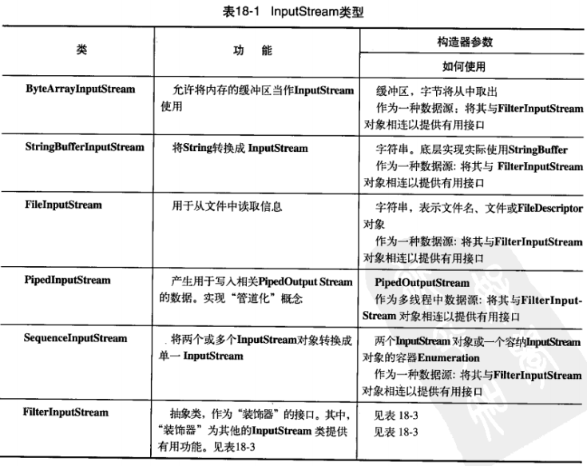

### 18.2.2 OutputStream类型

如表18-2所示，该类别的类决定了输出所要去往的目标：字节数组（但不是String，不过你当然可以用字节数组自己创建）、文件或管道。

另外，FilterOutputStream为“装饰器”类提供了一个基类，“装饰器”类把属性或者有用的接口与输出流连接起来，这些稍后会讨论。

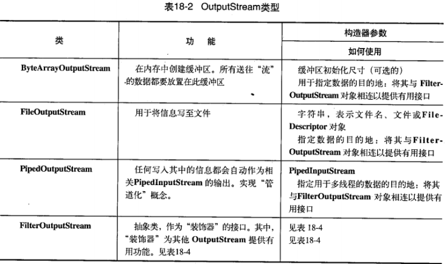

## 18.3 添加属性和有用的接口

装饰器在第15章引入。Java I/O类库需要多种不同功能的组合，这正是使用装饰器模式的理由所在。这也是Java I/O类库里存在filter（过滤器）类的原因所在抽象类filter是所有装饰器类的基类。装饰器必须具有和它所装饰的对象相同的接口，但它也可以扩展接口，而这种情况只发生在个别filter类中。

但是，装饰器模式也有一个缺点：在编写程序时，它给我们提供了相当多的灵活性（因为我们可以很容易地混合和匹配属性），但是它同时也增加了代码的复杂性。Java I/O类库操作不便的原因在于：我们必须创建许多类——“核心”I/O类型加上所有的装饰器，才能得到我们所希望的单个I/O对象。

FilterInputStream和FilterOutputStream是用来提供装饰器类接口以控制特定输入流（InputStream）和输出流（OutputStream）的两个类，它们的名字并不是很直观。FilterInputStream和FilterOutputStream分别自I/O类库中的基类InputStream和OutputStream派生而来，这两个类是装饰器的必要条件（以便能为所有正在被修饰的对象提供通用接口）。

### 18.3.1 通过FilterInputStream从InputStream读取数据

FilterInputStream类能够完成两件完全不同的事情。其中，DataInputStream允许我们读取不同的基本类型数据以及String对象（所有方法都以“read"开头，例如readByte()、readFloat()等等）。搭配相应的DataOutputStream，我们就可以通过数据”流“将基本类型的数据从一个地方迁移到另一地方。具体是哪些”地方“是由表18-1中的那些类决定的。

其他FilterInputstream类则在内部修改InputStream的行为方式：是否缓冲，是否保留它所读过的行（允许我们查询行数或设置行数），以及是否把单一字符推回输入流等等。最后两个类看起来更像是为了创建一个编译器（它们被添加进来可能是为了对“用Java构建编译器”实验提供支持），因此我们在一般编程中不会用到它们。

我们几乎每次都要对输入进行缓冲——不管我们正在连接的是什么I/O设备，所以，I/O类库把无缓冲输入（而不是缓冲输入）作为特殊情况（或只是方法调用）就显得更加合理了。FilterInputStream的类型及功能如表18-3所示。

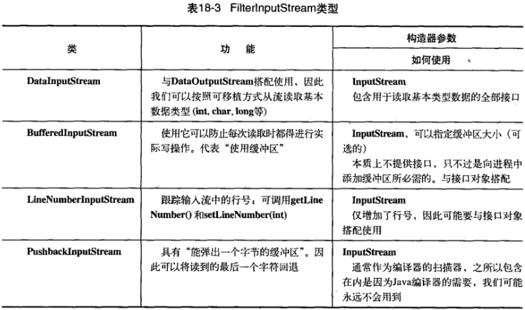

### 18.3.2 通过FilterOutPutStream向OutputStream写入

与DataInputStream对应是DataOutputStream，它可以将各种基本数据类型以及String对象格式化输出到“流”中；这样以来，任何机器上的任何DataInputStream都能够读取它们。所有方法都以“write"开头，例如writeByte()、writeFloat()等等。

PrintStream最初的目的便是为了以可视化格式打印所有的基本数据类型以及String对象。这和DataOutputStream不同，后者的目的是将数据元素置入“流”中，使DataInputStream能够可移植地重构它们。

**PrintStream**可能会有些问题，因为它捕捉了所有的IOExceptions（因此，我们必须使用checkError()自行测试错误状态，如果出现错误它返回true）。另外，PrintStream也未完成国际化，不能以平台无关的方式处理换行动作（这些问题在printWriter中得到了解决，这在后面讲述）。

BufferedOutputStream是一个修改过的OutputStream，它对数据流使用缓冲技术；因此当每次向流写入时，不必每次都进行实际的物理写动作。所以在进行输出时，我们可能更经常的是使用它。FilterOutputStream的类型及功能如表18-4所示。

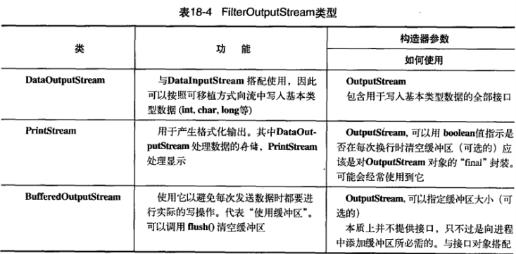

## 18.4 Reader和Writer

Java 1.1对基本的I/O流类库进行了重大的修改。当我们初次看见Reader和Writer类时，可能会以为这是两个用来替代InputStream和OutputStream的类；但实际上并非如此。尽管一些原始的“流”类库不再被使用（如果使用它们，则会收到编译器的警告信息），但是InputStream和OutputStreamt在以面向字节形式的I/O中仍可以提取极有价值的功能，Reader和Writer则提供兼容Unicode与面向字符的I/O功能。另外：

1）Java 1.0向**InputStream**和**OutputStreamt**继承层次结构中添加了一些新类，所以显然这两个类是不会被取代的。

2）有时我们必须把来自于“字节”层次结构中的类和“字符”层次结构中的类结合起来使用。为了实现这个目的，要用到“适配器”（adapter）类：InputStreamReader可以把InputStream转换为Reader，而OutputStreamWriter可以把OutputStream转换为Writer。

设计Reader和Writer继承层次结构主要是为了国际化。老的I/O流继承层次结构仅支持8位字节流，并且不能很好地处理16位的Unicode字符。由于Unicode用于字符国际化（Java本身的char也是16位的Unicode），所以添加Reader和Writer继承层次结构就是为了在所有的I/O操作中都支持Unicode。另外，新类库的设计使得它的操作比旧类库更快。一如本书惯例，我会尽力给出所有类的概观，但是我还要假定你会自行使用JDK文档查看细节，例如方法的详尽列表。

### 18.4.1 数据的来源和去处

几乎所有原始的Java I/O流类都有相应的Reader和Writer类来提供天然的Unicode操作。然而在某些场合，面向字节的InputStream和OutputStream才是正确的解决方案；特别是，java.util.zip类库就是面向字节的而不是面向字符的。因此，最明智的做法是尽量尝试使用Reader和Writer，一旦程序代码无法成功编译，我们就会发现自己不得不使用面向字节的类库。

下面的表展示了在两个继承层次结构中，信息的来源和去处（即数据物理上来自哪里及去向哪里）之间的对应关系：

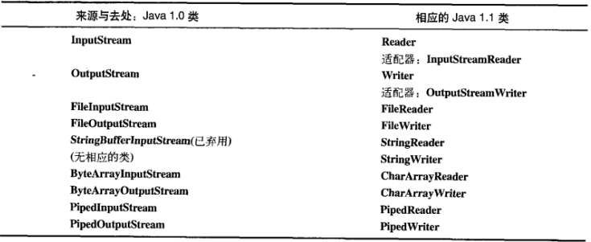

大体上，我们会发现，这两个不同的继承层次结构中的接口即使不能说完全相同，但也是非常相似的。

### 18.4.2 更改流的行为

对于InputStream和OutputStream来说，我们会使用FilterInputStream和FilterOutputStream的装饰器子类来修改“流”以满足特殊需要。Reader和Writer的类继承层次结构继续沿用相同的思想——但是并不完全相同。

在下表中，相对于前一表格来说，左右之间的对应关系的近似程度更加粗略一些。造成这种差别的原因是因为类的组织形式不同；尽管BufferedOutputStream是FilterOutputStream的子类，但是BufferedWriter并不是FilterWriter的子类（尽管FilterWriter是抽象类，没有任何子类把它放在那里也只是把它作为一个占位符，或仅仅让我们不会对它所在的地方产生疑惑）。然而，这些类的接口却十分相似。

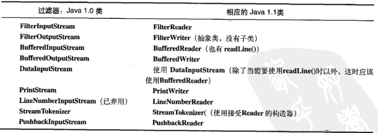

有一点很清楚：无论我们何时使用readLine()，都不应该使用DataInputStream（这会遭到编译器的强烈反对），而应该使用BufferedReader。除了这一点，DataInputStream仍是I/O类库的首选成员。

为了更容易地过渡到使用PrintWriter，它提供了一个既能接收Writer对象又能接收任何OutputStream对象的构造器。PrintWriter的格式化接口实际上与PrintStream相同。

在Java SE5中添加了PrintWriter构造器，以简化在将输出写入时的文件创建过程，你马上就会看到它。

有一种PrintWriter构造器还有一个选项，就是“自动执行清空”选项。如果构造器设置此选项，则在每个Pringln()执行之后，便会自动清空。

### 18.4.3 未发生变化的类

有一些类在Java 1.0和Java 1.1之间则未做改变。


特别是DataOutputStream，在使用时没有任何变化；因此如果想以“可传输的”格式存储和检索数据，可以使用InputStream和OutputStream继承层次结构。

## 18.5 自我独立的类：RandomAccessFile

RandomAccessFile适用于由大小已知的记录组成的文件，所以我们可以使用seek()将记录从一处转移到另一处，然后读取或者修改记录。文件中记录的大小不一定都相同，只要我们能够确定那些记录有多大以及它们在文件中的位置即可。

最初，我们可能难以相信RandonAccessFile不是InputStream或者OutputStream继承层次结构中的一部分。除了实现DataInput和DataOutput接口（DataInputStream和DataOutputStream也实现了这两个接口）之外，它和这两个继承层次结构没有任何关联。它甚至不使用InputStream和OutputStream类中已有的任何功能。它是一个完全独立的类，从头开始编写其所有的方法（大多数都是本地的）。这么做是因为RandomAccessFile拥有和别的I/O类型本质不同的行为，因为我们可以在一个文件内向前和向后移动。在任何情况下，它都是自我独立的，直接从Object派生而来。

从本质上来说，RandomAccessFile的工作方式类似于把DataInputStream和DataOutStream组合起来使用，还添加了一些方法。其中方法getFilePointer()用于查找当前所处的文件位置，seek()用于在文件内移至新的位置，length()用于判断文件的最大尺寸。另外，其构造器还需要第二个参数（和C中的fopen()相同）用来指示我们只是“随机读”（r）还是“既读又写”（rw）。它并不支持只写文件，这表明RandomAccessFile若是从DataInputStream继承而来也可能会运行得很好。

只有RandonAccessFile支持搜寻方法，并且只适用于文件。BufferedInputStream却能允许标注（mark()）位置（其值存储于内部某个简单变量类）和重新设定位置（reset()），但这些功能很有限，不是非常有用。

在JDK 1.4中，RandomAccessFile的大多数功能（但不是全部）由nio存储映射文件所取代，本章稍后会讲述。

## 18.6 I/O流的典型使用方式

尽管可以通过不同的方式组合I/O流类，但我们可能也就只用到其中的几种组合。下面的例子可以作为典型的I/O用法的基本参考。在这些示例中，异常处理都被简化为将异常传递给控制台，但是这只有在小型示例和工具中才适用。在代码中，你需要考虑更加复杂的错误处理方式。

### 18.6.1 缓冲输入文件

如果想要打开一个文件用于字符输入，可以使用以String或File对象作为文件名的FileInputReader。为了提高速度，我们希望对那个文件进行缓冲，那么我们将所产生的引用传给一个BufferedReader构造器。由于BufferedReader也体用readLine()方法，所以这是我们的最终对象和进行读取的接口。当readLine()将返回null时，你就达到了文件的末尾。

```java
package com.shenhuanjie.io;

import java.io.BufferedReader;
import java.io.FileReader;
import java.io.IOException;

/**
 * BufferedInputFile
 *
 * @author shenhuanjie
 * @date 2019/6/28 11:42
 */
public class BufferedInputFile {
    // Throw exceptions to console:

    /**
     * @param filename
     * @return
     * @throws IOException
     */
    public static String read(String filename) throws IOException {
        //Reading input by lines:
        BufferedReader reader = new BufferedReader(new FileReader(filename));
        String str;
        StringBuilder builder = new StringBuilder();
        while ((str = reader.readLine()) != null) {
            builder.append(str + "\n");
        }
        reader.close();
        return builder.toString();
    }

    /**
     * @param args
     * @throws IOException
     */
    public static void main(String[] args) throws IOException {
        System.out.println(read("BufferedInputFile.java"));
    }
}

```

字符串builder用来累积文件的全部内容（包括必须添加的换行符，因为readLine()已将它们删掉）。最后，调用close()关闭文件。

### 18.6.2 从内存输入

在下面的示例中，从BufferedInputFile.read()读入的String结果被用来创建一个StringReader。然后调用read()每次读取一个字符，并把它发送到控制台。

```java
package com.shenhuanjie.io;

import java.io.IOException;
import java.io.StringReader;

/**
 * MemoryInput
 *
 * @author shenhuanjie
 * @date 2019/6/28 15:15
 */
public class MemoryInput {
    public static void main(String[] args) throws IOException {
        StringReader in = new StringReader(BufferedInputFile.read("MemoryInput.java"));
        while (in.read() != -1) {
            System.out.println((char) in.read());
        }
    }
}

```

注意read()是以int形式返回下一字节，因此必须类型转换为char才能正常打印。

### 18.6.3 格式化的内存输入

要读取格式化数据，可以使用DataInputStraem，它是一个面向字节的I/O类（不是面向字符的）。因此我们必须使用InputStream类而不是Reader类。当然，我们可以用InputStream以字节的形式读取任何数据（例如一个文件），不过，在这里使用的是字符串。

```java
package com.shenhuanjie.io;

import java.io.ByteArrayInputStream;
import java.io.DataInputStream;
import java.io.IOException;

/**
 * FormattedMemoryInput
 *
 * @author shenhuanjie
 * @date 2019/6/28 15:21
 */
public class FormattedMemoryInput {
    public static void main(String[] args) {
        try {
            DataInputStream in = new DataInputStream(new ByteArrayInputStream(BufferedInputFile.read("FormattedMemoryInput.java").getBytes()));
            while (true) {
                System.out.println((char) in.readByte());
            }
        } catch (IOException e) {
            System.err.println("End of stream");
        }
    }
}

```

必须为ByteArrayInputStream提供字节数组，为了产生该数组String包含了一个可以实现此项工作的getBytes()方法。所产生的ByteArrayInputStream是一个适合传递给DataInputStream的InputStream。

如果我们从DataInputStream用readByte()一次一个字节地读取字符，那么任何字节的值都是合法的结果，因此返回值不能用来检测输入是否结束。相反，我们可以使用avaliable()方法查看还有多少可供存取的字符。下面这个例子演示了怎样一次一个字节地读取文件；

```java
package com.shenhuanjie.io;

import java.io.*;

/**
 * TestEOF
 *
 * @author shenhuanjie
 * @date 2019/6/28 15:33
 */
public class TestEOF {
    private static final File FILE_PATH = new File("C:\\file.txt");

    public static void main(String[] args) throws IOException {
        DataInputStream in = new DataInputStream(new BufferedInputStream(new FileInputStream(FILE_PATH)));
        while (in.available() != 0) {
            System.out.print((char) in.readByte());
        }
    }
}

```

注意，available()的工作方式会随着说读取的媒介类型的不同而有所不同，字面意思就是“在没有阻塞的情况下所能读取的字节数”。对于文件，这意味着整个文件，但是对于不同类型的流，可能就不是这样的，因此要谨慎使用。

我们也可以通过捕获异常来检测输入的末尾。但是，使用异常进行流控制，被认为是对异常特性的错误使用。

### 18.6.4 基本的文件输出

FileWriter对象可以向文件写入数据。首先，创建一个与指定文件连接的FileWriter。实际上，我们通常会用BufferedWriter将其包装起来用以缓冲输出（尝试移除此包装来感受对性能的影响——缓冲往往能显著地增加I/O操作的性能）。在本例中，为了提供格式化机制，它被装饰成了PrintWriter。按照这种方式创建的数据文件可以作为普通文本文件读取。

```java
package com.shenhuanjie.io;

import java.io.*;

/**
 * BasicFileOutput
 *
 * @author shenhuanjie
 * @date 2019/6/28 15:42
 */
public class BasicFileOutput {
    static String file = "BasicFileOutput.out";

    /**
     * @param args
     * @throws IOException
     */
    public static void main(String[] args) throws IOException {
        BufferedReader in = new BufferedReader(new StringReader(BufferedInputFile.read("C:\\file.txt")));
        PrintWriter out = new PrintWriter(new BufferedWriter(new FileWriter(file)));
        int lineCount = 1;
        String s;
        while ((s = in.readLine()) != null) {
            out.println(lineCount++ + ":" + s);
        }
        out.close();
        //Show the stored file:
        System.out.println(BufferedInputFile.read(file));
    }
}

```

当文本行被写入文件时，行号就会增加。注意未用到LineNumberInputStream，因为这个类没有多大帮助，所以我们没必要用它。从本例中可以看出，记录自己的行号很容易。

一旦读完输入数据流，readLine()会返回null。我们可以看到要为out显式调用close()。如果我们不为所有的输出文件调用close()，就会发现缓冲区内容不会被刷新情况，那么它们也就不完整。

**文本文件输出的快捷方式**

Java SE5在PrintWriter中添加了一个辅助构造器，使得你不必再每次希望创建文件并向其中写入时，都去执行所有的装饰工作。下面是用这种快捷方式重写BasicFileOutput.java：

```java
package com.shenhuanjie.io;

import java.io.BufferedReader;
import java.io.IOException;
import java.io.PrintWriter;
import java.io.StringReader;

/**
 * FileOutputShortcut
 *
 * @author shenhuanjie
 * @date 2019/6/28 15:52
 */
public class FileOutputShortcut {
    static String file = "FileOutputShortcut.out";

    public static void main(String[] args) throws IOException {
        BufferedReader in = new BufferedReader(new StringReader(BufferedInputFile.read("file.txt")));
        // Here's shortcut:
        PrintWriter out = new PrintWriter(file);
        int lineCount = 1;

        while (in.readLine() != null) {
            out.println(lineCount++ + ":" + in.readLine());
        }
        out.close();
        // Show the stored file:
        System.out.println(BufferedInputFile.read(file));
    }
}

```

你仍旧是在进行缓存，只是不必自己去实现。遗憾的是，其他常见的写入任务都没有快捷方式，因此典型的I/O仍旧包含大量的冗余文本。但是，本书所使用的在本章稍后进行定义的TextFile工具简化了这些常见任务。

### 18.6.5 存储和恢复数据

PrintWriter可以对数据进行格式化，以便人们的阅读。但是为了输出可供另一个“流”恢复的数据，我们需要用DataOutputStream写入数据，并用DataInputStream恢复数据。当然，这些流可以是任何形式，但在下面的示例中使用的是一个文件，并且对于读和写都进行了缓冲处理。注意DataOutputStream和DatainputStream是面向字节的，因此要使用InputStream和OutputStream。

```java
package com.shenhuanjie.io;

import java.io.*;

/**
 * StoringAndRecoveringData
 *
 * @author shenhuanjie
 * @date 2019/6/28 16:35
 */
public class StoringAndRecoveringData {
    public static void main(String[] args) throws IOException {
        DataOutputStream out = new DataOutputStream(new BufferedOutputStream(new FileOutputStream("data.txt")));
        out.writeDouble(3.14159);
        out.writeUTF("That was pi");
        out.writeDouble(1.41413);
        out.writeUTF("Square root of 2");
        out.close();
        DataInputStream in = new DataInputStream(new BufferedInputStream(new FileInputStream("data.txt")));
        System.out.println(in.readDouble());
        // Only readUTF() will recover the
        // Java-UTF String properly:
        System.out.println(in.readUTF());
        System.out.println(in.readDouble());
        System.out.println(in.readUTF());
    }
}
/**
 * 3.14159
 * That was pi
 * 1.41413
 * Square root of 2
 */

```

如果我们使用DataOutputStream写入数据，Java保证我们可以使用DataInputStream准确地读取数据——无论读和写数据的平台多么不同。这一点很有价值，因为我们都知道，人们曾经花费了大量时间去处理特定于平台的数据问题。只要两个平台上都有Java，这种问题就不会在发生。

当我们使用DataOutputStream时，写字符串并且让DataInputStream能够恢复它的唯一可靠的做法就是使用UTF-8编码，在这个示例中是用writeUTF()和readUTF()来实现的。UTF-8是一种多字节格式，其编码长度根据实际使用的字符集会有所变化。如果我们使用的只是ASCII或者几乎都是ASCII字符（只占7位），那么就显得极其浪费空间和带宽，所以UTF-8将ASCII字符编码成单一字节的形式，而非ASCII字符则编码成两到三个字节的形式。另外，字符串的长度存储在UTF-8字符串的前两个字节中。但是，writeUTF()和readUTF()使用是适合于Java的UTF-8变体（JDK文档中有这些方法的详尽描述），因此如果我们用一个非Java程序读取用writeUTF()所写的字符串时，必须编写一些特殊代码才能正确读取字符串。

有了writeUTF()和readUTF()，我们就可以用DataOutputStream把字符串和其他数据类型相混合，我们知道字符串完全可以作为Unicode来存储，并且可以很容易地使用DataInputStream来恢复它。

writeDouble()将double类型的数字存储到流中，并用相应的readDouble()恢复它（对于其他的数据类型，也有类似方法用于读写）。但是为了保证所有的读方法都能够正常工作，我们必须知道流中数据项所在的确切位置，因为极有可能将保存的double数据作为一个简单的字节序列、char或其他类型读入。因此，我们必须：要么为文件中的数据采用固定的格式；要么将额外信息保存到文件中，以便能够对其进行解析以确定数据的存放位置。注意，对象序列化和XML（本章稍后都会介绍）可能是更容易的存储和读取复杂数据结构的方式。

### 18.6.6 读写随机访问文件

使用RandomAccessFile，类似于组合使用了DataInputStream和DataOutputStream（因为它实现了相同的接口：DataInput和DataOutput）。另外我们可以看到，利用seek()可以在文件中到处移动，并修改文件中的某个值。

在使用RandomAccessFile时，你必须知道文件排版，这样才能正确地操作它。RandomAccessFile拥有读取基本类型和UTF-8字符串的各种具体方法。下面是示例：

```java
package com.shenhuanjie.io;

import java.io.IOException;
import java.io.RandomAccessFile;

/**
 * UsingRandomAccessFile
 *
 * @author shenhuanjie
 * @date 2019/6/28 16:58
 */
public class UsingRandomAccessFile {
    static String file = "rtest.dat";

    /**
     * @throws IOException
     */
    static void display() throws IOException {
        RandomAccessFile rf = new RandomAccessFile(file, "r");
        for (int i = 0; i < 7; i++) {
            System.out.println("Value " + i + ":" + rf.readDouble());
        }
        System.out.println(rf.readUTF());
        rf.close();
    }

    /**
     * @param args
     * @throws IOException
     */
    public static void main(String[] args) throws IOException {
        RandomAccessFile rf = new RandomAccessFile(file, "rw");
        for (int i = 0; i < 7; i++) {
            rf.writeDouble(i * 1.414);
        }
        rf.writeUTF("The end of the file");
        rf.close();
        display();
        rf = new RandomAccessFile(file, "rw");
        rf.seek(5 * 8);
        rf.writeDouble(47.0001);
        rf.close();
        display();
    }
    /**
     * Value 0:0.0
     * Value 1:1.414
     * Value 2:2.828
     * Value 3:4.242
     * Value 4:5.656
     * Value 5:7.069999999999999
     * Value 6:8.484
     * The end of the file
     * Value 0:0.0
     * Value 1:1.414
     * Value 2:2.828
     * Value 3:4.242
     * Value 4:5.656
     * Value 5:47.0001
     * Value 6:8.484
     * The end of the file
     */
}

```

display()方法打开了一个文件，并以double值的形式显示了其中的七个元素。在main()中，首先创建了文件，然后打开并修改了它。因为double总是8字节长，所以为了用seek()查找第5个双精度值，你只需用5*8来产生查找位置。

正如先前所指，RandomAccessFile除了实现DataInput和DataOutput接口之外，有效地与I/O继承层次结构的其他部分实现了分离。因为它不支持装饰，所以不能将其与InputStream及OutputStream子类的任何部分组合起来。我们必须假定RandomAccessFile已经被正确缓冲，因为我们不能为它添加这样的功能。

可以自行选择的是第二个构造器参数：我们可指定以“只读”（r）方式或“读写”（rw）方式打开一个RandomAccessFile文件。

你可能会考虑使用“内存映射文件”来代替RandomAccessFile。

### 18.6.7 管道流

PipedInputStream、PipedOutputStream、PipedReader及PipedWriter在本章只是简单地提到。但这并不表明它们没有什么用处，它们的价值只有在我们开始理解多线程之后才会显现，因为管道流用于任务之间的通信。这些在第21章会用一个示例进行讲述。

## 18.7 文件读写的实用工具

一个很常见的程序化任务就是读取文件到内存，修改，然后再写出。Java I/O类库的问题之一就是：它需要编写相当多的代码去执行这些常用操作——没有任何基本的帮助功能可以为我们做这一切。更糟糕的是，装饰器会使得要记住如何打开文件变成一件相当困难的事。因此，在我们的类库中添加帮助类就显得相当有意义，这样就可以很容易地为我们完成这些基本任务。Java SE5在PrintWriter中添加了方便的构造器，因此你可以很方便地打开一个文本文件进行写入操作。但是，还有许多其他的常见操作是你需要反复执行的，这就使得消除与这些任务相关联的重复代码就显得很有意义了。

下面的TextFile类在本书前面的示例中就已经被用来简化对文件的读写操作了。它包含的static方法可以像简单字符串那样读写文本文件，并且我们可以创建一个TextFile对象，它用一个ArrayList来保存文件的若干行（如此，当我们操纵文件内容时，就可以使用ArrayList的所有功能）。

```java
package com.shenhuanjie.util;

import java.io.*;
import java.util.ArrayList;
import java.util.Arrays;
import java.util.TreeSet;

/**
 * TextFile
 * <p>
 * Static functions for reading and writing text files as
 * a single string. and treating a file as an ArrayList.
 *
 * @author shenhuanjie
 * @date 2019/6/28 17:16
 */
public class TextFile extends ArrayList<String> {
    private static final long serialVersionUID = 2685525071919574180L;

    /**
     * Read a file, split by any regular expression:
     *
     * @param fileName
     * @param splitter
     */
    public TextFile(String fileName, String splitter) throws IOException {
        super(Arrays.asList(read(fileName).split(splitter)));
        // Regular expression split() often leaves an empty
        // String at the first position:
        if (get(0).equals("")) {
            remove(0);
        }
    }

    /**
     * Normally read by lines:
     *
     * @param fileName
     */
    public TextFile(String fileName) throws IOException {
        this(fileName, "\n");
    }

    /**
     * Read a file as a single string:
     *
     * @param fileName
     * @return
     * @throws IOException
     */
    public static String read(String fileName) throws IOException {
        StringBuffer sb = new StringBuffer();
        try {
            BufferedReader in = new BufferedReader(new FileReader(new File(fileName).getAbsoluteFile()));
            try {
                while (in.readLine() != null) {
                    sb.append(in.readLine());
                    sb.append("\n");
                }
            } finally {
                in.close();
            }
        } catch (FileNotFoundException e) {
            e.printStackTrace();
        }
        return sb.toString();
    }

    /**
     * Write a single file in one method call:
     *
     * @param fileName
     * @param text
     */
    public static void write(String fileName, String text) {
        try {
            PrintWriter out = new PrintWriter(new File(fileName).getAbsoluteFile());
            try {
                out.print(text);
            } finally {
                out.close();
            }
        } catch (FileNotFoundException e) {
            throw new RuntimeException(e);
        }
    }

    /**
     * Simple test:
     *
     * @param args
     * @throws IOException
     */
    public static void main(String[] args) throws IOException {
        String file = read("file.txt");
        write("test.txt", file);
        TextFile text = new TextFile("test.txt");
        text.write("test2.txt");
        // Break into unique sorted list of words:
        TreeSet<String> words = new TreeSet<>(new TextFile("file.txt", "\\W+"));
        // Display the capitalized words:
        System.out.println(words.headSet("a"));

    }

    /**
     * @param fileName
     */
    public void write(String fileName) {
        try {
            PrintWriter out = new PrintWriter(new File(fileName).getAbsoluteFile());
            try {
                for (String item : this) {
                    out.println(item);
                }
            } finally {
                out.close();
            }
        } catch (FileNotFoundException e) {
            throw new RuntimeException(e);
        }
    }
    /**
     * [15, 2019, 28, 52, 6, BufferedInputFile, BufferedReader, C, FileOutputShortcut, IOException, PrintWriter, String, StringReader, System]
     */
}

```

read()将每行添加到StringBuffer，并且为每行加上换行符，因为在读的过程中换行符会被去除掉。接着返回一个包含整个文件的字符串。write()打开文本并将其写入文件。在这两个方法完成时，都要记着用close()关闭。

注意，在任何打开文件的文件在finally子句中，作为防卫措施都添加了对文件的close()调用，以保证文件将会被正确关闭。

这个构造器利用read()方法将文件转换成字符串，接着使用String.split()以换行符为界把结果划分成行（若要频繁使用这个类，我们可以重写此构造器以提高性能）。遗憾的是没有相应的连接（join）方法，所以那个非静态的write()方法必须一行一行地输出这些行。因为这个类希望将读取和写入文件的过程简单化，因此所有的IOException都被转型为RuntimeException，因此用户不必使用try-catch语句块。但是，你可能需要创建另一种版本将IOException传递给调用者。

在main()方法中，通过执行一个基本测试来确保这些方法正常工作。尽管这个程序不需要创建许多代码，但使用它会节约大量时间，它会使你变得很轻松，在本章后面一些例子中就可以感受到这一点。

另一种解决读取文件问题的方法是使用在Java SE5中引入的java.util.Scanner类。但是，这只能用于读取文件，而不能用于写入文件，并且这个工具（你会注意到它不在java.io包中）主要是设计用来创建编程语言的扫描器或“小语言”的。

### 18.7.1 读取二进制文件

这个工具与TextFile类似，因为它简化了读取二进制文件的过程：

```java
package com.shenhuanjie.util;

import java.io.BufferedInputStream;
import java.io.File;
import java.io.FileInputStream;
import java.io.IOException;

/**
 * BinaryFile
 * <p>
 * Utility for reading files in binary form.
 *
 * @author shenhuanjie
 * @date 2019/6/28 17:46
 */
public class BinaryFile {
    /**
     * @param bFile
     * @return
     * @throws IOException
     */
    public static byte[] read(File bFile) throws IOException {
        BufferedInputStream bf = new BufferedInputStream(new FileInputStream(bFile));
        try {
            byte[] data = new byte[bf.available()];
            bf.read(data);
            return data;
        } finally {
            bf.close();
        }
    }

    /**
     * @param bFile
     * @return
     * @throws IOException
     */
    public static byte[] read(String bFile) throws IOException {
        return read(new File(bFile).getAbsoluteFile());
    }
}

```

其中一个重载方法接受File参数，第二个重载方法接受表示文件名的String参数。这两个方法都返回的byte数组。available()方法被用来产生恰当的数组尺寸，并且read()方法的特定的重载版本填充了这个数组。

## 18.8 标准I/O

标准I/O这个术语参考的是Unix中“程序所使用的单一信息流”这个概念（在Windows和其他许多操作系统中，也有相似形式的实现）。程序的所有输入都可以来自于标准输入，它的所有输出也都可以发送到标准输出，以及所有的错误信息都可以发送到标准错误。标准I/O的意义在于：我们可以很容易地把程序串联起来，一个程序的标准输出可以成为另一程序的标准输入。这真是一个强大的工具。

### 18.8.1 从标准输入中读取

按照标准I/O模型，Java提供了System.in、System.out和System.err。在整本书里，我们已经看到了怎样用System.out将数据写出到标准输出，其中System.out已经事先被包装成了printStream对象。System.err同样也是PrintStream，但System.in却是一个没有被包装过的未经加工的InputStream。这意味尽管我们可以立即使用Sytem.out和System.err，但是在读取System.in之前必须对其进行包装。

通常我们会用readLine()一次一行地读取输入，为此，我们将System.in包装成BufferedReader来使用这要求我们必须用InputStreamReader把System.in转换成Reader。下面这个例子将直接回显你所输入的每一行。

```java
package com.shenhuanjie.io;

import java.io.BufferedReader;
import java.io.IOException;
import java.io.InputStreamReader;

/**
 * Echo
 * <p>
 * How to read from standard input.
 *
 * @author shenhuanjie
 * @date 2019/6/28 20:26
 */
public class Echo {
    public static void main(String[] args) throws IOException {
        BufferedReader stdin = new BufferedReader(new InputStreamReader(System.in));
        String line;
        while ((line = stdin.readLine()) != null && line.length() != 0) {
            System.out.println(line);
        }
    }
}

```

使用异常规范是因为readLine()会抛出IOException。注意，System.in和大多数流一样，通常应该对它进行缓冲。

### 18.8.2 将System.out转换成PrintWriter

System.out是一个PrintStream，而PrintStream是一个OutputStream。PrintWriter有一个可以接收OutputStream作为参数的构造器。因此，只要需要，就可以使用那个构造器把System.out转换成PrintWriter：

```java
package com.shenhuanjie.io;

import java.io.PrintWriter;

/**
 * ChangeSystemOut
 * <p>
 * Turn System.out into a PrintWriter.
 *
 * @author shenhuanjie
 * @date 2019/6/28 20:35
 */
public class ChangeSystemOut {
    public static void main(String[] args) {
        PrintWriter out = new PrintWriter(System.out, true);
        out.println("Hello, World!");
    }
    /**
     * Hello, World!
     */
}

```

重要的是要使用有两个参数的PrintWriter的构造器，并将第二个参数设为true，以便开启自动清空功能；否则，你可能看不到输出。

### 18.8.3 标准I/O重定向

Java的System类提供了一些简单的静态方法调用，以允许我们对标准输入、输出和错误I/O流进行重定向：

* **setIn(InputStream)**
* **setOut(PrintStream)**
* **setErr(PrintStream)**

如果我们突然开始在显示器上创建大量输出，而这些输出滚动得太快以至于无法阅读时，重定向输出就显得极为有用。对于我们想重复测试某个特定用户的输入序列的命令行程序来说，重定向输入就很有价值。下例简单演示了这些方法的使用。

```java
package com.shenhuanjie.io;

import java.io.*;

/**
 * Redirecting
 * <p>
 * Demonstrates standard I/O redirection.
 *
 * @author shenhuanjie
 * @date 2019/6/28 20:40
 */
public class Redirecting {
    public static void main(String[] args) throws IOException {
        PrintStream console = System.out;
        BufferedInputStream in = new BufferedInputStream(new FileInputStream("file.txt"));
        PrintStream out = new PrintStream(new BufferedOutputStream(new FileOutputStream("test.out")));
        System.setIn(in);
        System.setOut(out);
        System.setErr(out);
        BufferedReader br = new BufferedReader(new InputStreamReader(System.in));
        String line;
        while ((line = br.readLine()) != null) {
            System.out.println(line);
        }
        out.close();
        System.setOut(console);

    }
}

```

这个程序将标准输入附接到文件上，并将标准输出和标准错误重定向到另一个文件。注意，它在程序开头处存储了对最初的System.out对象的引用，并且在结尾处将系统输出恢复到了该对象上。

I/O重定向操纵的是字节流，而不是字符流，因此我们使用的是InputStream和OutputStream，而不是Reader和Writer。

## 18.9 进程控制

你经常会需要在Java内部执行其他操作系统的程序，并且要控制这些程序的输入和输出。Java类库提供了执行这些操作的类。

一项常见的任务是运行程序，并将产生的输出发送到控制台。本节包含了一个可以简化这项任务的实用工具。在使用这个实用工具时，可能会产生两种类型的错误：普通的导致异常的错误——对这些错误我们只需重新抛出一个运行时异常，以及从进程自身的执行过程中产生的错误，我们希望用单独的异常来报告这些错误：

```java
package com.shenhuanjie.util;

/**
 * OSExecuteException
 *
 * @author shenhuanjie
 * @date 2019/6/28 22:12
 */
public class OSExecuteException extends RuntimeException {
    private static final long serialVersionUID = 6672808298301493479L;

    /**
     * Constructs a new runtime exception with the specified detail message.
     * The cause is not initialized, and may subsequently be initialized by a
     * call to {@link #initCause}.
     *
     * @param message the detail message. The detail message is saved for
     *                later retrieval by the {@link #getMessage()} method.
     */
    public OSExecuteException(String message) {
        super(message);
    }
}

```

要想运行一个程序，你需要向OSExecute.command()传递一个command字符串，它与你在控制台上运行该程序所键入的命令相同。这个命令被传递给java.lang.ProcessBuilder构造器（它要求这个命令作为一个String对象序列而被传递），然后所产生的的ProcessBuilder对象被启动：

```java
package com.shenhuanjie.util;

import java.io.BufferedReader;
import java.io.InputStreamReader;

/**
 * OSExecute
 * <p>
 * Run an operating system command
 * and send the output to the console.
 *
 * @author shenhuanjie
 * @date 2019/6/28 22:16
 */
public class OSExecute {
    public static void command(String command) {
        boolean err = false;
        try {
            Process process = new ProcessBuilder(command.split(" ")).start();
            BufferedReader reader = new BufferedReader(new InputStreamReader(process.getInputStream()));
            String line;
            while ((line = reader.readLine()) != null) {
                System.out.println(line);
            }
            BufferedReader errors = new BufferedReader(new InputStreamReader(process.getErrorStream()));
            // Report errors and return nonzero value
            // to calling process if there are problems:
            while ((line = errors.readLine()) != null) {
                System.err.println(line);
                err = true;
            }
        } catch (Exception e) {
            // Compensate for Windows 2000. which throws an
            // exception for the default command line:
            if (!command.startsWith("CMD /C")) {
                command("CMD /C " + command);
            } else {
                throw new RuntimeException(e);
            }
        }
        if (err) {
            throw new OSExecuteException("Errors executing " + command);
        }
    }
}

```

为了捕获程序执行时产生的标准输出流，你需要调用getInputStream()，这是因为InputStream是我们可以从中读取信息的流。从程序中产生的结果每次输出一行，因此要使用readLine()来读取。这里这些行只是直接被打印了出来，但是你还可以希望从command()中捕获和返回它们。该程序的错误被发送到了标准错误流，并且通过调用getErrotStream()得以捕获。如果存在任何错误，它们都会被打印并且会抛出OSExecuteException，因此调用程序需要处理这个问题。

下面是展示如何使用OSExecute的示例：

```java
package com.shenhuanjie.io;

import com.shenhuanjie.util.OSExecute;

/**
 * OSExecuteDemo
 * <p>
 * Demonstrates standard I/O redirection.
 *
 * @author shenhuanjie
 * @date 2019/6/28 22:59
 */
public class OSExecuteDemo {
    public static void main(String[] args) {
        OSExecute.command("javap OSExecuteDemo");
    }
}

```

这里使用了javap反编译器（随JDK发布）来反编译该程序。

## 18.10 新I/O

JDK 1.4的java.nio.*包中引入了新的Java I/O类库，其目的在于提高速度。实际上，旧的I/O包已经使用nio重新实现过，以便充分利用这种速度提高，因此，即使我们不显式地用nio编写代码，也能从中受益。速度的提高在文件I/O和网络I/O中都有可能发生，我们在这里只研究前者；对于后者，在《Thinking in Enterprise Java》中有论述。

速度的提高来自于所使用的结构更接近于操作系统执行I/O的方式：通道和缓冲器。我们可以把它想象成一个煤矿，通道是一个包含煤层（数据）的矿藏，而缓冲器这是派送到矿藏的卡车。卡车载满煤炭而归，我们再从卡车上获得煤炭。也就是说，我们并没有直接和通道交互，我们只是和缓冲器交互，并把缓冲器派送到通道。通道要么从缓冲器获得数据，要么向缓冲器发送数据。

唯一直接与通道交互的缓冲器是ByteBuffer——也就是说，可以存储未加工字节的缓冲器。当我们查询JDK文档中的java.nio.ByteBuffer时，会发现它是相当基础的类：通过告知分配多少存储空间来创建一个ByteBuffer对象，并且还有一个方法选择集，用于以原始的字节形式或基本数据类型输出和读取数据。但是，没办法输出或读取对象，即使是字符串对象也不行。这种处理虽然很低级，但却正好，因为这是大多数操作系统中更有效的映射方式。

旧I/O类库中有三个类被修改了，用以产生FileChannel。这三个被修改的类是FileInputStream、FileOutputStream以及用于既读又写的RandomAccessFile。注意这些是字节操纵流，与低层的nio性质一致。Reader和Writer这种字符模式类不能用于产生通道，但是java.nio.channels.Channels类提供了实用方法，用以在通道中产生Reader和Writer。

下面的简单实例演示了上面三种类型的流，用以产生可写的、可读可写的及可读的通道。

```java
package com.shenhuanjie.io;

import java.io.FileInputStream;
import java.io.FileOutputStream;
import java.io.IOException;
import java.io.RandomAccessFile;
import java.nio.ByteBuffer;
import java.nio.channels.FileChannel;

/**
 * GetChannel
 * <p>
 * Getting channels from streams
 *
 * @author shenhuanjie
 * @date 2019/6/29 13:26
 */
public class GetChannel {
    private static final int BSIZE = 1024;

    public static void main(String[] args) throws IOException {
        // Write a file:
        FileChannel fc = new FileOutputStream("data.txt").getChannel();
        fc.write(ByteBuffer.wrap("Some text\n".getBytes()));
        fc.close();
        // Add to the end of the file:
        fc = new RandomAccessFile("data.txt", "rw").getChannel();
        fc.position(fc.size());// Move to the end.
        fc.write(ByteBuffer.wrap("Some more\n".getBytes()));
        fc.close();
        // Read the file:
        fc = new FileInputStream("data.txt").getChannel();
        ByteBuffer buff = ByteBuffer.allocate(BSIZE);
        fc.read(buff);
        buff.flip();
        while (buff.hasRemaining()) {
            System.out.print((char) buff.get());
        }
    }
    /**
     * Some text
     * Some more
     */
}

```

对于这里所展示的任何流类，getChannel()将会产生一个FileChannel。通道是一种相当基础的东西：可以向它传送用于读写的ByteBuffer，并且可以锁定文件的某些区域用于独占式访问（稍后讲述）。

将字节存放于ByteBuffer的方法之一是：使用一种“put"方法直接对它们进行填充，填入一个或多个字节，或基本数据类型的值。不过，正如所见，也可以使用warp()方法将已存在的字节数组”包装“到ByteBuffer中。一旦如此，就不再复制底层的数组，而是把它作为所产生的ByteBuffer的存储器，我们称之为数组支持的ByteBuffer。

data.txt文件用RandomAccessFile被再次打开。注意我们可以在文件内随处移动FileChannel；在这里，我们把它移到最后，以便附加其他的写操作。

对于只读访问，我们必须显式地使用静态的allocate()方法来分配ByteBuffer。nio的目标就是快速移动大量数据，因此ByteBuffer的大小就显得尤为重要——实际上，这里使用的1K可能比我们通常要使用的小一点（必须通过实际运行应用程序来找到最佳尺寸）。

甚至达到更高的速度也有可能，方法就是使用allocateDirect()而不是allocate()，以产生一个与操作系统有更高耦合性的“直接”缓冲器。但是，这种分配的开支会更大，并且具体实现也随操作系统的不同而不同，因此必须再次实际运行应用程序来查看缓冲是否可以使我们获得速度上的优势。

一旦调用read()来告知FileChannel向ByteBuffer存储字节，就必须调用缓冲器上的filip()，让它做好让别人读取字节的准备（是的，这似乎有一点拙劣，但是请记住，它是拙劣的，但却使用于获得最大速度）。如果我们打算使用缓冲器执行进一步的read()操作，我们也必须得调用clear()来为每个read()做好准备。这在下面这个简单文件复制程序中可以看到：

```java
package com.shenhuanjie.io;

import java.io.FileInputStream;
import java.io.FileOutputStream;
import java.io.IOException;
import java.nio.ByteBuffer;
import java.nio.channels.FileChannel;

/**
 * ChannelCopy
 * <p>
 * Copying a file using channels and buffers
 *
 * @author shenhuanjie
 * @date 2019/6/29 19:24
 */
public class ChannelCopy {
    private static final int BSIZE = 1024;

    public static void main(String[] args) throws IOException {
        if (args.length != 2) {
            System.out.println("arguments: sourcefile destfile");
            System.exit(1);
        }
        FileChannel in = new FileInputStream(args[0]).getChannel();
        FileChannel out = new FileOutputStream(args[1]).getChannel();
        ByteBuffer buffer = ByteBuffer.allocate(BSIZE);
        while (in.read(buffer) != -1) {
            buffer.flip();// Prepare for writing
            out.write(buffer);
            buffer.clear();// Prepare for reading
        }
    }
}

```

可以看到，打开一个FileChannel以用于读，而打开另一个以用于写。ByteBuffer被分配了空间，当FileChannel.read()返回-1时（一个分界符，毋庸置疑，它源于Unix和C），表示我们已经达到了输入的末尾。每次read()操作之后，就会将数据输入到缓冲器中，flip()则是准备缓冲器以便它的信息可以由write()提取。write()操作之后，信息仍在缓冲器中，接着clear()操作则对所有的内部指针重新安排，以便缓冲器在另一个read()操作期间能够做好接受数据的准备。

然而，上面那个程序并不是处理此类操作的理想方式。特殊方法transferTo()和transferFrom()则允许我们将一个通道和另一个通道直接相连：

```java
package com.shenhuanjie.io;

import java.io.FileInputStream;
import java.io.FileOutputStream;
import java.io.IOException;
import java.nio.channels.FileChannel;

/**
 * TransferTo
 * <p>
 * Using transferTo() between channels
 *
 * @author shenhuanjie
 * @date 2019/6/29 19:33
 */
public class TransferTo {
    public static void main(String[] args) throws IOException {
        if (args.length != 2) {
            System.out.println("arguments: sourcefile destfile");
            System.exit(1);
        }
        FileChannel in = new FileInputStream(args[0]).getChannel(),
                out = new FileOutputStream(args[1]).getChannel();
        in.transferTo(0, in.size(), out);
    }
}

```

虽然我们并不是经常做这类事情，但是了解这一点还是有好处的。

### 18.10.1 转换数据

回过头看GetChannel.java这个程序就会发现，为了输出文件中的信息，我们必须每次只读取一个字节的数据，然后将每个byte类型强制转换成char类型。这种方法似乎有点原始——如果我们查看一下java.nio。CharBuffer这个类，将会发现它有一个toString()方法是这样定义的：“返回一个包含缓冲器中所有字符的字符串。”既然ByteBuffer可以看作是具有asCharBuffer()方法的CharBuffer，那么为什么不用它呢？正如下面的输出语句中第一行所见，这种方法并不能解决问题：

```java
package com.shenhuanjie.io;

import java.io.FileInputStream;
import java.io.FileOutputStream;
import java.io.IOException;
import java.nio.ByteBuffer;
import java.nio.channels.FileChannel;
import java.nio.charset.Charset;

/**
 * BufferToText
 *
 * @author shenhuanjie
 * @date 2019/6/29 19:44
 */
public class BufferToText {
    private static final int BSIZE = 1024;

    public static void main(String[] args) throws IOException {
        FileChannel fc = new FileOutputStream("data.txt").getChannel();
        fc.write(ByteBuffer.wrap("Some text\n".getBytes()));
        fc.close();
        fc = new FileOutputStream("data.txt").getChannel();
        ByteBuffer buff = ByteBuffer.allocate(BSIZE);
        fc.read(buff);
        buff.flip();
        // Doesn't work:
        System.out.println(buff.asCharBuffer());
        // Decode using this system's default Charset:
        buff.rewind();
        String encoding = System.getProperty("file.encoding");
        System.out.println("Decoded using " + encoding + ": " + Charset.forName(encoding).decode(buff));
        // Or, we could encode with something that will print:
        fc = new FileOutputStream("data.txt").getChannel();
        fc.write(ByteBuffer.wrap("Some text\n".getBytes("UTF-16BE")));
        fc.close();
        // Now try reading again:
        fc = new FileInputStream("data.txt").getChannel();
        buff.clear();
        fc.read(buff);
        buff.flip();
        System.out.println(buff.asCharBuffer());
        // Use a CharBuffer to write through:
        fc = new FileOutputStream("data.txt").getChannel();
        buff = ByteBuffer.allocate(24);// More than needed
        buff.asCharBuffer().put("Some text\n");
        fc.write(buff);
        fc.close();
        // Read and display:
        fc = new FileInputStream("data.txt").getChannel();
        buff.clear();
        fc.read(buff);
        buff.flip();
        System.out.println(buff.asCharBuffer());
    }
}

```

缓冲器容纳的是普通的字节，为了把它们转换成字符，我们要么在输入它们的时候对其进行编码（这样，它们输出时才具有意义），要么在将其从缓冲器输出时对它们进行解码。可以使用java.nio.charset.Charset类实现这些功能，该类提供了把数据编码成多种不同类型的字符集的工具：

```java
package com.shenhuanjie.io;

import java.nio.charset.Charset;
import java.util.Iterator;
import java.util.SortedMap;

/**
 * AvailableCharSets
 * <p>
 * Displays Charset and aliases
 *
 * @author shenhuanjie
 * @date 2019/6/30 14:33
 */
public class AvailableCharSets {
    public static void main(String[] args) {
        SortedMap<String, Charset> charSets = Charset.availableCharsets();
        Iterator<String> it = charSets.keySet().iterator();
        while (it.hasNext()) {
            String csName = it.next();
            System.out.print(csName);
            Iterator aliases = charSets.get(csName).aliases().iterator();
            if (aliases.hasNext()) {
                System.out.print(": ");
            }
            while (aliases.hasNext()) {
                System.out.print(aliases.next());
                if (aliases.hasNext()) {
                    System.out.print(", ");
                }
            }
            System.out.println();
        }
    }
    /**
     * Big5: csBig5
     * Big5-HKSCS: big5-hkscs, big5hk, Big5_HKSCS, big5hkscs
     * CESU-8: CESU8, csCESU-8
     * EUC-JP: csEUCPkdFmtjapanese, x-euc-jp, eucjis, Extended_UNIX_Code_Packed_Format_for_Japanese, euc_jp, eucjp, x-eucjp
     * EUC-KR: ksc5601-1987, csEUCKR, ksc5601_1987, ksc5601, 5601, euc_kr, ksc_5601, ks_c_5601-1987, euckr
     * GB18030: gb18030-2000
     * GB2312: gb2312, euc-cn, x-EUC-CN, euccn, EUC_CN, gb2312-80, gb2312-1980
     * GBK: CP936, windows-936
     ...
     */
}

```

让我们返回到BufferToText.java，如果我们想对缓冲器调用rewind()方法（调用该方法是为了返回到数据开始部分），接着使用平台的默认字符集对数据进行decode()，那么作为结果的CharBuffer可以很好地输出打印到控制台。可以使用System.getProperty("file.encoding")发现默认字符集，它会产生代表字符集名称的字符串。把该字符串传给Charset.forName()用以产生Charset对象，可以用它对字符串进行解码。

另一选择是在读文件时，使用能够产生可打印的输出的字符集进行encode()，正如在BufferToText.java中第3部分所看到的那样。这里，UTF-16BE可以把文本写到文本中，当读取时，我们只需要把它转换成CharBuffer，就会产生所期望的文本。

最后，让我们来看看若是通过CharBuffer向ByteBuffer写入，会发生什么情况（后面将会深入了解）。注意我们为ByteBuffer分配了24个字节。既然一个字符需要2个字节，那么一个ByteBuffer足可以容纳12个字符，但是“Some text”只有9个字符，剩余的内容为零的字符仍出现在由它的toString()所产生的CharBuffer的表示中，我们可以在输出中看到。

### 18.10.2 获取基本类型

尽管ByteBuffer只能保持字节类型的数据，但是它具有可以从其所容纳的字节中产生出各种不同基本类型值的方法。下面这个例子展示了怎样使用这些方法来插入和抽取各种数值：

```java
package com.shenhuanjie.io;

import java.nio.ByteBuffer;

/**
 * GetData
 * <p>
 * Getting different representations from a ByteBuffer
 *
 * @author shenhuanjie
 * @date 2019/7/1 9:29
 */
public class GetData {
    private static final int BSIZE = 1024;

    public static void main(String[] args) {
        ByteBuffer bb = ByteBuffer.allocate(BSIZE);
        // Allocation automatically zeros the ByteBuffer:
        int i = 0;
        while (i++ < bb.limit()) {
            if (bb.get() != 0) {
                System.out.println("nonzero");
            }
        }
        System.out.println("i = " + i);
        bb.rewind();
        // Store and read a char array:
        bb.asCharBuffer().put("Howdy!");
        char c;
        while ((c = bb.getChar()) != 0) {
            System.out.print(c + " ");
        }
        System.out.println();
        bb.rewind();
        // Store and read a short:
        bb.asShortBuffer().put((short) 471142);
        System.out.println(bb.getShort());
        bb.rewind();
        // Store and read an int:
        bb.asIntBuffer().put(99471142);
        System.out.println(bb.getInt());
        bb.rewind();
        // Store and read a long:
        bb.asLongBuffer().put(99471142);
        System.out.println(bb.getLong());
        bb.rewind();
        // Store and read a float:
        bb.asFloatBuffer().put(99471142);
        System.out.println(bb.getFloat());
        bb.rewind();
        // Store and read a double:
        bb.asDoubleBuffer().put(99471142);
        System.out.println(bb.getDouble());
        bb.rewind();
    }
    /**
     * i = 1025
     * H o w d y !
     * 12390
     * 99471142
     * 99471142
     * 9.9471144E7
     * 9.9471142E7
     */
}

```

在分配一个ByteBuffer之后，可以通过检测它的值来查看缓冲器的分配方式是否将其内容自动置零——它确实是这样做了。这里一共检测了1024个值（由缓冲器的limit()决定），并且所有的值都是零。

向ByteBuffer插入基本类型数据的最简单的方法是：利用asCharBuffer()、asShortBuffer()等获得该缓冲器上的视图，然后使用视图的put()方法。我们会发现此方法适用于所有基本数据类型。仅有一个小小的例外，即，使用ShortBuffer的put()方法时，需要进行类型转换（注意类型转换会截取或改变结果）。而其他所有的视图缓冲器在使用put()方法时，不需要进行类型转换。

### 18.10.3 视图缓冲器

视图缓冲器（view buffer）可以让我们通过某个特定的基本数据类型的视窗查看其底层的ByteBuffer。ByteBuffer依然是实际存储数据的地方，“支持”着前面的视图，因此，对视图的任何修改都会映射成为对ByteBuffer中数据的修改。正如我们在上一示例看到的那样，这使我们可以很方便地向ByteBuffer插入数据。视图还运行我们从ByteBuffer一次一个地（与ByteBuffer所支持的方式相同）或者成批地（放入数组中）读取基本类型值。在下面这个例子中，通过IntBuffer操纵ByteBuffer中的int型数据：

```java
package com.shenhuanjie.io;

import java.nio.ByteBuffer;
import java.nio.IntBuffer;

/**
 * IntBufferDemo
 * <p>
 * Mainpulating ints in a ByteBuffer with an IntBuffer
 *
 * @author shenhuanjie
 * @date 2019/7/1 9:47
 */
public class IntBufferDemo {
    private static final int BSIZE = 1024;

    public static void main(String[] args) {
        ByteBuffer bb = ByteBuffer.allocate(BSIZE);
        IntBuffer ib = bb.asIntBuffer();
        // Store an array int:
        ib.put(new int[]{11, 42, 47, 99, 143, 811, 1016});
        // Absolute location read and write:
        System.out.println(ib.get(3));
        ib.put(3, 1811);
        // Setting a new limit before rewinding the buffer.
        ib.flip();
        while (ib.hasRemaining()) {
            int i = ib.get();
            System.out.println(i);
        }
    }
    /**
     * 99
     * 11
     * 42
     * 47
     * 1811
     * 143
     * 811
     * 1016
     */
}

```

先用重载后的put()方法存储一个整数数组。接着get()和put()方法调用直接访问底层ByteBuffer中的某个整数位置。注意，这些通过直接与ByteBuffer对话访问绝对位置的方式也同样适用于基本类型。

一旦底层的ByteBuffer通过视图缓冲器填满了整数或其他基本类型时，就可以直接被写到通道中了。正像从通道中读取那样容易，然后使用视图缓冲器可以把任何数据都转化成某一特定的基本类型。在下面的例子中，通过在同一个ByteBuffer上建立不同的视图缓冲器，将同一字节序列翻译成了short、int、float、long和double类型的数据。

```java
package com.shenhuanjie.io;

import java.nio.*;

/**
 * ViewBuffers
 *
 * @author shenhuanjie
 * @date 2019/7/1 10:02
 */
public class ViewBuffers {
    public static void main(String[] args) {
        ByteBuffer bb = ByteBuffer.wrap(new byte[]{0, 0, 0, 0, 0, 0, 0, 'a'});
        bb.rewind();
        System.out.println("Byte Buffer:");
        while (bb.hasRemaining()) {
            System.out.print(bb.position() + " -> " + bb.get() + ". ");
        }
        System.out.println();

        CharBuffer cb = ((ByteBuffer) bb.rewind()).asCharBuffer();
        System.out.println("Char Buffer:");
        while (cb.hasRemaining()) {
            System.out.print(cb.position() + " -> " + cb.get() + ". ");
        }
        System.out.println();

        FloatBuffer fb = ((ByteBuffer) bb.rewind()).asFloatBuffer();
        System.out.println("Float Buffer:");
        while (fb.hasRemaining()) {
            System.out.print(fb.position() + " -> " + fb.get() + ". ");
        }
        System.out.println();

        IntBuffer ib = ((ByteBuffer) bb.rewind()).asIntBuffer();
        System.out.println("Int Buffer:");
        while (ib.hasRemaining()) {
            System.out.print(ib.position() + " -> " + ib.get() + ". ");
        }
        System.out.println();

        LongBuffer lb = ((ByteBuffer) bb.rewind()).asLongBuffer();
        System.out.println("Long Buffer:");
        while (lb.hasRemaining()) {
            System.out.print(lb.position() + " -> " + lb.get() + ". ");
        }
        System.out.println();

        ShortBuffer sb = ((ByteBuffer) bb.rewind()).asShortBuffer();
        System.out.println("Short Buffer:");
        while (sb.hasRemaining()) {
            System.out.print(sb.position() + " -> " + sb.get() + ". ");
        }
        System.out.println();

        DoubleBuffer db = ((ByteBuffer) bb.rewind()).asDoubleBuffer();
        System.out.println("Double Buffer:");
        while (db.hasRemaining()) {
            System.out.print(db.position() + " -> " + db.get() + ". ");
        }
        System.out.println();
    }
    /**
     * Byte Buffer:
     * 0 -> 0. 1 -> 0. 2 -> 0. 3 -> 0. 4 -> 0. 5 -> 0. 6 -> 0. 7 -> 97. 
     * Char Buffer:
     * 0 ->  . 1 ->  . 2 ->  . 3 -> a. 
     * Float Buffer:
     * 0 -> 0.0. 1 -> 1.36E-43. 
     * Int Buffer:
     * 0 -> 0. 1 -> 97. 
     * Long Buffer:
     * 0 -> 97. 
     * Short Buffer:
     * 0 -> 0. 1 -> 0. 2 -> 0. 3 -> 97. 
     * Double Buffer:
     * 0 -> 4.8E-322. 
     */
}

```

ByteBuffer通过一个被”包装“过的8字节数组产生，然后通过各种不同的基本类型的视图缓冲器显示了出来。我们可以在下图助攻看到，当从不同类型的缓冲器读取时，数据显示的方式也不同。这与上面程序的输出相对应。

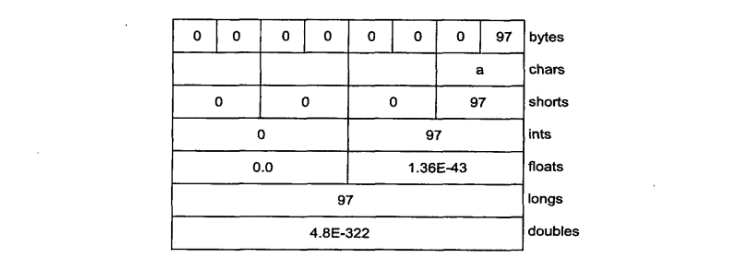

**字节存放次序**

不同的机器可能会使用不同的字节排序方法来存储数据。“big endian”（高位优先）将最重要的字节存放在地址最低的存储器单元。而“little endian"（低位优先）则是将最重要的字节放在地址最高的存储单元。当存储量大于一个字节时，像int、float等，就要考虑字节的顺序问题了。ByteBuffer是以高位优先的形式存储数据的，并且数据在网上传送时也常常使用高位优先的形式。我们可以使用带有参数ByteOrder.BIG_ENDIAN或ByteOrder.LITTLE_ENDIAN的order()方法改变ByteBuffer的字节排序方式。

考虑包含下面两个字节的ByteBuffer：


如果我们以short（ByteBuffer.asShortBuffer()）形式读取数据，得到的数字是97（二进制形式为00000000 01100001），但是如果将ByteBuffer更改为低位优先形式，仍以short形式读取数据，得到的数字确实24832（二进制形式为01100001 00000000）。

这个例子展示了怎样通过字节存放模式设置来改变字符中的字节次序：

```java
package com.shenhuanjie.io;

import java.nio.ByteBuffer;
import java.nio.ByteOrder;
import java.util.Arrays;

/**
 * Endians
 * <p>
 * Endian differences and data storage.
 *
 * @author shenhuanjie
 * @date 2019/7/1 10:43
 */
public class Endians {
    public static void main(String[] args) {
        ByteBuffer bb = ByteBuffer.wrap(new byte[12]);
        bb.asCharBuffer().put("abcdef");
        System.out.println(Arrays.toString(bb.array()));
        bb.rewind();
        bb.order(ByteOrder.BIG_ENDIAN);
        bb.asCharBuffer().put("abcdef");
        System.out.println(Arrays.toString(bb.array()));
        bb.rewind();
        bb.order(ByteOrder.LITTLE_ENDIAN);
        bb.asCharBuffer().put("abcdef");
        System.out.println(Arrays.toString(bb.array()));
    }
    /**
     * [0, 97, 0, 98, 0, 99, 0, 100, 0, 101, 0, 102]
     * [0, 97, 0, 98, 0, 99, 0, 100, 0, 101, 0, 102]
     * [97, 0, 98, 0, 99, 0, 100, 0, 101, 0, 102, 0]
     */
}

```

ByteBuffer有足够的空间，以存储作为外部缓冲器的charArray中的所有直接，因此可以调用array()方法显示视图底层的字节。array()方法是“可选的”，并且我们只能对由数组支持的缓冲器调用此方法，否则，将会抛出UnsupportedOperationException。

通过CharBuffer视图可以将charArray插入到ByteBuffer中。在底层的字节被显示时，我们会发现默认次序和随后的高位优先次序相同；然而地位优先次序则与之相反，后者交换了这些字节次序。

### 18.10.4 用缓冲器操纵数据

下面的图阐明了nio类之间的关系，便于我们理解怎么移动和转换数据。例如，如果想把一个字节数组写到文件中，那么就应该使用ByteBuffer.wrap()方法把字节数组包装起来，然后用getChannel()方法在FileOutputStream上打开一个通道。接着将来自于ByteBuffer的数据写到FileChannel中（如下页所示）。

注意：ByteBuffer是将数据移进移出通道的唯一方式，并且我们只能创建一个独立的基本类型缓冲器，或者使用“as”方法从ByteBuffer中获得。也就是说，我们不能把基本类型的缓冲器转换成ByteBuffer。然而，由于我们可以经由视图缓冲器将基本类型数据移进移出ByteBuffer，所以也就不是什么真正的限制了。

### 18.10.5 缓冲器的细节

Buffer由数据和可以高效地访问及操纵这些数据的是个索引组成，这四个索引是：mark（标记），position（位置），limit（界限）和capacity（容量）。下面是用于设置和复位索引以及查询它们的值的方法。

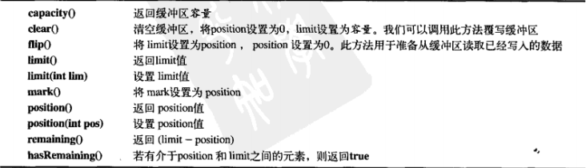

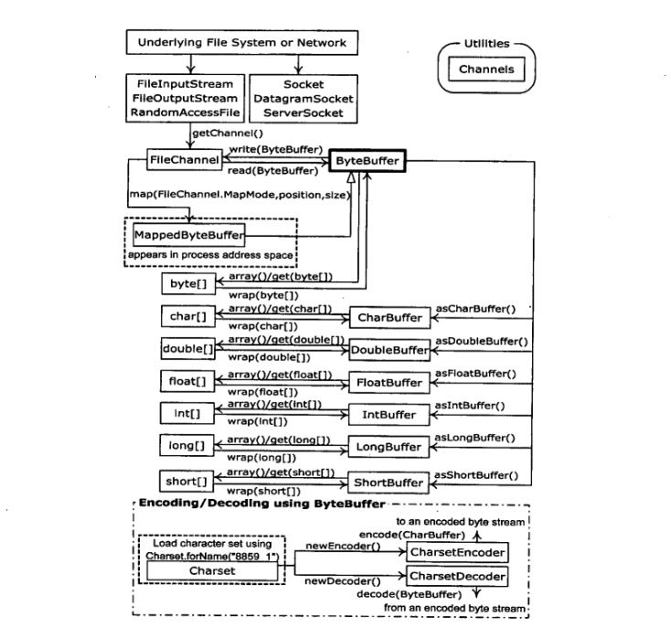

在缓冲器中插入和提取数据的方法会更新这些索引，用于反映所发生的变化。

下面的示例用到一个很简单的算法（交换相邻支付，以对CharBuffer中的字符进行编码（scramble）和译码（unscramble）。

```java
package com.shenhuanjie.io;


import java.nio.ByteBuffer;
import java.nio.CharBuffer;

/**
 * UsingBuffers
 *
 * @author shenhuanjie
 * @date 2019/7/1 11:26
 */
public class UsingBuffers {
    /**
     * @param buffer
     */
    private static void symmetricScramble(CharBuffer buffer) {
        while (buffer.hasRemaining()) {
            buffer.mark();
            char c1 = buffer.get();
            char c2 = buffer.get();
            buffer.reset();
            buffer.put(c2).put(c1);
        }
    }

    public static void main(String[] args) {
        char[] data = "UsingBuffers".toCharArray();
        ByteBuffer bb = ByteBuffer.allocate(data.length * 2);
        CharBuffer cb = bb.asCharBuffer();
        cb.put(data);
        System.out.println(cb.rewind());
        symmetricScramble(cb);
        System.out.println(cb.rewind());
        symmetricScramble(cb);
        System.out.println(cb.rewind());
    }
/**
 * UsingBuffers
 * sUniBgfuefsr
 * UsingBuffers
 */
}

```

尽管可以通过对某个char数组调用wrap()方法来直接产生一个CharBuffer，但是在本例中取而代之的是分配一个底层的ByteBuffer，产生的CharBuffer只是ByteBuffer上的一个视图而已。这里要强调的是，我们总是以操纵ByteBuffer为目标，因为它可以和通道进行交互。

下面是进入symmetricScramble()方法时缓冲器的样子。


position指针指向缓冲器中的第一个元素capacity和limit则指向最后一个元素。

在程序的symmetricScramble()方法中，迭代执行while循环知道posistion等于limit。 一但调用缓冲器上相对的get()和put()函数，position指针就会随之相应改变。我们也可以调用绝对的、包含一个索引参数的get()和put()方法（参数指明get()或put()的发生位置）。不过，这些方法不会改变缓冲器的position指针。

当操纵到while循环时，使用mark()调用来设置mark的值。此时，缓冲器状态如下：

两个相对的get()调用把前两个字符保存到变量c1和c2中，调用完这两个方法后，缓冲器如下：

为了实现交换，我们要在position=0时写入c2，position=1时写入c1。我们也可以使用绝对的put()方法来实现，或者使用reset()把position的值设为mark的值：

这两个put()方法先写c2，接着写c1：

在下一次循环迭代期间，将mark设置成position的当前值：

这个过程将会持续到遍历完整个缓冲器。在while循环的最后，position指向缓冲器的末尾。如果要打印缓冲器，只要打印出position和limit之间的字符。因此，如果显示缓冲器的全部内容，必须使用rewind()把position设置到缓冲器的开始位置。下面是调用rewind()之后缓冲器的状态（mark的值则变得不明确）：

当再次调用symmetricScramble()功能时，会对CharBuffer进行同样的处理，并将其恢复到初始状态。

### 18.10.6 内存映射文件

内存映射文件允许我们创建和修改那些因为太大而不能放入内存的文件。有了内存映射文件，我们就可以假定整个文件都放在内存中，而且可以完全把它当作非常大的数组来访问。这种方法极大地简化了用于修改文件的代码。下面是一个小例子：

```java
package com.shenhuanjie.io;

import java.io.IOException;
import java.io.RandomAccessFile;
import java.nio.MappedByteBuffer;
import java.nio.channels.FileChannel;

/**
 * LargeMappedFiles
 * <p>
 * Creating a very large file using mapping.
 *
 * @author shenhuanjie
 * @date 2019/7/2 20:23
 */
public class LargeMappedFiles {
    static int length = 0x8FFFFFF;//128 MB

    public static void main(String[] args) throws IOException {
        MappedByteBuffer out = new RandomAccessFile("test.dat", "rw").getChannel().map(FileChannel.MapMode.READ_WRITE, 0, length);
        for (int i = 0; i < length; i++) {
            out.put((byte) 'x');
        }
        System.out.println("Finished writing");
        for (int i = length / 2; i < length / 2 + 6; i++) {
            System.out.println((char) out.get(i));
        }
    }
}

```

为了既能写又能读，我们先由RandomAccessFile开始，获得该文件上的通道，然后调用map()产生MappedByteBuffer，这是一种特殊类型的直接缓冲器。注意我们必须指定映射文件的初始位置和映射区域的长度，这意味着我们可以映射某个大文件的较小的部分。

MappedByteBuffer由ByteBuffer继承而来，因此它具有ByteBuffer的所有方法。这里，我们仅仅展示了非常简单的put()和get()，但是我们同样可以使用像asCharBuffer()等这样的用法。

前面那个程序创建到文件为128MB，这可能比操作系统所允许一次载入内存的空间大。但似乎我们可以一次访问到整个文件，因为只有一部分文件放入了内存，文件的其他部分被交互了出去。用这种方式，很大的文件（可达2GB）也可以很容易地修改。注意底层操作系统的文件映射工具是用来最大化地提高性能。

**性能**

尽管“旧”的I/O流在用nio实现后性能有所提高，但是"映射文件访问"往往可以更加显著地加快速度。下面的程序进行了简单的性能比较。

```java

```

正如在本书前面的例子中所看到的那样，runTest()被用作是一种模版方法，为在匿名内部子类中定义的test()的各种实现创建了测试框架）。每种子类都将执行一种测试，因此test()方法为我们进行各种I/O操作提供了原型。

尽管“映射写”似乎要用到FileOutputStream，但是映射文件中的所有输出必须使用RandomAccessFile，正如前面程序代码中的读/写一样。

注意test()方法包括初始化各种I/O对象的事件，因此，即使建立映射文件的花费很大，但是整体受益比起I/O流来说，还是很显著的。

### 18.10.7 文件枷锁

JDK 1.4引入了文件枷锁机制，它允许我们同步访问某个作为共享资源的文件。不过，竞争同一文件的两个线程可能在不同的Java虚拟机上；或者一个是Java线程，另一个是操作系统中其他的某个本地线程。文件所对其他的操作系统进程是可见的，因为Java文件枷锁直接映射到了本地操作系统的加锁工具。

下面是一个关于文件加锁的简单例子。

```java
package com.shenhuanjie.io;

import java.io.FileOutputStream;
import java.io.IOException;
import java.nio.channels.FileLock;
import java.util.concurrent.TimeUnit;

/**
 * FileLocking
 *
 * @author shenhuanjie
 * @date 2019/7/3 16:09
 */
public class FileLocking {
    public static void main(String[] args) throws IOException, InterruptedException {
        FileOutputStream fos = new FileOutputStream("file.txt");
        FileLock fl = fos.getChannel().tryLock();
        if (fl != null) {
            System.out.println("Locked File");
            TimeUnit.MILLISECONDS.sleep(100);
            fl.release();
            System.out.println("Released lock");
        }
        fos.close();
    }
}

```

通过对FileChannel调用tryLock()或lock()，就可以获得整个文件的FileLock。（SocketChannel、DatagramChannel和ServerSocketChannel不需要加锁，因为它们是从单进程实体继承而来；我们通常不在两个进程之间共享socket。）tryLock()是非阻塞的，它设法获取锁，但是如果不能获得（当其他一些进程已经持有相同的锁，并且不共享时），它将直接从方法调用返回。lock()这是阻塞式的，它要阻塞进程直至锁可以获得，或调用lock()的线程中断，或调用lock()的通道关闭。使用FileLock.release()可以释放锁。

也可以使用如下方法对文件的一部分上锁：

```java
tryLock(long position,long size,boolean shared);
```

或者

```java
lock(long position,long size,boolean shared);
```

其中，加锁的区域由size-position决定。第三个参数指定是否是共享锁。

尽管无参数的加锁方法将根据文件尺寸的变化而变化，但是具有固定尺寸的锁不随文件尺寸的变化而变化。如果你获得了某一区域（从position到position+size）上的锁，当文件增大超出position+size时，那么在position+size之外的部分不会被锁定。无参数的加锁方法会对整个文件进行加锁，甚至文件变大后也是如此。

对独占锁或者共享锁的支持必须由底层的操作系统提供。如果操作系统不支持共享锁并为每一个请求都创建一个锁，那么它就会使用独占锁。锁的类型（共享或独占）可以通过FileLock.isShared()进行查询。

**对映射文件的部分加锁**

如前所述，文件映射通常应用于极大的文件。我们可能需要对这种巨大的文件进行部分加锁，以便其他进程可以修改文件中未被加锁的部分。例如，数据库就是这样，因此多个用户可以同时访问到它。

下面例子中有两个线程，分别加锁文件的不同部分。

```java
package com.shenhuanjie.io;

import java.io.IOException;
import java.io.RandomAccessFile;
import java.nio.ByteBuffer;
import java.nio.MappedByteBuffer;
import java.nio.channels.FileChannel;
import java.nio.channels.FileLock;

/**
 * LockingMappedFiles
 * <p>
 * Locking portions of a mapped file.
 *
 * @author shenhuanjie
 * @date 2019/7/3 16:37
 */
public class LockingMappedFiles {
    static final int LENGTH = 0x8FFFFFF; // 128 MB
    static FileChannel fc;

    public static void main(String[] args) throws IOException {
        fc = new RandomAccessFile("test.dat", "rw").getChannel();
        MappedByteBuffer out = fc.map(FileChannel.MapMode.READ_WRITE, 0, LENGTH);
        for (int i = 0; i < LENGTH; i++) {
            out.put((byte) 'x');
        }
        new LockAndModify(out, 0, 0 + LENGTH / 3);
        new LockAndModify(out, LENGTH / 2, LENGTH / 2 + LENGTH / 4);
    }

    private static class LockAndModify extends Thread {
        private ByteBuffer buff;
        private int start, end;

        LockAndModify(ByteBuffer mbb, int start, int end) {
            this.start = start;
            this.end = end;
            mbb.limit(end);
            mbb.position(start);
            buff = mbb.slice();
            start();
        }

        public void run() {
            try {
                // Exclusive lock with no overlap:
                FileLock fl = fc.lock(start, end, false);
                System.out.println("Locked: " + start + " to " + end);
                // Perform modification:
                while (buff.position() < buff.limit() - 1) {
                    buff.put((byte) (buff.get() + 1));
                }
                fl.release();
                System.out.println("Released: " + start + " to " + end);
            } catch (IOException e) {
                throw new RuntimeException(e);
            }
        }
    }
    /**
     * Locked: 75497471 to 113246206
     * Locked: 0 to 50331647
     * Released: 75497471 to 113246206
     * Released: 0 to 50331647
     */
}

```

线程类LockAndModify创建了缓冲区和用于修改的slice()，然后在run()中，获得文件通道上的锁（我们不能获得缓冲器上的锁，只能是通道上的）。lock()调用类似于获得一个对象的线程锁——我们现在处在“临界区“，即对该部分的文件具有独占访问权。

如果有Java虚拟机，它会自动释放锁，或者关闭加锁的通道。不过我们也可以像程序中那样，显式地为FileLock对象调用release()来释放锁。

## 18.11 压缩

Java I/O类库中的类支持读写压缩格式的数据流。你可以用它们对其他的I/O类进行封装，以提供压缩功能。

这些类不是从Reader和Writer类派生而来的，而是属于InputStream和OutputStream继承层次结构的一部分。这样做是因为压缩类库是按字节方式而不是字符方式处理的。不过有时我们可能会被迫要混合使用两种类型的数据流（注意我们可以使用InputStreamReader和OutputStreamWriter在两种类型间方便地进行转换）。

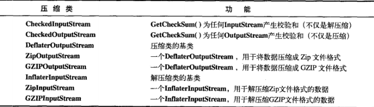

尽管存在许多种压缩算法，但是Zip和GZIP可能是最常用的。因此我们可以很容易地使用多种可读写这些格式的工具来操纵我们的压缩数据。

### 18.11.1 用GZIP进行简单压缩

GZIP接口非常简单，因此如果我们只想对单个数据流（而不是一系列互异数据）进行压缩，那么它可能是比较适合的选择。下面是对单个文件进行压缩的例子：

```java
package com.shenhuanjie.io;

import java.io.*;
import java.util.zip.GZIPInputStream;
import java.util.zip.GZIPOutputStream;

/**
 * GZIPcompress
 *
 * @author shenhuanjie
 * @date 2019/7/3 16:56
 */
public class GZIPcompress {
    public static void main(String[] args) throws IOException {
        if (args.length == 0) {
            System.out.println("Usage: \nGZIPcompress file\n\tUses GZIP compression to compress the file to test.gz");
            System.exit(1);
        }
        BufferedReader in = new BufferedReader(new FileReader(args[0]));
        BufferedOutputStream out = new BufferedOutputStream(new GZIPOutputStream(new FileOutputStream("test.gz")));
        System.out.println("Writing file");
        int c;
        while ((c = in.read()) != -1) {
            out.write(c);
        }
        in.close();
        out.close();
        System.out.println("Reading file");
        BufferedReader in2 = new BufferedReader(new InputStreamReader(new GZIPInputStream(new FileInputStream("test.gz"))));
        String s;
        while ((s = in2.readLine()) != null) {
            System.out.println(s);
        }
    }
    /**
     * Usage:
     * GZIPcompress file
     * 	Uses GZIP compression to compress the file to test.gz
     */
}

```

压缩类的使用非常直观——直接将输出流封装成GZIPOutputStream或ZipOutputStream，并将输入流封装成GZIPInputStream或ZipInputStream即可。其他全部操作就是通常的I/O读写。这个例子把面向字符的流和面向字节的流混合了起来，输入（in）用Reader类，而GZIPOutputStream的构造器只能接收OutputStream对象，不能接收Writer对象。在打开文件时，GZIPInputStream就会被转换成Reader。

### 18.11.2 用Zip进行多文件保存

支持Zip格式的Java库更加全面。利用该库可以方便地保存多个文件，它甚至有一个独立的类，使得读取Zip文件更加方便。这个类库使用的是标准Zip格式，所以能与当前那些可通过因特网下载的压缩工具很好地协作。下面这个例子具有与前例相同的形式，但它能根据需要来处理任意多个命令行参数。另外，它显示了用Checksum类来计算和校验文件的校验和的方法。一共有两种Checksum类：Adler32（它快一些）和CRC32（慢一些，但更准确）。

```java
package com.shenhuanjie.io;

import java.io.*;
import java.util.Enumeration;
import java.util.zip.*;

/**
 * ZipCompress
 * <p>
 * Uses Zip compression to compress any
 * number of files given on the command line.
 *
 * @author shenhuanjie
 * @date 2019/7/3 17:11
 */
public class ZipCompress {
    public static void main(String[] args) throws IOException {
        FileOutputStream f = new FileOutputStream("test.zip");
        CheckedOutputStream csum = new CheckedOutputStream(f, new Adler32());
        ZipOutputStream zos = new ZipOutputStream(csum);
        BufferedOutputStream out = new BufferedOutputStream(zos);
        zos.setComment("A test of Java Zipping");
        // No corresponding getComment(). though.
        for (String arg : args) {
            System.out.println("Writing file " + arg);
            BufferedReader in = new BufferedReader(new FileReader(arg));
            zos.putNextEntry(new ZipEntry(arg));
            int c;
            while ((c = in.read()) != -1) {
                out.write(c);
            }
            in.close();
            out.flush();
        }
        out.close();
        // Checksum valid only after the file has been closed!
        System.out.println("Checksum: " + csum.getChecksum().getValue());
        // Now extract the files:
        System.out.println("Reading file");
        FileInputStream fi = new FileInputStream("test.zip");
        CheckedInputStream csumi = new CheckedInputStream(fi, new Adler32());
        ZipInputStream in2 = new ZipInputStream(csumi);
        BufferedInputStream bis = new BufferedInputStream(in2);
        ZipEntry ze;
        while ((ze = in2.getNextEntry()) != null) {
            System.out.println("Reading file " + ze);
            int x;
            while ((x = bis.read()) != -1) {
                System.out.write(x);
            }
        }
        if (args.length == 1) {
            System.out.println("Checksum: " + csumi.getChecksum().getValue());
        }
        bis.close();
        // Alternative way to open and read Zip files:
        ZipFile zf = new ZipFile("test.zip");
        Enumeration e = zf.entries();
        while (e.hasMoreElements()) {
            ZipEntry ze2 = (ZipEntry) e.nextElement();
            System.out.println("File: " + ze2);
            // ... and extract the data as before
        }
    }
    /**
     * Checksum: 1923287158
     * Reading file
     */
}

```

对于每一个要加入压缩档案的文件，都必须调用putNextEntry()，并将其传递给一个ZipEntiry对象。ZipEntry对象包含了一个功能很广泛的接口，允许你获取和设置Zip文件内该特定项上所有可利用的数据：名字、压缩的和未压缩的文件大小、日期、CRC校验和、额外字段数据、注释、压缩方法以及它是否一个目录入口等等。然而，尽管Zip格式提供了设置密码的方法，但Java的Zip类库并不提供这方面的支持。虽然CheckedInputStream和CheckedOutputStream都支持Adler32和CRC32两种类型的校验和，但是ZipEntry类只有一个支持CRC的接口。虽然这是一个底层Zip格式的限制，但却限制了人们不能使用速度更快的Adler32。

为了能够解压缩文件，ZipInputStream提供了一个getNextEntry()方法返回下一个ZipEntry（如果存在的话）。解压缩文件有一个更简便的方法——利用ZipFile对象读取文件。该对象有一个entries()方法用来向ZipEntries返回一个Enumeration（枚举）。

为了读取校验和，必须拥有对与之相关联的Checksum对象的访问权限。在这里保留了指向CheckOutputStream和CheckInputStream对象的引用。但是，也可以保留一个指向Checksum对象的引用。

Zip流中有一个令人困惑的方法setComment()。正如前面ZipCompress.java中所示，我们可以在写文件时写注释，但却没有任何方法恢复ZipInputStream内的注释。似乎只能通过ZipEntry，才能以逐条方式完全支持注释的获取。

当然，GZIP或Zip库的使用并不仅仅局限于文件——它可以压缩任何东西，包括需要通过网络发送的数据。

### 18.11.3 Java档案文件

Zip格式也被应用于JAR（Java ARchive，Java档案文件）文件格式中。这种文件格式就像Zip一样，可以将一组文件压缩到单个压缩文件中。同Java中其他任何东西一样，JAR文件也是跨平台的，所以不必担心跨平台的问题。声音和图像文件可以像类文件一样被包含在其中。

JAR文件非常有用，尤其是在涉及因特网应用的时候。如果不采用JAR文件，Web浏览器在下载构成一个应用的所有文件时必须重复多次请求Web服务器，而且所有这些文件都是未经压缩的。如果将所有这些文件合并到一个JAR文件中，只需向远处服务器发出一次请求即可。同时，由于采用了压缩技术，可以使传输时间更短。另外，出于安全的考虑，JAR文件中的每个条目都可以加上数字化签名。

一个JAR文件由一组压缩文件构成，同时还有一张描述了所有这些文件的“文件清单”（可自行创建文件清单，也可以由jar程序自动生成）。在JDK文档中，可以找到与JAR文件清单相关的更多资料。

Sun的JDK自带的jar程序可根据我们的选择自动压缩文件。可以用命令行的形式调用它，如下所示：

```cmd
jar [options] destination [manifest] inputfile(s)
```

其中options只是一个字母集合（不必输入任何“-”或其他任何标识符）。以下这些选项字符在Unix和Linux系统中的tar文件中也具有相同的意义。具体意义如下所示：

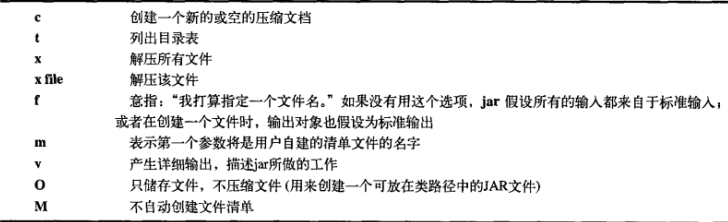

如果压缩到JAR文件的众多文件中包含某子目录，那么该子目录会被自动添加到JAR文件中，且包括了当前目录中的所有类文件，以及自动产生的清单文件：

```cmd
jar cf myJarFile.jar *.class
```

下面的命令与前例类似，但添加了一个名为myManifestFile.mf的用户自建清单文件：

```cmd
jar cmf myJarFile.jar myManifestFile.mf *.class
```

下面的命令会产生myJarFile.jar内所有文件的一个目录表：

```cmd
jar tf myJarFile.jar
```

下面的命令添加“v"（详尽）标志，可以提供有关myJarFile.jar中的文件的更详细的信息：

```cmd
jar tvf myJarFile.jar
```

假定audio、classes和image是子目录，下面的命令将所有子目录合并到文件myApp.jar中，其中也包括了"v"标志。当jar程序运行是，该标志可以提供更详细的信息：

```cmd
jar cvf myApp.jar audio classes image
```

如果用0（零）选项创建一个JAR文件，那么该文件就可放入类路径变量（CLASSPATH）中：

```cmd
CLASSPATH="lib1.jar;lib2.jar;"
```

然后Java就可以在lib1.jar和lib2.jar中搜索目标类文件了。

jar工具的功能没有zip工具那么强大。例如，不能够对已有的JAR文件进行添加或更新文件的操作，只能从头创建一个JAR文件。同时，也不能将文件移动至一个JAR文件，并在移动后将它们删除。然而，在一种平台上创建的JAR文件可以被在其他平台上的jar工具透明地阅读（这个问题有时会困扰zip工具）。

读者将会在第22章看到，JAR文件也被用来为JavaBeans打包。

## 18.12 对象序列化

当你创建对象时，只要你需要，它就会一直存在，但是在程序终止时，无论如何它都不会继续存在。尽管这么做肯定是有意义的，但是仍旧存在某些情况，如果对象能够在程序不运行的情况下仍能存在并保存其信息，那将非常有用。这样，在下次运行程序时，该对象将被重建并且拥有的信息与程序上次运行时它所拥有的信息相同。当然，你可以通过将信息写入文件或数据库来达到相同的效果，但是在使万物都成为对象的精神中，如果能够将一个对象声明为是”持久性“的，并为我们处理掉所有细节，那将会显得十分方便。

Java的对象序列化将那些实现了Serializable接口的对象转换成一个字节序列，并能够在以后将这个字节序列完全恢复为原来的对象。这一过程甚至可以通过网络进行，这意味着序列化机制能自动弥补不同操作系统之间的差异。也就是说，可以在运行Windows系统的计算机上创建一个对象，将其序列化，通过网络将它发送给一台运行Unix系统的计算机，然后在那里准确地重新组装，而却不必担心数据在不同机器上的表示不同，也不必关心字节的顺序或者其他任何细节。

就其本身来说，对象的序列化是非常有趣的，因为利用它可以实现轻量级持久性（lightweight persistence）。“持久性”意味着一个对象的生存周期并不取决于程序是否正在运行，它可以生存于程序的调用之间。通过将一个序列化对象写入磁盘，然后在重新调用程序时恢复该对象，就能够实现持久性的效果。之所以称其为“轻量级”，是因为不能用某种“persisten”（持久）关键字来简单地定义一个对象，并让系统自动维护其他细节问题（尽管将来有可能实现）。相反，对象必须在程序中显式地序列化（serialize）和反序列化还原（deserialize）。如果需要一个更严格的持久性机制，可以考虑像Hibernate之类的工具（参见http://hibernate.sourceforge.net）。更多的细节可参考《Thinking in Enterprise Java》，该书可从www.mindview.com下载。

对象序列化的概念加入到语言中是为了支持两种主要特性。一是Java的远程方法调用（Remote Method Invocation，RMI），它使存活于其他计算机上的对象使用起来就像是存活于本机上一样。当向远程对象发送消息时，需要通过对象序列化来传输参数和返回值。在《Thinking in Enterprise Java》中有对RMI的具体讨论。

再者，对Java Beans来说，对象的序列化也是必需的（可参看第14章）。使用一个Bean时，一般情况下是在设计阶段对它的状态信息进行配置。这种状态信息必须保存下来，并在程序启动时进行后期恢复，这种具体工作就是由对象序列化完成的。

只要对象实现了Serializable接口（该接口仅是一个标记接口，不包括任何方法），对象的序列化处理就会非常简单。当序列化的概念被加入到语言中时，许多标准类库都发生了改变，以便具备序列化特性——其中包括所有基本数据类型的封装器、所有容器类以及许多其他的东西。甚至Class对象也可以被序列化。

要序列化一个对象，首先要创建某些OutputStream对象，然后将其封装在一个ObjectOutputStream对象内。这时，只需调用writeObject()即可将对象序列化，并将其发送给OutputStream（对象序列化是基于字节的，因要使用InputStream和OutputStream继承层次结构）。要反向进行该过程（即将一个序列还原为一个对象），需要将一个InputStream封装在ObjectInputStream内，然后调用readObject()。和往常一样，我们最后获得的是一个引用，它指向一个向上转型的Object，所以必须向下转型才能直接设置它们。

对象序列化特别“聪明”的一个地方是它不仅保存了对象的“全景图”，而且能追踪对象内所包含的所有引用，并保存那些对象，接着又能对对象内包含的每个这样的引用进行追踪，依此类推。这种情况有时被称为“对象网”，单个对象可与之建立连接，而且它还包含了对象的引用数组以及成员对象。如果必须保持一套自己的对象序列化机制，那么维护那些可追踪到所有链接的代码可能会显得非常麻烦。然而，由于Java的对象序列化似乎找不出什么缺点，所以请尽量不要自己动手，让它用优化的算法自动维护整个对象网。下面这个例子通过对链接的对象生成一个worm（蠕虫）对序列化机制进行了测试。每个对象都与worm中的下一段链接，同时又与属于不同类（Data）的对象引用数组链接：

```java
package com.shenhuanjie.io;

import java.io.*;
import java.util.Random;

/**
 * Worm
 * <p>
 * Demonstrates object serialization.
 *
 * @author shenhuanjie
 * @date 2019/7/4 9:18
 */
public class Worm implements Serializable {
    private static final long serialVersionUID = -5954682963367938607L;
    private static Random rand = new Random(47);
    private Data[] d = {
            new Data(rand.nextInt(10)),
            new Data(rand.nextInt(10)),
            new Data(rand.nextInt(10))
    };
    private Worm next;
    private char c;

    // Value of i == number of segments
    public Worm(int i, char x) {
        System.out.println("Worm constructor: " + i);
        c = x;
        if (--i > 0) {
            next = new Worm(i, (char) (x + 1));
        }
    }

    public Worm() {
        System.out.println("Default constructor");
    }

    public static void main(String[] args) throws IOException, ClassNotFoundException {
        Worm w = new Worm(6, 'a');
        System.out.println("w = " + w);
        ObjectOutputStream out = new ObjectOutputStream(new FileOutputStream("worm.out"));
        out.writeObject("Worm storage\n");
        out.writeObject(w);
        out.close();// Also flushes output
        ObjectInputStream in = new ObjectInputStream(new FileInputStream("worm.out"));
        String s = (String) in.readObject();
        Worm w2 = (Worm) in.readObject();
        System.out.println(s + "w2 = " + w2);
        ByteArrayOutputStream bout = new ByteArrayOutputStream();
        ObjectOutputStream out2 = new ObjectOutputStream(bout);
        out2.writeObject("Worm storage\n");
        out2.writeObject(w);
        out2.flush();
        ObjectInputStream in2 = new ObjectInputStream(new ByteArrayInputStream(bout.toByteArray()));
        s = (String) in2.readObject();
        Worm w3 = (Worm) in2.readObject();
        System.out.println(s + "w3 = " + w3);
    }

    @Override
    public String toString() {
        StringBuilder result = new StringBuilder(":");
        result.append(c);
        result.append("(");
        for (Data dat : d) {
            result.append(dat);
        }
        result.append(")");
        if (next != null) {
            result.append(next);
        }
        return result.toString();
    }
}

class Data implements Serializable {
    private static final long serialVersionUID = -8533311713105021892L;
    private int n;

    public Data(int n) {
        this.n = n;
    }

    @Override
    public String toString() {
        return Integer.toString(n);
    }
}
/**
 * Worm constructor: 6
 * Worm constructor: 5
 * Worm constructor: 4
 * Worm constructor: 3
 * Worm constructor: 2
 * Worm constructor: 1
 * w = :a(853):b(119):c(802):d(788):e(199):f(881)
 * Worm storage
 * w2 = :a(853):b(119):c(802):d(788):e(199):f(881)
 * Worm storage
 * w3 = :a(853):b(119):c(802):d(788):e(199):f(881)
 */

```

更有趣的是，Worm内的Data对象数组是用随机数初始化的（这样就不用怀疑编辑器保留了某种原始信息）。每个Worm段都用一个char加以标记。该cahr是在递归生成链接的Worm列表时自动生成的。要创建一个Worm，必须告诉构造器你所希望的它的长度。在产生下一个引用时，要调用Worm构造器，并将长度减1，以此类推。最后一个next引用则为null（空），表示已达到Worm的尾部。

以上这些操作都使得事情变得更加复杂，从而加大了序列化的难度。然而，真正的序列化过程却是非常简单的。一旦从另外某个流创建了ObjectOutputStream，writeObject()就会将对象序列化。注意也可以为一个String调用writeObject()。也可以用与DataOutputStream相同的方法写入所有基本数据类型（它们具有同样的接口）。

有两段看起来相似的独立代码。一个读写的是文件，而另一个读写的是字节数组（ByteArray）。可利用序列化将对象读写到任何DataInputStream或者DataOutputStream，甚至包括网络（正如在《Thinking in Enterprise Java》中所述）。

从输出中可以看出，被还原后的对象确实包含了原对象中的所有链接。

注意在对一个Serializable对象进行还原的过程中，没有调用任何构造器，包括默认的构造器。整个对象都是通过从InputStream中取得数据恢复而来的。

### 18.12.1 寻找类

读者或许会奇怪，将一个对象从它的序列化状态中恢复出来，有哪些工作是必须的呢？举个例子来说，假如我们将一个对象序列化，并通过网络将其作为文件传送给另一台计算机，那么，另一台计算机上的程序可以只利用该文件内容来还原这个对象吗？

回答这个问题的最好方法就是做一个实验。下面这个文件位于本章的子目录下：

```java
package com.shenhuanjie.io;

import java.io.Serializable;

/**
 * Alien
 *
 * @author shenhuanjie
 * @date 2019/7/4 9:53
 */
public class Alien implements Serializable {
    private static final long serialVersionUID = 2289435067450849006L;
}

```

而用于创建和序列化一个Alien对象的文件也位于相同的目录下：

```java
package com.shenhuanjie.io;

import java.io.FileOutputStream;
import java.io.IOException;
import java.io.ObjectOutput;
import java.io.ObjectOutputStream;

/**
 * FreezaAlien
 *
 * @author shenhuanjie
 * @date 2019/7/4 9:53
 */
public class FreezaAlien {
    public static void main(String[] args) throws IOException {
        ObjectOutput out = new ObjectOutputStream(new FileOutputStream("X.file"));
        Alien quellek = new Alien();
        out.writeObject(quellek);
    }
}

```

这个程序不但能捕获和处理异常，而且将异常抛出到main()方法之外，以便通过控制台产生报告。一旦该程序被编译和运行，它就会在c12目录下产生一个名为X.file的文件。以下代码位于一个名为xfiles的子目录下：

```java
package com.shenhuanjie.io.xfiles;

import java.io.File;
import java.io.FileInputStream;
import java.io.IOException;
import java.io.ObjectInputStream;

/**
 * ThawAlien
 * <p>
 * Try to recover a serialized file without the
 * class of object that's stored in that file.
 *
 * @author shenhuanjie
 * @date 2019/7/4 9:57
 */
public class ThawAlien {
    public static void main(String[] args) throws IOException, ClassNotFoundException {
        ObjectInputStream in = new ObjectInputStream(new FileInputStream(new File("X.file")));
        Object mystery = in.readObject();
        System.out.println(mystery.getClass());
    }
    /**
     * class com.shenhuanjie.io.Alien
     */
}

```

打开文件和读取mystery对象中的内容都需要Alien的Class对象，而Java虚拟机找不到Alien.class（除非它正好在类路径Classpath内，而本例却不在类路径之内）。这样就会得到一个名叫ClassNotFoundException的异常（同样，除非能够验证Alien存在，否则它等于消失）。必须保证Java虚拟机能找到相关的.class文件。

### 18.12.2 序列化的控制

正如大家所看到的，默认的序列化机制并不难操纵。然而，如果有特殊的需要那么又该怎么办呢？例如，也许要考虑特殊的安全问题，而且你不希望对象的某一部分被序列化，或者一个对象被还原以后，某子对象需要重新创建，从而不必将该子对象序列化。

在这些特殊情况下，可通过实现Externalizable接口——代替实现Serializable接口——来对序列化过程进行控制。这个Externalizable接口继承了Serializable接口，同时增添了两个方法：writeExternal()和readExternal()。这两个方法会在序列化和反序列化还原的过程中被自动调用，以便执行一些特殊操作。

下面这个例子展示了Externalizable接口方法的简单实现。注意Blip1和Blip2除了细微的差别之外，几乎完全一致（研究一下代码，看看你能否发现）：

```java
package com.shenhuanjie.io;

import java.io.*;

/**
 * Blips
 * <p>
 * Simple use of Externalizable & a pitfall.
 *
 * @author shenhuanjie
 * @date 2019/7/4 10:10
 */
public class Blips {
    public static void main(String[] args) throws IOException, ClassNotFoundException {
        System.out.println("Constructing objects: ");
        Blip1 b1 = new Blip1();
        Blip2 b2 = new Blip2();
        ObjectOutputStream o = new ObjectOutputStream(new FileOutputStream("Blips.out"));
        System.out.println("Saving objects: ");
        o.writeObject(b1);
        o.writeObject(b2);
        o.close();
        // Now get them back:
        ObjectInputStream in = new ObjectInputStream(new FileInputStream("Blips.out"));
        System.out.println("Recovering b1: ");
        b1 = (Blip1) in.readObject();
        // OOPS! Throws an exception:
        //System.out.println("Recovering b2: ");
        //b2 = (Blip2) in.readObject();
    }
    /**
     * Constructing objects:
     * Blip1 Constructor
     * Saving objects:
     * Blip1.writeExternal
     * Blip2.writeExternal
     * Recovering b1:
     * Blip1 Constructor
     * Blip1.readExternal
     */
}

class Blip1 implements Externalizable {
    private static final long serialVersionUID = -8837259786773859126L;

    public Blip1() {
        System.out.println("Blip1 Constructor");
    }

    @Override
    public void writeExternal(ObjectOutput out) throws IOException {
        System.out.println("Blip1.writeExternal");
    }

    @Override
    public void readExternal(ObjectInput in) throws IOException, ClassNotFoundException {
        System.out.println("Blip1.readExternal");
    }
}

class Blip2 implements Externalizable {
    private static final long serialVersionUID = -8343605754652118024L;

    Blip2() {
    }

    @Override
    public void writeExternal(ObjectOutput out) {
        System.out.println("Blip2.writeExternal");
    }

    @Override
    public void readExternal(ObjectInput in) {
        System.out.println("Blip2.readExternal");
    }
}

```

上例中没有恢复Blip2对象，因为那样做会导致一个异常。你找出Blip1和Blip2之间的区别了吗？Blip1的构造器是“公共的”（public），Blip2的构造器却不是，这样就会在恢复时造成异常。试试将Blip2的构造器变成public的，然后删除//!注释标记，看看是否能得到正确的结果。

恢复b1后，会调用Blip1默认构造器。这与恢复一个Serializable对象不同。对于Serializable对象，对象完全以它存储的二进制位为基础来构造，而不调用构造器。而对于一个Externalizable对象，所有普通的默认构造器都会被调用（包括在字段定义时的初始化），然后调用readExternal()。必须注意这一点——所有默认的构造器都会被调用，才能使Externalizable对象产生正确的行为。

下面这个例子示范了如何完整保存和恢复一个Externalizable对象：

```java
package com.shenhuanjie.io;

import java.io.*;

/**
 * Blip
 * <p>
 * Reconstructing an externalizable object.
 *
 * @author shenhuanjie
 * @date 2019/7/4 10:27
 */
public class Blip3 implements Externalizable {
    private static final long serialVersionUID = 7097215454451566069L;
    private int i;
    private String s;

    public Blip3() {
        System.out.println("Blip3 Constructor");
        // s, i not initialized
    }

    public Blip3(String x, int a) {
        System.out.println("Blip3(String x, int a");
        this.s = x;
        this.i = a;
        // s & i initialized only in non-default constructor.
    }

    public static void main(String[] args) throws IOException, ClassNotFoundException {
        System.out.println("Constructing objects: ");
        Blip3 b3 = new Blip3("A String ", 47);
        System.out.println(b3);
        ObjectOutputStream o = new ObjectOutputStream(new FileOutputStream("Blip3.out"));
        System.out.println("Saving object: ");
        o.writeObject(b3);
        o.close();
        // Now get it back;
        ObjectInputStream in = new ObjectInputStream(new FileInputStream("Blip3.out"));
        System.out.println("Recovering b3:");
        b3 = (Blip3) in.readObject();
        System.out.println(b3);
    }

    @Override
    public String toString() {
        return s + i;
    }

    @Override
    public void writeExternal(ObjectOutput out) throws IOException {
        System.out.println("Blip3.writeExternal");
        // You must do this;
        out.writeObject(s);
        out.writeInt(i);
    }

    @Override
    public void readExternal(ObjectInput in) throws IOException, ClassNotFoundException {
        System.out.println("Blip3.readExternal");
        // You must do this;
        s = (String) in.readObject();
        i = in.readInt();
    }
    /**
     * Constructing objects:
     * Blip3(String x, int a
     * A String 47
     * Saving object:
     * Blip3.writeExternal
     * Recovering b3:
     * Blip3 Constructor
     * Blip3.readExternal
     * A String 47
     */
}

```

其中，字段s和i只在第二个构造器中初始化，而不是在默认的构造器中初始化。这意味着假如不在readExternal()中初始化s和i，s就会为null，而i就会为零（因为在创建对象的第一步中将对象的存储空间清理为0）。如果注释掉跟随于“You must do this”后面的两行代码，然后运行程序，就会发现当对象被还原后，s是null，而i是零。

我们如果从一个Externalizable对象继承，通常需要调用基类版本的writeExternal()和readExternal()来为基类组件提供恰当的存储和恢复功能。

因此，为了正常运行，我们不仅需要在writeExternal()方法（没有任何默认行为来为Externalizable对象写入任何成员对象）中将来自对象的重要信息写入，还必须在readExternal()方法中恢复数据。起先，可能会有一点迷惑，因为Externalizable对象的默认构造行为使其看起来似乎像某种自动发生的存储与恢复操作。但实际上并非如此。

**transient（瞬时）关键字**

当我们对序列化进行控制时，可能某个特定子对象不想让Java的序列化机制自动保存与恢复。如果子对象表示的是我们不希望将其序列化的敏感信息（如密码），通常就会面临这种情况。即使对象中的这些信息是private（私有）属性，一经序列化处理，人们就可以通过读取文件或者拦截网络传输的方式来访问到它。

有一种办法可防止对象的敏感部分被序列化，就是将类实现为Externalizable，如前面所示。这样一来，没有任何东西可以自动序列化，并且可以在writeExternal()内部只对所需部分进行显式的序列化。

然而，如果我们正在操作的是一个Serializable对象，那么所有序列化操作都会自动进行。为了能够予以控制，可以用transient（瞬时）关键字逐个字段地关闭序列化，它的意思是“不用麻烦你保存或恢复数据——我自己会处理的“。

例如，假设某个Login对象保存某个特定的登录会话信息。登录的合法性通过检验之后，我们想把数据保存下来，但不包括密码。为做到这一点，最简单的办法是实现Serializable，并将password字段标志为transient。下面是具体的代码：

```java
package com.shenhuanjie.io;

import java.io.*;
import java.util.Date;
import java.util.concurrent.TimeUnit;

/**
 * Logon
 * <p>
 * Demonstrates the "transient" keyword.
 *
 * @author shenhuanjie
 * @date 2019/7/4 17:19
 */
public class Logon implements Serializable {

    private static final long serialVersionUID = 3141695255302377759L;
    private Date date = new Date();
    private String username;
    private transient String password;

    public Logon(String name, String pwd) {
        this.username = name;
        this.password = pwd;
    }

    public static void main(String[] args) throws IOException, InterruptedException, ClassNotFoundException {
        Logon a = new Logon("Hulk", "myLittlePony");
        System.out.println("logon a = " + a);
        ObjectOutputStream o = new ObjectOutputStream(new FileOutputStream("Logon.out"));
        o.writeObject(a);
        o.close();
        TimeUnit.SECONDS.sleep(1);// Delay
        // Now get them back;
        ObjectInputStream in = new ObjectInputStream(new FileInputStream("Logon.out"));
        System.out.println("Recovering object at " + new Date());
        a = (Logon) in.readObject();
        System.out.println("logon a = " + a);
    }

    @Override
    public String toString() {
        return "logon info: \n" +
                "    username: " + username +
                "\n    date: " + date + "\n    password: " + password;
    }
    /**
     * logon a = logon info:
     *     username: Hulk
     *     date: Thu Jul 04 17:26:09 CST 2019
     *     password: myLittlePony
     * Recovering object at Thu Jul 04 17:26:10 CST 2019
     * logon a = logon info:
     *     username: Hulk
     *     date: Thu Jul 04 17:26:09 CST 2019
     *     password: null
     */
}

```

可以看到，其中的date和username域是一般的（不是transient的），所以它们会被自动序列化。而password是transient的，所以不会被自动保存到磁盘；另外，自动序列化机制也不会尝试去恢复它。当对象被恢复时，password域就会变成null。注意，虽然toString()是用，重载后的+运算符来连接String对象，但是null引用会被自动转换成字符串null。

我们还可以发现：date字段被存储了到磁盘并从磁盘上被恢复了出来，而且没有再重新生成。

由于Externalizable对象在默认情况下不保存它们的任何字段，所以transient关键字只能和Serializable对象一起使用。

**Externalizable的替代方法**

如果不是特别坚持实现Externalizable接口，那么还有另一种方法。我们可以实现Serializable接口，并添加（注意我说的是“添加”，而非“覆盖”或者“实现”）名为writeObject()和readObject()的方法。这样一旦对象被序列化或者被反序列化还原，就会自动地分别调用这两个方法。也就是说，只要我们提供了这两个方法，就会使用它们而不是默认的序列化机制。

这些方法必须具有准确的方法特征签名：

```java
private void writeObject(ObjectOutputStream stream)
    throws IOException;

private void readObject(ObjectIutputStream stream)
    throws IOException, ClassNotFoundException;
```

从设计的观点来看，现在事情变得真是不可思议。首先，我们可能会认为由于这些方法不是基类或者Serializable接口的一部分，所以应该在它们自己的接口中进行定义。但是注意它们被定义成了private，这意味着它们仅能被这个类的其他成员调用。然而，实际上我们并没有从这个类的其他方法中调用它们，而是ObjectOutputStream和ObjectInputStream对象的writeObject()和readObject()方法调用你的对象的writeObject()和readObject()方法（注意关于这里用到的相同方法名，我尽量抑制住不去谩骂。一句话：混乱）。读者可能想知道ObjectOutputStream和ObjectInputStream对象是怎样访问你的类中的private方法的。我们只能假设这正是序列化神奇的一部分。

在接口中定义的所有东西都自动是public的，因此如果writeObject()和readObject()必须是private的，那么它们不会是接口的一部分。因为我们必须要完全遵循其方法特征签名，所以其效果就和实现了接口一样。

在调用ObjectOutputStream.writeObject()时，会检查所传递的Serializable对象，看看是否实现了它自己的writeObject()。如果是这样，就跳过正常的序列化过程并调用它的writeObject()。readObject()的情形与此相同。

还有另外一个技巧。在你的writeObject()内部，可以调用defaultWriteObject()来选择执行默认的writeObject()。类似地，在readObject()内部，我们可以调用defaultReadObject()。下面这个简单的例子演示了如何对一个Serializable对象的存储与恢复进行控制：

```java
package com.shenhuanjie.io;

import java.io.*;

/**
 * SerialCtl
 * <p>
 * Controlling serialization by adding your own
 * writeObject() and readObject() methods.
 *
 * @author shenhuanjie
 * @date 2019/7/4 17:42
 */
public class SerialCtl implements Serializable {
    private static final long serialVersionUID = -6934971142229216642L;
    private String a;
    private transient String b;

    public SerialCtl(String aa, String bb) {
        this.a = "Not Transient: " + aa;
        this.b = "Transient: " + bb;
    }

    public static void main(String[] args) throws IOException, ClassNotFoundException {
        SerialCtl sc = new SerialCtl("Test1", "Test2");
        System.out.println("Before:\n" + sc);
        ByteArrayOutputStream buf = new ByteArrayOutputStream();
        ObjectOutputStream o = new ObjectOutputStream(buf);
        o.writeObject(sc);
        // Now get it back;
        ObjectInputStream in = new ObjectInputStream(new ByteArrayInputStream(buf.toByteArray()));
        SerialCtl sc2 = (SerialCtl) in.readObject();
        System.out.println("After:\n" + sc2);
    }

    @Override
    public String toString() {
        return a + "\n" + b;
    }

    private void writeObject(ObjectOutputStream stream) throws IOException {
        stream.defaultWriteObject();
        stream.writeObject(b);
    }

    private void readObject(ObjectInputStream stream) throws IOException, ClassNotFoundException {
        stream.defaultReadObject();
        b = (String) stream.readObject();
    }

    /**
     * Before:
     * Not Transient: Test1
     * Transient: Test2
     * After:
     * Not Transient: Test1
     * Transient: Test2
     */
}

```

在这个例子中，有一个String字段是普通字段，而另一个是transient字段，用来证明非transient字段由defaultWriteObject()方法保存，而transient字段必须在程序中明确保存和恢复。字段是在构造器内部而不是在定义处进行初始化的，以此可以证实它们在反序列化还原期间没有被一些自动化机制初始化。

如果我们打算使用默认机制写入对象的非transient部分，那么必须调用defaultWriteObject()作为writeObject()中的第一个操作，并让defaultReadObject()作为readObject()中的第一个操作。这些都是奇怪的方法调用。例如，如果我们正在为ObjectOutputStream调用defaultWriteObject()且没有传递任何参数，然而不知何故它却可以运行，并且知道对象的引用以及如何写入非transient部分。真是奇怪之极。

对transient对象的存储和恢复使用了我们比较熟悉的代码。请再考虑一下在这里所发生的事情。在main()中，创建SerialCtl对象，然后对其序列化到ObjectOutputStream（注意在这种情况下，使用的是缓冲区而不是文件——这对于ObjectOutputStream来说是完全一样的）。序列化发生在下面这行代码当中。

```java
o.writeObject(sc)
```

writeObject()方法必须检查sc，判断它是否拥有自己的writeObject()方法（不是检查接口——这里根本就没有接口，也不是检查类的类型，而是利用反射来真正地搜索方法）。如果有，那么就会使用它。对readObject()也采用了类似的方法。或许这是解决这个问题的唯一切实可行的方法，但它确实有点古怪。

**版本控制**

有时可能想要改变可序列化类的版本（比如源类的对象可能保存在数据库中）。虽然Java支持这种做法。但是你可能只在特殊的情况下才这样做，此外，还需要对它有相当深程度的了解（在这里我们就不再试图达到这一点）。从http://java.sum.com处下载的JDK文档中对这一主题进行了非常彻底的论述。

我们会发现在JDK文档中有许多注解是从下面的文字开始的：

> **警告** 该类的序列化对象和未来的Swing版本不兼容。当前对序列化的支持只适用于短期存储或应用之间的RMI。

这是因为Java的版本控制机制过于简单，因而不能在任何场合都可靠运转，尤其是对JavaBeans更是如此。有关人员正在设法修正这一设计，也就是警告中的相关部分。

### 18.12.3 使用“持久性”

一个比较诱人的使用序列化技术的想法是：存储程序的一些状态，以便我们随后可以很容易地将程序恢复到当前状态。但是在我们能够这样做之前，必须回答几个问题。如果我们将两个对象——它们都具有指向第三个对象的引用——进行序列化，会发生什么情况？当我们从它们的序列化状态恢复这两个对象时，第三个对象会只出现一次吗？如果将这两个对象序列化成独立的文件，然后在代码的不同部分对它们进行反序列化还原，又会怎样呢？

下面这个例子说明了上述问题：

```java
package com.shenhuanjie.io;

import java.io.*;
import java.util.ArrayList;
import java.util.List;

/**
 * MyWorld
 *
 * @author shenhuanjie
 * @date 2019/7/8 10:42
 */
public class MyWorld {
    public static void main(String[] args) throws IOException, ClassNotFoundException {
        House house = new House();
        List<Animal> animals = new ArrayList<>();
        animals.add(new Animal("Bosco the dog", house));
        animals.add(new Animal("Ralph the hamster", house));
        animals.add(new Animal("Molly the cat", house));
        System.out.println("animals: " + animals);
        ByteArrayOutputStream buf1 = new ByteArrayOutputStream();
        ObjectOutputStream o1 = new ObjectOutputStream(buf1);
        o1.writeObject(animals);
        o1.writeObject(animals);// Write a 2nd set
        // Write to a different stream:
        ByteArrayOutputStream buf2 = new ByteArrayOutputStream();
        ObjectOutputStream o2 = new ObjectOutputStream(buf2);
        o2.writeObject(animals);
        // Now get them back:
        ObjectInputStream in1 = new ObjectInputStream(new ByteArrayInputStream(buf1.toByteArray()));
        ObjectInputStream in2 = new ObjectInputStream(new ByteArrayInputStream(buf2.toByteArray()));
        List animals1 = (List) in1.readObject(),
                animals2 = (List) in1.readObject(),
                animals3 = (List) in2.readObject();
        System.out.println("animal1: " + animals1);
        System.out.println("animal2: " + animals2);
        System.out.println("animal3: " + animals3);

    }
}

class House implements Serializable {
    private static final long serialVersionUID = -4912609093702189990L;
}

class Animal implements Serializable {
    private static final long serialVersionUID = 5158892138171026608L;
    private String name;
    private House preferredHouse;

    public Animal(String name, House preferredHouse) {
        this.name = name;
        this.preferredHouse = preferredHouse;
    }

    @Override
    public String toString() {
        return name + "[" + super.toString() + "]." + preferredHouse + "\n";
    }
}
/**
 * animals: [Bosco the dog[com.shenhuanjie.io.Animal@1540e19d].com.shenhuanjie.io.House@677327b6
 * , Ralph the hamster[com.shenhuanjie.io.Animal@14ae5a5].com.shenhuanjie.io.House@677327b6
 * , Molly the cat[com.shenhuanjie.io.Animal@7f31245a].com.shenhuanjie.io.House@677327b6
 * ]
 * animal1: [Bosco the dog[com.shenhuanjie.io.Animal@723279cf].com.shenhuanjie.io.House@10f87f48
 * , Ralph the hamster[com.shenhuanjie.io.Animal@b4c966a].com.shenhuanjie.io.House@10f87f48
 * , Molly the cat[com.shenhuanjie.io.Animal@2f4d3709].com.shenhuanjie.io.House@10f87f48
 * ]
 * animal2: [Bosco the dog[com.shenhuanjie.io.Animal@723279cf].com.shenhuanjie.io.House@10f87f48
 * , Ralph the hamster[com.shenhuanjie.io.Animal@b4c966a].com.shenhuanjie.io.House@10f87f48
 * , Molly the cat[com.shenhuanjie.io.Animal@2f4d3709].com.shenhuanjie.io.House@10f87f48
 * ]
 * animal3: [Bosco the dog[com.shenhuanjie.io.Animal@4e50df2e].com.shenhuanjie.io.House@1d81eb93
 * , Ralph the hamster[com.shenhuanjie.io.Animal@7291c18f].com.shenhuanjie.io.House@1d81eb93
 * , Molly the cat[com.shenhuanjie.io.Animal@34a245ab].com.shenhuanjie.io.House@1d81eb93
 * ]
 */

```

这里有一件有趣的事：我们可以通过一个字节数组来使用对象序列化，从而实现对任何可Serializable对象的“深度复制“（deep copy）——深度复制意味着我们复制的是整个对象网，而不仅仅是基本对象及其引用。复制对象将在本书的在线补充材料中进行深入地探讨。

在这个例子中，Animal对象包含有House类型的字段。在main()方法中，创建了一个Animal列表并将其两次序列化，分别送至不同的流。

----

## 18.15 总结

Java I/O流类库的确能满足我们的基本需求：我们可以通过控制台、文件、内存块，甚至因特网进行读写。通过继承，我们可以创建新类型的输入和输出对象。并且通过重新定义toSring()方法，我们甚至可以对流接受的对象类型进行简单扩充。当我们向一个期望收到字符串的方法传送一个对象时，会自动调用toString()方法（这是Java有限的自动类型转换功能）。

在I/O流类库的文档和设计中，仍留有一些没有解决的问题。