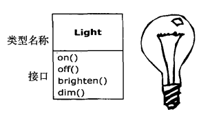
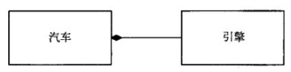
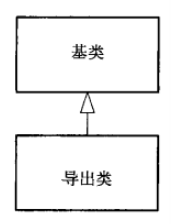
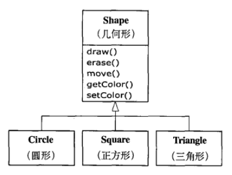
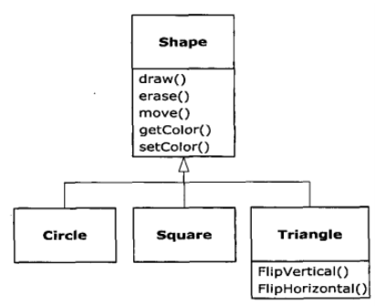
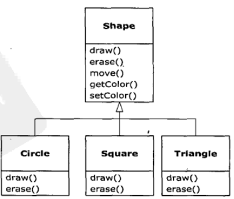
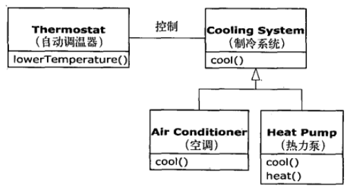
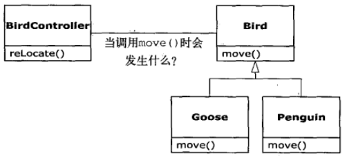

# 第1章 对象导论

> “我们之所以将自然界分解，组织成各种概念，并按其含义分类，主要是因为我们是整个口语交流社会共同遵守的协定的参与者，这个协定以语言的形式固定下来……除非赞成这个协定中规定的有关语言信息的组织和分类，否则我们根本无法交谈。”
>
> ——Benjamin Lee Whorf （1897~1941）

计算机革命起源于机器，因此，编程语言的产生也始于对机器的模仿。

但是，计算机并非只是机器那么简单。计算机是头脑衍生的工具（就像Steve Jobs常喜欢说的“头脑的自行车“一样），同时还是一种不同类型的表达媒体。因此，这种工具看起来已经越来越不像机器，而更像我们头脑的一部分，以及一种如写作、绘画、雕刻、动画、电影等一样的表达形式。面向对象程序设计（Object-oriented Programming，OOP）便是这种以计算机作为表达媒体的大趋势中的组成部分。

本章将向读者介绍包括开发方法概述在内的OOP的基本概念。本章，乃至本书中，都假设读者已经具备了某些编程经验（当然不一定是C的）。如果读者认为在阅读本书之前还需要在程序设计方面多做些准备，那么就应该去研读可以从www.MindView.net网站上下载的《C编程思想》（Thinking in C）的多媒体资料。

本章介绍的是背景性和补充性的材料。许多人在没有了解面向对象程序设计的全貌之前，感觉无法轻松自在地从事此类编程。因此，此处将引入许多概念，以期帮助读者扎实地了解OOP。然而，还有些人可能在看到具体结构之前，无法了解面向对象程序设计的全貌，这些人如果没有代码在手，就会陷于困境并最终迷失方向。如果你属于后面这个群体，并且渴望尽快获取Java语言的细节，那么可以先越过本章——在此处越过本章并不会妨碍你编写程序和学习语言。但是，你最终还是要回到本章来补充所学知识，这样才能够了解到对象的重要性，以及怎样使用对象进行设计。

## 1.1 抽象过程

所有编程语言都提供抽象机制。可以认为，人们所能够解决的问题的复杂性直接取决于抽象的类型和质量。所谓的“类型”是指“所抽象的是什么？”汇编语言是对底层机器的轻微抽象。接着出现的许多所谓“命令式”语言（如FORTRAN、BASIC、C等）都是对汇编语言的抽象。这些语言在汇编语言基础上有了大幅的改进，但是它们所作的主要抽象仍要求在解决问题时要基于计算机的结构，而不是基于所要解决的问题的结构来考虑。程序员必须建立起在机器模型（位于“解空间”内，这是你对问题建模的地方，例如计算机）和实际待解问题的模型（位于“问题空间”内，这是问题存在的地方，例如一项业务）之间的关联。建立这种映射是费力的，而且这不属于编程语言所固有的功能，这使得程序难以编写，并且维护代价高昂，同时也产生了作为副产物的整个“编程方法”行业。

另一种对机器建模的方式就是只针对待解问题建模。早期的编程语言，如LISP和APL，都选择考虑世界的某些特定视图（分别对应于“所有问题最终都是列表”或者“所有问题都是算法形式的”）。PROLOG则将所有问题都转换成决策链。此外还产生了基于约束条件编程的语言和专门通过对图形符号操作来实现编程的语言（后者被证明限制性过强）。这些方式对于它们所要解决的特定类型的问题都是不错的解决方案，但是一旦超出其特定领域，它们就力不从心了。

面向对象方式通过向程序员提供表示问题空间中的元素的工具而更进了一步。这种表示方式非常同意，使得程序员不会受限于任何特定类型的问题。我们将问题空间中的元素及其在解空间中的表示称为“对象”。（你还需要一些无法类比比为问题空间元素的对象。）这种思想的实质是：程序可以通过添加新类型的对象使自身适用于某个特定问题。因此，当你在阅读描述解决方案的代码的同时，也是在阅读问题的表述。相比以前我们所使用的语言，这是一种更灵活和更强有力的语言抽象。所以，OOP允许根据问题来描述问题，而不是根据运行解决方案的计算机来描述问题。但是它仍然与计算机有联系：每个对象看起来都有点像一台微型计算机——它具有状态，还具有操作，用户可以要求对象执行这些操作。如果要对现实世界中的对象作类比，那么说它们都具有特性和行为似乎不错。

Alan Kay曾经总结了第一个成功的面向对象语言、同时也是Java所基于的语言之一的Smalltalk的五个基本特性，这些特性表现了一种纯粹的面向对象程序设计方式：

1）**万物皆为对象**。将对象视为奇特的变量，它可以存储数据，除此之外，你还可以要求它在自身上执行操作。理论上讲，你可以抽取待求解问题的任何概念化构建（狗、建筑物、服务等），将其表示为程序中的对象。

2）**程序是对象的集合，它们通过发送消息来告知彼此所要做的**。要想请求一个对象，就必须对该对象发送一条消息。更具体地说，可以把消息想像为对某个特定对象的方法的调用请求。

3）**每个对象都有自己的由其他对象所构成的存储**。换句话说，可以通过创建包含现有对象的包的方式来创建新类型的对象。因此，可以在程序中构建复杂的体系，同时将其复杂性隐藏在对象的简单性背后。

4）**每个对象都拥有其类型**。按照通用的说法，“每个对象都是某个类（class）的一个实例（instance）”，这里”类“就是“类型”的同义词。每个类最重要的区别于其他类的特性就是“可以发送什么样的消息给它”。

5）**某一特定类型的所有对象都可以的消息**。这是一句意味深长的表述，你在稍后便会看到。因为“圆形”类型的对象同时也是“几何形”类型的对象，所以一个“圆形”对象必定能够接受发送给“几何形”对象的消息。这意味着可以编写与“几何形”交互并自动处理所有与几何形性质相关的事物的代码。这种可替代性（substitutability）是OOP中最强有力的概念之一。

Booch对对象提出了一个更加简洁的描述：对象具有状态、行为和标识。这意味着每一个对象都可以拥有内部数据（它们给出了该对象的状态）和方法（它们产生行为），并且每一个对象都可以唯一地与其他对象区分开来，具体说来，就是每一个对象在内存中都有一个唯一的地址。

## 1.2 每个对象都有一个接口

亚里士多德大概是第一个深入研究类型（type）的哲学家，他曾提出过鱼类和鸟类这样的概念。所有的对象都是唯一的，但同时也是具有相同的特性和行为的对象所归属的类的一部分。这种思想被直接应用于第一个面向对象语言Simula-67，它在程序中使用基本关键字class来引入新的类型。

Simula，就像其名字一样，是为了开发诸如经典的“银行出纳员问题”（bank teller problem）这样的仿真程序而创建的。在银行出纳员问题中，有出纳、客户、账户、交易和货币单位等许多“对象”。在程序执行期间具有不同的状态而其他方面都相似的对象会被分组到对象的类中，这就是关键字class的由来。创建抽象数据类型（类）是面向对象程序设计的基本概念之一。抽象数据类型的运行方式与内置（built-in）类型几乎完全一致：你可以创建某一类型的变量（按照面向对象的说法，称其为对象或实例），然后操作这些变量（称其为发送消息或请求，发送消息，对象就知道要做什么）。每个类的成员或元素都具有某种共性：每个账户都有结余金额，每个出纳都可以处理存款请求等。同时，每个成员都有自身的状态：每个账户都有不同的结余金额，每个出纳都有自己的姓名。因此，出纳、客户、账户、交易等都可以在计算机程序中被表示成唯一的实体。这些实体就是对象，每一个对象都属于定义了特性和行为的某个特定的类。

所以，尽管我们在面向对象程序设计中实际中进行的是创建新的数据类型，但事实上所有的面向对象程序设计语言都使用class这个关键词来表示数据类型。当看到类型一词时，可将其作为类来考虑，反之亦然。

因为类描述了具有相同特性（数据元素）和行为（功能）的对象集合，所以一个类实际上就是一个数据类型，例如所有浮点型数字具有相同的特性和行为集合。二者的差异在于，程序员通过定义类来适应问题，而不再被迫只能使用现有的用来表示机器中的存储单元的数据类型。可以根据需求，通过添加新的数据类型来扩展编程语言。编程系统欣然接受新的类，并且像对待内置类型一样地照管它们和进行类型检查。

面向对象方法并不是仅局限于构建仿真程序。无论你是否赞成以下观点，即任何程序都是你所设计的系统的一种仿真，面向对象技术的应用确实可以将大量的问题很容易地降解为一个简单的解决方案。

一旦类被建立，就可以随心所欲地创建类的任意个对象，然后去操作它们，就像它们是存在于你的待求解问题中的元素一样。事实上，面向对象程序设计的挑战之一，就是在问题空间的元素和解空间的对象之间创建一对一的映射。

但是，怎样才能获得有用的对象呢？必须有某种方式产生对对象的请求，使对象完成各种任务，如完成一笔交易、在屏幕上画图、打开开关等等。每个对象都只能满足某些请求，这些请求由对象的接口（interface）所定义，决定接口的便是类型。以电灯泡为例来做一个简单的比喻（如右图所示）：

```java
Light lt = new Light();
lt.on();
```



接口确定了对某一特定对象所能发出的请求。但是，在程序中必须有满足这些请求的代码。这些代码与隐藏的数据一起构成了实现。从过程型编程的观点来看，这并不太复杂。在类型中，每一个可能的请求都有一个方法与之相关联，当向对象发送请求时，与之相关联的方法就会被调用。此过程通常被概况为：向某个对象“发送消息”（产生请求），这个对象便知道此消息的目的，然后执行对应的程序代码。

上例中，类型/类的名称是Light，特定的Light对象的名称是It，可以向Light对象发出的请求是：打开它、关闭它、将它调亮、将它调暗。你以下列方式创建了一个Light对象：定义这个对象的“引用“（It），然后调用new方法来创建该类型的新对象。为了向对象发送消息，需要声明对象的名称，并以圆点符号连接一个消息请求。从预定义类的用户观点来看，这些差不多就是用对象来进行设计的全部。

前面的图是UML（Unified Modelling Language，统一建模语言）形式的图，每个类都用一个方框表示，类名在方框的顶部，你所关心的任何数据成员都描述在方框的中间部分，方法（隶属于此对象的、用来接收你发送给此对象的消息的函数）在方框的底部。通常，只有类名和公共方法被示于UML设计图中，因此，方框的中部就像本例一样并未给出。如果只对类型感兴趣，那么方框的底部甚至也不需要给出。

## 1.3 每个对象都提供服务

当正在试图开发或理解一个程序设计时，最好的方法之一就是将对象想像为“服务提供者”。程序本身将向用户提供服务，它将通过调用其他对象提供的服务来实现这一目的。你的目标就是去创建（或者最好是现有代码库中寻找）能够提供理想的服务来解决问题的一系列对象。

着手从事这件事的一种方式就是问一下自己：“如果我可以将问题从表象中抽取出来，那么什么样的对象可以马上解决我的问题呢？”例如，假设你正在创建一个簿记系统，那么可以想像，系统应该具有某些包括了预定义的簿记输入屏幕的对象，一个执行簿记计算的对象集合，以及一个处理在不同的打印机上打印支票和开发票的对象。也许上述对象中的某些已经存在了，但是对于那些并不存在的对象，它们看起来像什么样子？它们能够提供哪些服务？它们需要哪些对象才能履行它们的义务？如果持续这样做，那么最终你会说“那个对象看起来很简单，可以坐下来写代码了”，或者会说“我肯定那个对象已经存在了”。这是将问题分解为对象集合的一种合理方式。

将对象看作是服务提供者还有一个附带的好处：它有助于提高对象的内聚性。高内聚是软件设计的基本质量要求之一：这意味着一个软件构建（例如一个对象，当然它也有可能是指一个方法或一个对象库）的各个方面“组合”得很好。人们在设计对象时所面临的一个问题是，将过多的功能都塞在一个对象中。例如，在检查打印模式的模块中，你可以这样设计一个对象，让它了解所有的格式和打印技术。你可能会发现，这些功能对于一个对象来说太多了，你需要的是三个甚至更多个对象，其中，一个对象可以是所有可能的支票排版的目录，它可以被用来查询有关如何打印一张支票的信息；另一个对象（或对象集合）可以是一个通用的打印接口，它知道有关如何打印一张支票的信息；另一个对象（或对象集合）可以是一个通用的打印接口，它知道有关所有不同类型的打印机信息（但是不包含任何有关簿记的内容，它更应该是一个需要购买而不是自己编写的对象）；第三个对象通过调用另外两个对象的服务来完成打印任务。这样，每个对象都有一个它所能提供服务的内聚的集合。在良好的面向对象设计中，每个对象都可以很好地完成一项任务，但是它并不试图做更多的事。就像在这里看到的，不仅允许通过购买获得某些对象（打印机接口对象），而且还可以创建能够在别处复用的新对象（支票排版目录对象）。

将对象作为服务提供者看待是一件伟大的简化工具，这不仅在设计过程中非常有用，而且当其他人试图理解你的代码或重用某个对象时，如果他们看出了这个对象所能提供的服务的价值，它会使调整对象以以适应其设计的过程变得简单得多。

## 1.4 被隐藏的具体实现

将程序开发人员按照角色分为类创建者（那些创建新数据类型的程序员）和客户端程序员（那些在其应用中使用数据类型的类消费者）是大有裨益的。客户端程序员的目标是收集各种用来实现快速应用开发的类。类创建者的目标是构建类，这种类只向客户端程序员暴露必需的部分，而隐藏其他部分。为什么要这样呢？因为如果加以隐藏，那么客户端程序员将不能够访问它，这意味着类创建者可以任意修改被隐藏的部分，它们很容易被粗心的或不知内情的客户端程序员所毁坏，因此将实现隐藏起来可以减少程序bug。

在任何相互关系中，具有关系所涉及的各方都遵守的边界是十分重要的事情。当创建一个类库时，就建立了与客户端程序员之间的关系，他们同样也是程序员，但是他们是使用你的类库来构建应用、或者构建更大的类库的程序员。如果所有的类成员对任何人都是可用的，那么客户端程序员就可以对类做任何事情，而不受任何约束。即使你希望客户端程序员不要直接操作你的类中的某些成员，但是如果没有任何访问控制，将无法阻止此事发生。所有东西都将赤裸裸地暴露于世人面前。

因此，访问控制的第一个存在原因就是让客户端程序员无法触及他们不应该触及的部分——这些部分对数据类型的内部操作来说是必需的，但并不是用户解决特定问题所需的接口的一部分。这对客户端程序员来说其实是一项服务，因为他们可以很容易地看出哪些东西对他们来说很重要，而哪些东西可以忽略。

访问控制的第二个存储的原因就是允许库设计者可以改变类内部的工作方式而不用担心会影响到客户端程序员。例如，你可能为了减轻开发任务而以某种简单的方式实现了某个特定类，但稍后发现你必须改写它才能使其运行得更快。如果接口和实现可以清晰地分离并得以保护，那么你就可以轻而易举地完成这项工作。

Java用三个关键字在类的内部设定边界：public、private、protected。这些访问指定词（access specifier）决定了紧跟其后被定义的东西可以被谁使用。public表示紧随其后的元素对任何人都是可用的，而private这个关键字表示除类型创建者和类型的内部方法之外的任何人都不能访问的元素。private就像你与客户端程序员之间的一堵砖墙，如果有人视图访问继承的类可以访问protected成员，但是不能访问private成员。稍后将会对继承进行介绍。

Java还有一种默认的访问权限，但没有使用前面提到的任何访问指定词时，它将发挥作用。这种权限通常被称为包访问权限，因为在这种权限下，类可以访问在同一个包（库构件）中的其他类的成员，但是在包之外，这些成员如同指定了private一样。

## 1.5 复用具体实现

一旦类被创建并被测试完，那么它就应该（在理想情况下）代表一个有用的代码单元。事实证明，这种复用性并不容易达到我们所希望的那种程度，产生一个可复用的对象设计需要丰富的经验和敏锐的洞察力。但是一旦你有了这样的设计，它就可供复用。代码复用是面向对象程序设计语言所提供的最了不起的优点之一。

最简单地复用某个类的方式就是直接使用该类的一个对象，此外也可以将那个类的一个对象置于某个新的类中。我们称其为“创建一个成员对象”。新的类可以由任意数量、任意类型的其他对象以任意可以实现新的类中想要的功能对的方式所组成。因为是在使用现有的类合成新的类，所以这种概念被称为组合（composition），如果组合是动态发生的，那么它通常被称为聚合（aggregation）。组合经常被视为“has-a”（拥有）关系，就像我们常说的”汽车拥有引擎“一样。



（上面这张UML图用实心菱形表明了组合关系。我通常采用最简单的形式：仅仅用一条没有菱形的线来表示关联）。

组合带来了极大的灵活性。新类的成员对象通常都被声明为private，使得使用新类的客户端程序员不能访问它们。这也使得你可以在不干扰现有客户端代码的情况下，修改这些成员。也可以在运行时修改这些成员对象，以实现动态修改程序的行为。下面将要讨论的继承并不具备这些的灵活性，因为编译器必须对通过继承而创建的类施加编译时的限制。

由于继承在面向对象程序设计中如此重要，所以它经常被高度调用，于是程序员新手就会有这样的印象：处处都应该使用继承。这会导致难以使用并过分复杂的设计。实际上，在建立新类时，应该首先考虑组合，因为它更加简单灵活。如果采用方式，设计会变得更加清晰。一旦有了一些经验之后，便能够看出必须使用继承的场合了。

## 1.6 继承

对象这种概念，本身就是十分方便的工具，使得你可以通过概念将数据和功能封装到一起，因此可以对问题空间的观念给出恰当的表示，而不用受制于必须使用底层机器语言。这些概念用关键字class来表示，它们形成了编程语言中的基本单位。

遗憾的是，这样做还是有很多麻烦：在创建了一个类之后，即使另一个新类与其具有相似的功能，你还是得重新创建一个新类。如果我们能够以现有的类为基础，复制它，然后通过添加和修改这个副本来创建新类那就要好多了。通过继承便可达到这样的效果，不过也有例外，当源类（被称为基类、超类或父类）发生变动时，被修改的“副本”（被称为导出类、继承类或子类）也会反映出这些变化（如下图所示）。



（这张UML图中的箭头从导出类指向基类，就像稍后你会看到的，通常会存在一个以上的导出类。）

类型不仅仅只是描述了作用于一个对象集合上的约束条件，同时还有与其他类型之间的关系。两个类型可以有相同的特性和行为，但是其中一个类型可能比另一个含有更多的特性，并且可以处理更多的消息（或以不同的方式来处理消息）。继承使用基类型和导出类型的概念表示了这种类型之间的相似性。一个基类型包含其所有导出类型所共享的特性和行为。可以创建一个基类型来表示系统中某些对象的核心概念，从基类型中导出其他类型，来表示此核心可以被实现的各种不同方式。

以垃圾会收机为例，它用来归类散落的垃圾。“垃圾”是基类型，每一件垃圾都有重量、价值等特征，可以被切碎、熔化或分解。在此基础上，可以通过添加额外的特性（例如瓶子的颜色）或行为（例如铝罐可以被压碎，铁罐可以被磁化）导出更具体的垃圾类型。此外，某些行为可能不同（例如纸的价值取决于其类型和状态）。可以通过使用继承来构建一个类型层次结构，以此来表示待求解的某种类型的问题。

第二个例子是经典的几何形的例子，这在计算机辅助设计系统或游戏仿真系统中可能被用到。基类是几何形，每一个几何形都有尺寸、颜色、位置等，同时每一个几何形都可以被绘制、擦除、移动和着色等。在此基础上，可以到处（继承出）具体的几何形状——圆形、正方形、三角形等——每一种都具有额外的特性和行为，例如某些形状可以被翻转。某些行为可能并不相同，例如计算几何形状的面积。类型层次结构同时体现了几何形状之间的相似性和差异性（如下图所示）。



以同样的术语将解决方案转换成问题是大有裨益的，因为不需要在问题描述和解决方案描述之间建立许多中间模型。通过使用对象，类型层次结构成为了主要模型，因此，可以直接从真实世界中对系统的描述过渡到用代码对系统进行描述。事实上，对使用面向对象设计的人们来说，困难之一是从开始到结束过于简单。对于训练有素、善于寻找复杂的解决方案的头脑来说，可能会在一开始被这种简单性给难倒。

当继承现有类型时，也就创造了新的类型。这个新的类型不仅包括现有类型的所有成员（尽管private成员被隐藏了起来，并且不可访问），而且更重要的是它复制了基类的接口。也就是说，所有可以发送给基类对象的消息同时也可以发送给导出类对象。由于通过发送给类的消息的类型可知类的类型，所以这也就意味着导出类与基类具有相同的类型，在前面的例子中，“一个圆形也就是一个几何形”。通过继承而产生的类型等价性是理解面向对象程序设计方法内涵的重要门槛。

由于基类和导出类具有相同的基础接口，所以伴随此接口的必定有某些具体实现。也就是说，当对象接收到特定消息时，必须有某些代码去执行。如果只是简单地继承一个类而并不做其他任何事，那么在基类接口中的方法将会直接继承到导出类中。这意味着导出类的对象不仅与基类拥有相同的类型，而且还拥有相同的行为，这样做没有什么特别的意义。

有两种方法可以使基类与导出类产生差异。第一种方法非常直接：直接在导出类中添加新方法。这些新方法并不是基类接口的一部分。这意味着基类不能直接满足你的所有需求，因此必需添加更多的方法。这种对继承简单而基本的使用方式，有时对问题来说确实是一种完美的解决方式。但是，应该仔细考虑是否存在基类也需要这些额外方法的可能性。这种设计的发现与迭代过程在面向对象程序设计中会经常发生（如下图所示）。



虽然继承有时可能意味着在接口中添加新方法（尤其是在以extends关键字表示继承的Java中），但并非总需如此。第二种也是更重要的一种使导出类和基类之间产生差异的方法是改变现有基类的方法的行为，这被称之为`覆盖`（overriding）那个方法（如下图所示）。



要想覆盖某个方法，可以直接在导出类中创建该方法的新定义即可。你可以说：“此时，我正在使用相同的接口方法，但是我想在新类型中做些不同的事情。”

### 1.6.1 “是一个”与“像是一个”关系

对于继承可能会引发某种争论：继承应该只覆盖基类的方法（而并不添加在基类中没有的新方法）吗？如果这样做，就意味着导出类和基类是完全相同的类型，因为它们具有完全相同的接口。结果可以用一个导出类对象来完全替代一个基类对象。这可以被视为`纯粹替代`，通常称之为`替代原则`。在某种意义上，这是一种处理继承的理想方式。我们经常将这种情况下的基类与导出类之间的关系成为is-a（是一个）关系，因为可以说”一个圆形就是一个几何形状“。判断是否继承，就是要确定是否可以用is-a来描述类之间的关系，并使之具有实际意义。

有时必须在导出类型中添加新的接口元素，这样也就扩展了接口。这个新的类型仍然可以替代基类，但是这种替代并不完美，因为基类无法访问新添加的方法。这种情况我们可以描述为is-like-a（像是一个）关系。新类型具有旧类型的接口，但是它还包含其他方法，所以不能说它们完全相同。以空调为例，假设房子里已经布线安装好了所有冷气设备的控制器，也就是说，房子具备了让你控制冷气设备的接口，想像一下，如果空调坏了，你用一个既能制冷又能制热的热力泵替换了它，那么这个热力泵就is-like-a空调，但是它可以做更多的事。因为房子的控制系统被设计为只能控制冷气设备，所以它只能和新对象中的制冷部分进行通信。尽管新对象的接口已经被扩展了，但是现有系统除了原来接口之外，对其他东西一无所知。



当然，在看过这个设计之后，很显然会发现，制冷系统这个基类不够一般化，应该将其更名为“温度控制系统”，使其可以包括制热功能，这样我们就可以套用替代原则了。这张图说明了在真实世界中进行设计时可能会发生的事情。

当你看到替代原则时，很容易会认为这种方式（纯粹替代）是唯一可行的方式，而且事实上，用这种方式设计是很好的。但是你会时常发现，同样显然的是你必须在导出类的接口中添加新方法。只要仔细审视，两种方法的使用场合应该是相当明显对的。

## 1.7 伴随多态的可互换对象

在处理类型的层次结构时，经常想把一个对象不当做它所属的特定类型类对待，而是将其当作其基类的对象来对待。这使得人们可以编写出不依赖于特定类型的代码。在”几何形“的例子中，方法操作的都是泛化（generic）的形状，而不关心它们是圆形、正方形、三角形还是其他什么尚未定义的形状。所有的几何形状都可以被绘制、擦除和移动，所以这些方法都是直接对一个几何形对象发送消息，它们不用担心对象将如何处理消息。

这样的代码是不会受添加新类型影响的，而且添加新类型是扩展一个面向对象程序以便处理新情况的最常用方式。例如，可以从“几何形”中导出一个新的子类型“五角形”，而并不需要修改处理泛化几何形状的方法。通过导出新的子类型而轻松扩展设计的能力是对改动进行封装的基本方式之一。这种能力可以极大地改善我们的设计，同时也降低软件维护的代价。

但是，在试图将导出类型的对象当作其泛化基类型对象来看待时（把圆形看作是几何形，把自行车看作是交通工具，把鸬鹚看作是鸟等等），仍然存在一个问题。如果某个方法要让泛化几何形状绘制自己、让泛化交通工具行驶，或者让泛化的鸟类移动，那么编译器在编译时是不可能知道应该执行哪一段代码的。这就是关键所在：当发送这样的消息时，程序员并不想知道哪一段代码将被执行，绘图方法可以被等同地应用于圆形、正方形、三角形，而对象会依据自身的具体类型来执行恰当的代码。

如果不需要知道哪一段代码会被执行，那么当添加新的子类型时，不需要更改调用它的方法，它就能够执行不同的代码。因此，编译器无法精确地了解哪一段代码将会被执行，那么它该怎么办呢？例如，在下面的图中，BirdController对象仅仅处理泛化的Bird对象，而不了解它们的确切类型。从BirdController的角度看，这么做非常方便，因为不需要编写特别的代码来判定要处理的Bird对象的确切类型或其行为。当move()方法被调用时，即便忽略Bird的具体类型，也会产生正确的行为（Goose（鹅）走、飞或游泳，Penguin（企鹅）走或游泳），那么，这是如何发生的呢？



这个问题的答案，也是面向对象程序设计的最重要的妙诀：编译器不可能产生传统意义上的函数调用。一个非面向对象编程的编译器产生的函数调用会引起所谓的`前期绑定`，这个术语你可能以前从未听说过，可能从未想过函数调用的其他方式。这么做意味着编译器将产生对一个具体函数名字的调用，而运行时将这个调用解析到将要被执行的代码的绝对地址。然而在OOP中，程序直到运行时才能够确定代码的地址，所以当消息发送到一个泛化对象时，必须采用其他的机制。

为了解决这个问题，面向对象程序设计语言使用了`后期绑定`的概念。当向对象发送消息时，被调用的代码直到运行时才能确定。编译器确保被调用方法的存在，并对调用参数和返回值执行类型检查（无法提供此类保证的语言被称为是弱类型的），但是并不知道将执行的确切代码。

为了执行后期绑定，Java使用一小段特殊的代码来替代绝对地址调用。这段代码使用在对象中存储的信息来计算方法体的地址（这个过程将在第8章中详述）。这样，根据这一小段代码的内容，每一个对象都可以具有不同的行为表现。当向一个对象发送消息时，该对象就能够知道对这条消息应该做些什么。

在某些语言中，必须明确地声明希望某个方法具备后期绑定属性所带来的灵活性（C++是使用virtual关键字来实现的）。在这些语言中，方法在默认情况下不是动态绑定的。而在Java中，动态绑定是默认行为，不需要添加额外的关键字来实现多态。

再来看看几何形状的例子。整个类族（其中所有的类都基于相同的一致接口）在本章前面已有图示。为了说明多态，我们要编写一段代码，它忽略类型的具体细节，仅仅和基类交互。这段代码和具体类型信息是**分离的（decoupled）**，这样做使代码编写更为简单，也更易于理解。而且，如果通过继承机制添加一个新类型，例如Hexagon（六边形），所编写的代码对Shape（几何形）的新类型的处理与对已有类型的处理会同样出色。正因为如此，可以称这个程序是可扩展的。

如果用Java来编写一个方法（后面很快你就会学习如何编写）