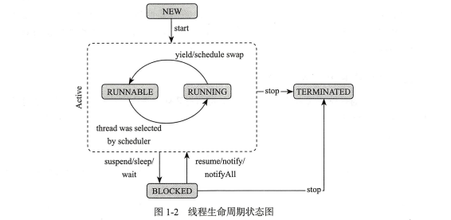
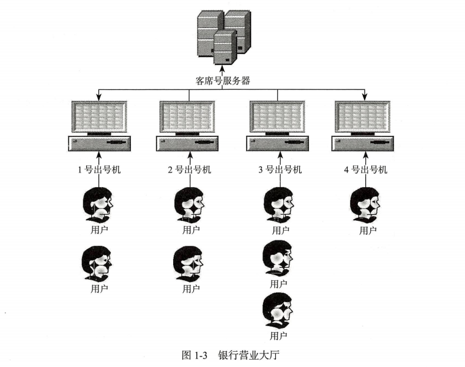
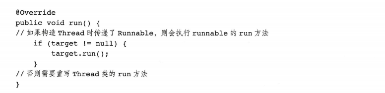

# 第1章 快速认识线程

在计算机的世界里，当我们探讨并行的时候，实际上是指，一系列的任务在计算机中同时运行，比如在浏览器网页的时候还能打开音乐播放器，在撰写邮件的时候，收件箱还能接收新的邮件。在单CPU的计算机中，其实并没有真正的并行，它只不过是CPU时间钟快速轮转调度带给你的错觉，而这种错觉让你产生了它们真的在同一时刻同时运行。当然如果是多核CPU，那么并行运行还是真实存在的。

## 1.1 线程介绍

现在几乎百分之百的操作系统都支持多任务的执行，对计算机来说每一个任务是一个进程（Process），在每一个进程内部都至少要有一个线程（Thread）是在运行中，有时线程也称为轻量级的进程。

线程是程序执行的一个路径，每一个线程都有自己的局部变量表、程序计数器（指向正在执行的指令指针）以及各自的生命周期，现代操作系统中一般不止一个线程在运行，当启动了一个Java虚拟机（JVM）时，从操作系统开始就会创建一个新的进程（JVM进程），JVM进程中将会派生或者创建很多线程。

## 1.2 快速创建并启动一个线程

本节中，我们将快速认识Thread Class的用法，并将尝试说明如何创建并启动一个线程。

这里还是以我们日常生活中的例子进行举例，假设你想在浏览网页看新闻的同时听听音乐，下面我们就来尝试用Java的代码来实现这一功能。

### 1.2.1 尝试并行运行

```java
package com.shenhuanjie.concurrent;


import java.util.concurrent.TimeUnit;

/**
 * TryConcurrency
 *
 * @author shenhuanjie
 * @date 2019/7/19 16:49
 */
public class TryConcurrency {
    public static void main(String[] args) {
        browseNews();
        enjoyMusic();

    }

    /**
     * Listening and enjoy the music
     */
    private static void enjoyMusic() {
        for (; ; ) {
            System.out.println("Uh-huh, the nice music.");
            sleep(1);
        }
    }

    /**
     * Browse the latest news
     */
    private static void browseNews() {
        for (; ; ) {
            System.out.println("Uh-huh, the good news.");
            sleep(1);
        }
    }

    /**
     * Simulate the wait and ignore exception.
     *
     * @param seconds
     */
    private static void sleep(int seconds) {
        try {
            TimeUnit.SECONDS.sleep(seconds);
        } catch (InterruptedException e) {
            e.printStackTrace();
        }
    }
}

```

代码清单1-1试图让听音乐和看新闻两个任务同时执行（在控制台输出表现为交替输出），不过很可惜，程序的输出永远都是在看新闻，而听音乐的任务永远都得不到执行，TryConcurrency代码的输出如下：

```cmd
Uh-huh, the good news.
Uh-huh, the good news.
Uh-huh, the good news.
Uh-huh, the good news.
Uh-huh, the good news.
Uh-huh, the good news.
Uh-huh, the good news.
Uh-huh, the good news.
Uh-huh, the good news.
Uh-huh, the good news.
...
```

### 1.2.2 并发运行交替输出

如果想让听音乐和看新闻两个时间并发执行，也就是在Console中看到它们彼此交替输出，就必须借助java提供的Thread这个class（关于Thread的用法和详解，后文中会有详细的讲解）。

只需要将代码清单1-1的main方法中的任意一个方法教给Thread即可，下面是加入了Thread之后的代码：

```java
public static void main(String[] args) {
    // 通过匿名内部类的方式创建线程，并且重写其中的run方法
    new Thread() {
        @Override
        public void run() {
            enjoyMusic();
        }
    }.start();
    browseNews();

}
```

输出如下：

```cmd
Uh-huh, the good news.
Uh-huh, the nice music.
Uh-huh, the good news.
Uh-huh, the nice music.
Uh-huh, the good news.
Uh-huh, the nice music.
Uh-huh, the good news.
Uh-huh, the nice music.
Uh-huh, the good news.
Uh-huh, the nice music.
Uh-huh, the good news.
Uh-huh, the nice music.
Uh-huh, the good news.
Uh-huh, the nice music.
...
```

代码修改之后会发现听音乐和看新闻两个任务可以并行运行，并且在控制台交替输出。

> **注意：** 上面的代码中，线程启动必须在其中一个任务之前 ，否则线程将永远得不到启动，因为前一个任务永远不会结束。
>
> * 创建一个线程，并且重写其run方法，将enjoyMusic交给它执行。
> * 启动新的线程，只有调用了Thread的start方法，才代表派生了一个新的线程，否则Thread和其他普通的Java对象没有什么区别，start方法是一个立即返回方法，并不会让程序陷入阻塞。

如果用Java 8 Lambda改造上面的代码，那么代码看起来将会更加简洁，如下所示：

```java
public static void main(String[] args) {
    // 通过匿名内部类的方式创建线程，并且重写其中的run方法
    new Thread(TryConcurrency::enjoyMusic).start();
    browseNews();
}
```

### 1.2.3 使用Jconsole观察线程

1.2.2节创建了一个Thread并且启动，那么此时JVM中有多少个线程呢？除了我们创建的线程以外，还有哪些线程可以借助Jconsole或Jstack命令来查看，如图1-1所示，这两个JVM工作都是由JDK自身提供的。


在图1-1中，我们用线框勾出了两个线程，其中一个是main，另一个是Thread-0，之前说过在操作系统启动一个Java虚拟机（JVM）的时候，其实是启动了一个进程，而在该进程里面启动了一个以上的线程，其中Thread-0这个线程就是1.2.2节中创建的，main线程是由JVM启动时创建的，我们都知道J2SE程序的入口就是main函数，虽然我们在1.2.2节中显式地创建了一个线程，事实上还有一个main线程，当然还有一些其他的守护线程，比如垃圾回收线程、RMI线程等。

## 1.3 线程的生命周期详解

前面提到过，每一个线程都有自己的局部变量表、程序计数器，以及生命周期等，本节就来分析一下线程的生命周期，如图1-2所示。

在开始解释线程的生命周期之前，请大家思考一个问题：执行了Thread的start方法就代表该线程已经开始执行了吗？



通过图1-2的展示可知，线程的生命周期大体可以分为如下5个主要阶段。

* NEW
* RUNNABLE
* RUNNING
* BLOCKED
* TERMINATED

### 1.3.1 线程的NEW状态

当我们用关键字new创建一个Thread对象时，此时它并不处于执行状态，因为没有调用start方法启动该线程，那么线程的状态为NEW状态，准确的说，它只是Thread对象的状态，因为在没有start之前，该线程根本不存在，与你用关键字new创建一个普通的Java对象没什么区别。

NEW状态通过start方法进入RUNNABLE状态。

### 1.3.2 线程的RUNNABLE状态

线程对象进入RUNNABLE状态必须调用start方法，那么此时才是真正地JVM进程中创建了一个线程，线程一经启动就可以立即得到执行吗？答案是否定的，线程的运行与否和进程一样都要听令于CPU的调度，那么我们把这个中间状态称为可执行状态（RUNNABLE），也就是说它具备执行的资格，但是并没有真正地执行起来而是在等待CPU的调度。

由于存在Running状态，所以不会直接进入BLOCKED状态和TERMINATED状态，即使是在线程的执行逻辑调用wait、sleep或者其他block的IO操作等，也必须先获得CPU的调度执行权才可以，严格来讲，RUNNABLE的线程只能以外终止或者进入RUNNING状态。

### 1.3.3 线程的RUNNING状态

一旦CPU通过轮询或者其他方式从任务可执行队列中选中了线程，那么此时它才能真正地执行自己的逻辑代码，需要说明的一点是一个正在RUNNING状态的线程事实上也是RUNNABLE的，但是反过来则不成立。

在该状态中，线程的状态可以发生如下的状态转换。

* 直接进入TERMINATED状态，比如调用JDK已经不推荐使用的stop方法或者判断某个逻辑标识。
* 进入BLOCKED状态，比如调用了sleep，或者wait方法而加入了waitSet中。
* 进行某个阻塞的IO操作，比如因网络数据的读写而进入BLOCKED状态。
* 获取某个锁资源，从而加入到该锁的阻塞队列中而进入了BLOCKED状态。
* 由于CPU的调度器轮询使该线程放弃执行，进入RUNNABLE状态。
* 线程主动调用yieId方法，放弃CPU执行权，进入RUNNABLE状态。

### 1.3.4 线程的BLOCKED状态

1.3.3 节中已经列举了线程进入BLOCKED状态的原因，此处就不再赘述了，线程在BLOCKED状态助攻可以切换至如下几个状态。

* 直接进入TERMINATED状态，比如调用JDK已经不推荐使用的stop方法或者意外死亡（JVM Crash）。
* 线程阻塞的操作结束，比如读取了想要的数据字节进入到RUNNABLE状态。
* 线程完成了指定时间休眠，进入到了RUNNABLE状态。
* Wait中的线程被其他线程notify/notifyall唤醒，进入RUNNABLE状态。
* 线程获取到了某个锁资源，进入RUNNABLE状态。
* 线程在阻塞过程中被打断，比如其他线程调用了interrupt方法，进入RUNNABLE状态。

### 1.3.5 线程的TERMINATED状态

TERMINATED是一个线程的最终状态，在该状态中线程将不会切换到其他任何状态，线程进入TERMINATED状态，意味着该线程的整个生命周期就都结束了，下列这些情况将会使线程进入TERMINATED状态。

* 线程运行正常结束，结束生命周期。
* 线程运行出错以外结束。
* JVM Crash，导致所有的线程都结束。

通过本节关于线程生命周期的分析，相信读者已经能够独立回答我们开始提的问题了，线程的生命周期非常关键，很多工作多年的程序员，由于不重视这部分的内容，在编写程序的时候也经常会出现一些错误。

## 1.4 线程的start方法剖析：模版设计模式在Thread中的应用

在本节中，我们将分析Thread的start方法，在调用了start方法之后到底进行了什么操作，通过1.3节的内容讲解，相信大家已经明白了，start方法启动了一个线程，并且该线程进入了可执行状态（RUNNABLE），在“代码清单1-1 TryConcurrency"中，我们重写了Thread的run方法，但却调用了start方法，那么run方法有什么关系呢？带着诸多的疑问，我们一起在本章中寻找答案吧！

### 1.4.1 Thread start方法源码分析以及注意事项

先来看一下Thread start方法的源码，如下所示：

```java
public synchronized void start() {
	/**
	 * This method is not invoked for the main method thread or "system"
	 * group threads created/set up by the VM. Any new functionality added
	 * to this method in the future may have to also be added to the VM.
	 *
	 * A zero status value corresponds to state "NEW".
	 */
	if (threadStatus != 0)
		throw new IllegalThreadStateException();

	/* Notify the group that this thread is about to be started
	 * so that it can be added to the group's list of threads
	 * and the group's unstarted count can be decremented. */
	group.add(this);

	boolean started = false;
	try {
		start0();
		started = true;
	} finally {
		try {
			if (!started) {
				group.threadStartFailed(this);
			}
		} catch (Throwable ignore) {
			/* do nothing. If start0 threw a Throwable then
			  it will be passed up the call stack */
		}
	}
}
```

start方法的源码足够简单，其实最核心的部分是start0这个本地方法，也就是JNI方法：

```java
private native void start0();
```

也就是说在start方法中会调用start0方法，那么重写的那个run方法何时被调用了呢？单从上面是看不出来任何端倪的，但是打开JDK的官方文档，在start方法中有如下的注释说明：

```java
* Causes this thread to begin execution; the Java Virtual Machine calls the <code>run</code> method of this thread.
```

上面这句话的意思是：在开始执行这个线程时，JVM将会调用该线程的run方法，换言之，run方法是被JNI方法start0()调用的，仔细阅读start的源码将会总结出如下几个知识要点。

* Thread被构造后的NEW状态，事实上threadStatus这个内部属性为0。
* 不能两次启动Thread，否则就会出现IllegalhreadStateException异常。
* 线程启动后将会被加入到一个ThreadGroup中，后文中我们将详细介绍ThreadGroup。
* 一个线程生命周期结束，也就是到了TERMINATED状态，再次调用start方法是不允许的，也就是说TERMINATED状态是没有办法回到RUNNABLE/RUNNING状态的。

```java
package com.shenhuanjie.thread;

        import java.util.concurrent.TimeUnit;

/**
 * Start0
 *
 * @author shenhuanjie
 * @date 2019/7/22 9:11
 */
public class Start0 {
    public static void main(String[] args) {
        Thread thread = new Thread() {
            /**
             * If this thread was constructed using a separate
             * <code>Runnable</code> run object, then that
             * <code>Runnable</code> object's <code>run</code> method is called;
             * otherwise, this method does nothing and returns.
             * <p>
             * Subclasses of <code>Thread</code> should override this method.
             *
             * @see #start()
             * @see #stop()
             */
            @Override
            public void run() {
                try {
                    TimeUnit.SECONDS.sleep(10);
                } catch (InterruptedException e) {
                    e.printStackTrace();
                }
            }
        };
        thread.start();//启动线程

        thread.start();//再次启动
    }
    /**
     * Exception in thread "main" java.lang.IllegalThreadStateException
     * 	at java.lang.Thread.start(Thread.java:708)
     * 	at com.shenhuanjie.thread.Start0.main(Start0.java:36)
     */
}

```

执行上面的代码将会抛出IllegalThreadStateException异常，而我们将代码稍作改动，模拟一个线程生命周期的结束，再次启动看看会发生什么：

```java
package com.shenhuanjie.thread;

import java.util.concurrent.TimeUnit;

/**
 * Start0
 *
 * @author shenhuanjie
 * @date 2019/7/22 9:11
 */
public class Start0 {
    public static void main(String[] args) throws InterruptedException {
        Thread thread = new Thread() {
            /**
             * If this thread was constructed using a separate
             * <code>Runnable</code> run object, then that
             * <code>Runnable</code> object's <code>run</code> method is called;
             * otherwise, this method does nothing and returns.
             * <p>
             * Subclasses of <code>Thread</code> should override this method.
             *
             * @see #start()
             * @see #stop()
             */
            @Override
            public void run() {
                try {
                    TimeUnit.SECONDS.sleep(1);
                } catch (InterruptedException e) {
                    e.printStackTrace();
                }
            }
        };
        thread.start();//启动线程

        TimeUnit.SECONDS.sleep(2);//休眠主要是确保thread结束生命周期
        thread.start();//企图重新激活该线程
    }
    /**
     * Exception in thread "main" java.lang.IllegalThreadStateException
     * 	at java.lang.Thread.start(Thread.java:708)
     * 	at com.shenhuanjie.thread.Start0.main(Start0.java:37)
     */
}

```

> **注意： ** 程序同样会抛出IllegalThreadStateException异常，但是这两个异常的抛出却有本质上的区别，第一个是重复启动，只是第二次启动是不允许的，但是此时该线程是处于运行状态的，而第二次企图重新激活也抛出了非法状态的异常，但是此时没有线程，因为该线程的生命周期已经被终结。

### 1.4.2 模版设计模式在Thread中的应用

通过1.4.1节的分析，我们不难看出，线程的真正的执行逻辑是在run方法中，通常我们会把run方法称为线程的执行单元，这也就回答了我们最开始提出的疑问，重写run方法，用start方法启动线程。Thread中run方法的代码如下，如果我们没有使用Rnnable接口对其进行构造，则可以认为Thread的run方法本身就是一个空的实现：

```java
@Override
public void run() {
    if (target != null) {//我们并没有使用runnable构造Thread
        target.run();
    }
}
```

其实Thread的run和start就是一个比较典型的模版设计模式，父类编写算法结构代码，子类实现逻辑细节，下面通过一个简单的例子来看一下模版设计模式，然后读者可以参考该模式在Thread中的使用，示例代码如清单1-2所示。

```java
package com.shenhuanjie.thread;

/**
 * TemplateMethod
 *
 * @author shenhuanjie
 * @date 2019/7/22 9:26
 */
public class TemplateMethod {
    public static void main(String[] args) {
        TemplateMethod t1 = new TemplateMethod() {
            @Override
            protected void wrapPrint(String message) {
                System.out.println("*" + message + "*");
            }
        };
        t1.print("Hello Thread");

        TemplateMethod t2 = new TemplateMethod() {
            @Override
            protected void wrapPrint(String message) {
                System.out.println("+" + message + "+");
            }
        };
        t2.print("Hello Thread");
    }

    public final void print(String message) {
        System.out.println("##############");
        wrapPrint(message);
        System.out.println("##############");
    }

    protected void wrapPrint(String message) {

    }
}

```

print方法类似于Thread的start方法，而wrapPrint则类似于run方法，这样做的好处是，程序结构由父类控制，并且是final修饰的，不允许被重写，子类只需要实现想要的逻辑任务即可，输出如下：

```java
##############
*Hello Thread*
##############
##############
+Hell Thread+
##############
```

### 1.4.3 Thread模拟营业大厅叫号机程序

相信很多人都去过银行、医院、移动营业厅、公积金中心等，在这些机构的营业大厅都有排号等号的机制，这种机制的主要作用就是限流，减轻业务受理人员的压力。当你走进营业大厅后，需要先领取一张流水号纸票，然后拿着纸票坐在休息区等待你的号码显示在业务办理的橱窗显示器上，如图1-3所示。



​		如图1-3所示，假设大厅共有四台出号机，这就意味着有是个线程在工作，下面我们用程序模拟一下叫号的过程，约定当天最多受理50笔业务，也就是说号码最多可以出道50。

TicketWindow代表大厅里的出号机器，代码如清单1-3所示。

```java
package com.shenhuanjie.thread;

/**
 * TicketWindow
 *
 * @author shenhuanjie
 * @date 2019/7/22 9:41
 */
public class TicketWindow extends Thread {
    //最多受理50笔业务
    private static final int MAX = 50;
    //柜台名称
    private final String name;

    private int index = -1;

    public TicketWindow(String name) {
        this.name = name;
    }

    @Override
    public void run() {
        while (index <= MAX) {
            System.out.println("柜台：" + name + " 当前的号码是：" + (index++));
        }
    }
}

```

接下来，写一个main函数，对其进行测试，定义了四个TicketWindow线程，并且分别启动：

```java
public static void main(String[] args) {
    TicketWindow ticketWindow1 = new TicketWindow("一号出号机");
    ticketWindow1.start();
    TicketWindow ticketWindow2 = new TicketWindow("二号出号机");
    ticketWindow2.start();
    TicketWindow ticketWindow3 = new TicketWindow("三号出号机");
    ticketWindow3.start();
    TicketWindow ticketWindow4 = new TicketWindow("四号出号机");
    ticketWindow4.start();
}
```

运行之后的输出似乎令人大失所望，为何每一个TikcWindow所出的号码都是从1到50呢？

```
柜台：一号出号机 当前的号码是：44
柜台：二号出号机 当前的号码是：5
柜台：一号出号机 当前的号码是：45
柜台：二号出号机 当前的号码是：6
柜台：一号出号机 当前的号码是：46
柜台：二号出号机 当前的号码是：7
柜台：一号出号机 当前的号码是：47
柜台：一号出号机 当前的号码是：48
柜台：二号出号机 当前的号码是：8
柜台：一号出号机 当前的号码是：49
柜台：二号出号机 当前的号码是：9
柜台：二号出号机 当前的号码是：10
柜台：三号出号机 当前的号码是：1
柜台：一号出号机 当前的号码是：50
```

之所以出现这个问题，根本原因是因为每一个线程的逻辑执行单元都不一样，我们新建了四个Ticket Window线程，它们的票号都是从0开始到50结束，四个线程并没有像图1-3所描述的那样均从客席号服务器进行交互，获取唯一的递增的号码，那么应该如何改进呢？无论TicketWindow被实例化多少次，只需要保证index是唯一的即可，我们会立即会想到使用static去修饰index以达到目的，改进后的代码如代码清单1-4所示：

```java
package com.shenhuanjie.thread;

/**
 * TicketWindow
 *
 * @author shenhuanjie
 * @date 2019/7/22 9:41
 */
public class TicketWindow extends Thread {
    //最多受理50笔业务
    private static final int MAX = 50;
    private static int index = 1;
    //柜台名称
    private final String name;

    public TicketWindow(String name) {
        this.name = name;
    }

    @Override
    public void run() {
        while (index <= MAX) {
            System.out.println("柜台：" + name + " 当前的号码是：" + (index++));
        }
    }
}

```

在次运行上面的main函数，会发现情况似乎有些改善，四个出号机交替着输出不同的号码，输入如下：

```java
柜台：一号出号机 当前的号码是：2
柜台：二号出号机 当前的号码是：3
柜台：四号出号机 当前的号码是：1
柜台：三号出号机 当前的号码是：6
柜台：二号出号机 当前的号码是：5
柜台：一号出号机 当前的号码是：4
柜台：二号出号机 当前的号码是：9
柜台：三号出号机 当前的号码是：8
柜台：四号出号机 当前的号码是：7
柜台：三号出号机 当前的号码是：12
柜台：二号出号机 当前的号码是：11
柜台：一号出号机 当前的号码是：10
```

通过对index进行static修饰，做到了多线程下共享资源的唯一性，看起来似乎满足了我们的需求（事实上，如果将最大号码调整到500、1000等稍微大一些的数字就会出现线程安全的问题，关于这点将在后面的章节中详细介绍），但是只有一个index共享资源，如果共享资源很多呢？共享资源要经过一些复杂的计算呢？不可能都使用static修饰，而且static修饰的变量生命周期很长，所以Java提供了一个接口Runnable专门用于解决该问题，将线程的控制和业务逻辑的运行彻底分离开来。

## 1.5 Runnable接口的引入以及策略模式在Thread中的使用

### 1.5.1 Runnable的职责

Runnable接口非常简单，只定义了一个无参数无返回值的run方法，具体代码如清单1-5所示。

```java
package java.lang
public interface Runnable{
	void run();
}
```

在很多软文以及一些书籍中，经常会提到，创建线程有两种方式，第一种是构造一个Thread，第二种是实现Runnable接口，这种说法是错误的，最起码是不严谨的，在JDK中代表线程的就只有Thread这个类，我们在前面分析过，线程的执行单元就是run方法，你可以通过继承Thread这个类，我们在前面分析过，线程的执行单元就是run方法，你可以通过继承Thread然后重写run方法实现自己的业务逻辑，也可以实现Runnable接口实现自己的业务逻辑，代码如下：



上面的代码段是Thread run方法的源码，我在其中加了两行注释更加清晰地说明了实现执行单元的两种方式，所以说创建线程有两种方式，一种是Thread，一种是Runnable接口，这种说法是不严谨的。准确的讲，创建线程只有一种方式那就是构造Thread类，而实现线程的执行单元则有两种方式，第一种是重写Thread的run方法，第二种是实现Runnable接口的run方法，并且将Runnable实例用作构造Thread的参数。

### 1.5.2 策略模式在Thread中的应用

前面说过了，无论是Runnable的run方法，还是Thread类本身的run方法（事实上Thread类也是实现了Runnable接口）都是想将线程的控制本身和业务逻辑的运行分离开来，达到职责分明、功能单一的原则，这一点与GoF设计模式中的策略设计模式很相似，在本节中，我们一起来看看什么是策略模式，然后再来对比Thread和Runnable两者之间的关系。

相信很多人都做过关于JDBC的开发，下面我们在这里做一个简单的查询操作，只不过是把数据的封装部分抽取成一个策略接口，代码如清单1-6所示。

```java
package com.shenhuanjie.thread;

import java.sql.ResultSet;

/**
 * RowHandler
 *
 * @author shenhuanjie
 * @date 2019/7/25 18:01
 */
public interface RowHandler<T> {
    /**
     * handle
     *
     * @param rs
     *
     * @return
     */
    T handle(ResultSet rs);
}

```

RowHandler接口负责对从数据库中查询出来的结果集进行操作，至于最终返回成什么样的数据结构，那就需要你自己去实现，类似于Runnable接口，示例代码如清单1-7所示。

```java
package com.shenhuanjie.thread;

import java.sql.Connection;
import java.sql.PreparedStatement;
import java.sql.ResultSet;
import java.sql.SQLException;

/**
 * RecordQuery
 *
 * @author shenhuanjie
 * @date 2019/7/25 18:04
 */
public class RecordQuery {
    private final Connection conn;

    /**
     * RecordQuery
     *
     * @param con
     */
    public RecordQuery(Connection con) {
        this.conn = con;
    }

    /**
     * query
     *
     * @param handler
     * @param sql
     * @param params
     * @param <T>
     *
     * @return
     *
     * @throws SQLException
     */
    public <T> T query(RowHandler<T> handler, String sql, Object... params) throws SQLException {
        try (PreparedStatement stmt = conn.prepareStatement(sql)) {
            int index = 1;
            for (Object p : params) {
                stmt.setObject(index++, p);
            }

            ResultSet rs = stmt.executeQuery();
            return handler.handle(rs);// 调用RowHandler
        }
    }
}

```

RecordQuery中的query只负责将数据查询出来，然后调用RowHandler进行数据封装，至于将其封装成什么数据结构，那就得看你自己怎么处理了，下面我们来看看这样做有什么好处？

上面这段代码的好处是可以用query方法应对任何数据库的查询，返回结果的不同只会因为你传入RowHandler的不同而不同，同样RecordQuery只负责数据的获取，而RowHandler则负责数据的加工，职责分明，每个类均功能单一，相信通过这个简单的示例大家应该能够清楚Thread和Runnable之间的关系了。

> **注意** 重写Thread类的run方法和实现Runnable接口的run方法还有一个很重要的不同，那就是Thread类的run方法是不能共享的，也就是说A线程不能把B线程的run方法当作自己的执行单元，而使用Runnable接口则很容易就能实现这一点，使用同一个Runnable的实例构造不同的Thread实例。

### 1.5.3 模拟营业大厅叫号机程序

既然我们说使用static修饰index这个共享资源不是一种好的方式，那么我们在本节中使用Runnable接口来实现逻辑执行单元重构一下1.4节中的营业大厅叫号机程序。

首先我们将Thread的run方法抽取成一个Runnable接口的实现，代码清单如1-8所示。

```java
/**
 * TicketWindowRunnable
 *
 * @author shenhuanjie
 * @date 2019/7/26 9:51
 */
public class TicketWindowRunnable implements Runnable {
    private final static int MAX = 50;
    private int index = 1;//No static modification

    /**
     * run
     */
    @Override
    public void run() {
        while (index <= MAX) {
            System.out.println(Thread.currentThread().getName()
                    + " number is: " + (index++));
            try {
                Thread.sleep(100);
            } catch (InterruptedException e) {
                e.printStackTrace();
            }
        }
    }
}

```

可以看到上面的代码中并没有对index进行static的修饰，并且我们也将Thread中的run代码逻辑抽取到了Runnable的一个实现中，下面的代码构造了四个叫号机的线程，并且开始工作：

```java
/**
 * main
 *
 * @param args
 */
public static void main(String[] args) {
    final TicketWindowRunnable task = new TicketWindowRunnable();

    Thread t1 = new Thread(task, "window 01");
    Thread t2 = new Thread(task, "window 02");
    Thread t3 = new Thread(task, "window 03");
    Thread t4 = new Thread(task, "window 04");

    t1.start();
    t2.start();
    t3.start();
    t4.start();
}
```

程序的输出与1.4.3节改版之后的代码清单1-4的输出效果是一样的，四个叫号机线程，使用了同一个Runnable接口，这样它们的资源就是共享的，不会在出现每一个叫号机都从1打印到50这样的情况。

> **注意** 不管是如1.4.3节代码清单1-4中用static修饰index还是用实现Runnable接口的方式，这两个程序多运行几次或者MAX的值从50增加到500、1000或者更大都会出现一个号码出现两次的情况，也会出现某个号码根本不会出现的情况，更会出现超过最大值的情况，这是因为共享资源index存在线程安全的问题，我们在后面学习数据同步的时候会详细介绍。

## 1.6 本章总结

在本章中，我们学习了什么是线程，以及初步掌握了如何创建一个线程，并且通过重写Thread的run方法和实现Runnable接口的run方法进而实现线程的执行单元。

两个版本的叫号机程序，让读者对多线程的程序有了一个初步的认识，模版设计模式以及策略设计模式和Thread以及Runnable的结合使得大家能够更加清晰地掌握多线程的API是如何实现线程控制和业务执行解耦分离的。

当然本章助攻最为重要的内容就是线程的生命周期，在使用多线程的过程中，线程的生命周期将会贯穿始终，只有清晰地掌握生命周期各个阶段的切换，才能更好地理解线程阻塞以及唤醒机制，同时也为掌握同步锁等概念打下一个良好的基础。

