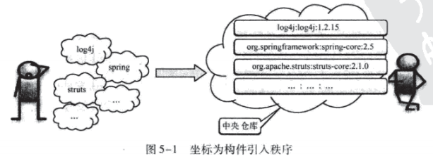
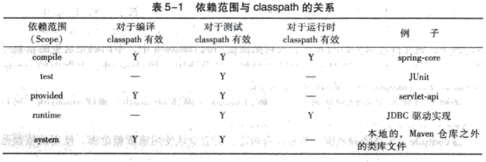
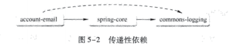
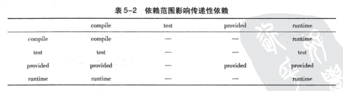
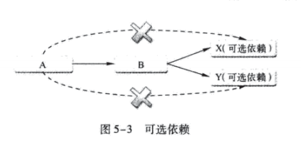

# 第5章  坐标和依赖

**本章内容**

* 何为Maven坐标
* 坐标详解
* account-email
* 依赖的配置
* 依赖范围
* 传递性依赖
* 依赖调解
* 可选依赖
* 最佳实践
* 小结

正如第1章所述，Maven的一大功能是管理项目依赖。为了能自动化地解析任何一个Java构件，Maven就必须将它们唯一标识，这就依赖管理的底层基础——坐标。本章将详细分析Maven坐标的作用，解释其每一个元素；在此基础上，再介绍如何配置Maven，以及相关的经验和技巧，以帮助我们管理项目依赖。

## 5.1 何为Maven坐标

在我们开发自己项目的时候，也需要为其定义适当的坐标，这是Maven强制要求的。在这个基础上，其他Maven项目才能引用该项目生成的构件。见图5-1。



## 5.2 坐标详解

Maven坐标为各种构件引入了秩序，任何一个构建都必须明确定义自己的坐标，而一组Maven坐标是通过一些元素定义的，它们是groupId、artifactId、version、packaging、classifier。先看一组坐标定义，如下：

```xml
<groupId>com.juvenxu.mvnbook</groupId>
<artifactId>hello-world</artifactId>
<version>1.0-SNAPSHOT</version>
<packaging>jar</packaging>
```

这是nexus-indexer的坐标定义，nexus-indexer是一个对Maven仓库编纂索引并提供搜索功能的类库，它是Nexus项目的一个子模块。后面会详细介绍Nexus。

下面详细解释一下各个坐标元素：

* **groupId**：定义当前Maven项目隶属的实际项目。
* **artifactId**：该元素定义实际项目中的一个Maven项目（模块），推荐的做法是使用实际项目名称作为artifactId的前缀。

* **version**：该元素定义Maven项目当前所处的版本。
* **packaging**：该元素定义Maven项目的打包方式。最后，当不定义packaging的时候，Maven会使用默认值jar。
* **classifter**：该元素用来帮助定义构建输出的一些附属构建。附属构建与主构建对应。

同时，项目构件的文件名是与坐标相对应的。

此外，Maven仓库的布局也是基于Maven坐标，这一点会在介绍Maven仓库的时候详细解释。

同样地，理解清楚Maven坐标之后，我们就开始讨论Maven的依赖管理了。

## 5.3 account-email

在详细讨论Maven依赖之前，先稍微回顾一下上一章提到的背景案例。案例中有一个email模块负责发送账户激活的电子邮件，本章就详细阐述该模块的实现，包括POM配置、主代码和测试代码。由于该背景案例的实现是基于Spring Framework，因此还会设计相关的Spring配置。

### 5.3.1 account-email的POM

首先看一下该模块的POM，见代码清单5-1。

```xml
<?xml version="1.0" encoding="UTF-8"?>
<project xmlns="http://maven.apache.org/POM/4.0.0"
         xmlns:xsi="http://www.w3.org/2001/XMLSchema-instance"
         xsi:schemaLocation="http://maven.apache.org/POM/4.0.0  http://maven.apache.org/maven-v4_0_0.xsd">
    <modelVersion>4.0.0</modelVersion>
    <!--实际项目-->
    <groupId>com.juvenxu.mvnbook.account</groupId>
    <!--Maven项目，所谓Maven项目就是实际项目中的一个模块-->
    <artifactId>account-email</artifactId>
    <!--Maven项目版本，SNAPSHOT说明还不是稳定版本-->
    <version>1.0-SNAPSHOT</version>
    <!--name不是必须的，声明一个对于用户更为友好的项目名称-->
    <name>Account Email</name>
    <!--定义Maven的打包方式-->
    <packaging>jar</packaging>

    <properties>
        <maven.compiler.target>1.8</maven.compiler.target>
        <maven.compiler.source>1.8</maven.compiler.source>
        <project.build.sourceEncoding>UTF-8</project.build.sourceEncoding>
        <!--对于account-email中这些Spring Framework来说，也应该在一个唯一的地方定义版本，并且在dependency声明中引用这一版本。这样，在升级Spring Framework的时候就只需要修改一处-->
        <springframework.version>2.5.6</springframework.version>
    </properties>

    <dependencies>
        <!--spring Framework-->
        <dependency>
            <groupId>org.springframework</groupId>
            <artifactId>spring-core</artifactId>
            <!--引用在properties中定义的版本信息-->
            <version>${springframework.version}</version>
        </dependency>
        <dependency>
            <groupId>org.springframework</groupId>
            <artifactId>spring-beans</artifactId>
            <version>${springframework.version}</version>
        </dependency>
        <dependency>
            <groupId>org.springframework</groupId>
            <artifactId>spring-context</artifactId>
            <version>${springframework.version}</version>
        </dependency>
        <dependency>
            <groupId>org.springframework</groupId>
            <artifactId>spring-context-support</artifactId>
            <version>${springframework.version}</version>
        </dependency>

        <dependency>
            <!--实现发送必须的类库-->
            <groupId>javax.mail</groupId>
            <artifactId>mail</artifactId>
            <version>1.4.1</version>
        </dependency>

        <dependency>
            <!--Junit是Java社区事实上的单元测试标准-->
            <groupId>junit</groupId>
            <artifactId>junit</artifactId>
            <version>4.7</version>
            <scope>test</scope>
        </dependency>

        <dependency>
            <!--GreenMail开源的邮件服务测试套件-->
            <groupId>com.icegreen</groupId>
            <artifactId>greenmail</artifactId>
            <version>1.3.1b</version>
            <scope>test</scope>
        </dependency>
    </dependencies>
</project>
```

### 5.3.2 account-email的主代码

account-email只有一个很简单的接口，见代码清单5-2。

```java
package com.juvenxu.mvnbook.account.email;

/**
 * AccountEmailService
 *
 * @author shenhuanjie
 * @date 2019/6/10 17:36
 */
public interface AccountEmailService {
    /**
     * sendMail()方法用来发送html格式的邮件，to为接收地址，subject为邮箱主题，htmlText为邮箱内容，
     * * 如果发送邮箱出错，则抛出AccountEmailException异常。
     *
     * @param to
     * @param subject
     * @param htmlText
     * @throws AccountEmailException
     */
    void sendMail(String to, String subject, String htmlText) throws AccountEmailException;
}
```

sendMail( )方法用来发送html格式的邮件，to为接收地址，subject为邮件主题，htmlText为邮件内容，如果发送邮件出错，则抛出AccountEmailException异常。

对应于该接口的实现见代码清单5-3。

```java
package com.juvenxu.mvnbook.account.email;

import org.springframework.mail.javamail.JavaMailSender;
import org.springframework.mail.javamail.MimeMessageHelper;

import javax.mail.MessagingException;
import javax.mail.internet.MimeMessage;

/**
 * AccountEmailServiceImpl
 *
 * @author shenhuanjie
 * @date 2019/6/10 17:51
 */
public class AccountEmailServiceImpl implements AccountEmailService {

    private JavaMailSender javaMailSender;
    private String systemEmail;

    /**
     * sendMail()方法用来发送html格式的邮件，to为接收地址，subject为邮箱主题，htmlText为邮箱内容，
     * * 如果发送邮箱出错，则抛出AccountEmailException异常。
     *
     * @param to
     * @param subject
     * @param htmlText
     * @throws AccountEmailException
     */
    @Override
    public void sendMail(String to, String subject, String htmlText) throws AccountEmailException {
        try {
            MimeMessage mimeMessage = javaMailSender.createMimeMessage();
            MimeMessageHelper mimeMessageHelper = new MimeMessageHelper(mimeMessage);

            mimeMessageHelper.setFrom(systemEmail);
            mimeMessageHelper.setTo(to);
            mimeMessageHelper.setSubject(subject);
            mimeMessageHelper.setText(htmlText, true);//true表示邮箱的内容为html格式

            // 发送邮件
            javaMailSender.send(mimeMessage);

        } catch (MessagingException e) {
            throw new AccountEmailException("Fail to send email.", e);
        }
    }

    public JavaMailSender getJavaMailSender() {
        return javaMailSender;
    }

    public void setJavaMailSender(JavaMailSender javaMailSender) {
        this.javaMailSender = javaMailSender;
    }

    public String getSystemEmail() {
        return systemEmail;
    }

    public void setSystemEmail(String systemEmail) {
        this.systemEmail = systemEmail;
    }
}

```

首先，该AccountEmailServiceImpl类有一个私有字段javaMailSender，该字段的类型org.springframework.mail.javamail.JavaMailSender是来自于Spring Framework的帮助简化邮件发送的工具类库，对应于该字段有一组getter( )和setter( )方法，它们用来帮助实现依赖注入。本节随后会讲述Spring Framework依赖注入相关的配置。

在sendMail( )的方法实现中，首先使用javaMailSender创建一个MimeMessage，该msg对应了将要发送的邮件。接着使用MimeMessageHelper帮助设置该邮件的发送地址、收件地址、主题以及内容，msgHelper.setText(htmlText,true)中的true表示邮件的内容为html格式。最后，使用javaMailSender发送该邮件，如果发送出错，则捕捉MessageException异常，包装后再抛出该模块自己定义的AccountEmailException异常。

这段Java代码中没有邮件服务器配置信息，这得益于Spring Framework的依赖注入，这些配置都通过外部的配置注入到了javaMailSender中，相关配置信息都在account-email.xml这个配置文件中，见代码清单5-4。

```xml
<?xml version="1.0" encoding="UTF-8" ?>
<beans xmlns="http://www.springframework.org/schema/beans"
       xmlns:xsi="http://www.w3.org/2001/XMLSchema-instance"
       xsi:schemaLocation="http://www.springframework.org/schema/beans http://www.springframework.org/schema/beans/spring-beans-2.0.xsd">

    <bean id="propertyConfigurer" class="org.springframework.beans.factory.config.PropertyPlaceholderConfigurer">
        <property name="location" value="classpath:service.properties"/>
    </bean>

    <bean id="javaMailSender" class="org.springframework.mail.javamail.JavaMailSenderImpl">
        <property name="protocol" value="${email.protocol}"/>
        <property name="host" value="${email.host}"/>
        <property name="port" value="${email.port}"/>
        <property name="username" value="${email.username}"/>
        <property name="password" value="${email.password}"/>
        <property name="javaMailProperties">
            <props>
                <prop key="mail.${email.protocol}.auth">${email.auth}</prop>
            </props>
        </property>
    </bean>

    <bean id="accountEmailService" class="com.juvenxu.mvnbook.account.email.AccountEmailServiceImpl">
        <property name="javaMailSender" ref="javaMailSender"/>
        <property name="systemEmail" value="${email.systemEmail}"/>
    </bean>

</beans>
```

Spring Framework会使用该XML配置创建ApplicationContext，以实现依赖注入。该配置文件定义了一些bean，基本对应了Java程序中的对象。首先解释下id为propertyCOnfigurer的bean，其实现为org.springframework.beans.factory.config.PropertyPlaceholderConfigurer，这是Spring Framework中用来帮助载入properties文件的组件。这里定义location的值为classpath:account-email.properties，表示从classpath的根路径下载入名为account-email.properties文件中的属性。

接着定义id为javaMailSender的bean，其实现为org.springframework.mail.javamail.JavaMailSenderImpl，这里需要定义邮件服务器的一些配置，包括协议、端口、主机、用户名、密码，是否需要认证等属性。这段配置还使用了Spring Framework的属性引用，比如${email.host}，之前定义propertyConfigurer的作用就在于此。这么做可以将邮件服务器相关的配置分离到properties文件中，比如可以定义这样一个properties文件，配置javaMailSender使用gmail：

```properties
email.protocol=smtp
#使用localhost不一定可以，换成127.0.0.1
#email.host=localhost
email.host=127.0.0.1
email.port=25  
email.username=test@maven.com  
email.password=123456  
email.auth=true  
email.systemEmail=liuxb@maven.com
```

这样，javaMailSender实际使用的protocol就会成为smtps，host会成为smtp.gmail.com，同理还有port、username等其他属性。

最后一个bean是accountEmailService，对应了之前描述的com.juvenxu.mvnbook.account.email.AccountEmailServiceImpl，配置中将另外一个bean javaMailSender注入，使其成为该类javaMailSender的字段的值。

上述就是Spring Framework相关的配置，这里不再进一步深入，读者如果有不是很理解的地方，请查询Spring Framework相关文档。

### 5.3.3 account-email的测试代码

该模块需要测试的只有一个AccountEmailService.sendMail( )接口。为此，需要配置并启动一个测试使用的邮件服务器，然后提供对应的properties配置文件供Spring Framework载入以配置程序。准备就绪之后，调用该接口发送邮件，然后检查邮件是否发送成功。最后，关闭测试邮件服务器，见代码清单5-5。

```java
package com.newtouch.mvnbook.account.email;

import com.icegreen.greenmail.util.GreenMail;
import com.icegreen.greenmail.util.GreenMailUtil;
import com.icegreen.greenmail.util.ServerSetup;
import com.juvenxu.mvnbook.account.email.AccountEmailService;
import org.junit.After;
import org.junit.Before;
import org.junit.Test;
import org.springframework.context.ApplicationContext;
import org.springframework.context.support.ClassPathXmlApplicationContext;

import javax.mail.Message;

import static org.junit.Assert.assertEquals;

/**
 * AccountEmailServiceTest：Unit test for simple App.
 *
 * @author shenhuanjie
 * @date 2019/6/10 18:03
 */
public class AccountEmailServiceTest {

    private GreenMail greenMail;

    @Before
    public void startMailServer() {
        greenMail = new GreenMail(ServerSetup.SMTP);
        greenMail.setUser("test@maven.com", "123456");
        greenMail.start();
    }

    @Test
    public void testSendMail() throws Exception {
        ApplicationContext applicationContext = new ClassPathXmlApplicationContext("account-email.xml");
        AccountEmailService accountEmailService = (AccountEmailService) applicationContext.getBean("accountEmailService");

        String subject = "Test Subject";
        String htmlText = "<h3>Html Text</h3>";
        accountEmailService.sendMail("421632337@qq.com", subject, htmlText);

        greenMail.waitForIncomingEmail(2000, 1);

        Message[] messages = greenMail.getReceivedMessages();


        assertEquals(1, messages.length);
        assertEquals(subject, messages[0].getSubject());
        assertEquals(htmlText, GreenMailUtil.getBody(messages[0]).trim());

        System.out.println("message.length=" + messages.length);
        System.out.println("subject=" + messages[0].getSubject());
        System.out.println("htmlText=" + GreenMailUtil.getBody(messages[0]).trim());
    }

    @After
    public void stopMailServer() {
        greenMail.stop();
    }
}
```


```java
package com.juvenxu.mvnbook.account.email;

/**
 * AccountEmailException
 *
 * @author shenhuanjie
 * @date 2019/6/10 17:49
 */
public class AccountEmailException extends Exception {

    private static final long serialVersionUID = -5070634956397263211L;

    /**
     * AccountEmailException
     * 
     * @param message
     * @param cause
     */
    public AccountEmailException(String message, Throwable cause) {
        super(message, cause);
    }
}

```

这时，可以运行mvn clean test执行测试，Maven会编译主代码和测试代码，并执行测试，报告一个测试得以正确执行，构建成功

### 5.3.4 构建account-email

使用mvn clean install构建account-email，Maven会根据POM配置自动下载所需要的依赖构件，执行编译、测试、打包等工作，最后将项目生成的构件account-email-1.0.0-SNAPSHOT.jar安装到本地仓库中。这时，该模块就能供其他Maven项目使用了。

## 5.4 依赖的配置

5.3.1节已经罗列了一些简单的依赖配置，读者可以看到依赖会有基本的groupId、artifactId和version等元素组成。其实一个依赖声明可以包含如下的一些元素：

```xml
<?xml version="1.0" encoding="UTF-8"?>
<project xmlns="http://maven.apache.org/POM/4.0.0"
         xmlns:xsi="http://www.w3.org/2001/XMLSchema-instance"
         xsi:schemaLocation="http://maven.apache.org/POM/4.0.0  http://maven.apache.org/maven-v4_0_0.xsd">
    <modelVersion>4.0.0</modelVersion>
    <!--实际项目-->
    <groupId>com.juvenxu.mvnbook.account</groupId>
    <!--Maven项目，所谓Maven项目就是实际项目中的一个模块-->
    <artifactId>account-email</artifactId>
    <!--Maven项目版本，SNAPSHOT说明还不是稳定版本-->
    <version>1.0-SNAPSHOT</version>
    <!--name不是必须的，声明一个对于用户更为友好的项目名称-->
    <name>Account Email</name>
    <!--定义Maven的打包方式-->
    <packaging>jar</packaging>

    <properties>
        <maven.compiler.target>1.8</maven.compiler.target>
        <maven.compiler.source>1.8</maven.compiler.source>
        <project.build.sourceEncoding>UTF-8</project.build.sourceEncoding>
        <!--对于account-email中这些Spring Framework来说，也应该在一个唯一的地方定义版本，并且在dependency声明中引用这一版本。这样，在升级Spring Framework的时候就只需要修改一处-->
        <springframework.version>2.5.6</springframework.version>
    </properties>

    <dependencies>
        <!--spring Framework-->
        <dependency>
            <groupId>org.springframework</groupId>
            <artifactId>spring-core</artifactId>
            <!--引用在properties中定义的版本信息-->
            <version>${springframework.version}</version>
        </dependency>
        <dependency>
            <groupId>org.springframework</groupId>
            <artifactId>spring-beans</artifactId>
            <version>${springframework.version}</version>
        </dependency>
        <dependency>
            <groupId>org.springframework</groupId>
            <artifactId>spring-context</artifactId>
            <version>${springframework.version}</version>
        </dependency>
        <dependency>
            <groupId>org.springframework</groupId>
            <artifactId>spring-context-support</artifactId>
            <version>${springframework.version}</version>
        </dependency>

        <dependency>
            <!--实现发送必须的类库-->
            <groupId>javax.mail</groupId>
            <artifactId>mail</artifactId>
            <version>1.4.1</version>
        </dependency>

        <dependency>
            <!--Junit是Java社区事实上的单元测试标准-->
            <groupId>junit</groupId>
            <artifactId>junit</artifactId>
            <version>4.7</version>
            <scope>test</scope>
        </dependency>

        <dependency>
            <!--GreenMail开源的邮件服务测试套件-->
            <groupId>com.icegreen</groupId>
            <artifactId>greenmail</artifactId>
            <version>1.3.1b</version>
            <scope>test</scope>
        </dependency>
    </dependencies>
</project>
```

根元素project下的dependencies可以包含一个或多个dependency元素，以声明一个或者多个项目依赖。每个依赖可以包含的元素有：

* **groupId、artifactId和version**：依赖的基本坐标，对于任何一个依赖来说，基本坐标是最重要的，Maven根据坐标才能找到需要的依赖。
* **type**：依赖的类型，对应于项目坐标定义的packaging。大部分情况下，该元素不必声明，其默认值为jar。
* **scop**：依赖的范围，见5.5节。
* **optional**：标记依赖是否可选，见5.8节。
* **exclusions**：用来排除传递性依赖，见5.9.1节。

大部分依赖声明只包含基本坐标，然而在一些特殊情况下，其他元素至关重要，本章下面的小节会对它们的原理和使用方式详细介绍。

## 5.5 依赖范围

上一节提到，JUnit依赖的测试范围是test，测试范围用元素scope表示。本节将详细解释什么是测试范围，以及各种测试范围的效果和用途。

首先需要知道，Maven在编译项目主代码的时候需要使用一套classpath。在上例中，编译项目主代码的时候需要用到spring-core，该文件以依赖的方式被引入到classpath中。其次，Maven在编译和执行测试的时候会使用另一套classpath。上例中的JUnit就是一个很好的例子，该文件也以依赖的方式引入到测试使用的classpath中，不同的是这里的依赖范围是test。最后，实际运行Maven项目的时候，又会使用一套classpath，上例中的spring-core需要在该classpath中，而JUnit则不需要。

依赖范围就是用来控制依赖与这三种classpath（编译classpath、测试classpath、运行classpth）的关系，Maven有以下几种依赖范围：

* **compile**：编译依赖范围。如果没有指定，就会默认使用该依赖范围。使用此依赖范围的Maven依赖，对于编译、测试、运行三种classpath都有效。典型的例子是spring-core，在编译、测试和运行的时候都需要使用该依赖。
* **test**：测试依赖范围。使用此依赖范围的Maven依赖，只对于测试classpath有效，在编译主代码或者运行项目的使用时将无法使用此类依赖。典型的例子是JUnit，它只有在编译测试代码及运行测试的时候才需要。
* **provided**：已提供依赖范围。使用此依赖范围的Maven依赖，对于编译和测试classpath有效，但在运行时无效。典型的例子是servlet-api，编译和测试项目的时候需要该依赖，但在运行项目的时候，由于容器已经提供，就不需要Maven重复地引入一遍。
* **runtime**：运行时依赖范围。使用此依赖范围的Maven依赖，对于测试和运行classpath有效，但在编译主代码时无效。典型的例子是JDBC驱动实现，项目主代码的编译只需要JDK提供的JDBC接口，只有在执行测试或者运行项目的时候才需要实现上述接口的具体JDBC驱动。
* **system**：系统依赖范围。该依赖与三种classpath的关系，和provided依赖范围完全一致。但是，使用system范围的依赖时必须通过systemPath元素显式地指定依赖文件的路径。由于此类依赖不是通过Maven仓库解析的，而且往往与本机系统绑定，可能造成构建的不可移植，因此应该谨慎使用。systemPath元素可以引用环境变量，如：

```xml
<dependency>
    <groupId>javax.sql</groupId>
    <artifactId>jdbc-stdext</artifactId>
    <version>2.0</version>
    <scope>system</scope>
    <systemPath>${java.home}/lib/rt.jar</systemPath>
</dependency>
```

* **import（Maven 2.0.9及以上）**：导入依赖范围。该依赖范围不会对三种classpath产生实际的影响，本书将在8.3.3节介绍Maven依赖和dependencyManagement的时候详细介绍此依赖范围。

上述除import以外的各种依赖范围与三种classpath的关系如表5-1所示。



## 5.6 传递性依赖

### 5.6.1 何为传递性依赖

考虑一个基于Spring Framework的项目，如果不使用Maven，那么在项目中就需要手动下载相关依赖。由于Spring Framework又会依赖于其他开源类库，因此实际中往往会下载一个很大的如spring-framework-2.5.6-with-dependencies.zip的包，这里包含了所有Spring Framework的jar包，以及所有它依赖的其他jar包。这么做往往就引入了很多不必要的依赖。另一种做法是只下载spring-framework-2.5.6.zip这样一个包，这里不包含其他相关依赖，到实际使用的时候，再根据出错信息，或者查询相关文档，加入需要的其他依赖。很显然，这也是一件非常麻烦的事情。

Maven的传递性依赖机制可以很好地解决这一问题。以account-email项目为例，该项目有一个org.springframework:spring-core:2.5.6的依赖，而实际上spring-core也有它自己的依赖，我们可以直接访问位于中央仓库的该构件的POM：http://repo1.maven.org/maven2/org/springframework/spring-core/2.5.6/spring-core-2.5.6.pom。该文件包含了一个commons-logging依赖，见代码清单5-6。

```xml
<dependency>
   <groupId>commons-logging</groupId>
   <artifactId>commons-logging</artifactId>
   <version>1.1.1</version>
</dependency>
```

该依赖没有声明依赖范围，那么其依赖范围就是默认的compile。同时回顾一下account-email，spring-core的依赖范围也是compile。

account-mail有一个compile范围的spring-core依赖，spring-core有一个compile范围的commons-logging依赖，那么commons-logging就会成为account-email的compile范围依赖，commons-logging是account-email的一个传递性依赖，如图5-2所示。



有了传递性依赖机制，在使用Spring Framework的时候就不用去考虑它依赖了什么，也不用担心引入多余的依赖。Maven会解析各个直接依赖的POM，将那些必要的间接依赖以传递性依赖的形式引入到当前项目中。

### 5.6.2 传递性依赖和依赖范围

依赖范围不仅可以控制依赖与三种classpath的关系，还对传递性



## 5.7 依赖调解

Maven引入的传递性依赖机制，一方面大大简化和方便了依赖声明，另一方面，大部分情况下我们只需关心项目的直接依赖是什么，而不用考虑这些直接依赖会引入什么传递性依赖。但有时候，当传递性依赖造成问题的时候，我们就需要清楚地知道该传递性依赖是从哪条依赖路径引入的。

Maven依赖调解（Dependency Mediation）的第一原则是：路径最近者优先。

依赖调解第一原则不能解决所有问题，Maven定义了依赖调解的第二原则：第一声明者优先。在依赖路径长度相等的前提下，在POM中依赖声明的顺序决定了谁会被解析使用，顺序最靠前的那个依赖优胜。

## 5.8 可选依赖




```xml
<project>
    <modelVersion>4.0.0</modelVersion>
    <groupId>com.juvenxu.mvnbook</groupId>
    <artifactId>project-b</artifactId>
    <version>1.0.0</version>
    <dependencies>
        <denpendency>
            <groupId>mysql</groupId>
            <artifactId>mysql-connector-java</artifactId>
            <version>5.1.10</version>
            <optional>true</optional>
        </denpendency>
        <denpendency>
            <groupId>postgresql</groupId>
            <artifactId>postgresql</artifactId>
            <version>8.4-701.jdbc3</version>
            <optional>true</optional>
        </denpendency>
    </dependencies>
</project>
```

上述XML代码片段中，使用`<optional>`元素表示mysql-connector-java和postgresql这两个依赖为可选依赖，它们只会对当前项目B产生影响，当其他项目依赖于B的时候，这两个依赖不会被传递。因此，当项目A依赖于项目B的时候，如果其实际使用基于MySQL数据库，那么在项目A中就需要显式地声明mysql-connector-java这一依赖，见代码清单5-8。

```xml
<project>
    <modelVersion>4.0.0</modelVersion>
    <groupId>com.juvenxu.mvnbook</groupId>
    <artifactId>project-a</artifactId>
    <version>1.0.0</version>
    <dependencies>
        <denpendency>
            <groupId>com.juvenxu.mvnbook</groupId>
            <artifactId>project-b</artifactId>
            <version>1.0.0</version>
        </denpendency>
        <denpendency>
            <groupId>mysql</groupId>
            <artifactId>mysql-connector-java</artifactId>
            <version>5.1.10</version>
        </denpendency>
    </dependencies>
</project>
```

最后，关于可选依赖需要说明的一点是，在理想的情况下，是不应该使用可选依赖的。

## 5.9 最佳实践

Maven依赖涉及的知识点比较多，在理解了主要的功能和原理之后，最需要的当然就是前人的经验总结了，我们称之为最佳实践。本小节归纳了一些使用Maven依赖常见的技巧，方便用来避免和处理很多常见的问题。

### 5.9.1 排除依赖

### 5.9.2 归类依赖

### 5.9.3 优化依赖

```powershell
> mvn dependency:list
[INFO] Scanning for projects...
[INFO]
[INFO] -------------< com.juvenxu.mvnbook.account:account-email >--------------
[INFO] Building Account Email 1.0-SNAPSHOT
[INFO] --------------------------------[ jar ]---------------------------------
[INFO]
[INFO] --- maven-dependency-plugin:2.8:list (default-cli) @ account-email ---
[INFO]
[INFO] The following files have been resolved:
[INFO]    org.springframework:spring-beans:jar:2.5.6:compile
[INFO]    javax.mail:mail:jar:1.4.1:compile
[INFO]    javax.activation:activation:jar:1.1:compile
[INFO]    commons-logging:commons-logging:jar:1.1.1:compile
[INFO]    org.slf4j:slf4j-api:jar:1.3.1:test
[INFO]    org.springframework:spring-context-support:jar:2.5.6:compile
[INFO]    aopalliance:aopalliance:jar:1.0:compile
[INFO]    junit:junit:jar:4.7:test
[INFO]    com.icegreen:greenmail:jar:1.3.1b:test
[INFO]    org.springframework:spring-core:jar:2.5.6:compile
[INFO]    org.springframework:spring-context:jar:2.5.6:compile
[INFO]
[INFO] ------------------------------------------------------------------------
[INFO] BUILD SUCCESS
[INFO] ------------------------------------------------------------------------
[INFO] Total time: 4.851 s
[INFO] Finished at: 2019-06-11T14:52:10+08:00
[INFO] ------------------------------------------------------------------------
```


```powershell
> mvn dependency:tree
[INFO] Scanning for projects...
[INFO]
[INFO] -------------< com.juvenxu.mvnbook.account:account-email >--------------
[INFO] Building Account Email 1.0-SNAPSHOT
[INFO] --------------------------------[ jar ]---------------------------------
[INFO]
[INFO] --- maven-dependency-plugin:2.8:tree (default-cli) @ account-email ---
[INFO] com.juvenxu.mvnbook.account:account-email:jar:1.0-SNAPSHOT
[INFO] +- org.springframework:spring-core:jar:2.5.6:compile
[INFO] |  \- commons-logging:commons-logging:jar:1.1.1:compile
[INFO] +- org.springframework:spring-beans:jar:2.5.6:compile
[INFO] +- org.springframework:spring-context:jar:2.5.6:compile
[INFO] |  \- aopalliance:aopalliance:jar:1.0:compile
[INFO] +- org.springframework:spring-context-support:jar:2.5.6:compile
[INFO] +- javax.mail:mail:jar:1.4.1:compile
[INFO] |  \- javax.activation:activation:jar:1.1:compile
[INFO] +- junit:junit:jar:4.7:test
[INFO] \- com.icegreen:greenmail:jar:1.3.1b:test
[INFO]    \- org.slf4j:slf4j-api:jar:1.3.1:test
[INFO] ------------------------------------------------------------------------
[INFO] BUILD SUCCESS
[INFO] ------------------------------------------------------------------------
[INFO] Total time: 3.523 s
[INFO] Finished at: 2019-06-11T14:50:53+08:00
[INFO] ------------------------------------------------------------------------
```

## 5.10 小结

本章主要介绍了Maven的两个核心概念：坐标和依赖。解释了坐标的由来，并详细阐述了各坐标元素的作用及定义方式。随后引入account-email这一实际的基于Spring Framework的模块，包括了POM定义、主代码和测试代码。在这一直观感受的基础上，再花了大篇幅介绍Maven依赖，包括依赖范围、传递性依赖，可选依赖等概念。最后，当然少不了关于依赖的一些最佳实践。通过阅读本章，读者应该已经能够透彻地了解Maven的依赖管理机制。下一章将会介绍Maven的另一个核心概念：仓库。

