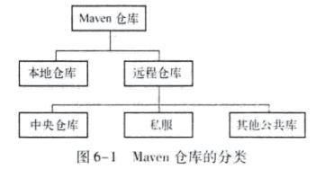
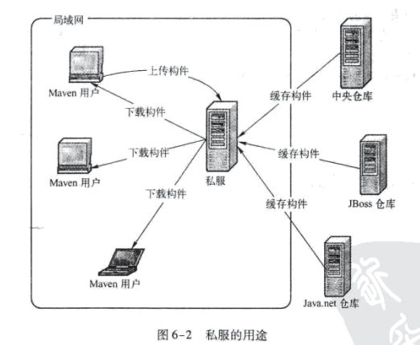

# 第6章 仓库

**本章内容**

* 何为Maven仓库
* 仓库的布局
* 仓库的分类
* 远程仓库的配置
* 快照版本
* 从仓库解析依赖的机制
* 镜像
* 仓库搜索服务
* 小结

第5章详细介绍了Maven坐标和依赖，坐标和依赖是任何一个构建在Maven世界中的逻辑表示方式；而构建的物理表示方式是文件，Maven通过仓库来统一管理这些文件。本章将详细介绍Maven仓库，在了解了Maven如何使用仓库之后，将能够更高效地使用Maven。

## 6.1 何为Maven仓库

在Maven世界中，任何一个依赖、插件或者项目构建的输出，都可以称为构件。

得益于坐标机制，任何Maven项目使用任何一个构件的方式都是完全相同的。在此基础上，Maven可以在某个位置统一存储所有Maven项目共享的构建，这个统一的位置就是仓库。实际的Maven项目将不再各自存储其依赖文件，它们只需要声明这些依赖的坐标，在需要的时候，Maven会自动根据坐标找到仓库中的构件，并使用它们。

为了实现重用，项目构建完毕后生成的构件也可以安装或者部署到仓库中，供其他项目使用。

## 6.2 仓库的布局

任何一个构件都有其唯一的坐标，根据这个坐标可以定义其在仓库中的唯一存储路径，这便是Maven的仓库布局方式。

## 6.3 仓库的分类

对于Maven来说，仓库只分为两类：本地仓库和远程仓库。当Maven根据坐标寻找构件的时候，它首先会查看本地仓库，如果本地仓库存在此构件，则直接使用；如果本地仓库不存在此构件，或者需要查看是否有更新的构件版本，Maven就会去远程仓库查找，发现需要的构件之后，下载到本地仓库再使用。如果本地仓库和远程仓库都没有需要的构件，Maven就会报错。



### 6.3.1 本地仓库

一般来说，在Maven项目目录下，没有诸如lib/这样用来存放依赖文件的目录。

在某个项目中执行`mvn clean install`命令，就能看到如下输出：

```powershell
> mvn clean install
[INFO] Scanning for projects...
[INFO]
[INFO] -------------< com.juvenxu.mvnbook.account:account-email >--------------
[INFO] Building Account Email 1.0
[INFO] --------------------------------[ jar ]---------------------------------
。。。
[INFO]
[INFO] --- maven-jar-plugin:2.4:jar (default-jar) @ account-email ---
[INFO] Building jar: C:\...\Maven实战\Archetype\account-email\target\account-email-1.0.jar
[INFO]
[INFO] --- maven-install-plugin:2.4:install (default-install) @ account-email ---
[INFO] Installing C:\...\Maven实战\Archetype\account-email\target\account-email-1.0.jar to C:\...\.m2\repository\com\juvenxu\mvnbook\account\account-email\1.0\account-email-1.0.jar
[INFO] Installing C:\...\Maven实战\Archetype\account-email\pom.xml to C:\...\.m2\repository\com\juvenxu\mvnbook\account\account-email\1.0\account-email-1.0.pom
[INFO] ------------------------------------------------------------------------
[INFO] BUILD SUCCESS
[INFO] ------------------------------------------------------------------------
[INFO] Total time: 13.568 s
[INFO] Finished at: 2019-06-11T15:14:05+08:00
[INFO] ------------------------------------------------------------------------
```

### 6.3.2 远程仓库

### 6.3.3 中央仓库

中央仓库包含了这个世界上绝大多数流行的开源Java构件，以及源码、作者信息、SCM、信息、许可证信息等，每个月这里都会接受全世界Java程序员大概1亿次的访问，它对全世界Java开发者的贡献由此可见一斑。

### 6.3.4 私服

私服是一种特殊的远程仓库，它是假设在局域网类的仓库服务，私服代理广域网上的远程仓库，供局域网内的Maven用户使用。



## 6.4 远程仓库的配置

```xml
<project>
    <repositories>
        <repository>
            <id>jboss</id>
            <name>JBoss Repository</name>
            <url>http://repository.jboss.com/maven2</url>
            <releases>
                <enabled>true</enabled>
            </releases>
            <snapshots>
                <enabled>true</enabled>
                <updatePolicy>daily</updatePolicy>
                <checksumPolicy>ignore</checksumPolicy>
            </snapshots>
            <layout>default</layout>
        </repository>
    </repositories>
</project>
```

### 6.4.1 远程仓库的认证

大部分远程仓库无须认证就可以访问，但有时候出于安全方面的考虑，我们需要提供认证信息才能访问一些远程仓库。

```xml
<settings>
    <servers>
        <server>
            <id>my-proj</id>
            <username>repo-user</username>
            <password>repo-pwd</password>
        </server>
    </servers>
</settings>
```

Maven使用settings.xml文件中并不显而易见的servers元素及其server子元素配置仓库认证信息。

### 6.4.2 部署至远程仓库

在第6.3.4节中提到，私服的一大作用是部署第三方构件，包括组织内部生成的构件以及一些无法从外部仓库直接获取的文件。

Maven除了能对项目进行编译、测试、打包之外，还能将项目生成的构建部署到仓库中。首先，需要编辑项目的pom.xml文件。配置distributionManagement元素见代码6-4所示。

```xml
<project>
    <distributionManagement>
        <repository>
            <id>proj-releases</id>
            <name>Proj Release Repository</name>
            <url>http://192/168.1.100/content/repositories/proj-releases</url>
        </repository>
        <snapshotRepository>
            <id>proj-releases</id>
            <name>Proj Snapshot Repository</name>
            <url>http://192/168.1.100/content/repositories/proj-snapshots</url>
        </snapshotRepository>
    </distributionManagement>
</project>
```

配置正确后，在命令行运行`mvn clean deploy`，Maven就会将项目构建输出的构件部署到配置对应的远程仓库，如果项目当前的版本是快照版本，则部署到快照版本仓库地址，否则就部署到发布版本仓库地址。

## 6.5 快照版本

在Maven的世界中，任何一个项目或者构件都必须有自己的版本。

## 6.6 从仓库解析依赖的机制

## 6.7 镜像

## 6.8 仓库搜索服务

### 6.8.1 Snoatype Nexus

### 6.8.2 Jarvana

### 6.8.3 MVNbrowser

### 6.8.4 MVNrepository

### 6.8.5 选择合适的仓库搜索服务

## 6.9 小结

本章深入阐述了仓库这一Maven核心关。首先介绍了仓库的由来；接着直接剖析了一段Maven源码，介绍仓库的布局，以方便读者将仓库与实际文件联系起来；而仓库的分类这一部分则分别介绍了本地仓库、远程仓库、中央仓库以及私服等概念；基于这些概念，又详细介绍了仓库的配置；在此基础上，我们再深入仓库的内部工作机制，并同时解释了Maven中快照的概念。本章还解释了镜像的概念及用法。最后，本章介绍了一些常用的仓库搜索服务，以方便读者的日常开发工作。

