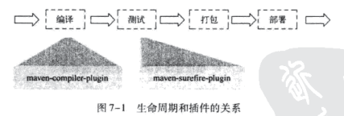
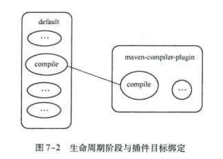

# 第7章 生命周期和插件

**本章内容**

* 何为生命周期
* 生命周期详解
* 插件目标
* 插件绑定
* 插件配置
* 获取插件信息
* 从命令行调用插件
* 插件解析机制
* 小结

除了坐标、依赖以及仓库之外，Maven另外两个核心概念是生命周期和插件。在有关Maven的日常使用中，命令行的输入往往就对应了生命周期，如`mvn package`就表示执行默认生命周期阶段package。Maven的生命周期是抽象的，其实际行为都由插件来完成，如package阶段的任务可能就会由maven-jar-plugin完成。生命周期和插件两者协同工作，密不可分，本章对它们进行深入介绍。

## 7.1 何为生命周期

## 7.2 生命周期详解

### 7.2.1 三套生命周期

Maven拥有三套相互独立的生命周期，它们分别是clean、default和site。clean生命周期的目的是清理项目，default生命周期的目的是构建项目，而site生命周期的目的是建立项目站点。

每个生命周期包含一些阶段（phase），这些阶段是有顺序的，并且后面的阶段依赖于前面的阶段，用户和Maven最直接的交互方式就是调用这些生命周期阶段。

### 7.2.2 clean生命周期

clean生命周期 的目的是清理项目，它包含三个阶段：

1. **pre-clean** 执行一些清理前需要完成的工作。
2. **clean** 清理上一次构建生成的文件。
3. **post-clean** 执行一些清理后需要完成的工作。

### 7.2.3 default生命周期

default生命周期定义了真正构建时所需要执行的所有步骤，它是所有生命周期中最核心的部分，其包含的阶段如下，这里笔者只对重要的阶段进行解释：

* **validate**
* **initialize**
* **generate-sources**
* **process-sources** 处理项目主资源文件。一般来说，是对src/main/resources目录的内容进行变量替换等工作后，复制到项目输出的主classpath目录中。
* **generate-resources**
* **process-resources**
* **compile** 编译项目的主源码。一般来说，是编译src/main/java目录下的java文件至输出的主classpath目录中。
* process-classes
* generate-test-sources
* process-test-sources
* generate-test-resources
* process-test-resources
* test-compile
* process-test-classes
* test
* prepare-package
* package
* pre-integration-test
* integration-test
* post-integration-test
* verify
* install
* deploy

### 7.2.4 site生命周期

### 7.2.5 命令行与生命周期

## 7.3 插件目标

在进一步详述插件和生命周期的绑定关系之前，必须先了解插件目标（Plugin Goal）的概念。

## 7.4 插件绑定

Maven的生命周期与插件相互绑定，用以完成实际的构建任务。

### 7.4.1 内置绑定

### 7.4.2 自定义绑定

## 7.5 插件配置

### 7.5.1 命令行插件配置

### 7.5.2 POM中插件全局配置

### 7.5.3 POM中插件任务配置

## 7.6 获取插件信息

### 7.6.1 在线插件信息

### 7.6.2 使用maven-help-plugin描述插件

## 7.7 从命令行调用插件

## 7.8 插件解析机制

### 7.8.1 插件仓库

### 7.8.2 插件的默认groupId

### 7.8.3 解析插件版本

### 7.8.4 解析插件前缀

## 7.9 小结

本章介绍了Maven的生命周期和插件这两个重要的概念。不仅解释了生命周期背后的理念，还详细阐述了clean、default、site三套生命周期各自的内容。此外，本章还重点介绍了Maven插件如何与生命周期绑定，以及如何配置插件行为，如何获取插件信息。读者还能从命令行的视角来理解生命周期和插件。本章最后结合仓库元数据剖析了Maven内部的插件解析机制，希望能够使得读者对Maven有更深刻的理解。