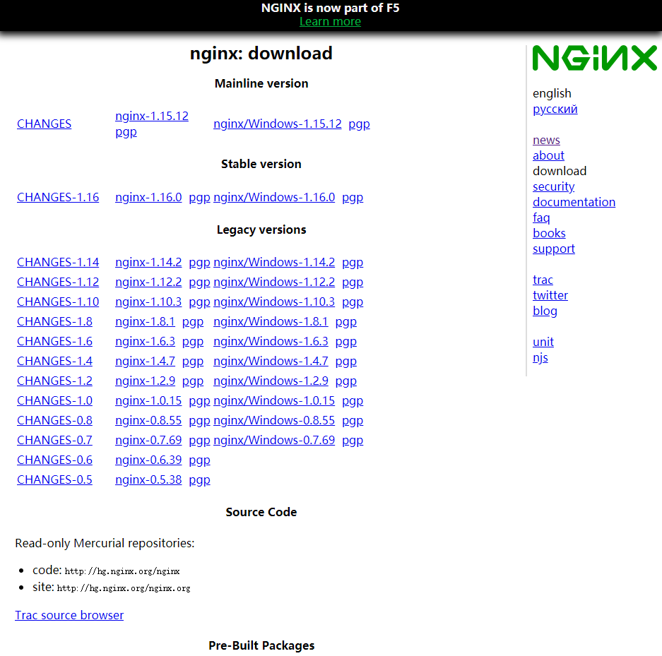

# 第2章 Nginx服务器的安装部署

在开始Nginx学习旅程之前，需要说明的是，本书着眼于Nginx服务器的实际应用，我们希望通过对Nginx服务器的系统介绍，能够在最短时间内尽可能向大家全面展示Nginx服务器常见的应用场景；也希望为在实际开展和Nginx服务器相关工作和学习的过程中遇到问题的人员提供指导和参考。

本章首先为大家介绍Nginx服务器的基本安装部署。我们将在本章学习到以下知识：

* 获取Nginx服务器安装文件的途径。
* Nginx服务器安装部署之前的装备工作。
* Windows平台下Nginx服务器的安装部署。
* Linux平台下Nginx服务器的编译和安装。
* 认识Nginx服务器的配置文件，以及如何进行基本配置。
* 初步学习通过优化Nginx配置，提高Nginx服务器的性能。
* 展示一个Nginx配置的完整实例。

## 2.1 如何获取Nginx服务器安装文件

Nginx服务器的软件版本包括Windows版和Linux版两种，在官方网站上可以找到对应版本的下载链接。下面详细介绍如何获取所需版本的Nginx服务器软件。

### 2.1.1 获取新版本的Nginx服务器

Nginx的官方下载网站为http://nginx.org/en/download.html。打开网站，下载部分的内容如图2.1所示。可以看到，网页上提供了Nginx服务器三种版本的下载，分别是开发版本（Development version）、稳定版（Stable version）和过期版本（Legacy versions）。三种本包的差异和选择在第1章中已经介绍过，这里不再赘述。本页提供下载的各类版本均为Nginx的较新版本。其中，开发版本同时也是Nginx全部版本中最新的版本。

下面分别介绍页面上下载部分各链接的具体含义：

“CHANGES-x.x”链接，记录的是对应版本的功能变更日志。包括新增功能、功能的优化和功能缺陷的修复等等。

紧接着“CHANGES-x.x”链接后面的“nginx-x.x.x”的链接，是Nginx服务器的Linux版本下载链接。右击链接，选择“另存为”命令或者选择下载专用工具就可以获取到Nginx服务器的Linux版本。得到的文件的后缀为tar.gz。

“pgp”链接，记录的是提供下载的版本使用PGP加密自由软件GnuPG计算后的签名。PGP可以解释为Pretty Good Privacy，是PGP公司的加密或签名工具套件。点击链接进入相关页面，可以查看GnuPG针对本下载版本的签名，以及执行本次计算的GnuPG软件版本号。这些数据可以用于下载文件的验证。

“nginx/Windows-x.x.x”链接，是Nginx服务器的Windows版本下载链接，下载方法和Linux版本相同。得到的文件的后缀名为.zip。



### 2.1.2 获取Nginx服务器的历史版本

在第1章中，我们了解到Nginx服务器包含众多的历史版本。Nginx官方网站没有显式提供下载历史版本的链接，但是如果由于特殊的需求需要获取Nginx服务器的历史版本，该怎么做呢？

笔者为大家介绍一个可以下载Nginx服务器全部历史版本的链接，即http://nginx.org/download。打开此网页，可以看到Nginx全部历史版本的列表，从nginx-0.1.0到nginx-1.3.5一应俱全，下载方式和上面介绍的新版本Nginx服务器软件下载方式相同。

仔细查看版本列表，可以发现以nginx-0.7.52为分界线，之前的低版本只提供后缀名为.tar.gz的Linux版本，从nginx-0.7.52开始同时提供后缀名为.zip的Windows版本，出现这种现象的原因我们在第1章回顾Nginx服务器发展历史时已经说明。从nginx-0.7.64开始，还提供了后缀名为.asc的文件，该文件记录了Linux版本PGP加密自由软件签名数据。

## 2.2 安装Nginx服务器和基本配置

上一节我们获取了自己需要的Nginx服务器版本。笔者使用的版本是2012年8月7日发布的稳定版本nginx-1.2.3，包括Windows版本和Linux版本。本书后文中涉及的Nginx服务器使用、Nginx服务器软件源代码分析均以此版本为基础。

本文主要指导大家在Windows平台和Linux平台上安装Nginx服务器软件。

### 2.2.1 Windows版本的安装

Windows版本的Nginx服务器安装方法与一般的Windows安装程序有所不同。

我们获取的Windows版本Nginx服务器安装文件为nginx-1.2.3.zip压缩文件。安装Windows版本的Nginx服务器不需要进行特殊的安装操作，使用解压工具解压此压缩文件后，得到如图2.2所示的文件资源，这就是nginx服务器运行的全部资源。


Windows版本的Nginx服务器在效率上比Linux版本要差一些，并且Nginx在实际使用中一般用在Linux/Unix系统中，本文以Nginx1.2.3版为学习重点进行说明。但为了方便后续的学习，我们还是有必要对解压出来的部分文件和目录做简单的介绍。

* **conf** 目录中存放的是Nginx服务器的配置文件，包含Nginx服务器的基本配置文件和对部分特性的配置文件。在本节的后文中，我们将重点介绍名为nginx.conf的配置文件如何使用了。正确配置此文件可以保证Nginx服务器的正常运行。其他配置文件将在后续相关章节中陆续提及。
* **docs** 目录中存放了Nginx服务器的文档资料，包含Nginx服务器的LICENSE、OpenSSL的LICENSE、PCRE的LICENCE以及zlib的LICENSE，还包括本版本Nginx服务器升级的版本变更说明，以及README文档。如果想了解Nginx服务器的具体细节，可以访问Nginx的官方网站http://www.nginx.org。另外，http://wiki.nginx.org/Main也是了解Nginx服务器相关信息的不错网站。
* **html** 目录中存放了两个后缀名为.html的静态页面文件。这两个文件与Nginx服务器的运行相关，在后面介绍Nginx启动时将介绍这两个文件，在此不再赘述。
* **logs** 目录中存放了Nginx服务器的运行日志文件。我们将在讲述Nginx服务器配置时介绍它的日志功能，那里会涉及本目录的使用，在此也不再赘述。
* **nginx.exe** 即为启动Nginx服务器的运行程序。如果conf目录下的nginx.conf文件配置正确，通过它即可完成nginx服务器的启动操作。

## 2.4 Nginx服务器基础配置指令

从上面的内容我们知道，默认的Nginx服务器配置文件都存放在安装目录conf中，主配置文件名为nginx.conf。这一节，我们学习nginx.conf的内容和基本配置方法。

以下代码清单是默认的nginx.conf文件中的完整内容。

**注意**

在nginx.conf原始文件中，还包括注释内容，注释标志为“#”，由于篇幅所限，代码清单中将所有的注释去除。笔者添加的注释说明了各条语句的生效范围，让大家对指令的作用域有一个初步的了解，后面章节我们会进一步讲解。

```
worker_processes 1;								#全局生效

events {
	worker_connections 1024; 					#在events部分中生效
}

http{
	include mime.types; 						#以下指令在http部分中生效
	default_type application/octet-stream;
	sendfile on;
	keepalive_timeout 65;
		server{ 								#以下指令在http的server部分中生效
			listen 80;
			server_name localhost;
			location / { 						#以下指令在http/server的location中生效
				root html;
				index index.html index.htm;
			}
			error_page 500 502 503 504 /50x.html
			location = /50x.html {
				root html;
			}
		}
}
```

初始的Nginx服务器主配置文件比较长，不过结构和内容还是比较清晰的，以下我们分小节对上面的内容进行详细介绍。

### 2.4.1 nginx.conf文件的结构

从上面的配置文件内容，我们可以归纳出nginx.conf文件的基本结构为：（“#”后边的内容是笔者添加的注释内容，它们的含义在后文中会给出）：

```json
...                                            #全局块
events                                         #events块
{
    ...
}
http                                           #http块
{
    ...                                        #http全局块
	server                                     #server块
	{
		...
		location [PATTERN]                     #location块
		{
			...
		}
		location [PATTERN]                     #location块
		{
			...
		}
	}
	server                                     #server块
	{
		...
	}
	...                                        #http全局块
}
```

最外层的花括号将内容整体分为两部分，再加上最开始的内容，即第一行省略号表示的，nginx.conf一共由三部分组成，分别为全局块、events块和http块。在http块中，又包含http全局块、多个server块。每个server块中，可以包含server全局块和多个location块。在同一配置块中嵌套的配置块，各个之间不存在次序关系。

配置文件支持大量可配置的指令，绝大多数指令不是特定属于某一个块的。同一个指令放在不同层级的块中，其作用域也不同，一般情况下，高一级块中的指令可以作用于自身所在的块和此块包含的所有低层级块。如果某个指令在两个不同层级的块中同时出现，则采用“就近原则”，即以较低层级块中的配置为准。比如，某指令同时出现在http全局块中和server块中，并且配置不同，则应该以server块中的配置为准。

在介绍可配置指令之前，我们先来看看各个块的作用。


**1. 全局块**

全局块是默认配置文件从开始到events块之间的一部分内容，主要设置一些影响Nginx服务器整体运行的配置指令，因此，这些指令的作用域是Nginx服务器全局。

通常包括配置运行Nginx服务器的用户（组）、允许生成的worker process数、Nginx进程PID存放路径、日志的存放路径和类型以及配置文件引入等。

**2. events块**

events块涉及的指令主要影响Nginx服务器与用户的网络连接。常用到的设置包括是否开启对多worker process下的网络连接进行序列化，是否允许同时接收多个网络连接，选取哪种事件驱动模型处理连接请求，每个worker process可以同时支持的最大连接数等。

这一部分的指令对Nginx服务器的性能影响较大，在实际配置中应该根据实际情况灵活调整。相关的详细分析我们在本书后面的相关章节会陆续学习。

**3. http块**

http块是Nginx服务器配置中的重要部分，代理、缓存和日志定义等绝大多数的功能和第三方模块的配置都可以放在这个模块中。

前面已经提到，http块中可以包含自己的全局块，也可以包含server块，server块中又可进一步包含location块，在本书中我们使用“http全局块”来表示http中自己的全局块，即http块中不包含在server块中的部分。

可以在http全局块中配置的指令包括文件引入、MIME-Type定义、日志自定义、是否使用sendfile传输文件、连接超时时间、单连接请求数上限等。

**4. server块**

server块和“虚拟主机”的概念有密切联系。为了加深对相关配置的理解，在介绍server块之前，我们简单了解一下虚拟主机的相关内容。

虚拟主机，又称虚拟服务器、主机空间或是网页空间，它是一种技术。该技术是为了节省互联网服务器硬件成本而出现的。这里的“主机”或“空间”是由实体的服务器延伸而来，硬件系统可以基于服务器群，或者单个服务器等。虚拟主机技术主要应用于HTTP、FTP及EMAIL等多项服务，将一台服务器的某项或者全部服务内容逻辑划分为多个服务单位，对外表现为多个服务器，从而充分利用服务器硬件资源。从用户角度来看，一台虚拟主机和一台独立的硬件主机是完全易用的。

在使用Nginx服务器提供Web服务时，利用虚拟主机的技术就可以避免为每一个要运行的完整提供单独的Nginx服务器，也无需为每个网站对应运行一组Nginx进程。虚拟主机技术使得Nginx服务器可以在同一台服务器上只运行一组Nginx进程，就可以运行多个网站。那么，如何对Nginx进行配置才能达到这种效果呢？本节介绍的server块就是用来完成这个功能的。

在前面提到过，每一个http块都可以包含多个server块，而每个server块就相当于一台虚拟主机，它内部可有多台主机联合提供服务，一起对外提供在逻辑上关系密切的一组服务（或网站）。我们先来学习server全局块中常见的指令及其配置。server全局块指令的作用域为本server块，其不会影响到其他的server块。

> **注意**
>
> 在http全局块中介绍过的部分指令可以在server块中和location块中使用，其作用域问题也已在前文中说明，后面就不再赘述。

和http相同，server块也可以包含自己的全局块，同时可以包含多个location块。在server全局块中，最常见的两个配置项是本虚拟主机的监听配置和本虚拟主机的名称或IP配置。

**5. location块**

每个server块中可以包含多个location块。从严格意义上说，location其实是server块的一个指令，只是由于其在整个Nginx配置文档中起着重要的作用，而且Nginx服务器在许多功能上的灵活性往往在location指令的配置中体现出来，因此笔者认为应该将其单独列为一个“块”，一方面引起读者的重视，另一方面通过专门的详细介绍突出其重要性，加深读者的理解。

这些location块的主要作用是，基于Nginx服务器接收到的请求字符串（例如，server_name/uri-string），对除虚拟主机名称（也可以是IP别名，后文有详细阐述）之外的字符串（前例中“/uri-string”部分）进行匹配，对特定的请求进行处理。地址定向、数据缓存和应答控制等功能都是在这部分实现。许多第三方模块的配置也是在location块中提供功能。

### 2.4.2 配置运行Nginx服务器用户（组）

用于配置运行Nginx服务器用户（组）的指令是user，其语法格式为：

```
user user [group]
```

* user，指定可以运行Nginx服务器的用户。
* group，可选项，指定可以运行Nginx服务器的用户组。

只有被设置的用户或者用户组成员才有权限启动Nginx进程，如果是其他用户（test_user）尝试启用Nginx进程，将会报错：

```
nginx: [emerg] getpwnam("test_user") failed (2: No such file or directory) in /Nginx/conf/nginx.conf:2
```

可以从错误信息中看到，Nginx无法运行的原因是查找test_user失败，引起错误的原因是nginx.conf的第二行内容，即配置Nginx服务器用户（组）的内容。

如果希望所有用户都可以启动Nginx进程，有两种办法：一是将此指令行注释掉：

```
#user [user] [group];
```

或者将用户（和用户组）设置为nobody：

```
user nobody nobody;
```

这也是user指令的默认设置。user指令只能在全局块中配置。

> **注意**
>
> 在Nginx配置文件中，每一条指令配置都必须以分号结束，请不要忘记。

### 2.4.3 配置允许生成的worker process数

worker process是Nginx服务器实现并发处理服务的关键所在。从理论上来说，worker process的值越大，可以支持的并发处理量也越多，但实际上它还要受到来自软件本身、操作系统本身资源和能力、硬件设备（如CPU和磁盘驱动器）等的制约。后面会用专门的章节来讨论Nginx服务器的高级配置。

配置允许生成的worker process数的指令是worker_processes，其语法格式为：

```
worker_processes number | auto;
```

* number，指定Nginx进程最多可以产生的worker process数。
* auto，设置此值，Nginx进程将自动检测。

在默认的配置文件中，number=1。启动Nginx服务器以后，使用以下命令可以看到Nginx服务器除了主进程master process ../sbin/nginx之外，还生成了一个worker process：

```
#ps ax | grep nginx
```

如果将number改为3，重新运行Nginx进程，再次使用以上命令，则可以看到此时的Nginx服务器除了主进程master process ../sbin/nginx之外，已经生成了三个worker process：

```
#ps ax | grep nginx
```

此指令只能在全局块中设置。

### 2.4.4 配置Nginx进程PID存放路径

Nginx进程作为系统的守护进程，我们需要在某文件助攻保存当前运行程序的主进程号。Nginx支持对它的存放路径进行自定义配置，指令是pid，其语法格式为：

```
pid file;
```

其中，file指定存放路径和文件名称

配置文件默认将此文件存放在Nginx安装目录logs下，名字为nginx.pid。path可以是绝对路径，也可以是以Nginx安装目录为根目录的相对路径。比如要把nginx.pid放置到Nginx安装目录sbin下，文件名为web_nginx，则可以使用以下配置

```
pid sbin/web_nginx
```

> **注意**
>
> 在指定[path]的时候，一定要包括文件名，如果只设置了路径，没有设置文件名，则会报以下错误：

```
nginx: [emerg] open() "/Nginx/logs/" failed (21: Is a directory)
```

此指令只能在全局块中进行配置。

### 2.4.5 配置错误日志的存放路径

在全局块、http块和server块中都可以对Nginx服务器的日志进行相关配置。这里首先介绍全局块下日志的存放配置，后两种情况的配置基本相同，只是作用域不同。使用的指令是error_log，其语法结构是：

```
error_log file | stderr [debug | info | notice | warn | error | crit | alert | emerg];
```

从语法结构可以看到，Nginx服务器的日志支持输出到某一固定的文件file或者输出到标准错误输出stderr；日志的级别是可选项，由低到高分为debug（需要在编译时使用--with-debug开启debug开关，常见2.2.2节）、info、notice、warn、error、crit、alert、emerg等。需要注意的是，设置某一级别后，比这一级别高的日志也会被记录。比如设置warn级别后，级别为warn以及error、crit、alert和emerg的日志都会被记录下来。

下面我们先看一个配置的实例，这也是Nginx默认的日志存放和级别设置：

```
error_log logs/error.log error;
```

> **注意**
>
> 指定的文件对于运行Nginx进程的用户具有写权限，否则在启动Nginx进程的时候会出现以下报错信息；
>
> ```
> nginx: [alert]: could not open error log file: open() "/Nginx/logs/error.log" failed(13: Permission denied)
> ```

### 2.4.6 配置文件的引用

在一些情况下，我们可能需要将其他的Nginx配置或者第三方模块的配置引入到当前的主配置文件中。Nginx提供了include指令来完成配置文件的引入，其语法结构为：

```
include file;
```

其中，file是要引入的配置文件，它支持相对路径。

> **注意**
>
> 新引用进来的文件同样要求运行Nginx进程的用户对其具有写权限，并且符合Nginx配置文件规定的相关语法和结构。

此指令可以放在配置文件的任意地方。

### 2.4.7 设置网络连接的序列化

在《UNIX网络编程》第1卷里提到过一个叫**Thundering herd problem**的问题，大致意思是，当某一时刻只有一个网络连接到来时，多个睡眠进程会被同时叫醒，但只有一个进程可获得连接。如果每次唤醒的进程数目太多，会影响一部分系统性能。在Nginx服务器的多进程下，就有可能出现这样的问题。

为了解决这样的问题，Nginx配置中包含了这样一条指令accept_mutex，当其设置为开启的时候，将会对多个Nginx进程接收连接进行序列化，防止多个进程对连接的争抢。其语法结构为：

```
accept_mutex on | off;
```

此指令默认为关闭（off）状态，即每个worker process一次只能接收一个新到达的网络连接。此指令只能在events块中进行配置。

### 2.4.8 设置是否允许同时接收多个网络连接

每个Nginx服务器的worker process都有能力同时接收多个新到达的网络连接，但是这需要在配置文件中进行设置，其指令为multi_accept，语法结构为：

```
multi_accept on | off;
```

此指令默认为关闭（off）状态，即每个worker process一次只能接收一个新到达的网络连接。此指令只能在events块中进行配置。

### 2.4.9 事件驱动模型的选择

Nginx服务器提供了多种事件驱动模型来处理网络消息。配置文件中为我们提供了相关的指令来强制Nginx服务器选择哪种事件驱动模型进行消息处理，指令为use，语法结构为：

```
use method;
```

其中，method可选择的内容有：select、poll、kqueue、epoll、rtsig、/dev/poll以及eventport，其中几种模型是比较常用的，我们在后面用专门的章节讨论Nginx服务器的事件驱动模型。

> **注意**
>
> 可以在编译时使用--with-select_module和--without-select_module设置是否强制编译select模块到Nginx内核；使用--with-poll_module和--without-poll_module设置是否强制编译poll模块到Nginx内核。

此指令只能在events块中进行配置。

### 2.4.10 配置最大连接数

指令worker_connections主要用来设置运行每一个worker process同时开启的最大连接数。其语法结构为：

```
worker_connections number;
```

此指令的默认设置为512。

> **注意**
>
> 这里的number不仅仅包括和前端用户建立的连接数，而是包括所有可能的连接数。另外，number值不能大于操作系统支持打开的最大文件句柄数量。该指令在后边讨论Nginx服务器高级配置时还会再次提到。

此指令只能在events块中进行配置。

### 2.4.11 定义MIME-Type

我们知道，在常用的浏览器助攻，可以显示的内容有HTML、XML、GIF及Flash等种类繁多的文本、媒体等资源，浏览器为区分这些资源，需要使用MIME Type。换言之，MIME Type是网络资源的媒体类型。Nginx服务器作为Web服务器，必须能够识别前端请求的资源类型。

在默认的Nginx配置文件中，我们看到在http全局块中有以下两行配置：

```
include mime.types;
default_type application/octet-stream;
```

第一行从外部引用了mime_types文件，我们来看一下它的内容片段：

```
# find / -name mime.types
# cat mime.types

types {
    text/html                                        html htm shtml;
    text/css                                         css;
    text/xml                                         xml;
    image/gif                                        gif;
    image/jpeg                                       jpeg jpg;
    application/javascript                           js;
    application/atom+xml                             atom;
    application/rss+xml                              rss;

    text/mathml                                      mml;
    text/plain                                       txt;
    text/vnd.sun.j2me.app-descriptor                 jad;
    text/vnd.wap.wml                                 wml;
    text/x-component                                 htc;

    image/png                                        png;
    image/svg+xml                                    svg svgz;
    image/tiff                                       tif tiff;
    image/vnd.wap.wbmp                               wbmp;
    image/webp                                       webp;
    image/x-icon                                     ico;
    image/x-jng                                      jng;
    image/x-ms-bmp                                   bmp;

    font/woff                                        woff;
    font/woff2                                       woff2;

    application/java-archive                         jar war ear;
    application/json                                 json;
    application/mac-binhex40                         hqx;
    application/msword                               doc;
    application/pdf                                  pdf;
    application/postscript                           ps eps ai;
    application/rtf                                  rtf;
    application/vnd.apple.mpegurl                    m3u8;
    application/vnd.google-earth.kml+xml             kml;
    application/vnd.google-earth.kmz                 kmz;
    application/vnd.ms-excel                         xls;
    application/vnd.ms-fontobject                    eot;
    application/vnd.ms-powerpoint                    ppt;
    application/vnd.oasis.opendocument.graphics      odg;
    application/vnd.oasis.opendocument.presentation  odp;
    application/vnd.oasis.opendocument.spreadsheet   ods;
    application/vnd.oasis.opendocument.text          odt;
    application/vnd.openxmlformats-officedocument.presentationml.presentation
                                                     pptx;
    application/vnd.openxmlformats-officedocument.spreadsheetml.sheet
                                                     xlsx;
    application/vnd.openxmlformats-officedocument.wordprocessingml.document
                                                     docx;
    application/vnd.wap.wmlc                         wmlc;
    application/x-7z-compressed                      7z;
    application/x-cocoa                              cco;
    application/x-java-archive-diff                  jardiff;
    application/x-java-jnlp-file                     jnlp;
    application/x-makeself                           run;
    application/x-perl                               pl pm;
    application/x-pilot                              prc pdb;
    application/x-rar-compressed                     rar;
    application/x-redhat-package-manager             rpm;
    application/x-sea                                sea;
    application/x-shockwave-flash                    swf;
    application/x-stuffit                            sit;
    application/x-tcl                                tcl tk;
    application/x-x509-ca-cert                       der pem crt;
    application/x-xpinstall                          xpi;
    application/xhtml+xml                            xhtml;
    application/xspf+xml                             xspf;
    application/zip                                  zip;

    application/octet-stream                         bin exe dll;
    application/octet-stream                         deb;
    application/octet-stream                         dmg;
    application/octet-stream                         iso img;
    application/octet-stream                         msi msp msm;

    audio/midi                                       mid midi kar;
    audio/mpeg                                       mp3;
    audio/ogg                                        ogg;
    audio/x-m4a                                      m4a;
    audio/x-realaudio                                ra;

    video/3gpp                                       3gpp 3gp;
    video/mp2t                                       ts;
    video/mp4                                        mp4;
    video/mpeg                                       mpeg mpg;
    video/quicktime                                  mov;
    video/webm                                       webm;
    video/x-flv                                      flv;
    video/x-m4v                                      m4v;
    video/x-mng                                      mng;
    video/x-ms-asf                                   asx asf;
    video/x-ms-wmv                                   wmv;
    video/x-msvideo                                  avi;
}
```

从mime_types文件的内容片段可以看到，其中定义了一个types结构，结构中包含了浏览器能够识别的MIME类型以及对应于相关类型的文件后缀名。由于mine_types文件是主配置文件应用的第三方文件，因此，types也是Nginx配置文件中的一个配置块，我们可以称之为types块，其用于定义MIME类型。MIME的知识不是本文的重点，不在这里详述，感兴趣的读者可以自行阅读相关书籍。

第二行中使用指令default_type配置了用于处理前端请求的MIME类型，其语法结构为：

```
default_type mime-type;
```

其中，mime-type为types块中定义的MIME-type，如果不加此指令，默认值为text/plain。此指令还可以在http块、server块或者location块中进行配置。

### 2.4.12 自定义服务日志

在全局块中，我们介绍过errer_log指令，其用于配置Nginx进程运行时的日志存放和级别，此处所指的日志与常规的不同，它是指记录Nginx服务器提供服务过程应答前端请求的日志，我们将其称为服务日志以示区分。

Nginx服务器支持对服务日志的格式、大小、输出等进行配置，需要使用两个指令，分别是access_log和log_format指令。

access_log指令的语法结构为：

```
access_log path[format [buffer=size]];
```

* path，配置服务日志的文件存放的路径和名称。
* format，可选项，自定义服务日志的格式字符串，也可以通过“格式串的名称”使用log_format指令定义好的格式。“格式串的名称”在log_format指令中定义。
* size，配置临时存放日志的内存缓存区大小。

此指令可以在http块、server块或者location块中进行配置。默认配置为：

```
access_log logs/access.log combined;
```

其中，combined为log_format指令默认定义的日志格式字符串的名称。

如果要取消记录服务日志的功能，则使用：

```
access_log off;
```

和access_log联合使用的另一个指令是log_format，它专门用于定义服务日志的格式，并且可以为格式字符串定义一个名字，以便access_log指令可以直接调用。其语法格式为：

```
log_format name string ...;
```

* name，格式字符串的名字，默认的名字为combined。
* string，服务日志的格式字符串。在定义过程中，可以使用Nginx配置预设的一些变量获取相关内容，变量的名称使用双引号括起来，string整体使用单引号括起来。在string中可以使用的变量请参见本书“附录A“的相关内容。

我们来看一个示例加深理解：

```
log_format exampleLog '$remote_addr - [$time_local] $request '
					'$status $body_bytes_sent $http_referer '
					'$http_user_agent';
```

这条配置定义了服务日志文件的名称为exampleLog。笔者对其测试的结果，输出了如下日志片段：

```

```

简单分析一下第二条日志，

* `$remote_addr`获取到用户机的IP地址为192.168.1.102，
* `$time_local`获取到本地时间，`$request`获取到请求GET /favicon.ico HTTP/1.1，
* `$status`获取到请求状态为404（找不到），
* `$body_bytes_sent`获取到请求体的大小为570B，
* `$http_referer`未获取到任何内容，
* `$http_user_agent`获取到用户使用Mozilla浏览器。

通过分析可以看到，在正常请情况下，对于绝大多数的内置变量，Nginx服务器都能够获取到相关内容，但也会出现空值的情况。

此指令只能在http块中进行配置。

### 2.4.13 配置允许sendfile方式传输文件

在Apache、lighttd等Web服务器配置中，都有和sendfile相关的配置，这里主要学习一下配置sendfile传输方式的相关指令sendfile和sendfile_max_chunk以及它们的语法结构：

```
sendfile on | off;
```

用于开启或者关闭使用sendfile()传输文件，默认值为off，可以在http块、server块或者location中进行配置。

```
sendfile_max_chunk size;
```

其中，size值如果大于0，Nginx进程的每个worker process每次调用sendfile()传输的数据量最大不能超过这个值；如果设置为0，则无限制。默认值为0。此指令可以在http块、server块或location块中配置。

下面是第二个指令的配置示例：

```
sendfile_max_chunk 128k;
```

### 2.4.14 配置连接超时时间

与用户建立会话连接后，Nginx服务器可以保持这些连接打开一段时间，指令keepalive_timeout就是用来设置此时间的，其语法结构是：

```
keepalive_timeout timeout [header_timeout];
```

* timeout，服务器端对连接的保持时间。默认值为75s。
* header_timeout，可选项，在应答报文头部的Keep-Alive域设置超时时间：“Keep-Alive:timeout=header_timeout”。报文中的这个指令可以被Mozilla或者Konqueror识别。

此指令还可以出现在server块和location块中，如下是一个配置示例：

```
keepalive_timeout 120s 100s;
```

其含义是，在服务器端保持连接的时间设置为120s，发给用户端的应答报文头部中Keep-Alive域的超时时间设置为100s。

此指令可以在http块、server块或location块中配置。

### 2.4.15 单连接请求数上限

Nginx服务器端和用户端建立会话连接后，用户端通过此连接发送请求。指令keepalive_requests用于限制用户通过某一连接向Nginx服务器发送请求的次数。其语法结构为：

```
keepalive_requests number;
```

此指令还可以出现在server块和location块中，默认设置为100。

### 2.4.16 配置网络监听

配置监听使用指令listen，其配置方法主要有三种，我们先分别介绍三种配置的语法结构，然后统一介绍涉及的相关变量和标识符。

第一种配置监听的IP地址，语法结构为：

```
listen address [:port] [deafult_server] [setfib=number] [backlog=number] [rcvbuf=size] [sndbuf=size] [deferred]
		[accept_filter=filter] [bind] [ssl];
```

第二种配置监听端口，其语法结构是：

```
listen port [default_server] [setfib=number] [backlog=number] [rcvbuf=size] [sndbuf=size] [accept_filter=filter]
		[deferred] [bind] [ipv6only=on|off] [ssl];
```

第三种配置UNIX Domain Socket（一种在原有Socket框架上发展起来的IPC机制，用于在单个主机上执行客户/服务器通信，这不是本书的重点，请读者自行参阅相关书籍），其语法结构为：

```
listen unix:path [default_server] [backlog=number] [rcvbuf=size] [sndbuf=size] [accept_filter=filter] [deferred]
		[bind] [ssl];
```

* address，IP地址，如果是IPv6的地址，需要使用中括号“[]”括起来，比如[fe80::1]等。
* port，端口号，如果只定义了IP地址没有定义端口号，就使用80端口。
* path，socket文件路径，如/var/run/nginx.sock等。
* default_server，标识符，将此虚拟主机设置为address:port的默认主机。

> **注意**
>
> 在Nginx-0.8.21之前的版本，使用的是default。

* setfib=number，Nginx-8.0.44中使用这个变量为监听socket关联路由表，目前只对FreeBSD起作用，不常用。
* backlog=number，设置监听函数listen()最多运行多少网络连接同时处于挂起状态，在FreeBSD中默认为-1，其他平台默认为511。
* rcvbuf=size，设置监听socket接收缓存区大小。
* sndbuf=size，设置监听socket发送缓存区大小。
* deferred，标识符，将accept()设置为Deferred模式。
* accept_filter=filter，设置监听端口对请求的过滤，被过滤的内容不能被接收和处理。本指令只在FreeBSD和NetBSD 5.0+平台下有效。filter可以设置为dataready或httpready，有关这两个值的细节已经超出本书的范围，感兴趣的读者可以参阅Nginx的官方文档。
* bind，标识符，使用独立的bind()处理此address:port；一般情况下，对于端口相同而IP地址不同的多个连接，Nginx服务器将只使用一个监听命令，并使用bind()处理端口相同的所有连接。
* ssl，标识符，设置会话连接使用SSL模式进行，此标识符和Nginx服务器提供的HTTPS服务有关。有关HTTPS服务的内容，我们将在后文介绍。

listen指令的使用看起来比较复杂，但其实在一般的使用过程中，相对来说比较简单，默认的设置为：

```
listen *:80 | *:8000;
```

即监听所有80端口和8000端口。下面给出一些示例来说明listen的用法：

```
listen 192.168.1.10:8000; #监听具体的IP和具体的端口上的连接
listen 192.168.1.10; #监听具体IP的所有端口上的连接
listen 8000; #监听具体端口上的所有IP连接，等同于listen *:8000;
listen 192.168.1.10 default_server backlog=1024;
										#设置192.168.1.10的连接请求默认由此虚拟主机处理，
										#并且允许最多1024网络连接同时处于挂起状态。
```

### 2.4.17 基于名称的虚拟主机配置

这里的“主机”，就是指此server块对外提供的虚拟主机。设置了主机的名称并设置好DNS，用户就可以使用这个名称向此虚拟主机发送请求了。配置主机名称的指令为server_name，其语法结构为：

```
server_name name ...;
```

对于name来说，可以只有一个名称，也可以由多个名称并列，之间用空格隔开。每个名字就是一个域名，由两段或三段组成，之间由点号“.”隔开。下面是一个简单的示例：

```
server_name myserver.com www.myserver.com;
```

在此例中，此虚拟主机的名称设置为myserver.com或www.myserver.com。Nginx服务器规定，第一个名称作为此虚拟主机的主要名称。

在name中可以使用通配符“*”，但通配符只能用在由三端字符串组成的名称的首段或尾段，或者由两段字符串组成的名称的尾段，如：

```
server_name *.myserver.com www.myserver.*;
```

在name中还可以使用正则表达式，并使用波浪号“~”作为正则表达式字符串的开始标记，如：

```
server_name ~^www\d+\.myserver\.com$;
```

在该例中，此虚拟主机的名称设置使用了正则表达式（使用“`~`”标记），正则表达式的含义是：以www开头（使用“^”标记），紧跟一个或多个`0~9`的数字（“\d+”的含义，其中，“\d”代表`0~9`的某一个数字，“+”代表之前的一个字符出现一次或者多次），再紧跟.myserver.co（由于“.“在正则表达式中有特殊含义，因此需要使用“\”进行转义），最后以m结束（由”$“标记）。

通过以上的解释，大家应该理解了此虚拟主机可以接受使用哪些域名的请求了。比如对通过www1.myserver.com访问Nginx服务器的请求就可以使用此主机处理，而通过www.myserver.com的就不可以。因为“www”字符串之后必须有一个或多个0~9的数字才能被正则表达式成功匹配。

关于正则表达式的相关内容，笔者在本书的“附录B”中进行了总结，方便读者查询。

> **注意**
>
> 从Nginx-0.7.40开始，name中的正则表达式支持字符串捕获功能，即可以将正则表达式匹配成功的名称中的一部分字符串拾取出来，放在固定的变量中供下文使用。拾取的表示为一对完整的小括号“()”且后面不紧跟其他的正则表达式，括号中的内容就是被拾取的内容。一个正则表达式中可以存在多对不嵌套的小括号，这些内容会从左到右依次存放在变量`$1`、`$2`、`$3`……中。下文使用时，直接使用这些变量即可。这些变量的有效区域不超出本server块。
>
> 为了理解正则表达式的捕获功能，大家看一个示例。虚拟主机的名称设置如下：
>
> ```
> server_name ~^www\.(.+)\.com$;
> ```
>
> 当请求通过www.myserver.com到达Nginx服务器端时，其将会被上面的正则表达式匹配成功，其中的”myserver“将会被捕获，并记录到`$1`中。在本server块的下文配置中，当需要“myserver”时就可以使用`$1`代替“myserver”了。

由于server_name指令支持使用通配符和正则表达式两种配置名称的方式，因此在包含多个虚拟主机的配置文件中，可能会出现一个名称被多个虚拟主机的server_name匹配成功。那么，来自这个名称的请求到底要交给哪个虚拟主机处理呢？Nginx服务器做出如下规定：

**a.** 对于匹配方式不同的，按照以下的优先级选择虚拟主机，排在前面的优先处理请求。

1. 准确匹配server_name
2. 通配符在开始时匹配server_name成功
3. 通配符在结尾时匹配server_name成功
4. 正则表达式匹配server_name成功

**b.** 在以上四种匹配方式中，如果server_name被处于同一优先级的匹配方式多次匹配成功，则首次匹配成功的虚拟主机处理请求。

### 2.4.18 基于IP的虚拟主机配置

Linux操作系统支持IP别名的添加。配置基于IP的虚拟主机，即为Nginx服务器提供的每台虚拟主机配置一个不同的IP，因此需要将网卡设置为同时能够监听多个IP地址。在Linux平台中可以是用ifconfig工具为同一块网卡添加多个IP别名。

笔者的Linux平台上当前的网络配置为：

```
enp0s3: flags=4163<UP,BROADCAST,RUNNING,MULTICAST>  mtu 1500
        inet 192.168.3.79  netmask 255.255.255.0  broadcast 192.168.3.255
        inet6 fe80::b85c:725a:3e88:adba  prefixlen 64  scopeid 0x20<link>
        ether 08:00:27:be:f7:da  txqueuelen 1000  (Ethernet)
        RX packets 44804  bytes 2715721 (2.5 MiB)
        RX errors 0  dropped 0  overruns 0  frame 0
        TX packets 472  bytes 84166 (82.1 KiB)
        TX errors 0  dropped 0 overruns 0  carrier 0  collisions 0

lo: flags=73<UP,LOOPBACK,RUNNING>  mtu 65536
        inet 127.0.0.1  netmask 255.0.0.0
        inet6 ::1  prefixlen 128  scopeid 0x10<host>
        loop  txqueuelen 1000  (Local Loopback)
        RX packets 0  bytes 0 (0.0 B)
        RX errors 0  dropped 0  overruns 0  frame 0
        TX packets 0  bytes 0 (0.0 B)
        TX errors 0  dropped 0 overruns 0  carrier 0  collisions 0
```

eth1为使用中的网卡，其IP值为192.168.1.3。现在笔者需要为eth1添加两个IP别名192.168.1.31和192.168.1.32，分别用于Nginx服务器提供的两个虚拟主机，需要执行以下操作：

```
enp0s3: flags=4163<UP,BROADCAST,RUNNING,MULTICAST>  mtu 1500
        inet 192.168.3.79  netmask 255.255.255.0  broadcast 192.168.3.255
        inet6 fe80::b85c:725a:3e88:adba  prefixlen 64  scopeid 0x20<link>
        ether 08:00:27:be:f7:da  txqueuelen 1000  (Ethernet)
        RX packets 45817  bytes 2788256 (2.6 MiB)
        RX errors 0  dropped 0  overruns 0  frame 0
        TX packets 612  bytes 107122 (104.6 KiB)
        TX errors 0  dropped 0 overruns 0  carrier 0  collisions 0

enp0s3:0: flags=4163<UP,BROADCAST,RUNNING,MULTICAST>  mtu 1500
        inet 192.168.3.31  netmask 255.255.255.0  broadcast 192.168.3.255
        ether 08:00:27:be:f7:da  txqueuelen 1000  (Ethernet)

enp0s3:1: flags=4163<UP,BROADCAST,RUNNING,MULTICAST>  mtu 1500
        inet 192.168.3.32  netmask 255.255.255.0  broadcast 192.168.3.255
        ether 08:00:27:be:f7:da  txqueuelen 1000  (Ethernet)

lo: flags=73<UP,LOOPBACK,RUNNING>  mtu 65536
        inet 127.0.0.1  netmask 255.0.0.0
        inet6 ::1  prefixlen 128  scopeid 0x10<host>
        loop  txqueuelen 1000  (Local Loopback)
        RX packets 0  bytes 0 (0.0 B)
        RX errors 0  dropped 0  overruns 0  frame 0
        TX packets 0  bytes 0 (0.0 B)
        TX errors 0  dropped 0 overruns 0  carrier 0  collisions 0
```

可以看到，eth1增加了两个别名，分别为eth1:0和eth1:1，IP也分别是我们希望得到的结果。

> **注意**
>
> 按照如上方法为eth1设置的别名在系统重启后将不予保存，需要重新设置。为了做到一劳永逸，我们可以将以上两条命令添加到Linux系统的启动脚本rc.local中。在笔者的系统中运行：
>
> ```
> # echo “ifoncfig eth1:0 192.168.1.31 netmask 255.255.255.0 up” >> /etc/rc.local
> # echo “ifoncfig eth1:1 192.168.1.32 netmask 255.255.255.0 up” >> /etc/rc.local
> ```

这样，在系统重启后，eth1的别名就自动设置好了。

为网卡设置好别名以后，就可以为Nginx服务器配置基于IP的虚拟主机了。使用指令和配置基于名称的虚拟主机的指令是相同的，即server_name，语法结构也相同。而且不需要考虑通配符或者正则表达式的问题。

笔者的Nginx配置文件中配置了两台基于IP的虚拟主机，相关的配置片段为：

```
……
http
{
	……
	server						#第一台虚拟主机
	{
		listen:80;
		server_name:192.168.1.31;
		……
	}
	server						#第二台虚拟主机
	{
		listen:80;
		server_name:192.168.1.32;
		……
	}
	……
}
```

经过以上的配置，来自192.168.1.31的前端请求将由第一台虚拟主机接收和处理，来自192.168.1.32的前端请求将由第二台虚拟主机接收和处理。

### 2.4.19 配置location块

在Nginx的官方文档中定义的location的语法结构为：

```
location [ = | ~ | ~* | ^~ ] uri { …… }
```

其中，uri变量是待匹配的请求字符串，可以是不含正则表达的字符串，如/myserver.php等；也可以是包含有正则表达式的字符串，如`\.php$`（表示以.php结尾的URL）等。为了下文叙述方便，我们约定，不含正则表达的uri称为”标准uri“，使用正则表达式的uri称为”正则uri“。

其中方括号里的部分，是可选项，用来改变请求字符串与uri的匹配方式。在介绍四种标识的含义之前，我们需要先了解不添加此选项时，Nginx服务器是如何在server块中搜索并使用location块的uri和请求字符串匹配的。

在不添加此选项时，Nginx服务器首先在server块的多个location块中搜索是否有标准uri和请求字符串匹配，如果有多个可以匹配，就记录匹配度最高的一个。然后，服务器再用location块中的正则uri和请求字符串匹配，当第一个正则uri匹配成功，结束搜索，并使用这个location块处理此请求；如果正则匹配全部失败，就使用刚才记录的匹配度最高的location块处理此请求。

了解了上面的内容，就可以解释可选项中各个标识的含义了：

* “=”，用于标准uri前，要求请求字符串与uri严格匹配。如果已经匹配成功，就停止继续向下搜索并立即处理此请求。
* “~”，用于表示uri包含正则表达式，并且区分大小写。
* “~*”，用于表示uri包含正则表达式，并且不区分大小写。

> **注意**
>
> 如果uri包含正则表达式，就必须要使用“`~`”或者“`~*`”标识。

* “^~”，用于标准uri前，要求Nginx服务器找到标识uri和请求字符串匹配度最高的location后，立即使用此location处理请求，而不再使用location块中的正则uri和请求字符串做匹配。

> **注意**
>
> 我们知道，在浏览器传送URI时对一部分字符进行URL编码，比如空格被编码为“%20”，问号被编码为“%3f”等。“`^~`”有一个特点是，它对uri中的这些符号将会进行编码处理。比如，如果location块收到的URI为“/html/%20/data”，则当Nginx服务器搜索到配置为“`^~/html//data`”的location时，可以匹配成功。

### 2.4.20 匹配请求的根目录

Web服务器收到网络请求之后，首先要在服务器端指定目录中寻找请求资源。在Nginx服务器中，指令root就是用来配置这个根目录的，其语法结构为：

```
root path;
```

其中，path为Nginx服务器接收到请求以后查找资源的根目录路径。path变量中可以包含Nginx服务器预设的大多数变量（请参见本书“附录A”的相关内容），只有`$document_root`和`$realpath_root`不可以使用。

此指令可以在http块、server块或者location块中配置。由于使用Nginx服务器多数情况下要配置多个location块对不同的请求分别作出处理，因此该指令通常在location块中进行设置。

这个指令的一个示例为：

```
location /data/
{
	root /locationtest1;
}
```

当location块接收到“/data/index.htm”的请求时，将在/locationtest1/data/目录下找到index.htm响应请求。

### 2.4.21 更改location的URI

在location块中，除了使用root指令指明请求处理根目录，还可以使用alias指令改变location接收到的URI的请求路径，其语法结构为：

```
alias path;
```

其中，path即为修改后的根路径。同样，此变量中也可以包含除了`$document_root`和`$realpath_root`之外的其他Nginx服务器预设变量。

这个指令的作用有点不好理解，我们来看一个示例：

```
location ~ ^/data/(.+\.(htm|htm))$
{
	alias /locationtest1/other/$1;
}
```

当此location块接收到“/data/index/htm”的请求时，匹配成功，之后根据alias指令的配置，Nginx服务器将到/locationtest/other目录下找到index.htm并响应请求。可以看到，通过alias指令的配置，根路径已经从/data更改为locationtest1/other了。

### 2.4.22 设置网站的默认首页

指令index用于设置网站的默认首页，它一般可以有两个作用：一是，用户在发出请求访问网站时，请求地址可以不写首页名称；二是，可以对一个请求，根据其请求内容而设置不同的首页。该指令的语法结构为：

```
index file …；
```

其中，file变量可以包含多个文件名，其间使用空格分隔，也可以包含其他变量。此变量默认为“index.html”。

看一个示例：

```
location ~ ^/data/(.+)/webb/ $
{
	index index.$1.html index.my1.html index.html;
}
```

当location块接收到“/data/locationtest/web”时，匹配成功，它首先将预置变量`$1`置为“locationtest“，然后在/data/locationtest/web/路径下按照index的配置次序依次寻找index.locationtest.html页、index.my1.html页和index.html页，首先找到哪个页面，就使用哪个页面响应请求。

### 2.4.23 设置网站的错误页面

如果用户端尝试查看网页时遇到问题，服务器会将HTTP错误从网站发送到Web服务器。如果无法显示网页，Web浏览器会显示网站发送的实际错误网页或Web浏览器内置的友好错误信息。Nginx服务器支持自定义错误网页的显示内容。可以通过这一功能在网站发生错误时为用户提供人性化的错误显示页面。

一般来说，HTTP 2XX代表请求正常完成，HTTP 3XX代表网站重定向，HTTP 4XX代表客户端出现错误，HTTP 5XX 代表服务器端出现错误。笔者在Microsoft的官方网站查找到一些常见HTTP错误的说明，整理在表2.3中，方便读者查询。

| HTTP信息                   | 代码          | 含义                                                         |
| -------------------------- | ------------- | ------------------------------------------------------------ |
| 已移动                     | HTTP 301      | 请求的数据具有新的位置，并且更改是永久的                     |
| 已找到                     | HTTP 302      | 请求的数据临时具有不同URI                                    |
| 请参阅其他                 | HTTP 303      | 可在另一URI下找到对请求的响应，并且应使用GET方法检索此响应   |
| 未修改                     | HTTP 304      | 未按预期修改文档                                             |
| 使用代理                   | HTTP 305      | 必须通过位置字段中提供的代理来访问请求的资源                 |
| 未使用                     | HTTP 306      | 不再使用，但保留此代码以便将来说明                           |
| 无法找到网页               | HTTP 400      | 可以连接到Web服务器，但是由于Web地址（URL）的问题，无法找到网页 |
| 网站拒绝显示此网页         | HTTP 403      | 可以连接到网站，但Internet Explorer没有显示网页的权限        |
| 无法找到网页               | HTTP 404      | 可以连接到网站，但找不到网页。导致此错误的原因有可能是该网页暂时不可用或网页已被删除 |
| 网站无法显示该页面         | HTTP 405      | 可以连接到网站，但网页内容无法下载到用户的计算机。这通常是由网页编写方式问题引起的。 |
| 无法读取此网页格式         | HTTP 406      | 能够从网站接收信息，但Internet Explorer不能识别其格式，因而无法正确地显示消息 |
| 该网站太忙，无法显示此网页 | HTTP 408或409 | 服务器显示该网页的时间太长，或对同一网页的请求太多           |
| 网页不复存在               | HTTP 410      | 可以连接到网站，但无法找到网页。与HTTP错误404不同，此错误时永久性的，而且由网站管理员打开 |
| 网站无法显示该页面         | HTTP 500      | 正在访问的网站出现了服务器问题，该问题阻止了此网页的显示。常见的原因是网站正在维护或使用脚本的交互式网站上的程序出错 |
| 未执行                     | HTTP 501      | 没有将正在访问的网站设置为显示浏览器所请求的内容             |
| 不支持的版本               | HTTP 505      | 该网站不支持浏览器用于请求网页的HTTP协议（最为常见的是HTTP/1.1） |

