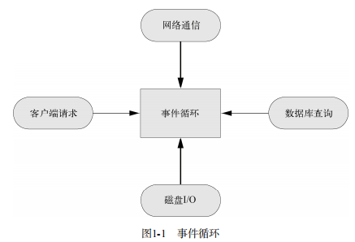
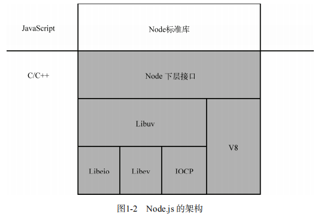
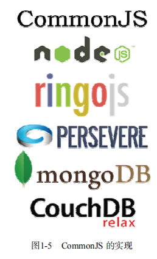

# 第1章 Node.js简介

Node.js，或者Node，是一个可以让JavaScript运行在服务器端的平台。它可以让JavaScript脱离浏览器的束缚运行在一般的服务器环境下，就像运行Python、Perl、PHP、Ruby程序一样。你可以用Node.js轻松地进行服务器端应用开发，Python、Perl、PHP、Ruby能做的事情Node.js几乎都能做，而且可以做的更好。

Node.js是一个为实时Web（Real-time Web）应用开发而诞生的平台，它从诞生之初就充分考虑了在实时响应、超大规模数据要求下架构的可扩展性。这使得它摒弃了传统平台依靠多线程来实现高并发的设计思路，而采用了单线程、异步式I/O、事件驱动式的程序设计模型。这些特性不仅带来了巨大的性能提升，还减少了多线程程序设计的复杂性，进而提高了开发效率。

Node.js最初是由Ryan Dahl发起的开源项目，后来被Joyent公司注意到。Joyent公司将Ryan Dahl招入旗下，因此现在的Node.js由Joyent公司管理并维护。尽管它诞生的时间（2009年）还不长，但它的周围已经形成了一个庞大的生态系统。Node.js有着强大而灵活的包管理器（node package manager，npm），目前已经有上万个第三方模块，其中有网站开发框架，有MySQL、PostgreSQL、MongoDB数据库接口，有模板语言解析、CSS生成工具、邮件、加密、图形、调试支持，甚至还有图形用户界面和操作系统API工具。由VMware公司建立的云计算平台Cloud Foundry率先支持了Node.js。2011年6月，微软宣布与Joyent公司合作，将Node.js移植到Windows，同时Windows Azure云计算平台也支持Node.js。Node.js目前还处在迅速发展阶段，相信在不久的未来它一定会成为流行的Web应用开发平台。让我们从现在开始，一同探索Node.js的美妙世界吧！

## 1.1 Node.js 是什么

Node.js不是一种独立的语言，与PHP、Python、Perl、Ruby的“既是语言也是平台”不同。Node.js也不是一个JavaScript框架，不同于CakePHP、Django、Rails。Node.js更不是浏览器端的库，不能与jQuery、ExtJS相提并论。Node.js是一个让JavaScript运行在服务端的开发平台，它让JavaScript成为脚本语言世界的一等公民，在服务端堪与PHP、Python、Perl、Ruby平起平坐。

Node.js是一个划时代的技术，它在原有的Web前端和后端技术的基础上总结并提炼出了许多新的概念和方法，堪称是十多年来Web开发经验的集大成者。Node.js可以作为服务器向用户提供服务，与PHP、Python、Ruby on Rails相比，它跳过了Apache、Nginx等HTTP服务器，直接面向前端开发。Node.js的许多设计理念与经典架构（如LAMP）有着很大的不同，可提供强大的伸缩能力，以适应21世纪10年代以后规模越来越庞大的互联网环境。

### Node.js 与 JavaScript

说起JavaScript，不得不让人想到浏览器。传统意义上，JavaScript是由ECMAScript、文档对象模型（DOM）和浏览器对象模型（BOM）组成的，而Mozilla则指出JavaScript由Core JavaScript和Client JavaScript组成。之所以会有这种分歧，是因为JavaScript和浏览器之间复杂的历史渊源，以及其命途多舛的发展历程所共同造成的，我们会在后面详述。我们可以认为，Node.js中所谓的JavaScript只是Core JavaScript，或者说是一个ECMAScript的一个实现，不包含DOM、BOM或者Client JavaScript。这是因为Node.js不运行在浏览器中，所以不需要使用浏览器中的许多特性。

Node.js是一个让JavaScript运行在浏览器之外的平台。它实现了诸如文件系统、模块、包、操作系统API、网络通信等Core JavaScript没有或者不完善的功能。历史上将JavaScript移植到浏览器外的计划不止一个，但Node.js是最出色的一个。随着Node.js的成功，各种浏览器外的JavaScript实现逐步兴起，因此产生了CommonJS规范。CommonJS试图拟定一套完整的JavaScript规范，以弥补普通应用程序所需的API，譬如文件系统访问、命令行、模块管理、函数库集成等功能。CommonJS制定者希望众多服务端JavaScript实现遵循CommonJS规范，以便相互兼容和代码复用。Node.js的部分实现遵循了CommonJS规范，但由于两者还都处于诞生之初的快速变化期，也会有不一致的地方。

Node.js 的JavaScript引擎是V8，来自Google Chrome项目。V8号称是目前世界上最快的JavaScript引擎，经历了数次引擎革命，它的JIT（Just-in-time Compilation，即时编译）执行速度已经快到了接近本地代码的执行速度。Node.js不运行在浏览器中，所以也就不存在JavaScript的浏览器兼容性问题，你可以放心地使用JavaScript语言的所有特性。

## 1.2 Node.js 能做什么

正如JavaScript为客户端而生，Node.js为网络而生。Node.js能做的远不止开发一个网站那么简单，使用Node.js，你可以轻松地开发：

* 具有复杂逻辑的网站；
* 基于社交网络的大规模Web应用；
* Web Socket服务器；
* TCP/UDP套接字应用程序；
* 命令行工具；
* 交互终端程序；
* 带有图形用户界面的本地应用程序；
* 单元测试工具；
* 客户端JavaScript编译器；

Node.js内建了HTTP服务器支持，也就是说你可以轻而易举地实现一个网站和服务器的组合。这和PHP、Perl不一样，因为在使用PHP的时候，必须先搭建一个Apache之类的HTTP服务器，然后通过HTTP服务器的模块加载或者CGI调用，才能将PHP脚本的执行结果呈现给用户。而当你使用Node.js时，不用额外搭建一个HTTP服务器，因为Node.js本身就内建了一个。这个服务器不仅可以用来调试代码，而且它本身就可以部署到产品环境，它的性能足以满足要求。

Node.js还可以部署到非网络应用的环境下，比如一个命令行工具。Node.js还可以调用C/C++的代码，这样可以充分利用已有的诸多函数库，也可以将对性能要求非常高的部分用C/C++来实现。

## 1.3 异步式I/O与事件驱动

Node.js最大的特点就是采用异步式I/O与事件驱动的架构设计。对于高并发的解决方案，传统的架构的多线程模型，也就是为每个业务逻辑提供一个系统线程，通过系统线程切换来弥补同步式I/O调用时的时间开销。Node.js使用的是单线程模型，对于所有I/O都采用异步式的请求方式，避免了频繁的上下文切换。Node.js在执行的过程中会维护一个事件队列，程序在执行时进入事件循环等待下一个事件到来，每个异步式I/O请求完成后会被推送到事件队列，等待程序进程进行处理。

例如，对于简单而常见的数据库查询操作，按照传统方式实现的代码如下：

```javascript
res = db.query('SELECT * from some_table');
res.output();
```

以上代码在执行到第一行的时候，线程会阻塞，等待数据库返回查询结果，然后再继续处理。然而，由于数据库查询可能涉及磁盘读写和网络通信，其延时可能相当大（长达几个到几百毫秒，相比CPU的时钟差了好几个数量级），线程会在这里阻塞等待结果返回。对于高并发的访问，一方面线程长期阻塞等待，另一方面为了应付新请求而不断增加线程，因此会浪费大量系统资源，同时线程的增加也会占用大量的CPU时间来处理内存上下文切换，而且还容易遭受低速连接攻击。

看看Node.js是如何解决这个问题的：

```javascript
db.query('SELECT * from some_table',function(res){
    res.output();
});
```

这段代码中db.query的第二个参数是一个函数，我们成为`回调函数`。进程在执行到db.query的时候，不会等待结果返回，而是直接继续执行后面的语句，直到进入事件循环。当数据库查询结果返回时，会将事件发送到事件队列，等到线程进入事件循环以后，才会调用之前的回调函数继续执行后面的逻辑。

Node.js的异步机制是基于事件的，所有的磁盘I/O、网络通信、数据库查询都以非阻塞的方式请求，返回的结果由事件循环来处理。图1-1描述了这个机制。Node.js进程在同一时刻只会处理一个事件，完成后立即进入事件循环检查并处理后面的事件。这样做的好处是，CPU和内存在同一时间集中处理一件事，同时尽可能让耗时的I/O操作并行执行。对于低速连接攻击，Node.js只是在事件队列中增加请求，等待操作系统的回应，因而不会有任何多线程开销，很大程度上可以提高Web应用的健壮性，防止恶意攻击。



这种异步事件模式的弊端也是显而易见的，因为它不符合开发者的常规线性思想，往往需要把一个完整的逻辑拆分为一个个事件，增加了开发和调试的难度。针对这个问题，Node.js第三方模块提出了很多解决方案，我们会在第6章中详细讨论。

## 1.4 Node.js的性能

 ### 1.4.1 Node.js架构简介

Node.js用异步式I/O和事件驱动代替多线程，带来了客观的性能提升。Node.js除了使用V8作为JavaScript引擎以外，还使用了高效的libev和libeio库支持事件驱动和异步式I/O。图1-2是Node.js架构的示意图。

Node.js的开发者在libev和libeio的基础上还抽象出了层libuv。对于POSIX操作系统，libuv通过封装libev和libeio来利用epoll或kqueue。而在Windows下，libuv使用了Windows的IOCP（Input/Output Completion Port，输入输出完成端口）机制，以在不同平台下实现同样的高性能。

 

### 1.4.2 Node.js与PHP+Nginx

Snoopyxd详细对比了Node.js与PHP+Nginx组合，结果显示在3000并发连接、30秒的测试下，输出“hello world”请求：

* PHP每秒响应请求数为3624，平均每个请求响应时间为0.39秒；
* Node.js每秒响应请求数为7677，平均每个请求响应时间为0.13秒。

而同样的测试，对MySQL查询操作：

* PHP每秒响应请求数为1293，平均每个请求响应时间为0.82秒；
* Node.js每秒响应请求数为2999，平均每个请求响应时间为0.33秒。

关于Node.js的性能优化及生产部署，我们会在第6章详细讨论。

## 1.5 JavaScript简史

……

## 1.6 CommonJS

### 1.6.1 服务端JavaScript的重生

Node.js并不是第一个尝试使JavaScript运行在浏览器之外的项目。追根溯源，在JavaScript诞生之初，网景公司就实现了服务端的JavaScript，但由于需要支付一大笔授权费用才能使用，服务端JavaScript在当年并没有像客户端JavaScript一样流行开来。真正使大多数人见识到JavaScript在服务器开发威力的，是微软的ASP。

……

### 1.6.2 CommonJS规范与实现

正如当年为了统一JavaScript语言标准，人们制定了ECMAScript规范一样，如今为了统一JavaScript在浏览器之外的实现，CommonJS诞生了。CommonJS试图定义一套普通应用程序使用的API，从而添补JavaScript标准库过于简单的不足。CommonJS的终极目标是制定一个像C++标准库一样的规范，使得基于CommonJS API的应用程序可以在不同的环境下运行，就像用C++编写的应用程序可以使用不同的编译器和运行时函数库一样。为了保持中立，CommonJS不参与标准库实现，其实现交给像Node.js之类的项目来完成。图1-5是CommonJS的各种实现。



CommonJS规范包括了模块（modules）、包（packages）、系统（system）、二进制（binary）、控制台（console）、编码（encodings）、文件系统（filesystems）、套接字（sockets）、单元测试（unit testing）等部分。目前大部分标准都在拟定和讨论之中，已经发布的标准有Modules/1.0、Modules/1.1、Modules/1.1.1、Packages/1.0、System/1.0。

Node.js是目前CommonJS规范最热门的一个实现，它基于CommonJS的Modeles/1.0规范实现了Node.js的模块，同时随着CommonJS规范的更新，Node.js也在不断跟进。由于目前CommonJS大部分规范还在起草结点，Node.js已经率先实现了一些功能，并将其反馈给CommonJS规范制定组织，但Node.js并不完全遵循CommonJS规范。这是所有规范制定者都会遇到的尴尬局面，因为规范的制定总是滞后于技术的发展。

## 1.7 参考资料

……