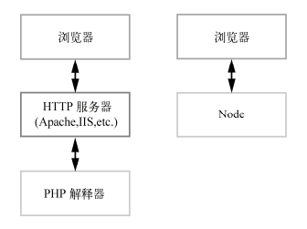
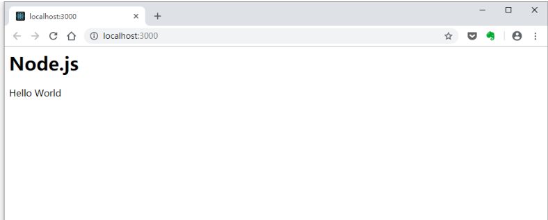
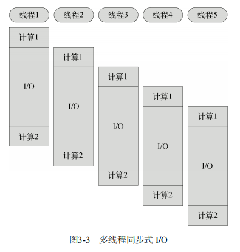
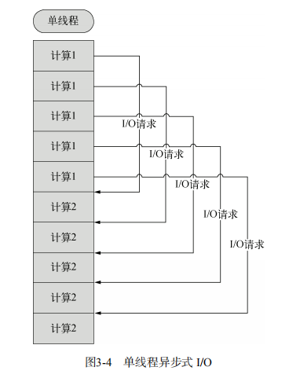
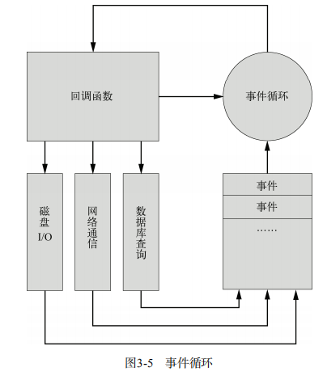
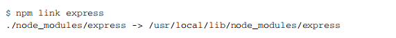
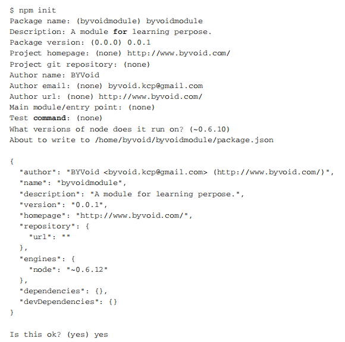

# 第3章 Node.js快速入门

Node.js是一个方兴未艾的技术。一直以来，关于Node.js的宣传往往针对它“与众不同”的特性，这使得它显得格外扑朔迷离。事实上，Node.js的绝大部分特性跟大多数语言一样都是旧瓶装新酒，只是一些激进的特性使它显得很神秘。在这一章中，我们将会讲述Node.js的种种特性，让你对Node.js本身以及如何使用Node.js编程有一个全局性了解，主要内容有：

* 编写第一个Node.js程序；
* 异步式I/O和事件循环；
* 模块和包；
* 调试；

让我们开始这个激动人心的旅程吧。

<!--more-->

## 3.1 开始用Node.js编程

Node.js 具有深厚的开源血统，它诞生于托管了许多优秀开源项目的网站——GitHub。和大多数开源软件一样。它由一个黑客发起，然后吸引了一小拨爱好者参与贡献代码。一开始它默默无闻，靠口口相传扩散，直到某一天被一个黑客媒体曝光，进入业界视野，随后便有一些有远见的公司提供商业支持，使其逐步发展壮大。

用Node.js编程是一件令人愉快的事情，因为你将开始用黑客的思维和风格编写代码。你会发现像这样的语言很容易入门，可以快速了解到它的细节，然后掌握它。

### 3.1.1 Hello World

好了，让我们开始实现第一个Node.js程序吧。打开你常用的文本编辑器，在其中输入：

```javascript
console.log('Hello World');
```

将文件保存为helloworld.js，打开终端，进入helloworld.js所在的目录，执行以下命令：

```bash
node helloworld.js
```

如果一切正常，你将会在终端中看到输出Hello World。很简单吧？下面让我们来解释一下这个程序的细节。console是Node.js提供的控制台对象，其中包含了向标准输出写入的操作，如console.log、console.error等。console.log是我们最常用的输出指令，它和C语言中的printf的功能类似，也可以接受多个参数。

……

### 3.1.2 Node.js命令行工具

……

### 3.1.3 建立HTTP服务器

前面的Hello World程序对于你来说可能太简单了，因为这个例子几乎可以在任何语言的教科书上找到对应的内容，既无聊又乏味，让我们来点儿不一样的东西，真正感受一下Node.js的魅力所在吧。

Node.js是为网络而诞生的平台，但又与ASP、PHP有很大的不同，究竟不同在哪里呢？如果你有PHP开发经验，会知道在成功运行PHP之前想要配置一个功能强大而复杂的HTTP服务器，譬如Apache、IIS或Nginx，还需要将PHP配置为HTTP服务器的模块，或者使用FastCGI协议调用PHP解释器。这种架构是“浏览器-HTTP服务器-PHP解释器”的组织方式，而Node.js采用了一种不同的方式，如图3-1所示。



我们看到，Node.js将“HTTP服务器”这一层抽离，直接面向刘浏览器用户。这种架构从某种意义上来说是颠覆性的，因而会让人心存疑虑：Node.js作为HTTP服务器的效率足够吗？会不会提高耦合程度？我们不打算在这里讨论这种架构的利弊，后面章节会继续说明。

好了，回归正题，让我们创建一个HTTP服务器吧。建立一个名为app.js的文件，内容为：

```js
// app.js

let http = require('http');

http.createServer(function (req, res) {
    res.writeHead(200, {
        'Content-Type': 'text/html'
    });
    res.write('<h1>Node.js</h1>');
    res.end('<p>Hello World</p>');
}).listen(3000);

console.log('HTTP server is listening at port 3000. http://localhost:3000/');
```

接下来运行`node app.js`命令，打开浏览器访问`http://localhost:3000/`即可看到图3-2所示的内容。



用Node.js实现的最简单的HTTP服务器就这样诞生了。这个程序调用了Node.js提供的http模块，对所有HTTP请求答复同样的内容并监听3000端口。在终端中运行这个脚本时，我们会发现它并不像Hello World一样结束后立即退出，而是一直等待，直到按下`Ctrl+C`才会结束。这是因为`listen`函数中创建了事件监听器，使得Node.js进程不会退出事件循环。我们会在后面的章节中详细介绍这其中的奥秘。

……

## 3.2 异步式I/O与事件式编程

Node.js最大的特点就是异步式I/O（或者非阻塞I/O）与事件紧密结合的编程模式。这种模式与传统的同步式I/O线性的编程思路有很大的不同，因为控制流很大程度上要靠事件和回调函数来组织，一个逻辑要拆分为若干个单元。

### 3.2.1 阻塞与线程

什么是阻塞（block）呢？线程在操作中如果遇到磁盘读写或网络通信（统称为I/O操作），通常要耗费较长的时间，这时操作系统会剥夺这个线程的CPU控制权，使其暂停执行，同时将资源让给其他的工作线程，这种线程调度方式称为阻塞。当I/O操作完毕时，操作系统将这个线程的阻塞状态解除，恢复其对CPU的控制权，令其继续执行。这种I/O模式就是通常的同步式I/O（Synchronous I/O）或阻塞式I/O（Blocking I/O）。

相应地，异步式I/O（Asynchronous I/O）或非阻塞式I/O（Non-blocking I/O）则针对所有I/O操作不采用阻塞的策略。当线程遇到I/O操作时，不会以阻塞的方式等待I/O操作的完成或数据的返回，而只是将I/O请求发送给操作系统，继续执行下一条语句。当操作系统完成I/O操作时，以事件的形式通知执行I/O操作的线程，线程会在特定时候处理这个事件。为了处理异步I/O，线程必须有事件循环，不断地检查有没有未处理的事件，依次予以处理。

阻塞模式下，一个线程只能处理一项任务，要想提高吞吐量必须通过多线程。而非阻塞模式下，一个线程永远在执行计算操作，这个线程所使用的CPU核心利用率永远是100%，I/O以事件的方式通知。在阻塞模式下，多线程往往能提高系统吞吐量，因为一个线程阻塞时还有其他线程在工作，多线程可以让CPU资源不被阻塞中的线程浪费。而在非阻塞模式下，线程不会被I/O阻塞，永远在利用CPU。多线程带来的好处仅仅是在多核CPU的情况下利用更多的核，而Node.js的单线程也能带来同样的好处。这就是为什么Node.js使用了单线程、非阻塞的事件编程模式。

图3-3和图3-4分别是多线程同步式I/O与单线程异步式I/O的示例。假设我们有一项工作，可以分为两个计算部分和一个I/O部分，I/O部分占的时间比计算多得多（通常都是这样）。如果我们使用阻塞I/O，那么要想获得高并发就必须开启多个线程。而使用异步式I/O时，单线程即可胜任。





单线程事件驱动的异步式I/O比传统的多线程阻塞式I/O究竟好在哪里呢？简而言之，异步式I/O就是少了多线程的开销。对操作系统来说，创建一个线程的代价是十分昂贵的，需要给它分配内存、列入调度，同时在线程切换的时候还要执行内存换页，CPU的缓存被清空，切换回来的时候还要重新从内存中读取信息，破坏了数据的局限性。

当然，异步式编程的缺点在于不符合人们一般的程序设计思维，容易让控制流变得晦涩难懂，给编码和调试都带来不小的困难。习惯传统编程模式的开发者在刚刚接触到大规模的异步式应用时往往会无所适从，但慢慢习惯以后会好很多。尽管如此，异步式编程还是较为困难，不过可喜的是现在已经有了不少专门解决异步式编程问题的库（如async），参见6.2.2节。

表3-1比较了同步式I/O和异步式I/O的特点。

|         同步式I/O（阻塞式）         | 异步式I/O（非阻塞式）     |
| :---------------------------------: | ------------------------- |
|        利用多线程提供吞吐量         | 单线程即可实现高吞吐量    |
| 通过事件片分隔和线程调度利用多核CPU | 通过功能划分利用多核CPU   |
| 需要由操作系统调度多线程使用多核CPU | 可以将单进程绑定到单核CPU |
|         难以充分利用CPU资源         | 可以充分利用CPU资源       |
|      内存轨迹大，数据局部性弱       | 内存轨迹小，数据局部性强  |
|         符合线性的编程思维          | 不符合传统编程思维        |

### 3.2.2 回调函数

让我们看看在Node.js中如何用异步的方式读取一个文件，下面是一个例子：

```js
// readfile.js

let fs = require('fs');
fs.readFile('file.txt', 'utf-8', function (err, data) {
    if (err) {
        console.error(err);
    } else {
        console.log(data);
    }
});
console.log('end.');
```

运行的结果如下：

```bash
end.
Contents of the file.
```

Node.js也提供了同步读取文件的API：

```js
// readfilesync.js
let fs = require('fs');
let data = fs.readFileSync('file.txt', 'utf-8');
console.log(data);
console.log('end.');
```

运行的结果与前面不同，如下所示：

```bash
Contents of the file.
end.
```

同步式读取文件的方式比较容易理解，将文件名作为参数传入fs.readFileSync函数，阻塞等待读取完成后，将文件的内容作为函数的返回值赋给data变量，接下来控制台输出data的值，最后输出`end.`。

异步式读取文件就稍微有些违反直觉了，end.先被输出。要想理解结果，我们必须先知道在Node.js中，异步式I/O是通过回调函数来实现的。fs.readFile接收了三个参数，第一个是文件名，第二个是编码方式，第三个是一个函数，我们成这个函数为回调函数。JavaScript支持匿名的函数定义方式，譬如我们例子中回调函数的定义就是嵌套在fs.readFile的参数表中的。这种定义方式在JavaScript程序中极为普遍，与下面这种定义方式实现的功能是一致的：

```js
// readfilecallback.js

function readFileCallBack(err, data) {
    if (err) {
        console.log(err);
    } else {
        console.log(data);
    }
}

let fs = require('fs');
fs.readFile('file.txt', 'utf-8', readFileCallBack);
console.log('end.');
```

fs.readFile调用时所做的工作只是将异步式I/O请求发送给了操作系统，然后立即返回并执行后面的语句，执行完以后进入事件循环监听事件。当fs接收到I/O请求完成的事件时，事件循环会主动调用回调函数以完成后续工作。因此我们会先看到end.，再看到file.txt文件的内容。

### 3.2.3 事件

Node.js所有的异步I/O操作在完成时都会发送一个事件到事件队列。在开发者看来，事件由EvenEmitter对象提供。前面提到的fs.readFile和http.createServer的回调函数都是通过EventEmitter来实现的。下面我们用一个简单的例子说明EventEmitter的用法：

```js
// event.js

let EventEmitter = require('events').EventEmitter;
let event = new EventEmitter;

event.on('some_event', function () {
    console.log('some_event occured.');
});

setTimeout(function () {
    event.emit('some_event');
}, 1000);
```

运行这段代码，1秒后控制台输出了some_event occured.。其原理是event对象注册了事件some_event的一个监听器，然后我们通过setTimeout在1000毫秒以后向event对象发送事件some_event，此时会调用some_event的监听器。

我们将在4.3.1节中详细讨论EventEmitter对象的用法。

**Node.js的事件循环机制**

Node.js在什么时候会进入事件循环呢？答案是Node.js程序由事件循环开始，到事件循环结束，所有的逻辑都是事件的回调函数，所以Node.js始终在事件循环中，程序入口就是事件循环第一个事件的回调函数。事件的回调函数在执行的过程中，可能会发出I/O请求或直接发射（emit）事件，执行完毕后再返回事件循环，事件循环会检查事件队列中有没有未处理的事件，直到程序结束。图3-5说明了事件循环的原理。

与其他语言不同的是，Node.js没有显式的事件循环，类似Ruby的EventMachine::run()的函数在Node.js中是不存在的。Node.js的事件循环对开发者不可见，由libev库实现。libev支持多种类型的事件，如ev_io、ev_timer、ev_signal、ev_idle等，在Node.js中均被EventEmitter封装。libev事件循环的每一次迭代，在Node.js中就是一次Tick，libev不断检查是否有活动的、可供检测的事件监听器，直到检测不到时才退出事件循环，进程结束。



## 3.3 模块和包

模块（Module）和包（Package）是Node.js最重要的支柱。开发一个具有一定规模的程序不可能只用一个文件，通常需要把各个功能拆分、封装，然后组合起来，模块正是为了实现这种方式而诞生的。在浏览器JavaScript中，脚本模块的拆分和组合通常使用HTML的script标签来实现。Node.js提供了require函数来调用其他模块，而且模块都是基于文件的，机制十分简单。

Node.js的模块和包机制的实现参照了CommonJS的标准，但并未完全遵循。不过两者的区别并不大，一般来说你大可不必担心，只有当你试图制作一个除了支持Node.js之外还要支持其他平台的模块或包的时候才需要仔细研究。通常，两者没有直接冲突的地方。

我们经常把Node.js的模块和包相提并论，因为模块和包是没有本质区别的，两个概念也时常混用。如果要辨析，那么可以把包理解成是实现了某个功能模块的集合，用于发布和维护。对使用者来说，模块和包的区别是透明的，因此经常不作区分。本节中我们会详细介绍：

* 什么是模块；
* 如何创建并加载模块；
* 如何创建一个包；
* 如何使用包管理器；

### 3.3.1 什么是模块

模块是Node.js应用程序的基本组成部分，文件和模块是一一对应的。换言之，一个Node.js文件就是一个模块，这个文件可能是JavaScript代码、JSON或者编译过的C/C++扩展。

在前面章节的例子中，我们曾经用到了`var http = require(‘http’)`，其中http是Node.js的一个核心模块，其内部是用C++实现的，外部用JavaScript封装。我们通过require函数获取了这个模块，然后才能使用其中的对象。

### 3.3.2 创建及加载模块

介绍了什么是模块之后，下面我们来看看如何创建并加载它们。

**1. 创建模块**

在Node.js中，创建一个模块非常简单，因为一个文件就是一个模块，我们要关注的问题仅仅在于如何在其他文件中获取这个模块。Node.js提供了exports和require两个对象，其中exports是模块公开的接口，require用于从外部获取一个模块的接口，即所获取模块的exports对象。

让我们以一个例子来了解模块。创建一个module.js的文件，内容是：

```js
// module.js

let name;

exports.setName = function (thyName) {
    name = thyName;
};

exports.sayHello = function () {
    console.log('Hello ' + name);
};
```

在同一目录下创建getmodule.js，内容是：

```js
// getmodules.js

const myModule = require('./module');

myModule.setName('BYVoid');
myModule.sayHello();
```

运行node getmodule.js，结果是：

```js
Hello BYVoid
```

在以上示例中，module.js通过exports对象把setName和sayHello作为模块的访问接口，在getmodule.js中通过require(‘./module’)；加载这个模块，然后就可以直接访问module.js中exports对象的成员函数了。

这种接口封装方式比许多语言要简洁得多，同时也不失优雅，未引入违反语义的特性，符合传统的编程逻辑。在这个基础上，我们可以构建大型的应用程序，npm提供的上万个模块都是通过这种简单的方式搭建起来的。

**2. 单次加载**

上面这个例子有点类似于创建一个对象，但实际上和对象又有本质的区别，因为require不会重复加载模块，也就是说无论调用多少次require，获得的模块都是同一个。我们在getmodule.js的基础上稍作修改：

```js
// loadmodule.js

const hello1 = require('./module');
hello1.setName('BYVoid');

const hello2 = require('./module');
hello2.setName('BYVoid 2');

hello1.sayHello();
```

运行后发现输出结果是Hello BYVoid 2，这是因为变量hello1和hello2指向的是同一个实例，因此hello1.setName的结果被hello2.setName覆盖，最终输出结果是由后者决定的。

**3. 覆盖exports**

有时候我们只是想把一个对象封装到模块中，例如：

```js
// singleobject.js

function Hello() {
    let name;

    this.setName = function (thyName) {
        name = thyName;
    };

    this.sayHello = function () {
        console.log('Hello ' + name);
    };
};

exports.Hello = Hello;
```

此时我们在其他文件需要通过require(‘./singleobject’).Hello来获取Hello对象，这略显冗余，可以用下面方法稍微简化：

```js
// hello.js

function Hello() {
    let name;

    this.setName = function (thyName) {
        name = thyName;
    };

    this.sayHello = function () {
        console.log('Hello ' + name);
    };
};

module.exports = Hello;
```

这样就可以直接获得这个对象了：

```js
// gethello.js

let Hello = require('./hello');

let hello = new Hello;
hello.setName('BYVoid');
hello.sayHello();
```

注意，模块接口的唯一变化是使用module.exports = Hello代替了exports.Hello=Hello。在外部引用该模块时，其接口对象就是要输出的Hello对象本身，而不是原先的exports。

事实上，exports本身仅仅是一个普通的空对象，即{ }，它专门用来声明接口，本质上是通过它为模块闭包的内部建立了一个有限的访问接口。因为它没有任何特殊的地方，所以可以用其他东西代替，譬如我们上面例子中的Hello对象。

> 闭包是函数式编程语言的常见特性。

> **警告：**不可以通过对exports直接赋值代替对module.exports赋值。exports实际上只是一个和module.exports指向同一个对象的变量，它本身会在模块执行结束后释放，但module不会，因此只能通过指定module.exports来改变访问接口。

### 3.3.3 创建包

包是在模块基础上更深一步的抽象，Node.js的包类似于C/C++的函数库或者Java/.Net的类库。它将某个独立的功能封装起来，用于发布、更新、依赖管理和版本控制。Node.js根据CommonJS规范实现了包机制，开发了npm来解决包的发布和获取的需求。

Node.js的包是一个目录，其中包含一个JSON格式的包说明文件package.json。严格符合CommonJS规范的包应该具备以下特征：

* package.json必须在包的顶层目录下；
* 二进制文件应该在bin目录下；
* JavaScript代码应该在lib目录下；
* 文档应该在doc目录下；
* 单元测试应该在test目录下。

Node.js对包的要求并没有这么严格，只要顶层目录下有package.json，并符合一些规范即可。当然为了提高兼容性，我们还是建议你在制作包的时候，严格遵守CommonJS规范。

**1. 作为文件夹的模块**

模块与文件是一一对应的。文件不仅可以是JavaScript代码或二进制代码，还可以是一个文件夹。最简单的包，就是一个作为文件夹的模块。下面我们来看一个例子，建立一个叫做somepackage的文件夹，在其中创建index.js，内容如下：

```js
// somepackage/index.js

exports.hello = function () {
    console.log('Hello ');
};
```

然后在somepackage之外建立getpackage.js，内容如下：

```js
// getpackage.js

let somePackage = require('./somepackage');

somePackage.hello();
```

运行node getpackage.js，控制台将输出结果Hello。

我们使用这种方法可以把文件夹封装为一个模块，即所谓的包。包通常是一些模块的集合，在模块的基础上提供了更高层的抽象，相当于提供了一些固定接口的函数库。通过定制package.json，我们可以创建更复杂、更完善、更符合规范的包用于发布。

**2. package.json**

在前面例子中的somepackage文件夹下，我们创建一个叫做package.json的文件，内容如下所示：

```js
{
    "main": "./lib/interface.js"
}
```

然后将index.js重命名为interface.js并放入lib子文件夹下。以同样的方式再次调用这个包，依然可以正常使用。

Node.js在调用某个包时，会首先检查包中package.json文件的main字段，将其作为包的接口模块，如果package.json或main字段不存在，会尝试寻找index.js或index.node作为包的接口。

package.json是CommonJS规定的用来描述包的文件，完全符合规范的package.json文件应该包含有以下字段。

* name：包的名称，必须是唯一的，由小写英文字母、数字和下划线组成，不能包含空格。
* description：包的简要说明。
* version：符合语义化版本识别规范的版本字符串。
* keywords：关键字数组，通常用于搜索。
* maintainers：维护者数组，每个元素要包含name、email（可选）、web（可选）字段。
* contributors：贡献者数组，格式与maintainers相同。包的作者应该是贡献者数组的第一个元素。
* bugs：提交bug的地址，可以使网址或者电子邮箱地址。
* licenses：许可证数组，每个元素要包含type（许可证的名称）和url（链接到许可证文本的地址）字段。
* repositories：仓库托管地址数组，每个元素要包含type（仓库的类型，如git）、url（仓库的地址）和path（相对于仓库的路径，可选）字段。
* dependencies：包的依赖，一个关联数组，由包名称和版本号组成。

> **语义化版本识别（Semantic Versioning）**是由Gravatars和GitHub创始人Tom Preston-Werner提供的一套版本命名规范，最初目的是解决各式各样版本号大小比较的问题，目前被许多包管理系统所采用。

下面是一个完全符合CommonJS规范的package.json示例：

```json
{
    "name": "mypackage",
    "description": "Sample package for CommonJS. This package demonstrates the required elements of a CommonJS package.",
    "version": "0.7.0",
    "keywords": [
        "package",
        "example"
    ],
    "maintainers": [{
        "name": "Bill Smith",
        "email": "bills@example.com"
    }],
    "contributors": [{
        "name": "BYVoid",
        "web": "http://www.byvoid.com/"
    }],
    "bugs": {
        "email": "dev@example.com",
        "web": "http://www.example.com/bugs"
    },
    "licenses": [{
        "type": "GPLv2",
        "url": "http://www.example.org/licenses/gpl.html"
    }],
    "repositories": [{
        "type": "git",
        "url": "http://github.com/BYVoid/mypackage.get"
    }],
    "dependencies": {
        "webkit": "1.2",
        "ssl": {
            "gnutls": ["1.0", "2.0"],
            "openssl": "0.9.8"
        }
    }
}
```

### 3.3.4 Node.js包管理器

Node.js包管理器，即npm是Node.js官方提供的包管理工具，它已经成了Node.js包的标准发布平台，用于Node.js包的发布、传播、依赖控制。npm提供了命令行工具，使你可以方便地下载、安装、升级、删除包，也可以让你作为开发者发布并维护包。

**1. 获取一个包**

使用npm安装包的命令格式为：

```bash
npm [install/i] [package_name]
```

例如你要按照express，可以在命令行运行：

```bash
npm install express
```

或者：

```bash
npm i express
```

随后你会看到以下安装信息：


此时express就安装好了，并且放置在当前目录的node_modules子目录下。npm在获取express的时候还将自动解析其依赖，并获取express依赖的mine、mkdirp、qs和connect。

**2. 本地模式和全局模式**

npm在默认情况下会从http://npmjs.org 搜索或下载包，将包安装到当前目录的node_modules子目录下。

> **提示：** 如果你熟悉Ruby的gem或者Python的pip，你会发现npm与它们的行为不同，gem或pip总是以全局模式安装，使包可以供所有的程序使用，而npm默认会把包安装到当前目录下。这反映了npm不同的设计哲学。如果把包安装到全局，可以提高程序的重复利用程度，避免同样的内容的多份副本，但坏处是难以处理不同的版本依赖。如果把包安装到当前目录，或者说本地，则不会有不同程度依赖不同版本的包的冲突问题，同时还减轻了包作者的API兼容性压力，但缺陷则是同一个包可能会被安装许多次。

在使用npm安装包的时候，有两种模式：本地模式和全局模式。默认情况下我们使用npm install命令就是采用本地模式，即把包安装到当前目录的node_modules子目录下。Node.js的require在加载模块时会尝试搜索node_modules子目录，因此使用npm本地模式安装的包可以直接被引用。

npm还有另一种不同的安装模式被称为全局模式，使用方法为：

```bash
npm [install/i] -g [package_name]
```

与本地模式的不同之处在于多了一个参数-g。我们在介绍supervisor那个小节中使用了npm install -g supervisor命令，就是以全局模式安装supervisor。

为什么要使用全局模式呢？多数时候并不是因为许多程序都有可能用到它，为了减少多重副本而使用全局模式，而是因为本地模式不会注册PATH环境变量。举例说明，我们安装supervisor是为了在命令行中运行它，譬如直接运行supervisor script.js，这时就需要在PATH环境变量中注册supervisor。npm本地模式仅仅是把包安装到node_modules子目录下，其中的bin目录没有包含在PATH环境变量中，不能直接在命令行中调用。而当我们使用全局模式安装时，npm会将包安装到系统目录，譬如/usr/local/lib/node_modules/，同时package.json文件中bin字段包含的文件会被链接到/usr/local/bin/。/usr/local/bin/是在PATH环境变量中默认定义的，因此就可以直接在命令行中运行supervisor script.js命令了。

> **提示：** 使用全局模式安装的包并不能直接在JavaScript文件中用require获得，因为require不会搜索/usr/local/lib/node_modules/。我们会在第6章详细介绍模块的加载顺序。

本地模式和全局模式的特点如表3-2所示。

|   模式   | 可通过require使用 | 注册PATH |
| :------: | :---------------: | :------: |
| 本地模式 |        是         |    否    |
| 全局模式 |        否         |    是    |

总而言之，当我们要把某个包作为工程运行时的一部分时，通过本地模式获取，如果要在命令行下使用，则使用全局模式安装。

> **提示：** 在Linux/Mac 上使用npm install -g 安装时有可能需要root权限，因为/usr/local/lib/node_modules/ 通常只有管理员才有权写入。

**3. 创建全局链接**

npm提供了一个有趣的命令npm link，它的功能是在本地包和全局包之间创建符号链接。我们说过使用全局模式安装的包不能直接通过require使用，但通过npm link 命令可以打破这一限制。举个例子，我们已经通过npm install -g express 安装了express，这时在工程目录下运行命令：



我们可以在node_modules子目录中发现一个指向安装到全局的包的符号链接。通过这种方法，我们就可以把全局包当本地包来使用了。

> **警告：** npm link命令不支持Windows。

除了将全局的包链接到本地以外，使用npm link命令还可以将本地的包链接到全局。使用方法是在包目录（package.json所在目录）中运行npm link命令。如果我们要开发一个包，利用这种方法可以非常方便地在不同的工程间进行测试。

**4. 包的发布**

npm 可以非常方便地发布一个包，比pip、gem、pear要简单得多。在发布之前，首先需要让我们的包符合npm的规范，npm有一套以CommonJS为基础的包规范，但与CommonJS并不完全一致，其主要差别在于必填字段的不同。通过使用npm init可以根据交互式问答产生一个符合标准的package.json，例如创建一个名为byvoidmodule的目录，然后在这个目录中运行npm init：



这样就在byvoidmodule目录中生成一个符合npm规范的package.json文件。创建一个index.js作为包的接口，一个简单的包就制作完成了。

在发布前，我们还需要获得一个账号用于今后维护自己的包，使用npm adduser根据提示输入用户名、密码、邮箱，等待账号创建完成。完成后可以使用npm whoami测试是否已经取得了账号。

……

## 3.4 调试

……

### 3.4.1 命令行调试

……

### 3.4.2 远程调试

……

### 3.4.3 使用Eclipse调试Node.js

……

### 3.4.4 使用node-inspector调试Node.js

……

## 3.5 参考资料

……