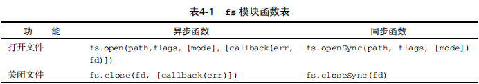
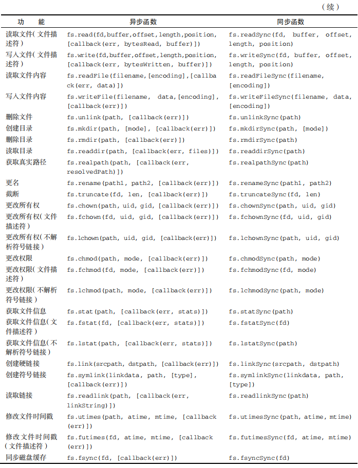
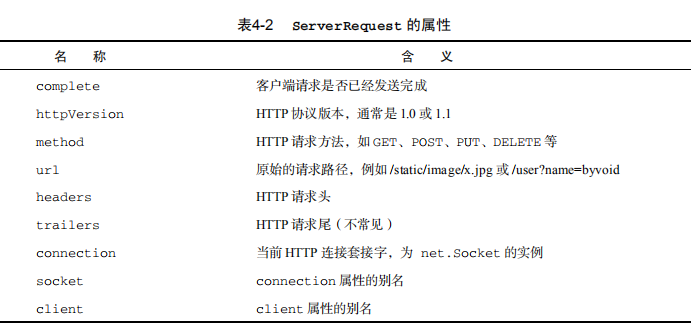

# 第4章 Node.js核心模块

核心模块是Node.js的心脏，它由一些精简而高效的库组成，为Node.js提供了基本的API。本章中，我们挑选了一部分最用的核心模块加以详细介绍，主要内容包括：

* 全局对象；
* 常用工具；
* 事件机制；
* 文件系统访问；
* HTTP服务器与客户端。

## 4.1 全局对象

JavaScript中有一个特殊的对象，称为全局对象（Global Object），它及其所有属性都可以在程序的任何地方访问，即全局变量。在浏览器JavaScript中，通常window是全局对象，而Node.js中的全局对象是global，所有全局变量（除了global本身以外）都是global对象的属性。

我们在Node.js中能够直接访问到对象通常都是global的属性，如console、process等，下面逐一介绍。

### 4.1.1 全局对象与全局变量

global最根本的作用是作为全局变量的宿主。按照ECMAScript的定义，满足以下条件的变量是全局变量：

* 在最外层定义的变量；
* 全局对象的属性；
* 隐式定义的变量（未定义直接赋值的变量）。

当你定义一个全局变量时，这个变量同时也会成为全局对象的属性，反之亦然。需要注意的是，在Node.js中你不可能在最外层定义变量，因为所有用户代码都是属于当前模块的，而模块本身不是最外层上下文。

> **提示：** 永远使用var定义变量以避免引入全局变量，因为全局变量会污染命名空间，提高代码的耦合风险。

### 4.1.2 process

process是一个全局变量，即global对象的属性。它用于描述当前Node.js进程状态的对象，提供了一个与操作系统的简单接口。通常在你写本地命令行程序的时候，少不了要和它打交道。下面将会介绍process对象的一些最常用的成员方法。

* process.argv是命令行参数数组，第一个元素是node，第二个元素是脚本文件名，从第三个元素开始每个元素是一个运行参数。

```js
console.log(process.argv);
```

将以上代码存储为argv.js，通过以下命令运行：

```bash
node argv 1991 name=byvoid --v "Carbo Kuo"
[ 'C:\\Program Files\\nodejs\\node.exe',
  'C:\\Users\\shenh\\Documents\\GitHub\\byvoidmodule\\argv',
  '1991',
  'name=byvoid',
  '--v',
  'Carbo Kuo' ]
```

* process.stdout是标准输出流，通常我们使用的console.log()向标准输出打印字符，而process.stdout.write()函数提供了更底层的接口。

* process.stdin是标注输入流，初始时它是被暂停的，要想从标准输入读取数据，你必须恢复流，并手动编写流的事件响应函数。

```js
process.stdin.resume();

process.stdin.on('data',function(data){
    process.stdout.write('read from console: '+data.toString());
});
```

* process.nextTick(callback)的功能是为事件循环设置一项任务，Node.js会在下次事件循环调用响应时调用callback。

初学者可能不理解这个函数的作用，有什么任务不能在当下执行完，需要交给下次事件循环响应来做呢？我们讨论过，Node.js适合I/O密集型的应用，而不是计算密集型的应用，因为一个Node.js进程只有一个线程，因此在任何时刻都只有一个事情在执行。如果这个事情占用大量的CPU时间，执行事件循环中的下一个事件就需要等待很久，因此Node.js的一个编程原则就是尽量缩短每个事件的执行时间。process.nextTick()提供了一个这样的工具，可以把复杂的工作拆散，变成一个个较小的事件。

```bash
function doSomething(args, callback){
    somethingComplicated(args);
    callback();
};

doSomething(function onEnd(){
    compute();
});
```

我们假设compute()和somethingComplicated()是两个较为耗时的函数，以上的程序在调用doSomething()时会先执行somethingComplicated()，然后立即调用回调函数，在onEnd()中又会执行compute()。下面用process.nextTick()改写上面的程序：

```js
function doSomething(args,callback){
    somethingComplicated(args);
    process.nextTick(callback);
};

doSomething(function onEnd(){
    compute();
});
```

改写后的程序会把上面耗时的操作拆分为两个事件，减少每个事件的执行时间，提高事件响应速度。

> **警告：** 不要使用setTimeout(fn,0)代替process.nextTick(callback)，前者比后者效率要低得多。

我们探讨了process对象常用的几个成员，除此之外process还展示了process.platform、process.pid、process.execPath、process.memoryUsage()等方法，以及POSIX进程信号响应机制。有兴趣的读者可以访问http://nodejs.org/api/process.html 了解详细内容。

### 4.1.3 console

console用于提供控制台标准输出，它是由Internet Explorer的JScript引擎提供的调试工具，后来逐渐成为浏览器的事实标准。Node.js沿用了这个标准，提供与习惯行为一致的console对象，用于向标准输出流（stdout）或标准错误流（stderr）输出字符。

* console.log()：向标准输出流打印字符并以换行符结束。console.log接受若干个参数，如果只有一个参数，则输出这个参数的字符串形式。如果有多个参数，则以类似于C语言printf()命令的格式输出。第一个参数是一个字符串，如果没有参数，只打印一个换行。

```js
console.log('Hello world');
console.log('byvoid%diovyb');
console.log('byvoid%diovyb', 1991);
```

运行结果为：

```bash
Hello world
byvoid%diovyb
byvoid1991iovyb
```

* console.error()：与console.log()用法相同，只是向标准错误流输出。
* console.trace()：向标准错误流输出当前的调用栈。

```js
console.trace();
```

运行结果为：

```bash
PS C:\Users\shenh\Documents\GitHub\byvoidmodule> node trace
Trace
    at Object.<anonymous> (C:\Users\shenh\Documents\GitHub\byvoidmodule\trace.js:1:71)
    at Module._compile (internal/modules/cjs/loader.js:689:30)
    at Object.Module._extensions..js (internal/modules/cjs/loader.js:700:10)
    at Module.load (internal/modules/cjs/loader.js:599:32)
    at tryModuleLoad (internal/modules/cjs/loader.js:538:12)
    at Function.Module._load (internal/modules/cjs/loader.js:530:3)
    at Function.Module.runMain (internal/modules/cjs/loader.js:742:12)
    at startup (internal/bootstrap/node.js:283:19)
    at bootstrapNodeJSCore (internal/bootstrap/node.js:743:3)
```

## 4.2 常用工具util

util是一个Node.js核心模块，提供常用函数的集合，用于弥补核心JavaScript的功能过于精简的不足。

### 4.2.1 util.inherits

util.inherits(constructor,superConstructor)是一个实现对象间原型继承的函数。JavaScript的面向对象特性是基于原型的，与常见的基于类的不同。JavaScript没有提供对象继承的语言级别特性，而是通过原型复制来实现的，具体细节我们在附录Ａ中讨论，在这里我们只介绍util.inherits的用法，示例如下：

```js
const util = require('util');

function Base() {
    this.name = 'base';
    this.base = 1991;

    this.sayHello = function () {
        console.log('Hello ' + this.name);
    };
};

Base.prototype.showName = function () {
    console.log(this.name);
};

function Sub() {
    this.name = 'sub';
}

util.inherits(Sub, Base);

let objBase = new Base();
objBase.showName();
objBase.sayHello();
console.log(objBase);

let objSub = new Sub();
objSub.showName();
// objSub.sayHello();
console.log(objSub);
```

我们定义了一个基础对象Base和一个继承自Base的Sub，Base有三个在构造函数内定义的属性和一个原型中定义的函数，通过util.inherits实现继承。运行结果如下：

```bash
base
Hello base
Base { name: 'base', base: 1991, sayHello: [Function] }
sub
Sub { name: 'sub' }
```

注意，Sub仅仅继承了Base在原型中定义的函数，而构造函数内部创造的base属性和sayHello函数都没有被Sub继承。同时，在原型中定义的属性不会被console.log作为对象的属性输出。如果我们去掉objSub.sayHello();这行的注释，将会看到：

```bash
base
Hello base
Base { name: 'base', base: 1991, sayHello: [Function] }
sub
C:\Users\shenh\Documents\GitHub\byvoidmodule\inherits.js:29
objSub.sayHello();
       ^

TypeError: objSub.sayHello is not a function
    at Object.<anonymous> (C:\Users\shenh\Documents\GitHub\byvoidmodule\inherits.js:29:8)
    at Module._compile (internal/modules/cjs/loader.js:689:30)
    at Object.Module._extensions..js (internal/modules/cjs/loader.js:700:10)
    at Module.load (internal/modules/cjs/loader.js:599:32)
    at tryModuleLoad (internal/modules/cjs/loader.js:538:12)
    at Function.Module._load (internal/modules/cjs/loader.js:530:3)
    at Function.Module.runMain (internal/modules/cjs/loader.js:742:12)
    at startup (internal/bootstrap/node.js:283:19)
    at bootstrapNodeJSCore (internal/bootstrap/node.js:743:3)
```

### 4.2.2 util.inspect

util.inspect(object,[showHidden],[depth],[colors])是一个将任意对象转换为字符串的方法，通常用于调试和错误输出。它至少接受一个参数object，即要转换的对象。

showHidden是一个可选参数，如果值为true，将会输出更多隐藏信息。

depth表示最大递归的层数，如果对象很发展，你可以指定层数以控制输出信息的多少。如果不指定depth，默认会递归2层，指定为null表示将不限递归层数完整遍历对象。

如果color值为true，输出格式将会以ANSI颜色编码，通常用于在终端显示更漂亮的效果。

特别要指出的是，util.inspect并不会简单地直接把对象转换为字符串，即使该对象定义了toString方法也不会调用。

```js
const util = require('util');

function Person() {
    this.name = 'byvoid';

    this.toString = function () {
        return this.name;
    };
};

let obj = new Person;

console.log(util.inspect(obj));
console.log(util.inspect(obj, true));
```

运行结果是：

```bash
Person { name: 'byvoid', toString: [Function] }
Person {
  name: 'byvoid',
  toString:
   { [Function]
     [length]: 0,
     [name]: '',
     [arguments]: null,
     [caller]: null,
     [prototype]: { [constructor]: [Circular] } } }
```

除了以上我们介绍的几个函数之外，util还提供了util.isArray()、util.isRegExp()、util.isDate()、util.isError()四个类型测试工具，以及util.format()、util.debug()等工具。有兴趣的读者可以访问http://nodejs.org/api/util.html 了解详细内容。

## 4.3 事件驱动events

events是Node.js最重要的模块，没有“之一”，原因是Node.js本身架构就是事件式的，而它提供了唯一的接口，所以堪称Node.js事件编程的基石。events模块不仅用于用户代码与Node.js下层事件循环的交互，还几乎被所有的模块依赖。

### 4.3.1 事件发射器

events模块只提供了一个对象：events.EventEmitter。EventEmitter的核心就是事件发射与事件监听器功能的封装。EventEmitter的每个事件由一个事件名和若干个参数组成，事件名是一个字符串，通常表达一定的语义。对于每个事件，EventEmitter支持若干个事件监听器。当事件发射时，注册到这个事件的事件监听器被依次调用，事件参数作为回调函数参数传递。

让我们以下面的例子解释这个过程：

```js
const events = require('events');

let emitter = new events.EventEmitter();

emitter.on('someEvent', function (arg1, arg2) {
    console.log('listener1', arg1, arg2);
});

emitter.on('someEvent', function (arg1, arg2) {
    console.log('listener2', arg1, arg2);
});

emitter.emit('someEvent', 'byvoid', 1991);
```

运行的结果是：

```bash
listener1 byvoid 1991
listener2 byvoid 1991
```

以上例子中，emitter为事件someEvent注册了两个事件监听器，然后发射了someEvent事件。运行结果中可以看到两个事件监听器回调函数被先后调用。

这就是EventEmitter最简单的用法。接下来我们介绍一下EventEmitter常用的API。

* EventEmitter.on(event,listener)为指定事件注册一个监听器，接受一个字符串event和一个回调函数listener。
* EventEmitter.emit(event,[arg1],[arg2],[…])发射event事件，传递若干可选参数到事件监听器的参数表。
* EventEmitter.once(event,listener)为指定事件注册一个单次监听器，即监听器最多只会触发一次，触发后立刻解除该监听器。
* EventEmitter.removeListener(event,listener)移除指定事件的某个监听器，listener必须是该事件已经注册过的监听器。
* EventEmitter.removeAllListeners([event])移除所有事件的所有监听器，如果指定event，则移除指定事件的所有监听器。

更详细的API文档参见http://nodejs.org/api/events.html。

### 4.3.2 error事件

EventEmitter定义了一个特殊的事件error，它包含了“错误”的语义，我们在遇到异常的时候通常会发射error事件。当error被发射时，EventEmitter规定如果没有响应的监听器，Node.js会把它当作异常，退出程序并打印调用栈。我们一般要为会发射error事件的对象设置监听器，避免遇到错误后整个程序崩溃。例如：

```js
const events = require('events');

let emitter = new events.EventEmitter();

emitter.emit('error');
```

运行时会显示以下错误：

```bash
events.js:180
    throw err; // Unhandled 'error' event
    ^

Error [ERR_UNHANDLED_ERROR]: Unhandled error.
    at EventEmitter.emit (events.js:178:17)
    at Object.<anonymous> (C:\Users\shenh\Documents\GitHub\byvoidmodule\error.js:5:9)    at Module._compile (internal/modules/cjs/loader.js:689:30)
    at Object.Module._extensions..js (internal/modules/cjs/loader.js:700:10)
    at Module.load (internal/modules/cjs/loader.js:599:32)    at tryModuleLoad (internal/modules/cjs/loader.js:538:12)
    at Function.Module._load (internal/modules/cjs/loader.js:530:3)
    at Function.Module.runMain (internal/modules/cjs/loader.js:742:12)
    at startup (internal/bootstrap/node.js:283:19)    at bootstrapNodeJSCore (internal/bootstrap/node.js:743:3)
```

### 4.3.3 继承EventEmitter

大多数时候我们不会直接使用EventEmitter，而是在对象中继承它。包括fs、net、http在内的，只要是支持事件响应的核心模块都是EventEmitter的子类。

为什么要这样做呢？原因有两点。首先，具有某个实体功能的对象实现事件符合语义，事件的监听和发射应该是一个对象的方法。其次JavaScript的对象机制是基于原型的，支持部分多重继承、继承EventEmitter不会打乱对象原有的继承关系。

## 4.4 文件系统fs

fs模块是文件操作的封装，它提供了文件的读取、写入、更名、删除、遍历目录、链接等POSIX文件系统操作。与其他模块不同的是，fs模块中所有的操作都提供了异步的和同步的两个版本，例如读取文件内容的函数有异步的fs.readFile()和同步的fs.readFileSync()。我们以几个函数为代表，介绍fs常用的功能，并列出fs所有函数的定义和功能。

### 4.4.1 fs.readFile

fs.readFile(filename,[encoding],[callback(err,data)])是最简单的读取文件的函数。它接受一个必选参数filename，表示要读取的文件名。第二个参数encoding是可选的，表示文件的字符编码。callback是回调函数，用于接收文件的内容。如果不指定encoding，则callback就是第二个参数。回调函数提供两个参数err和data，err表示有没有错误发生，data是文件内容。如果指定了encoding，data是一个解析后的字符串，否则data将会是以Buffer形式表示的二进制数据。

例如以下程序，我们从content.txt中读取数据，但不指定编码：

```js
// readfile.js

const fs = require('fs');

fs.readFile('file.txt', function (err, data) {
    if (err) {
        console.error(err);
    } else {
        console.log(data);
    }
});
console.log('end.');
```

假设file.txt中的内容是UTF-8编码的Text文本文件示例，运行结果如下：

```bash
<Buffer 48 65 6c 6c 6f 20 57 6f 72 6c 64 3b 0d 0a 43 6f 6e 74 65 6e 74 73 20 6f 66 20 74 68 65 20 66 69 6c 65 2e>
```

这个程序以二进制的模式读取了文件的内容，data的值是Buffer对象。如果我们给fs.readFile的encoding指定编码：

```js
// readfile.js

const fs = require('fs');

fs.readFile('file.txt', 'utf-8', function (err, data) {
    if (err) {
        console.error(err);
    } else {
        console.log(data);
    }
});
```

那么运行结果则是：

```bash
Text 文本文件示例
```

当读取文件出现错误时，err将会是Error对象。如果content.txt不存在，运行前面的代码则会出现以下结果：

```bash
{ [Error: ENOENT: no such file or directory, open 'C:\Users\shenh\Documents\GitHub\node-js-demo\file.txt']
  errno: -4058,
  code: 'ENOENT',
  syscall: 'open',
  path:
   'C:\\Users\\shenh\\Documents\\GitHub\\node-js-demo\\file.txt' }
```

> **提示：** Node.js的异步编程接口习惯是以函数的最后一个参数为回调函数，通常一个函数只有一个回调函数。回调函数是实际参数中第一个是err，其余的参数是其他返回的内容。如果没有发生错误，err的值会是null或undefined。如果有错误发生，err通常是Error对象的实例。

### 4.4.2 fs.readFileSync

fs.readFileSync(filename,[encoding])是fs.readFile同步的版本。它接受的参数和fs.readFile相同，而读取到的文件内容会以函数返回值的形式返回。如果有错误发生，fs将会抛出异常，你需要使用try和catch捕捉并处理异常。

> **提示：** 与同步I/O函数不同，Node.js中异步函数大多没有返回值。

### 4.4.3 fs.open

fs.open(path,flags,[mode],[callback(err,fd)])是POSIX open函数的封装，与C语言标准库中的fopen函数类似。它接受两个必选参数，path为文件的路径，flags可以是以下值。

* r：以读取模式打开文件。
* r+：以读写模式打开文件。
* w：以写入模式打开文件，如果文件不存在则创建。
* w+：以读写模式打开文件，如果文件不存在则创建。
* a：以追加模式打开文件，如果文件不存在的则创建。
* a+：以读取追加模式打开文件，如果文件不存在则创建。

mode参数用于创建文件时给文件指定权限，默认是0666。回调函数将会传递一个文件描述符fd。

### 4.4.4 fs.read

fs.read(fd,buffer,offset,length,position,[callback(err,bytesRead,buffer)])是POSIX read函数的封装，相比fs.readFile提供了更底层的接口。fs.read的功能是从指定的文件描述符fd中读取数据并写入buffer指向的缓冲区对象。offset是buffer的写入偏移量。length是要从文件中读取的字节数。position是文件读取的起始位置，如果position的值null，则会从当前文件指针的位置读取。回调函数传递bytesRead和buffer，分别表示读取的字节数和缓冲区对象。

以下是一个使用fs.open和fs.read的示例。

```js
const fs = require('fs');

fs.open('file.txt', 'r', function (err, fd) {
    if (err) {
        console.error(err);
        return;
    }

    let buf = new Buffer(8);
    fs.read(fd, buf, 0, 8, null, function (err, bytesRead, buffer) {
        if (err) {
            console.error(err);
            return;
        }

        console.log('bytesRead:' + bytesRead);
        console.log(buffer);
    })
});
```

运行结果则是：

```bash
8
<Buffer 54 65 78 74 20 e6 96 87>
```

一般来说，除非必要，否则不要使用这种方式读取，因为它要求你手动管理缓冲区和文件指针，尤其是在你不知道文件大小的时候，这将会是一件很麻烦的事情。

表4-1列出了fs所有函数的定义和功能。





## 4.5 HTTP服务器与客户端

Node.js标准库提供了http模块，其中封装了一个高效的HTTP服务器和一个简易的HTTP客户端。http.Server是一个基于事件的HTTP服务器，它的核心由Node.js下层C++部分实现，而接口由JavaScript封装，兼顾了高性能与简易性。http.request则是一个HTTP客户端工具，用于向HTTP服务器发起请求，例如实现Pingback或者内容捉取。

### 4.5.1 HTTP服务器

http.Server是http模块中的HTTP服务器对象，用Node.js做的所有基于HTTP协议系统，如网站、社交应用甚至代理服务器，都是基于http.Server实现的。它提供了一套封装级别很低的API，仅仅是流控制和简单的消息解析，所有的高层功能都要通过它的接口来实现。

我们在3.1.3节中使用http实现了一个服务器：

```js
// app.js

let http = require('http');

http.createServer(function (req, res) {
    res.writeHead(200, {
        'Content-Type': 'text/html'
    });
    res.write('<h1>Node.js</h1>');
    res.end('<p>Hello World</p>');
}).listen(3000);

console.log('HTTP server is listening at port 3000. http://localhost:3000/');
```

这段代码中，http.createServer创建了一个http.Server的实例，将一个函数作为HTTP请求处理函数。这个函数接受两个参数，分别是请求对象（req）和响应对象（res）。在函数体类，res显式地写回了响应代码200（表示请求成功），指定响应头为‘Content-Type’:‘text/html’，然后写入响应体‘<h1>Node.js</h1>’，通过res.end结束并发送。最后该实例还调用了listen函数，启动服务器并监听3000端口。

**1. http.Server事件**

http.Server是一个基于事件的HTTP服务器，所有的请求都被封装为独立的事件，开发者只需要对它的事件编写响应函数即可实现HTTP服务器的所有功能。它继承自EventEmitter，提供了以下几个事件。

* request：当客户端请求到来时，该事件被触发，提供两个参数req和res，分别是http.ServerRequest和http.ServerResponse的实例，表示请求和响应信息。
* connection：当TCP连接建立时，该事件被触发，提供一个参数socket，为net.Socket的实例。connection事件的粒度要大于request，因为客户端在Keep-Alive模式下可能会在同一个连接内发送多次请求。
* close：当服务器关闭时，该事件被触发。注意不是在用户连接断开时。

除此之外还有checkContinue、upgrade、clientError事件，通常我们不需要关心，只有在实现复杂的HTTP服务器的时候才会用到。

在这些事件中，最常用的就是request了，因此http提供了一个捷径：http.createServer([requestListener])，功能是创建一个HTTP服务器并将requestListener作为request事件的监听函数，这也是我们前面例子中使用的方法。事实上它显式的实现方法是：

```js
const http = require('http');

let server = new http.Server();
server.on('request', function (req, res) {
    res.writeHead(200, {
        'Content-Type': 'text/html'
    });
    res.write('<h1>Node.js</h1>');
    res.end('<p>Hello World</p>');
});
server.listen(3000);

console.log('HTTP server is listening at port 3000');
```

**2. http.ServerRequest**

http.ServerRequest是HTTP请求的信息，是后端开发者最关注的内容。它一般由http.Server的request事件发送，作为第一个参数传递，通常简称request或req。ServerRequest提供一些属性，表4-2中列出了这些属性。



HTTP请求一般可以分为两部分：请求头（Request Header）和请求体（Request Body）。以上内容由于长度较短都可以在请求头解析完成后立即读取。而请求体可能相对较长，需要一定的时间传输，因此http.ServerRequest提供了一下3个事件用于控制请求体传输。

* data：当请求体数据到来时，该事件被触发。该事件提供一个参数chunk，表示接受到的数据。如果该事件没有被监听，那么请求将会被抛弃。该事件可能会被调用多次。

* end：当请求体数据传输完成时，该事件被触发，此后将不会再有数据到来。

* close：用户当前请求结束时，该事件被触发。不同于end，如果用户强制终止了传输，也还是调用close。

  