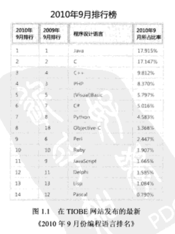
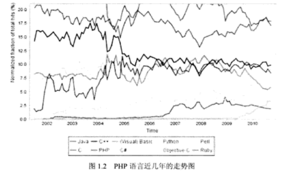
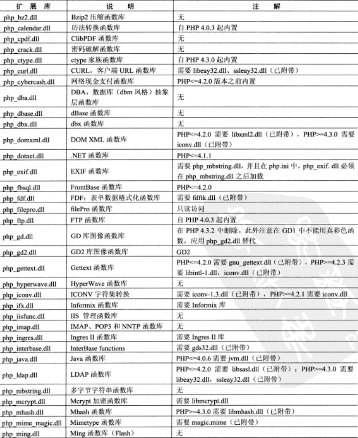
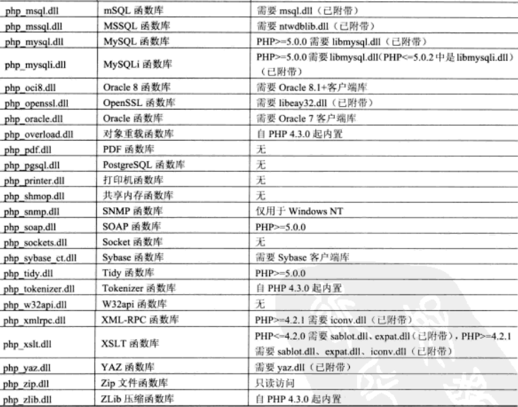
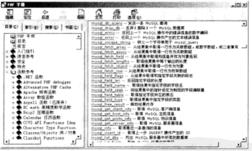
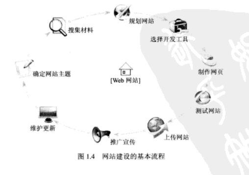

# 第1章 初始PHP

PHP是一种服务器端HTML——嵌入式脚本描述语言，其最强大和最重要的特征就是跨平台和面向对象。本章将向读者简单介绍PHP语言、PHP5的新特性、PHP的发展趋势以及学号PHP语言的方法等。主要目的是让读者对PHP语言有一个整体的了解，然后再慢慢地学习PHP语言的具体内容，最后达到完全掌握PHP语言的目的。

通过阅读本章，您可以：

* 了解PHP的发展历程及语言优势
* 了解PHP 5新特征
* 认识PHP扩展库
* 学习PHP网络编程的前期准备工作
* 了解PHP相关学习资源软件及下载网址
* 了解如何学好PHP

## 1.1 PHP概述

PHP起源于1995年，由Rasmus Lerdorf开发。到现在，PHP已经历了16年的事件洗涤，成为全球最受欢迎的脚本语言之一。由于PHP 5是一种面向对象的、完全跨平台的新型Web开发语言，所以无论从开发者角度考虑还是从经济角度考虑，都是非常实用的。PHP语法结构简单、易于入门，很多功能只需一个函数即可实现。很多机构都相继推出了用于开发PHP的IDE工具、Zend搜索引擎等新型技术。

### 1.1.1 什么是PHP

PHP（Hypertext Preprocessor，超文本预处理器），是一种服务器端、跨平台、HTML嵌入式的脚本语言，其独特的语法混合了C语言、Java语言和Perl语言的特点，是一种被广泛应用的开源式的多用途脚本语言，尤其适合Web开发。

PHP是B/S （Browser/Server，浏览器/服务器）体系结构，属于三层结构。服务器启动后，用户可以不使用客户端软件，只使用浏览器即可访问，既保持了图形化的用户界面，又大大减少了应用的维护量。

### 1.1.2 PHP语言的优势

PHP起源于自由软件，即开放源代码软件，使用PHP进行Web应用程序的开发具有以下优势。

* 安全性高：PHP是开源软件，每个人都可以看到所有PHP的源代码，程序代码与Apache编译在一起的方式让它的安全设定更灵活。PHP具有公认的安全性能。
* 跨平台特性：PHP几乎支持所有的操作系统平台（如Windows/UNIX/Linux/Macintosh/FreeBSD/OS2等），并且支持Apache、IIS等多种Web服务器。
* 支持广泛的数据库：可操纵多种主流与非主流的数据库，如MySQL、Access、SQL Server、Oracle、DB2等，其中PHP与MySQL是目前最佳的组合，它们的组合可以跨平台运行。
* 易学性：PHP嵌入在HTML语言中，以脚本语言为主，内置丰富函数，语法简单、书写容易，方便读者学习掌握。
*  执行速度快：占用系统资源少，代码执行速度快。
* 免费：在流行的企业应用LAMP平台中，Linux、Apache、MySQL、PHP都是免费软件，这种开源免费的框架结构可以为网站经营者节省很大一笔开支。
* 模版化：实现程序逻辑与用户界面分离。
* 支持面向对象与过程：支持面向对象和过程的两种开发风格，并可向下兼容。
* 内嵌Zend加速引擎，性能稳定快速。

### 1.1.3 PHP 5的新特性

PHP 5中的对象已经进行了较系统和全面的调整，下面着重讲述PHP 5中新的对象模式。

* 构造函数和析构函数。
* 对象的引用。
* 对象的克隆（clone）。
* 对象中的私有、公共及受保护模式（private、public和protected关键字）。
* 接口（interface）。
* 抽象类。
* `__call`。
* `__set`和`__get`。
* 静态成员。

### 1.1.4 PHP的发展趋势

由于PHP是一种面向对象的、完全跨平台的新型Web开发语言，所以无论从开发者角度考虑还是从经济角度考虑，都是非常实用的。PHP语法结构简单、易于入门，很多功能只需一个函数就可以实现，并且很多机构都相继推出了用于开发PHP的IDE工具。

在TIOBE网站发布的最新《2010年9月份编程语言排名》中，Java仍然跃居榜首，PHP编程语言的增长势头与C++十分接近，专家分析未来PHP有望超过C++跃居排行榜三甲，如图1.1所示。

TIOBE发布的编程语言排行榜反映了各种编程语言的流行程度，该排行榜每月发布一次，统计数据包括全球范围的软件工程师、培训课程以及第三方供应商，数据主要来自Google、MSN和YAHOO！等流行搜索引擎。

> **说明**
>
> TIOBE声称该排行榜并不是要评选最优秀的编程语言或是统计完成编程量最大的语言，但它可以帮助用户了解自己掌握的编程语言是否跟得上时代的发展，并且为开发新的软件系统需要对编程语言做策略性选择时提供参考。

近几年PHP的应用呈现上升趋势，如图1.2所示，这正说明了PHP语言简单、易学、面向对象和安全等特点正在被更多人所认同。相信新的PHP语言将会朝着更加企业化的方向迈进。并且将更适合大型系统的开发。

> **说明**
>
> 图1.1 和图1.2 中的数据摘自http://www.tiobe.com 网站。

### 1.1.5 PHP的应用领域

PHP在互联网高速发展的今天，应用范围非常广泛，主要包括：

* 中小型网站的开发。
* 大型网站的业务逻辑结果展示。
* Web办公管理系统。
* 硬件管控软件的GUI。
* 电子商务应用。
* Web应用系统开发。
* 多媒体系统开发。
* 企业级应用开发。

PHP正吸引着越来越多的Web开发人员。PHP无处不在，它可应用于任何地方、任何领域，并且已拥有几百万个用户，其发展速度要快于在它之前的任何一种计算机语言。PHP能够给企业和最终用户带来数不尽的好处。据最新数据统计显示，全世界有超过2200万家网站和1.5万家公司在使用PHP语言，包括百度、雅虎、Google、YouTube和Digg等著名网站，这其中还包括汉莎航空电子订票系统、德意志银行的网上银行、华尔街在线的金融信息发布系统等，甚至对网络环境要求非常苛刻的军队系统也选择使用PHP语言。除此之外，PHP也是企业用来构建服务导向型、创造和混合Web于一体的新一代综合性商业所使用的语言，成为开源商业应用发展的方向。

## 1.2 扩展库

PHP一直在不断升级更新，总体上围绕着性能、安全与新特性，不断为开发者提供新的动力。PHP提供了一些扩展库，这些扩展库使PHP如虎添翼，更加灵活方便。如网上社区、BBS论坛等，如果没有扩展库的支持，它们都科恩了无法使用，因此在安全PHP时要根据各自的用途选择安装扩展库。

从PHP 5开始，PHP即新增了内置的标准扩展库，包括XML扩展库-DOM、SimpleXML、SPL、SQLite等，而像MySQL、MySQLi、Overload、GD2等这些库则被放在PECL外部扩展库中，需要时在php.ini配置文件中选择加载。

在Windows下加载扩展库，是通过修改php.ini文件来完成的。用户也可以在脚本中通过使用dl()函数来动态加载。PHP扩展库的DLL文件都具有`php_`前缀。

很多扩展库都内置于Windows版本的PHP中，要加载这些扩展库不需要额外的DLL文件和extension配置指令。Windows下的PHP扩展库列表列出了需要或曾经需要额外DLL文件的扩展库。

在编辑php.ini文件时，应注意以下几点。

* 需要修改extension_dir设置使其指向用户放置扩展库的目录或者放置php_*.dll文件的位置。例如`extension_dir=C:\php\extensions`
* 要在php.ini文件中启用某扩展库，需要去掉extension=php_*.dll前的注释符号，即将需要加载的扩展库抢的分号“;“删除。例如启用Bzip2扩展库，需要将下面这行代码：`;extension=php_bz2.dll`改成`extension=php_bz2.dll`
* 有些扩展库需要额外的DLL才能工作。其中一部分DLL文件绑定在发行包中（PHP 5中在主目录下），但还有一些，如Oracle（php_oci8.dll）所需要的DLL没有绑定在发行包助攻。如果安装PHP 5，需要将绑定的DLL从C:\php5\dlls复制到主目录C:\php中。值得注意的是，必须将C:\php5放到系统路径PATH中。
* 某些DLL没有绑定在PHP发行包中。PECL中有日益增加、数目巨大的PHP扩展库，这些扩展库需要单独下载。

> **注意：**
>
> 如果运行服务器模块版本的PHP，在修改了php.ini之后需要重新启动Web服务器，以使改动生效。

PHP内置扩展库列表如表1.1所示。

## 1.3 如何学好PHP

如何学好PHP语言，这是所有初学者共同面临的问题。其实，每种程序设计语言的学习方法都大同小异，需要注意的有以下几点：

* 明确自己的学习目标和学习方向，选择并锁定一门语言，按照自己的学习方向努力学习、认真研究。
* 学会匹配PHP的开发环境，选择一种适合自己的开发工具。
* 扎实的基础对于一个程序员来说尤为重要，因此建议读者多阅读一些程序设计基础教材，了解基本的编程知识，掌握常用的函数。
* 了解设计模式。开发软件必须编写程序点，这些代码必须具有高度的可读性，这样才能编写的程序具有调试、维护和设计的价值，学习一些设计模式，就能更好地把握项目的整体结构。
* 多实践，多思考，多请教。不要死记语法，在刚接触一门语言，特别是学习PHP语言时，掌握好基本语法，反复实践。仅读懂书本中的内容和技术是不行的，必须动手编写程序代码，并运行程序、分析运行结构，让大脑对学习内容有个整体的认识和肯定。用自己的方式去思考问题、编写代码来提高编程思想。平时可以多借鉴网上一些好的功能模块，培养自己的编程思想。多向他人请教，学习他人的编程思想。多与他人沟通技术问题，提高自己的技术和见识。这样才可以快速地进入学习状态。
* 学习技术最忌急躁，遇到技术问题，必须冷静对待，不要让自己的大脑思绪紊乱，保持清醒的头脑才能分析和解决各种问题。可以尝试听歌、散步、玩游戏等活动放松自己。遇到问题，还要尝试自己解决，这样可以提高自己的程序调试能力，并对常见问题有一定的了解，明白出错的原因，进而举一反三，解决其他关联的错误问题。
* PHP函数有几千种，需要下载一个PHP中文手册和MySQL手册，或者查看PHP函数类的相关书籍，以便解决程序中出现的问题。
* 现在很多PHP案例书籍都配有视频录像，可以看一些视频录像领悟他人的编程思想。只有掌握了整体的开发思路之后，才能够系统地学习编程。
* 养成良好的编程习惯。
* 遇到问题不要放弃，要有坚持不懈、持之以恒的精神。

## 1.4 学习资源

下面为读者推荐一些学习PHP的相关资源。通过这些资源，可以帮助读者找到精通PHP的捷径。

### 1.4.1 常用软件资源

**1. PHP开发工具**

PHP的开发工具很多，常用的开发工具有Dreamweaver、ZendStudio和EditPlus2，还有最新的Delphi for php。每个开发工具各有优势，一个好的开发工具往往会达到事半功倍的效果，读者可根据自己的需求选择相应的开发工具。

开发工具下载网站为http://www.newhua.com/或http://www.skycn.com/。

**2. 下载PHP用户手册**

学习PHP语言，配备一个PHP参考手册是必要的，就像我们在学习汉字时手中必须具备一本《新华字典》一样。PHP参考手册对PHP的函数进行了详细的讲解和说明，并且还给出了一些简单的示例，同时还对PHP的安装与配置、语言参考、安全和特点等内容进行了介绍。

在http://www.php.net/docs.php网站上，提供有PHP的各种语言、格式和版本的参考手册，读者可以进行在线阅读，也可以下载。

PHP参考手册不但对PHP的函数进行了解释和说明。而且还提供了快速查找的方法，让用户可以更加方便地找到指定的函数。PHP参考手册下载版如图1.3所示。

### 1.4.2 常用网上资源

下面提供一些大型的PHP技术论坛和社区，这些资源不但可以提高PHP编程者的技术水平，也是程序员学习和工作的好帮手。

**1. PHP技术论坛**

* PHP100：http://www.php100.com
* PHP中国：http:www.phpchina.com

**2. PHP论坛**

### 1.4.3 主要图书网站

下面提供一些国内比较大的PHP图书网站，其内容丰富、信息全面、查阅方便，是读者了解PHP图书信息的窗口。

* 当当网：http://www.dangdang.com.cn
* 亚马逊中国网：http://www.amazon.com.cn
* 互动出版网：www.china-pub.com
* 明日图书网：http://www.mingribook.com

## 1.5 网站建设的基本流程

本节将介绍网站建设的基本流程，从而使读者在明确开发流程的基础上，能够更顺利地进行网站开发工作。网站建设的基本流程如图1.4所示。

## 1.6 小结

本章重点讲述了PHP的发展历程及语言优势，详细介绍了PHP 5的新增功能，随后还介绍了PHP 5的扩展库。最后学习了构建网站的基本流程与PHP相关资源的获取路径。

