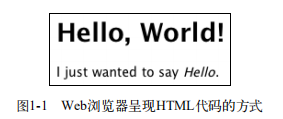

# 第1章 PHP概述

>**本章内容**

  * HTML语法基础
  * PHP语法基础
  * 使用FTP
  * 测试脚本
  * 向浏览器发送文本
  * 为脚本添加注释
  * 调试的基本步骤
  * 回顾和实践

学习任何新的编程语言时，首先需要理解的是它的基础语法，这也正是本章介绍的内容。本书将重点讨论PHP的基础知识，但是同时也会涉及一些备受推崇的编程技术，从长远来看，这些技术能够改进我们的工作。

如果读者之前没有任何编程经验，那么应该仔细阅读本章，它将为你指明今后学习的正确方向。如果已经具备了一定的编程经验，那么可以快速浏览这一章，了解本书其余的内容。在结束本章时，读者就能够成功地编写并执行第一个PHP脚本，走上开发动态Web应用程序之路。

## 1.1 HTML语法基础

所有的Web页面都由HMTL（HyperText Markup Language，超文本标记语言）构成。每种Web浏览器（无论是微软的IE，苹果的Safari、Mozilla的Firefox还是Google的Chrome）都将HTML代码：

```html
<h1>Hello, World</h1>
I just wanted to say <em>Hello</em>.
```

转变成为有样式的Web页面展示给用户（参见图1-1）。



在撰写本书时，HTML的最新版本是4.01。下一个主要版本是HTML5，目前正在积极地研发和讨论中，还没有最后定案。本书使用XHTML（eXtensible HTML），它与HTML有少许差别。实际上，XHTML同HTML非常相似，它们之间的不同之处有以下几点。

* 所有的标签都使用小写字母
* 嵌套标签必须有恰当的格式。

这条规则并不像它听起来那么复杂，它的意思是，不能这样写代码：`<div><p>text</div></P>`，而应该使用这种格式：`<div><p>text</p></div>`。

* 所有的标签属性值必须使用引号引起来。

在HTML中可以这样写：`<table border=2>`，但是在XHTML中必须这样写：`<table border="2">`。

