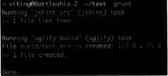
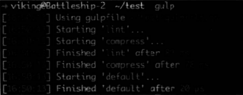

# 第1章 现代前端开发

前端开发现在在经历急速发展的阶段。随着应用场景越来越广，需求越来越复杂，社区和官方也在不断地将其规范化和工程化。在本章中，会给读者介绍目前前端开发的发展现状和一些优秀的工具。如果你还在使用比较古老的开发方式，那么不妨跟随步伐，了解一下现阶段的发展。

本章会从3个方面介绍**现代**的前端开发技术，作为了解React和webpack的背景知识。

* ES6——新一代的JavaScript语言标准。
* Component组件和模块的发展历程。
* 前端开发的常用工具：
  * 包管理器（Package Manager），用来下载和管理前端代码库。
  * 任务流工具（Task Runner），用来执行一系列开发中的任务。
  * 模块打包工具（Bundler），用来转换和合并前端代码的模式。

## 1.1 ES6——新一代的JavaScript标准

JavaScript这门脚本语言一直被人诟病（所以薄薄的一本《JavaScript语言精粹》让很多读者捧为圣经），再加上浏览器兼容性的问题，令很多前端开发者搞到特别苦恼。如今前端开发发展又如此迅速，这促使了ECMA组委会在修订JavaScript语言新版本时，不仅在质量上不断加以完善，同时加快了更新的速度。

ES6（或者被称为ES2015）被称为JavaScript历史上最重大的一次变革，该标准最终敲定与2015年6月，提供了非常多语言级别的新的特性。这是一个可以载入前端发展史册的重大事件。本书全面使用了ES6标准，在这里会简单描述一些在本书中使用的ES6的特性，给读者一个关于最新标准的直观概念。如果想了解更多变化和特性，建议阅读阮一峰老师编写的《ECMAScript 6 入门》 。

### 1.1.1 语言特性

**1. const、let关键字**

众所周知，在JavaScript中，变量默认是全局性的，只存在函数级作用域，声明函数曾经是创造作用域的唯一方法。这点和其他编程语言存在差异，其他语言大多数都存在块级作用域。所以在ES6中，新提出的let关键字使这个缺陷得到了修复。

```javascript
if(true){
    let a='name';
}
console.log(name);
// ReferenceError: a is not defined
```

同时还引入的概念是const，用来定义一个常量，一旦定义以后不可以修改，不过如果是引用类型的，那么可以改变它的属性。

```javascript
const MYNAME='viking';
MYNANME='kitty';
// "CONSTANT" is read-only
const MYNAME={foo:'viking'};
MYNAME.foo='kitty';
// 可以正常运行
```

**2. 函数**

* **箭头函数**

箭头函数是一种更简单的函数声明方式，可以把它看作是一种语法糖，箭头函数永远是匿名的。

```javascript
let add=(a,b)=>{return a+b;}
// 当后面是表达式(expression)的时候，还可以简写成
let add=(a,b)=>a+b;
// 等同于
let add=function(a,b){
    return a+b;
}
// 在回调函数中应用
let numbers=[1,2,3];
let doubleNumbers=numbers.map((number)=>number*2);
console.log(doubleNumbers);
// [2,4,6]看起来很简便吧
```

* this在箭头函数中的使用

在工作中经常会遇到这样的问题，就是this在一个对象方法中嵌套函数。

```javascript
let age=2;
let kitty={
    age:1,
    grow:function(){
        setTimeout(function(){
            console.log(++this.age);
        },100);
    }
};

kitty.grow();
// 3
```

在对象方法的嵌套函数中，this会指向global对象，这被看作是JavaScript在设计上的一个重大缺陷，一般都会用一些hack来解决它，如下。

```javascript
let kitty={
    age:1,
    grow:function(){
        const self=this;
        setTimeout(function(){
            console.log(++self.age);
        },100);
    }
};
// 或者
let kitty = {
    age:1,
    grow:function(){
        setTimeout(function(){
            console.log(this.age);
        }.bind(this),100);
    }
}
```

现在有了箭头函数，可以很轻松地解决这个问题。

```javascript
let kitty = {
	age:1,
    grow:function(){
        setTimeout(()=>{
            console.log(this.age);
        },100);
    }
}
```

* **函数默认参数**

ES6没有出现之前，面对默认参数都会让人感到很痛苦，不得不采用各种hack，比如说：values=values||[]。现在一切都变得轻松很多。

```javascript
function desc(name='Petter',age=5){
    return name+' is '+age+' years old';
}
desc();
//Petter is 5 years old
```

* **Rest参数**

当一个函数的最后一个参数有“…”这样的前缀，它就会变成一个参数的数组。

```javascript
function test(...args){
    console.log(args);
}
test(1,2,3);
// [1,2,3]
function test2(name, ...args){
    console.log(args);
}
test2('Peter',2,3);
//[2,3]
```

它和arguments有如下区别：Rest参数只是没有指定变量名称的参数数组，而arguments是所有参数的集合；arguments对象不是一个真正的数组，而Rest参数是一个真正的数组，可以使用各种方法，比如sort、map等。有了这两个理由，是时候告别arguments，拥抱可爱的Rest参数了。

**3. 展开操作符**

刚才在函数中见到了使用“…“操作符来实现函数参数的数组，其实这个操作符的魔力不仅仅如此。它被称为展开操作符，允许一个表达式在某处展开，在存在多个参数（用于函数调用）、多个元素（用于数组字面量）或者多个变量（用于解构赋值）的地方就会出现这种情况。

* **用于函数调用**

如果在之前的JavaScript中，想让函数把一个数组依次作为参数进行调用，一般会如下这样做。

```js
function test(x,y,z){};
var args=[1,2,3];
test.apply(null,args);
```

有了ES6的展开运算符，可以简化这个过程。

```js
function test(x,y,z){};
let args=[0,1,2];
test(...args);
```

* **用于数组字面量**

在之前的版本中，如果想创建含有某些元素的新数组，常常会用到splice、concat、push等方法，如下。

```js
var arr1 = [1, 2, 3];
var arr2 = [4, 5, 6];
var arr3 = arr1.concat(arr2);
console.log(arr3);
//1,2,3,4,5,6
```

使用展开运算符以后就简便了很多，如下。

```js
let arr1 = [1, 2, 3];
let arr2 = [4, 5, 6];
let arr3 = [...arr1, ...arr2];
console.log(arr3);
// [ 1, 2, 3, 4, 5, 6 ]
```

* **对象展开运算符**

数组的展开运算符简单易用，那么对象有没有这个特性？

```js
let mike = {
    name: 'mike',
    age: 50
};
mike = {
    ...mike,
    sex: 'male'
};
console.log(mike);
// {
//     name: 'mike',
//     age: 50,
//     sex: 'male'
// }
```

对象的展开其实已经被提上日程，只不过它是ES7的提案之一，它可以让你以更简洁的形式将一个对象可枚举的属性复制到另外一个对象上。这一特性可以借助后面介绍的Babel和它的插件来实现。其实React已经走在了时代的前沿，在JSX语法中已经开始采用这种写法，我们会在后面的章节学习到这个特性。

**4. 模板字符串**

在ES6之前的时代，字符串的拼接总是一件令人不爽的事情，但是在ES6来临的时代，这个痛处也要被治愈了。

```js
// 之前总会做这些事情
var viking = 'viking';
var b = 'My name is ' + viking + '!';
// 多行字符串
var longStory_ = 'This is a long story,' +
    'this is a long story,' +
    'this is a long story';
// 有了ES6现在可以这样做
// 注意这里不是引号而是`这个符号
let name = 'viking';
let a = 'My name is ${name} !';
let longStory = `This is a long story,
this is a long story
this is a long story`;

console.log(longStory);
```

**5. 解构赋值**

解构语法可以快速从数组或者对象中提取变量，可以用一个表达式读取整个结构。

* **解构数组**

```js
let foo = ['one', 'two', 'three'];
let [one, two, three] = foo;

console.log(`${one},${two},${three}`);
// ['one', 'two', 'three']
```

* **解构对象**

```js
let person = {
    name: 'viking',
    age: 20
};
let {
    name,
    age
} = person;

console.log(`${name},${age}`);
```

解构赋值可以看作一种语法糖，它受Python语言的启发，可以提高效率。

**6. 类**

众所周知，在JavaScript的世界里是没有传统类的概念的，它使用原型链的方式来完成继承，但是声明的方式看起来总是怪怪的，所以ES6提供了class这个语法糖，让开发者可以模仿其他语言类的声明方式，看起来更加明确清晰。需要注意的是.class并没有带来新的结构，而只是原来原型链方式的一种语法糖。

```js
class Animal {
    // 构造函数
    constructor(name, age) {
        this.name = name;
        this.age = age;
    }
    shout() {
        return `My name is ${this.name}, age is ${this.age}`;
    }
    // 静态方法
    static foo() {
        return 'Here is a static method';
    }
}

const cow = new Animal('betty', 2);
cow.shout();
// My name is betty, age is 2
Animal.foo();
// Here is a static method

class Dog extends Animal {
    constructor(name, age = 2, color = 'black') {
        // 在构造函数中可以直接调用super方法
        super(name, age);
        this.color = color;
    }
    shout() {
        // 在非构造函数中不能直接使用super方法
        // 但是可以采用super().+方法名字调用父类方法
        return super.shout() + `, color is ${this.color}`;
    }
}

const jackTheDog = new Dog('jack');
let sayHello = jackTheDog.shout();
console.log(sayHello);
// "My name is jack, age is 2, color is black"
```

**7. 模块**

JavaScript模块化代码是一个古老的话题，从前端开发这个职业诞生到现在，一直都在不断地进化，它的发展也从另外一个侧面反映了前端项目越来越复杂、越来越工程化。

在ES6之前，JavaScript并没有对模块做出任何定义，于是先驱者们创造了各种各样的规范来完成这个任务。伴随着Require.js的流行，它所推崇的AMD格式也成了开发者的首选。在这之后，Node.js诞生了，随之而来的是CommonJS格式，再之后browserify的诞生，让浏览器端的开发也能使用这种格式。直到ES6的出现，模块这个观念才真正有了语言特性的支持，现在来看看它是如何被定义的。

```js
// hello.js 文件
// 定义一个命名为hello的函数
function hello(){
    console.log('Hello ES6');
}
// 使用export导出这个模块
export hello;

// main.js
// 使用import加载这个模块
import { hello } from './hello'；
hello();
// Hello ES6
```

上面的代码就完成了模块的一个最简单的例子，使用import和export关键字完成模块的导入和导出。当然也可以完成一个模块的多个导出，请看下面的例子。

```js
// hello.js
export const PI=3.14;
export function hello(){
    console.log('Hello ES6');
}
export let person={name:'viking'};

// mian.js
// 使用对象解构赋值加载这3个变量
import {PI,hello,person} from './hello';

// 也可以将这个模块全部导出
import × as util from './hello'；
console.log(util.PI);
// 3.14
```

还可以使用default关键字来实现模块的默认导出。

```js
// hello.js
export default function(){
    console.log('Hello ES6');
}

// main.js
import hello from './hello';
hello();
// Hello ES6
```

模块的官方定义对于JavaScript来说是具有划时代意义的，它让各种关于JavaScript模块化标准的争斗落下帷幕，开发者不用再为选择什么样的模块标准而苦恼，每个人都可以开心地使用ES6的模块标准。

### 1.1.2 使用Babel

**1. 认识Babel**

正如上面所介绍的，作为一种语言，JavaScript在不断发展，各种新标准和提案层出不穷，但是由于浏览器的多样性导致有可能几年之内都无法广泛普及，而Babel可以让你提前使用这些语言特性，它是一种多用途的JavaScript编译器，它把最新版本的JavaScript编译成当下可以执行的版本。简而言之，利用Babel就可以让我们在当前的项目中随意地使用这些最新的ES6语法特性。

安装Babel CLI，这是一个可以在命令行中使用Babel编译的方法。

```bash
npm install babel-cli -g
```

现在来写一段ES6代码

```js
// es6.js
let numbers = [1, 2, 3];
let doubleNumbers = numbers.map((number) => number * 2);
console.log(doubleNumbers);
```

然后使用Babel来编译这段代码。

```bash
 babel es6.js -o compiled.js
```

打开compiled.js，发现只是把es6.js的代码复制了过来，没有任何的处理。因为还没有配置Babel怎样去编译代码。

**2. 配置**

Babel是通过安装插件（plugin）或者预设（preset，就是一组设定好的插件）来编译代码的。

先创建一个配置文件.babelrc。

```js
// .babelrc
{
    "presets": [],
    "plugins": []
}
```

下面来安装一个预设，它可以把ES6代码编译成ES5代码。

```bash
npm install --save-dev babel-preset-es2015
```

安装完后，在node_modules/babel-preset-es2015/node_modules文件夹中（npm v3+的话则是在node_modules文件夹中），会发现有一系列的插件。每个插件都有各种独特的功能，用来共同完成ES6代码的编译。如图1-1所示为Babel preset的例子。

```bash
babel-code-frame
babel-helper-call-delegate
babel-helper-define-map
babel-helper-function-name
babel-helper-get-function-arity
babel-helper-hoist-variables
babel-helper-optimise-call-expression
babel-helper-regex
babel-helper-replace-supers
babel-messages
babel-plugin-check-es2015-constants
babel-plugin-transform-es2015-arrow-functions
babel-plugin-transform-es2015-block-scoped-functions
babel-plugin-transform-es2015-block-scoping
babel-plugin-transform-es2015-classes
babel-plugin-transform-es2015-computed-properties
babel-plugin-transform-es2015-destructuring
babel-plugin-transform-es2015-duplicate-keys
babel-plugin-transform-es2015-for-of
babel-plugin-transform-es2015-function-name
babel-plugin-transform-es2015-literals
babel-plugin-transform-es2015-modules-amd
babel-plugin-transform-es2015-modules-commonjs
babel-plugin-transform-es2015-modules-systemjs
babel-plugin-transform-es2015-modules-umd
babel-plugin-transform-es2015-object-super
babel-plugin-transform-es2015-parameters
babel-plugin-transform-es2015-shorthand-properties
babel-plugin-transform-es2015-spread
babel-plugin-transform-es2015-sticky-regex
babel-plugin-transform-es2015-template-literals
babel-plugin-transform-es2015-typeof-symbol
babel-plugin-transform-es2015-unicode-regex
babel-plugin-transform-regenerator
babel-plugin-transform-strict-mode
babel-preset-es2015
babel-runtime
babel-template
babel-traverse
babel-types
```

将这个preset添加到配置文件中。

```json
// .babelrc
{
    "presets": ["es2015"],
    "plugins": []
}
```

现在配置完毕，再次运行命令以后，打开compiled.js文件，发现编译已经完成了。

```js
"use strict";

// es6.js
var numbers = [1, 2, 3];
var doubleNumbers = numbers.map(function (number) {
  return number * 2;
});
console.log(doubleNumbers);
```

在1.1.1节语言特性里面介绍过ES7中的对象展开操作符，那么这里用一个单独的插件那实现这个功能，演示一下Babel单独插件的配置使用。

安装object-rest-spread插件。

```bash
npm install babel-plugin-transform-object-rest-spread --save-dev
```

添加至配置文件。

```json
// .babelrc
{
    "presets": ["es2015"],
    "plugins": ["transform-object-rest-spread"]
}
```

写一段使用对象展开符的代码。

```js
let mike = {
    name: 'mike',
    age: 40
};
mike = {
    ...mike,
    sex: 'male'
};
console.log(mike);
```

打开编译以后的代码文件，发现如下。

```js
'use strict';

var _extends = Object.assign || function (target) { for (var i = 1; i < arguments.length; i++) { var source = arguments[i]; for (var key in source) { if (Object.prototype.hasOwnProperty.call(source, key)) { target[key] = source[key]; } } } return target; };

var mike = {
    name: 'mike',
    age: 40
};
mike = _extends({}, mike, {
    sex: 'male'
});
console.log(mike);
```

这个插件其实就是添加了另外一个`_extends`方法来完成这个功能。

经过这两个例子以后，不难得出这样的结论：Babel的核心概念就是利用一系列的plugin来管理编译规则，通过不同的plugin，它不仅可以编译ES6代码，还可以编译React JSX语法或者是CoffeeScript等，甚至可以使用还在提案阶段的ES7的一些特性，这就足以看出它的可扩展性和易用性等魔力。在以后的章节中，会介绍它和webpack、React如何共同构建一个完美的开发环境。

### 1.1.3 小结

在本书中将要使用的ES6特性大体就有这些，这么多全新的特性是不是让你跃跃欲试？但是兼容性一直是前端领域不得不谈的问题，很多版本的浏览器都无法支持所有ES6的特性，但是随着一个出色的编译器Babel的诞生，在现在的项目中，借助它的帮助，就可以完全释放ES6的魔力。

有了ES6和Babel，JavaScript开发可谓如虎添翼，可以写出更简洁、健壮的代码。

## 1.2 前端组件化方案

首先要区分两个概念：模块（module）与组件（component）。模块是语言层面的，在前端领域我们说的module一般都是指JavaScript module，往往表现为一个单独的JS文件，对外暴露一些属性或方法。前端组件则更多是业务层面的概念，可以看成一个可独立使用的功能实现，往往表现为一个UI部件（并不绝对），比如一个下拉菜单、一个富文本编辑器或者一个路由系统。一个组件包含它所需要的所有资源，包括逻辑（JavaScript）、样式（CSS）、模板（HTML/template），甚至图片与字体。

因而，一个组件有时仅仅是一个JavaScript模块，而更多时候不仅是一个JavaScript模块。前端的组件化方案都不可避免要以JavaScript的模块化方案为基础。

### 1.2.1 JavaScript模块化方案

在ES6之前，JavaScript并没有原生的模块，JavaScript开发者通过各种约定或妥协实现了模块的特征，如独立的命名空间、暴露属性与方法的能力等。粗略分析的话，这一过程大致经历了3个阶段：全局变量+命名空间（namespace）、AMD&CommonJS、ES6模块。

**1. 全局变量+命名空间（namespace）**

第一个阶段是很原始的，基于同一个全局变量，各模块按照各自的命名空间进行挂载。很典型的例子就是jQuery，以及很多较早时期的项目。这一做法很简单，如整个项目使用同一个全局变量window.foo，项目中的所有的模块都有其角色，对应一个命名，如模块bar，其产出就挂在到foo.bar上。

```js
const foo =window.foo;
const bar ='i\'m bar';
// export
foo.bar=bar;
```

需要使用时可以直接通过window.foo.bar使用。

```js
const foo = window.foo;
foo.bar;//'i\'m bar'
```

模块内部一般通过简单的自执行函数实现局部作用域，避免污染全局作用域，因此一个模块的外观往往如下。

```js
(function(){
    // define & export...
})()
```

这么做的问题很多，比较主要的问题如下。

* 依赖全局变量，污染全局作用域的同时，安全性得不到保障。
* 依赖约定命名空间来避免冲突，可靠性不高。
* 需要依赖手动管理并控制执行顺序，容易出错。
* 需要在最终上线前手动合并所有用到的模块。

**2. AMD&CommonJS**

AMD将革命性的JavaScript模块化方案带到了前端开发中，它解决了前面方案的几乎所有问题。

* 仅仅需要在全局环境下定义require与define，不需要其他的全局变量。
* 通过文件路径或模块自己声明的模块名定位模块。
* 模块实现中声明依赖，依赖的加载与执行均由加载器操作。
* 提供了打包工具自动分析依赖并合并。

AMD模块一般如下。

```js
define(function (require) {
    //通过相对路径获得依赖模块
    const bar = require('./bar');
    //模块产出
    return function () {
        //...
    };
});
```

至于CommonJS规范，它本不适合浏览器环境，但依赖现代打包工具的能力，CommonJS规范的模块也可以经过转换后在浏览器中执行。相比AMD的模块格式，CommonJS的模块格式更简洁，而且可以更方便地实现前后端代码共用（Node.js的模块正是使用CommonJS规范），因而得到了广泛的欢迎。一个典型的CommonJS模块如下。

```js
// 通过相对路径获得依赖模块
const bar = require('./bar');
// 模块产出
module.exports = function () {
    // ...
};
```

**3. ES6模块**

ES6，即ES2015，为JavaScript世界带来了规范的模块化方案，相比AMD/CommonJS，它更为强大，引用与暴露的方式更多样。而且它支持较复杂的静态分析，使构建工具更细粒度地移除模块实现中的无用代码成为可能（感兴趣的读者可以去了解一种叫“tree shaking”的技术）。

基于ES6规范的模块是这样的。

```js
// 通过相对路径获得依赖模块
import bar from './bar';
// 模块产出
export default function(){
    //...
};
```

### 1.2.2 前端的模块化和组件化

前端的组件化方案在模块化发展的基础上也经历了漫长的演变过程。大致可以划分为4个阶段：基于命名空间的多入口文件组件、基于模块的多入口文件组件、单JavaScript入口组件、Web Component。

**1. 基于命名空间的多入口文件组件**

这一方案的特点如下。

* 基于前面介绍的第一种模块化方案。
* 不同资源分别手动引入（或手动合并）。

最典型的例子就是jQuery插件。首先需要通过手动插入`<script>`标签引入该插件对应的JavaScript代码，再通过插入`<link>`标签引入插件的样式内容，然后才可以在我们的代码中使用这个插件。在使用时，插件的实现会向全局的`$`中添加内容，直接使用`$`上的方法即可。

**2. 基于模块的多入口文件组件**

后来前端有了流行的模块化方案，这一时期的组件也趋于使用像AMD这样的规范来组织起JavaScript实现，把自己也暴露为一个模块。然而，样式内容及其他的依赖资源（图片、字体等）还没能纳入整体的模块化方案里，因此这时的组件往往会呈现为：

* 一个AMD模块，为JavaScript实现。
* 一个CSS（或Less、Sass）文件，为样式内容。
* 其他资源内容，往往不需要手动引入，组件会在其CSS实现中通过相对路径引入。

我们使用时需要：

* 在JavaScript代码中require组件对应的模块。
* 在样式代码中引入（CSS预处理器提供的import等方式）组件的样式内容。

不难发现，虽然JavaScript模块化了，但是组件的实现与使用依然不便利。

**3. 单JavaScript入口组件**

browserify、webpack等现代打包工具的出现为解决上一个方案遗留的问题带来了一线曙光。它们允许我们将一般的资源视作与JavaScript平等的模块，并以一致的方式加载进来，这样就可以按如下方式组织组件。

```bash
foo /
    -img /
    -index.js -
    style.less
bar /
    ...
```

其中的index.js如下。

```js
require('./style.less');
const bar = require('./bar');

module.exports = function () {
    //...
};
```

在style.less中又可以通过“./img/foo.png”这样的相对地址引用图片、字体这些依赖。

于是，我们组件的所有依赖都可以在自己的实现中声明，而对外只暴露一个JavaScript模块作为入口。以优雅的方式解决已有方案的问题，借助JavaScript强大的表达能力与相关工具使该组件方案拥有了极大的可扩展性，“单JavaScript入口组件”自然成为目前较为主流的前端组件化方案。

**4. Web Component**

Web Component是前端组件化方案里的“国家队”，就像ES6 module对于JavaScript模块化方案一样。它与2011年就被提出，但遗憾的是，至今还处于不温不火的状态。先介绍下这个方案，主要包含4部分内容。

* 自定义元素（Custom Element）。
* HTML模板（HTML Template）。
* Shadow DOM。
* HTML的引入（HTML Import）。

拥有这四大本领的Web Component为我们构造了一个美好的愿景——像使用普通HTML标签一样使用组件，组件的样式内外隔绝，通过简单的`<link rel="import" href="bar.html">`就可以引入组件实现。

然而，浏览器支持程度迟迟不够，而且很难通过polyfill得以在旧版本浏览器上运行，该方案使用起来与已有的“单JavaScript入口组件”方案相比并无较大优势（样式内容隔绝算是一个，但后者也可以通过约定或工具变相实现样式的隔离），这些让Web Component方案的前景蒙上了一层不确定性。

### 1.2.3 小结

在本书中，主要介绍了React提供的组件化方案，它提供了ES5与ES6两个版本，本书将以后者为主进行介绍。React推荐通过webpack或browserify进行应用的构建，搭建对应的loader或plugin可以实现通过JavaScript入口文件统一管理依赖资源。从整体上，看这是一个典型的“单JavaScript入口组件”方案。

## 1.3 辅助工具

俗话说：“工欲善其事，必先利其器”，随着前端开发的不断发展，越来越多新需求的涌现，促使出色的开发者不断寻求更好的解决方案。在这个契机下，辅助工具在前端项目中扮演着更重要的角色。下面会对辅助工具做一个简单介绍，根据不同的用途可以将其大致分为3类。

### 1.3.1 包管理器（Package Manager）

软件包管理器是指在计算机中自动安装、配置、卸载和升级软件包的工具组合，它在各种系统软件和应用软件中具有广泛的应用。

如果你用过Ubuntu系统，你一定会对apt-get津津乐道，还有Mac系统下homebrew也会让你在Mac系统中安装各种软件事半功倍。

如果你使用过其他编程语言，例如Python、Ruby，那么你一定经常使用pip和Gem这两个包管理器。

那么前端开发有没有对应的包管理器呢？在最开始的时候，开发者习惯了逛各种网站，下载各种各样的源代码，然后一一把它们放到自己的项目中，这种做法费时费力，又不容易维护脚本样式的更新等。自从Node.js开天辟地以后，优秀的前端工程师们又开始了创造之旅。这里面的翘楚有Bower、Component、Spm及Node.js的“亲儿子”npm。

在这些工具百花齐放的时代，它们各有特点和优势，但是随着Node.js的不断进化，npm也在不断升级，一开始它只是被称为Node Package Manager，是用来解决Node.js的包管理器，但是随着其他构件工具（browserify、webpack）的发展，仅限于浏览器场景的包，终于也可以使用CommonJS或者ES6模块规范。同时npm的版本也在一直更新，解决了很多令人诟病的问题，所以到现在，npm优点一统天下的味道，那下面就来简单介绍一下这款优秀的包管理器。

正如上面所说，npm的口号已经变成了“the package manager for JavaScript”，它用来安装、管理和分享JavaScript包，同时会自动处理多个包之间的依赖。到目前为止（2016年5月），npm已经拥有25万个包，一跃成为最大的包管理器，几乎所有流行的JavaScript框架和库在npm中都有注册。npm是和Node.js绑定在一起的，当你安装了Node.js，npm会被自动安装。

**1. 安装包**

安装包有两种模式，一种是本地安装，一种是全局安装。

```bash
npm install lodash
```

当命令行运行完毕以后，它会在当前目录下生产一个node_modules文件夹，并且将lodash模块下载到这个文件夹中。

还有一类模块，比如一些命令行工具，可以直接在命令行中使用，那么这些模块就需要全局安装。

```bash
npm install -g jshint
```

安装完毕后，就可以在命令行中直接使用jshint这个工具了。

```bash
jshint index.js
```

可以使用下面的命令来查看全局的包安装在了什么位置。

```bash
npm prefix -g
```

**2. 使用package.json**

当你的项目需要依赖多个包时，使用package.json才是最好的方法。package.json就是一个JSON文件，对比手动安装，它有以下优点。

* 它以文档的形式规定了项目所依赖的包。
* 可以确定每个包所使用的版本。
* 项目的构建可重复，在多人协作中更加方便。

你可以手动新建一个package.json文件，也可以使用npm init命令填入各种信息，然后生成这个文件。一个package.json文件必须包含有两个字段——“name”、“version”。

```json
{
    "name":"my-first-project",
    "version":"1.0.0"
}
```

对于更多字段的信息，在这里就不展开解释了，感兴趣的读者可以自行查阅文档。

下面来规定这个项目依赖的包，在文件汇总可以定义两种类型的包。

* dependencies：在生产环境中需要依赖的包。
* devDependencies：仅在开发和测试环节中需要依赖的包。

当然也可以手动在package.json中添加这些内容，但是更好的方法是使用npm install 的--save 和--save-dev命令。使用--save命令安装一个包，可以把它的信息自动写进package.json的dependencies字段中，同样--save-dev命令可以写入到devDependencies中。

现在来举个例子，上面那个项目需要依赖lodash，测试过程中需要mocha，那么可以如下这样实现。

```bash
npm install lodash --save
npm install mocha --save-dev
```

再来看一下package.json。

```json
{
  "name": "js-react-demo",
  "version": "1.0.0",
  "description": "",
  "main": "index.js",
  "dependencies": {
    "lodash": "^4.17.11"
  },
  "devDependencies": {
    "mocha": "^6.0.0"
  },
  "scripts": {
    "test": "echo \"Error: no test specified\" && exit 1"
  },
  "author": "",
  "license": "ISC"
}
```

现在如果其他人也需要使用这个项目，只需要把这个package.json文件给他，然后进行简单的npm install即可。这就是上面所说的一个优点——不需要把依赖都下载到本地，更便于多人协作。

**3. 包和模块**

上面所说的是安装其他人已经写好的包，其实每个人都可以创建npm包。

在这里，先要搞清楚包（package）和模块（module）的区别和联系。包是一个用package.json文件描述的文件夹或文件。而模块（module）的要求更为具体——模块指的是任何被Node.js中require方法载入的文件。下面是几个可以被当作模块的典型例子。

* 一个包括有main字段package.json的文件夹。
* 一个包括index.js的文件夹。
* 一个单独的JavaScript文件。

所有的模块都是包，但是不是所有的包都是模块，比如一些CLI包只包括可执行命令行工具。

现在来创建第一个模块，还是使用npm init新建一个package.json。像上面描述的一样，需要两个必须的字段，最好还有一个main字段，默认是index.js。

```json
{
  "name": "js-react-demo",
  "version": "1.0.0",
  "description": "",
  "main": "index.js",
  "dependencies": {
    "lodash": "^4.17.11"
  },
  "devDependencies": {
    "mocha": "^6.0.0"
  },
  "scripts": {
    "test": "echo \"Error: no test specified\" && exit 1"
  },
  "author": "",
  "license": "ISC"
}
```

创建完package.json文件后，就可以开始创建被require这个模块载入的文件，这里是index.js，这个文件应该是CommonJS规范的。

```js
// index.js
module.exports = function () {
    console.log("This is a message from the demo package");
}
```

这样就创建完一个简单的模块了，模块其实并无特殊之处，就是一个符合CommonJS规范的文件而已，然后可以通过npm publish命令把你完成的模块发布到npm的库里面，这样其他人就可以安装你完成的模块了。关于发布和更新的一系列过程在这里就不做介绍了，在你的下一个项目中不妨使用npm作为包管理器，可以省掉很多从各处下载不同格式的代码和更新的时间。

### 1.3.2 任务流工具（Task Runner）

在前端项目中会遇到各种各样的任务，比如说压缩合并代码、验证代码格式、测试代码、监视文件是否变化等。执行这些任务的方法一般是在命令行中执行相应的命令。比如验证代码，假如已经安装了jshint这个工具，现在要检验一个JavaScript文件的格式，可以在命令行执行如下命令。

```bash
jshint test.js
```

如果项目比较简单，那么这样做不失是一个好方法。但是如果验证后，还有加上压缩呢？当然还可以接续写一个命令。

```bash
uglifyjs test.js -o output.js
```

如果项目越来越复杂，每次编译都要手动写上这两个命令，那当然会非常麻烦。也许接触Linux系统的读者会自然而然地想出使用shell script，每次运行脚本即可。

但是bash语法对于一些前端开发者来说也许不是那么熟悉，重新学习会花费许多成本，如果有一种工具可以使用JavaScript的语法来实现这些功能那就太好了。在这样的前提下，Task Runner被创造了出来。

现在两个最流行也是比较完善的工具分别是Grunt和Gulp。下面来简单介绍一下这两个工具。

**1. Grunt**

Grunt是一个命令行工具，可以通过npm来安装。

```bash
npm install grunt-cli -g
```

它有着非常完善的插件机制，插件是把各种工具和Grunt结合在一起的桥梁。比如说上面所说的jshint工具，它的Grunt插件称作grunt-contrib-jshint，Grunt任务的配置是通过一个名为Gruntifile.js的文件来进行的，这个文件是一个标准的Node.js模块。下面来看一个Gruntfile.js的例子。

```js
module.exports = function (grunt) {
    //自定义任务的配置
    grunt.initConfig({
        jshint: {
            src: 'src/test.js'
        },
        uglify: {
            build: {
                src: 'src/test.js',
                dest: 'build/test.min.js'
            }
        }
    });
    //将两个任务插件导入
    grunt.loadnpmTasks('grunt-contrib-uglify');
    grunt.loadnpmTasks('grunt-contrib-jshint');
    //注册自定义任务，这个任务是jshint和uglify两个任务的组合
    grunt.registerTask('default', ['jshint', 'uglify']);
}
```

通过这个配置文件，设置了3个任务，一个是jshint，一个是uglify，一个是这两个任务的组合。可以在项目根目录下通过grunt --help命令来查看。

```bash
Available tasks
	uglify Minify files with UglifyJS. *
	jshint Validate files with JSHint. *
	default Alias for "jshint","uglify" tasks.
```

通过直接运行grunt命令来完成这两个任务。你也可以运行grunt uglify来执行单个任务，如图1-2所示为Grunt运行结果。



Grunt这个工具使用插件机制和Gruntfile.js实现了多任务的配置、组合和运行，使用前端开发者熟悉的JavaScript文件比bash脚本更容易学习和接受。

**2. Gulp**

Gulp是后起之秀，它在Grunt之后出现，吸取了Grunt的优点，并且推出了很多全新的特性，还用上面的例子来比较一下Grunt与Gulp的不同。

先来安装Gulp命令行工具。

```bash
npm install -g gulp-cli
```

Gulp也是通过插件机制来完成第三方工具的适配的——通过一个名为gulpfile.js的文件来完成任务的配置。它的创新之处在于通过流（Stream）的概念来简化多个任务之间的配置和输出，让任务的配置更加简洁和易于上手。如图1-3所示为Gulp运行结果。



```js
//Gulp主体和两个插件
var gulp = require('gulp');
var jshint = require('gulp-jshint');
var uglify = require('gulp-uglify');
//定义lint任务，验证代码，注意Gulp采取了pipe方法，用流的方法直接往下传递
gulp.task('lint', function () {
    return gulp.src('src/test.js')
        .pipe(jshint())
        .pipe(jshint.reporter('default'));
});
//定义compress任务，压缩代码
gulp.task('compress', function () {
    return gulp.src('src/test.js')
        .pipe(uglify)
        .pipe(gulp.dest('build'));
});
//将lint和compress组合起来，并新建了一个默认任务
gulp.task('default', ['lint', 'compress']);
```

这样就实现了和Grunt相同的结果。可以对比一下这两个工具，发现Gulp的配置更简单，并且实现更清晰明了。

经过这两款Task Runner的介绍，各位读者应该对这类工具有了粗略的了解，它们可以帮助你更加轻松地配置、管理任务，做到事半功倍。

### 1.3.3 模块打包工具（Bundler）

1.2节讲到过组件和模块的发展历程，在之前使用的还是全局命名空间的挂载方式，随着AMD、CommonJS、ES6的陆续出现，模块化开发有了更多新的实践，但是由于浏览器环境的特殊性，像Node.js中用require同步加载的方式无法使用。知道browerify的出现，打破了这一鸿沟。将浏览器不支持的模块进行编译、转换、合并，并且最后生成的代码可以在浏览器端良好运行的工具，不妨称为Bundler。

**1. browserify**

browserify是先驱者，它使得浏览器端使用CommonJS的格式组织代码成为可能。

```js
//add.js
module.exports = function (x, y) {
    return x + y;
}
//test.js
var add = require('./add');
console.log(add(1, 2));
//3
```

有了一个简单的模块，可以在另外一个文件导入并且使用。如果要在浏览器中使用，可以用browserify来处理。

```bash
browserify test.js > bundle.js
```

生成的bundle.js就是已经处理完毕、可供浏览器使用的文件，只需要插入到`<script>`标签里面即可。

```js
(function(){function r(e,n,t){function o(i,f){if(!n[i]){if(!e[i]){var c="function"==typeof require&&require;if(!f&&c)return c(i,!0);if(u)return u(i,!0);var a=new Error("Cannot find module '"+i+"'");throw a.code="MODULE_NOT_FOUND",a}var p=n[i]={exports:{}};e[i][0].call(p.exports,function(r){var n=e[i][1][r];return o(n||r)},p,p.exports,r,e,n,t)}return n[i].exports}for(var u="function"==typeof require&&require,i=0;i<t.length;i++)o(t[i]);return o}return r})()({1:[function(require,module,exports){
//add.js
module.exports = function (x, y) {
    return x + y;
}
},{}],2:[function(require,module,exports){
//test.js
var add = require('./add');
console.log(add(1, 2));
//3
},{"./add":1}]},{},[2]);

```

**2. webpack**

webpack是后起之秀，它支持AMD和CommonJS类型，通过loader机制也可以使用ES6的模块格式。它通过一个config文件，还能提供更加丰富的功能，支持多种静态文件，还有强大的code splitting，在后面的章节中会详细介绍这个工具。

Bundler的主要任务是突破浏览器的鸿沟，将各种格式的JavaScript代码，甚至是静态文件，进行分析、压缩、合并、打包，最后生成浏览器支持的代码。当然，webpack也提供了非常丰富的功能，正在向一个全能型的构建工具发展。

